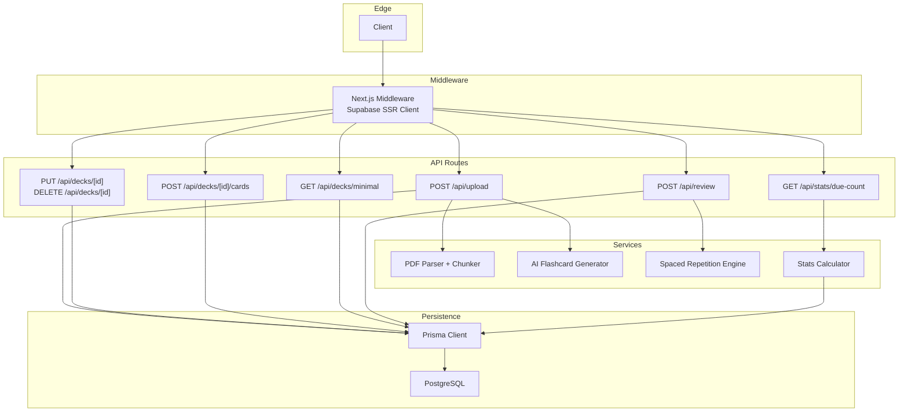
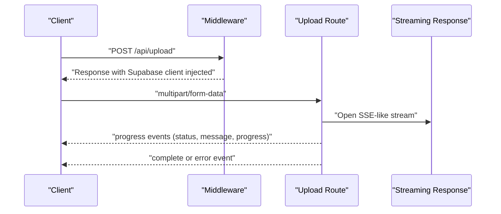
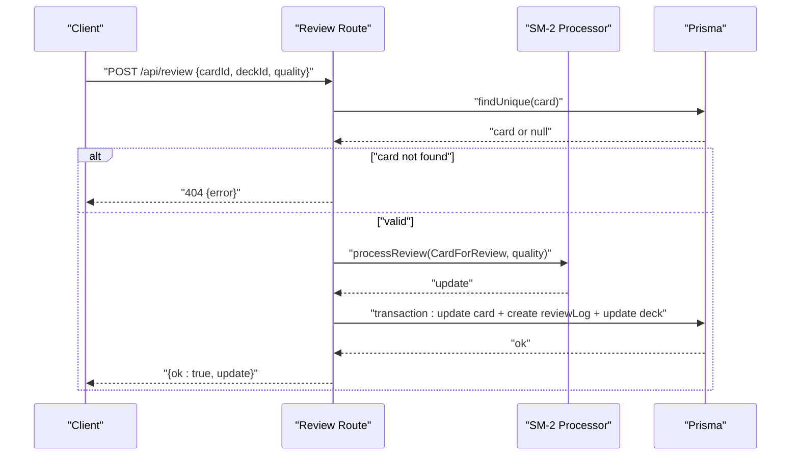
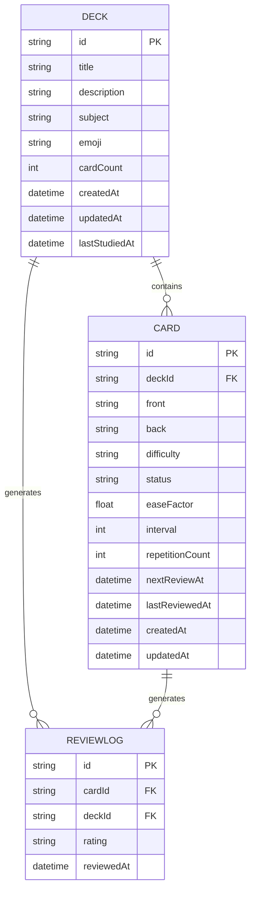

# API Reference

<cite>
**Referenced Files in This Document**
- [route.ts](file://src/app/api/upload/route.ts)
- [route.ts](file://src/app/api/decks/[id]/route.ts)
- [route.ts](file://src/app/api/decks/[id]/cards/route.ts)
- [route.ts](file://src/app/api/decks/minimal/route.ts)
- [route.ts](file://src/app/api/review/route.ts)
- [route.ts](file://src/app/api/stats/due-count/route.ts)
- [db.ts](file://src/lib/db.ts)
- [stats.ts](file://src/lib/stats.ts)
- [middleware.ts](file://src/utils/supabase/middleware.ts)
- [middleware.ts](file://middleware.ts)
- [schema.prisma](file://prisma/schema.prisma)
</cite>

## Table of Contents
1. [Introduction](#introduction)
2. [Project Structure](#project-structure)
3. [Core Components](#core-components)
4. [Architecture Overview](#architecture-overview)
5. [Detailed Component Analysis](#detailed-component-analysis)
6. [Dependency Analysis](#dependency-analysis)
7. [Performance Considerations](#performance-considerations)
8. [Troubleshooting Guide](#troubleshooting-guide)
9. [Conclusion](#conclusion)
10. [Appendices](#appendices)

## Introduction
This document describes the REST API surface for recall, focusing on upload processing, deck management, review session updates, and statistics endpoints. It covers HTTP methods, URL patterns, request/response schemas, authentication requirements, rate limiting, security considerations, and API versioning. Practical usage examples are included via cURL commands and code snippet paths.

## Project Structure
The API is implemented as Next.js App Router API routes under src/app/api. Authentication is handled by a server-side Supabase middleware that injects a Supabase client into server responses. Data persistence uses Prisma with PostgreSQL.

**Diagram sources**
- [middleware.ts:1-38](file://src/utils/supabase/middleware.ts#L1-L38)
- [middleware.ts:1-22](file://middleware.ts#L1-L22)
- [route.ts:1-298](file://src/app/api/upload/route.ts#L1-L298)
- [route.ts:1-43](file://src/app/api/decks/[id]/route.ts#L1-L43)
- [route.ts:1-40](file://src/app/api/decks/[id]/cards/route.ts#L1-L40)
- [route.ts:1-41](file://src/app/api/decks/minimal/route.ts#L1-L41)
- [route.ts:1-76](file://src/app/api/review/route.ts#L1-L76)
- [route.ts:1-15](file://src/app/api/stats/due-count/route.ts#L1-L15)
- [db.ts:1-68](file://src/lib/db.ts#L1-L68)
- [stats.ts:1-222](file://src/lib/stats.ts#L1-L222)
- [schema.prisma:1-51](file://prisma/schema.prisma#L1-L51)

**Section sources**
- [middleware.ts:1-38](file://src/utils/supabase/middleware.ts#L1-L38)
- [middleware.ts:1-22](file://middleware.ts#L1-L22)
- [schema.prisma:1-51](file://prisma/schema.prisma#L1-L51)

## Core Components
- Authentication and middleware: A server-side Supabase SSR client is created per request and attached to the response. This middleware runs on non-API routes and ensures session state is synchronized.
- Persistence: Prisma client connects to PostgreSQL, selecting the appropriate URL and enforcing sslmode=require in serverless contexts.
- Spaced repetition: Review endpoint applies SM-2 scheduling and persists updates atomically with review logs and deck timestamps.

**Section sources**
- [middleware.ts:1-38](file://src/utils/supabase/middleware.ts#L1-L38)
- [middleware.ts:1-22](file://middleware.ts#L1-L22)
- [db.ts:1-68](file://src/lib/db.ts#L1-L68)
- [route.ts:1-76](file://src/app/api/review/route.ts#L1-L76)

## Architecture Overview
The API follows a layered pattern:
- Edge: Client requests pass through Next.js middleware.
- Middleware: Injects Supabase client for session-awareness.
- Routes: Implement business logic, orchestrate services, and interact with Prisma.
- Persistence: PostgreSQL via Prisma.

**Diagram sources**
- [route.ts:86-298](file://src/app/api/upload/route.ts#L86-L298)
- [middleware.ts:1-22](file://middleware.ts#L1-L22)

## Detailed Component Analysis

### Upload Processing Endpoint
- Method and Path: POST /api/upload
- Purpose: Accepts a PDF, parses and chunks text, generates flashcards via AI, deduplicates, and creates a deck with cards.
- Request
  - Content-Type: multipart/form-data
  - Fields:
    - file (required): PDF file (type application/pdf, max 20 MB)
    - title (required): Deck title
    - subject (optional): Subject for emoji mapping and metadata
- Response
  - Streamed JSON lines until completion or error:
    - status: parsing/chunking/saving/complete/error
    - message: human-readable status
    - progress: integer percentage
    - deckId/cardCount (on complete)
  - Headers:
    - Content-Type: text/plain; charset=utf-8
    - Transfer-Encoding: chunked
    - X-Accel-Buffering: no
    - X-Content-Type-Options: nosniff
- Errors
  - 400: Invalid form data, missing file, unsupported file type, file too large, missing title
  - 429: Too many upload requests (IP-based rate limit window 60s, max 5)
  - 500: Missing environment variables (DATABASE_URL, OPENROUTER_API_KEY), database connectivity/authentication failures
  - Public error messages handle AI-specific conditions (rate limit, model availability, invalid API key, service overload)
- Security and Rate Limiting
  - IP-based sliding window rate limiter (per-process)
  - Streaming response disables proxy buffering for immediate delivery
- Example cURL
  - Upload a PDF with title and optional subject:
    - curl -X POST https://your-app.com/api/upload -F file=@notes.pdf -F title="Quantum Mechanics" -F subject="Physics"
- Notes
  - The endpoint validates text length after parsing; very short extracted text yields an error.
  - Deduplication filters near-duplicate front sides before saving.

**Section sources**
- [route.ts:86-298](file://src/app/api/upload/route.ts#L86-L298)

### Deck Management Endpoints
- PUT /api/decks/[id]
  - Purpose: Update deck metadata (title, description, emoji, subject).
  - Request body: { title, description, emoji, subject }
  - Response: Updated deck object
  - Errors: 500 on internal failure
- DELETE /api/decks/[id]
  - Purpose: Delete a deck and cascade-delete associated cards and logs.
  - Response: 204 No Content on success
  - Errors: 500 on internal failure

**Section sources**
- [route.ts:1-43](file://src/app/api/decks/[id]/route.ts#L1-L43)

### Add Card to Deck Endpoint
- POST /api/decks/[id]/cards
- Purpose: Add a single card to a deck and increment deck cardCount.
- Request body: { front, back }
- Response: Created card object
- Errors: 400 if fields are missing, 500 on internal failure

**Section sources**
- [route.ts:1-40](file://src/app/api/decks/[id]/cards/route.ts#L1-L40)

### Minimal Decks List Endpoint
- GET /api/decks/minimal
- Purpose: Lightweight deck list with due counts derived from card statuses and nextReviewAt.
- Response: Array of { id, title, dueCount }
- Errors: 500 on internal failure

**Section sources**
- [route.ts:1-41](file://src/app/api/decks/minimal/route.ts#L1-L41)

### Review Session Endpoint
- POST /api/review
- Purpose: Record a review rating (0–5) for a card and compute the next schedule using SM-2.
- Request body:
  - cardId (required)
  - deckId (required)
  - quality (required, 0–5)
- Response: { ok: true, update: computed_card_update }
- Errors:
  - 400: Missing fields or quality out of range
  - 404: Card not found
  - 500: Internal server error
- Behavior
  - Loads card, constructs CardForReview payload, computes update, and persists atomically:
    - card fields: easeFactor, interval, repetitionCount, nextReviewAt, status, lastReviewedAt
    - reviewLog: cardId, deckId, rating
    - deck: lastStudiedAt

**Diagram sources**
- [route.ts:1-76](file://src/app/api/review/route.ts#L1-L76)

**Section sources**
- [route.ts:1-76](file://src/app/api/review/route.ts#L1-L76)

### Statistics Endpoints
- GET /api/stats/due-count
  - Purpose: Returns the number of cards due for review (excluding NEW).
  - Response: { count: number }
  - Errors: 500 on internal failure

**Section sources**
- [route.ts:1-15](file://src/app/api/stats/due-count/route.ts#L1-L15)

## Dependency Analysis
- Middleware
  - Next.js middleware integrates a Supabase SSR client and forwards cookie state to the response.
- Persistence
  - Prisma client selects the appropriate database URL and enforces sslmode=require for serverless environments.
- Data Model
  - Deck, Card, and ReviewLog define relationships and defaults used by the API.

**Diagram sources**
- [schema.prisma:10-51](file://prisma/schema.prisma#L10-L51)

**Section sources**
- [db.ts:1-68](file://src/lib/db.ts#L1-L68)
- [schema.prisma:1-51](file://prisma/schema.prisma#L1-L51)

## Performance Considerations
- Upload pipeline
  - Streaming progress events reduce perceived latency and avoid buffering.
  - Max duration extended to support large PDFs and AI generation.
  - Deduplication reduces redundant cards.
- Database
  - Production prefers platform-provided Postgres URLs and enforces sslmode=require.
  - Transactional writes in review minimize race conditions.
- Caching and freshness
  - Some endpoints opt out of caching to ensure fresh due counts and minimal lists.

**Section sources**
- [route.ts:7-9](file://src/app/api/upload/route.ts#L7-L9)
- [route.ts:164-298](file://src/app/api/upload/route.ts#L164-L298)
- [route.ts:44-68](file://src/app/api/review/route.ts#L44-L68)
- [db.ts:41-63](file://src/lib/db.ts#L41-L63)
- [route.ts:5-5](file://src/app/api/stats/due-count/route.ts#L5-L5)
- [route.ts:4-4](file://src/app/api/decks/minimal/route.ts#L4-L4)

## Troubleshooting Guide
- Authentication and middleware
  - Ensure Supabase environment variables are configured; the middleware relies on NEXT_PUBLIC_SUPABASE_URL and NEXT_PUBLIC_SUPABASE_PUBLISHABLE_KEY.
- Database connectivity
  - Verify DATABASE_URL or related Postgres URLs are set; Prisma client selects the most suitable URL and adds sslmode=require when missing.
- Upload failures
  - Missing OPENROUTER_API_KEY or invalid configuration yields a 500 with a helpful message.
  - AI rate limits, model unavailability, or service overloads are mapped to user-friendly messages.
  - Very small extracted text from PDF triggers an error indicating insufficient readable text.
- Rate limiting
  - IP-based 60-second window with a cap of 5 requests per window; adjust or move to a distributed cache if scaling.
- Common integration issues
  - Using the wrong Content-Type for multipart uploads.
  - Not handling streamed JSON lines; ensure clients read until completion or error.
  - Expecting JSON instead of newline-delimited JSON events.

**Section sources**
- [middleware.ts:1-38](file://src/utils/supabase/middleware.ts#L1-L38)
- [middleware.ts:1-22](file://middleware.ts#L1-L22)
- [route.ts:86-106](file://src/app/api/upload/route.ts#L86-L106)
- [route.ts:11-63](file://src/app/api/upload/route.ts#L11-L63)
- [route.ts:179-189](file://src/app/api/upload/route.ts#L179-L189)
- [db.ts:8-63](file://src/lib/db.ts#L8-L63)

## Conclusion
recall’s API exposes straightforward endpoints for uploading PDFs, managing decks and cards, recording reviews, and retrieving due counts. Authentication is integrated via Supabase middleware, while Prisma handles robust persistence. The upload pipeline streams progress, and the review endpoint applies SM-2 scheduling atomically. Follow the request/response schemas and error handling guidance to integrate reliably.

## Appendices

### Authentication and Protected Routes
- Authentication is handled server-side by the Next.js middleware using a Supabase SSR client. It synchronizes cookies and prepares a client for server responses. API routes are invoked after middleware, inheriting session context.
- Environment variables:
  - NEXT_PUBLIC_SUPABASE_URL
  - NEXT_PUBLIC_SUPABASE_PUBLISHABLE_KEY

**Section sources**
- [middleware.ts:1-38](file://src/utils/supabase/middleware.ts#L1-L38)
- [middleware.ts:1-22](file://middleware.ts#L1-L22)

### API Versioning
- No explicit API versioning is present in the current implementation. To introduce versioning, consider prefixing routes (e.g., /api/v1/upload) or using headers.

[No sources needed since this section provides general guidance]

### Rate Limiting
- IP-based sliding window: 5 requests per 60 seconds. Exceeding this returns 429 with a user-facing message.

**Section sources**
- [route.ts:70-84](file://src/app/api/upload/route.ts#L70-L84)

### Security Considerations
- Transport encryption: sslmode=require is enforced for Postgres connections in serverless environments.
- Content-type hardening: X-Content-Type-Options is set to prevent MIME sniffing.
- Proxy buffering disabled for streaming uploads to ensure immediate delivery.

**Section sources**
- [db.ts:41-47](file://src/lib/db.ts#L41-L47)
- [route.ts:288-296](file://src/app/api/upload/route.ts#L288-L296)

### Data Models Reference
- Deck: id, title, description, subject, emoji, cardCount, timestamps, lastStudiedAt, relations to cards and review logs.
- Card: id, deckId, front/back, difficulty/status/easeFactor/interval/repetitionCount/nextReviewAt/lastReviewedAt, relation to deck and review logs.
- ReviewLog: id, cardId, deckId, rating, reviewedAt.

**Section sources**
- [schema.prisma:10-51](file://prisma/schema.prisma#L10-L51)