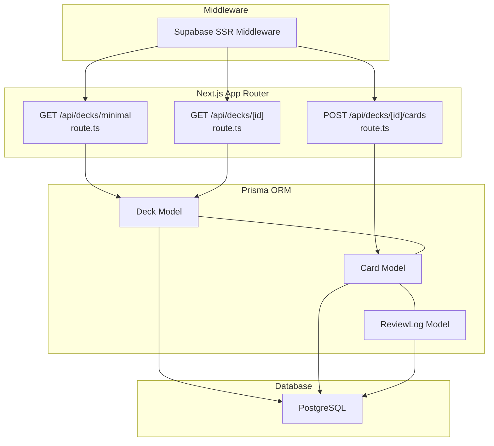
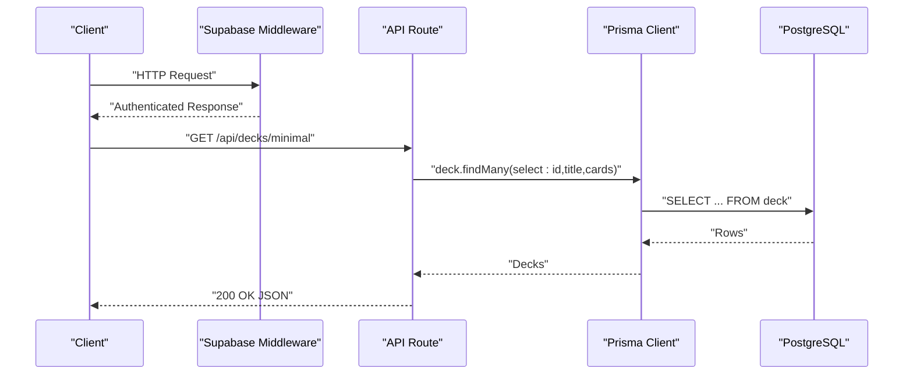
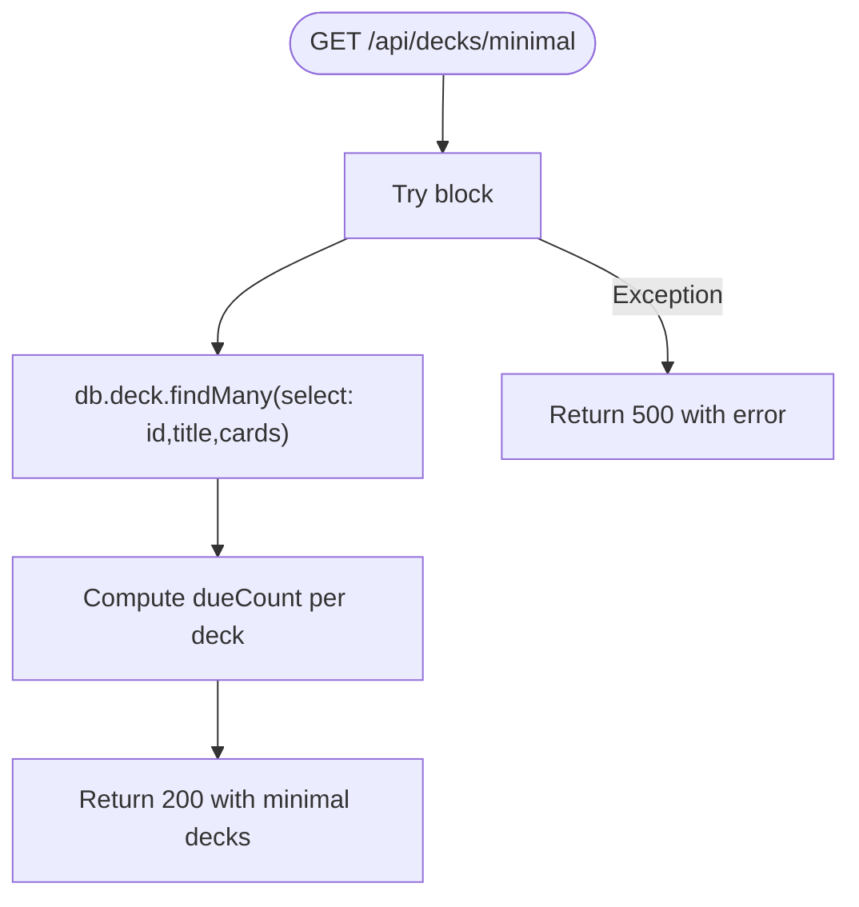
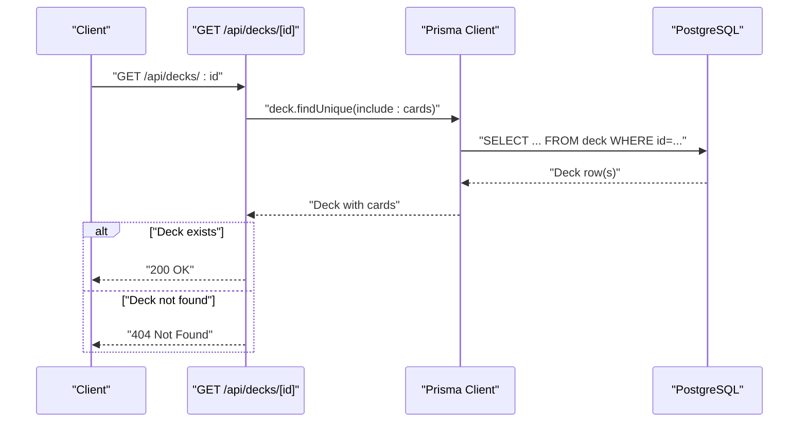
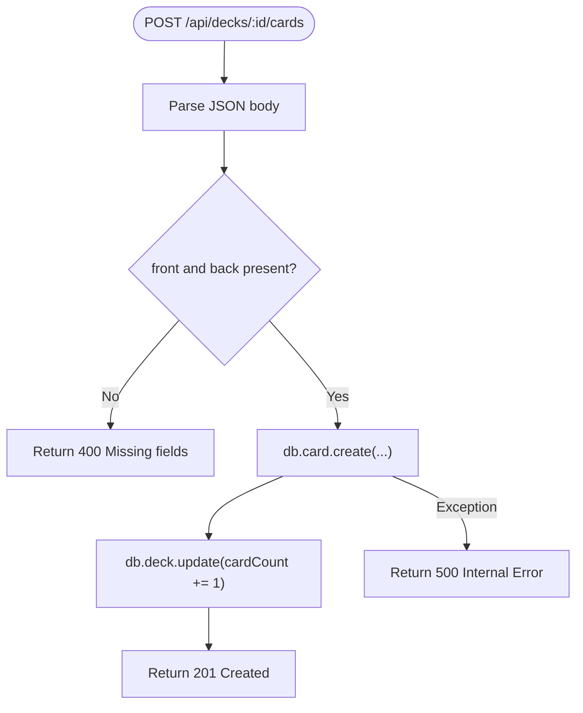
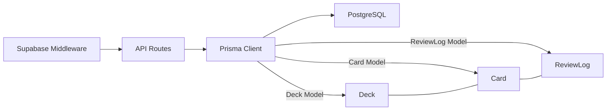

# Deck Management API

<cite>
**Referenced Files in This Document**
- [route.ts](file://src/app/api/decks/[id]/route.ts)
- [route.ts](file://src/app/api/decks/minimal/route.ts)
- [route.ts](file://src/app/api/decks/[id]/cards/route.ts)
- [db.ts](file://src/lib/db.ts)
- [schema.prisma](file://prisma/schema.prisma)
- [middleware.ts](file://middleware.ts)
- [middleware.ts](file://src/utils/supabase/middleware.ts)
- [page.tsx](file://src/app/decks/[id]/page.tsx)
- [page.tsx](file://src/app/decks/page.tsx)
</cite>

## Table of Contents
1. [Introduction](#introduction)
2. [Project Structure](#project-structure)
3. [Core Components](#core-components)
4. [Architecture Overview](#architecture-overview)
5. [Detailed Component Analysis](#detailed-component-analysis)
6. [Dependency Analysis](#dependency-analysis)
7. [Performance Considerations](#performance-considerations)
8. [Troubleshooting Guide](#troubleshooting-guide)
9. [Conclusion](#conclusion)

## Introduction
This document describes the Deck Management API, focusing on two primary endpoints:
- Retrieve a single deck with its cards: GET /api/decks/[id]
- Lightweight deck listing: GET /api/decks/minimal

It also documents related card creation functionality under deck contexts and outlines authentication, error handling, and performance considerations for large datasets.

## Project Structure
The Deck Management API is implemented using Next.js App Router under src/app/api. The backend relies on Prisma ORM and a PostgreSQL datasource. Authentication is handled via Supabase SSR middleware.

**Diagram sources**
- [route.ts](file://src/app/api/decks/minimal/route.ts)
- [route.ts](file://src/app/api/decks/[id]/route.ts)
- [route.ts](file://src/app/api/decks/[id]/cards/route.ts)
- [schema.prisma](file://prisma/schema.prisma)
- [middleware.ts](file://src/utils/supabase/middleware.ts)

**Section sources**
- [route.ts](file://src/app/api/decks/minimal/route.ts)
- [route.ts](file://src/app/api/decks/[id]/route.ts)
- [route.ts](file://src/app/api/decks/[id]/cards/route.ts)
- [schema.prisma](file://prisma/schema.prisma)
- [middleware.ts](file://src/utils/supabase/middleware.ts)

## Core Components
- Minimal Deck Listing Endpoint: Returns a compact representation of decks suitable for quick browsing.
- Single Deck Detail Endpoint: Retrieves a deck with included cards for detailed views.
- Card Creation Endpoint: Adds a new card to a specific deck and updates deck metadata.

**Section sources**
- [route.ts](file://src/app/api/decks/minimal/route.ts)
- [route.ts](file://src/app/api/decks/[id]/route.ts)
- [route.ts](file://src/app/api/decks/[id]/cards/route.ts)

## Architecture Overview
The API leverages Supabase SSR middleware for authentication and Prisma for data access. Requests flow through middleware, then to API routes, which query the database via Prisma.

**Diagram sources**
- [middleware.ts](file://src/utils/supabase/middleware.ts)
- [route.ts](file://src/app/api/decks/minimal/route.ts)
- [db.ts](file://src/lib/db.ts)

## Detailed Component Analysis

### GET /api/decks/minimal
- Purpose: Lightweight deck listing for efficient browsing.
- Request
  - Method: GET
  - Path: /api/decks/minimal
  - Query parameters: None
  - Headers: Standard browser headers; authentication handled by middleware
- Response
  - 200 OK: Array of minimal deck objects
  - 500 Internal Server Error: Error payload if database query fails
- Schema (minimal deck)
  - id: string
  - title: string
  - dueCount: number
- Behavior
  - Fetches decks with selected fields and computes dueCount by filtering cards whose nextReviewAt is due.
  - Uses force-dynamic to bypass static generation.

**Diagram sources**
- [route.ts](file://src/app/api/decks/minimal/route.ts)

**Section sources**
- [route.ts](file://src/app/api/decks/minimal/route.ts)

### GET /api/decks/[id]
- Purpose: Retrieve a single deck with all associated cards.
- Request
  - Method: GET
  - Path: /api/decks/[id]
  - Path parameters:
    - id: string (required)
  - Query parameters: None
  - Headers: Standard browser headers; authentication handled by middleware
- Response
  - 200 OK: Full deck object with cards array
  - 404 Not Found: If deck does not exist
  - 500 Internal Server Error: On database errors
- Schema (full deck)
  - id: string
  - title: string
  - description: string | null
  - subject: string | null
  - emoji: string
  - cardCount: number
  - createdAt: datetime
  - updatedAt: datetime
  - lastStudiedAt: datetime | null
  - cards: array of card objects
    - id: string
    - front: string
    - back: string
    - difficulty: string
    - status: string
    - easeFactor: number
    - interval: number
    - repetitionCount: number
    - nextReviewAt: datetime
    - lastReviewedAt: datetime | null
    - createdAt: datetime
    - updatedAt: datetime
- Behavior
  - Queries deck by id and includes all cards ordered by creation time.
  - Returns 404 if deck is not found.

**Diagram sources**
- [route.ts](file://src/app/api/decks/[id]/route.ts)
- [page.tsx](file://src/app/decks/[id]/page.tsx)

**Section sources**
- [route.ts](file://src/app/api/decks/[id]/route.ts)
- [page.tsx](file://src/app/decks/[id]/page.tsx)

### POST /api/decks/[id]/cards
- Purpose: Add a new card to a specific deck.
- Request
  - Method: POST
  - Path: /api/decks/[id]/cards
  - Path parameters:
    - id: string (required)
  - Headers: Content-Type: application/json
  - Body fields:
    - front: string (required)
    - back: string (required)
- Response
  - 201 Created: Newly created card object
  - 400 Bad Request: Missing required fields
  - 500 Internal Server Error: On database errors
- Behavior
  - Validates presence of front and back.
  - Creates card with default scheduling fields.
  - Increments deck cardCount atomically.

**Diagram sources**
- [route.ts](file://src/app/api/decks/[id]/cards/route.ts)

**Section sources**
- [route.ts](file://src/app/api/decks/[id]/cards/route.ts)

### Related: PUT /api/decks/[id] and DELETE /api/decks/[id]
- PUT updates deck metadata (title, description, emoji, subject).
- DELETE removes a deck and cascades card deletions.
- These endpoints exist in the codebase and complement the retrieval and card creation endpoints.

**Section sources**
- [route.ts](file://src/app/api/decks/[id]/route.ts)

## Dependency Analysis
- Authentication: Supabase SSR middleware wraps requests globally, ensuring authenticated sessions for protected routes.
- Data Access: Prisma Client connects to PostgreSQL using environment variables and applies SSL mode requirements for serverless environments.
- Models: Deck and Card models define the schema; Card belongs to Deck with cascade deletion.

**Diagram sources**
- [middleware.ts](file://src/utils/supabase/middleware.ts)
- [db.ts](file://src/lib/db.ts)
- [schema.prisma](file://prisma/schema.prisma)

**Section sources**
- [middleware.ts](file://src/utils/supabase/middleware.ts)
- [db.ts](file://src/lib/db.ts)
- [schema.prisma](file://prisma/schema.prisma)

## Performance Considerations
- Minimal Listing Efficiency
  - The minimal endpoint selects only essential fields and computes dueCount client-side after filtering cards. This reduces payload size and improves responsiveness for browsing.
  - For very large decks, consider adding server-side aggregation to avoid scanning all cards.
- Card Retrieval Scalability
  - The single deck endpoint includes all cards and orders them by creation time. For decks with thousands of cards, consider pagination or lazy-loading card lists.
- Database Connectivity
  - Prisma is configured to prefer pooled connections in production and enforce SSL mode for serverless environments. Ensure DATABASE_URL is properly set in production to avoid connection failures.
- Caching and Freshness
  - The minimal endpoint is marked force-dynamic; for frequent reads, consider implementing cache headers or CDN caching strategies where appropriate.

[No sources needed since this section provides general guidance]

## Troubleshooting Guide
- 404 Not Found for GET /api/decks/[id]
  - Occurs when the requested deck ID does not exist in the database.
  - Verify the deck ID and database connectivity.
- 500 Internal Server Error
  - Database query failures or middleware errors surface as 500 responses.
  - Check Prisma configuration and environment variables (DATABASE_URL).
- Authentication Issues
  - Global middleware integrates with Supabase SSR. Ensure NEXT_PUBLIC_SUPABASE_URL and NEXT_PUBLIC_SUPABASE_PUBLISHABLE_KEY are configured.
- Large Deck Performance
  - If GET /api/decks/[id] becomes slow, implement pagination or limit the number of cards returned per request.

**Section sources**
- [route.ts](file://src/app/api/decks/[id]/route.ts)
- [route.ts](file://src/app/api/decks/minimal/route.ts)
- [db.ts](file://src/lib/db.ts)
- [middleware.ts](file://src/utils/supabase/middleware.ts)

## Conclusion
The Deck Management API provides efficient endpoints for browsing and managing decks and cards. The minimal listing supports fast navigation, while the detailed deck endpoint enables comprehensive views. Authentication is enforced via Supabase middleware, and Prisma handles robust data access. For large-scale usage, consider pagination, caching, and optimized queries to maintain performance.