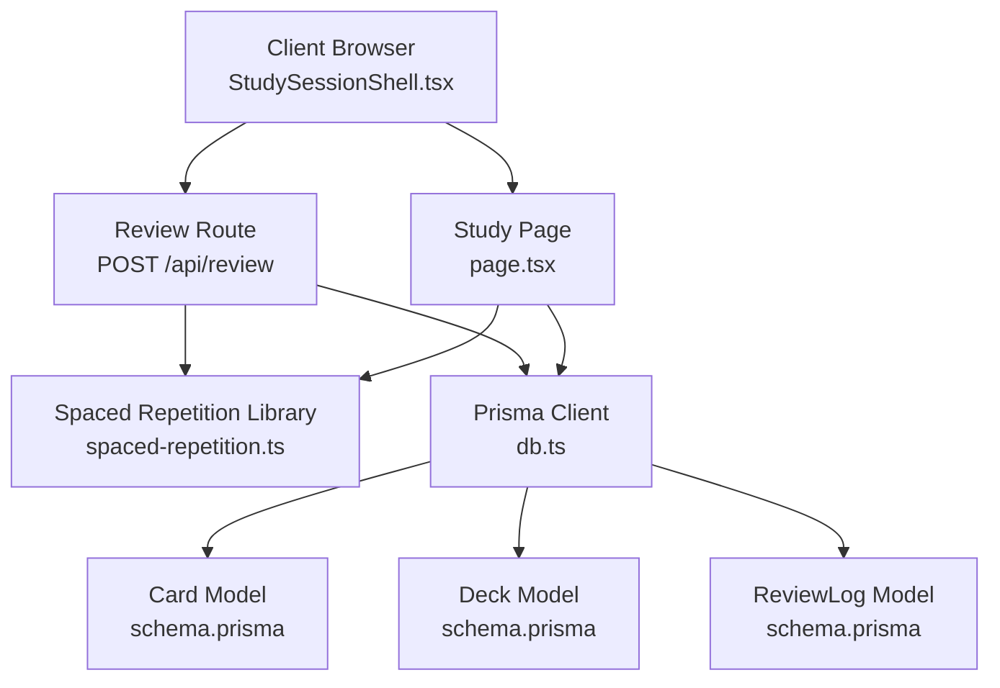
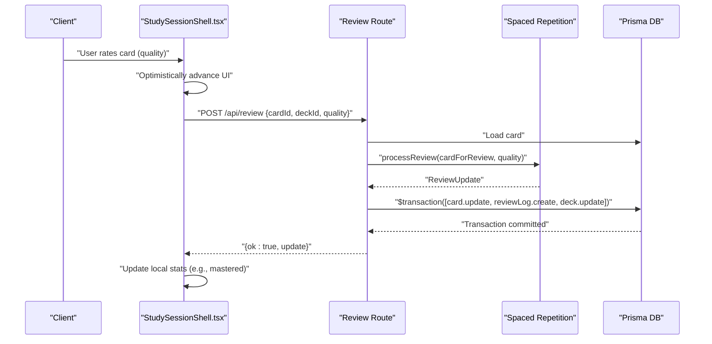
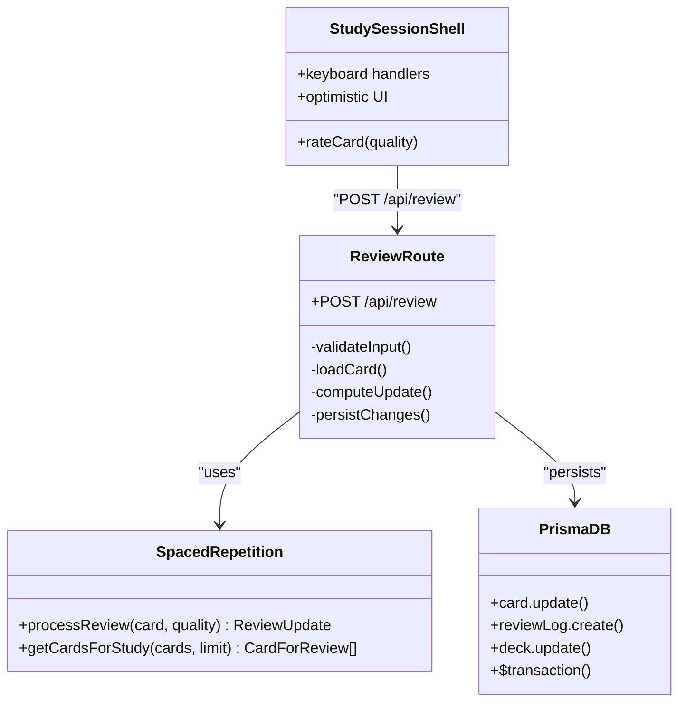
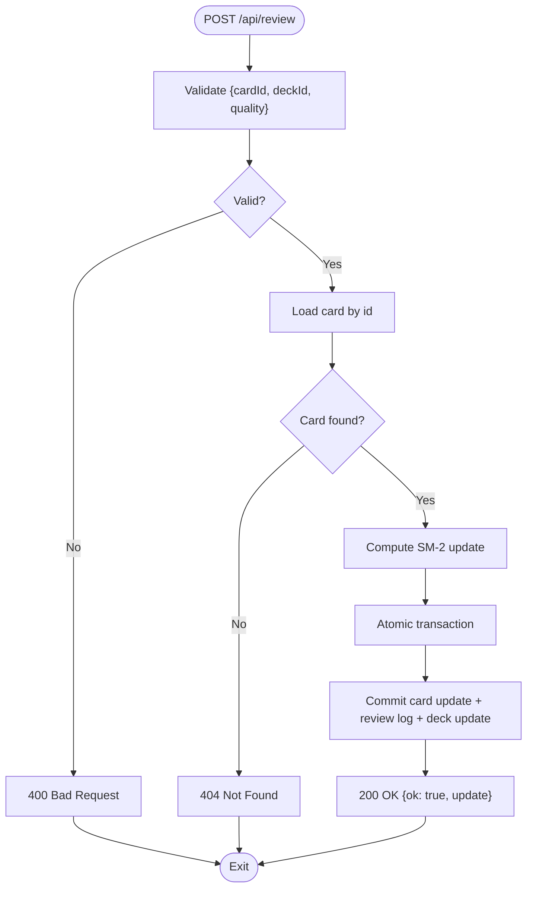
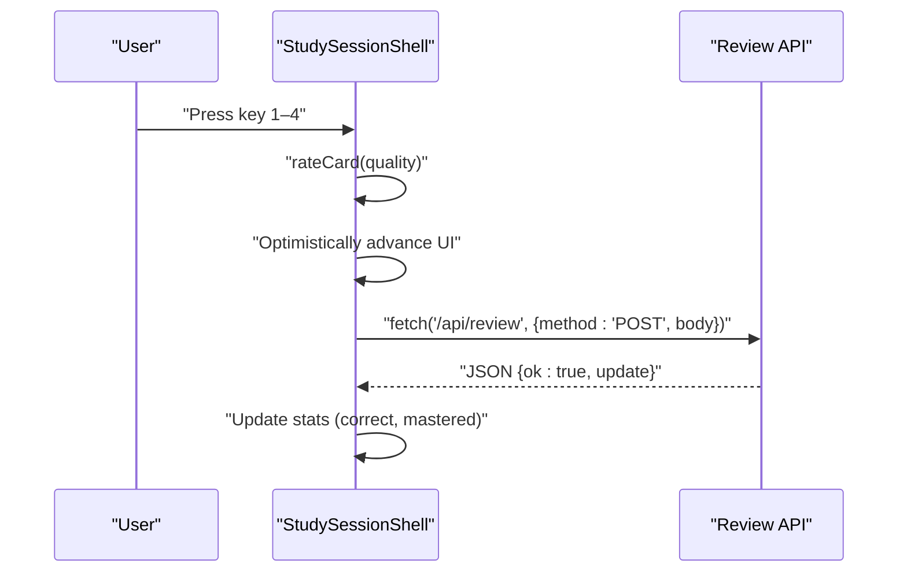
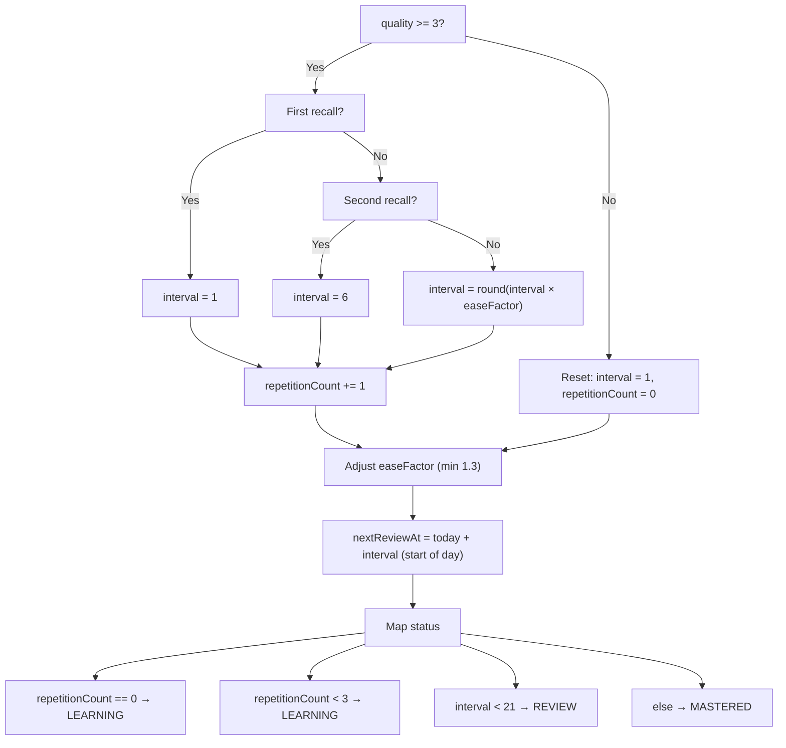

# Review API

<cite>
**Referenced Files in This Document**
- [route.ts](file://src/app/api/review/route.ts)
- [spaced-repetition.ts](file://src/lib/spaced-repetition.ts)
- [db.ts](file://src/lib/db.ts)
- [schema.prisma](file://prisma/schema.prisma)
- [StudySessionShell.tsx](file://src/components/flashcard/StudySessionShell.tsx)
- [page.tsx](file://src/app/decks/[id]/study/page.tsx)
- [Flashcard3D.tsx](file://src/components/flashcard/Flashcard3D.tsx)
- [constants.ts](file://src/lib/constants.ts)
</cite>

## Table of Contents
1. [Introduction](#introduction)
2. [Project Structure](#project-structure)
3. [Core Components](#core-components)
4. [Architecture Overview](#architecture-overview)
5. [Detailed Component Analysis](#detailed-component-analysis)
6. [Dependency Analysis](#dependency-analysis)
7. [Performance Considerations](#performance-considerations)
8. [Troubleshooting Guide](#troubleshooting-guide)
9. [Conclusion](#conclusion)

## Introduction
This document describes the Review API endpoint that powers spaced repetition learning. It handles card rating submissions, applies the SM-2 algorithm to compute new scheduling parameters, persists updates atomically, and integrates with the client-side study session UI. The endpoint supports four rating categories mapped to numeric quality scores and returns updated scheduling information for the card.

## Project Structure
The review workflow spans serverless routes, a dedicated spaced repetition library, Prisma database models, and a React study session shell.

**Diagram sources**
- [route.ts:1-76](file://src/app/api/review/route.ts#L1-L76)
- [spaced-repetition.ts:1-141](file://src/lib/spaced-repetition.ts#L1-L141)
- [db.ts:1-68](file://src/lib/db.ts#L1-L68)
- [schema.prisma:10-51](file://prisma/schema.prisma#L10-L51)
- [StudySessionShell.tsx:1-430](file://src/components/flashcard/StudySessionShell.tsx#L1-L430)
- [page.tsx:1-92](file://src/app/decks/[id]/study/page.tsx#L1-L92)

**Section sources**
- [route.ts:1-76](file://src/app/api/review/route.ts#L1-L76)
- [spaced-repetition.ts:1-141](file://src/lib/spaced-repetition.ts#L1-L141)
- [db.ts:1-68](file://src/lib/db.ts#L1-L68)
- [schema.prisma:10-51](file://prisma/schema.prisma#L10-L51)
- [StudySessionShell.tsx:1-430](file://src/components/flashcard/StudySessionShell.tsx#L1-L430)
- [page.tsx:1-92](file://src/app/decks/[id]/study/page.tsx#L1-L92)

## Core Components
- Review API route: Validates input, loads the card, computes scheduling via SM-2, and persists updates atomically.
- Spaced repetition library: Implements SM-2 logic, status mapping, and session queue builder.
- Database models: Define Card, Deck, and ReviewLog entities with Prisma.
- Client-side study session: Provides keyboard-driven rating and optimistic UI updates.

Key responsibilities:
- Request validation and error responses
- SM-2 computation and status transitions
- Atomic persistence of card update, review log creation, and deck last-studied timestamp
- Client integration via fetch and optimistic rendering

**Section sources**
- [route.ts:5-76](file://src/app/api/review/route.ts#L5-L76)
- [spaced-repetition.ts:29-76](file://src/lib/spaced-repetition.ts#L29-L76)
- [schema.prisma:24-50](file://prisma/schema.prisma#L24-L50)
- [StudySessionShell.tsx:68-125](file://src/components/flashcard/StudySessionShell.tsx#L68-L125)

## Architecture Overview
The review flow is a request-response process with optimistic client updates and atomic server-side persistence.

**Diagram sources**
- [StudySessionShell.tsx:68-125](file://src/components/flashcard/StudySessionShell.tsx#L68-L125)
- [route.ts:5-76](file://src/app/api/review/route.ts#L5-L76)
- [spaced-repetition.ts:29-76](file://src/lib/spaced-repetition.ts#L29-L76)
- [db.ts:1-68](file://src/lib/db.ts#L1-L68)

## Detailed Component Analysis

### API Endpoint Definition
- Method: POST
- Path: /api/review
- Purpose: Accept a card rating and return updated scheduling information

Request payload structure:
- cardId: string (required)
- deckId: string (required)
- quality: number (required, 0–5)

Response format:
- ok: boolean
- update: ReviewUpdate object containing:
  - easeFactor: number
  - interval: number
  - repetitionCount: number
  - nextReviewAt: ISO string
  - status: "NEW" | "LEARNING" | "REVIEW" | "MASTERED"

Error responses:
- 400 Bad Request: Missing fields or invalid quality range
- 404 Not Found: Card not found
- 500 Internal Server Error: Unhandled exception

Processing logic:
- Validates presence and range of quality
- Loads card from database
- Builds CardForReview object from Prisma record
- Calls processReview to compute new scheduling
- Persists changes atomically:
  - Updates card fields (easeFactor, interval, repetitionCount, nextReviewAt, status, lastReviewedAt)
  - Creates a ReviewLog entry
  - Updates deck lastStudiedAt

Integration with SM-2:
- Uses the SM-2 algorithm to adjust interval, repetition count, and ease factor
- Applies status mapping based on repetition count and interval thresholds
- Normalizes nextReviewAt to start-of-day

**Section sources**
- [route.ts:5-76](file://src/app/api/review/route.ts#L5-L76)
- [spaced-repetition.ts:29-76](file://src/lib/spaced-repetition.ts#L29-L76)
- [schema.prisma:24-50](file://prisma/schema.prisma#L24-L50)

### Spaced Repetition Algorithm (SM-2)
The algorithm computes scheduling parameters based on the quality score:
- Correct response (quality ≥ 3):
  - First recall: interval = 1
  - Second recall: interval = 6
  - Subsequent recalls: interval = round(interval × easeFactor)
  - repetitionCount += 1
- Incorrect response (quality < 3):
  - Reset: repetitionCount = 0, interval = 1
- Ease factor adjustment:
  - easeFactor += (0.1 − (5 − quality) × (0.08 + (5 − quality) × 0.02))
  - Minimum easeFactor = 1.3 (rounded to 3 decimals)
- Status mapping:
  - repetitionCount = 0 → LEARNING
  - repetitionCount < 3 → LEARNING
  - interval < 21 → REVIEW
  - otherwise → MASTERED
- nextReviewAt:
  - Today + interval days, normalized to start of day

Rating system mapping:
- Quality 0–5 corresponds to:
  - 0: blackout
  - 1: forgot
  - 2: hard
  - 3: hard
  - 4: good
  - 5: easy

Progress tracking:
- Client-side counters track studied, correct, and newly mastered cards during a session
- The server returns status to help the client highlight newly mastered cards

**Section sources**
- [spaced-repetition.ts:29-76](file://src/lib/spaced-repetition.ts#L29-L76)
- [StudySessionShell.tsx:68-125](file://src/components/flashcard/StudySessionShell.tsx#L68-L125)

### Database Schema and Transactions
Models involved:
- Card: stores scheduling fields (easeFactor, interval, repetitionCount, nextReviewAt, lastReviewedAt, status)
- Deck: tracks lastStudiedAt
- ReviewLog: records each rating with cardId, deckId, and rating string

Atomic transaction ensures consistency:
- card.update: apply new scheduling and status
- reviewLog.create: log the rating
- deck.update: refresh lastStudiedAt

**Section sources**
- [schema.prisma:24-50](file://prisma/schema.prisma#L24-L50)
- [route.ts:44-68](file://src/app/api/review/route.ts#L44-L68)

### Client-Side Integration Patterns
StudySessionShell orchestrates the user experience:
- Keyboard shortcuts trigger rating actions (keys 1–4 map to rating options)
- Optimistic UI advances immediately upon rating submission
- Fetch call to /api/review updates server state asynchronously
- On success, the client checks the returned status to highlight newly mastered cards
- Confetti effect is triggered for perfect ratings

Study page builds the initial card queue:
- Loads deck and cards
- Converts Prisma records to CardForReview format
- Uses getCardsForStudy to build a due queue (or shuffles all cards in “all” mode)

Flashcard component:
- Handles flipping and basic difficulty display
- Delegates rating to parent StudySessionShell

**Section sources**
- [StudySessionShell.tsx:68-125](file://src/components/flashcard/StudySessionShell.tsx#L68-L125)
- [page.tsx:60-82](file://src/app/decks/[id]/study/page.tsx#L60-L82)
- [Flashcard3D.tsx:1-113](file://src/components/flashcard/Flashcard3D.tsx#L1-L113)
- [constants.ts:19-30](file://src/lib/constants.ts#L19-L30)

## Architecture Overview

**Diagram sources**
- [route.ts:5-76](file://src/app/api/review/route.ts#L5-L76)
- [spaced-repetition.ts:29-104](file://src/lib/spaced-repetition.ts#L29-L104)
- [db.ts:1-68](file://src/lib/db.ts#L1-L68)
- [StudySessionShell.tsx:68-125](file://src/components/flashcard/StudySessionShell.tsx#L68-L125)

## Detailed Component Analysis

### Review Endpoint Flow

**Diagram sources**
- [route.ts:5-76](file://src/app/api/review/route.ts#L5-L76)
- [spaced-repetition.ts:29-76](file://src/lib/spaced-repetition.ts#L29-L76)

### Client-Side Rating Workflow

**Diagram sources**
- [StudySessionShell.tsx:68-125](file://src/components/flashcard/StudySessionShell.tsx#L68-L125)
- [route.ts:5-76](file://src/app/api/review/route.ts#L5-L76)

### SM-2 Status Mapping

**Diagram sources**
- [spaced-repetition.ts:29-76](file://src/lib/spaced-repetition.ts#L29-L76)

## Dependency Analysis
- Review route depends on:
  - Prisma client for database operations
  - Spaced repetition library for scheduling logic
- Study page depends on:
  - Prisma client to load deck and cards
  - Spaced repetition library to build the due queue
- Client study shell depends on:
  - Review route for rating submissions
  - Spaced repetition library for rating option mapping

Potential circular dependencies:
- None observed between route, library, and components

External dependencies:
- Prisma client and PostgreSQL
- Next.js server runtime

**Section sources**
- [route.ts:1-3](file://src/app/api/review/route.ts#L1-L3)
- [page.tsx:3-6](file://src/app/decks/[id]/study/page.tsx#L3-L6)
- [StudySessionShell.tsx:1-10](file://src/components/flashcard/StudySessionShell.tsx#L1-L10)

## Performance Considerations
- Atomic transaction reduces write contention and ensures consistency across card, review log, and deck updates.
- nextReviewAt normalization to start of day simplifies daily due calculations.
- getCardsForStudy uses randomization to distribute cards evenly across sessions.
- Client-side optimistic updates improve perceived responsiveness; server responses reconcile state.

## Troubleshooting Guide
Common errors and resolutions:
- 400 Bad Request:
  - Missing fields: Ensure cardId, deckId, and quality are present.
  - Invalid quality: quality must be within 0–5.
- 404 Not Found:
  - Card not found: Verify cardId exists and belongs to the deck.
- 500 Internal Server Error:
  - Database connectivity or Prisma client misconfiguration.
  - Check environment variables for DATABASE_URL and SSL requirements.
- Edge cases:
  - First recall sets interval to 1; subsequent intervals grow exponentially with easeFactor.
  - Reset on incorrect responses clears prior progress and restarts learning phase.
  - Status transitions move from LEARNING to REVIEW to MASTERED as intervals increase.

Operational tips:
- Confirm Prisma schema matches runtime expectations.
- Validate client-side fetch payload structure aligns with server expectations.
- Monitor ReviewLog entries to verify rating persistence.

**Section sources**
- [route.ts:15-26](file://src/app/api/review/route.ts#L15-L26)
- [db.ts:8-47](file://src/lib/db.ts#L8-L47)
- [spaced-repetition.ts:29-76](file://src/lib/spaced-repetition.ts#L29-L76)

## Conclusion
The Review API provides a robust, SM-2-powered mechanism for spaced repetition. It validates inputs, computes accurate scheduling updates, persists changes atomically, and integrates seamlessly with the client’s study session. The system balances correctness with performance through optimistic UI updates and efficient database transactions, enabling smooth learning workflows.