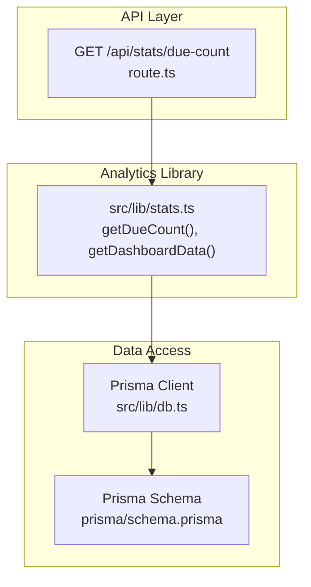
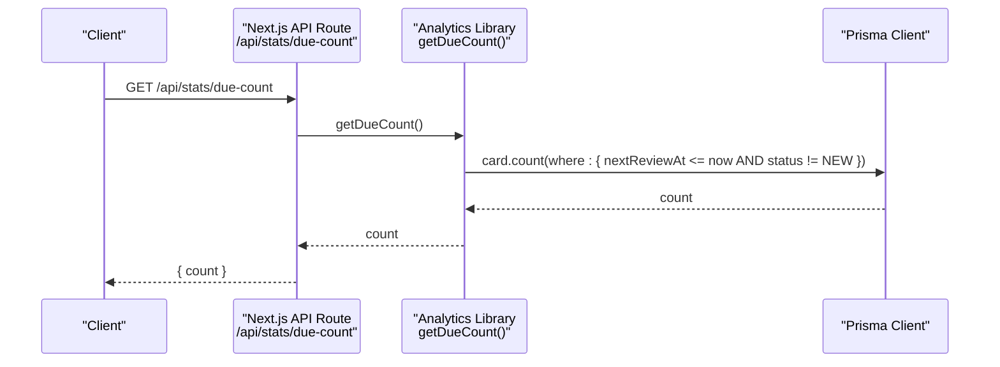
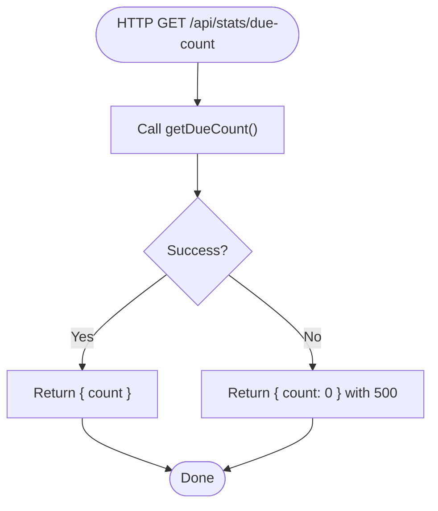
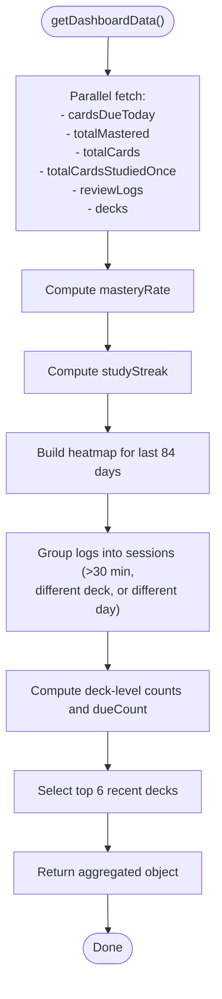
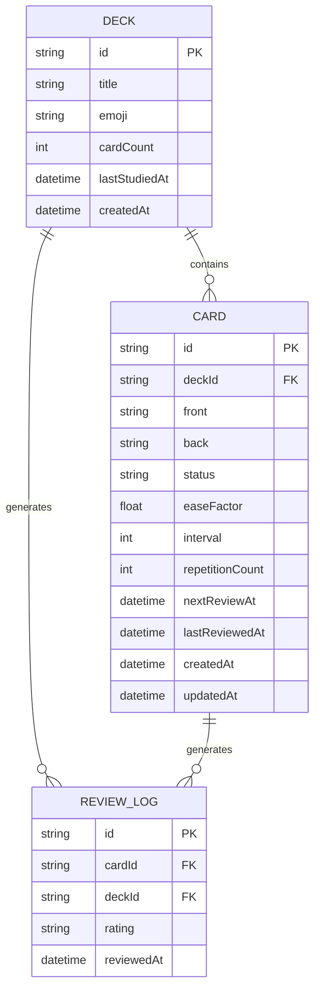
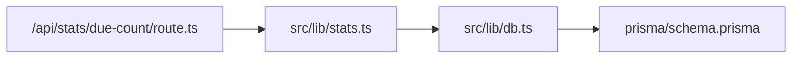

# Statistics API

<cite>
**Referenced Files in This Document**
- [route.ts](file://src/app/api/stats/due-count/route.ts)
- [stats.ts](file://src/lib/stats.ts)
- [db.ts](file://src/lib/db.ts)
- [schema.prisma](file://prisma/schema.prisma)
- [page.tsx](file://src/app/page.tsx)
- [ActivityHeatmap.tsx](file://src/components/stats/ActivityHeatmap.tsx)
- [MasteryRing.tsx](file://src/components/stats/MasteryRing.tsx)
</cite>

## Table of Contents
1. [Introduction](#introduction)
2. [Project Structure](#project-structure)
3. [Core Components](#core-components)
4. [Architecture Overview](#architecture-overview)
5. [Detailed Component Analysis](#detailed-component-analysis)
6. [Dependency Analysis](#dependency-analysis)
7. [Performance Considerations](#performance-considerations)
8. [Troubleshooting Guide](#troubleshooting-guide)
9. [Conclusion](#conclusion)

## Introduction
This document provides comprehensive API documentation for the statistics endpoints that power learning analytics and dashboard insights. It covers:
- GET /api/stats/due-count: Returns the count of overdue cards requiring review.
- GET /api/stats/overview: Returns comprehensive learning metrics for dashboards (currently implemented server-side in the main dashboard page and library functions).

The documentation details request parameters, response schemas, data aggregation logic, time range filters, calculation methods, and practical guidance for integrating charts and achieving real-time updates. It also outlines caching strategies and performance optimizations for frequently accessed statistics.

## Project Structure
The statistics API is implemented as Next.js App Router API routes backed by shared analytics logic and a Prisma-based data layer. The relevant components are organized as follows:
- API routes under src/app/api/stats/
- Analytics and aggregation logic under src/lib/stats.ts
- Database client initialization under src/lib/db.ts
- Prisma schema defining the domain model under prisma/schema.prisma
- Frontend dashboard pages and components that consume these APIs under src/app and src/components

**Diagram sources**
- [route.ts:1-15](file://src/app/api/stats/due-count/route.ts#L1-L15)
- [stats.ts:20-31](file://src/lib/stats.ts#L20-L31)
- [db.ts:1-68](file://src/lib/db.ts#L1-L68)
- [schema.prisma:1-51](file://prisma/schema.prisma#L1-L51)

**Section sources**
- [route.ts:1-15](file://src/app/api/stats/due-count/route.ts#L1-L15)
- [stats.ts:20-31](file://src/lib/stats.ts#L20-L31)
- [db.ts:1-68](file://src/lib/db.ts#L1-L68)
- [schema.prisma:1-51](file://prisma/schema.prisma#L1-L51)

## Core Components
This section documents the two primary statistics endpoints and their underlying logic.

### GET /api/stats/due-count
Purpose: Returns the number of cards whose next review time has passed (overdue) and are not newly created.

- Method: GET
- Path: /api/stats/due-count
- Authentication: None (public)
- Request parameters: None
- Response body:
  - count: integer representing overdue card count
- Error handling:
  - On failure, returns 500 with count set to 0

Response schema:
{
  "count": integer
}

Processing logic:
- Aggregates cards using a database count query filtered by:
  - nextReviewAt less than or equal to current time
  - status not equal to NEW
- Returns the resulting count

Example usage:
- Frontend fetches this endpoint to display "Due Today" on the dashboard.

**Section sources**
- [route.ts:1-15](file://src/app/api/stats/due-count/route.ts#L1-L15)
- [stats.ts:20-31](file://src/lib/stats.ts#L20-L31)

### GET /api/stats/overview
Note: As implemented, the overview endpoint is not exposed as a dedicated API route. Instead, the dashboard page performs the computation server-side and renders the UI. The analytics logic resides in the shared library and can be reused by an API route if desired.

Current implementation highlights:
- Computes multiple metrics in a single request:
  - Total cards
  - Cards due today
  - Mastery rate (percent)
  - Study streak (consecutive active days)
  - Heatmap data for the last 84 days
  - Recent sessions (grouped study sessions)
  - Deck-level counts and due counts
  - Recent decks (most recently touched)
- Uses a parallelized data fetch pattern to minimize latency.

Response schema outline:
{
  "totalCards": integer,
  "cardsDueToday": integer,
  "masteryRate": integer,
  "studyStreak": integer,
  "heatmap": [
    {
      "date": string,
      "count": integer
    }
  ],
  "sessions": [
    {
      "id": string,
      "deckId": string,
      "deckTitle": string,
      "emoji": string,
      "date": string,
      "cardsStudied": integer,
      "accuracy": integer,
      "durationMin": integer
    }
  ],
  "decks": [
    {
      "id": string,
      "title": string,
      "emoji": string,
      "cardCount": integer,
      "counts": {
        "new": integer,
        "learning": integer,
        "review": integer,
        "mastered": integer
      },
      "dueCount": integer,
      "lastTouchedAt": string
    }
  ],
  "recentDecks": array
}

Calculation methods and time ranges:
- Cards due today: Filter cards where nextReviewAt falls within the current calendar day.
- Mastery rate: Rounded percentage of MASTERED cards among cards that have been studied at least once.
- Study streak: Consecutive active days computed from review logs.
- Heatmap: Counts per calendar day across the last 84 days (12 weeks).
- Sessions: Group logs into sessions separated by more than 30 minutes, different decks, or different calendar days; compute accuracy and duration per session.
- Deck-level counts: Segregated counts by status and due count for each deck.
- Recent decks: Top 6 decks sorted by last touch time.

Integration guidance:
- Frontend can call the overview endpoint (once implemented) to populate dashboard widgets.
- Chart data formatting:
  - Heatmap: Array of { date, count } entries covering the last 84 days.
  - Sessions: Array of session objects with accuracy and duration for trend visualization.
  - Mastery ring: Single percentage value for radial visualization.

**Section sources**
- [stats.ts:50-221](file://src/lib/stats.ts#L50-L221)
- [page.tsx:15-26](file://src/app/page.tsx#L15-L26)
- [ActivityHeatmap.tsx:1-74](file://src/components/stats/ActivityHeatmap.tsx#L1-L74)
- [MasteryRing.tsx:1-63](file://src/components/stats/MasteryRing.tsx#L1-L63)

## Architecture Overview
The statistics pipeline integrates API routes, analytics functions, and the data layer.

**Diagram sources**
- [route.ts:7-14](file://src/app/api/stats/due-count/route.ts#L7-L14)
- [stats.ts:20-31](file://src/lib/stats.ts#L20-L31)
- [db.ts:1-68](file://src/lib/db.ts#L1-L68)

## Detailed Component Analysis

### Due Count Endpoint
The due count endpoint is a thin wrapper around the analytics library. It enforces dynamic rendering and returns a simple JSON payload.

**Diagram sources**
- [route.ts:7-14](file://src/app/api/stats/due-count/route.ts#L7-L14)
- [stats.ts:20-31](file://src/lib/stats.ts#L20-L31)

**Section sources**
- [route.ts:1-15](file://src/app/api/stats/due-count/route.ts#L1-L15)
- [stats.ts:20-31](file://src/lib/stats.ts#L20-L31)

### Overview Data Aggregation
The overview aggregation function orchestrates multiple data sources and computations.

**Diagram sources**
- [stats.ts:50-221](file://src/lib/stats.ts#L50-L221)

**Section sources**
- [stats.ts:50-221](file://src/lib/stats.ts#L50-L221)

### Data Model Relationships
The statistics rely on three core models: Deck, Card, and ReviewLog.

**Diagram sources**
- [schema.prisma:10-51](file://prisma/schema.prisma#L10-L51)

**Section sources**
- [schema.prisma:10-51](file://prisma/schema.prisma#L10-L51)

## Dependency Analysis
The statistics API depends on:
- Analytics library for computation logic
- Prisma client for database queries
- Prisma schema for model definitions

**Diagram sources**
- [route.ts:1-15](file://src/app/api/stats/due-count/route.ts#L1-L15)
- [stats.ts:1-3](file://src/lib/stats.ts#L1-L3)
- [db.ts:1-68](file://src/lib/db.ts#L1-L68)
- [schema.prisma:1-51](file://prisma/schema.prisma#L1-L51)

**Section sources**
- [route.ts:1-15](file://src/app/api/stats/due-count/route.ts#L1-L15)
- [stats.ts:1-3](file://src/lib/stats.ts#L1-L3)
- [db.ts:1-68](file://src/lib/db.ts#L1-L68)
- [schema.prisma:1-51](file://prisma/schema.prisma#L1-L51)

## Performance Considerations
- Database pooling and connection management:
  - The Prisma client is configured to use environment-specific URLs and ensures SSL mode for remote databases. This improves reliability and performance in serverless environments.
- Minimizing round-trips:
  - The overview aggregation uses parallelized data fetching to reduce total latency.
- Efficient filtering:
  - The due count query applies targeted filters to limit result sets.
- Frontend rendering:
  - Components like the mastery ring and activity heatmap are optimized for smooth animations and responsive layouts.

Recommendations:
- Add caching for frequently accessed endpoints (e.g., due count) to reduce database load during dashboard refreshes.
- Consider implementing a lightweight cache layer (e.g., in-memory or Redis) with short TTLs for statistics endpoints.
- For the overview endpoint, cache the computed metrics and invalidate on data changes (e.g., after reviews or card status updates).

[No sources needed since this section provides general guidance]

## Troubleshooting Guide
Common issues and resolutions:
- Database connectivity errors:
  - Verify DATABASE_URL environment variable and network access in production deployments.
- Empty or stale statistics:
  - Ensure review logs and card statuses are being recorded correctly.
- High latency:
  - Confirm parallelized data fetching is functioning and consider adding caching for repeated reads.

**Section sources**
- [db.ts:8-68](file://src/lib/db.ts#L8-L68)

## Conclusion
The statistics API currently exposes a focused due count endpoint and a comprehensive overview aggregation implemented server-side. By leveraging the shared analytics library, the system centralizes calculation logic and supports efficient dashboard integrations. Extending the overview endpoint to a public API route would enable real-time dashboard updates and improved scalability through caching strategies.