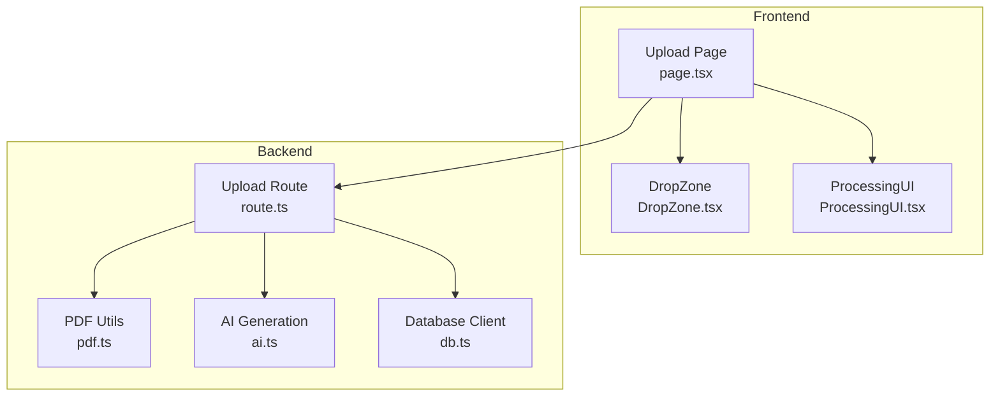
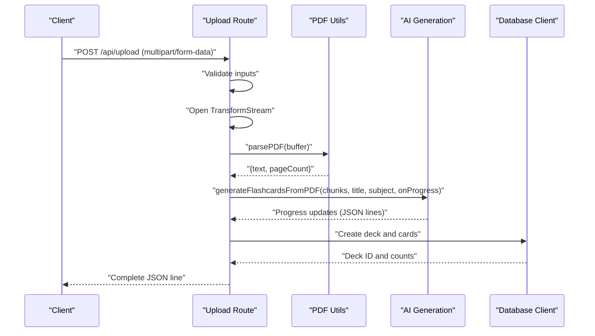
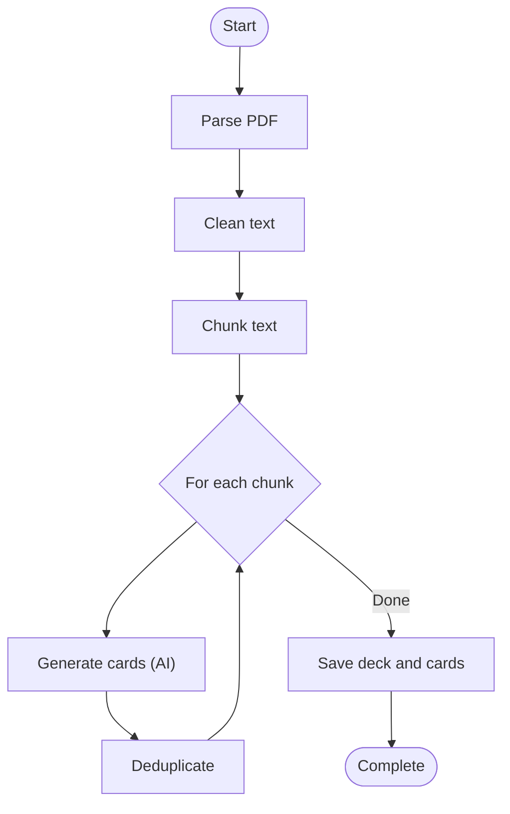
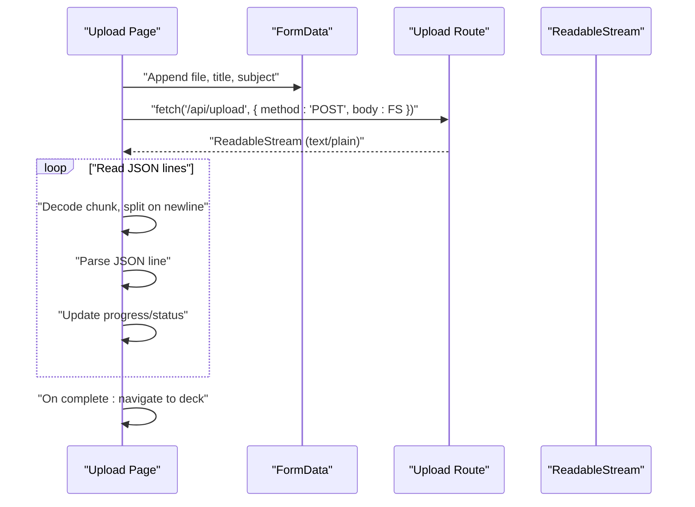
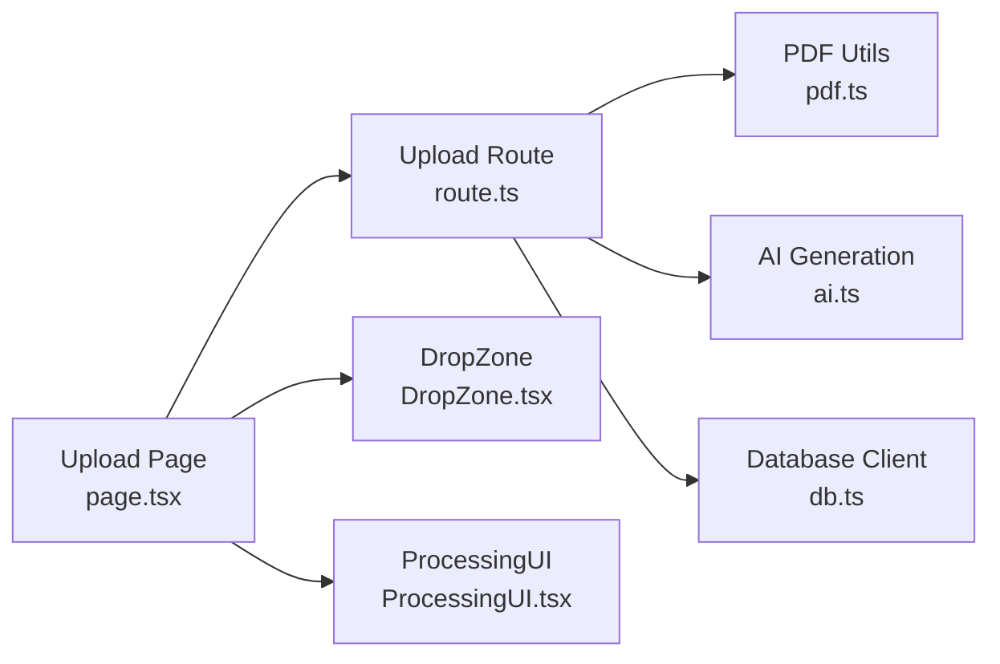

# Upload API

<cite>
**Referenced Files in This Document**
- [route.ts](file://src/app/api/upload/route.ts)
- [pdf.ts](file://src/lib/pdf.ts)
- [ai.ts](file://src/lib/ai.ts)
- [db.ts](file://src/lib/db.ts)
- [page.tsx](file://src/app/upload/page.tsx)
- [DropZone.tsx](file://src/components/upload/DropZone.tsx)
- [ProcessingUI.tsx](file://src/components/upload/ProcessingUI.tsx)
- [constants.ts](file://src/lib/constants.ts)
</cite>

## Table of Contents
1. [Introduction](#introduction)
2. [Project Structure](#project-structure)
3. [Core Components](#core-components)
4. [Architecture Overview](#architecture-overview)
5. [Detailed Component Analysis](#detailed-component-analysis)
6. [Dependency Analysis](#dependency-analysis)
7. [Performance Considerations](#performance-considerations)
8. [Troubleshooting Guide](#troubleshooting-guide)
9. [Conclusion](#conclusion)
10. [Appendices](#appendices)

## Introduction
This document describes the POST /api/upload endpoint that accepts PDF files and generates flashcards. It covers multipart/form-data requirements, validation rules, streaming response format, the PDF processing pipeline (text extraction, chunking, AI generation, deduplication, and database storage), request parameters, response format with progress updates, error handling, rate limiting behavior, and client integration patterns for consuming the streaming response.

## Project Structure
The upload feature spans the backend API route, utility libraries for PDF parsing and AI generation, database integration, and the frontend upload page and UI components.



**Diagram sources**
- [route.ts:86-297](file://src/app/api/upload/route.ts#L86-L297)
- [pdf.ts:13-111](file://src/lib/pdf.ts#L13-L111)
- [ai.ts:168-232](file://src/lib/ai.ts#L168-L232)
- [db.ts:49-67](file://src/lib/db.ts#L49-L67)
- [page.tsx:84-177](file://src/app/upload/page.tsx#L84-L177)
- [DropZone.tsx:21-99](file://src/components/upload/DropZone.tsx#L21-L99)
- [ProcessingUI.tsx:12-52](file://src/components/upload/ProcessingUI.tsx#L12-L52)

**Section sources**
- [route.ts:1-298](file://src/app/api/upload/route.ts#L1-L298)
- [page.tsx:1-504](file://src/app/upload/page.tsx#L1-L504)

## Core Components
- Backend API route: Implements multipart/form-data parsing, validation, streaming response, pipeline orchestration, and error mapping.
- PDF utilities: Parses PDFs and chunks text for AI processing.
- AI generation: Generates flashcards from text chunks with progress callbacks and retry logic.
- Database client: Provides a Prisma client configured for production and development environments.
- Frontend upload page: Handles file selection, form submission, and streaming response consumption.

**Section sources**
- [route.ts:86-297](file://src/app/api/upload/route.ts#L86-L297)
- [pdf.ts:13-111](file://src/lib/pdf.ts#L13-L111)
- [ai.ts:168-232](file://src/lib/ai.ts#L168-L232)
- [db.ts:49-67](file://src/lib/db.ts#L49-L67)
- [page.tsx:84-177](file://src/app/upload/page.tsx#L84-L177)

## Architecture Overview
The upload pipeline is a streaming server-side process that:
- Validates multipart/form-data inputs before opening the response stream.
- Streams progress updates as JSON lines.
- Processes the PDF, chunks text, generates flashcards, deduplicates, and persists to the database.
- Returns a final completion event with deck metadata.



**Diagram sources**
- [route.ts:164-297](file://src/app/api/upload/route.ts#L164-L297)
- [pdf.ts:13-61](file://src/lib/pdf.ts#L13-L61)
- [ai.ts:168-232](file://src/lib/ai.ts#L168-L232)
- [db.ts:232-251](file://src/lib/db.ts#L232-L251)

## Detailed Component Analysis

### Endpoint Definition
- Method: POST
- Path: /api/upload
- Content-Type: multipart/form-data
- Request fields:
  - file: PDF file (required)
  - title: Deck title (required)
  - subject: Subject category (optional)
- Response: text/plain (JSON lines) with progress updates until completion.

**Section sources**
- [route.ts:117-157](file://src/app/api/upload/route.ts#L117-L157)
- [page.tsx:93-102](file://src/app/upload/page.tsx#L93-L102)

### Request Parameters
- file
  - Type: File
  - Constraints: application/pdf, max 20 MB
- title
  - Type: String
  - Constraints: required, trimmed
- subject
  - Type: String
  - Constraints: optional, trimmed

Validation occurs before the streaming response begins.

**Section sources**
- [route.ts:128-157](file://src/app/api/upload/route.ts#L128-L157)

### Streaming Response Format
- Content-Type: text/plain; charset=utf-8
- Transfer-Encoding: chunked
- X-Accel-Buffering: no (nginx/proxy buffering disable header)
- Body: JSON lines (one JSON object per line)
  - Keys: status, message, progress, deckId (when complete), cardCount (when complete)
  - Progress values approximate:
    - parsing: ~5
    - chunking: ~10
    - generating: 10 to 85 (increasing)
    - saving: ~90
    - complete: 100

Client integration pattern:
- Use fetch with a readable stream.
- Read chunks, decode, split on newline, parse each line as JSON.
- Update UI with status and progress.
- On completion, navigate to the new deck.

**Section sources**
- [route.ts:65-68](file://src/app/api/upload/route.ts#L65-L68)
- [route.ts:164-167](file://src/app/api/upload/route.ts#L164-L167)
- [route.ts:172-174](file://src/app/api/upload/route.ts#L172-L174)
- [route.ts:192-198](file://src/app/api/upload/route.ts#L192-L198)
- [route.ts:203-209](file://src/app/api/upload/route.ts#L203-L209)
- [route.ts:212-218](file://src/app/api/upload/route.ts#L212-L218)
- [route.ts:257-266](file://src/app/api/upload/route.ts#L257-L266)
- [page.tsx:99-177](file://src/app/upload/page.tsx#L99-L177)

### PDF Processing Pipeline
- Text extraction
  - Uses pdf-parse with a DOMMatrix polyfill for server environments.
  - Removes page numbers and cleans whitespace.
- Chunking
  - Splits text into overlapping chunks around paragraph boundaries.
  - Minimum chunk size enforced; large paragraphs are hard-split with overlap.
- AI generation
  - Iterates through chunks, generating flashcards with a progress callback.
  - Two fallback models are attempted if the primary fails.
  - Includes a short delay between requests to respect free-tier limits.
- Deduplication
  - Filters duplicates by normalizing front text and comparing normalized prefixes.
- Database storage
  - Creates a deck with emoji derived from subject, description from first 200 characters, and card records with Spaced Repetition initialization values.



**Diagram sources**
- [route.ts:171-179](file://src/app/api/upload/route.ts#L171-L179)
- [route.ts:191-199](file://src/app/api/upload/route.ts#L191-L199)
- [route.ts:203-209](file://src/app/api/upload/route.ts#L203-L209)
- [route.ts:220-227](file://src/app/api/upload/route.ts#L220-L227)
- [route.ts:232-251](file://src/app/api/upload/route.ts#L232-L251)
- [pdf.ts:13-61](file://src/lib/pdf.ts#L13-L61)
- [pdf.ts:67-111](file://src/lib/pdf.ts#L67-L111)
- [ai.ts:168-232](file://src/lib/ai.ts#L168-L232)

**Section sources**
- [route.ts:171-251](file://src/app/api/upload/route.ts#L171-L251)
- [pdf.ts:13-111](file://src/lib/pdf.ts#L13-L111)
- [ai.ts:168-232](file://src/lib/ai.ts#L168-L232)
- [db.ts:232-251](file://src/lib/db.ts#L232-L251)

### Error Handling
- Public error mapping:
  - Missing OPENROUTER_API_KEY -> AI not configured
  - Rate limit indicators -> AI rate limit reached
  - Model not found -> AI model unavailable
  - 401/invalid API key -> Invalid API key
  - 500/502/503/overloaded -> AI service overloaded
  - DATABASE_URL/prisma/p100/auth -> Database connection failed
  - Fallback generic error message
- Validation errors:
  - No file provided
  - Unsupported file type
  - File too large (> 20 MB)
  - Missing title
- Streamed error events:
  - Emits a JSON line with status "error" and message.

**Section sources**
- [route.ts:11-63](file://src/app/api/upload/route.ts#L11-L63)
- [route.ts:133-157](file://src/app/api/upload/route.ts#L133-L157)
- [route.ts:267-279](file://src/app/api/upload/route.ts#L267-L279)

### Rate Limiting Behavior
- In-memory per-IP rate limiter:
  - Window: 60 seconds
  - Max requests per window: 5
  - Returns 429 Too Many Requests on violation
- Additional pacing:
  - AI generation includes a delay between chunk requests to respect free-tier limits.

**Section sources**
- [route.ts:70-84](file://src/app/api/upload/route.ts#L70-L84)
- [route.ts:108-115](file://src/app/api/upload/route.ts#L108-L115)
- [ai.ts:225-229](file://src/lib/ai.ts#L225-L229)

### Client Integration Patterns
- Frontend upload page:
  - Builds FormData with file, title, subject.
  - Sends POST to /api/upload.
  - Reads the stream, parses JSON lines, updates progress and status.
  - On completion, navigates to the new deck and triggers confetti.
- UI components:
  - DropZone validates PDF type and size.
  - ProcessingUI shows animated status and progress.



**Diagram sources**
- [page.tsx:93-177](file://src/app/upload/page.tsx#L93-L177)
- [DropZone.tsx:21-99](file://src/components/upload/DropZone.tsx#L21-L99)
- [ProcessingUI.tsx:12-52](file://src/components/upload/ProcessingUI.tsx#L12-L52)

**Section sources**
- [page.tsx:84-177](file://src/app/upload/page.tsx#L84-L177)
- [DropZone.tsx:21-99](file://src/components/upload/DropZone.tsx#L21-L99)
- [ProcessingUI.tsx:12-52](file://src/components/upload/ProcessingUI.tsx#L12-L52)

## Dependency Analysis
- Backend route depends on:
  - PDF parsing utilities for text extraction and chunking.
  - AI generation module for flashcard creation and progress reporting.
  - Database client for deck and card persistence.
- Frontend depends on:
  - Upload page for form submission and streaming consumption.
  - UI components for drag-and-drop file handling and progress visualization.



**Diagram sources**
- [route.ts:1-10](file://src/app/api/upload/route.ts#L1-L10)
- [pdf.ts:1-112](file://src/lib/pdf.ts#L1-L112)
- [ai.ts:1-233](file://src/lib/ai.ts#L1-L233)
- [db.ts:1-68](file://src/lib/db.ts#L1-L68)
- [page.tsx:1-504](file://src/app/upload/page.tsx#L1-L504)
- [DropZone.tsx:1-100](file://src/components/upload/DropZone.tsx#L1-L100)
- [ProcessingUI.tsx:1-53](file://src/components/upload/ProcessingUI.tsx#L1-L53)

**Section sources**
- [route.ts:1-10](file://src/app/api/upload/route.ts#L1-L10)
- [page.tsx:1-504](file://src/app/upload/page.tsx#L1-L504)

## Performance Considerations
- Streaming response avoids buffering large payloads and delivers progress immediately.
- PDF parsing and chunking are performed synchronously before opening the stream to prevent holding the request body open.
- AI generation includes delays between requests to respect free-tier quotas.
- Deduplication runs twice (during generation and final save) to minimize duplicates.
- Database writes use a single transactional create with nested card creation.

[No sources needed since this section provides general guidance]

## Troubleshooting Guide
Common issues and resolutions:
- Missing environment variables:
  - DATABASE_URL or OPENROUTER_API_KEY missing on the server will cause immediate 500 responses with explicit messages.
- File validation failures:
  - Non-PDF files, missing file, oversized files, or missing title will return 400 with a clear message.
- AI-related errors:
  - Rate limits, model unavailability, or invalid API keys map to user-friendly messages.
- Database connectivity:
  - Misconfigured DATABASE_URL or authentication failures will surface as database connection errors.
- Streaming consumption:
  - Ensure the client reads the stream incrementally, splits on newline, and handles malformed JSON gracefully.

**Section sources**
- [route.ts:87-106](file://src/app/api/upload/route.ts#L87-L106)
- [route.ts:133-157](file://src/app/api/upload/route.ts#L133-L157)
- [route.ts:11-63](file://src/app/api/upload/route.ts#L11-L63)
- [route.ts:267-279](file://src/app/api/upload/route.ts#L267-L279)

## Conclusion
The /api/upload endpoint provides a robust, streaming pipeline for converting PDFs into flashcards. It enforces strict validation, streams progress updates, handles diverse failure modes gracefully, and persists results efficiently. Clients should consume the JSON line stream, update UI progressively, and handle completion events to redirect users to their new deck.

[No sources needed since this section summarizes without analyzing specific files]

## Appendices

### API Definition
- Method: POST
- Path: /api/upload
- Content-Type: multipart/form-data
- Request fields:
  - file: PDF file (required)
  - title: Deck title (required)
  - subject: Subject category (optional)
- Response:
  - Content-Type: text/plain; charset=utf-8
  - Transfer-Encoding: chunked
  - Headers:
    - X-Content-Type-Options: nosniff
    - X-Accel-Buffering: no

**Section sources**
- [route.ts:117-157](file://src/app/api/upload/route.ts#L117-L157)
- [route.ts:288-296](file://src/app/api/upload/route.ts#L288-L296)

### cURL Example
- Upload a PDF with title and subject:
  - Replace PATH_TO_PDF with the local path to your PDF.
  - Replace "My Deck Title" with your desired deck title.
  - Replace "Mathematics" with your subject (optional).

```bash
curl -X POST https://your-domain.com/api/upload \
  -F file=@PATH_TO_PDF \
  -F title="My Deck Title" \
  -F subject="Mathematics" \
  --no-buffer \
  -H "Content-Type: multipart/form-data"
```

- Notes:
  - Use --no-buffer to disable response buffering and observe progress immediately.
  - The server will emit JSON lines; parse each line to update progress and status.

[No sources needed since this section provides general guidance]

### Client Integration Checklist
- Build FormData with file, title, subject.
- Send POST to /api/upload.
- Consume the stream:
  - Read chunks, decode, split on newline.
  - Parse each line as JSON.
  - Update progress and status messages.
- Handle completion:
  - On status "complete", extract deckId and cardCount.
  - Navigate to the new deck.
- Handle errors:
  - On status "error", show the message to the user.
  - On network errors, display a retry prompt.

**Section sources**
- [page.tsx:99-177](file://src/app/upload/page.tsx#L99-L177)