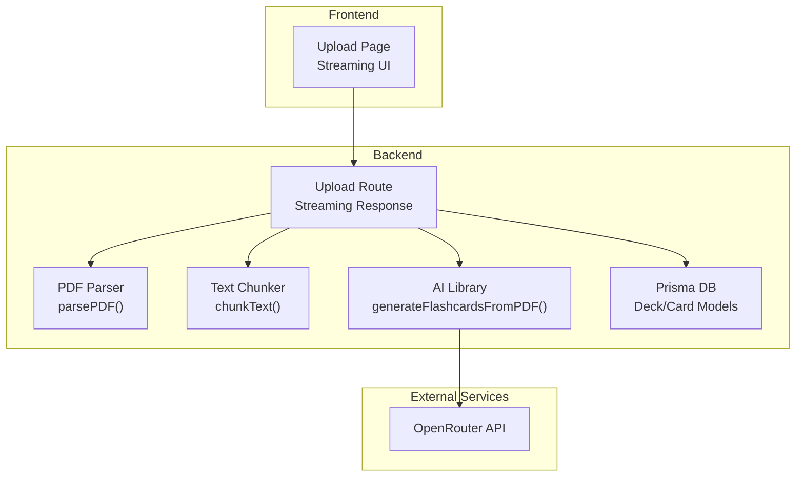
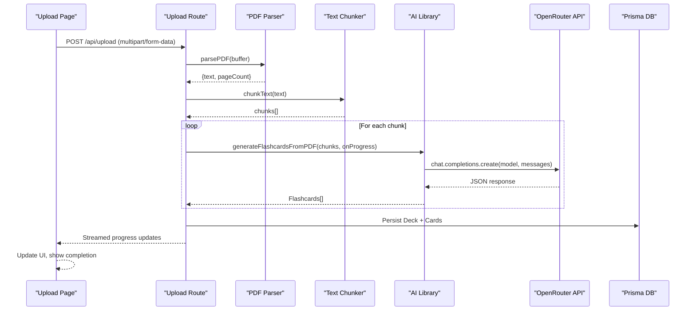
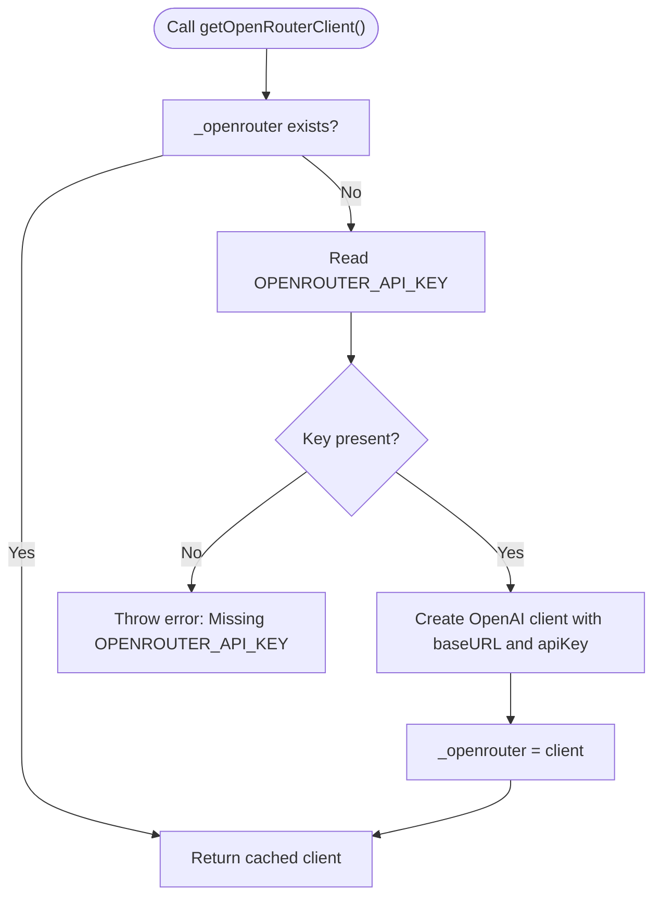
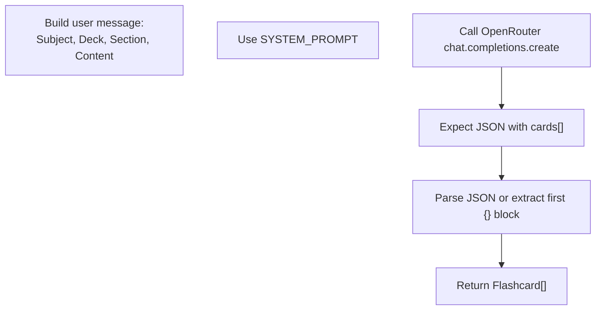
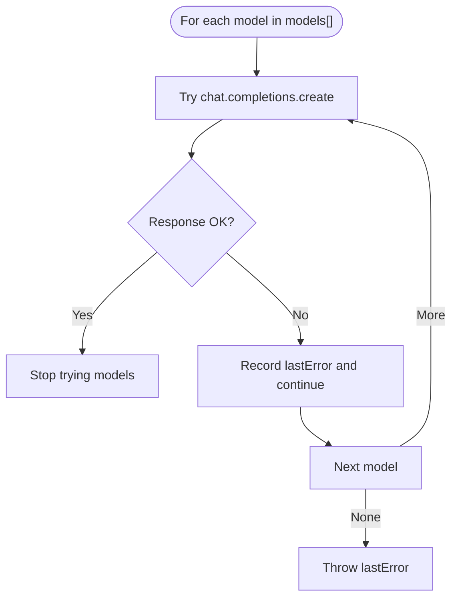
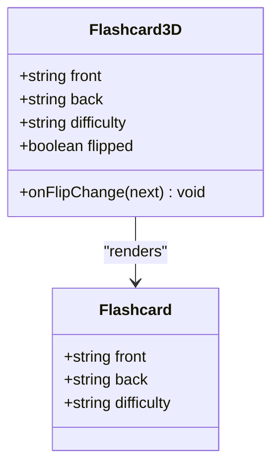
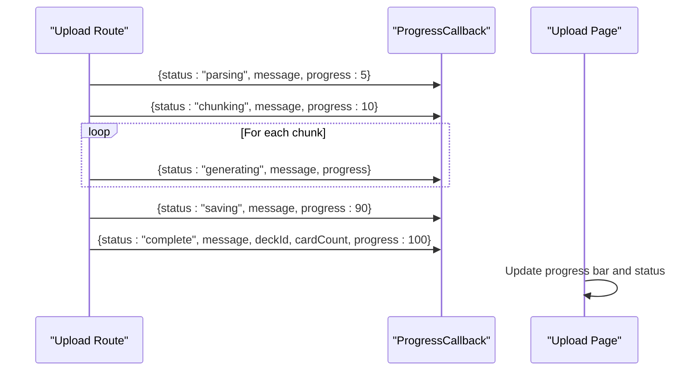
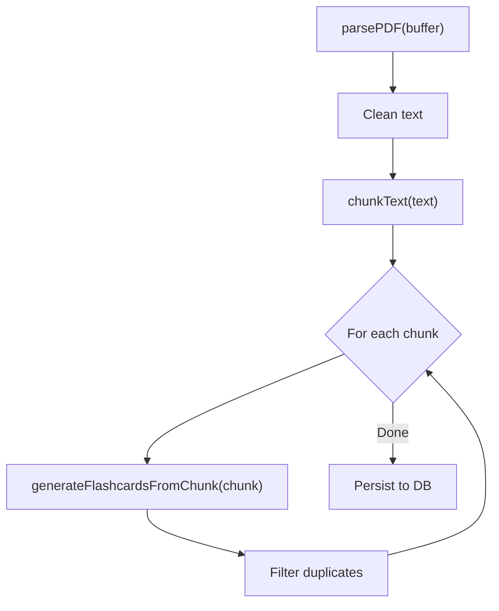
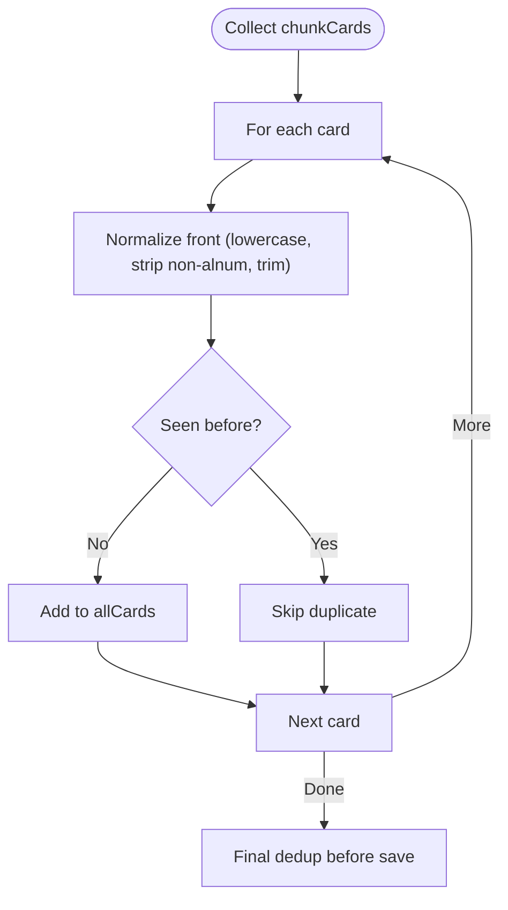
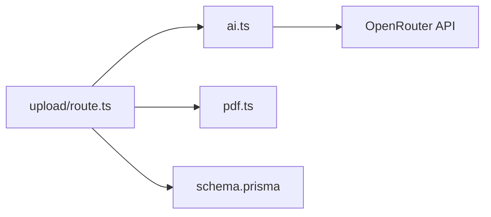

# AI Integration and Customization

<cite>
**Referenced Files in This Document**
- [ai.ts](file://src/lib/ai.ts)
- [upload/route.ts](file://src/app/api/upload/route.ts)
- [upload/page.tsx](file://src/app/upload/page.tsx)
- [Flashcard3D.tsx](file://src/components/flashcard/Flashcard3D.tsx)
- [pdf.ts](file://src/lib/pdf.ts)
- [constants.ts](file://src/lib/constants.ts)
- [schema.prisma](file://prisma/schema.prisma)
</cite>

## Table of Contents
1. [Introduction](#introduction)
2. [Project Structure](#project-structure)
3. [Core Components](#core-components)
4. [Architecture Overview](#architecture-overview)
5. [Detailed Component Analysis](#detailed-component-analysis)
6. [Dependency Analysis](#dependency-analysis)
7. [Performance Considerations](#performance-considerations)
8. [Troubleshooting Guide](#troubleshooting-guide)
9. [Conclusion](#conclusion)
10. [Appendices](#appendices)

## Introduction
This document explains how AI-powered flashcard generation is integrated into the system, focusing on the OpenRouter API integration, extensible AI provider patterns, prompt engineering strategies, and the end-to-end generation pipeline. It also covers the Flashcard interface, ProgressCallback types, deduplication logic, rate limiting, error handling, and practical guidance for adding new AI providers, configuring model fallbacks, and customizing system prompts.

## Project Structure
The AI integration spans several layers:
- Frontend upload page streams progress updates from the backend.
- Backend routes orchestrate PDF parsing, chunking, AI generation, deduplication, and persistence.
- AI library encapsulates provider client creation, prompt construction, model fallbacks, and response normalization.
- Database schema defines how generated flashcards are stored.

**Diagram sources**
- [upload/page.tsx:84-177](file://src/app/upload/page.tsx#L84-L177)
- [upload/route.ts:164-297](file://src/app/api/upload/route.ts#L164-L297)
- [pdf.ts:13-111](file://src/lib/pdf.ts#L13-L111)
- [ai.ts:76-232](file://src/lib/ai.ts#L76-L232)
- [schema.prisma:10-50](file://prisma/schema.prisma#L10-L50)

**Section sources**
- [upload/page.tsx:84-177](file://src/app/upload/page.tsx#L84-L177)
- [upload/route.ts:164-297](file://src/app/api/upload/route.ts#L164-L297)
- [pdf.ts:13-111](file://src/lib/pdf.ts#L13-L111)
- [ai.ts:76-232](file://src/lib/ai.ts#L76-L232)
- [schema.prisma:10-50](file://prisma/schema.prisma#L10-L50)

## Core Components
- Flashcard interface: Defines the shape of generated cards with front/back content and difficulty.
- ProgressCallback type: Standardized callback for streaming progress updates.
- OpenRouter client: Lazily initialized client with base URL and API key.
- System prompt: Structured prompt instructing the model to produce flashcards in a specific JSON format.
- Generation pipeline: Chunked PDF processing, per-chunk AI generation with fallbacks, deduplication, and persistence.

Key responsibilities:
- AI library: Provider abstraction, prompt formatting, model fallbacks, response parsing, deduplication, pacing, and retries.
- Upload route: Streaming orchestration, rate limiting, public error mapping, and database persistence.
- Upload page: Real-time progress UI and SSE-like streaming consumption.

**Section sources**
- [ai.ts:27-38](file://src/lib/ai.ts#L27-L38)
- [ai.ts:8-24](file://src/lib/ai.ts#L8-L24)
- [ai.ts:53-74](file://src/lib/ai.ts#L53-L74)
- [ai.ts:76-153](file://src/lib/ai.ts#L76-L153)
- [ai.ts:168-232](file://src/lib/ai.ts#L168-L232)
- [upload/route.ts:65-68](file://src/app/api/upload/route.ts#L65-L68)
- [upload/route.ts:70-84](file://src/app/api/upload/route.ts#L70-L84)
- [upload/route.ts:220-227](file://src/app/api/upload/route.ts#L220-L227)

## Architecture Overview
The system follows a streaming-first architecture:
- The frontend sends a multipart form and reads a text stream line-by-line.
- The backend validates inputs, parses the PDF, chunks text, generates cards via AI, deduplicates, persists to the database, and emits structured progress events.
- The frontend updates the UI in real time and transitions to a completion state.

**Diagram sources**
- [upload/page.tsx:84-177](file://src/app/upload/page.tsx#L84-L177)
- [upload/route.ts:164-297](file://src/app/api/upload/route.ts#L164-L297)
- [pdf.ts:13-111](file://src/lib/pdf.ts#L13-L111)
- [ai.ts:76-232](file://src/lib/ai.ts#L76-L232)
- [schema.prisma:10-50](file://prisma/schema.prisma#L10-L50)

## Detailed Component Analysis

### OpenRouter Integration and Client Initialization
- The OpenRouter client is lazily created to avoid build failures when the API key is absent.
- The client uses a base URL pointing to OpenRouter’s API and authenticates with the configured API key.
- The upload route enforces presence of the API key early to fail fast with a clear message.

**Diagram sources**
- [ai.ts:8-24](file://src/lib/ai.ts#L8-L24)
- [upload/route.ts:98-106](file://src/app/api/upload/route.ts#L98-L106)

**Section sources**
- [ai.ts:8-24](file://src/lib/ai.ts#L8-L24)
- [upload/route.ts:98-106](file://src/app/api/upload/route.ts#L98-L106)

### Prompt Engineering and System Prompt
- The system prompt instructs the model to generate flashcards across defined categories, enforce quality rules, and respond exclusively in a specific JSON format.
- The prompt is embedded in the AI library and includes explicit formatting requirements and a strict JSON envelope.

**Diagram sources**
- [ai.ts:53-74](file://src/lib/ai.ts#L53-L74)
- [ai.ts:76-153](file://src/lib/ai.ts#L76-L153)

**Section sources**
- [ai.ts:53-74](file://src/lib/ai.ts#L53-L74)
- [ai.ts:76-153](file://src/lib/ai.ts#L76-L153)

### Model Fallback Strategy
- The pipeline attempts multiple models in sequence, stopping on the first successful response.
- On failure, it records the last error and continues to the next model.
- If all models fail, the last error is thrown.

**Diagram sources**
- [ai.ts:92-125](file://src/lib/ai.ts#L92-L125)

**Section sources**
- [ai.ts:92-125](file://src/lib/ai.ts#L92-L125)

### Flashcard Interface and Difficulty Mapping
- The Flashcard interface defines front/back content and difficulty levels.
- The Flashcard3D component renders difficulty badges and applies styles based on difficulty values.

**Diagram sources**
- [ai.ts:27-31](file://src/lib/ai.ts#L27-L31)
- [Flashcard3D.tsx:8-15](file://src/components/flashcard/Flashcard3D.tsx#L8-L15)
- [constants.ts:19-23](file://src/lib/constants.ts#L19-L23)

**Section sources**
- [ai.ts:27-31](file://src/lib/ai.ts#L27-L31)
- [Flashcard3D.tsx:8-15](file://src/components/flashcard/Flashcard3D.tsx#L8-L15)
- [constants.ts:19-23](file://src/lib/constants.ts#L19-L23)

### ProgressCallback Type and Streaming Updates
- The ProgressCallback type standardizes progress updates with status, message, progress percentage, and optional card count.
- The upload route emits structured progress events and the frontend consumes them to update the UI.

**Diagram sources**
- [ai.ts:33-38](file://src/lib/ai.ts#L33-L38)
- [upload/route.ts:65-68](file://src/app/api/upload/route.ts#L65-L68)
- [upload/route.ts:204-209](file://src/app/api/upload/route.ts#L204-L209)
- [upload/page.tsx:127-169](file://src/app/upload/page.tsx#L127-L169)

**Section sources**
- [ai.ts:33-38](file://src/lib/ai.ts#L33-L38)
- [upload/route.ts:65-68](file://src/app/api/upload/route.ts#L65-L68)
- [upload/route.ts:204-209](file://src/app/api/upload/route.ts#L204-L209)
- [upload/page.tsx:127-169](file://src/app/upload/page.tsx#L127-L169)

### AI Generation Pipeline: From PDF to Cards
- PDF parsing removes page numbers and trims whitespace to improve readability.
- Text is chunked with overlap to preserve context across boundaries.
- Each chunk is sent to the AI with a structured prompt; responses are normalized and parsed.
- Deduplication ensures uniqueness across collected cards.

**Diagram sources**
- [pdf.ts:13-111](file://src/lib/pdf.ts#L13-L111)
- [ai.ts:168-232](file://src/lib/ai.ts#L168-L232)
- [upload/route.ts:220-227](file://src/app/api/upload/route.ts#L220-L227)

**Section sources**
- [pdf.ts:13-111](file://src/lib/pdf.ts#L13-L111)
- [ai.ts:168-232](file://src/lib/ai.ts#L168-L232)
- [upload/route.ts:220-227](file://src/app/api/upload/route.ts#L220-L227)

### Deduplication Strategies
- Two-phase deduplication is applied:
  - Per-chunk deduplication during collection.
  - Final deduplication before persistence using a normalized key.
- Normalization removes punctuation and trims to a prefix length to balance accuracy and performance.

**Diagram sources**
- [ai.ts:155-163](file://src/lib/ai.ts#L155-L163)
- [ai.ts:211-216](file://src/lib/ai.ts#L211-L216)
- [upload/route.ts:220-227](file://src/app/api/upload/route.ts#L220-L227)

**Section sources**
- [ai.ts:155-163](file://src/lib/ai.ts#L155-L163)
- [ai.ts:211-216](file://src/lib/ai.ts#L211-L216)
- [upload/route.ts:220-227](file://src/app/api/upload/route.ts#L220-L227)

### Extending the Generation Pipeline
Examples of customization areas:
- Extending generateFlashcardsFromChunk:
  - Add new providers by instantiating a provider-specific client and invoking its completion API.
  - Normalize provider responses into the Flashcard[] structure.
  - Example path: [generateFlashcardsFromChunk:76-153](file://src/lib/ai.ts#L76-L153)
- Implementing custom deduplication:
  - Replace or augment the normalization and prefix-length strategy.
  - Example path: [isDuplicate:160-163](file://src/lib/ai.ts#L160-L163)
- Handling different AI response formats:
  - If a provider returns a non-JSON response, implement a format-specific extractor before falling back to JSON parsing.
  - Example path: [response parsing:133-152](file://src/lib/ai.ts#L133-L152)

**Section sources**
- [ai.ts:76-153](file://src/lib/ai.ts#L76-L153)
- [ai.ts:160-163](file://src/lib/ai.ts#L160-L163)
- [ai.ts:133-152](file://src/lib/ai.ts#L133-L152)

## Dependency Analysis
- The upload route depends on:
  - AI library for generation and deduplication.
  - PDF utilities for parsing and chunking.
  - Prisma models for persistence.
- The AI library depends on:
  - OpenAI SDK for OpenRouter integration.
  - Internal utilities for deduplication and pacing.

**Diagram sources**
- [upload/route.ts:1-5](file://src/app/api/upload/route.ts#L1-L5)
- [ai.ts:1-1](file://src/lib/ai.ts#L1-L1)
- [pdf.ts:1-1](file://src/lib/pdf.ts#L1-L1)
- [schema.prisma:1-5](file://prisma/schema.prisma#L1-L5)

**Section sources**
- [upload/route.ts:1-5](file://src/app/api/upload/route.ts#L1-L5)
- [ai.ts:1-1](file://src/lib/ai.ts#L1-L1)
- [pdf.ts:1-1](file://src/lib/pdf.ts#L1-L1)
- [schema.prisma:1-5](file://prisma/schema.prisma#L1-L5)

## Performance Considerations
- Chunking strategy:
  - Overlapping chunks reduce boundary loss while keeping token budgets manageable.
  - Minimum chunk size prevents trivial fragments.
  - Reference: [chunkText:67-111](file://src/lib/pdf.ts#L67-L111)
- Request pacing:
  - A small delay between chunk requests helps avoid free-tier rate limits.
  - Reference: [delay and await:225-229](file://src/lib/ai.ts#L225-L229)
- Retry logic:
  - Single retry with a short backoff reduces transient failure impact.
  - Reference: [retry block:194-209](file://src/lib/ai.ts#L194-L209)
- Deduplication cost:
  - Normalized keys and prefix trimming reduce comparison overhead.
  - Reference: [normalisation:156-158](file://src/lib/ai.ts#L156-L158)

[No sources needed since this section provides general guidance]

## Troubleshooting Guide
Common issues and resolutions:
- Missing OPENROUTER_API_KEY:
  - The route checks for the key and returns a clear message if missing.
  - Reference: [environment check:98-106](file://src/app/api/upload/route.ts#L98-L106)
- Rate limit errors:
  - Public error mapping translates rate limit messages to user-friendly text.
  - Reference: [public error mapping:11-63](file://src/app/api/upload/route.ts#L11-L63)
- JSON parse failures:
  - The AI library strips code fences and attempts to extract the first JSON block.
  - Reference: [response parsing:127-152](file://src/lib/ai.ts#L127-L152)
- Free-tier throttling:
  - The pipeline adds delays between requests to respect quotas.
  - Reference: [request pacing:225-229](file://src/lib/ai.ts#L225-L229)
- Database connectivity:
  - The route validates DATABASE_URL and surfaces helpful errors.
  - Reference: [database check:88-96](file://src/app/api/upload/route.ts#L88-L96)

**Section sources**
- [upload/route.ts:98-106](file://src/app/api/upload/route.ts#L98-L106)
- [upload/route.ts:11-63](file://src/app/api/upload/route.ts#L11-L63)
- [ai.ts:127-152](file://src/lib/ai.ts#L127-L152)
- [ai.ts:225-229](file://src/lib/ai.ts#L225-L229)
- [upload/route.ts:88-96](file://src/app/api/upload/route.ts#L88-L96)

## Conclusion
The AI integration is built around a robust, streaming-first pipeline that emphasizes reliability, user feedback, and performance. OpenRouter is configured as the primary provider with a clear fallback strategy, while the system prompt and response parsing ensure consistent output. Deduplication and rate-limiting safeguards protect both the user experience and provider resources. The modular design allows straightforward extension to additional providers and customization of prompts and dedup logic.

[No sources needed since this section summarizes without analyzing specific files]

## Appendices

### Adding a New AI Provider
Steps:
- Create a provider-specific client initialization similar to the OpenRouter client.
- Extend the generation function to accept a provider identifier and dispatch to the appropriate client.
- Normalize provider responses into the Flashcard[] structure.
- Add provider-specific error mapping and fallback logic.
- Example paths:
  - [client initialization pattern:8-24](file://src/lib/ai.ts#L8-L24)
  - [generation function:76-153](file://src/lib/ai.ts#L76-L153)
  - [deduplication:155-163](file://src/lib/ai.ts#L155-L163)

**Section sources**
- [ai.ts:8-24](file://src/lib/ai.ts#L8-L24)
- [ai.ts:76-153](file://src/lib/ai.ts#L76-L153)
- [ai.ts:155-163](file://src/lib/ai.ts#L155-L163)

### Configuring Model Fallback Strategies
- Maintain a prioritized list of models.
- Attempt each model in order until a successful response.
- Log warnings on failure and propagate the last error if all fail.
- Example path: [fallback loop:92-125](file://src/lib/ai.ts#L92-L125)

**Section sources**
- [ai.ts:92-125](file://src/lib/ai.ts#L92-L125)

### Customizing System Prompts
- Modify the SYSTEM_PROMPT constant to adjust categories, quality rules, and JSON envelope expectations.
- Ensure the model responds only in the expected JSON format to simplify parsing.
- Example path: [SYSTEM_PROMPT:53-74](file://src/lib/ai.ts#L53-L74)

**Section sources**
- [ai.ts:53-74](file://src/lib/ai.ts#L53-L74)

### Handling Different AI Response Formats
- Implement provider-specific parsers that convert non-JSON responses into the Flashcard[] structure.
- Fall back to the existing JSON extraction logic if needed.
- Example paths:
  - [JSON extraction:133-152](file://src/lib/ai.ts#L133-L152)
  - [fallback parsing:137-146](file://src/lib/ai.ts#L137-L146)

**Section sources**
- [ai.ts:133-152](file://src/lib/ai.ts#L133-L152)
- [ai.ts:137-146](file://src/lib/ai.ts#L137-L146)

### Rate Limiting and Error Handling Best Practices
- Enforce environment checks early in the route.
- Implement per-IP rate limiting with a short window and threshold.
- Map provider-specific errors to user-friendly messages.
- Example paths:
  - [rate limiter:70-84](file://src/app/api/upload/route.ts#L70-L84)
  - [public error mapping:11-63](file://src/app/api/upload/route.ts#L11-L63)

**Section sources**
- [upload/route.ts:70-84](file://src/app/api/upload/route.ts#L70-L84)
- [upload/route.ts:11-63](file://src/app/api/upload/route.ts#L11-L63)