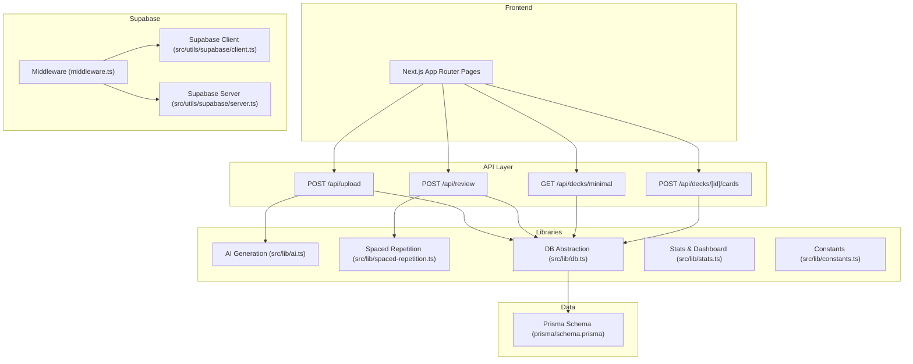
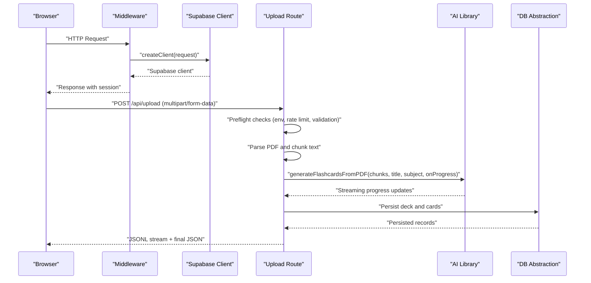
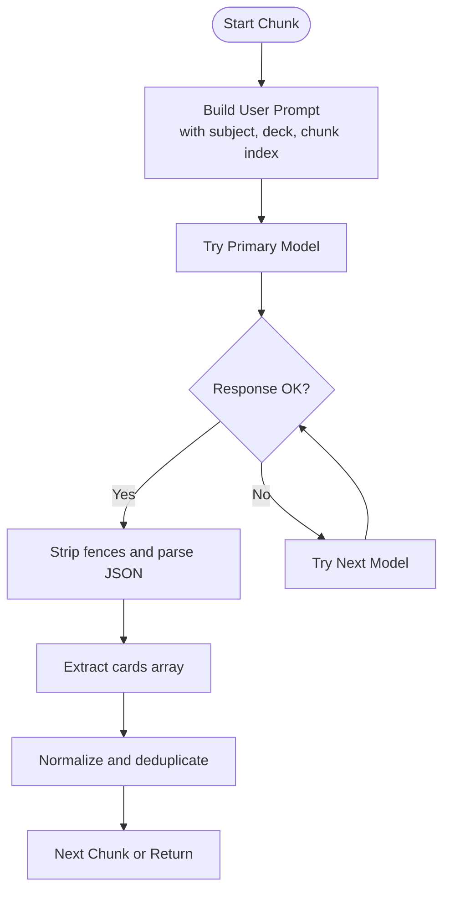
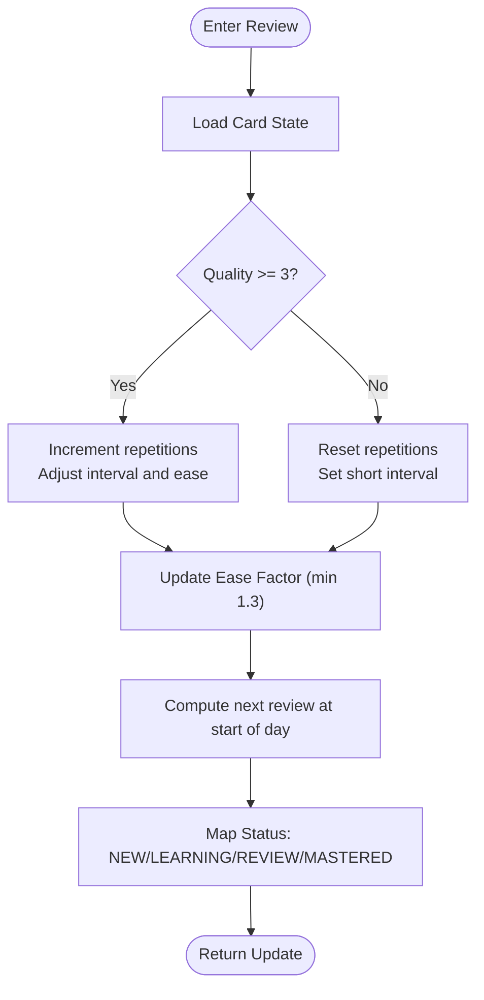
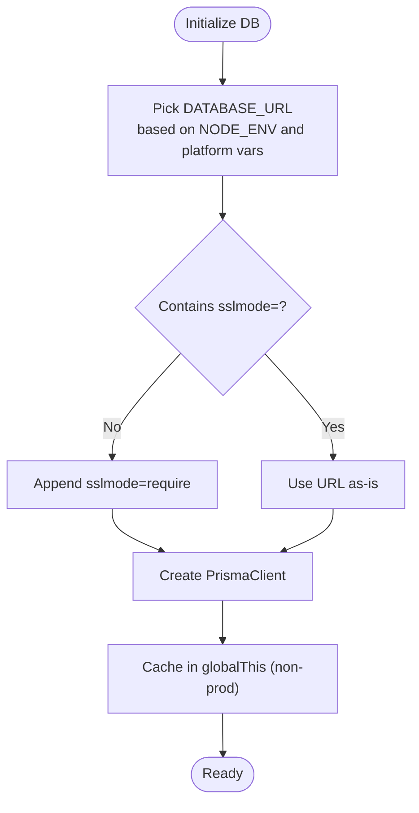
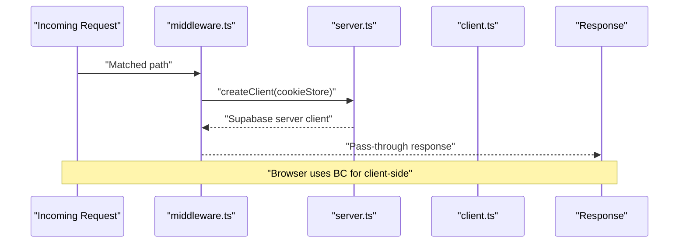
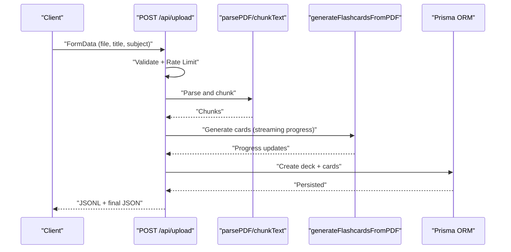
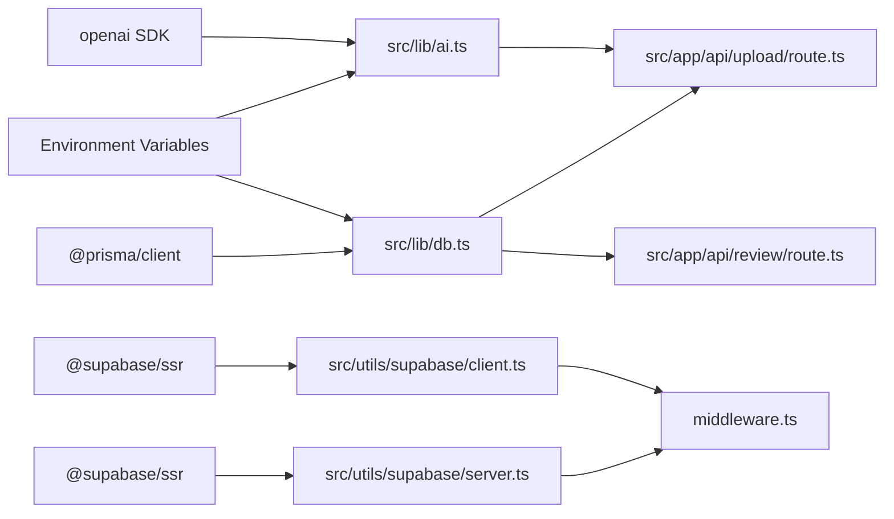

# Advanced Topics

<cite>
**Referenced Files in This Document**
- [ai.ts](file://src/lib/ai.ts)
- [db.ts](file://src/lib/db.ts)
- [spaced-repetition.ts](file://src/lib/spaced-repetition.ts)
- [constants.ts](file://src/lib/constants.ts)
- [stats.ts](file://src/lib/stats.ts)
- [client.ts](file://src/utils/supabase/client.ts)
- [server.ts](file://src/utils/supabase/server.ts)
- [middleware.ts](file://middleware.ts)
- [schema.prisma](file://prisma/schema.prisma)
- [upload.route.ts](file://src/app/api/upload/route.ts)
- [decks.minimal.route.ts](file://src/app/api/decks/minimal/route.ts)
- [decks.cards.route.ts](file://src/app/api/decks/[id]/cards/route.ts)
- [review.route.ts](file://src/app/api/review/route.ts)
- [package.json](file://package.json)
</cite>

## Table of Contents
1. [Introduction](#introduction)
2. [Project Structure](#project-structure)
3. [Core Components](#core-components)
4. [Architecture Overview](#architecture-overview)
5. [Detailed Component Analysis](#detailed-component-analysis)
6. [Dependency Analysis](#dependency-analysis)
7. [Performance Considerations](#performance-considerations)
8. [Troubleshooting Guide](#troubleshooting-guide)
9. [Conclusion](#conclusion)
10. [Appendices](#appendices)

## Introduction
This document focuses on advanced topics and extensibility in Recall, covering:
- Custom AI provider integration and prompt engineering strategies
- AI model configuration and fallback mechanisms
- Extension points for adding new features, custom components, and API endpoints
- Database schema extensions, indexing strategies, and performance tuning
- Advanced configuration options, environment customization, and production hardening
- Troubleshooting complex issues, debugging techniques, and performance optimization
- Guidance for contributing to the codebase and implementing custom functionality

## Project Structure
Recall is a Next.js application with a modular architecture:
- AI generation and prompt orchestration live under src/lib/ai.ts
- Database abstraction and connection pooling are handled via src/lib/db.ts and Prisma schema
- Spaced repetition scheduling is encapsulated in src/lib/spaced-repetition.ts
- Supabase utilities for SSR and middleware are under src/utils/supabase/*
- API routes expose CRUD and domain-specific endpoints under src/app/api/*
- Shared constants and styling tokens are centralized in src/lib/constants.ts
- Statistics and dashboard computations are in src/lib/stats.ts

**Diagram sources**
- [upload.route.ts:1-298](file://src/app/api/upload/route.ts#L1-L298)
- [decks.minimal.route.ts:1-41](file://src/app/api/decks/minimal/route.ts#L1-L41)
- [decks.cards.route.ts:1-40](file://src/app/api/decks/[id]/cards/route.ts#L1-L40)
- [review.route.ts:1-76](file://src/app/api/review/route.ts#L1-L76)
- [ai.ts:1-233](file://src/lib/ai.ts#L1-L233)
- [spaced-repetition.ts:1-141](file://src/lib/spaced-repetition.ts#L1-L141)
- [db.ts:1-68](file://src/lib/db.ts#L1-L68)
- [stats.ts:1-222](file://src/lib/stats.ts#L1-L222)
- [constants.ts:1-31](file://src/lib/constants.ts#L1-L31)
- [client.ts:1-11](file://src/utils/supabase/client.ts#L1-L11)
- [server.ts:1-29](file://src/utils/supabase/server.ts#L1-L29)
- [middleware.ts:1-22](file://middleware.ts#L1-L22)
- [schema.prisma:1-51](file://prisma/schema.prisma#L1-L51)

**Section sources**
- [package.json:1-56](file://package.json#L1-L56)

## Core Components
- AI generation pipeline: Implements chunked PDF processing, prompt engineering, model fallback, and deduplication.
- Spaced repetition engine: Implements SM-2 scheduling, session queuing, and rating semantics.
- Database abstraction: Centralized Prisma client initialization with environment-aware URL selection and SSL enforcement.
- Supabase utilities: Browser and server clients with cookie store integration and middleware.
- API routes: Upload pipeline (streaming progress, rate limiting), minimal deck listing, manual card creation, and review updates.

**Section sources**
- [ai.ts:1-233](file://src/lib/ai.ts#L1-L233)
- [spaced-repetition.ts:1-141](file://src/lib/spaced-repetition.ts#L1-L141)
- [db.ts:1-68](file://src/lib/db.ts#L1-L68)
- [client.ts:1-11](file://src/utils/supabase/client.ts#L1-L11)
- [server.ts:1-29](file://src/utils/supabase/server.ts#L1-L29)
- [upload.route.ts:1-298](file://src/app/api/upload/route.ts#L1-L298)
- [decks.minimal.route.ts:1-41](file://src/app/api/decks/minimal/route.ts#L1-L41)
- [decks.cards.route.ts:1-40](file://src/app/api/decks/[id]/cards/route.ts#L1-L40)
- [review.route.ts:1-76](file://src/app/api/review/route.ts#L1-L76)

## Architecture Overview
The system integrates AI-driven content ingestion with a spaced-repetition scheduler and persistent storage. Supabase provides authentication and session management, while middleware ensures secure client initialization.

**Diagram sources**
- [middleware.ts:1-22](file://middleware.ts#L1-L22)
- [client.ts:1-11](file://src/utils/supabase/client.ts#L1-L11)
- [server.ts:1-29](file://src/utils/supabase/server.ts#L1-L29)
- [upload.route.ts:1-298](file://src/app/api/upload/route.ts#L1-L298)
- [ai.ts:168-233](file://src/lib/ai.ts#L168-L233)
- [db.ts:1-68](file://src/lib/db.ts#L1-L68)

## Detailed Component Analysis

### AI Provider Integration and Prompt Engineering
- Provider abstraction: The AI library lazily initializes a client and supports fallback models. This pattern enables easy swapping or adding new providers.
- Prompt engineering: The system prompt defines card categories, quality rules, and JSON output expectations. The user prompt contextualizes generation with deck title, subject, and chunk metadata.
- Robust parsing: The pipeline strips code fences, attempts strict JSON parsing, and falls back to extracting the first JSON block to handle provider quirks.
- Retry and pacing: Per-chunk retries and throttling mitigate free-tier rate limits and transient failures.
- Deduplication: Normalization and deduplication reduce redundant cards across chunks and decks.

**Diagram sources**
- [ai.ts:76-153](file://src/lib/ai.ts#L76-L153)

**Section sources**
- [ai.ts:1-233](file://src/lib/ai.ts#L1-L233)

### Spaced Repetition Engine
- SM-2 core: Calculates intervals, ease factors, and status transitions based on correctness ratings.
- Queue builder: Shuffles overdue and new cards to balance learning and retention.
- Rating semantics: Maps numeric ratings to UI labels and colors for consistent UX.

**Diagram sources**
- [spaced-repetition.ts:29-76](file://src/lib/spaced-repetition.ts#L29-L76)

**Section sources**
- [spaced-repetition.ts:1-141](file://src/lib/spaced-repetition.ts#L1-L141)

### Database Abstraction and Production Hardening
- Environment-aware URL selection: Prefers platform-specific Postgres URLs in production to leverage connection pooling.
- SSL enforcement: Ensures sslmode=require for serverless environments.
- Global client caching: Prevents multiple Prisma instances in development.
- Prisma schema: Defines Deck, Card, and ReviewLog entities with relations and defaults.

**Diagram sources**
- [db.ts:8-67](file://src/lib/db.ts#L8-L67)
- [schema.prisma:10-51](file://prisma/schema.prisma#L10-L51)

**Section sources**
- [db.ts:1-68](file://src/lib/db.ts#L1-L68)
- [schema.prisma:1-51](file://prisma/schema.prisma#L1-L51)

### Supabase Utilities and Middleware
- Browser client: Initializes Supabase with public keys from environment.
- Server client: Integrates with Next.js cookie store for SSR and session refresh.
- Middleware: Wraps requests to ensure Supabase client availability and applies path matching.

**Diagram sources**
- [middleware.ts:1-22](file://middleware.ts#L1-L22)
- [server.ts:1-29](file://src/utils/supabase/server.ts#L1-L29)
- [client.ts:1-11](file://src/utils/supabase/client.ts#L1-L11)

**Section sources**
- [client.ts:1-11](file://src/utils/supabase/client.ts#L1-L11)
- [server.ts:1-29](file://src/utils/supabase/server.ts#L1-L29)
- [middleware.ts:1-22](file://middleware.ts#L1-L22)

### API Endpoints and Extension Points
- Upload pipeline: Streaming progress, rate limiting, PDF parsing, chunking, AI generation, deduplication, and persistence.
- Minimal decks: Lightweight listing with due counts.
- Manual card creation: Adds cards to a deck with defaults.
- Review updates: Atomic transaction for card and log updates.

**Diagram sources**
- [upload.route.ts:86-297](file://src/app/api/upload/route.ts#L86-L297)
- [ai.ts:168-233](file://src/lib/ai.ts#L168-L233)

**Section sources**
- [upload.route.ts:1-298](file://src/app/api/upload/route.ts#L1-L298)
- [decks.minimal.route.ts:1-41](file://src/app/api/decks/minimal/route.ts#L1-L41)
- [decks.cards.route.ts:1-40](file://src/app/api/decks/[id]/cards/route.ts#L1-L40)
- [review.route.ts:1-76](file://src/app/api/review/route.ts#L1-L76)

### Extending the System
- Adding a new AI provider:
  - Implement a new client factory similar to the existing provider initialization pattern.
  - Define a unified interface for chat completions and integrate into the generation pipeline.
  - Add environment variables and fallback logic to maintain resilience.
  - Reference: [ai.ts:8-24](file://src/lib/ai.ts#L8-L24), [ai.ts:92-120](file://src/lib/ai.ts#L92-L120)
- Custom components:
  - Extend UI under src/components and reuse constants from src/lib/constants.ts for themes and styles.
  - Reference: [constants.ts:1-31](file://src/lib/constants.ts#L1-L31)
- New API endpoints:
  - Follow the existing route structure under src/app/api/* and reuse db.ts for persistence.
  - Reference: [decks.minimal.route.ts:1-41](file://src/app/api/decks/minimal/route.ts#L1-L41), [review.route.ts:1-76](file://src/app/api/review/route.ts#L1-L76)

**Section sources**
- [ai.ts:1-233](file://src/lib/ai.ts#L1-L233)
- [constants.ts:1-31](file://src/lib/constants.ts#L1-L31)
- [decks.minimal.route.ts:1-41](file://src/app/api/decks/minimal/route.ts#L1-L41)
- [review.route.ts:1-76](file://src/app/api/review/route.ts#L1-L76)

## Dependency Analysis
- AI library depends on OpenAI SDK and environment variables for provider configuration.
- Database layer depends on Prisma client and environment variables for connection URLs.
- API routes depend on AI and DB libraries and expose domain operations.
- Supabase utilities depend on environment variables and Next.js headers for SSR.

**Diagram sources**
- [ai.ts:1](file://src/lib/ai.ts#L1)
- [db.ts:1](file://src/lib/db.ts#L1)
- [upload.route.ts:1-298](file://src/app/api/upload/route.ts#L1-L298)
- [review.route.ts:1-76](file://src/app/api/review/route.ts#L1-L76)
- [client.ts:1-11](file://src/utils/supabase/client.ts#L1-L11)
- [server.ts:1-29](file://src/utils/supabase/server.ts#L1-L29)
- [middleware.ts:1-22](file://middleware.ts#L1-L22)

**Section sources**
- [package.json:18-41](file://package.json#L18-L41)

## Performance Considerations
- AI throughput:
  - Implement provider-side rate limiting and exponential backoff.
  - Batch chunk processing where feasible and adjust chunk sizes to balance quality and latency.
  - Use model fallbacks to improve availability.
  - Reference: [ai.ts:92-120](file://src/lib/ai.ts#L92-L120), [ai.ts:166-232](file://src/lib/ai.ts#L166-L232)
- Database:
  - Prefer platform-provided Postgres URLs in production to benefit from connection pooling.
  - Enforce sslmode=require for serverless environments.
  - Reference: [db.ts:8-47](file://src/lib/db.ts#L8-L47)
- API streaming:
  - Keep uploads streaming to provide immediate feedback; ensure proxy configurations disable buffering.
  - Reference: [upload.route.ts:164-296](file://src/app/api/upload/route.ts#L164-L296)
- UI responsiveness:
  - Use lightweight queries for minimal deck listings and avoid unnecessary joins.
  - Reference: [decks.minimal.route.ts:8-35](file://src/app/api/decks/minimal/route.ts#L8-L35)

[No sources needed since this section provides general guidance]

## Troubleshooting Guide
- AI generation disabled or failing:
  - Verify OPENROUTER_API_KEY is set in the environment.
  - Check for rate limit messages and model unavailability.
  - Reference: [upload.route.ts:87-106](file://src/app/api/upload/route.ts#L87-L106), [ai.ts:12-16](file://src/lib/ai.ts#L12-L16)
- Database connectivity:
  - Ensure DATABASE_URL is set and correct; Prisma errors indicate misconfiguration.
  - Reference: [upload.route.ts:88-96](file://src/app/api/upload/route.ts#L88-L96), [db.ts:8-39](file://src/lib/db.ts#L8-L39)
- Free-tier limitations:
  - Expect rate limits and occasional outages; implement retries and user messaging.
  - Reference: [upload.route.ts:14-48](file://src/app/api/upload/route.ts#L14-L48), [ai.ts:195-209](file://src/lib/ai.ts#L195-L209)
- Supabase session issues:
  - Confirm NEXT_PUBLIC_SUPABASE_URL and NEXT_PUBLIC_SUPABASE_PUBLISHABLE_KEY are present.
  - Reference: [client.ts:3-10](file://src/utils/supabase/client.ts#L3-L10), [server.ts:4-11](file://src/utils/supabase/server.ts#L4-L11)
- Review endpoint errors:
  - Validate payload fields and quality range; ensure card exists.
  - Reference: [review.route.ts:15-26](file://src/app/api/review/route.ts#L15-L26)

**Section sources**
- [upload.route.ts:11-63](file://src/app/api/upload/route.ts#L11-L63)
- [ai.ts:12-16](file://src/lib/ai.ts#L12-L16)
- [db.ts:8-39](file://src/lib/db.ts#L8-L39)
- [client.ts:3-10](file://src/utils/supabase/client.ts#L3-L10)
- [server.ts:4-11](file://src/utils/supabase/server.ts#L4-L11)
- [review.route.ts:15-26](file://src/app/api/review/route.ts#L15-L26)

## Conclusion
Recall’s architecture cleanly separates AI generation, scheduling, persistence, and session management. The provided extension points and configuration options enable robust customization for AI providers, UI components, and API endpoints. Production hardening relies on environment-aware database configuration, SSL enforcement, and resilient AI pipelines. Use the troubleshooting guidance to diagnose and resolve common issues quickly.

[No sources needed since this section summarizes without analyzing specific files]

## Appendices

### Advanced Configuration Options
- Environment variables:
  - OPENROUTER_API_KEY: Enables AI generation.
  - DATABASE_URL, POSTGRES_PRISMA_URL, POSTGRES_URL, POSTGRES_URL_NON_POOLING: Select database URL and pooling behavior.
  - NEXT_PUBLIC_SUPABASE_URL, NEXT_PUBLIC_SUPABASE_PUBLISHABLE_KEY: Configure Supabase client.
  - Reference: [ai.ts:11-16](file://src/lib/ai.ts#L11-L16), [db.ts:8-39](file://src/lib/db.ts#L8-L39), [client.ts:3-10](file://src/utils/supabase/client.ts#L3-L10), [server.ts:4-11](file://src/utils/supabase/server.ts#L4-L11)
- Max upload duration:
  - Adjust maxDuration for large PDFs and free-tier AI latency.
  - Reference: [upload.route.ts:7-9](file://src/app/api/upload/route.ts#L7-L9)

**Section sources**
- [ai.ts:11-16](file://src/lib/ai.ts#L11-L16)
- [db.ts:8-39](file://src/lib/db.ts#L8-L39)
- [client.ts:3-10](file://src/utils/supabase/client.ts#L3-L10)
- [server.ts:4-11](file://src/utils/supabase/server.ts#L4-L11)
- [upload.route.ts:7-9](file://src/app/api/upload/route.ts#L7-L9)

### Database Schema Extensions
- Current entities: Deck, Card, ReviewLog with relations and defaults.
- Indexing strategies:
  - Add composite indexes on (status, nextReviewAt) for due-card queries.
  - Add partial indexes for NEW cards and date ranges to optimize review queries.
  - Reference: [schema.prisma:10-51](file://prisma/schema.prisma#L10-L51)

**Section sources**
- [schema.prisma:10-51](file://prisma/schema.prisma#L10-L51)

### Contributing and Custom Functionality
- Contribution workflow:
  - Fork, branch, and submit PRs with clear descriptions.
  - Follow ESLint and TypeScript configurations.
  - Reference: [package.json:5-13](file://package.json#L5-L13)
- Implementing custom functionality:
  - Use src/lib/ai.ts as a template for new providers.
  - Extend src/lib/spaced-repetition.ts for scheduling variants.
  - Add new API routes under src/app/api/* and reuse src/lib/db.ts.
  - Reference: [ai.ts:1-233](file://src/lib/ai.ts#L1-L233), [spaced-repetition.ts:1-141](file://src/lib/spaced-repetition.ts#L1-L141), [db.ts:1-68](file://src/lib/db.ts#L1-L68)

**Section sources**
- [package.json:5-13](file://package.json#L5-L13)
- [ai.ts:1-233](file://src/lib/ai.ts#L1-L233)
- [spaced-repetition.ts:1-141](file://src/lib/spaced-repetition.ts#L1-L141)
- [db.ts:1-68](file://src/lib/db.ts#L1-L68)