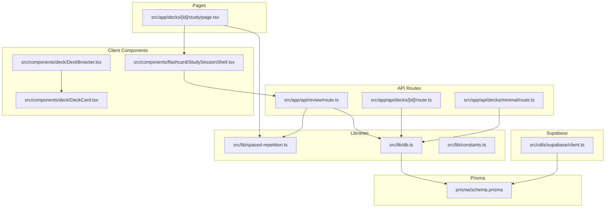
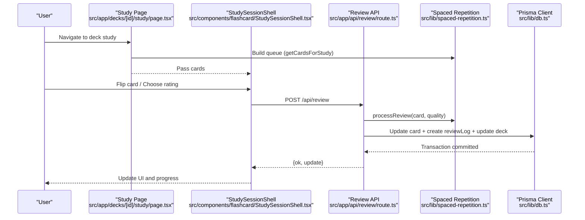
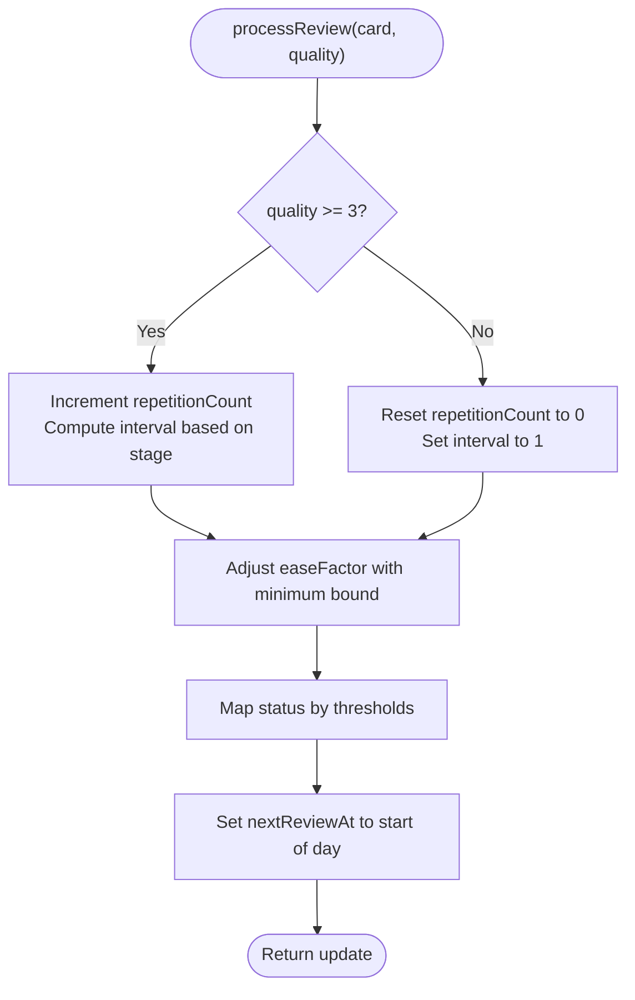
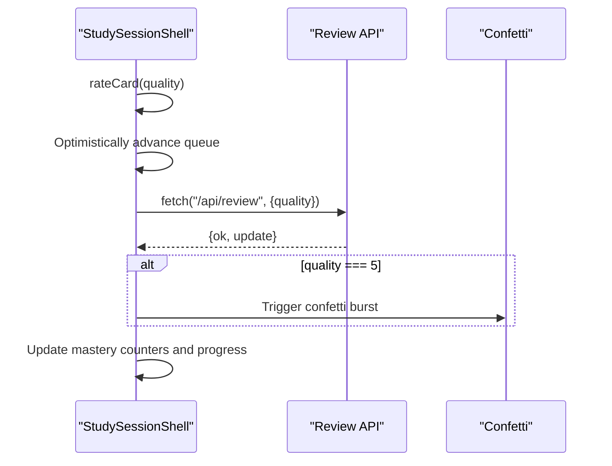
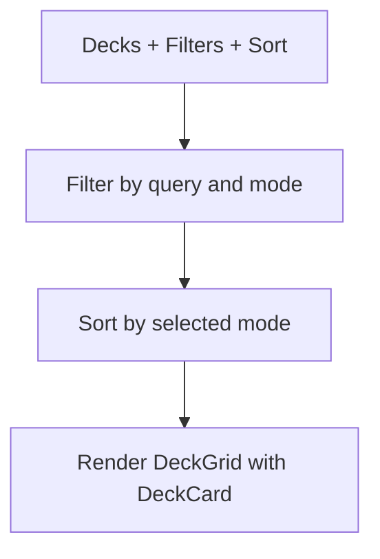
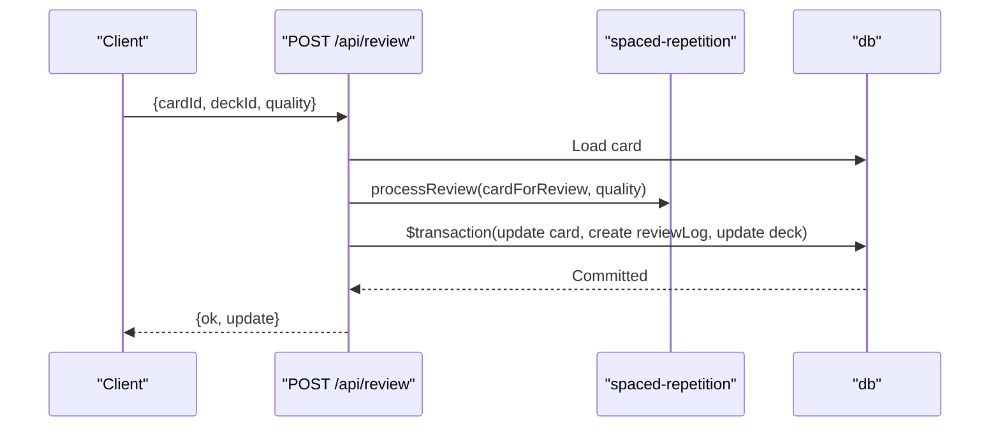
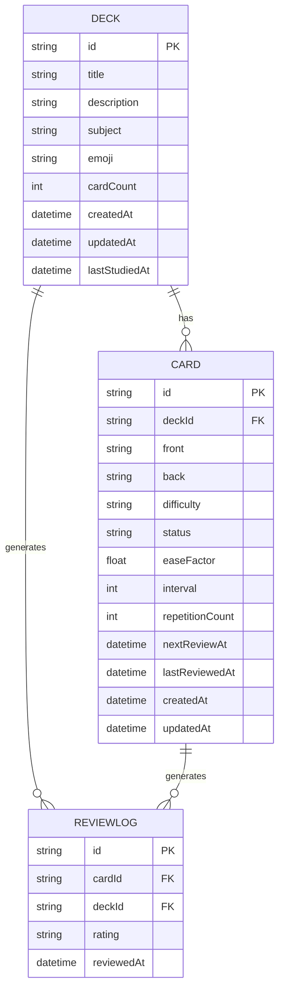
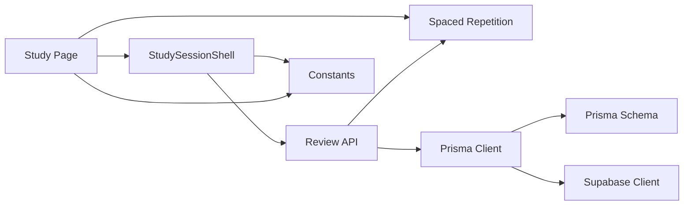

# Extensibility Patterns and Customization

<cite>
**Referenced Files in This Document**
- [README.md](file://README.md)
- [package.json](file://package.json)
- [prisma/schema.prisma](file://prisma/schema.prisma)
- [src/lib/spaced-repetition.ts](file://src/lib/spaced-repetition.ts)
- [src/app/api/review/route.ts](file://src/app/api/review/route.ts)
- [src/components/deck/DeckBrowser.tsx](file://src/components/deck/DeckBrowser.tsx)
- [src/components/deck/DeckCard.tsx](file://src/components/deck/DeckCard.tsx)
- [src/components/flashcard/StudySessionShell.tsx](file://src/components/flashcard/StudySessionShell.tsx)
- [src/app/decks/[id]/study/page.tsx](file://src/app/decks/[id]/study/page.tsx)
- [src/lib/constants.ts](file://src/lib/constants.ts)
- [src/app/api/decks/[id]/route.ts](file://src/app/api/decks/[id]/route.ts)
- [src/app/api/decks/minimal/route.ts](file://src/app/api/decks/minimal/route.ts)
- [src/lib/db.ts](file://src/lib/db.ts)
- [src/utils/supabase/client.ts](file://src/utils/supabase/client.ts)
</cite>

## Table of Contents
1. [Introduction](#introduction)
2. [Project Structure](#project-structure)
3. [Core Components](#core-components)
4. [Architecture Overview](#architecture-overview)
5. [Detailed Component Analysis](#detailed-component-analysis)
6. [Dependency Analysis](#dependency-analysis)
7. [Performance Considerations](#performance-considerations)
8. [Troubleshooting Guide](#troubleshooting-guide)
9. [Conclusion](#conclusion)
10. [Appendices](#appendices)

## Introduction
This document explains how to extend and customize the recall system. It focuses on:
- Extending the spaced repetition system
- Adding new deck subjects
- Customizing the study interface
- Creating custom UI components
- Extending the Prisma schema
- Implementing new study modes
- Plugin architectures and configuration management
- Maintaining backward compatibility

The guidance is grounded in the existing codebase and highlights extensibility points without modifying the core logic.

## Project Structure
The application follows a Next.js App Router layout with clear separation of concerns:
- API routes under src/app/api handle server actions (reviews, deck updates, minimal deck lists)
- Client components under src/components implement UI and interactive behaviors
- Libraries under src/lib encapsulate domain logic (spaced repetition, DB client, constants)
- Prisma schema defines the data model and migrations
- Supabase utilities provide SSR client configuration

**Diagram sources**
- [src/app/api/review/route.ts:1-76](file://src/app/api/review/route.ts#L1-L76)
- [src/app/api/decks/[id]/route.ts](file://src/app/api/decks/[id]/route.ts#L1-L43)
- [src/app/api/decks/minimal/route.ts:1-41](file://src/app/api/decks/minimal/route.ts#L1-L41)
- [src/components/deck/DeckBrowser.tsx:1-188](file://src/components/deck/DeckBrowser.tsx#L1-L188)
- [src/components/deck/DeckCard.tsx:1-50](file://src/components/deck/DeckCard.tsx#L1-L50)
- [src/components/flashcard/StudySessionShell.tsx:1-430](file://src/components/flashcard/StudySessionShell.tsx#L1-L430)
- [src/app/decks/[id]/study/page.tsx](file://src/app/decks/[id]/study/page.tsx#L1-L92)
- [src/lib/spaced-repetition.ts:1-141](file://src/lib/spaced-repetition.ts#L1-L141)
- [src/lib/db.ts:1-68](file://src/lib/db.ts#L1-L68)
- [src/lib/constants.ts:1-31](file://src/lib/constants.ts#L1-L31)
- [prisma/schema.prisma:1-51](file://prisma/schema.prisma#L1-L51)
- [src/utils/supabase/client.ts:1-11](file://src/utils/supabase/client.ts#L1-L11)

**Section sources**
- [README.md:1-102](file://README.md#L1-L102)
- [package.json:1-56](file://package.json#L1-L56)

## Core Components
This section outlines the primary extensibility points and customization surfaces.

- Spaced repetition engine
  - The SM-2 algorithm implementation is centralized and exposes a pure function for computing review updates and a queue builder for selecting cards for study.
  - Extension points:
    - Modify the rating mapping and status thresholds
    - Adjust queue selection logic (e.g., introduce weighted factors)
    - Add new modes by passing different parameters to the queue builder

- Study interface shell
  - The study shell orchestrates card progression, keyboard shortcuts, optimistic UI updates, and completion statistics.
  - Extension points:
    - Add new rating options or change shortcut mappings
    - Customize animations and micro-interactions
    - Extend completion screens with additional metrics

- Deck browser and cards
  - The deck browser supports filtering, sorting, and search; deck cards render mastery progress.
  - Extension points:
    - Add new filter modes and sort criteria
    - Introduce new metadata fields for decks (e.g., tags, categories)
    - Customize card rendering styles and progress visuals

- API endpoints
  - Review endpoint persists card updates and logs reviews atomically.
  - Deck management endpoints support updates and deletions.
  - Minimal deck endpoint provides lightweight deck summaries for dashboards.
  - Extension points:
    - Add new endpoints for bulk operations or analytics
    - Introduce new review metadata (e.g., tags, context)
    - Expand deck mutation payloads safely

- Prisma schema
  - The schema defines Deck, Card, and ReviewLog entities with relations.
  - Extension points:
    - Add optional fields to Deck (e.g., subject taxonomy)
    - Add new entities (e.g., Tags, Categories) and relations
    - Introduce indexes for performance on new queries

- Constants and styling
  - Subject options, default emojis, difficulty/status styles are centralized for consistent UI.
  - Extension points:
    - Add new subjects and default emojis
    - Extend difficulty/status styles for new statuses

**Section sources**
- [src/lib/spaced-repetition.ts:1-141](file://src/lib/spaced-repetition.ts#L1-L141)
- [src/components/flashcard/StudySessionShell.tsx:1-430](file://src/components/flashcard/StudySessionShell.tsx#L1-L430)
- [src/components/deck/DeckBrowser.tsx:1-188](file://src/components/deck/DeckBrowser.tsx#L1-L188)
- [src/components/deck/DeckCard.tsx:1-50](file://src/components/deck/DeckCard.tsx#L1-L50)
- [src/app/api/review/route.ts:1-76](file://src/app/api/review/route.ts#L1-L76)
- [src/app/api/decks/[id]/route.ts](file://src/app/api/decks/[id]/route.ts#L1-L43)
- [src/app/api/decks/minimal/route.ts:1-41](file://src/app/api/decks/minimal/route.ts#L1-L41)
- [prisma/schema.prisma:1-51](file://prisma/schema.prisma#L1-L51)
- [src/lib/constants.ts:1-31](file://src/lib/constants.ts#L1-L31)

## Architecture Overview
The system integrates client-side UI with server-side APIs and a persistent data layer. The study flow is orchestrated by a page component that builds a queue using the spaced repetition library and renders a study shell that interacts with the review API.

**Diagram sources**
- [src/app/decks/[id]/study/page.tsx](file://src/app/decks/[id]/study/page.tsx#L1-L92)
- [src/components/flashcard/StudySessionShell.tsx:1-430](file://src/components/flashcard/StudySessionShell.tsx#L1-L430)
- [src/app/api/review/route.ts:1-76](file://src/app/api/review/route.ts#L1-L76)
- [src/lib/spaced-repetition.ts:1-141](file://src/lib/spaced-repetition.ts#L1-L141)
- [src/lib/db.ts:1-68](file://src/lib/db.ts#L1-L68)

## Detailed Component Analysis

### Spaced Repetition Engine
The engine encapsulates the SM-2 algorithm and queue selection:
- Core calculation: compute new ease factor, interval, repetition count, next review date, and mapped status
- Queue builder: selects overdue and new cards, shuffles them, and limits the batch
- Rating mapping: provides labeled options with keyboard shortcuts and styles

Customization patterns:
- To extend the algorithm, wrap the core function with pre/post-processing (e.g., apply weights, contextual factors)
- To add new study modes, pass different parameters to the queue builder or implement alternate selection strategies
- To change UI affordances, adjust rating options and styles without altering core logic

**Diagram sources**
- [src/lib/spaced-repetition.ts:29-76](file://src/lib/spaced-repetition.ts#L29-L76)

**Section sources**
- [src/lib/spaced-repetition.ts:1-141](file://src/lib/spaced-repetition.ts#L1-L141)

### Study Interface Shell
The shell manages the study session lifecycle:
- Progress tracking and completion screen
- Keyboard shortcuts and optimistic updates
- Integration with the review API and confetti effects

Customization patterns:
- Add new rating options by extending the rating array and mapping to the API payload
- Modify animations and transitions by adjusting motion variants
- Extend completion metrics by adding new stats and rendering logic

**Diagram sources**
- [src/components/flashcard/StudySessionShell.tsx:68-125](file://src/components/flashcard/StudySessionShell.tsx#L68-L125)
- [src/app/api/review/route.ts:1-76](file://src/app/api/review/route.ts#L1-L76)

**Section sources**
- [src/components/flashcard/StudySessionShell.tsx:1-430](file://src/components/flashcard/StudySessionShell.tsx#L1-L430)

### Deck Browser and Cards
The deck browser provides filtering, sorting, and search:
- Filter modes: all, has due, recently studied, never studied
- Sort modes: recent, alphabetical, most cards, lowest mastery
- Deck cards render mastery percentage with animated progress bars

Customization patterns:
- Add new filter modes by extending the filter logic and UI controls
- Add new sort criteria by extending the sort comparator
- Extend deck metadata by adding new fields to the model and updating rendering

**Diagram sources**
- [src/components/deck/DeckBrowser.tsx:41-92](file://src/components/deck/DeckBrowser.tsx#L41-L92)
- [src/components/deck/DeckCard.tsx:1-50](file://src/components/deck/DeckCard.tsx#L1-L50)

**Section sources**
- [src/components/deck/DeckBrowser.tsx:1-188](file://src/components/deck/DeckBrowser.tsx#L1-L188)
- [src/components/deck/DeckCard.tsx:1-50](file://src/components/deck/DeckCard.tsx#L1-L50)

### API Endpoints
Endpoints expose CRUD and operational actions:
- Review endpoint validates inputs, computes updates, and persists atomically
- Deck management endpoint updates and deletes decks
- Minimal deck endpoint returns lightweight deck summaries

Customization patterns:
- Add new endpoints for analytics or bulk operations
- Extend payloads safely by adding optional fields and defaults
- Introduce new review metadata without breaking existing clients

**Diagram sources**
- [src/app/api/review/route.ts:1-76](file://src/app/api/review/route.ts#L1-L76)
- [src/lib/spaced-repetition.ts:29-76](file://src/lib/spaced-repetition.ts#L29-L76)
- [src/lib/db.ts:1-68](file://src/lib/db.ts#L1-L68)

**Section sources**
- [src/app/api/review/route.ts:1-76](file://src/app/api/review/route.ts#L1-L76)
- [src/app/api/decks/[id]/route.ts](file://src/app/api/decks/[id]/route.ts#L1-L43)
- [src/app/api/decks/minimal/route.ts:1-41](file://src/app/api/decks/minimal/route.ts#L1-L41)

### Prisma Schema Extensions
The schema defines core entities and relations:
- Deck, Card, ReviewLog with timestamps, status, and algorithm fields
- Relations: Deck.cards, Deck.reviewLogs; Card.reviewLogs; Card/Deck to ReviewLog

Customization patterns:
- Add optional fields to Deck (e.g., subject taxonomy) without breaking existing queries
- Introduce new entities and relations (e.g., Tags) and maintain referential integrity
- Add indexes for performance on new frequently queried fields

**Diagram sources**
- [prisma/schema.prisma:10-51](file://prisma/schema.prisma#L10-L51)

**Section sources**
- [prisma/schema.prisma:1-51](file://prisma/schema.prisma#L1-L51)

### Constants and Styling
Centralized constants define subjects, default emojis, and UI styles:
- SUBJECT_OPTIONS and DEFAULT_DECK_EMOJIS enable consistent subject taxonomy
- DIFFICULTY_STYLES and STATUS_STYLES provide reusable class sets

Customization patterns:
- Add new subjects and default emojis
- Extend styles for new statuses or difficulty levels
- Keep UI consistent by referencing constants

**Section sources**
- [src/lib/constants.ts:1-31](file://src/lib/constants.ts#L1-L31)

## Dependency Analysis
The system exhibits clear layering:
- Pages depend on libraries for logic and on components for UI
- Components depend on libraries for domain logic and on constants for styling
- API routes depend on libraries for domain logic and on the database client
- The database client depends on Prisma and environment configuration

**Diagram sources**
- [src/app/decks/[id]/study/page.tsx](file://src/app/decks/[id]/study/page.tsx#L1-L92)
- [src/components/flashcard/StudySessionShell.tsx:1-430](file://src/components/flashcard/StudySessionShell.tsx#L1-L430)
- [src/app/api/review/route.ts:1-76](file://src/app/api/review/route.ts#L1-L76)
- [src/lib/spaced-repetition.ts:1-141](file://src/lib/spaced-repetition.ts#L1-L141)
- [src/lib/db.ts:1-68](file://src/lib/db.ts#L1-L68)
- [prisma/schema.prisma:1-51](file://prisma/schema.prisma#L1-L51)
- [src/lib/constants.ts:1-31](file://src/lib/constants.ts#L1-L31)
- [src/utils/supabase/client.ts:1-11](file://src/utils/supabase/client.ts#L1-L11)

**Section sources**
- [src/lib/db.ts:1-68](file://src/lib/db.ts#L1-L68)
- [src/utils/supabase/client.ts:1-11](file://src/utils/supabase/client.ts#L1-L11)

## Performance Considerations
- Database connectivity
  - The DB client selects the appropriate URL and ensures SSL mode for serverless environments
  - Prefer platform-provided URLs in production for pooling benefits

- API throughput
  - The review endpoint performs atomic updates; keep payloads minimal
  - Consider batching review submissions for improved throughput

- UI responsiveness
  - The study shell uses optimistic updates to avoid blocking interactions
  - Keep animations lightweight and consider reduced motion preferences

- Query efficiency
  - The minimal deck endpoint filters cards efficiently on the server
  - Add indexes for new frequently queried fields in the schema

**Section sources**
- [src/lib/db.ts:8-68](file://src/lib/db.ts#L8-L68)
- [src/app/api/review/route.ts:44-68](file://src/app/api/review/route.ts#L44-L68)
- [src/app/api/decks/minimal/route.ts:23-33](file://src/app/api/decks/minimal/route.ts#L23-L33)
- [src/components/flashcard/StudySessionShell.tsx:78-96](file://src/components/flashcard/StudySessionShell.tsx#L78-L96)

## Troubleshooting Guide
Common issues and resolutions:
- Database configuration errors
  - Verify DATABASE_URL and related environment variables
  - Ensure SSL mode is set appropriately for serverless deployments

- Review submission failures
  - Confirm cardId and deckId are present and valid
  - Validate quality range and handle transaction errors gracefully

- Study page load failures
  - Check deck existence and card inclusion
  - Inspect error boundaries and fallback UI messages

- Supabase client initialization
  - Ensure NEXT_PUBLIC_SUPABASE_URL and publishable key are configured

**Section sources**
- [src/lib/db.ts:8-68](file://src/lib/db.ts#L8-L68)
- [src/app/api/review/route.ts:15-26](file://src/app/api/review/route.ts#L15-L26)
- [src/app/decks/[id]/study/page.tsx](file://src/app/decks/[id]/study/page.tsx#L43-L54)
- [src/utils/supabase/client.ts:1-11](file://src/utils/supabase/client.ts#L1-L11)

## Conclusion
The recall system provides robust extensibility through:
- Pure, testable domain logic for the spaced repetition engine
- Clear component boundaries enabling custom UI implementations
- Well-defined API endpoints for server interactions
- A flexible Prisma schema supporting incremental schema evolution
- Centralized constants for consistent styling and taxonomy

By leveraging these patterns, you can extend the system safely, maintain backward compatibility, and introduce new features incrementally.

## Appendices

### Extending the Spaced Repetition System
- Wrap the core processReview function to inject contextual factors or weights
- Add new selection strategies by extending getCardsForStudy with additional filters or scoring
- Introduce new statuses or rating semantics by updating the rating mapping and status thresholds

**Section sources**
- [src/lib/spaced-repetition.ts:29-76](file://src/lib/spaced-repetition.ts#L29-L76)
- [src/lib/spaced-repetition.ts:88-104](file://src/lib/spaced-repetition.ts#L88-L104)

### Adding New Deck Subjects
- Extend SUBJECT_OPTIONS and DEFAULT_DECK_EMOJIS
- Update deck creation/update flows to accept new subjects
- Ensure UI components render new subjects consistently

**Section sources**
- [src/lib/constants.ts:1-31](file://src/lib/constants.ts#L1-L31)

### Customizing the Study Interface
- Extend rating options in the rating mapping and update keyboard shortcuts
- Modify animations and transitions in the study shell
- Add new completion metrics and rendering logic

**Section sources**
- [src/components/flashcard/StudySessionShell.tsx:68-125](file://src/components/flashcard/StudySessionShell.tsx#L68-L125)
- [src/lib/spaced-repetition.ts:107-141](file://src/lib/spaced-repetition.ts#L107-L141)

### Creating Custom UI Components
- Follow the existing component patterns: props contracts, memoization, and controlled interactions
- Reuse constants for styling and taxonomy
- Maintain accessibility and responsive behavior

**Section sources**
- [src/components/deck/DeckBrowser.tsx:31-33](file://src/components/deck/DeckBrowser.tsx#L31-L33)
- [src/components/deck/DeckCard.tsx:6-12](file://src/components/deck/DeckCard.tsx#L6-L12)
- [src/lib/constants.ts:19-31](file://src/lib/constants.ts#L19-L31)

### Extending the Prisma Schema
- Add optional fields to Deck for new metadata
- Introduce new entities and relations carefully
- Add indexes for performance on new queries
- Keep migrations backward compatible where possible

**Section sources**
- [prisma/schema.prisma:10-51](file://prisma/schema.prisma#L10-L51)

### Implementing New Study Modes
- Extend the study page to accept mode parameters
- Implement alternate queue builders or selection strategies
- Update UI to reflect mode-specific behavior

**Section sources**
- [src/app/decks/[id]/study/page.tsx](file://src/app/decks/[id]/study/page.tsx#L74-L82)

### Plugin Architectures and Configuration Management
- Encapsulate custom logic in libraries similar to spaced-repetition
- Expose configuration via constants and environment variables
- Maintain backward compatibility by keeping APIs stable and adding optional parameters

**Section sources**
- [src/lib/spaced-repetition.ts:1-141](file://src/lib/spaced-repetition.ts#L1-L141)
- [src/lib/constants.ts:1-31](file://src/lib/constants.ts#L1-L31)
- [src/lib/db.ts:8-68](file://src/lib/db.ts#L8-L68)