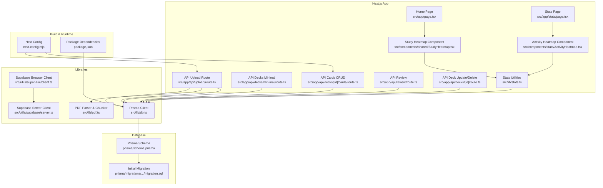
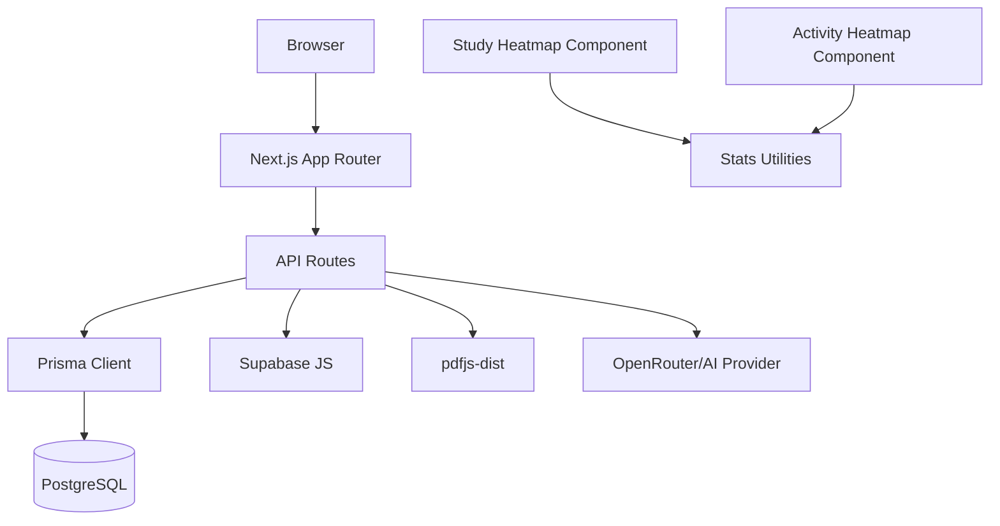
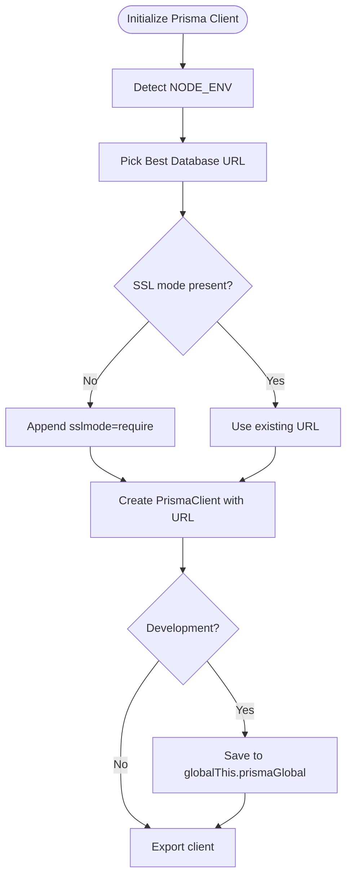
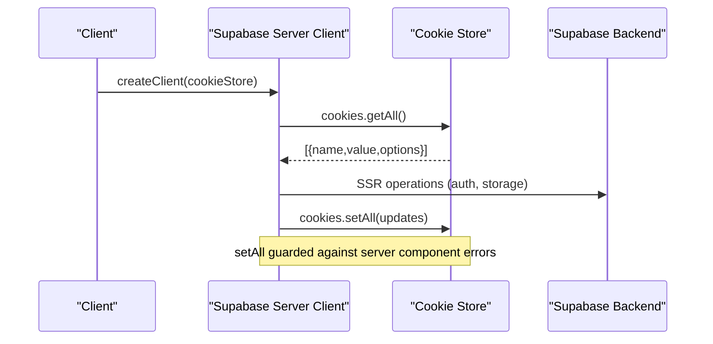
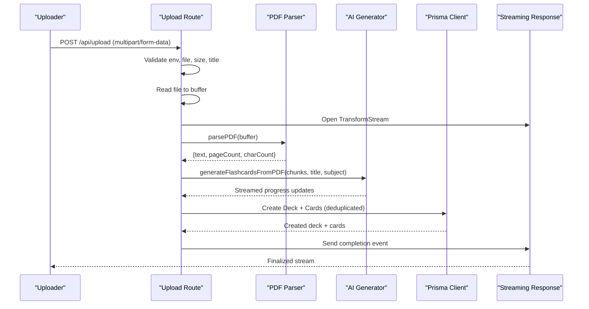
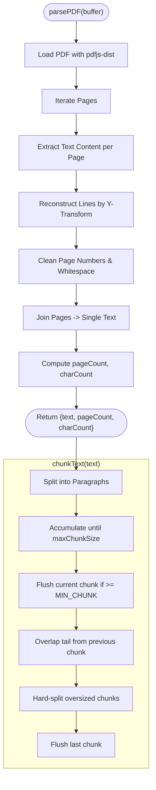
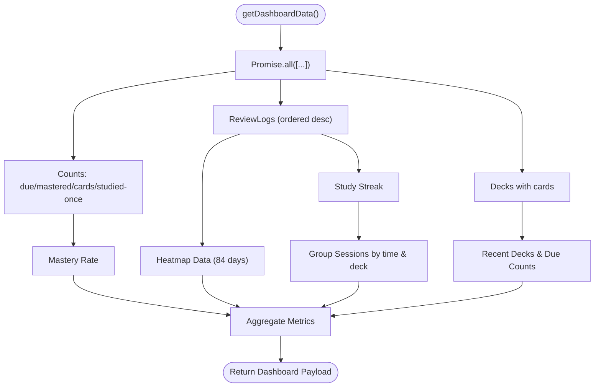
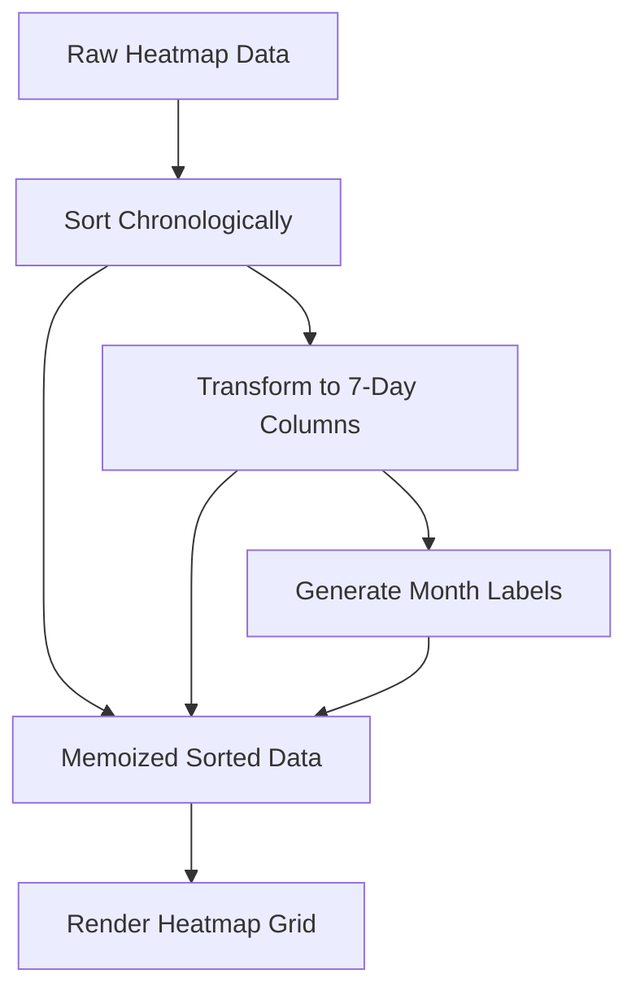
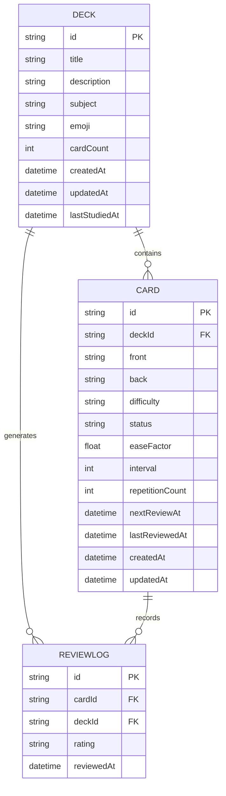
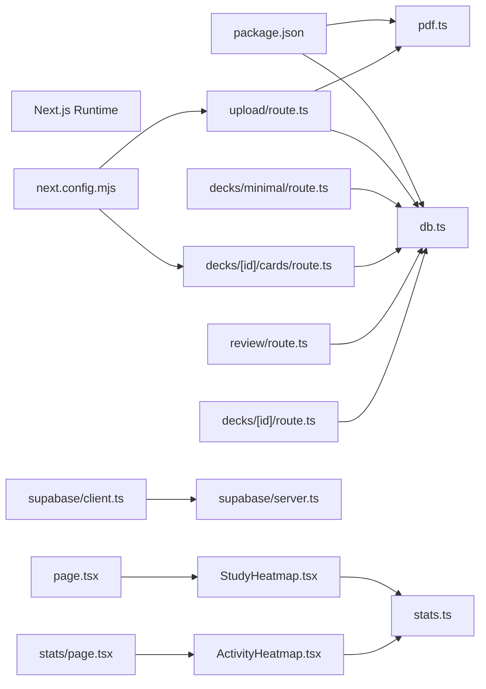

# Performance Optimization and Tuning

<cite>
**Referenced Files in This Document**
- [next.config.mjs](file://next.config.mjs)
- [package.json](file://package.json)
- [src/lib/db.ts](file://src/lib/db.ts)
- [src/utils/supabase/client.ts](file://src/utils/supabase/client.ts)
- [src/utils/supabase/server.ts](file://src/utils/supabase/server.ts)
- [src/app/api/decks/[id]/cards/route.ts](file://src/app/api/decks/[id]/cards/route.ts)
- [src/app/api/review/route.ts](file://src/app/api/review/route.ts)
- [src/app/api/decks/[id]/route.ts](file://src/app/api/decks/[id]/route.ts)
- [src/app/api/decks/minimal/route.ts](file://src/app/api/decks/minimal/route.ts)
- [src/app/api/upload/route.ts](file://src/app/api/upload/route.ts)
- [src/lib/pdf.ts](file://src/lib/pdf.ts)
- [src/lib/stats.ts](file://src/lib/stats.ts)
- [src/components/shared/StudyHeatmap.tsx](file://src/components/shared/StudyHeatmap.tsx)
- [src/components/stats/ActivityHeatmap.tsx](file://src/components/stats/ActivityHeatmap.tsx)
- [src/app/page.tsx](file://src/app/page.tsx)
- [src/app/stats/page.tsx](file://src/app/stats/page.tsx)
- [prisma/schema.prisma](file://prisma/schema.prisma)
- [prisma/migrations/20260421034221_init/migration.sql](file://prisma/migrations/20260421034221_init/migration.sql)
</cite>

## Update Summary
**Changes Made**
- Enhanced React component optimization section with concrete useMemo implementation example from StudyHeatmap component
- Added detailed analysis of memoization strategies for data transformation and rendering optimization
- Updated component performance guidance with specific optimization patterns
- Expanded practical examples of React performance optimization techniques

## Table of Contents
1. [Introduction](#introduction)
2. [Project Structure](#project-structure)
3. [Core Components](#core-components)
4. [Architecture Overview](#architecture-overview)
5. [Detailed Component Analysis](#detailed-component-analysis)
6. [Dependency Analysis](#dependency-analysis)
7. [Performance Considerations](#performance-considerations)
8. [Troubleshooting Guide](#troubleshooting-guide)
9. [Conclusion](#conclusion)
10. [Appendices](#appendices)

## Introduction
This document provides a comprehensive guide to performance optimization and tuning for recall. It focuses on database query optimization, caching strategies, API performance improvements, Next.js server component optimization, image optimization techniques, code splitting strategies, memory management, CPU optimization for PDF processing, database indexing strategies, profiling and monitoring, bottleneck identification, scaling, load balancing, and production hardening.

## Project Structure
The application follows a Next.js App Router structure with API routes under src/app/api, database access via Prisma in src/lib/db.ts, and Supabase client utilities under src/utils/supabase. PDF parsing and text chunking are handled in src/lib/pdf.ts, and statistics computation is centralized in src/lib/stats.ts. The Prisma schema defines the domain models and relationships.



**Diagram sources**
- [next.config.mjs:1-14](file://next.config.mjs#L1-L14)
- [package.json:1-57](file://package.json#L1-L57)
- [src/lib/db.ts:1-68](file://src/lib/db.ts#L1-L68)
- [src/utils/supabase/client.ts:1-11](file://src/utils/supabase/client.ts#L1-L11)
- [src/utils/supabase/server.ts:1-29](file://src/utils/supabase/server.ts#L1-L29)
- [src/app/api/upload/route.ts:1-298](file://src/app/api/upload/route.ts#L1-L298)
- [src/app/api/decks/minimal/route.ts:1-41](file://src/app/api/decks/minimal/route.ts#L1-L41)
- [src/app/api/decks/[id]/cards/route.ts](file://src/app/api/decks/[id]/cards/route.ts#L1-L40)
- [src/app/api/review/route.ts:1-76](file://src/app/api/review/route.ts#L1-L76)
- [src/app/api/decks/[id]/route.ts](file://src/app/api/decks/[id]/route.ts#L1-L43)
- [src/lib/stats.ts:1-222](file://src/lib/stats.ts#L1-L222)
- [src/lib/pdf.ts:1-130](file://src/lib/pdf.ts#L1-L130)
- [src/components/shared/StudyHeatmap.tsx:1-136](file://src/components/shared/StudyHeatmap.tsx#L1-L136)
- [src/components/stats/ActivityHeatmap.tsx:1-74](file://src/components/stats/ActivityHeatmap.tsx#L1-L74)
- [src/app/page.tsx:105-112](file://src/app/page.tsx#L105-L112)
- [src/app/stats/page.tsx:149](file://src/app/stats/page.tsx#L149)
- [prisma/schema.prisma:1-51](file://prisma/schema.prisma#L1-L51)
- [prisma/migrations/20260421034221_init/migration.sql:1-42](file://prisma/migrations/20260421034221_init/migration.sql#L1-L42)

**Section sources**
- [next.config.mjs:1-14](file://next.config.mjs#L1-L14)
- [package.json:1-57](file://package.json#L1-L57)
- [src/lib/db.ts:1-68](file://src/lib/db.ts#L1-L68)
- [src/utils/supabase/client.ts:1-11](file://src/utils/supabase/client.ts#L1-L11)
- [src/utils/supabase/server.ts:1-29](file://src/utils/supabase/server.ts#L1-L29)
- [src/app/api/upload/route.ts:1-298](file://src/app/api/upload/route.ts#L1-L298)
- [src/app/api/decks/minimal/route.ts:1-41](file://src/app/api/decks/minimal/route.ts#L1-L41)
- [src/app/api/decks/[id]/cards/route.ts](file://src/app/api/decks/[id]/cards/route.ts#L1-L40)
- [src/app/api/review/route.ts:1-76](file://src/app/api/review/route.ts#L1-L76)
- [src/app/api/decks/[id]/route.ts](file://src/app/api/decks/[id]/route.ts#L1-L43)
- [src/lib/stats.ts:1-222](file://src/lib/stats.ts#L1-L222)
- [src/lib/pdf.ts:1-130](file://src/lib/pdf.ts#L1-L130)
- [src/components/shared/StudyHeatmap.tsx:1-136](file://src/components/shared/StudyHeatmap.tsx#L1-L136)
- [src/components/stats/ActivityHeatmap.tsx:1-74](file://src/components/stats/ActivityHeatmap.tsx#L1-L74)
- [src/app/page.tsx:105-112](file://src/app/page.tsx#L105-L112)
- [src/app/stats/page.tsx:149](file://src/app/stats/page.tsx#L149)
- [prisma/schema.prisma:1-51](file://prisma/schema.prisma#L1-L51)
- [prisma/migrations/20260421034221_init/migration.sql:1-42](file://prisma/migrations/20260421034221_init/migration.sql#L1-L42)

## Core Components
- Database client initialization and URL selection logic for production pooling and SSL enforcement.
- Supabase browser and server clients with cookie handling tailored for server components.
- API routes for CRUD operations, review scheduling updates, minimal deck listings, and PDF upload with streaming progress.
- PDF parsing and text chunking optimized for serverless environments.
- Statistics computations leveraging concurrent queries and efficient aggregation.
- React components with memoization strategies for optimal rendering performance.

**Section sources**
- [src/lib/db.ts:1-68](file://src/lib/db.ts#L1-L68)
- [src/utils/supabase/client.ts:1-11](file://src/utils/supabase/client.ts#L1-L11)
- [src/utils/supabase/server.ts:1-29](file://src/utils/supabase/server.ts#L1-L29)
- [src/app/api/decks/[id]/cards/route.ts](file://src/app/api/decks/[id]/cards/route.ts#L1-L40)
- [src/app/api/review/route.ts:1-76](file://src/app/api/review/route.ts#L1-L76)
- [src/app/api/decks/minimal/route.ts:1-41](file://src/app/api/decks/minimal/route.ts#L1-L41)
- [src/app/api/upload/route.ts:1-298](file://src/app/api/upload/route.ts#L1-L298)
- [src/lib/pdf.ts:1-130](file://src/lib/pdf.ts#L1-L130)
- [src/lib/stats.ts:1-222](file://src/lib/stats.ts#L1-L222)
- [src/components/shared/StudyHeatmap.tsx:1-136](file://src/components/shared/StudyHeatmap.tsx#L1-L136)

## Architecture Overview
The system integrates Next.js API routes with Prisma for data persistence and Supabase for SSR/SSG client interactions. PDF processing runs server-side with streaming responses to improve perceived latency. The architecture emphasizes:
- Separation of concerns: API routes encapsulate business logic, Prisma handles persistence, and utilities handle specialized tasks.
- Production-grade database connectivity with pooling and SSL enforcement.
- Streaming pipelines for long-running operations like PDF parsing and AI generation.
- Optimized React components with memoization for efficient rendering.



**Diagram sources**
- [src/app/api/upload/route.ts:1-298](file://src/app/api/upload/route.ts#L1-L298)
- [src/lib/db.ts:1-68](file://src/lib/db.ts#L1-L68)
- [src/utils/supabase/client.ts:1-11](file://src/utils/supabase/client.ts#L1-L11)
- [src/lib/pdf.ts:1-130](file://src/lib/pdf.ts#L1-L130)
- [src/lib/stats.ts:1-222](file://src/lib/stats.ts#L1-L222)
- [src/components/shared/StudyHeatmap.tsx:1-136](file://src/components/shared/StudyHeatmap.tsx#L1-L136)
- [src/components/stats/ActivityHeatmap.tsx:1-74](file://src/components/stats/ActivityHeatmap.tsx#L1-L74)
- [package.json:18-42](file://package.json#L18-L42)

## Detailed Component Analysis

### Database Client Initialization and Pooling
- URL selection prioritizes platform-specific Postgres URLs for pooling-friendly connections.
- SSL enforcement ensures secure connections in serverless environments.
- Global singleton pattern prevents multiple client instances during development.



**Diagram sources**
- [src/lib/db.ts:8-68](file://src/lib/db.ts#L8-L68)

**Section sources**
- [src/lib/db.ts:1-68](file://src/lib/db.ts#L1-L68)

### Supabase Client Utilities
- Browser client creation with public environment variables.
- Server client creation with cookie store integration, including safe setAll handling for server components.



**Diagram sources**
- [src/utils/supabase/server.ts:7-28](file://src/utils/supabase/server.ts#L7-L28)
- [src/utils/supabase/client.ts:1-11](file://src/utils/supabase/client.ts#L1-L11)

**Section sources**
- [src/utils/supabase/client.ts:1-11](file://src/utils/supabase/client.ts#L1-L11)
- [src/utils/supabase/server.ts:1-29](file://src/utils/supabase/server.ts#L1-L29)

### API Routes: CRUD, Review, Minimal Decks, Upload
- Decks/Cards CRUD: Efficient creation with immediate deck counter increment.
- Review: Atomic transaction for card update and review log insertion.
- Minimal Decks: Force-dynamic route with selective field projection for lightweight lists.
- Upload: Streaming response with progress events, rate limiting, and generous maxDuration for long-running tasks.



**Diagram sources**
- [src/app/api/upload/route.ts:86-297](file://src/app/api/upload/route.ts#L86-L297)
- [src/lib/pdf.ts:14-79](file://src/lib/pdf.ts#L14-L79)

**Section sources**
- [src/app/api/decks/[id]/cards/route.ts](file://src/app/api/decks/[id]/cards/route.ts#L1-L40)
- [src/app/api/review/route.ts:1-76](file://src/app/api/review/route.ts#L1-L76)
- [src/app/api/decks/minimal/route.ts:1-41](file://src/app/api/decks/minimal/route.ts#L1-L41)
- [src/app/api/upload/route.ts:1-298](file://src/app/api/upload/route.ts#L1-L298)
- [src/lib/pdf.ts:1-130](file://src/lib/pdf.ts#L1-L130)

### PDF Parsing and Text Chunking
- Uses pdfjs-dist with system fonts disabled to avoid heavy rendering.
- Iterates pages to collect text content, reconstructs lines using vertical transforms, and cleans page numbers and excessive whitespace.
- Chunks text into overlapping segments to aid AI processing, with configurable chunk sizes and overlap.



**Diagram sources**
- [src/lib/pdf.ts:14-129](file://src/lib/pdf.ts#L14-L129)

**Section sources**
- [src/lib/pdf.ts:1-130](file://src/lib/pdf.ts#L1-L130)

### Statistics Computation
- Concurrently fetches counts, decks, and review logs to minimize round-trips.
- Computes derived metrics like mastery rate, study streak, and heatmap data.
- Groups recent sessions with time-based boundaries and deck transitions.



**Diagram sources**
- [src/lib/stats.ts:51-221](file://src/lib/stats.ts#L51-L221)

**Section sources**
- [src/lib/stats.ts:1-222](file://src/lib/stats.ts#L1-L222)

### React Component Optimization with useMemo

**Updated** Added concrete example of React useMemo optimization in StudyHeatmap component

The StudyHeatmap component demonstrates best practices for React performance optimization through strategic useMemo usage:

#### Data Transformation Memoization
The component uses useMemo to optimize expensive data transformations:

```typescript
// Sort data chronologically once per render cycle
const sortedData = useMemo(() => {
  return [...data].sort((a, b) => new Date(a.date).getTime() - new Date(b.date).getTime());
}, [data]);

// Transform flat array into 7-day columns
const columns = useMemo(() => {
  const cols = [];
  for (let i = 0; i < sortedData.length; i += 7) {
    cols.push(sortedData.slice(i, i + 7));
  }
  return cols;
}, [sortedData]);
```

#### Derived State Memoization
The component memoizes computed values that depend on props:

```typescript
// Generate month labels for column headers
const monthLabels = useMemo(() => {
  const labels: { label: string; colIndex: number }[] = [];
  let currentMonth = "";
  
  columns.forEach((col, idx) => {
    if (col.length > 0) {
      const month = format(new Date(col[0].date), "MMM");
      if (month !== currentMonth) {
        labels.push({ label: month, colIndex: idx });
        currentMonth = month;
      }
    }
  });
  
  return labels;
}, [columns]);
```

#### Performance Benefits
- **Avoids redundant sorting**: Data is sorted only when input data changes
- **Prevents unnecessary array transformations**: Column generation occurs only when sorted data changes
- **Reduces DOM calculations**: Month labels are computed once per render cycle
- **Optimizes rendering**: Stable references prevent unnecessary re-renders of child components



**Diagram sources**
- [src/components/shared/StudyHeatmap.tsx:24-60](file://src/components/shared/StudyHeatmap.tsx#L24-L60)

**Section sources**
- [src/components/shared/StudyHeatmap.tsx:1-136](file://src/components/shared/StudyHeatmap.tsx#L1-L136)

### Database Schema and Indexing Strategies
- Domain models: Deck, Card, ReviewLog with foreign keys and timestamps.
- Missing indexes: nextReviewAt on Card, status on Card, deckId on ReviewLog, reviewedAt on ReviewLog.
- Recommended composite indexes: (status, nextReviewAt) on Card, (deckId, reviewedAt) on ReviewLog.



**Diagram sources**
- [prisma/schema.prisma:10-51](file://prisma/schema.prisma#L10-L51)
- [prisma/migrations/20260421034221_init/migration.sql:1-42](file://prisma/migrations/20260421034221_init/migration.sql#L1-L42)

**Section sources**
- [prisma/schema.prisma:1-51](file://prisma/schema.prisma#L1-L51)
- [prisma/migrations/20260421034221_init/migration.sql:1-42](file://prisma/migrations/20260421034221_init/migration.sql#L1-L42)

## Dependency Analysis
- Next.js runtime configuration marks server-only externals for pdf-parse and canvas to prevent bundling in the browser.
- Dependencies include Prisma, Supabase, pdfjs-dist, and OpenAI-compatible providers.
- API routes depend on Prisma for persistence and optional AI services for content generation.
- React components utilize memoization for performance optimization.



**Diagram sources**
- [next.config.mjs:5-10](file://next.config.mjs#L5-L10)
- [package.json:18-42](file://package.json#L18-L42)
- [src/app/api/upload/route.ts:1-298](file://src/app/api/upload/route.ts#L1-L298)
- [src/app/api/decks/minimal/route.ts:1-41](file://src/app/api/decks/minimal/route.ts#L1-L41)
- [src/app/api/decks/[id]/cards/route.ts](file://src/app/api/decks/[id]/cards/route.ts#L1-L40)
- [src/app/api/review/route.ts:1-76](file://src/app/api/review/route.ts#L1-L76)
- [src/app/api/decks/[id]/route.ts](file://src/app/api/decks/[id]/route.ts#L1-L43)
- [src/lib/db.ts:1-68](file://src/lib/db.ts#L1-L68)
- [src/lib/pdf.ts:1-130](file://src/lib/pdf.ts#L1-L130)
- [src/utils/supabase/client.ts:1-11](file://src/utils/supabase/client.ts#L1-L11)
- [src/utils/supabase/server.ts:1-29](file://src/utils/supabase/server.ts#L1-L29)
- [src/components/shared/StudyHeatmap.tsx:1-136](file://src/components/shared/StudyHeatmap.tsx#L1-L136)
- [src/components/stats/ActivityHeatmap.tsx:1-74](file://src/components/stats/ActivityHeatmap.tsx#L1-L74)
- [src/app/page.tsx:105-112](file://src/app/page.tsx#L105-L112)
- [src/app/stats/page.tsx:149](file://src/app/stats/page.tsx#L149)

**Section sources**
- [next.config.mjs:1-14](file://next.config.mjs#L1-L14)
- [package.json:1-57](file://package.json#L1-L57)
- [src/app/api/upload/route.ts:1-298](file://src/app/api/upload/route.ts#L1-L298)
- [src/app/api/decks/minimal/route.ts:1-41](file://src/app/api/decks/minimal/route.ts#L1-L41)
- [src/app/api/decks/[id]/cards/route.ts](file://src/app/api/decks/[id]/cards/route.ts#L1-L40)
- [src/app/api/review/route.ts:1-76](file://src/app/api/review/route.ts#L1-L76)
- [src/app/api/decks/[id]/route.ts](file://src/app/api/decks/[id]/route.ts#L1-L43)
- [src/lib/db.ts:1-68](file://src/lib/db.ts#L1-L68)
- [src/lib/pdf.ts:1-130](file://src/lib/pdf.ts#L1-L130)
- [src/utils/supabase/client.ts:1-11](file://src/utils/supabase/client.ts#L1-L11)
- [src/utils/supabase/server.ts:1-29](file://src/utils/supabase/server.ts#L1-L29)
- [src/components/shared/StudyHeatmap.tsx:1-136](file://src/components/shared/StudyHeatmap.tsx#L1-L136)
- [src/components/stats/ActivityHeatmap.tsx:1-74](file://src/components/stats/ActivityHeatmap.tsx#L1-L74)
- [src/app/page.tsx:105-112](file://src/app/page.tsx#L105-L112)
- [src/app/stats/page.tsx:149](file://src/app/stats/page.tsx#L149)

## Performance Considerations

### Database Query Optimization
- Use selective projections to reduce payload size (e.g., minimal decks route).
- Prefer indexed filters: add indexes on Card.nextReviewAt, Card.status, ReviewLog.deckId, ReviewLog.reviewedAt.
- Batch writes: leverage Prisma transactions for atomic updates (as in review route).
- Connection pooling: rely on platform-provided Postgres URLs and ensure sslmode=require for secure connections.

**Section sources**
- [src/app/api/decks/minimal/route.ts:8-19](file://src/app/api/decks/minimal/route.ts#L8-L19)
- [src/app/api/review/route.ts:45-68](file://src/app/api/review/route.ts#L45-L68)
- [src/lib/db.ts:8-47](file://src/lib/db.ts#L8-L47)
- [prisma/schema.prisma:24-40](file://prisma/schema.prisma#L24-L40)
- [prisma/migrations/20260421034221_init/migration.sql:15-41](file://prisma/migrations/20260421034221_init/migration.sql#L15-L41)

### Caching Strategies
- Application-level: memoize expensive computations (e.g., repeated dashboard aggregations) with short TTLs.
- Edge caching: cache static assets and immutable API responses at CDN edges.
- Database query caching: cache frequent reads like minimal decks for short intervals; invalidate on mutations.

### API Performance Improvements
- Streaming responses: use TransformStream for long-running uploads to reduce perceived latency.
- Concurrency: use Promise.all for independent data fetches (as in stats).
- Input validation: fail fast with clear messages to avoid unnecessary work.
- Rate limiting: per-IP rate limiting to protect upstream services and database.

**Section sources**
- [src/app/api/upload/route.ts:164-297](file://src/app/api/upload/route.ts#L164-L297)
- [src/lib/stats.ts:59-88](file://src/lib/stats.ts#L59-L88)
- [src/app/api/upload/route.ts:73-84](file://src/app/api/upload/route.ts#L73-L84)

### Next.js Server Component Optimization
- Keep server components lean; delegate heavy work to API routes.
- Use dynamic routes and selective data fetching to avoid unnecessary re-renders.
- Externalize server-only modules (pdf-parse, canvas) to prevent client bundling.

**Section sources**
- [next.config.mjs:5-10](file://next.config.mjs#L5-L10)

### React Component Optimization Strategies

**Updated** Enhanced with concrete useMemo implementation example

#### Strategic Memoization Patterns
The StudyHeatmap component demonstrates several key memoization strategies:

1. **Data Transformation Memoization**: Expensive operations like sorting and array transformations are memoized
2. **Derived State Memoization**: Computed values that depend on props are cached
3. **Stable References**: Memoized values maintain referential stability across renders

#### Implementation Pattern
```typescript
// Cache expensive computation
const expensiveValue = useMemo(() => {
  // Heavy computation
  return complexCalculation(data);
}, [dependencies]);

// Prevent unnecessary re-renders
const stableValue = useMemo(() => {
  // Computed value based on props
  return deriveValue(props);
}, [props]);
```

#### Performance Benefits
- **Reduced computational overhead**: Expensive operations run only when dependencies change
- **Stable component references**: Prevents unnecessary re-renders of child components
- **Improved rendering performance**: Optimized DOM calculations and virtual DOM updates

**Section sources**
- [src/components/shared/StudyHeatmap.tsx:24-60](file://src/components/shared/StudyHeatmap.tsx#L24-L60)

### Image Optimization Techniques
- Use next/image with appropriate widths and aspect ratios.
- Prefer modern formats (AVIF/WebP) when supported; ensure fallbacks.
- Lazy-load images and apply blur placeholders for improved LCP.

### Code Splitting Strategies
- Dynamic imports for heavy components (e.g., 3D flashcard viewer).
- Route-based code splitting via App Router pages and server components.
- Externalize third-party libraries that are not frequently used.

### Memory Management
- Avoid retaining large buffers after parsing; process PDFs in streams where possible.
- Use efficient data structures (Sets for deduplication) and clear caches periodically.
- Monitor heap usage in production and set appropriate Node.js memory limits.

### CPU Optimization for PDF Processing
- Disable font rendering in pdfjs-dist to reduce CPU overhead.
- Process pages sequentially or with controlled concurrency to balance throughput and resource usage.
- Precompute chunk overlaps to minimize repeated work.

**Section sources**
- [src/lib/pdf.ts:17-21](file://src/lib/pdf.ts#L17-L21)
- [src/lib/pdf.ts:85-129](file://src/lib/pdf.ts#L85-L129)

### Database Indexing Strategies
- Add indexes on frequently filtered columns:
  - Card(nextReviewAt)
  - Card(status)
  - ReviewLog(deckId)
  - ReviewLog(reviewedAt)
- Consider composite indexes:
  - Card(status, nextReviewAt)
  - ReviewLog(deckId, reviewedAt)

**Section sources**
- [prisma/schema.prisma:24-50](file://prisma/schema.prisma#L24-L50)
- [prisma/migrations/20260421034221_init/migration.sql:15-41](file://prisma/migrations/20260421034221_init/migration.sql#L15-L41)

### Profiling Techniques, Monitoring, and Bottleneck Identification
- Instrument API routes with timing around critical sections (parsing, AI generation, DB writes).
- Use Next.js telemetry and APM tools to track slow routes and endpoints.
- Monitor database query plans and slow queries; correlate with frontend metrics.
- Track error rates and latency percentiles to identify hotspots.

### Scaling Considerations, Load Balancing, and Production Hardening
- Horizontal scaling: deploy behind a load balancer; ensure stateless API routes.
- Connection limits: tune database connection pools and timeouts.
- Health checks: expose readiness/liveness endpoints; monitor queue depths for background tasks.
- Secrets management: store DATABASE_URL and API keys in environment variables; rotate regularly.
- Observability: centralize logs, metrics, and traces; alert on regressions.

## Troubleshooting Guide
- Database connectivity failures: verify DATABASE_URL and sslmode=require; confirm platform-specific Postgres URLs are set in production.
- AI service errors: handle rate limits, model availability, and invalid API keys gracefully; surface user-friendly messages.
- PDF parsing issues: ensure sufficient text content; validate file types and sizes; adjust chunk sizes for performance.
- Streaming problems: confirm X-Accel-Buffering is disabled for immediate delivery; validate TransformStream writer lifecycle.
- React performance issues: verify useMemo dependencies are correctly specified; ensure memoized values are stable across renders.

**Section sources**
- [src/lib/db.ts:8-47](file://src/lib/db.ts#L8-L47)
- [src/app/api/upload/route.ts:86-106](file://src/app/api/upload/route.ts#L86-L106)
- [src/app/api/upload/route.ts:179-189](file://src/app/api/upload/route.ts#L179-L189)
- [src/app/api/upload/route.ts:288-296](file://src/app/api/upload/route.ts#L288-L296)
- [src/components/shared/StudyHeatmap.tsx:24-60](file://src/components/shared/StudyHeatmap.tsx#L24-L60)

## Conclusion
Recall's performance hinges on efficient database access patterns, strategic indexing, streaming APIs, and mindful resource usage. The addition of React useMemo optimization in components like StudyHeatmap demonstrates practical approaches to component-level performance enhancement. By applying the recommendations—selective projections, transactions, indexes, concurrency, memoization strategies, and observability—you can achieve responsive UIs, scalable backend operations, and robust production deployments.

## Appendices
- Recommended Postgres indexes for improved query performance.
- Deployment checklist for production hardening and monitoring.
- React component optimization patterns and best practices.