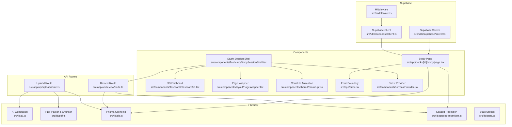
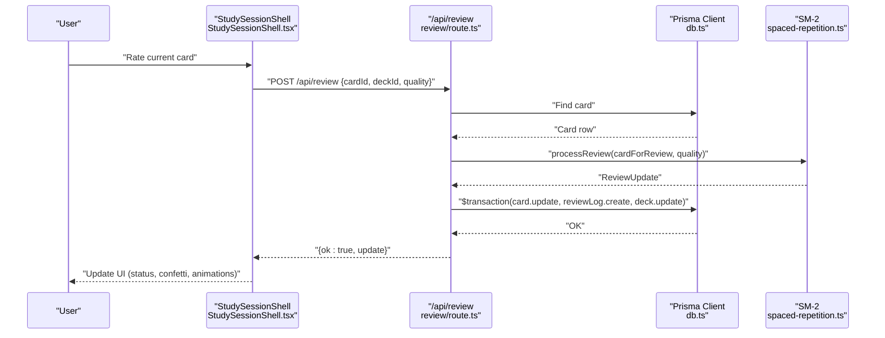
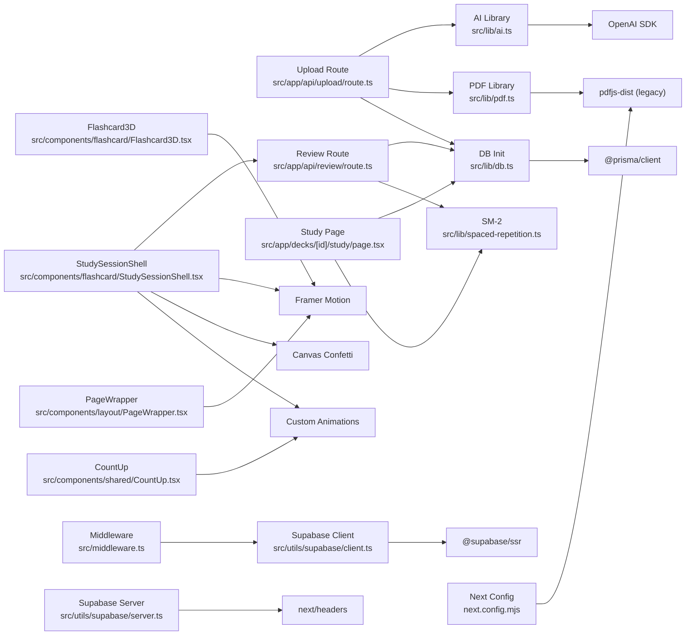

# Troubleshooting and Debugging

<cite>
**Referenced Files in This Document**
- [README.md](file://README.md)
- [SUPABASE_SETUP.md](file://SUPABASE_SETUP.md)
- [SUPABASE_INTEGRATION_COMPLETE.md](file://SUPABASE_INTEGRATION_COMPLETE.md)
- [SUPABASE_SETUP_COMPLETE.md](file://SUPABASE_SETUP_COMPLETE.md)
- [VERCEL_SUPABASE_MCP_GUIDE.md](file://VERCEL_SUPABASE_MCP_GUIDE.md)
- [PRODUCTION_FIX_SUMMARY.md](file://PRODUCTION_FIX_SUMMARY.md)
- [package.json](file://package.json)
- [tsconfig.json](file://tsconfig.json)
- [prisma/schema.prisma](file://prisma/schema.prisma)
- [src/lib/ai.ts](file://src/lib/ai.ts)
- [src/lib/pdf.ts](file://src/lib/pdf.ts)
- [src/lib/db.ts](file://src/lib/db.ts)
- [src/lib/spaced-repetition.ts](file://src/lib/spaced-repetition.ts)
- [src/utils/supabase/client.ts](file://src/utils/supabase/client.ts)
- [src/utils/supabase/server.ts](file://src/utils/supabase/server.ts)
- [src/app/api/upload/route.ts](file://src/app/api/upload/route.ts)
- [src/app/api/review/route.ts](file://src/app/api/review/route.ts)
- [src/app/decks/[id]/study/page.tsx](file://src/app/decks/[id]/study/page.tsx)
- [src/components/flashcard/StudySessionShell.tsx](file://src/components/flashcard/StudySessionShell.tsx)
- [src/components/flashcard/Flashcard3D.tsx](file://src/components/flashcard/Flashcard3D.tsx)
- [src/components/layout/PageWrapper.tsx](file://src/components/layout/PageWrapper.tsx)
- [src/components/shared/CountUp.tsx](file://src/components/shared/CountUp.tsx)
- [src/app/error.tsx](file://src/app/error.tsx)
- [src/components/ui/ToastProvider.tsx](file://src/components/ui/ToastProvider.tsx)
- [src/lib/stats.ts](file://src/lib/stats.ts)
- [src/middleware.ts](file://src/middleware.ts)
- [next.config.mjs](file://next.config.mjs)
</cite>

## Update Summary
**Changes Made**
- Updated Hydration and Server-Side Rendering Debugging section to reflect resolved Framer Motion hydration issues
- Revised Study Session section to reflect new custom animation implementations alongside Framer Motion
- Enhanced Component Rendering Problems section with updated hydration-safe guidance
- Updated PDF Processing section to reflect serverless-friendly approach using legacy pdfjs-dist build
- Added new section on Custom Animation Implementations
- Updated Troubleshooting Guide with revised hydration-related step-by-step procedures

## Table of Contents
1. [Introduction](#introduction)
2. [Project Structure](#project-structure)
3. [Core Components](#core-components)
4. [Architecture Overview](#architecture-overview)
5. [Detailed Component Analysis](#detailed-component-analysis)
6. [Hydration and Server-Side Rendering Debugging](#hydration-and-server-side-rendering-debugging)
7. [Custom Animation Implementations](#custom-animation-implementations)
8. [Dependency Analysis](#dependency-analysis)
9. [Performance Considerations](#performance-considerations)
10. [Troubleshooting Guide](#troubleshooting-guide)
11. [Conclusion](#conclusion)
12. [Appendices](#appendices)

## Introduction
This document provides comprehensive troubleshooting and debugging guidance for the recall application. It focuses on diagnosing and resolving common issues in AI generation failures, PDF processing errors, database connectivity problems, spaced repetition calculations, study session issues, component rendering problems, and most importantly, hydration-related debugging and server-side rendering issues. The application now uses a hybrid approach combining Framer Motion animations with custom animation implementations for optimal performance across serverless environments. It also covers logging strategies, error handling patterns, diagnostic tools, production debugging, performance profiling, and monitoring setup, along with step-by-step troubleshooting guides for typical user-reported and developer workflow issues.

## Project Structure
The application is a Next.js 14 app using TypeScript, Prisma ORM, Supabase for authentication and SSR client utilities, and OpenAI-compatible APIs for flashcard generation. Key areas relevant to debugging include:
- API routes for PDF upload and review submission
- Libraries for AI generation, PDF parsing/chunking, database initialization, and spaced repetition
- Supabase client/server utilities
- Study session shell and study page with hybrid animation implementations
- Stats utilities for dashboard analytics
- Error boundary and toast UI for user feedback
- Middleware for Supabase authentication

**Diagram sources**
- [src/app/api/upload/route.ts:1-298](file://src/app/api/upload/route.ts#L1-L298)
- [src/app/api/review/route.ts:1-76](file://src/app/api/review/route.ts#L1-L76)
- [src/lib/ai.ts:1-233](file://src/lib/ai.ts#L1-L233)
- [src/lib/pdf.ts:1-137](file://src/lib/pdf.ts#L1-L137)
- [src/lib/db.ts:1-68](file://src/lib/db.ts#L1-L68)
- [src/lib/spaced-repetition.ts:1-141](file://src/lib/spaced-repetition.ts#L1-L141)
- [src/lib/stats.ts:1-222](file://src/lib/stats.ts#L1-L222)
- [src/utils/supabase/client.ts:1-11](file://src/utils/supabase/client.ts#L1-L11)
- [src/utils/supabase/server.ts:1-29](file://src/utils/supabase/server.ts#L1-L29)
- [src/middleware.ts:1-22](file://src/middleware.ts#L1-L22)
- [src/app/decks/[id]/study/page.tsx](file://src/app/decks/[id]/study/page.tsx#L1-L92)
- [src/components/flashcard/StudySessionShell.tsx:1-431](file://src/components/flashcard/StudySessionShell.tsx#L1-L431)
- [src/components/flashcard/Flashcard3D.tsx:1-58](file://src/components/flashcard/Flashcard3D.tsx#L1-L58)
- [src/components/layout/PageWrapper.tsx:1-15](file://src/components/layout/PageWrapper.tsx#L1-L15)
- [src/components/shared/CountUp.tsx:1-37](file://src/components/shared/CountUp.tsx#L1-L37)
- [src/app/error.tsx:1-44](file://src/app/error.tsx#L1-L44)
- [src/components/ui/ToastProvider.tsx:1-66](file://src/components/ui/ToastProvider.tsx#L1-L66)

**Section sources**
- [package.json:1-54](file://package.json#L1-L54)
- [tsconfig.json](file://tsconfig.json)

## Core Components
- AI generation: Handles environment checks, model selection, streaming progress, JSON parsing, deduplication, and retry logic.
- PDF processing: Parses PDF buffers using legacy pdfjs-dist build for serverless compatibility, cleans text, removes page numbers, collapses whitespace, and chunks text for AI.
- Database initialization: Selects appropriate datasource URL, ensures sslmode=require for serverless, and initializes Prisma client.
- Spaced repetition: Implements SM-2 algorithm, due-card queue builder, and rating option mapping.
- Upload pipeline: Streams progress, validates inputs, parses/chunks PDF using serverless-friendly approach, generates cards, deduplicates, and persists decks/cards.
- Review pipeline: Validates inputs, computes SM-2 updates, and persists card and review log atomically.
- Study session: Loads deck, builds study queue, renders interactive session with hybrid animation implementations (Framer Motion + custom), and handles keyboard controls.
- Stats utilities: Computes due counts, mastery rates, streaks, heatmaps, and recent sessions.
- Hydration-aware components: Page wrapper with client-side rendering, animated counters using custom implementations, and Framer Motion components with proper hydration handling.

**Section sources**
- [src/lib/ai.ts:1-233](file://src/lib/ai.ts#L1-L233)
- [src/lib/pdf.ts:1-137](file://src/lib/pdf.ts#L1-L137)
- [src/lib/db.ts:1-68](file://src/lib/db.ts#L1-L68)
- [src/lib/spaced-repetition.ts:1-141](file://src/lib/spaced-repetition.ts#L1-L141)
- [src/app/api/upload/route.ts:1-298](file://src/app/api/upload/route.ts#L1-L298)
- [src/app/api/review/route.ts:1-76](file://src/app/api/review/route.ts#L1-L76)
- [src/app/decks/[id]/study/page.tsx](file://src/app/decks/[id]/study/page.tsx#L1-L92)
- [src/components/flashcard/StudySessionShell.tsx:1-431](file://src/components/flashcard/StudySessionShell.tsx#L1-L431)
- [src/components/flashcard/Flashcard3D.tsx:1-58](file://src/components/flashcard/Flashcard3D.tsx#L1-L58)
- [src/lib/stats.ts:1-222](file://src/lib/stats.ts#L1-L222)
- [src/components/layout/PageWrapper.tsx:1-15](file://src/components/layout/PageWrapper.tsx#L1-L15)
- [src/components/shared/CountUp.tsx:1-37](file://src/components/shared/CountUp.tsx#L1-L37)

## Architecture Overview
The system integrates client-side UI with serverless API routes. The upload pipeline streams progress to the client using a serverless-friendly PDF processing approach, while the review pipeline updates card state and logs reviews atomically. Database connectivity is centralized, and Supabase utilities support SSR and client-side auth flows. The study session leverages a hybrid animation approach combining Framer Motion for complex transitions with custom animation implementations for optimal performance in serverless environments.

**Diagram sources**
- [src/components/flashcard/StudySessionShell.tsx:68-125](file://src/components/flashcard/StudySessionShell.tsx#L68-L125)
- [src/app/api/review/route.ts:5-75](file://src/app/api/review/route.ts#L5-L75)
- [src/lib/spaced-repetition.ts:29-76](file://src/lib/spaced-repetition.ts#L29-L76)
- [src/lib/db.ts:1-68](file://src/lib/db.ts#L1-L68)

## Detailed Component Analysis

### AI Generation Pipeline
Key behaviors:
- Environment guard for API key; throws a descriptive error if missing.
- Dual-model fallback with warnings and last-error propagation.
- Robust JSON parsing with fenced-code stripping and regex extraction.
- Per-chunk retry with delay and deduplication across collected cards.
- Progress callbacks for streaming UI updates.

Common failure modes:
- Missing OPENROUTER_API_KEY
- Free-tier rate limits (429)
- Model unavailability
- Authentication failures
- JSON parse failures
- Network timeouts

Debugging steps:
- Verify environment variables in deployment platform.
- Inspect console logs for model-specific warnings.
- Confirm chunk sizes and retry behavior.
- Validate JSON structure returned by the model.

**Section sources**
- [src/lib/ai.ts:8-24](file://src/lib/ai.ts#L8-L24)
- [src/lib/ai.ts:92-125](file://src/lib/ai.ts#L92-L125)
- [src/lib/ai.ts:127-153](file://src/lib/ai.ts#L127-L153)
- [src/lib/ai.ts:168-232](file://src/lib/ai.ts#L168-L232)

### PDF Processing Pipeline
Key behaviors:
- Uses pdfjs-dist legacy build with system fonts disabled for text extraction.
- Aggregates text respecting line breaks via y-transform coordinates.
- Removes page numbers and standalone digits.
- Collapses excessive newlines and trims whitespace.
- Chunks text at paragraph boundaries with overlap to preserve context.
- Designed specifically for serverless environments to avoid worker-related issues.

**Updated** Now uses serverless-friendly legacy build that eliminates worker-related errors and runs directly in Node.js environments.

Common failure modes:
- Scanned/image-based PDFs with insufficient text
- Very large PDFs exceeding limits
- Unexpected encoding or layout causing sparse text

Debugging steps:
- Log pageCount and charCount after parsing.
- Inspect chunk count and sizes.
- Validate subject/emoji mapping and deduplication keys.
- Check for serverless compatibility warnings.

**Section sources**
- [src/lib/pdf.ts:1-86](file://src/lib/pdf.ts#L1-L86)
- [src/lib/pdf.ts:88-137](file://src/lib/pdf.ts#L88-L137)

### Database Connectivity
Key behaviors:
- URL selection prioritizes platform-specific variables in production.
- Filters out sqlite file URLs and prefers postgres URLs.
- Ensures sslmode=require for serverless environments.
- Initializes Prisma client with selected URL and global caching in non-production.

Common failure modes:
- Missing DATABASE_URL
- Wrong scheme or host
- Authentication failures
- Connection pool issues in serverless

Debugging steps:
- Confirm environment variable precedence order.
- Verify sslmode requirement in serverless deployments.
- Test connectivity locally and in CI/CD logs.

**Section sources**
- [src/lib/db.ts:8-39](file://src/lib/db.ts#L8-L39)
- [src/lib/db.ts:41-47](file://src/lib/db.ts#L41-L47)
- [src/lib/db.ts:49-68](file://src/lib/db.ts#L49-L68)
- [prisma/schema.prisma:1-51](file://prisma/schema.prisma#L1-L51)

### Spaced Repetition Calculations
Key behaviors:
- SM-2 core logic: interval progression, ease factor adjustments, status mapping.
- Queue builder: shuffles overdue and new cards, sorts by due date, slices to limit.
- Rating options: mapped labels, shortcuts, and UI classes.

Common failure modes:
- Incorrect quality range
- Missing card fields
- Transaction failures persisting updates
- Status inconsistencies

Debugging steps:
- Validate input quality range and card fields.
- Inspect transaction logs for atomicity.
- Compare expected vs. actual intervals and statuses.

**Section sources**
- [src/lib/spaced-repetition.ts:29-76](file://src/lib/spaced-repetition.ts#L29-L76)
- [src/lib/spaced-repetition.ts:88-104](file://src/lib/spaced-repetition.ts#L88-L104)
- [src/app/api/review/route.ts:15-20](file://src/app/api/review/route.ts#L15-L20)
- [src/app/api/review/route.ts:28-68](file://src/app/api/review/route.ts#L28-L68)

### Upload Pipeline
Key behaviors:
- Environment preflight checks for DATABASE_URL and OPENROUTER_API_KEY.
- Streaming progress with JSON lines using serverless-friendly approach.
- Validation for file type, size, and title.
- Deduplication across chunks and final deduplication.
- Error mapping to user-friendly messages.
- Serverless runtime configuration with extended timeout for large PDFs.

**Updated** Now uses serverless-friendly PDF processing approach and extended runtime configuration for optimal performance.

Common failure modes:
- Missing environment variables
- Invalid form data
- PDF too small or unreadable
- AI rate limits or model unavailability
- Database connection/authentication errors

Debugging steps:
- Check preflight responses and rate-limit headers.
- Inspect stream messages and error payloads.
- Validate chunk sizes and deduplication effectiveness.
- Monitor serverless timeout settings.

**Section sources**
- [src/app/api/upload/route.ts:7-9](file://src/app/api/upload/route.ts#L7-L9)
- [src/app/api/upload/route.ts:86-106](file://src/app/api/upload/route.ts#L86-L106)
- [src/app/api/upload/route.ts:118-157](file://src/app/api/upload/route.ts#L118-L157)
- [src/app/api/upload/route.ts:171-189](file://src/app/api/upload/route.ts#L171-L189)
- [src/app/api/upload/route.ts:204-227](file://src/app/api/upload/route.ts#L204-L227)
- [src/app/api/upload/route.ts:267-285](file://src/app/api/upload/route.ts#L267-L285)

### Study Session
Key behaviors:
- Dynamic rendering forced for accurate due queues.
- Loads deck and cards, converts schema to SM-2 format.
- Builds study queue (overdue/new) or shuffles all cards.
- Interactive UI with keyboard controls and optimistic updates.
- Hybrid animation implementations combining Framer Motion with custom animations.

**Updated** Now uses hybrid animation approach with proper hydration handling and custom animation implementations.

Common failure modes:
- Database load failures in production
- Empty queues leading to "nothing to review"
- Client-side fetch errors for review submissions
- Animation flickering or inconsistent states
- Hydration mismatches in serverless environments

Debugging steps:
- Check console logs for database errors on the server.
- Validate queue composition and card counts.
- Monitor network requests for review submissions.
- Inspect hydration markers and client-side initialization.
- Verify animation timing and state synchronization.

**Section sources**
- [src/app/decks/[id]/study/page.tsx](file://src/app/decks/[id]/study/page.tsx#L34-L54)
- [src/app/decks/[id]/study/page.tsx](file://src/app/decks/[id]/study/page.tsx#L60-L82)
- [src/components/flashcard/StudySessionShell.tsx:1-431](file://src/components/flashcard/StudySessionShell.tsx#L1-L431)

### Error Handling and Diagnostics
- API routes map internal errors to user-friendly messages and log unrecognized errors.
- Client error boundary logs and provides a reset mechanism.
- Toast provider displays transient user notifications.

Common failure modes:
- Uncaught exceptions in server components
- Client-side fetch rejections
- Missing environment variables at runtime

Debugging steps:
- Review server logs for mapped error messages.
- Use error boundary to capture client-side errors.
- Verify toast visibility and dismissal behavior.

**Section sources**
- [src/app/api/upload/route.ts:11-63](file://src/app/api/upload/route.ts#L11-L63)
- [src/app/error.tsx:14-17](file://src/app/error.tsx#L14-L17)
- [src/components/ui/ToastProvider.tsx:28-65](file://src/components/ui/ToastProvider.tsx#L28-L65)

## Hydration and Server-Side Rendering Debugging

### Hydration Issues Overview
Hydration problems occur when server-rendered HTML doesn't match client-side React expectations, commonly manifesting as:
- Flickering animations or content shifts
- Missing animations on initial load
- Inconsistent component states between SSR and CSR
- Animation timing mismatches

**Updated** Framer Motion hydration issues have been resolved through proper component structure and serverless compatibility.

### Hybrid Animation Approach
The application now uses a hybrid animation strategy that combines Framer Motion for complex transitions with custom animation implementations for optimal serverless performance:

**Framer Motion Components**
- StudySessionShell uses AnimatePresence with proper configuration for card transitions
- Flashcard3D component uses Framer Motion for 3D effects with controlled hydration
- PageWrapper provides basic layout animations with client-side rendering

**Custom Animation Implementations**
- CountUp component provides smooth number animations using requestAnimationFrame
- CSS-based animations for loading states and progress indicators
- Custom confetti effects using canvas-confetti library

**Serverless Compatibility**
- All animations are properly wrapped with "use client" directive
- Framer Motion components use initial={false} for server-rendered contexts
- Custom animations avoid worker-related issues in serverless environments

### Server-Side Rendering Considerations
- Force dynamic rendering for components that rely on client-only features
- Use "use client" directive judiciously to control hydration boundaries
- Ensure animations are client-side only when necessary
- Test both SSR and CSR rendering modes
- Monitor serverless environment compatibility

### Debugging Hydration Issues
Common symptoms and solutions:
- **Animation flickering**: Check for proper "use client" directive placement
- **Missing animations**: Verify client-side rendering configuration
- **State inconsistencies**: Ensure hydration boundaries are properly defined
- **Timing issues**: Use useEffect for client-only animation initialization
- **Serverless compatibility**: Test animations in Vercel preview deployments

**Section sources**
- [src/components/flashcard/StudySessionShell.tsx:1-431](file://src/components/flashcard/StudySessionShell.tsx#L1-L431)
- [src/components/flashcard/Flashcard3D.tsx:1-58](file://src/components/flashcard/Flashcard3D.tsx#L1-L58)
- [src/components/shared/CountUp.tsx:1-37](file://src/components/shared/CountUp.tsx#L1-L37)
- [src/components/layout/PageWrapper.tsx:1-15](file://src/components/layout/PageWrapper.tsx#L1-L15)

## Custom Animation Implementations

### CountUp Animation Component
The CountUp component provides smooth number animations using requestAnimationFrame for optimal performance:

Key features:
- Uses requestAnimationFrame for smooth 60fps animations
- Cubic easing function for natural acceleration/deceleration
- Automatic cleanup of animation frames
- Configurable duration and formatting

Implementation details:
- Client-side only component with "use client" directive
- Tracks animation progress using timestamp-based interpolation
- Cancels animation frames on component unmount

### CSS-Based Animations
The application uses pure CSS animations for lightweight effects:

- Loading spinner animations using keyframes
- Pulse effects for loading states
- Gradient border animations for interactive elements
- Conic gradient animations for processing indicators

Benefits:
- No additional dependencies for simple animations
- Better serverless compatibility
- Lower bundle size impact
- Smooth performance across devices

### Canvas-Based Effects
Confetti effects use canvas-confetti library for high-performance particle systems:

Features:
- Hardware-accelerated particle rendering
- Configurable particle count and spread
- Disable for reduced motion preferences
- Optimized for mobile devices

**Section sources**
- [src/components/shared/CountUp.tsx:1-37](file://src/components/shared/CountUp.tsx#L1-L37)
- [src/app/upload/page.tsx:477-500](file://src/app/upload/page.tsx#L477-L500)
- [src/components/flashcard/StudySessionShell.tsx:98-109](file://src/components/flashcard/StudySessionShell.tsx#L98-L109)

## Dependency Analysis
External dependencies relevant to debugging:
- Prisma client and schema define database contracts and queries.
- OpenAI SDK for chat completions.
- pdfjs-dist legacy build for serverless PDF parsing.
- Supabase SSR client/server helpers with middleware integration.
- Framer Motion for complex UI animations with hydration considerations.
- Custom animation libraries for lightweight effects.
- Radix UI components for accessible interfaces.

**Diagram sources**
- [src/lib/ai.ts](file://src/lib/ai.ts#L1)
- [src/lib/pdf.ts](file://src/lib/pdf.ts#L1)
- [src/lib/db.ts](file://src/lib/db.ts#L1)
- [src/app/api/upload/route.ts:3-5](file://src/app/api/upload/route.ts#L3-L5)
- [src/app/api/review/route.ts:2-3](file://src/app/api/review/route.ts#L2-L3)
- [src/app/decks/[id]/study/page.tsx](file://src/app/decks/[id]/study/page.tsx#L4-L5)
- [src/components/flashcard/StudySessionShell.tsx:5-9](file://src/components/flashcard/StudySessionShell.tsx#L5-L9)
- [src/components/flashcard/Flashcard3D.tsx:4](file://src/components/flashcard/Flashcard3D.tsx#L4)
- [src/components/layout/PageWrapper.tsx:4](file://src/components/layout/PageWrapper.tsx#L4)
- [src/components/shared/CountUp.tsx:3](file://src/components/shared/CountUp.tsx#L3)
- [src/utils/supabase/client.ts:1-10](file://src/utils/supabase/client.ts#L1-L10)
- [src/utils/supabase/server.ts:1-28](file://src/utils/supabase/server.ts#L1-L28)
- [src/middleware.ts:1](file://src/middleware.ts#L1)
- [next.config.mjs:4](file://next.config.mjs#L4)

**Section sources**
- [package.json:18-39](file://package.json#L18-L39)
- [prisma/schema.prisma:1-51](file://prisma/schema.prisma#L1-L51)
- [next.config.mjs:1-9](file://next.config.mjs#L1-L9)

## Performance Considerations
- AI generation pacing: Built-in delays between chunks and retry-once strategy mitigate free-tier rate limits.
- PDF chunking: Overlapping chunks improve context retention; tuned chunk size balances AI token limits and performance.
- Database transactions: Atomic updates reduce contention; ensure indexes exist for frequent queries.
- Streaming responses: TransformStream with chunked transfer prevents buffering and improves perceived latency.
- Client-side optimistic updates: Immediate UI feedback reduces perceived latency; handle conflicts gracefully.
- Hydration optimization: Carefully placed "use client" directives minimize hydration overhead.
- Animation performance: Hybrid approach combining Framer Motion for complex transitions with custom animations for optimal serverless performance.
- Serverless compatibility: Legacy pdfjs-dist build eliminates worker-related issues and improves serverless reliability.

## Troubleshooting Guide

### Step-by-Step: AI Generation Failures
Symptoms:
- Upload pipeline reports "AI generation is not configured" or "rate limit reached."
- JSON parse failures or empty card lists.

Checklist:
1. Verify OPENROUTER_API_KEY is set in the deployment environment.
2. Confirm model availability and free-tier quotas.
3. Inspect console logs for model-specific warnings and last-error messages.
4. Validate JSON structure returned by the model; check fenced code stripping and regex extraction.
5. Review retry behavior and chunk-level logs.

Actions:
- Set OPENROUTER_API_KEY and redeploy.
- Reduce concurrent uploads or retry after cooldown.
- Increase chunk size cautiously to fit model token limits.
- Add structured logging around JSON parsing for diagnostics.

**Section sources**
- [src/app/api/upload/route.ts:11-63](file://src/app/api/upload/route.ts#L11-L63)
- [src/lib/ai.ts:92-125](file://src/lib/ai.ts#L92-L125)
- [src/lib/ai.ts:127-153](file://src/lib/ai.ts#L127-L153)

### Step-by-Step: PDF Processing Errors
Symptoms:
- Upload pipeline reports "not enough readable text" or "only PDF files supported."
- Extremely small charCount or zero chunks.
- Serverless compatibility warnings.

Checklist:
1. Confirm file type is application/pdf and size under 20MB.
2. Inspect parsed pageCount and charCount.
3. Review chunkText output and overlap behavior.
4. Validate page number removal and whitespace normalization.
5. Check for serverless compatibility in logs.

**Updated** Added serverless compatibility checking to troubleshoot worker-related issues.

Actions:
- Use searchable PDFs or OCR preprocessing if dealing with images.
- Adjust maxChunkSize and overlap parameters.
- Log raw text samples for problematic documents.
- Verify serverless environment compatibility.

**Section sources**
- [src/app/api/upload/route.ts:132-157](file://src/app/api/upload/route.ts#L132-L157)
- [src/lib/pdf.ts:1-86](file://src/lib/pdf.ts#L1-L86)
- [src/lib/pdf.ts:88-137](file://src/lib/pdf.ts#L88-L137)

### Step-by-Step: Database Connectivity Problems
Symptoms:
- Server reports "Database connection failed" or 500/503 errors.
- Study page fails to load decks in production.

Checklist:
1. Verify DATABASE_URL presence and correctness.
2. Confirm platform-specific variables take precedence in production.
3. Ensure sslmode=require is present for serverless.
4. Check Prisma client initialization and global caching behavior.

Actions:
- Set DATABASE_URL in deployment secrets.
- Re-deploy after correcting environment variables.
- Test connectivity locally with Prisma CLI.

**Section sources**
- [src/app/api/upload/route.ts:87-96](file://src/app/api/upload/route.ts#L87-L96)
- [src/lib/db.ts:8-39](file://src/lib/db.ts#L8-L39)
- [src/lib/db.ts:41-47](file://src/lib/db.ts#L41-L47)
- [src/lib/db.ts:49-68](file://src/lib/db.ts#L49-L68)
- [src/app/decks/[id]/study/page.tsx](file://src/app/decks/[id]/study/page.tsx#L43-L54)

### Step-by-Step: Spaced Repetition Calculation Issues
Symptoms:
- Incorrect intervals or statuses after rating.
- Missing fields or quality out-of-range errors.

Checklist:
1. Validate quality input range (0–5) and presence of required fields.
2. Inspect card fields conversion to CardForReview format.
3. Review transaction logs for atomic updates.
4. Compare expected vs. actual intervals and statuses.

Actions:
- Enforce client-side quality validation and server-side checks.
- Log cardForReview inputs and ReviewUpdate outputs.
- Verify database schema matches expected fields.

**Section sources**
- [src/app/api/review/route.ts:15-20](file://src/app/api/review/route.ts#L15-L20)
- [src/app/api/review/route.ts:28-68](file://src/app/api/review/route.ts#L28-L68)
- [src/lib/spaced-repetition.ts:29-76](file://src/lib/spaced-repetition.ts#L29-L76)

### Step-by-Step: Study Session Issues
Symptoms:
- "Nothing to review right now" screen.
- Client-side fetch errors for review submissions.
- Animation flickering or inconsistent states.
- Hydration mismatches in serverless environments.

Checklist:
1. Confirm study queue composition (overdue/new) and limit.
2. Validate card conversions and ISO date handling.
3. Inspect network requests for /api/review.
4. Check keyboard event handling and optimistic updates.
5. Verify hydration markers and client-side initialization.
6. Test animation timing and state synchronization.
7. Check for serverless compatibility issues.

**Updated** Added serverless compatibility checking to troubleshoot hydration issues.

Actions:
- Force refresh or navigate back to deck to rebuild queue.
- Inspect browser console for fetch rejections.
- Verify server logs for review pipeline errors.
- Check for hydration mismatch warnings in console.
- Ensure proper "use client" directive placement.
- Test animations in serverless preview deployments.

**Section sources**
- [src/app/decks/[id]/study/page.tsx](file://src/app/decks/[id]/study/page.tsx#L60-L82)
- [src/components/flashcard/StudySessionShell.tsx:1-431](file://src/components/flashcard/StudySessionShell.tsx#L1-L431)

### Step-by-Step: Component Rendering Problems
Symptoms:
- Error boundary triggers or blank screens.
- Toasts not appearing or closing unexpectedly.
- Hydration mismatch warnings in console.
- Animation flickering or inconsistent states.
- Serverless compatibility issues.

Checklist:
1. Verify error boundary logs and reset behavior.
2. Confirm toast store and lifecycle.
3. Check for missing environment variables affecting client initialization.
4. Inspect hydration markers and client-side initialization.
5. Verify "use client" directive placement on animation components.
6. Check for proper animation configuration (initial=false for SSR).
7. Test serverless environment compatibility.

**Updated** Added serverless compatibility checking to troubleshoot rendering issues.

Actions:
- Use error boundary reset to recover from transient errors.
- Ensure toasts are registered and dismissed properly.
- Validate NEXT_PUBLIC_SUPABASE_* variables for client initialization.
- Check for hydration mismatch warnings and fix component boundaries.
- Verify animation configurations for SSR compatibility.
- Test in serverless preview environment.

**Section sources**
- [src/app/error.tsx:14-17](file://src/app/error.tsx#L14-L17)
- [src/components/ui/ToastProvider.tsx:28-65](file://src/components/ui/ToastProvider.tsx#L28-L65)
- [src/utils/supabase/client.ts:3-10](file://src/utils/supabase/client.ts#L3-L10)
- [src/components/flashcard/StudySessionShell.tsx:1-431](file://src/components/flashcard/StudySessionShell.tsx#L1-L431)
- [src/components/shared/CountUp.tsx:1-37](file://src/components/shared/CountUp.tsx#L1-L37)

### Step-by-Step: Hydration and Animation Issues
Symptoms:
- Flickering animations on initial load
- Missing animations during SSR
- State inconsistencies between server and client
- Animation timing mismatches
- Serverless compatibility errors

Checklist:
1. Verify "use client" directive is present on animation components
2. Check for initial={false} on motion components in SSR contexts
3. Inspect hydration markers and client-side initialization
4. Verify animation cleanup and memory management
5. Test both SSR and CSR rendering modes
6. Check for proper animation configuration in different environments
7. Verify serverless compatibility for all animation libraries

**Updated** Added serverless compatibility verification to troubleshooting checklist.

Actions:
- Add "use client" directive to components using Framer Motion
- Use initial={false} for server-rendered motion components
- Implement proper animation cleanup in useEffect
- Test hydration by temporarily disabling JavaScript
- Verify animation performance in different deployment environments
- Check serverless compatibility for all animation dependencies

**Section sources**
- [src/components/flashcard/StudySessionShell.tsx:1-431](file://src/components/flashcard/StudySessionShell.tsx#L1-L431)
- [src/components/flashcard/Flashcard3D.tsx:1-58](file://src/components/flashcard/Flashcard3D.tsx#L1-L58)
- [src/components/shared/CountUp.tsx:1-37](file://src/components/shared/CountUp.tsx#L1-L37)

### Logging Strategies and Error Handling Patterns
- Upload route: Logs parsing, chunking, AI generation, saving, and error mapping.
- Review route: Logs computation and transaction persistence.
- Study page: Logs database load failures and provides user-facing guidance.
- AI library: Logs model failures and JSON parse issues.
- PDF library: Logs text extraction metrics and serverless compatibility.
- Hydration debugging: Logs hydration markers and animation initialization.
- Custom animations: Logs animation frame performance and cleanup.

**Updated** Added logging for custom animation implementations and serverless compatibility.

Recommended patterns:
- Centralize public error messages and map internal errors to user-friendly strings.
- Use structured logging for critical events (parsing, saving, review, hydration).
- Add correlation IDs for end-to-end tracing across API routes and libraries.
- Implement hydration-specific logging for animation debugging.
- Monitor serverless compatibility for all animation libraries.

**Section sources**
- [src/app/api/upload/route.ts:171-189](file://src/app/api/upload/route.ts#L171-L189)
- [src/app/api/upload/route.ts:204-227](file://src/app/api/upload/route.ts#L204-L227)
- [src/app/api/upload/route.ts:253-255](file://src/app/api/upload/route.ts#L253-L255)
- [src/app/api/review/route.ts:44-68](file://src/app/api/review/route.ts#L44-L68)
- [src/lib/ai.ts:115-125](file://src/lib/ai.ts#L115-L125)
- [src/lib/ai.ts:147-151](file://src/lib/ai.ts#L147-L151)
- [src/app/decks/[id]/study/page.tsx](file://src/app/decks/[id]/study/page.tsx#L43-L54)

### Production Debugging, Performance Profiling, and Monitoring Setup
Production debugging:
- Enable platform logs and correlate timestamps with structured logs.
- Use environment guards to fail fast with actionable messages.
- Implement circuit breakers for AI services during outages.
- Monitor hydration performance and animation consistency.
- Track SSR vs CSR rendering differences.
- Monitor serverless compatibility for all animation libraries.

Performance profiling:
- Measure PDF parsing, chunking, AI generation, and database write latencies.
- Track queue sizes and review throughput.
- Monitor hydration overhead and animation performance.
- Profile Framer Motion animation timing and memory usage.
- Monitor custom animation performance and resource usage.

**Updated** Added serverless compatibility monitoring to performance profiling.

Monitoring setup:
- Dashboard metrics: cards due today, mastery rate, study streak, recent sessions.
- Alerts for database connectivity, AI service health, upload rate limiting.
- Hydration error monitoring and animation performance tracking.
- Serverless compatibility monitoring for animation libraries.
- SSR rendering performance metrics.

**Section sources**
- [src/lib/stats.ts:51-221](file://src/lib/stats.ts#L51-L221)
- [src/app/api/upload/route.ts:70-84](file://src/app/api/upload/route.ts#L70-L84)

## Conclusion
This guide consolidates practical troubleshooting approaches for AI generation, PDF processing, database connectivity, spaced repetition, study sessions, component rendering, and most importantly, hydration-related debugging and server-side rendering issues. The application now uses a hybrid animation approach combining Framer Motion for complex transitions with custom animation implementations for optimal serverless performance. By leveraging structured logging, environment guards, clear error mapping, proper hydration handling, and comprehensive serverless compatibility testing, most issues can be diagnosed quickly. For production, focus on observability, rate-limit awareness, resilient retries, and thorough hydration and serverless testing to maintain reliability across all deployment environments.

## Appendices

### Appendix A: Environment Variables Checklist
- OPENROUTER_API_KEY: Required for AI generation.
- DATABASE_URL: Required for database connectivity.
- POSTGRES_PRISMA_URL, POSTGRES_URL_NON_POOLING, POSTGRES_URL: Platform-specific overrides.
- NEXT_PUBLIC_SUPABASE_URL, NEXT_PUBLIC_SUPABASE_PUBLISHABLE_KEY: Supabase client configuration.

**Section sources**
- [src/lib/ai.ts:11-16](file://src/lib/ai.ts#L11-L16)
- [src/lib/db.ts:8-39](file://src/lib/db.ts#L8-L39)
- [src/utils/supabase/client.ts:3-10](file://src/utils/supabase/client.ts#L3-L10)

### Appendix B: Deployment Notes and Guides
- Refer to project-specific setup and integration guides for environment configuration and deployment steps.
- Pay special attention to hydration considerations in serverless environments.
- Test animations and SSR rendering in staging before production deployment.
- Verify serverless compatibility for all animation libraries.

**Updated** Added serverless compatibility verification to deployment checklist.

**Section sources**
- [README.md](file://README.md)
- [SUPABASE_SETUP.md](file://SUPABASE_SETUP.md)
- [SUPABASE_INTEGRATION_COMPLETE.md](file://SUPABASE_INTEGRATION_COMPLETE.md)
- [SUPABASE_SETUP_COMPLETE.md](file://SUPABASE_SETUP_COMPLETE.md)
- [VERCEL_SUPABASE_MCP_GUIDE.md](file://VERCEL_SUPABASE_MCP_GUIDE.md)
- [PRODUCTION_FIX_SUMMARY.md](file://PRODUCTION_FIX_SUMMARY.md)

### Appendix C: Hydration Debugging Checklist
- Verify "use client" directive placement on all animation components
- Check for initial={false} on server-rendered motion components
- Test hydration by temporarily disabling JavaScript
- Monitor hydration mismatch warnings in browser console
- Validate animation cleanup and memory management
- Test SSR vs CSR rendering consistency
- Verify serverless compatibility for all animation libraries

**Updated** Added serverless compatibility verification to hydration checklist.

**Section sources**
- [src/components/flashcard/StudySessionShell.tsx:1-431](file://src/components/flashcard/StudySessionShell.tsx#L1-L431)
- [src/components/flashcard/Flashcard3D.tsx:1-58](file://src/components/flashcard/Flashcard3D.tsx#L1-L58)
- [src/components/shared/CountUp.tsx:1-37](file://src/components/shared/CountUp.tsx#L1-L37)

### Appendix D: Animation Implementation Checklist
- Verify "use client" directive on all animation components
- Check animation performance in serverless environments
- Validate custom animation cleanup and memory management
- Test hybrid animation approach (Framer Motion + custom)
- Monitor animation frame performance and resource usage
- Verify serverless compatibility for animation libraries

**Updated** Added animation implementation verification to troubleshooting checklist.

**Section sources**
- [src/components/flashcard/StudySessionShell.tsx:1-431](file://src/components/flashcard/StudySessionShell.tsx#L1-L431)
- [src/components/shared/CountUp.tsx:1-37](file://src/components/shared/CountUp.tsx#L1-L37)
- [src/app/upload/page.tsx:477-500](file://src/app/upload/page.tsx#L477-L500)