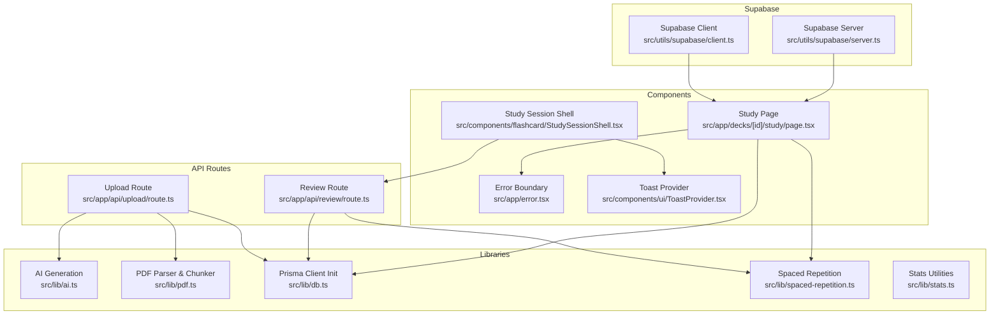
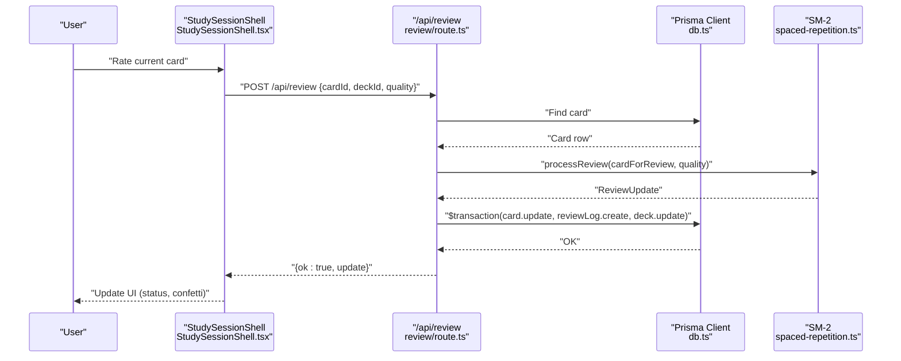
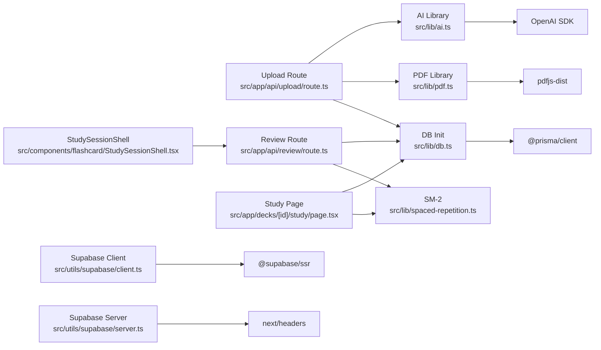

# Troubleshooting and Debugging

<cite>
**Referenced Files in This Document**
- [README.md](file://README.md)
- [SUPABASE_SETUP.md](file://SUPABASE_SETUP.md)
- [SUPABASE_INTEGRATION_COMPLETE.md](file://SUPABASE_INTEGRATION_COMPLETE.md)
- [SUPABASE_SETUP_COMPLETE.md](file://SUPABASE_SETUP_COMPLETE.md)
- [VERCEL_SUPABASE_MCP_GUIDE.md](file://VERCEL_SUPABASE_MCP_GUIDE.md)
- [PRODUCTION_FIX_SUMMARY.md](file://PRODUCTION_FIX_SUMMARY.md)
- [package.json](file://package.json)
- [tsconfig.json](file://tsconfig.json)
- [prisma/schema.prisma](file://prisma/schema.prisma)
- [src/lib/ai.ts](file://src/lib/ai.ts)
- [src/lib/pdf.ts](file://src/lib/pdf.ts)
- [src/lib/db.ts](file://src/lib/db.ts)
- [src/lib/spaced-repetition.ts](file://src/lib/spaced-repetition.ts)
- [src/utils/supabase/client.ts](file://src/utils/supabase/client.ts)
- [src/utils/supabase/server.ts](file://src/utils/supabase/server.ts)
- [src/app/api/upload/route.ts](file://src/app/api/upload/route.ts)
- [src/app/api/review/route.ts](file://src/app/api/review/route.ts)
- [src/app/decks/[id]/study/page.tsx](file://src/app/decks/[id]/study/page.tsx)
- [src/components/flashcard/StudySessionShell.tsx](file://src/components/flashcard/StudySessionShell.tsx)
- [src/app/error.tsx](file://src/app/error.tsx)
- [src/components/ui/ToastProvider.tsx](file://src/components/ui/ToastProvider.tsx)
- [src/lib/stats.ts](file://src/lib/stats.ts)
</cite>

## Table of Contents
1. [Introduction](#introduction)
2. [Project Structure](#project-structure)
3. [Core Components](#core-components)
4. [Architecture Overview](#architecture-overview)
5. [Detailed Component Analysis](#detailed-component-analysis)
6. [Dependency Analysis](#dependency-analysis)
7. [Performance Considerations](#performance-considerations)
8. [Troubleshooting Guide](#troubleshooting-guide)
9. [Conclusion](#conclusion)
10. [Appendices](#appendices)

## Introduction
This document provides comprehensive troubleshooting and debugging guidance for the recall application. It focuses on diagnosing and resolving common issues in AI generation failures, PDF processing errors, database connectivity problems, spaced repetition calculations, study session issues, and component rendering problems. It also covers logging strategies, error handling patterns, diagnostic tools, production debugging, performance profiling, and monitoring setup, along with step-by-step troubleshooting guides for typical user-reported and developer workflow issues.

## Project Structure
The application is a Next.js 14 app using TypeScript, Prisma ORM, Supabase for authentication and SSR client utilities, and OpenAI-compatible APIs for flashcard generation. Key areas relevant to debugging include:
- API routes for PDF upload and review submission
- Libraries for AI generation, PDF parsing/chunking, database initialization, and spaced repetition
- Supabase client/server utilities
- Study session shell and study page
- Stats utilities for dashboard analytics
- Error boundary and toast UI for user feedback

**Diagram sources**
- [src/app/api/upload/route.ts:1-298](file://src/app/api/upload/route.ts#L1-L298)
- [src/app/api/review/route.ts:1-76](file://src/app/api/review/route.ts#L1-L76)
- [src/lib/ai.ts:1-233](file://src/lib/ai.ts#L1-L233)
- [src/lib/pdf.ts:1-130](file://src/lib/pdf.ts#L1-L130)
- [src/lib/db.ts:1-68](file://src/lib/db.ts#L1-L68)
- [src/lib/spaced-repetition.ts:1-141](file://src/lib/spaced-repetition.ts#L1-L141)
- [src/lib/stats.ts:1-222](file://src/lib/stats.ts#L1-L222)
- [src/utils/supabase/client.ts:1-11](file://src/utils/supabase/client.ts#L1-L11)
- [src/utils/supabase/server.ts:1-29](file://src/utils/supabase/server.ts#L1-L29)
- [src/app/decks/[id]/study/page.tsx](file://src/app/decks/[id]/study/page.tsx#L1-L92)
- [src/components/flashcard/StudySessionShell.tsx:1-430](file://src/components/flashcard/StudySessionShell.tsx#L1-L430)
- [src/app/error.tsx:1-44](file://src/app/error.tsx#L1-L44)
- [src/components/ui/ToastProvider.tsx:1-66](file://src/components/ui/ToastProvider.tsx#L1-L66)

**Section sources**
- [package.json:1-54](file://package.json#L1-L54)
- [tsconfig.json](file://tsconfig.json)

## Core Components
- AI generation: Handles environment checks, model selection, streaming progress, JSON parsing, deduplication, and retry logic.
- PDF processing: Parses PDF buffers, cleans text, removes page numbers, collapses whitespace, and chunks text for AI.
- Database initialization: Selects appropriate datasource URL, ensures sslmode=require for serverless, and initializes Prisma client.
- Spaced repetition: Implements SM-2 algorithm, due-card queue builder, and rating option mapping.
- Upload pipeline: Streams progress, validates inputs, parses/chunks PDF, generates cards, deduplicates, and persists decks/cards.
- Review pipeline: Validates inputs, computes SM-2 updates, and persists card and review log atomically.
- Study session: Loads deck, builds study queue, renders interactive session, and handles keyboard controls.
- Stats utilities: Computes due counts, mastery rates, streaks, heatmaps, and recent sessions.

**Section sources**
- [src/lib/ai.ts:1-233](file://src/lib/ai.ts#L1-L233)
- [src/lib/pdf.ts:1-130](file://src/lib/pdf.ts#L1-L130)
- [src/lib/db.ts:1-68](file://src/lib/db.ts#L1-L68)
- [src/lib/spaced-repetition.ts:1-141](file://src/lib/spaced-repetition.ts#L1-L141)
- [src/app/api/upload/route.ts:1-298](file://src/app/api/upload/route.ts#L1-L298)
- [src/app/api/review/route.ts:1-76](file://src/app/api/review/route.ts#L1-L76)
- [src/app/decks/[id]/study/page.tsx](file://src/app/decks/[id]/study/page.tsx#L1-L92)
- [src/components/flashcard/StudySessionShell.tsx:1-430](file://src/components/flashcard/StudySessionShell.tsx#L1-L430)
- [src/lib/stats.ts:1-222](file://src/lib/stats.ts#L1-L222)

## Architecture Overview
The system integrates client-side UI with serverless API routes. The upload pipeline streams progress to the client, while the review pipeline updates card state and logs reviews atomically. Database connectivity is centralized, and Supabase utilities support SSR and client-side auth flows.

**Diagram sources**
- [src/components/flashcard/StudySessionShell.tsx:68-125](file://src/components/flashcard/StudySessionShell.tsx#L68-L125)
- [src/app/api/review/route.ts:5-75](file://src/app/api/review/route.ts#L5-L75)
- [src/lib/spaced-repetition.ts:29-76](file://src/lib/spaced-repetition.ts#L29-L76)
- [src/lib/db.ts:1-68](file://src/lib/db.ts#L1-L68)

## Detailed Component Analysis

### AI Generation Pipeline
Key behaviors:
- Environment guard for API key; throws a descriptive error if missing.
- Dual-model fallback with warnings and last-error propagation.
- Robust JSON parsing with fenced-code stripping and regex extraction.
- Per-chunk retry with delay and deduplication across collected cards.
- Progress callbacks for streaming UI updates.

Common failure modes:
- Missing OPENROUTER_API_KEY
- Free-tier rate limits (429)
- Model unavailability
- Authentication failures
- JSON parse failures
- Network timeouts

Debugging steps:
- Verify environment variables in deployment platform.
- Inspect console logs for model-specific warnings.
- Confirm chunk sizes and retry behavior.
- Validate JSON structure returned by the model.

**Section sources**
- [src/lib/ai.ts:8-24](file://src/lib/ai.ts#L8-L24)
- [src/lib/ai.ts:92-125](file://src/lib/ai.ts#L92-L125)
- [src/lib/ai.ts:127-153](file://src/lib/ai.ts#L127-L153)
- [src/lib/ai.ts:168-232](file://src/lib/ai.ts#L168-L232)

### PDF Processing Pipeline
Key behaviors:
- Uses pdfjs-dist with system fonts disabled for text extraction.
- Aggregates text respecting line breaks via y-transform coordinates.
- Removes page numbers and standalone digits.
- Collapses excessive newlines and trims whitespace.
- Chunks text at paragraph boundaries with overlap to preserve context.

Common failure modes:
- Scanned/image-based PDFs with insufficient text
- Very large PDFs exceeding limits
- Unexpected encoding or layout causing sparse text

Debugging steps:
- Log pageCount and charCount after parsing.
- Inspect chunk count and sizes.
- Validate subject/emoji mapping and deduplication keys.

**Section sources**
- [src/lib/pdf.ts:14-79](file://src/lib/pdf.ts#L14-L79)
- [src/lib/pdf.ts:85-129](file://src/lib/pdf.ts#L85-L129)

### Database Connectivity
Key behaviors:
- URL selection prioritizes platform-specific variables in production.
- Filters out sqlite file URLs and prefers postgres URLs.
- Ensures sslmode=require for serverless environments.
- Initializes Prisma client with selected URL and global caching in non-production.

Common failure modes:
- Missing DATABASE_URL
- Wrong scheme or host
- Authentication failures
- Connection pool issues in serverless

Debugging steps:
- Confirm environment variable precedence order.
- Verify sslmode requirement in serverless deployments.
- Test connectivity locally and in CI/CD logs.

**Section sources**
- [src/lib/db.ts:8-39](file://src/lib/db.ts#L8-L39)
- [src/lib/db.ts:41-47](file://src/lib/db.ts#L41-L47)
- [src/lib/db.ts:49-68](file://src/lib/db.ts#L49-L68)
- [prisma/schema.prisma:1-51](file://prisma/schema.prisma#L1-L51)

### Spaced Repetition Calculations
Key behaviors:
- SM-2 core logic: interval progression, ease factor adjustments, status mapping.
- Queue builder: shuffles overdue and new cards, sorts by due date, slices to limit.
- Rating options: mapped labels, shortcuts, and UI classes.

Common failure modes:
- Incorrect quality range
- Missing card fields
- Transaction failures persisting updates
- Status inconsistencies

Debugging steps:
- Validate input quality range and card fields.
- Inspect transaction logs for atomicity.
- Compare expected vs. actual intervals and statuses.

**Section sources**
- [src/lib/spaced-repetition.ts:29-76](file://src/lib/spaced-repetition.ts#L29-L76)
- [src/lib/spaced-repetition.ts:88-104](file://src/lib/spaced-repetition.ts#L88-L104)
- [src/app/api/review/route.ts:15-20](file://src/app/api/review/route.ts#L15-L20)
- [src/app/api/review/route.ts:28-68](file://src/app/api/review/route.ts#L28-L68)

### Upload Pipeline
Key behaviors:
- Environment preflight checks for DATABASE_URL and OPENROUTER_API_KEY.
- Streaming progress with JSON lines.
- Validation for file type, size, and title.
- Deduplication across chunks and final deduplication.
- Error mapping to user-friendly messages.

Common failure modes:
- Missing environment variables
- Invalid form data
- PDF too small or unreadable
- AI rate limits or model unavailability
- Database connection/authentication errors

Debugging steps:
- Check preflight responses and rate-limit headers.
- Inspect stream messages and error payloads.
- Validate chunk sizes and deduplication effectiveness.

**Section sources**
- [src/app/api/upload/route.ts:86-106](file://src/app/api/upload/route.ts#L86-L106)
- [src/app/api/upload/route.ts:118-157](file://src/app/api/upload/route.ts#L118-L157)
- [src/app/api/upload/route.ts:171-189](file://src/app/api/upload/route.ts#L171-L189)
- [src/app/api/upload/route.ts:204-227](file://src/app/api/upload/route.ts#L204-L227)
- [src/app/api/upload/route.ts:267-285](file://src/app/api/upload/route.ts#L267-L285)

### Study Session
Key behaviors:
- Dynamic rendering forced for accurate due queues.
- Loads deck and cards, converts schema to SM-2 format.
- Builds study queue (overdue/new) or shuffles all cards.
- Interactive UI with keyboard controls and optimistic updates.

Common failure modes:
- Database load failures in production
- Empty queues leading to “nothing to review”
- Client-side fetch errors for review submissions

Debugging steps:
- Check console logs for database errors on the server.
- Validate queue composition and card counts.
- Monitor network requests for review submissions.

**Section sources**
- [src/app/decks/[id]/study/page.tsx](file://src/app/decks/[id]/study/page.tsx#L34-L54)
- [src/app/decks/[id]/study/page.tsx](file://src/app/decks/[id]/study/page.tsx#L60-L82)
- [src/components/flashcard/StudySessionShell.tsx:68-125](file://src/components/flashcard/StudySessionShell.tsx#L68-L125)

### Error Handling and Diagnostics
- API routes map internal errors to user-friendly messages and log unrecognized errors.
- Client error boundary logs and provides a reset mechanism.
- Toast provider displays transient user notifications.

Common failure modes:
- Uncaught exceptions in server components
- Client-side fetch rejections
- Missing environment variables at runtime

Debugging steps:
- Review server logs for mapped error messages.
- Use error boundary to capture client-side errors.
- Verify toast visibility and dismissal behavior.

**Section sources**
- [src/app/api/upload/route.ts:11-63](file://src/app/api/upload/route.ts#L11-L63)
- [src/app/error.tsx:14-17](file://src/app/error.tsx#L14-L17)
- [src/components/ui/ToastProvider.tsx:28-65](file://src/components/ui/ToastProvider.tsx#L28-L65)

## Dependency Analysis
External dependencies relevant to debugging:
- Prisma client and schema define database contracts and queries.
- OpenAI SDK for chat completions.
- pdfjs-dist for PDF parsing.
- Supabase SSR client/server helpers.
- Framer Motion and Lucide icons for UI.

**Diagram sources**
- [src/lib/ai.ts](file://src/lib/ai.ts#L1)
- [src/lib/pdf.ts](file://src/lib/pdf.ts#L1)
- [src/lib/db.ts](file://src/lib/db.ts#L1)
- [src/app/api/upload/route.ts:3-5](file://src/app/api/upload/route.ts#L3-L5)
- [src/app/api/review/route.ts:2-3](file://src/app/api/review/route.ts#L2-L3)
- [src/app/decks/[id]/study/page.tsx](file://src/app/decks/[id]/study/page.tsx#L4-L5)
- [src/components/flashcard/StudySessionShell.tsx:9-10](file://src/components/flashcard/StudySessionShell.tsx#L9-L10)
- [src/utils/supabase/client.ts:1-10](file://src/utils/supabase/client.ts#L1-L10)
- [src/utils/supabase/server.ts:1-28](file://src/utils/supabase/server.ts#L1-L28)
- [package.json:18-39](file://package.json#L18-L39)

**Section sources**
- [package.json:18-39](file://package.json#L18-L39)
- [prisma/schema.prisma:1-51](file://prisma/schema.prisma#L1-L51)

## Performance Considerations
- AI generation pacing: Built-in delays between chunks and retry-once strategy mitigate free-tier rate limits.
- PDF chunking: Overlapping chunks improve context retention; tune chunk size to balance AI token limits and performance.
- Database transactions: Atomic updates reduce contention; ensure indexes exist for frequent queries.
- Streaming responses: TransformStream with chunked transfer prevents buffering and improves perceived latency.
- Client-side optimistic updates: Immediate UI feedback reduces perceived latency; handle conflicts gracefully.

[No sources needed since this section provides general guidance]

## Troubleshooting Guide

### Step-by-Step: AI Generation Failures
Symptoms:
- Upload pipeline reports “AI generation is not configured” or “rate limit reached.”
- JSON parse failures or empty card lists.

Checklist:
1. Verify OPENROUTER_API_KEY is set in the deployment environment.
2. Confirm model availability and free-tier quotas.
3. Inspect console logs for model-specific warnings and last-error messages.
4. Validate JSON structure returned by the model; check fenced code stripping and regex extraction.
5. Review retry behavior and chunk-level logs.

Actions:
- Set OPENROUTER_API_KEY and redeploy.
- Reduce concurrent uploads or retry after cooldown.
- Increase chunk size cautiously to fit model token limits.
- Add structured logging around JSON parsing for diagnostics.

**Section sources**
- [src/app/api/upload/route.ts:11-63](file://src/app/api/upload/route.ts#L11-L63)
- [src/lib/ai.ts:92-125](file://src/lib/ai.ts#L92-L125)
- [src/lib/ai.ts:127-153](file://src/lib/ai.ts#L127-L153)

### Step-by-Step: PDF Processing Errors
Symptoms:
- Upload pipeline reports “not enough readable text” or “only PDF files supported.”
- Extremely small charCount or zero chunks.

Checklist:
1. Confirm file type is application/pdf and size under 20MB.
2. Inspect parsed pageCount and charCount.
3. Review chunkText output and overlap behavior.
4. Validate page number removal and whitespace normalization.

Actions:
- Use searchable PDFs or OCR preprocessing if dealing with images.
- Adjust maxChunkSize and overlap parameters.
- Log raw text samples for problematic documents.

**Section sources**
- [src/app/api/upload/route.ts:132-157](file://src/app/api/upload/route.ts#L132-L157)
- [src/lib/pdf.ts:14-79](file://src/lib/pdf.ts#L14-L79)
- [src/lib/pdf.ts:85-129](file://src/lib/pdf.ts#L85-L129)

### Step-by-Step: Database Connectivity Problems
Symptoms:
- Server reports “Database connection failed” or 500/503 errors.
- Study page fails to load decks in production.

Checklist:
1. Verify DATABASE_URL presence and correctness.
2. Confirm platform-specific variables take precedence in production.
3. Ensure sslmode=require is present for serverless.
4. Check Prisma client initialization and global caching behavior.

Actions:
- Set DATABASE_URL in deployment secrets.
- Re-deploy after correcting environment variables.
- Test connectivity locally with Prisma CLI.

**Section sources**
- [src/app/api/upload/route.ts:87-96](file://src/app/api/upload/route.ts#L87-L96)
- [src/lib/db.ts:8-39](file://src/lib/db.ts#L8-L39)
- [src/lib/db.ts:41-47](file://src/lib/db.ts#L41-L47)
- [src/lib/db.ts:49-68](file://src/lib/db.ts#L49-L68)
- [src/app/decks/[id]/study/page.tsx](file://src/app/decks/[id]/study/page.tsx#L43-L54)

### Step-by-Step: Spaced Repetition Calculation Issues
Symptoms:
- Incorrect intervals or statuses after rating.
- Missing fields or quality out-of-range errors.

Checklist:
1. Validate quality input range (0–5) and presence of required fields.
2. Inspect card fields conversion to CardForReview format.
3. Review transaction logs for atomic updates.
4. Compare expected vs. actual intervals and statuses.

Actions:
- Enforce client-side quality validation and server-side checks.
- Log cardForReview inputs and ReviewUpdate outputs.
- Verify database schema matches expected fields.

**Section sources**
- [src/app/api/review/route.ts:15-20](file://src/app/api/review/route.ts#L15-L20)
- [src/app/api/review/route.ts:28-68](file://src/app/api/review/route.ts#L28-L68)
- [src/lib/spaced-repetition.ts:29-76](file://src/lib/spaced-repetition.ts#L29-L76)

### Step-by-Step: Study Session Issues
Symptoms:
- “Nothing to review right now” screen.
- Client-side fetch errors for review submissions.

Checklist:
1. Confirm study queue composition (overdue/new) and limit.
2. Validate card conversions and ISO date handling.
3. Inspect network requests for /api/review.
4. Check keyboard event handling and optimistic updates.

Actions:
- Force refresh or navigate back to deck to rebuild queue.
- Inspect browser console for fetch rejections.
- Verify server logs for review pipeline errors.

**Section sources**
- [src/app/decks/[id]/study/page.tsx](file://src/app/decks/[id]/study/page.tsx#L60-L82)
- [src/components/flashcard/StudySessionShell.tsx:68-125](file://src/components/flashcard/StudySessionShell.tsx#L68-L125)

### Step-by-Step: Component Rendering Problems
Symptoms:
- Error boundary triggers or blank screens.
- Toasts not appearing or closing unexpectedly.

Checklist:
1. Verify error boundary logs and reset behavior.
2. Confirm toast store and lifecycle.
3. Check for missing environment variables affecting client initialization.

Actions:
- Use error boundary reset to recover from transient errors.
- Ensure toasts are registered and dismissed properly.
- Validate NEXT_PUBLIC_SUPABASE_* variables for client initialization.

**Section sources**
- [src/app/error.tsx:14-17](file://src/app/error.tsx#L14-L17)
- [src/components/ui/ToastProvider.tsx:28-65](file://src/components/ui/ToastProvider.tsx#L28-L65)
- [src/utils/supabase/client.ts:3-10](file://src/utils/supabase/client.ts#L3-L10)

### Logging Strategies and Error Handling Patterns
- Upload route: Logs parsing, chunking, AI generation, saving, and error mapping.
- Review route: Logs computation and transaction persistence.
- Study page: Logs database load failures and provides user-facing guidance.
- AI library: Logs model failures and JSON parse issues.
- PDF library: Logs text extraction metrics.

Recommended patterns:
- Centralize public error messages and map internal errors to user-friendly strings.
- Use structured logging for critical events (parsing, saving, review).
- Add correlation IDs for end-to-end tracing across API routes and libraries.

**Section sources**
- [src/app/api/upload/route.ts:171-189](file://src/app/api/upload/route.ts#L171-L189)
- [src/app/api/upload/route.ts:204-227](file://src/app/api/upload/route.ts#L204-L227)
- [src/app/api/upload/route.ts:253-255](file://src/app/api/upload/route.ts#L253-L255)
- [src/app/api/review/route.ts:44-68](file://src/app/api/review/route.ts#L44-L68)
- [src/lib/ai.ts:115-125](file://src/lib/ai.ts#L115-L125)
- [src/lib/ai.ts:147-151](file://src/lib/ai.ts#L147-L151)
- [src/app/decks/[id]/study/page.tsx](file://src/app/decks/[id]/study/page.tsx#L43-L54)

### Production Debugging, Performance Profiling, and Monitoring Setup
Production debugging:
- Enable platform logs and correlate timestamps with structured logs.
- Use environment guards to fail fast with actionable messages.
- Implement circuit breakers for AI services during outages.

Performance profiling:
- Measure PDF parsing, chunking, AI generation, and database write latencies.
- Track queue sizes and review throughput.

Monitoring setup:
- Dashboard metrics: cards due today, mastery rate, study streak, recent sessions.
- Alerts for database connectivity, AI service health, and upload rate limiting.

**Section sources**
- [src/lib/stats.ts:51-221](file://src/lib/stats.ts#L51-L221)
- [src/app/api/upload/route.ts:70-84](file://src/app/api/upload/route.ts#L70-L84)

## Conclusion
This guide consolidates practical troubleshooting approaches for AI generation, PDF processing, database connectivity, spaced repetition, study sessions, and component rendering. By leveraging structured logging, environment guards, and clear error mapping, most issues can be diagnosed quickly. For production, focus on observability, rate-limit awareness, and resilient retries to maintain reliability.

[No sources needed since this section summarizes without analyzing specific files]

## Appendices

### Appendix A: Environment Variables Checklist
- OPENROUTER_API_KEY: Required for AI generation.
- DATABASE_URL: Required for database connectivity.
- POSTGRES_PRISMA_URL, POSTGRES_URL_NON_POOLING, POSTGRES_URL: Platform-specific overrides.
- NEXT_PUBLIC_SUPABASE_URL, NEXT_PUBLIC_SUPABASE_PUBLISHABLE_KEY: Supabase client configuration.

**Section sources**
- [src/lib/ai.ts:11-16](file://src/lib/ai.ts#L11-L16)
- [src/lib/db.ts:8-39](file://src/lib/db.ts#L8-L39)
- [src/utils/supabase/client.ts:3-10](file://src/utils/supabase/client.ts#L3-L10)

### Appendix B: Deployment Notes and Guides
- Refer to project-specific setup and integration guides for environment configuration and deployment steps.

**Section sources**
- [README.md](file://README.md)
- [SUPABASE_SETUP.md](file://SUPABASE_SETUP.md)
- [SUPABASE_INTEGRATION_COMPLETE.md](file://SUPABASE_INTEGRATION_COMPLETE.md)
- [SUPABASE_SETUP_COMPLETE.md](file://SUPABASE_SETUP_COMPLETE.md)
- [VERCEL_SUPABASE_MCP_GUIDE.md](file://VERCEL_SUPABASE_MCP_GUIDE.md)
- [PRODUCTION_FIX_SUMMARY.md](file://PRODUCTION_FIX_SUMMARY.md)