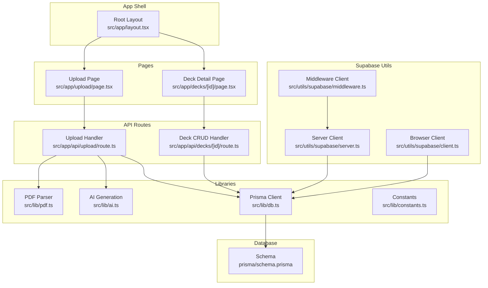
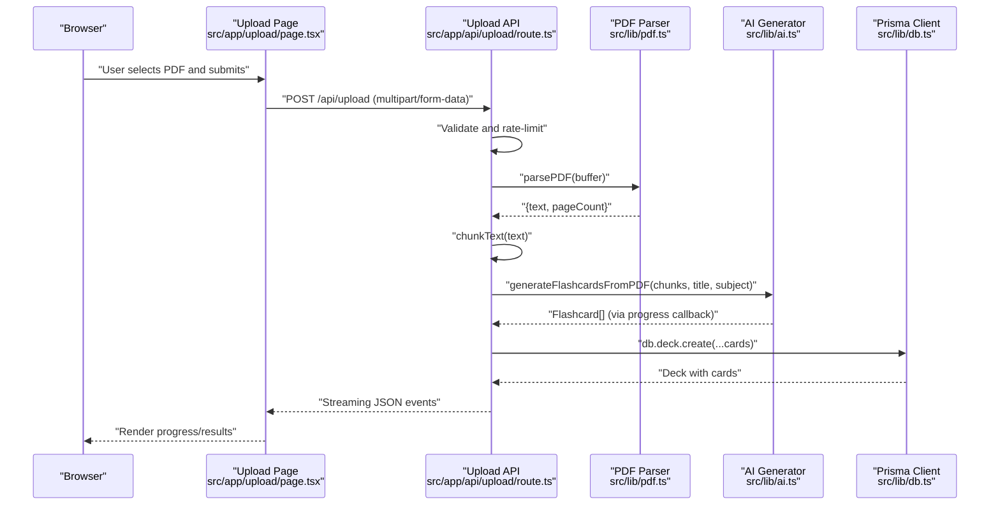
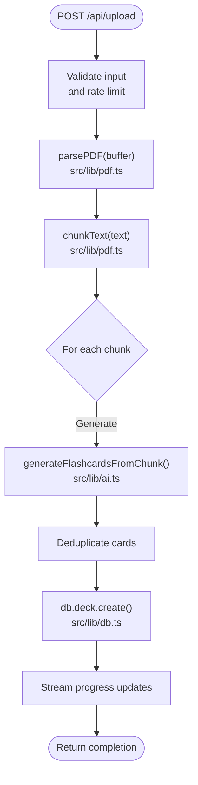
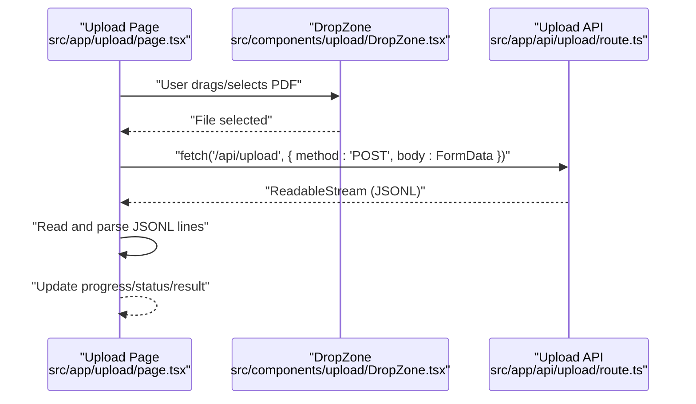
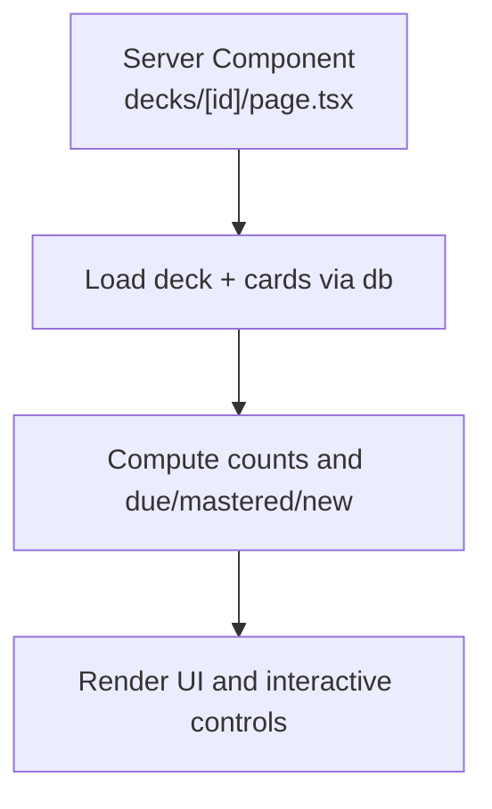
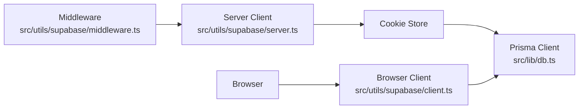
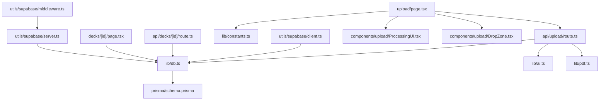
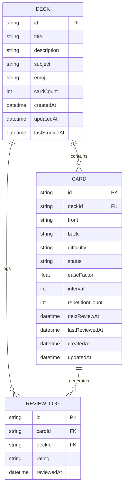

# Architecture Overview

<cite>
**Referenced Files in This Document**
- [layout.tsx](file://src/app/layout.tsx)
- [middleware.ts](file://src/utils/supabase/middleware.ts)
- [db.ts](file://src/lib/db.ts)
- [ai.ts](file://src/lib/ai.ts)
- [pdf.ts](file://src/lib/pdf.ts)
- [upload/route.ts](file://src/app/api/upload/route.ts)
- [decks/[id]/route.ts](file://src/app/api/decks/[id]/route.ts)
- [upload/page.tsx](file://src/app/upload/page.tsx)
- [DropZone.tsx](file://src/components/upload/DropZone.tsx)
- [ProcessingUI.tsx](file://src/components/upload/ProcessingUI.tsx)
- [decks/[id]/page.tsx](file://src/app/decks/[id]/page.tsx)
- [schema.prisma](file://prisma/schema.prisma)
- [server.ts](file://src/utils/supabase/server.ts)
- [client.ts](file://src/utils/supabase/client.ts)
- [constants.ts](file://src/lib/constants.ts)
</cite>

## Table of Contents
1. [Introduction](#introduction)
2. [Project Structure](#project-structure)
3. [Core Components](#core-components)
4. [Architecture Overview](#architecture-overview)
5. [Detailed Component Analysis](#detailed-component-analysis)
6. [Dependency Analysis](#dependency-analysis)
7. [Performance Considerations](#performance-considerations)
8. [Troubleshooting Guide](#troubleshooting-guide)
9. [Conclusion](#conclusion)
10. [Appendices](#appendices)

## Introduction
This document describes the architecture of the recall application built with Next.js 14 App Router. The system enables users to upload a PDF, which is processed server-side to extract text, split it into manageable chunks, and generate AI-powered flashcards. The resulting deck is persisted to a PostgreSQL database via Prisma and rendered in the browser using React components. The application integrates Supabase for authentication and session management, OpenAI-compatible APIs for AI generation, and follows server components patterns for SSR and improved performance.

## Project Structure
The application is organized using Next.js 14 App Router conventions:
- App shell and metadata are defined in the root layout.
- API routes live under src/app/api and encapsulate server-side logic for uploads, deck updates/deletes, and statistics.
- Pages are located under src/app and render server components where appropriate.
- Shared UI components are in src/components.
- Libraries for domain logic (PDF parsing, AI generation, database access) are in src/lib.
- Supabase client utilities are in src/utils/supabase.
- Database schema is managed by Prisma.

**Diagram sources**
- [layout.tsx:39-51](file://src/app/layout.tsx#L39-L51)
- [upload/page.tsx:34-504](file://src/app/upload/page.tsx#L34-L504)
- [decks/[id]/page.tsx](file://src/app/decks/[id]/page.tsx#L26-L206)
- [upload/route.ts:86-298](file://src/app/api/upload/route.ts#L86-L298)
- [decks/[id]/route.ts](file://src/app/api/decks/[id]/route.ts#L4-L43)
- [pdf.ts:13-112](file://src/lib/pdf.ts#L13-L112)
- [ai.ts:168-233](file://src/lib/ai.ts#L168-L233)
- [db.ts:51-68](file://src/lib/db.ts#L51-L68)
- [server.ts:7-29](file://src/utils/supabase/server.ts#L7-L29)
- [client.ts:6-11](file://src/utils/supabase/client.ts#L6-L11)
- [middleware.ts:7-38](file://src/utils/supabase/middleware.ts#L7-L38)
- [schema.prisma:10-51](file://prisma/schema.prisma#L10-L51)

**Section sources**
- [layout.tsx:39-51](file://src/app/layout.tsx#L39-L51)
- [upload/page.tsx:34-504](file://src/app/upload/page.tsx#L34-L504)
- [decks/[id]/page.tsx](file://src/app/decks/[id]/page.tsx#L26-L206)
- [upload/route.ts:86-298](file://src/app/api/upload/route.ts#L86-L298)
- [decks/[id]/route.ts](file://src/app/api/decks/[id]/route.ts#L4-L43)
- [pdf.ts:13-112](file://src/lib/pdf.ts#L13-L112)
- [ai.ts:168-233](file://src/lib/ai.ts#L168-L233)
- [db.ts:51-68](file://src/lib/db.ts#L51-L68)
- [server.ts:7-29](file://src/utils/supabase/server.ts#L7-L29)
- [client.ts:6-11](file://src/utils/supabase/client.ts#L6-L11)
- [middleware.ts:7-38](file://src/utils/supabase/middleware.ts#L7-L38)
- [schema.prisma:10-51](file://prisma/schema.prisma#L10-L51)

## Core Components
- Root layout: Provides global metadata, fonts, and wraps pages in a shared AppLayout.
- Upload page: Client component that handles drag-and-drop, form submission, and streaming progress from the upload API.
- Upload API route: Server handler that validates input, parses PDF, chunks text, generates flashcards via AI, deduplicates, and persists to the database.
- Deck detail page: Server-rendered page that loads deck and cards, computes stats, and renders interactive UI.
- PDF library: Parses PDF buffers, cleans text, and splits into overlapping chunks.
- AI library: Generates flashcards from text chunks using OpenAI-compatible APIs with fallbacks and retry logic.
- Database library: Configures Prisma client with environment-aware URL selection and SSL enforcement.
- Supabase utilities: Server/browser clients and middleware integration for session management.

**Section sources**
- [layout.tsx:21-37](file://src/app/layout.tsx#L21-L37)
- [upload/page.tsx:34-504](file://src/app/upload/page.tsx#L34-L504)
- [upload/route.ts:86-298](file://src/app/api/upload/route.ts#L86-L298)
- [decks/[id]/page.tsx](file://src/app/decks/[id]/page.tsx#L26-L206)
- [pdf.ts:13-112](file://src/lib/pdf.ts#L13-L112)
- [ai.ts:168-233](file://src/lib/ai.ts#L168-L233)
- [db.ts:51-68](file://src/lib/db.ts#L51-L68)
- [server.ts:7-29](file://src/utils/supabase/server.ts#L7-L29)
- [client.ts:6-11](file://src/utils/supabase/client.ts#L6-L11)

## Architecture Overview
The system follows a server-driven flow for heavy operations (PDF parsing, AI generation, database writes) while keeping the UI responsive through streaming responses and client-side rendering for UI updates.

**Diagram sources**
- [upload/page.tsx:84-178](file://src/app/upload/page.tsx#L84-L178)
- [upload/route.ts:86-298](file://src/app/api/upload/route.ts#L86-L298)
- [pdf.ts:13-112](file://src/lib/pdf.ts#L13-L112)
- [ai.ts:168-233](file://src/lib/ai.ts#L168-L233)
- [db.ts:51-68](file://src/lib/db.ts#L51-L68)

## Detailed Component Analysis

### Upload Flow and Data Pipeline
The upload pipeline transforms a PDF into a flashcard deck:
- Input validation and rate limiting occur server-side before any processing begins.
- PDF is parsed into clean text and chunked for AI processing.
- AI generation runs per chunk with fallbacks and retry logic, emitting progress updates.
- Duplicates are removed, and the deck is saved to the database.

**Diagram sources**
- [upload/route.ts:86-298](file://src/app/api/upload/route.ts#L86-L298)
- [pdf.ts:13-112](file://src/lib/pdf.ts#L13-L112)
- [ai.ts:168-233](file://src/lib/ai.ts#L168-L233)
- [db.ts:51-68](file://src/lib/db.ts#L51-L68)

**Section sources**
- [upload/route.ts:86-298](file://src/app/api/upload/route.ts#L86-L298)
- [pdf.ts:13-112](file://src/lib/pdf.ts#L13-L112)
- [ai.ts:168-233](file://src/lib/ai.ts#L168-L233)
- [db.ts:51-68](file://src/lib/db.ts#L51-L68)

### Client-Side Upload Experience
The upload page coordinates file selection, form submission, and streaming progress:
- Drag-and-drop and file selection are handled in a reusable DropZone component.
- On submit, FormData is sent to the upload API, and the response body is streamed line-by-line.
- Progress, status messages, and completion results are rendered reactively.

**Diagram sources**
- [upload/page.tsx:34-504](file://src/app/upload/page.tsx#L34-L504)
- [DropZone.tsx:21-100](file://src/components/upload/DropZone.tsx#L21-L100)
- [upload/route.ts:86-298](file://src/app/api/upload/route.ts#L86-L298)

**Section sources**
- [upload/page.tsx:34-504](file://src/app/upload/page.tsx#L34-L504)
- [DropZone.tsx:21-100](file://src/components/upload/DropZone.tsx#L21-L100)
- [ProcessingUI.tsx:12-53](file://src/components/upload/ProcessingUI.tsx#L12-L53)

### Deck Detail Rendering
The deck detail page is a server component that:
- Loads a deck and its cards from the database.
- Computes counts and mastery breakdowns.
- Renders interactive controls and a card list.

**Diagram sources**
- [decks/[id]/page.tsx](file://src/app/decks/[id]/page.tsx#L26-L206)
- [db.ts:51-68](file://src/lib/db.ts#L51-L68)
- [schema.prisma:10-51](file://prisma/schema.prisma#L10-L51)

**Section sources**
- [decks/[id]/page.tsx](file://src/app/decks/[id]/page.tsx#L26-L206)
- [db.ts:51-68](file://src/lib/db.ts#L51-L68)
- [schema.prisma:10-51](file://prisma/schema.prisma#L10-L51)

### Supabase Authentication Integration
Supabase is integrated for session management:
- Server client reads and writes cookies via the cookie store.
- Middleware creates a Supabase client for server-side requests.
- Browser client is used for client-side auth operations.

**Diagram sources**
- [middleware.ts:7-38](file://src/utils/supabase/middleware.ts#L7-L38)
- [server.ts:7-29](file://src/utils/supabase/server.ts#L7-L29)
- [client.ts:6-11](file://src/utils/supabase/client.ts#L6-L11)
- [db.ts:51-68](file://src/lib/db.ts#L51-L68)

**Section sources**
- [middleware.ts:7-38](file://src/utils/supabase/middleware.ts#L7-L38)
- [server.ts:7-29](file://src/utils/supabase/server.ts#L7-L29)
- [client.ts:6-11](file://src/utils/supabase/client.ts#L6-L11)
- [db.ts:51-68](file://src/lib/db.ts#L51-L68)

## Dependency Analysis
The following diagram shows key dependencies among modules:

**Diagram sources**
- [upload/page.tsx:34-504](file://src/app/upload/page.tsx#L34-L504)
- [upload/route.ts:86-298](file://src/app/api/upload/route.ts#L86-L298)
- [pdf.ts:13-112](file://src/lib/pdf.ts#L13-L112)
- [ai.ts:168-233](file://src/lib/ai.ts#L168-L233)
- [db.ts:51-68](file://src/lib/db.ts#L51-L68)
- [decks/[id]/page.tsx](file://src/app/decks/[id]/page.tsx#L26-L206)
- [decks/[id]/route.ts](file://src/app/api/decks/[id]/route.ts#L4-L43)
- [schema.prisma:10-51](file://prisma/schema.prisma#L10-L51)
- [server.ts:7-29](file://src/utils/supabase/server.ts#L7-L29)
- [client.ts:6-11](file://src/utils/supabase/client.ts#L6-L11)
- [middleware.ts:7-38](file://src/utils/supabase/middleware.ts#L7-L38)
- [DropZone.tsx:21-100](file://src/components/upload/DropZone.tsx#L21-L100)
- [ProcessingUI.tsx:12-53](file://src/components/upload/ProcessingUI.tsx#L12-L53)
- [constants.ts:1-31](file://src/lib/constants.ts#L1-L31)

**Section sources**
- [upload/page.tsx:34-504](file://src/app/upload/page.tsx#L34-L504)
- [upload/route.ts:86-298](file://src/app/api/upload/route.ts#L86-L298)
- [pdf.ts:13-112](file://src/lib/pdf.ts#L13-L112)
- [ai.ts:168-233](file://src/lib/ai.ts#L168-L233)
- [db.ts:51-68](file://src/lib/db.ts#L51-L68)
- [decks/[id]/page.tsx](file://src/app/decks/[id]/page.tsx#L26-L206)
- [decks/[id]/route.ts](file://src/app/api/decks/[id]/route.ts#L4-L43)
- [schema.prisma:10-51](file://prisma/schema.prisma#L10-L51)
- [server.ts:7-29](file://src/utils/supabase/server.ts#L7-L29)
- [client.ts:6-11](file://src/utils/supabase/client.ts#L6-L11)
- [middleware.ts:7-38](file://src/utils/supabase/middleware.ts#L7-L38)
- [DropZone.tsx:21-100](file://src/components/upload/DropZone.tsx#L21-L100)
- [ProcessingUI.tsx:12-53](file://src/components/upload/ProcessingUI.tsx#L12-L53)
- [constants.ts:1-31](file://src/lib/constants.ts#L1-L31)

## Performance Considerations
- Streaming responses: The upload API streams progress updates to keep the UI responsive and reduce perceived latency.
- Rate limiting: IP-based rate limiting prevents abuse and stabilizes downstream services.
- AI pacing: Delays between chunk requests mitigate free-tier rate limits.
- Database URL selection: The Prisma client chooses optimal URLs per environment and enforces SSL for serverless.
- Server runtime: The upload route uses Node runtime and extended maxDuration to accommodate large PDFs and AI latency.
- Client-side rendering: Heavy computations are offloaded to the server; the client remains interactive via streaming.

[No sources needed since this section provides general guidance]

## Troubleshooting Guide
Common issues and remedies:
- Missing environment variables:
  - DATABASE_URL or Prisma-related errors indicate misconfiguration; verify the database URL and SSL settings.
  - OPENROUTER_API_KEY missing disables AI generation; set the key to enable card creation.
- AI service errors:
  - Rate limits, model unavailability, or 5xx errors are surfaced with user-friendly messages.
- PDF parsing failures:
  - Scanned/image-based PDFs produce little text; the pipeline detects insufficient text and aborts early.
- Database connectivity:
  - Authentication failures or inability to reach the database server are detected and reported with actionable messages.

**Section sources**
- [upload/route.ts:86-298](file://src/app/api/upload/route.ts#L86-L298)
- [db.ts:51-68](file://src/lib/db.ts#L51-L68)
- [ai.ts:168-233](file://src/lib/ai.ts#L168-L233)

## Conclusion
The recall application leverages Next.js 14 App Router’s server components and API routes to deliver a robust, server-driven experience for PDF-to-flashcard conversion. Supabase provides seamless session management, Prisma offers a strongly-typed database layer, and OpenAI-compatible APIs power intelligent content generation. The architecture balances performance, reliability, and user experience through streaming, rate limiting, and careful environment configuration.

[No sources needed since this section summarizes without analyzing specific files]

## Appendices

### Data Model Overview
The deck, card, and review log entities define the core domain model.

**Diagram sources**
- [schema.prisma:10-51](file://prisma/schema.prisma#L10-L51)

### Security and Authentication Notes
- Supabase server client manages cookies and sessions for server components.
- Middleware ensures consistent Supabase client creation across requests.
- Environment variables for Supabase keys are used to initialize clients on the server and browser.

**Section sources**
- [server.ts:7-29](file://src/utils/supabase/server.ts#L7-L29)
- [client.ts:6-11](file://src/utils/supabase/client.ts#L6-L11)
- [middleware.ts:7-38](file://src/utils/supabase/middleware.ts#L7-L38)