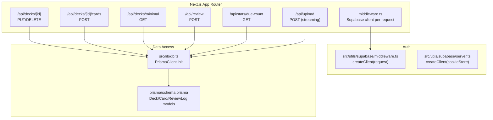
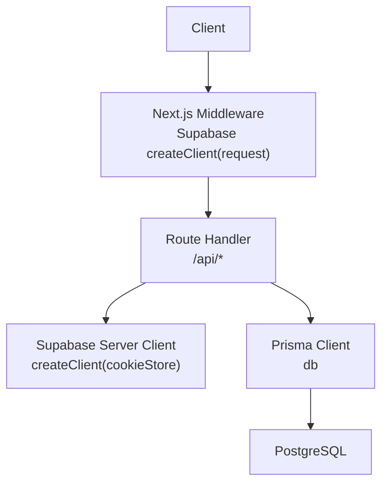
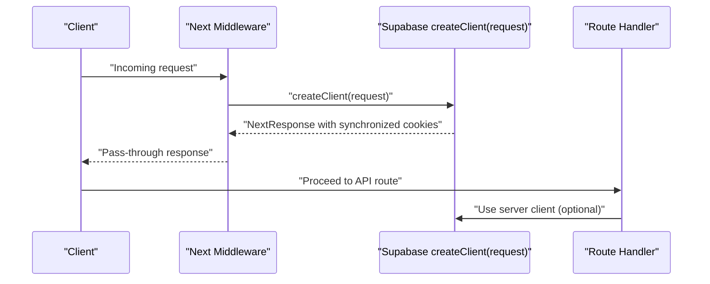
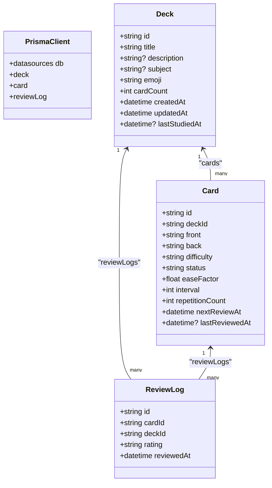
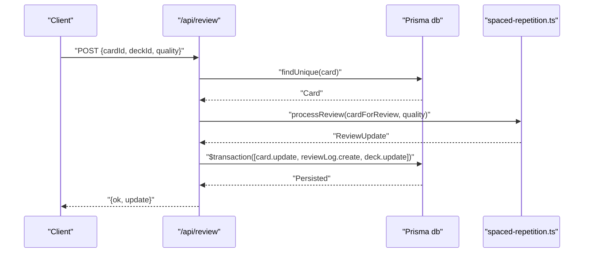
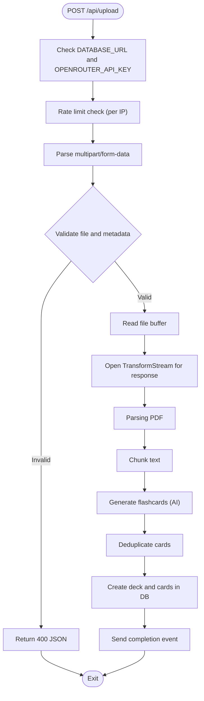
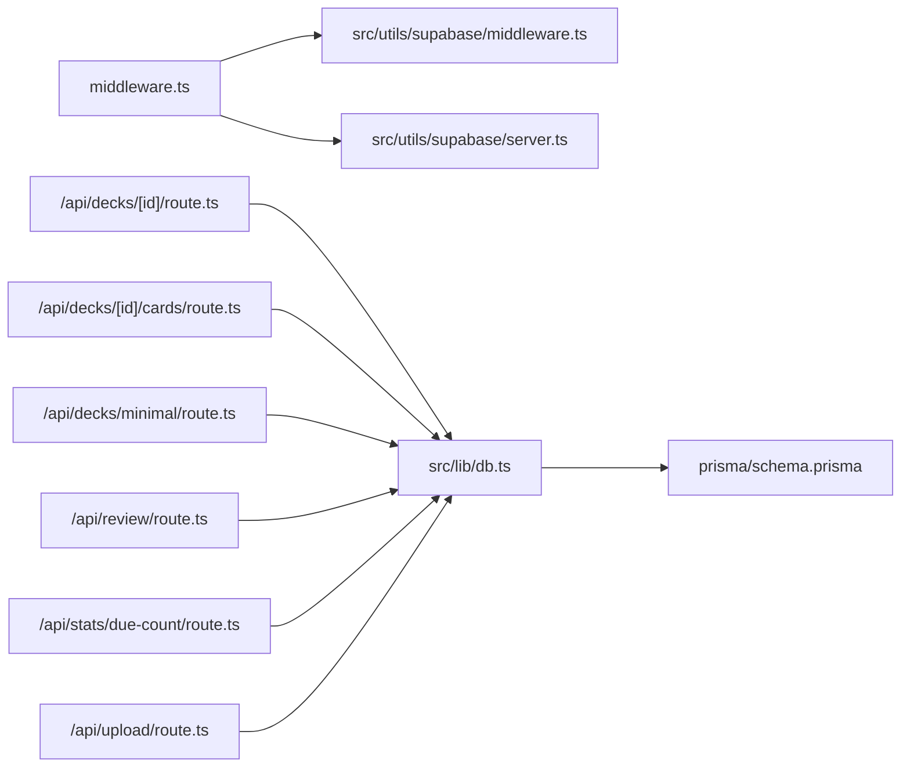

# Backend Architecture

<cite>
**Referenced Files in This Document**
- [middleware.ts](file://middleware.ts)
- [src/utils/supabase/middleware.ts](file://src/utils/supabase/middleware.ts)
- [src/utils/supabase/server.ts](file://src/utils/supabase/server.ts)
- [src/lib/db.ts](file://src/lib/db.ts)
- [prisma/schema.prisma](file://prisma/schema.prisma)
- [src/app/api/decks/[id]/route.ts](file://src/app/api/decks/[id]/route.ts)
- [src/app/api/decks/[id]/cards/route.ts](file://src/app/api/decks/[id]/cards/route.ts)
- [src/app/api/decks/minimal/route.ts](file://src/app/api/decks/minimal/route.ts)
- [src/app/api/review/route.ts](file://src/app/api/review/route.ts)
- [src/app/api/stats/due-count/route.ts](file://src/app/api/stats/due-count/route.ts)
- [src/app/api/upload/route.ts](file://src/app/api/upload/route.ts)
- [src/lib/stats.ts](file://src/lib/stats.ts)
- [src/lib/spaced-repetition.ts](file://src/lib/spaced-repetition.ts)
- [package.json](file://package.json)
- [next.config.mjs](file://next.config.mjs)
</cite>

## Table of Contents
1. [Introduction](#introduction)
2. [Project Structure](#project-structure)
3. [Core Components](#core-components)
4. [Architecture Overview](#architecture-overview)
5. [Detailed Component Analysis](#detailed-component-analysis)
6. [Dependency Analysis](#dependency-analysis)
7. [Performance Considerations](#performance-considerations)
8. [Security and Compliance](#security-and-compliance)
9. [Monitoring and Observability](#monitoring-and-observability)
10. [Deployment and Scaling](#deployment-and-scaling)
11. [Troubleshooting Guide](#troubleshooting-guide)
12. [Conclusion](#conclusion)

## Introduction
This document describes the backend architecture of the recall application’s API layer built with Next.js App Router. It explains the route handler pattern, request/response processing, middleware integration, authentication via Supabase, session management, database abstraction with Prisma ORM, serverless deployment on Vercel, error handling, logging, security controls, and performance optimization strategies.

## Project Structure
The backend API is organized under Next.js App Router conventions with route handlers located under src/app/api. Authentication middleware integrates with Supabase to manage server-side client instances and cookie synchronization. Database access is abstracted via Prisma Client, configured for production-grade connection pooling and SSL requirements.

**Diagram sources**
- [middleware.ts:1-22](file://middleware.ts#L1-L22)
- [src/utils/supabase/middleware.ts:1-38](file://src/utils/supabase/middleware.ts#L1-L38)
- [src/utils/supabase/server.ts:1-29](file://src/utils/supabase/server.ts#L1-L29)
- [src/lib/db.ts:1-68](file://src/lib/db.ts#L1-L68)
- [prisma/schema.prisma:1-51](file://prisma/schema.prisma#L1-L51)
- [src/app/api/decks/[id]/route.ts:1-43](file://src/app/api/decks/[id]/route.ts#L1-L43)
- [src/app/api/decks/[id]/cards/route.ts:1-40](file://src/app/api/decks/[id]/cards/route.ts#L1-L40)
- [src/app/api/decks/minimal/route.ts:1-41](file://src/app/api/decks/minimal/route.ts#L1-L41)
- [src/app/api/review/route.ts:1-76](file://src/app/api/review/route.ts#L1-L76)
- [src/app/api/stats/due-count/route.ts:1-15](file://src/app/api/stats/due-count/route.ts#L1-L15)
- [src/app/api/upload/route.ts:1-298](file://src/app/api/upload/route.ts#L1-L298)

**Section sources**
- [middleware.ts:1-22](file://middleware.ts#L1-L22)
- [src/utils/supabase/middleware.ts:1-38](file://src/utils/supabase/middleware.ts#L1-L38)
- [src/utils/supabase/server.ts:1-29](file://src/utils/supabase/server.ts#L1-L29)
- [src/lib/db.ts:1-68](file://src/lib/db.ts#L1-L68)
- [prisma/schema.prisma:1-51](file://prisma/schema.prisma#L1-L51)

## Core Components
- Supabase Middleware Client: Creates a server-side Supabase client per request and synchronizes cookies between the request and response.
- Supabase Server Client: Builds a server-side Supabase client using the server cookie store for SSR/Server Components.
- Prisma ORM Layer: Centralized PrismaClient initialization with production-aware URL selection, SSL enforcement, and global singleton behavior in development.
- API Route Handlers: Implement CRUD and domain-specific operations (review scheduling, upload pipeline, stats aggregation) with structured error handling and response formatting.
- Domain Utilities: Spaced repetition logic and statistics aggregation functions used by API handlers.

**Section sources**
- [src/utils/supabase/middleware.ts:1-38](file://src/utils/supabase/middleware.ts#L1-L38)
- [src/utils/supabase/server.ts:1-29](file://src/utils/supabase/server.ts#L1-L29)
- [src/lib/db.ts:1-68](file://src/lib/db.ts#L1-L68)
- [src/lib/spaced-repetition.ts:1-141](file://src/lib/spaced-repetition.ts#L1-L141)
- [src/lib/stats.ts:1-222](file://src/lib/stats.ts#L1-L222)

## Architecture Overview
The backend follows a layered architecture:
- Transport and Routing: Next.js App Router route handlers.
- Authentication: Supabase SSR client integrated via middleware and server utilities.
- Business Logic: Domain functions for spaced repetition and statistics.
- Persistence: Prisma ORM with a production-optimized connection strategy.

**Diagram sources**
- [middleware.ts:1-22](file://middleware.ts#L1-L22)
- [src/utils/supabase/middleware.ts:1-38](file://src/utils/supabase/middleware.ts#L1-L38)
- [src/utils/supabase/server.ts:1-29](file://src/utils/supabase/server.ts#L1-L29)
- [src/lib/db.ts:1-68](file://src/lib/db.ts#L1-L68)

## Detailed Component Analysis

### Supabase Authentication Middleware
- Purpose: Provide a server-side Supabase client per request and synchronize cookies across the request lifecycle.
- Behavior:
  - Reads public Supabase URL and publishable key from environment.
  - Wraps NextResponse and updates cookies on both request and response.
  - Ensures cookie state remains consistent during SSR and API calls.
- Integration: Applied globally via Next.js middleware configuration.

**Diagram sources**
- [middleware.ts:1-22](file://middleware.ts#L1-L22)
- [src/utils/supabase/middleware.ts:1-38](file://src/utils/supabase/middleware.ts#L1-L38)

**Section sources**
- [middleware.ts:1-22](file://middleware.ts#L1-L22)
- [src/utils/supabase/middleware.ts:1-38](file://src/utils/supabase/middleware.ts#L1-L38)
- [src/utils/supabase/server.ts:1-29](file://src/utils/supabase/server.ts#L1-L29)

### Prisma ORM Abstraction Layer
- Initialization:
  - Selects the most appropriate database URL depending on environment (production vs development) and avoids SQLite file URLs.
  - Enforces sslmode=require for serverless environments.
  - Uses a global singleton in non-production to prevent multiple clients.
- Schema:
  - Defines Deck, Card, and ReviewLog models with relations and defaults.
- Transaction Management:
  - Uses Prisma transactions for atomic updates in review operations.

**Diagram sources**
- [prisma/schema.prisma:10-51](file://prisma/schema.prisma#L10-L51)
- [src/lib/db.ts:1-68](file://src/lib/db.ts#L1-L68)

**Section sources**
- [src/lib/db.ts:1-68](file://src/lib/db.ts#L1-L68)
- [prisma/schema.prisma:1-51](file://prisma/schema.prisma#L1-L51)

### API Route Handlers

#### Decks: Update and Delete
- Endpoint: PUT /api/decks/[id]
- Behavior: Updates deck metadata and returns the updated entity.
- Error Handling: Logs and returns internal error on failure.

**Section sources**
- [src/app/api/decks/[id]/route.ts:1-43](file://src/app/api/decks/[id]/route.ts#L1-L43)

#### Decks: Add Card
- Endpoint: POST /api/decks/[id]/cards
- Behavior: Creates a new card under a deck, increments deck card count, and returns the created card.
- Validation: Requires front/back payload; otherwise returns 400.
- Error Handling: Logs and returns internal error on failure.

**Section sources**
- [src/app/api/decks/[id]/cards/route.ts:1-40](file://src/app/api/decks/[id]/cards/route.ts#L1-L40)

#### Decks: Minimal List
- Endpoint: GET /api/decks/minimal
- Behavior: Returns decks with essential fields and computed due counts.
- Dynamic Mode: Force-dynamic to avoid caching for freshness.

**Section sources**
- [src/app/api/decks/minimal/route.ts:1-41](file://src/app/api/decks/minimal/route.ts#L1-L41)

#### Review Processing
- Endpoint: POST /api/review
- Behavior:
  - Validates input quality range.
  - Loads card, runs SM-2 spaced repetition logic, and persists updates atomically via Prisma transaction.
  - Updates card, creates review log, and refreshes deck last-studied timestamp.
- Error Handling: Logs and returns structured error responses.

**Diagram sources**
- [src/app/api/review/route.ts:1-76](file://src/app/api/review/route.ts#L1-L76)
- [src/lib/spaced-repetition.ts:1-141](file://src/lib/spaced-repetition.ts#L1-L141)

**Section sources**
- [src/app/api/review/route.ts:1-76](file://src/app/api/review/route.ts#L1-L76)
- [src/lib/spaced-repetition.ts:1-141](file://src/lib/spaced-repetition.ts#L1-L141)

#### Stats: Due Count
- Endpoint: GET /api/stats/due-count
- Behavior: Computes the number of cards due for review.
- Dynamic Mode: Force-dynamic to ensure fresh counts.

**Section sources**
- [src/app/api/stats/due-count/route.ts:1-15](file://src/app/api/stats/due-count/route.ts#L1-L15)
- [src/lib/stats.ts:20-31](file://src/lib/stats.ts#L20-L31)

#### Upload Pipeline (Streaming)
- Endpoint: POST /api/upload
- Runtime: Forces Node.js runtime and sets max duration for long-running tasks.
- Behavior:
  - Validates environment variables early.
  - Applies per-IP rate limiting.
  - Parses multipart/form-data, validates file type/size, trims metadata.
  - Streams parsing, chunking, AI generation progress, and saving to the database.
  - Returns a chunked text/plain SSE-like stream with progress events.
- Error Handling: Maps specific error conditions to user-friendly messages; logs unexpected errors.

**Diagram sources**
- [src/app/api/upload/route.ts:1-298](file://src/app/api/upload/route.ts#L1-L298)

**Section sources**
- [src/app/api/upload/route.ts:1-298](file://src/app/api/upload/route.ts#L1-L298)

## Dependency Analysis
- Middleware depends on Supabase SSR client creation and cookie synchronization.
- Route handlers depend on Prisma for data persistence and on domain utilities for business logic.
- Supabase server utilities depend on server cookie stores for SSR contexts.
- Prisma schema defines the data model and relationships used across handlers.

**Diagram sources**
- [middleware.ts:1-22](file://middleware.ts#L1-L22)
- [src/utils/supabase/middleware.ts:1-38](file://src/utils/supabase/middleware.ts#L1-L38)
- [src/utils/supabase/server.ts:1-29](file://src/utils/supabase/server.ts#L1-L29)
- [src/lib/db.ts:1-68](file://src/lib/db.ts#L1-L68)
- [prisma/schema.prisma:1-51](file://prisma/schema.prisma#L1-L51)
- [src/app/api/decks/[id]/route.ts:1-43](file://src/app/api/decks/[id]/route.ts#L1-L43)
- [src/app/api/decks/[id]/cards/route.ts:1-40](file://src/app/api/decks/[id]/cards/route.ts#L1-L40)
- [src/app/api/decks/minimal/route.ts:1-41](file://src/app/api/decks/minimal/route.ts#L1-L41)
- [src/app/api/review/route.ts:1-76](file://src/app/api/review/route.ts#L1-L76)
- [src/app/api/stats/due-count/route.ts:1-15](file://src/app/api/stats/due-count/route.ts#L1-L15)
- [src/app/api/upload/route.ts:1-298](file://src/app/api/upload/route.ts#L1-L298)

**Section sources**
- [middleware.ts:1-22](file://middleware.ts#L1-L22)
- [src/lib/db.ts:1-68](file://src/lib/db.ts#L1-L68)
- [prisma/schema.prisma:1-51](file://prisma/schema.prisma#L1-L51)

## Performance Considerations
- Connection Pooling and URL Selection:
  - Production prefers platform-provided Postgres URLs and enforces sslmode=require for serverless.
  - Avoids accidental SQLite file URLs by preferring Postgres candidates.
- Dynamic Rendering:
  - Force-dynamic is used for endpoints requiring fresh data (e.g., due count, minimal decks).
- Streaming Responses:
  - Upload endpoint streams progress events to reduce latency and improve UX.
- Max Duration:
  - Upload handler sets a generous max duration to accommodate large PDFs and AI generation on free tiers.
- Transaction Atomicity:
  - Review updates use Prisma transactions to maintain consistency across card, log, and deck updates.

**Section sources**
- [src/lib/db.ts:8-68](file://src/lib/db.ts#L8-L68)
- [src/app/api/decks/minimal/route.ts:4-41](file://src/app/api/decks/minimal/route.ts#L4-L41)
- [src/app/api/stats/due-count/route.ts:5-15](file://src/app/api/stats/due-count/route.ts#L5-L15)
- [src/app/api/upload/route.ts:7-9](file://src/app/api/upload/route.ts#L7-L9)
- [src/app/api/review/route.ts:44-68](file://src/app/api/review/route.ts#L44-L68)

## Security and Compliance
- Input Validation:
  - Upload enforces file type (PDF), size limits, presence of title, and sanitizes metadata.
  - Review enforces quality range and presence of identifiers.
- Environment Pre-flight:
  - Upload checks for required secrets before processing to fail fast with actionable messages.
- Public Error Messages:
  - Maps specific error categories (AI keys, rate limits, database connectivity) to user-friendly messages.
- Headers:
  - Upload response disables proxy buffering and sets security-related headers for streamed responses.
- Supabase Cookie Sync:
  - Ensures consistent session state across requests and responses.

**Section sources**
- [src/app/api/upload/route.ts:86-158](file://src/app/api/upload/route.ts#L86-L158)
- [src/app/api/review/route.ts:15-20](file://src/app/api/review/route.ts#L15-L20)
- [src/app/api/upload/route.ts:267-296](file://src/app/api/upload/route.ts#L267-L296)
- [src/utils/supabase/middleware.ts:15-34](file://src/utils/supabase/middleware.ts#L15-L34)

## Monitoring and Observability
- Logging:
  - Console logging for notable events (e.g., upload pipeline stages, errors).
- Structured Responses:
  - Route handlers return JSON bodies with explicit status codes for client consumption.
- Metrics Signals:
  - Stats endpoints expose counts and aggregates suitable for dashboards.
- Recommendations:
  - Integrate structured logging libraries and export logs to platform-native logging systems.
  - Add request tracing and correlation IDs for cross-service visibility.

**Section sources**
- [src/app/api/upload/route.ts:176-189](file://src/app/api/upload/route.ts#L176-L189)
- [src/app/api/upload/route.ts:204-218](file://src/app/api/upload/route.ts#L204-L218)
- [src/lib/stats.ts:20-31](file://src/lib/stats.ts#L20-L31)

## Deployment and Scaling
- Platform: Vercel Serverless Functions.
- Cold Starts:
  - Prisma URL selection and SSL enforcement are performed at module load time to minimize per-request overhead.
  - Middleware initializes Supabase client once per request and synchronizes cookies efficiently.
- Scaling:
  - Prisma uses production-friendly URLs and enforces SSL for serverless environments.
  - Upload pipeline leverages streaming and asynchronous processing to handle bursts without blocking.
- Configuration:
  - Next.js runtime and max duration settings are tuned for long-running operations.

**Section sources**
- [src/lib/db.ts:8-47](file://src/lib/db.ts#L8-L47)
- [src/app/api/upload/route.ts:7-9](file://src/app/api/upload/route.ts#L7-L9)

## Troubleshooting Guide
- Missing Secrets:
  - Upload returns explicit 500 responses when DATABASE_URL or OPENROUTER_API_KEY is missing.
- Rate Limiting:
  - Per-IP rate limiter blocks excessive uploads; client should retry after the window elapses.
- Database Connectivity:
  - Errors related to Prisma connection or authentication are mapped to user-friendly messages.
- Unexpected Errors:
  - General catch-all logs errors and returns standardized internal error responses.

**Section sources**
- [src/app/api/upload/route.ts:86-106](file://src/app/api/upload/route.ts#L86-L106)
- [src/app/api/upload/route.ts:73-84](file://src/app/api/upload/route.ts#L73-L84)
- [src/app/api/upload/route.ts:50-63](file://src/app/api/upload/route.ts#L50-L63)
- [src/app/api/decks/[id]/cards/route.ts:35-38](file://src/app/api/decks/[id]/cards/route.ts#L35-L38)
- [src/app/api/review/route.ts:71-74](file://src/app/api/review/route.ts#L71-L74)

## Conclusion
The recall application’s backend leverages Next.js App Router route handlers, Supabase for authentication and session management, and Prisma for robust data access with production-ready connection strategies. The upload pipeline demonstrates scalable streaming and error handling, while the review and stats endpoints showcase transactional consistency and dynamic rendering. Together, these components deliver a secure, observable, and performant serverless backend suitable for Vercel deployments.