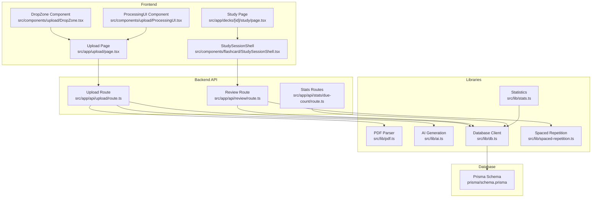
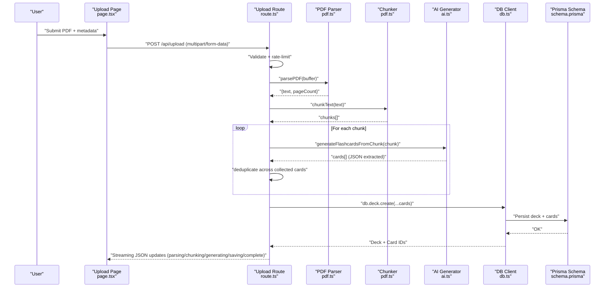
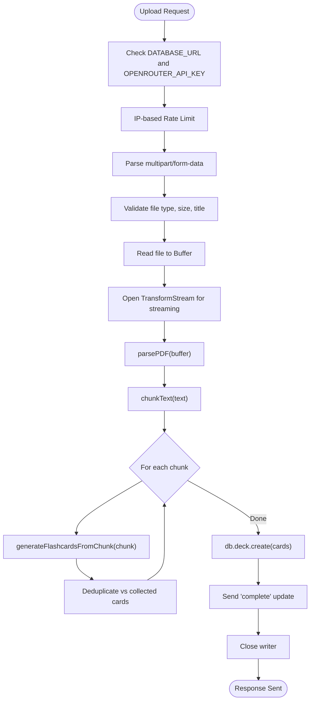
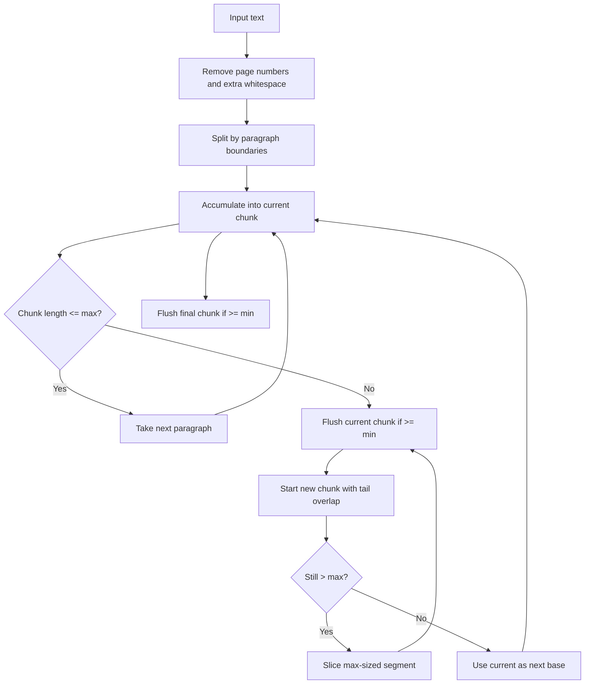
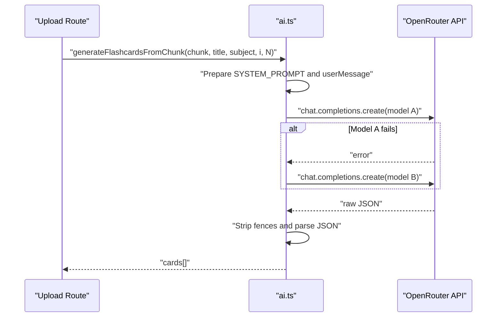
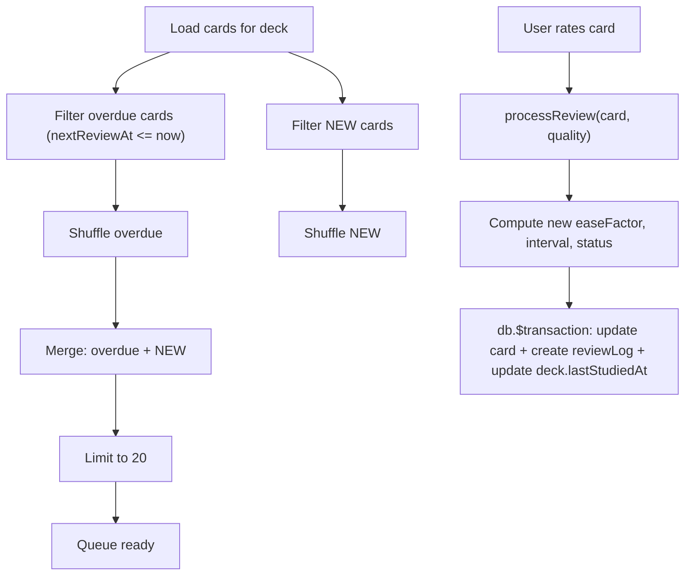
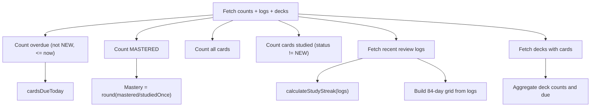
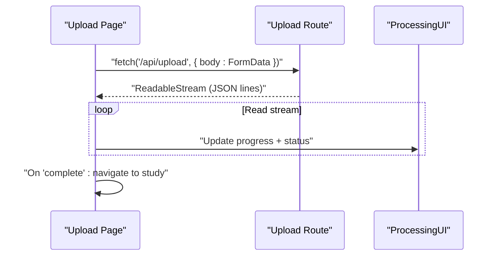
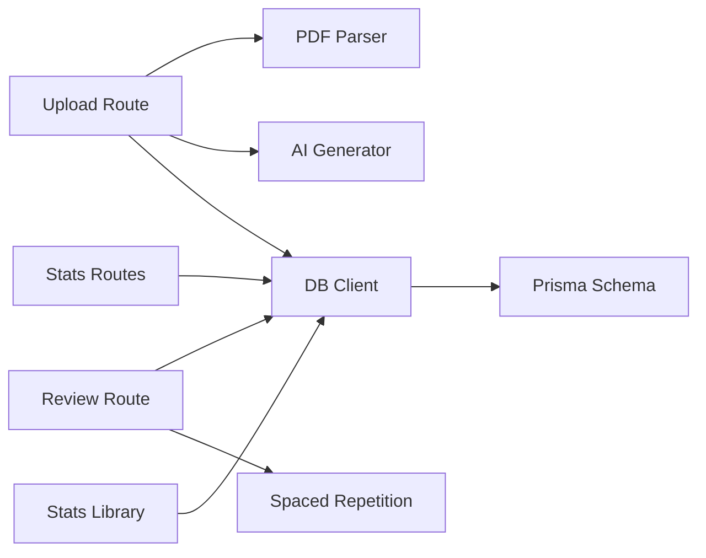

# Data Flow Architecture

<cite>
**Referenced Files in This Document**
- [route.ts](file://src/app/api/upload/route.ts)
- [pdf.ts](file://src/lib/pdf.ts)
- [ai.ts](file://src/lib/ai.ts)
- [db.ts](file://src/lib/db.ts)
- [schema.prisma](file://prisma/schema.prisma)
- [route.ts](file://src/app/api/review/route.ts)
- [spaced-repetition.ts](file://src/lib/spaced-repetition.ts)
- [route.ts](file://src/app/api/stats/due-count/route.ts)
- [stats.ts](file://src/lib/stats.ts)
- [page.tsx](file://src/app/upload/page.tsx)
- [DropZone.tsx](file://src/components/upload/DropZone.tsx)
- [ProcessingUI.tsx](file://src/components/upload/ProcessingUI.tsx)
- [page.tsx](file://src/app/decks/[id]/study/page.tsx)
- [StudySessionShell.tsx](file://src/components/flashcard/StudySessionShell.tsx)
</cite>

## Table of Contents
1. [Introduction](#introduction)
2. [Project Structure](#project-structure)
3. [Core Components](#core-components)
4. [Architecture Overview](#architecture-overview)
5. [Detailed Component Analysis](#detailed-component-analysis)
6. [Dependency Analysis](#dependency-analysis)
7. [Performance Considerations](#performance-considerations)
8. [Troubleshooting Guide](#troubleshooting-guide)
9. [Conclusion](#conclusion)

## Introduction
This document describes the end-to-end data flow architecture for the recall application. It covers the complete pipeline from PDF upload, text extraction, AI-powered flashcard generation, deduplication, and persistence to the database. It also documents the streaming architecture for large file processing, chunking strategies, memory management, AI integration with OpenAI-compatible APIs, prompt engineering patterns, spaced repetition scheduling, review queue management, statistics computation, progress tracking, and error handling with retries and fallbacks.

## Project Structure
The application follows a Next.js Pages Router structure with API routes under src/app/api and shared libraries under src/lib. The frontend upload and study pages orchestrate the user experience and communicate with backend APIs.

**Diagram sources**
- [page.tsx:1-504](file://src/app/upload/page.tsx#L1-L504)
- [DropZone.tsx:1-100](file://src/components/upload/DropZone.tsx#L1-L100)
- [ProcessingUI.tsx:1-53](file://src/components/upload/ProcessingUI.tsx#L1-L53)
- [page.tsx:1-92](file://src/app/decks/[id]/study/page.tsx#L1-L92)
- [StudySessionShell.tsx:1-430](file://src/components/flashcard/StudySessionShell.tsx#L1-L430)
- [route.ts:1-298](file://src/app/api/upload/route.ts#L1-L298)
- [route.ts:1-76](file://src/app/api/review/route.ts#L1-L76)
- [route.ts:1-15](file://src/app/api/stats/due-count/route.ts#L1-L15)
- [pdf.ts:1-112](file://src/lib/pdf.ts#L1-L112)
- [ai.ts:1-233](file://src/lib/ai.ts#L1-L233)
- [db.ts:1-68](file://src/lib/db.ts#L1-L68)
- [spaced-repetition.ts:1-141](file://src/lib/spaced-repetition.ts#L1-L141)
- [stats.ts:1-222](file://src/lib/stats.ts#L1-L222)
- [schema.prisma:1-51](file://prisma/schema.prisma#L1-L51)

**Section sources**
- [route.ts:1-298](file://src/app/api/upload/route.ts#L1-L298)
- [pdf.ts:1-112](file://src/lib/pdf.ts#L1-L112)
- [ai.ts:1-233](file://src/lib/ai.ts#L1-L233)
- [db.ts:1-68](file://src/lib/db.ts#L1-L68)
- [schema.prisma:1-51](file://prisma/schema.prisma#L1-L51)
- [route.ts:1-76](file://src/app/api/review/route.ts#L1-L76)
- [spaced-repetition.ts:1-141](file://src/lib/spaced-repetition.ts#L1-L141)
- [route.ts:1-15](file://src/app/api/stats/due-count/route.ts#L1-L15)
- [stats.ts:1-222](file://src/lib/stats.ts#L1-L222)
- [page.tsx:1-504](file://src/app/upload/page.tsx#L1-L504)
- [page.tsx:1-92](file://src/app/decks/[id]/study/page.tsx#L1-L92)
- [StudySessionShell.tsx:1-430](file://src/components/flashcard/StudySessionShell.tsx#L1-L430)

## Core Components
- Upload pipeline: Streams progress updates, parses PDF, chunks text, generates flashcards via AI, deduplicates, and persists to the database.
- PDF parsing and chunking: Cleans text, removes page artifacts, splits into overlapping chunks optimized for AI context windows.
- AI integration: Uses OpenRouter-compatible API with fallback models and robust JSON extraction.
- Spaced repetition: Implements SM-2 scheduling, queue construction, and daily review updates.
- Statistics: Computes due counts, mastery rates, streaks, heatmap, and recent sessions.
- Frontend orchestration: Handles drag-and-drop, streaming progress, and interactive study sessions.

**Section sources**
- [route.ts:86-298](file://src/app/api/upload/route.ts#L86-L298)
- [pdf.ts:13-111](file://src/lib/pdf.ts#L13-L111)
- [ai.ts:76-232](file://src/lib/ai.ts#L76-L232)
- [spaced-repetition.ts:29-104](file://src/lib/spaced-repetition.ts#L29-L104)
- [stats.ts:20-221](file://src/lib/stats.ts#L20-L221)
- [page.tsx:84-177](file://src/app/upload/page.tsx#L84-L177)
- [StudySessionShell.tsx:68-125](file://src/components/flashcard/StudySessionShell.tsx#L68-L125)

## Architecture Overview
The system is a streaming-first pipeline with clear separation of concerns:
- Frontend uploads a PDF and streams progress events.
- Backend validates, parses, chunks, and streams AI generation progress.
- AI generation uses fallback models and robust JSON parsing.
- Cards are deduplicated and persisted in a single transaction.
- Review updates use SM-2 scheduling and maintain atomic transactions with review logs.
- Statistics are computed from the database with efficient queries.

**Diagram sources**
- [page.tsx:84-177](file://src/app/upload/page.tsx#L84-L177)
- [route.ts:86-298](file://src/app/api/upload/route.ts#L86-L298)
- [pdf.ts:13-111](file://src/lib/pdf.ts#L13-L111)
- [ai.ts:168-232](file://src/lib/ai.ts#L168-L232)
- [db.ts:1-68](file://src/lib/db.ts#L1-L68)
- [schema.prisma:10-51](file://prisma/schema.prisma#L10-L51)

## Detailed Component Analysis

### Upload Pipeline and Streaming
- Validates environment variables early, rejects unsupported files, enforces size limits, trims metadata, and opens a TransformStream for immediate streaming.
- Streams structured JSON updates for parsing, chunking, generation, saving, and completion.
- Parses PDF, cleans text, and splits into overlapping chunks to preserve context.
- Generates flashcards per chunk with progress callbacks and deduplicates across the batch.
- Persists deck and cards atomically and closes the stream.

**Diagram sources**
- [route.ts:86-298](file://src/app/api/upload/route.ts#L86-L298)
- [pdf.ts:13-111](file://src/lib/pdf.ts#L13-L111)
- [ai.ts:168-232](file://src/lib/ai.ts#L168-L232)
- [db.ts:1-68](file://src/lib/db.ts#L1-L68)

**Section sources**
- [route.ts:86-298](file://src/app/api/upload/route.ts#L86-L298)
- [pdf.ts:67-111](file://src/lib/pdf.ts#L67-L111)
- [ai.ts:168-232](file://src/lib/ai.ts#L168-L232)

### PDF Parsing and Chunking Strategy
- Removes page number artifacts and collapses excessive whitespace.
- Splits text into overlapping chunks at paragraph boundaries to maximize semantic coherence.
- Enforces minimum chunk size and applies overlap to preserve continuity.
- Hard-splits oversized paragraphs to fit within the target chunk size.

**Diagram sources**
- [pdf.ts:67-111](file://src/lib/pdf.ts#L67-L111)

**Section sources**
- [pdf.ts:13-111](file://src/lib/pdf.ts#L13-L111)

### AI Integration and Prompt Engineering
- Initializes OpenRouter client lazily and throws a clear error if the API key is missing.
- Uses a comprehensive system prompt that defines categories, quality rules, and JSON output expectations.
- Iterates through fallback models and stops on first successful response.
- Extracts JSON from AI responses, tolerating fenced code blocks and partial matches.
- Retries failed chunks once with a short delay and continues with empty results if still failing.

**Diagram sources**
- [ai.ts:76-153](file://src/lib/ai.ts#L76-L153)
- [ai.ts:168-232](file://src/lib/ai.ts#L168-L232)

**Section sources**
- [ai.ts:8-24](file://src/lib/ai.ts#L8-L24)
- [ai.ts:53-74](file://src/lib/ai.ts#L53-L74)
- [ai.ts:92-153](file://src/lib/ai.ts#L92-L153)
- [ai.ts:168-232](file://src/lib/ai.ts#L168-L232)

### Spaced Repetition and Review Queue Management
- Implements SM-2 with ease factor adjustments, interval progression, and status transitions.
- Builds a study queue prioritizing overdue cards and mixing newly added cards.
- Provides rating options mapped to numeric quality scores for SM-2 updates.
- Processes reviews via a dedicated API that updates card state and creates review logs atomically.

**Diagram sources**
- [spaced-repetition.ts:29-76](file://src/lib/spaced-repetition.ts#L29-L76)
- [spaced-repetition.ts:88-104](file://src/lib/spaced-repetition.ts#L88-L104)
- [route.ts:28-68](file://src/app/api/review/route.ts#L28-L68)
- [page.tsx:80-82](file://src/app/decks/[id]/study/page.tsx#L80-L82)

**Section sources**
- [spaced-repetition.ts:29-104](file://src/lib/spaced-repetition.ts#L29-L104)
- [route.ts:28-68](file://src/app/api/review/route.ts#L28-L68)
- [page.tsx:80-82](file://src/app/decks/[id]/study/page.tsx#L80-L82)

### Statistics Calculation Pipeline
- Computes due count, mastery rate, and study streak from review logs.
- Builds a heatmap of activity over the last 84 days.
- Groups recent sessions with accuracy and duration thresholds.
- Aggregates deck-level counts and due-by-date metrics.

**Diagram sources**
- [stats.ts:51-221](file://src/lib/stats.ts#L51-L221)
- [route.ts:7-14](file://src/app/api/stats/due-count/route.ts#L7-L14)

**Section sources**
- [stats.ts:20-221](file://src/lib/stats.ts#L20-L221)
- [route.ts:1-15](file://src/app/api/stats/due-count/route.ts#L1-L15)

### Frontend Orchestration and UX
- Upload page handles drag-and-drop, validation, and streaming JSON updates to drive progress bars and status messages.
- DropZone and ProcessingUI provide responsive feedback during ingestion and generation.
- Study page loads cards, converts them to the internal format, and constructs the queue using SM-2 logic.
- StudySessionShell manages flipping, rating, optimistic UI updates, and session completion.

**Diagram sources**
- [page.tsx:84-177](file://src/app/upload/page.tsx#L84-L177)
- [ProcessingUI.tsx:12-27](file://src/components/upload/ProcessingUI.tsx#L12-L27)
- [route.ts:164-298](file://src/app/api/upload/route.ts#L164-L298)

**Section sources**
- [page.tsx:84-177](file://src/app/upload/page.tsx#L84-L177)
- [DropZone.tsx:21-99](file://src/components/upload/DropZone.tsx#L21-L99)
- [ProcessingUI.tsx:12-27](file://src/components/upload/ProcessingUI.tsx#L12-L27)
- [page.tsx:30-92](file://src/app/decks/[id]/study/page.tsx#L30-L92)
- [StudySessionShell.tsx:68-125](file://src/components/flashcard/StudySessionShell.tsx#L68-L125)

## Dependency Analysis
- API routes depend on shared libraries for PDF parsing, AI generation, database access, and scheduling/statistics.
- The database schema defines Deck, Card, and ReviewLog entities with relations and indexes implied by Prisma usage.
- Frontend pages depend on API routes and UI components for user interaction.

**Diagram sources**
- [route.ts:1-10](file://src/app/api/upload/route.ts#L1-L10)
- [pdf.ts:1-11](file://src/lib/pdf.ts#L1-L11)
- [ai.ts:1-10](file://src/lib/ai.ts#L1-L10)
- [db.ts:1-10](file://src/lib/db.ts#L1-L10)
- [route.ts:1-5](file://src/app/api/review/route.ts#L1-L5)
- [spaced-repetition.ts:1-5](file://src/lib/spaced-repetition.ts#L1-L5)
- [route.ts:1-5](file://src/app/api/stats/due-count/route.ts#L1-L5)
- [stats.ts:1-5](file://src/lib/stats.ts#L1-L5)
- [schema.prisma:1-10](file://prisma/schema.prisma#L1-L10)

**Section sources**
- [route.ts:1-10](file://src/app/api/upload/route.ts#L1-L10)
- [pdf.ts:1-11](file://src/lib/pdf.ts#L1-L11)
- [ai.ts:1-10](file://src/lib/ai.ts#L1-L10)
- [db.ts:1-10](file://src/lib/db.ts#L1-L10)
- [route.ts:1-5](file://src/app/api/review/route.ts#L1-L5)
- [spaced-repetition.ts:1-5](file://src/lib/spaced-repetition.ts#L1-L5)
- [route.ts:1-5](file://src/app/api/stats/due-count/route.ts#L1-L5)
- [stats.ts:1-5](file://src/lib/stats.ts#L1-L5)
- [schema.prisma:1-10](file://prisma/schema.prisma#L1-L10)

## Performance Considerations
- Streaming: The upload route returns a streaming response immediately, preventing timeouts and enabling real-time progress.
- Chunking: Paragraph-aware splitting with overlap improves AI comprehension and reduces context loss.
- Memory: PDF parsing occurs in-memory; the pipeline reads the entire file buffer before streaming to avoid holding the request body open. Consider streaming parsers for extremely large files if needed.
- AI pacing: Delays between chunk requests mitigate free-tier rate limits.
- Database: Transactions consolidate writes; ensure indexes on nextReviewAt and status for efficient queue and stats queries.

[No sources needed since this section provides general guidance]

## Troubleshooting Guide
- Environment errors: Early checks surface missing DATABASE_URL or OPENROUTER_API_KEY with actionable messages.
- AI errors: Public error messages distinguish rate limits, model unavailability, invalid keys, and service overloads.
- Database connectivity: Errors related to DATABASE_URL, Prisma codes, or authentication failures are detected and surfaced clearly.
- Upload validation: Rejects non-PDF files, enforces size limits, and validates required metadata.
- Retry and fallback: AI generation retries a failed chunk once and falls back to alternate models; deduplication prevents duplicates.
- Frontend resilience: Malformed JSON lines are skipped; the UI displays user-friendly errors and allows retry.

**Section sources**
- [route.ts:11-63](file://src/app/api/upload/route.ts#L11-L63)
- [route.ts:133-151](file://src/app/api/upload/route.ts#L133-L151)
- [ai.ts:92-153](file://src/lib/ai.ts#L92-L153)
- [ai.ts:194-209](file://src/lib/ai.ts#L194-L209)

## Conclusion
The recall application implements a robust, streaming-first ingestion pipeline that transforms PDFs into spaced-repetition flashcards. It leverages a clear separation of concerns across parsing, chunking, AI generation, deduplication, and persistence. The SM-2 scheduling and review queue ensure effective learning, while comprehensive statistics and progress tracking provide insights and motivation. The architecture balances reliability with performance, incorporating retries, fallbacks, and user-visible feedback throughout the pipeline.