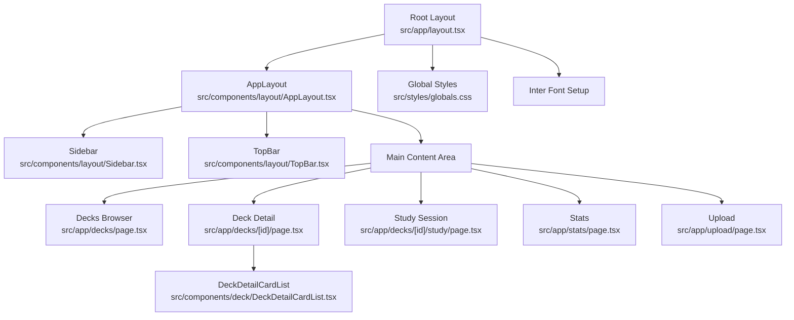
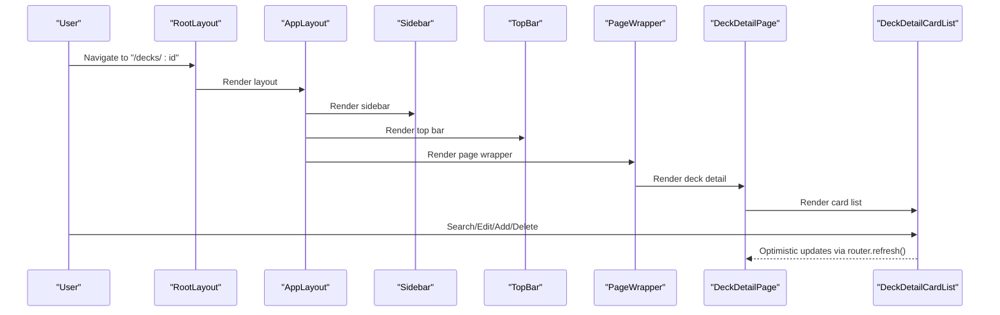
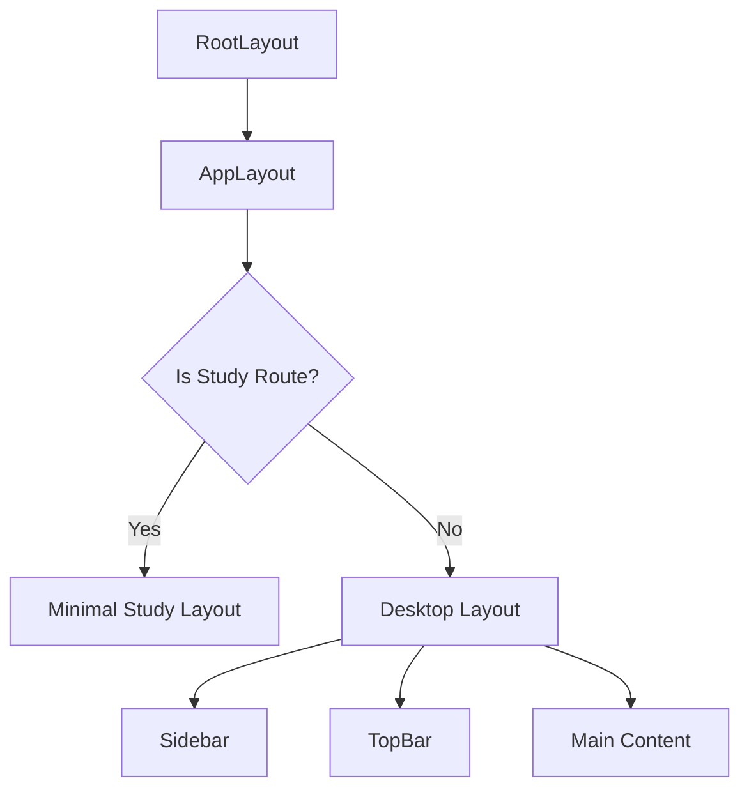
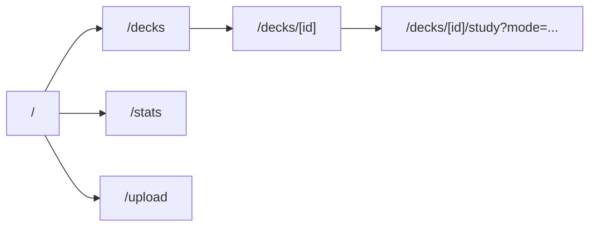
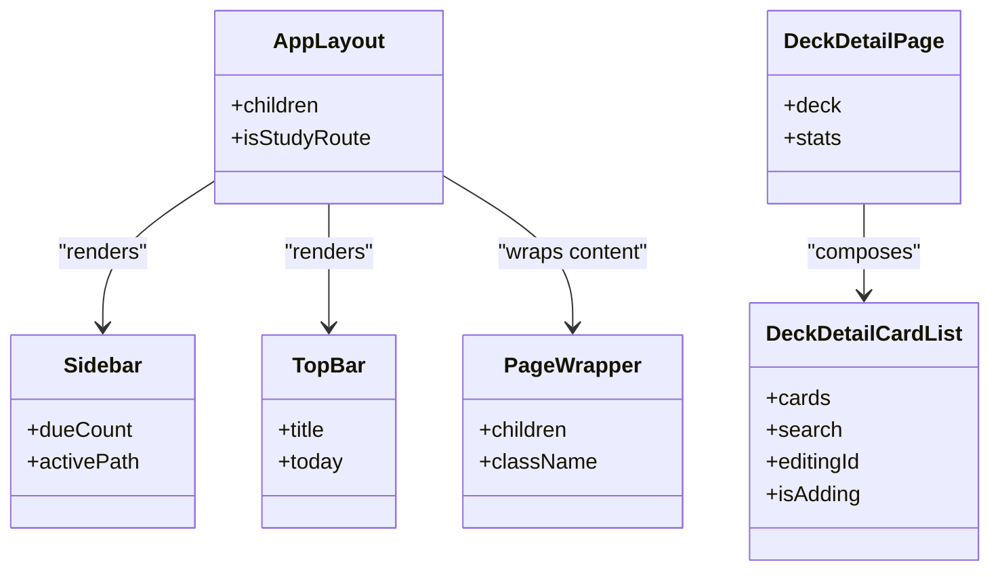
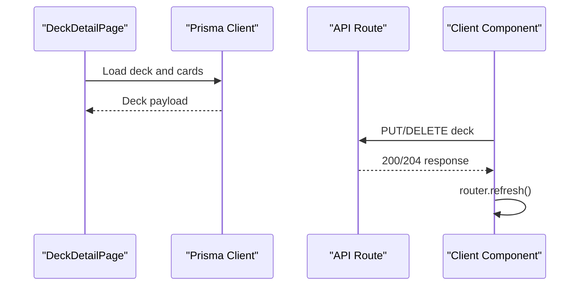
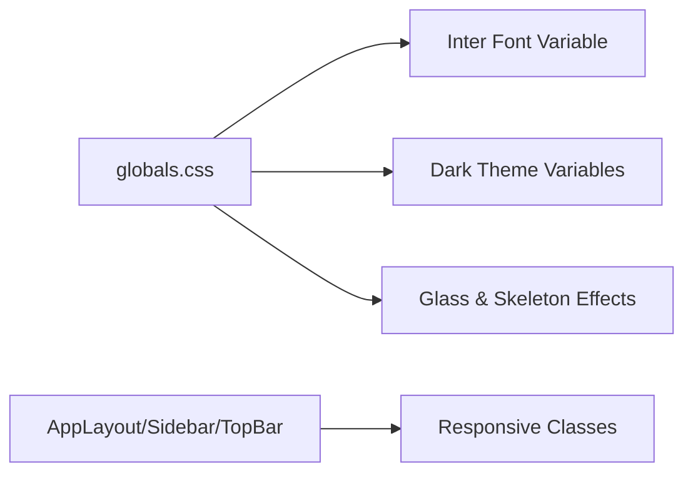
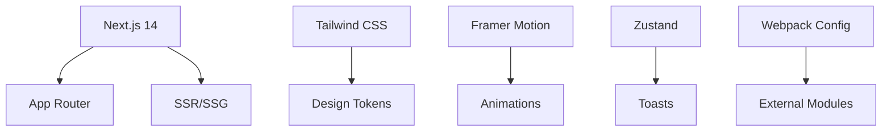
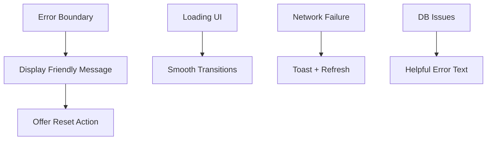

# Frontend Architecture

<cite>
**Referenced Files in This Document**
- [src/app/layout.tsx](file://src/app/layout.tsx)
- [src/components/layout/AppLayout.tsx](file://src/components/layout/AppLayout.tsx)
- [src/components/layout/Sidebar.tsx](file://src/components/layout/Sidebar.tsx)
- [src/components/layout/TopBar.tsx](file://src/components/layout/TopBar.tsx)
- [src/components/layout/PageWrapper.tsx](file://src/components/layout/PageWrapper.tsx)
- [src/app/decks/[id]/page.tsx](file://src/app/decks/[id]/page.tsx)
- [src/app/decks/[id]/study/page.tsx](file://src/app/decks/[id]/study/page.tsx)
- [src/components/deck/DeckDetailCardList.tsx](file://src/components/deck/DeckDetailCardList.tsx)
- [src/app/loading.tsx](file://src/app/loading.tsx)
- [src/app/error.tsx](file://src/app/error.tsx)
- [src/app/api/decks/[id]/route.ts](file://src/app/api/decks/[id]/route.ts)
- [src/styles/globals.css](file://src/styles/globals.css)
- [src/lib/constants.ts](file://src/lib/constants.ts)
- [package.json](file://package.json)
- [next.config.mjs](file://next.config.mjs)
</cite>

## Table of Contents
1. [Introduction](#introduction)
2. [Project Structure](#project-structure)
3. [Core Components](#core-components)
4. [Architecture Overview](#architecture-overview)
5. [Detailed Component Analysis](#detailed-component-analysis)
6. [Dependency Analysis](#dependency-analysis)
7. [Performance Considerations](#performance-considerations)
8. [Accessibility and SEO](#accessibility-and-seo)
9. [Troubleshooting Guide](#troubleshooting-guide)
10. [Conclusion](#conclusion)

## Introduction
This document describes the frontend architecture of the recall application, focusing on the Next.js 14 App Router implementation, server components pattern, layout system, responsive design, routing strategy, and performance optimizations. It explains how pages, layouts, and UI components are organized, how data flows through the system, and how state is managed client-side to minimize prop drilling.

## Project Structure
The application follows Next.js 14’s App Router conventions:
- App-level metadata, viewport, and root layout are defined in the root app directory.
- Pages are grouped under routes such as decks, stats, upload, and study sessions.
- Shared UI components live under a dedicated components directory with feature-based grouping (deck, flashcard, layout, stats, ui, upload).
- Styling leverages Tailwind CSS with global CSS variables and Inter font integration.
- API routes are colocated under app/api for server actions and data mutations.

**Diagram sources**
- [src/app/layout.tsx:1-52](file://src/app/layout.tsx#L1-L52)
- [src/components/layout/AppLayout.tsx:1-41](file://src/components/layout/AppLayout.tsx#L1-L41)
- [src/components/layout/Sidebar.tsx:1-98](file://src/components/layout/Sidebar.tsx#L1-L98)
- [src/components/layout/TopBar.tsx:1-41](file://src/components/layout/TopBar.tsx#L1-L41)
- [src/app/decks/[id]/page.tsx:1-206](file://src/app/decks/[id]/page.tsx#L1-L206)
- [src/app/decks/[id]/study/page.tsx:1-92](file://src/app/decks/[id]/study/page.tsx#L1-L92)
- [src/components/deck/DeckDetailCardList.tsx:1-358](file://src/components/deck/DeckDetailCardList.tsx#L1-L358)
- [src/styles/globals.css:1-82](file://src/styles/globals.css#L1-L82)

**Section sources**
- [src/app/layout.tsx:1-52](file://src/app/layout.tsx#L1-L52)
- [src/styles/globals.css:1-82](file://src/styles/globals.css#L1-L82)

## Core Components
- RootLayout: Defines metadata, viewport, Inter font, and wraps children in AppLayout.
- AppLayout: Orchestrates sidebar, top bar, main content area, and special handling for study routes.
- Sidebar: Navigation with active state detection, due count fetching, and animated indicators.
- TopBar: Dynamic title and date display based on current route.
- PageWrapper: Provides page transition animations for smooth navigation.
- DeckDetailCardList: Interactive card list with search, add/edit/delete, and optimistic updates.

**Section sources**
- [src/app/layout.tsx:1-52](file://src/app/layout.tsx#L1-L52)
- [src/components/layout/AppLayout.tsx:1-41](file://src/components/layout/AppLayout.tsx#L1-L41)
- [src/components/layout/Sidebar.tsx:1-98](file://src/components/layout/Sidebar.tsx#L1-L98)
- [src/components/layout/TopBar.tsx:1-41](file://src/components/layout/TopBar.tsx#L1-L41)
- [src/components/layout/PageWrapper.tsx:1-30](file://src/components/layout/PageWrapper.tsx#L1-L30)
- [src/components/deck/DeckDetailCardList.tsx:1-358](file://src/components/deck/DeckDetailCardList.tsx#L1-L358)

## Architecture Overview
The architecture centers on:
- App Router with nested layouts and per-route pages.
- Server components for data fetching and rendering, with client components for interactivity.
- A consistent layout system with Sidebar and TopBar for navigation and context.
- Tailwind CSS for responsive design and a cohesive dark theme.
- API routes for CRUD operations on decks and cards.

**Diagram sources**
- [src/app/layout.tsx:1-52](file://src/app/layout.tsx#L1-L52)
- [src/components/layout/AppLayout.tsx:1-41](file://src/components/layout/AppLayout.tsx#L1-L41)
- [src/components/layout/Sidebar.tsx:1-98](file://src/components/layout/Sidebar.tsx#L1-L98)
- [src/components/layout/TopBar.tsx:1-41](file://src/components/layout/TopBar.tsx#L1-L41)
- [src/components/layout/PageWrapper.tsx:1-30](file://src/components/layout/PageWrapper.tsx#L1-L30)
- [src/app/decks/[id]/page.tsx:1-206](file://src/app/decks/[id]/page.tsx#L1-L206)
- [src/components/deck/DeckDetailCardList.tsx:1-358](file://src/components/deck/DeckDetailCardList.tsx#L1-L358)

## Detailed Component Analysis

### Layout System
- RootLayout sets metadata, viewport, and applies Inter font via CSS variable. It renders AppLayout around all pages.
- AppLayout conditionally renders either a full-study layout (minimal UI) or the standard layout with Sidebar and TopBar. It also mounts toast and command palette providers globally.
- Sidebar handles active navigation highlighting, due count polling, and responsive layout switching between mobile bottom bar and desktop sidebar.
- TopBar computes the page title from the current path and displays today’s date.

**Diagram sources**
- [src/app/layout.tsx:1-52](file://src/app/layout.tsx#L1-L52)
- [src/components/layout/AppLayout.tsx:1-41](file://src/components/layout/AppLayout.tsx#L1-L41)
- [src/components/layout/Sidebar.tsx:1-98](file://src/components/layout/Sidebar.tsx#L1-L98)
- [src/components/layout/TopBar.tsx:1-41](file://src/components/layout/TopBar.tsx#L1-L41)

**Section sources**
- [src/app/layout.tsx:1-52](file://src/app/layout.tsx#L1-L52)
- [src/components/layout/AppLayout.tsx:1-41](file://src/components/layout/AppLayout.tsx#L1-L41)
- [src/components/layout/Sidebar.tsx:1-98](file://src/components/layout/Sidebar.tsx#L1-L98)
- [src/components/layout/TopBar.tsx:1-41](file://src/components/layout/TopBar.tsx#L1-L41)

### Routing Strategy and Navigation Patterns
- Static routes: dashboard (/), decks (/decks), stats (/stats), upload (/upload).
- Dynamic routes: deck detail (/decks/[id]) and study session (/decks/[id]/study).
- Study mode parameter: supports normal due queue or “all” mode for full review.
- Navigation uses Next.js Link and router.refresh() to maintain client interactivity without full page reloads.

**Diagram sources**
- [src/app/decks/[id]/page.tsx:1-206](file://src/app/decks/[id]/page.tsx#L1-L206)
- [src/app/decks/[id]/study/page.tsx:1-92](file://src/app/decks/[id]/study/page.tsx#L1-L92)

**Section sources**
- [src/app/decks/[id]/page.tsx:1-206](file://src/app/decks/[id]/page.tsx#L1-L206)
- [src/app/decks/[id]/study/page.tsx:1-92](file://src/app/decks/[id]/study/page.tsx#L1-L92)

### Component Composition and State Management
- Composition patterns:
  - PageWrapper encapsulates page transitions and spacing.
  - DeckDetailPage composes DeckDetailCardList and DeckOptions.
  - AppLayout composes Sidebar, TopBar, and providers.
- Prop drilling prevention:
  - Client-side state is scoped to interactive components (e.g., DeckDetailCardList manages search, add/edit forms).
  - Global providers (toasts, command palette) are mounted at the layout level.
- State management integration:
  - Local component state for UI toggles and forms.
  - Zustand-based toast store referenced via useToast hook.
  - router.refresh() triggers selective revalidation after mutations.

**Diagram sources**
- [src/components/layout/AppLayout.tsx:1-41](file://src/components/layout/AppLayout.tsx#L1-L41)
- [src/components/layout/Sidebar.tsx:1-98](file://src/components/layout/Sidebar.tsx#L1-L98)
- [src/components/layout/TopBar.tsx:1-41](file://src/components/layout/TopBar.tsx#L1-L41)
- [src/components/layout/PageWrapper.tsx:1-30](file://src/components/layout/PageWrapper.tsx#L1-L30)
- [src/app/decks/[id]/page.tsx:1-206](file://src/app/decks/[id]/page.tsx#L1-L206)
- [src/components/deck/DeckDetailCardList.tsx:1-358](file://src/components/deck/DeckDetailCardList.tsx#L1-L358)

**Section sources**
- [src/components/layout/PageWrapper.tsx:1-30](file://src/components/layout/PageWrapper.tsx#L1-L30)
- [src/app/decks/[id]/page.tsx:1-206](file://src/app/decks/[id]/page.tsx#L1-L206)
- [src/components/deck/DeckDetailCardList.tsx:1-358](file://src/components/deck/DeckDetailCardList.tsx#L1-L358)

### Data Fetching and API Integration
- Server components fetch data server-side (e.g., deck detail page queries the database).
- API routes handle deck updates and deletions.
- Client components trigger mutations and refresh the UI using router.refresh().

**Diagram sources**
- [src/app/decks/[id]/page.tsx:1-206](file://src/app/decks/[id]/page.tsx#L1-L206)
- [src/app/api/decks/[id]/route.ts:1-43](file://src/app/api/decks/[id]/route.ts#L1-L43)
- [src/components/deck/DeckDetailCardList.tsx:1-358](file://src/components/deck/DeckDetailCardList.tsx#L1-L358)

**Section sources**
- [src/app/decks/[id]/page.tsx:1-206](file://src/app/decks/[id]/page.tsx#L1-L206)
- [src/app/api/decks/[id]/route.ts:1-43](file://src/app/api/decks/[id]/route.ts#L1-L43)
- [src/components/deck/DeckDetailCardList.tsx:1-358](file://src/components/deck/DeckDetailCardList.tsx#L1-L358)

### Responsive Design and Styling
- Tailwind CSS is configured globally with dark theme variables and Inter font applied via CSS variable.
- Responsive breakpoints adjust layout from mobile bottom navigation to desktop sidebar and main content area.
- Motion animations are used for transitions and interactive feedback.

**Diagram sources**
- [src/styles/globals.css:1-82](file://src/styles/globals.css#L1-L82)
- [src/app/layout.tsx:1-52](file://src/app/layout.tsx#L1-L52)
- [src/components/layout/AppLayout.tsx:1-41](file://src/components/layout/AppLayout.tsx#L1-L41)
- [src/components/layout/Sidebar.tsx:1-98](file://src/components/layout/Sidebar.tsx#L1-L98)
- [src/components/layout/TopBar.tsx:1-41](file://src/components/layout/TopBar.tsx#L1-L41)

**Section sources**
- [src/styles/globals.css:1-82](file://src/styles/globals.css#L1-L82)
- [src/app/layout.tsx:1-52](file://src/app/layout.tsx#L1-L52)

## Dependency Analysis
- Next.js 14 provides the runtime, App Router, and SSR/SSG capabilities.
- Tailwind CSS and PostCSS configure the design system.
- Framer Motion adds animations.
- Zustand powers toast notifications.
- Webpack configuration marks certain browser-incompatible modules as external for server builds.

**Diagram sources**
- [package.json:1-56](file://package.json#L1-L56)
- [next.config.mjs:1-14](file://next.config.mjs#L1-L14)

**Section sources**
- [package.json:1-56](file://package.json#L1-L56)
- [next.config.mjs:1-14](file://next.config.mjs#L1-L14)

## Performance Considerations
- Server-side rendering: Pages like deck detail fetch data server-side to reduce client work and improve initial load.
- Dynamic rendering for study: The study page opts into dynamic rendering to ensure accurate due queues based on current time.
- Static generation: Pages not requiring real-time data can leverage static generation where appropriate.
- Image optimization: Next.js Image and optimized static asset handling are available; ensure images are served via Next/Image for best performance.
- Client hydration: Client components are marked appropriately to avoid unnecessary SSR overhead.
- Bundle externals: Webpack excludes browser-incompatible modules on the server to keep bundles lean.

**Section sources**
- [src/app/decks/[id]/study/page.tsx:8-9](file://src/app/decks/[id]/study/page.tsx#L8-L9)
- [next.config.mjs:1-14](file://next.config.mjs#L1-L14)

## Accessibility and SEO
- Accessibility:
  - Semantic HTML and proper contrast in dark theme.
  - Focus-visible rings and keyboard navigable components.
  - ARIA attributes where needed (e.g., hidden labels for icons).
- SEO:
  - Metadata and Open Graph/Twitter tags defined at the root layout.
  - Descriptive page titles derived from the current route.
  - Canonical and structured metadata can be extended as needed.

**Section sources**
- [src/app/layout.tsx:21-37](file://src/app/layout.tsx#L21-L37)
- [src/components/layout/TopBar.tsx:16-40](file://src/components/layout/TopBar.tsx#L16-L40)

## Troubleshooting Guide
- Error boundaries: Centralized error UI with a reset action to recover from transient failures.
- Loading states: Shared loading skeleton improves perceived performance during navigation and data fetch.
- Network errors: Client components surface actionable messages and retry via refresh.
- Database connectivity: Deck detail page surfaces helpful error messages pointing to likely causes (e.g., DATABASE_URL).

**Diagram sources**
- [src/app/error.tsx:1-44](file://src/app/error.tsx#L1-L44)
- [src/app/loading.tsx:1-17](file://src/app/loading.tsx#L1-L17)
- [src/app/decks/[id]/page.tsx:43-60](file://src/app/decks/[id]/page.tsx#L43-L60)

**Section sources**
- [src/app/error.tsx:1-44](file://src/app/error.tsx#L1-L44)
- [src/app/loading.tsx:1-17](file://src/app/loading.tsx#L1-L17)
- [src/app/decks/[id]/page.tsx:43-60](file://src/app/decks/[id]/page.tsx#L43-L60)

## Conclusion
The recall application employs a clean, scalable Next.js 14 architecture with server components for data fetching and client components for interactivity. The layout system ensures consistent navigation and context-aware UI, while Tailwind CSS and Inter font deliver a cohesive, responsive design. Routing supports both static and dynamic paths, and state management is intentionally scoped to prevent prop drilling. Performance is optimized through SSR/SSG, dynamic rendering where needed, and careful bundling. Accessibility, SEO, and error handling are addressed to provide a robust user experience.