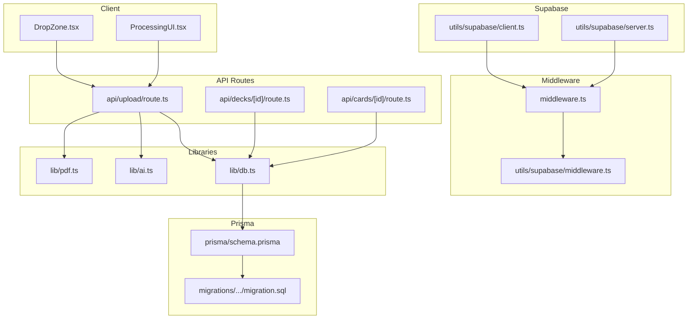
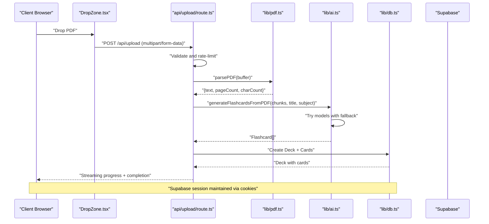
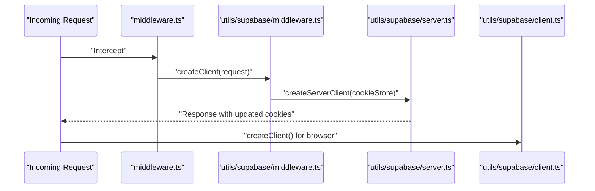
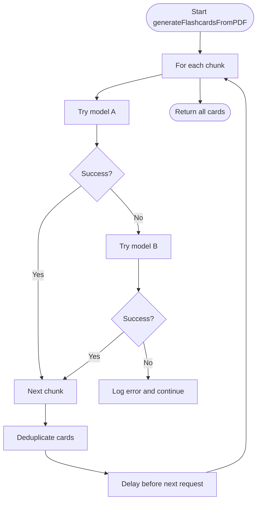
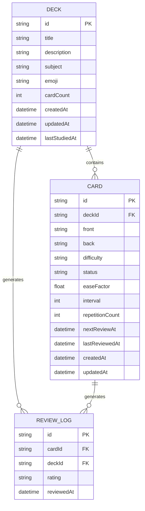
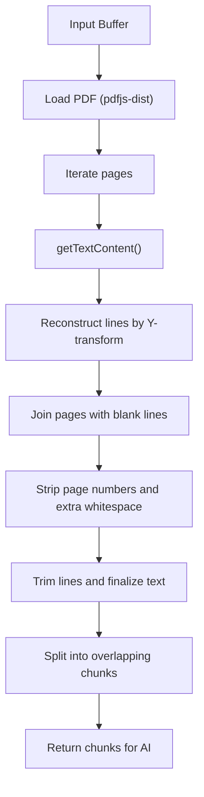
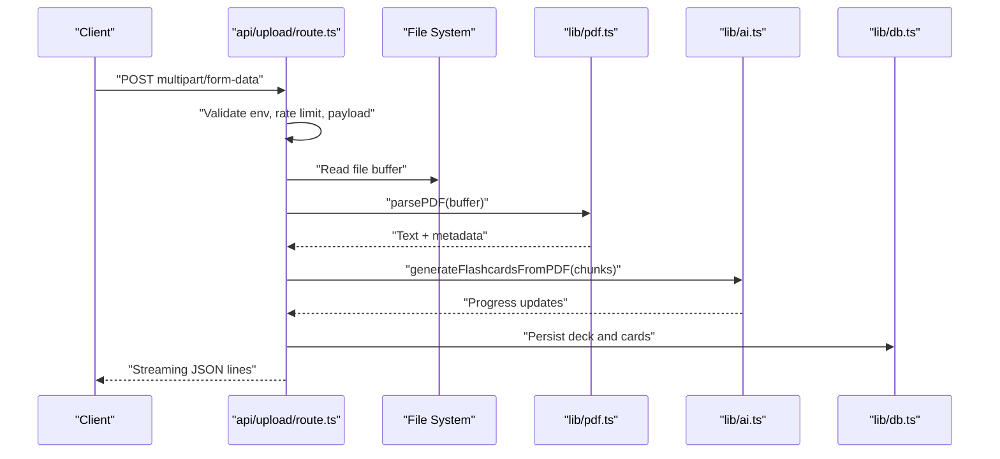
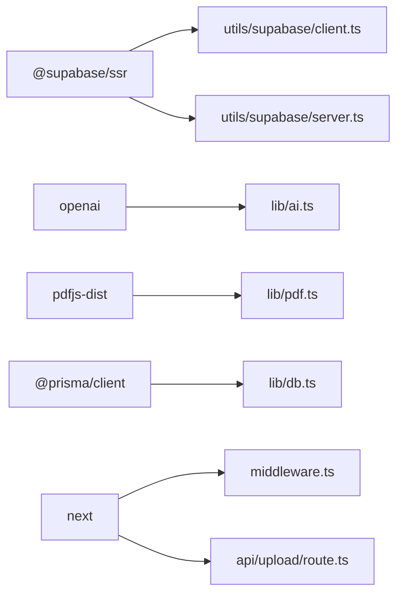

# Integration Patterns

<cite>
**Referenced Files in This Document**
- [client.ts](file://src/utils/supabase/client.ts)
- [server.ts](file://src/utils/supabase/server.ts)
- [middleware.ts](file://src/utils/supabase/middleware.ts)
- [middleware.ts](file://middleware.ts)
- [ai.ts](file://src/lib/ai.ts)
- [db.ts](file://src/lib/db.ts)
- [pdf.ts](file://src/lib/pdf.ts)
- [schema.prisma](file://prisma/schema.prisma)
- [migration.sql](file://prisma/migrations/20260421034221_init/migration.sql)
- [route.ts](file://src/app/api/upload/route.ts)
- [route.ts](file://src/app/api/decks/[id]/route.ts)
- [route.ts](file://src/app/api/cards/[id]/route.ts)
- [DropZone.tsx](file://src/components/upload/DropZone.tsx)
- [ProcessingUI.tsx](file://src/components/upload/ProcessingUI.tsx)
- [package.json](file://package.json)
</cite>

## Table of Contents
1. [Introduction](#introduction)
2. [Project Structure](#project-structure)
3. [Core Components](#core-components)
4. [Architecture Overview](#architecture-overview)
5. [Detailed Component Analysis](#detailed-component-analysis)
6. [Dependency Analysis](#dependency-analysis)
7. [Performance Considerations](#performance-considerations)
8. [Troubleshooting Guide](#troubleshooting-guide)
9. [Conclusion](#conclusion)
10. [Appendices](#appendices)

## Introduction
This document explains the integration patterns for third-party services and external systems in the recall application. It covers:
- Supabase authentication integration (client-side and server-side SDK usage, session management, cookie handling)
- OpenAI/OpenRouter API integration (configuration, provider abstraction, fallback strategies)
- Database integration with Prisma ORM (schema design, datasource selection, SSL handling)
- PDF processing integration (text extraction, chunking, content formatting)
- Deployment integration with Vercel (environment variables, runtime configuration)
- Error handling patterns, rate limiting, and graceful degradation strategies

## Project Structure
The integration surface spans client components, server middleware, API routes, and backend libraries:
- Supabase utilities for browser and server contexts
- AI generation pipeline using OpenRouter
- PDF parsing and chunking utilities
- Prisma ORM configuration and schema
- API routes orchestrating uploads and persistence
- Client UI components for drag-and-drop and progress visualization

**Diagram sources**
- [DropZone.tsx:1-100](file://src/components/upload/DropZone.tsx#L1-L100)
- [ProcessingUI.tsx:1-53](file://src/components/upload/ProcessingUI.tsx#L1-L53)
- [middleware.ts:1-22](file://middleware.ts#L1-L22)
- [middleware.ts:1-38](file://src/utils/supabase/middleware.ts#L1-L38)
- [route.ts:1-298](file://src/app/api/upload/route.ts#L1-L298)
- [route.ts:1-43](file://src/app/api/decks/[id]/route.ts#L1-L43)
- [route.ts:1-47](file://src/app/api/cards/[id]/route.ts#L1-L47)
- [ai.ts:1-233](file://src/lib/ai.ts#L1-L233)
- [db.ts:1-68](file://src/lib/db.ts#L1-L68)
- [pdf.ts:1-130](file://src/lib/pdf.ts#L1-L130)
- [client.ts:1-11](file://src/utils/supabase/client.ts#L1-L11)
- [server.ts:1-29](file://src/utils/supabase/server.ts#L1-L29)
- [schema.prisma:1-51](file://prisma/schema.prisma#L1-L51)
- [migration.sql:1-42](file://prisma/migrations/20260421034221_init/migration.sql#L1-L42)

**Section sources**
- [package.json:1-54](file://package.json#L1-L54)

## Core Components
- Supabase client and server SDK wrappers for browser and server contexts, with cookie store integration
- Middleware that refreshes user sessions and manages cookies across requests
- AI generation pipeline using OpenRouter with fallback models and robust error handling
- PDF parsing and chunking utilities optimized for serverless environments
- Prisma ORM configuration selecting appropriate datasource URLs and enforcing SSL in serverless
- API routes orchestrating PDF upload, streaming progress, and persistence

**Section sources**
- [client.ts:1-11](file://src/utils/supabase/client.ts#L1-L11)
- [server.ts:1-29](file://src/utils/supabase/server.ts#L1-L29)
- [middleware.ts:1-38](file://src/utils/supabase/middleware.ts#L1-L38)
- [middleware.ts:1-22](file://middleware.ts#L1-L22)
- [ai.ts:1-233](file://src/lib/ai.ts#L1-L233)
- [pdf.ts:1-130](file://src/lib/pdf.ts#L1-L130)
- [db.ts:1-68](file://src/lib/db.ts#L1-L68)
- [route.ts:1-298](file://src/app/api/upload/route.ts#L1-L298)

## Architecture Overview
The system integrates three pillars:
- Authentication: Supabase handles sign-in/sign-out and session persistence via cookies
- AI Generation: OpenRouter API is used to produce flashcards from PDF chunks
- Data Persistence: Prisma ORM writes decks, cards, and review logs to PostgreSQL

**Diagram sources**
- [DropZone.tsx:1-100](file://src/components/upload/DropZone.tsx#L1-L100)
- [route.ts:1-298](file://src/app/api/upload/route.ts#L1-L298)
- [pdf.ts:1-130](file://src/lib/pdf.ts#L1-L130)
- [ai.ts:1-233](file://src/lib/ai.ts#L1-L233)
- [db.ts:1-68](file://src/lib/db.ts#L1-L68)
- [client.ts:1-11](file://src/utils/supabase/client.ts#L1-L11)
- [server.ts:1-29](file://src/utils/supabase/server.ts#L1-L29)

## Detailed Component Analysis

### Supabase Authentication Integration
- Client-side SDK usage: A thin wrapper creates a Supabase client using NEXT_PUBLIC_* environment variables intended for the browser
- Server-side SDK usage: A server client is created with a cookie store abstraction to read and write session cookies
- Middleware: Refreshes user sessions and ensures cookie updates propagate to both the request and response

**Diagram sources**
- [middleware.ts:1-22](file://middleware.ts#L1-L22)
- [middleware.ts:1-38](file://src/utils/supabase/middleware.ts#L1-L38)
- [server.ts:1-29](file://src/utils/supabase/server.ts#L1-L29)
- [client.ts:1-11](file://src/utils/supabase/client.ts#L1-L11)

Key implementation notes:
- Cookie store abstraction enables server-side session mutation and propagation
- Environment variables are prefixed with NEXT_PUBLIC_ for client availability
- Middleware applies to non-static/public routes to maintain session freshness

**Section sources**
- [client.ts:1-11](file://src/utils/supabase/client.ts#L1-L11)
- [server.ts:1-29](file://src/utils/supabase/server.ts#L1-L29)
- [middleware.ts:1-38](file://src/utils/supabase/middleware.ts#L1-L38)
- [middleware.ts:1-22](file://middleware.ts#L1-L22)

### OpenAI/OpenRouter API Integration
- Provider abstraction: A lazily initialized OpenRouter client encapsulates API base URL and key
- Fallback strategy: Multiple models are attempted in sequence to improve reliability
- Robust parsing: JSON extraction with fenced code removal and fallback to first JSON block
- Rate limiting and pacing: Delays between requests to respect free-tier constraints
- Streaming progress: Progress callbacks are emitted to the client during generation

**Diagram sources**
- [ai.ts:76-153](file://src/lib/ai.ts#L76-L153)

Operational details:
- Environment-driven initialization prevents build-time failures when keys are absent
- Public error classification maps common failures to user-friendly messages
- Deduplication reduces redundancy across chunks and final save

**Section sources**
- [ai.ts:1-233](file://src/lib/ai.ts#L1-L233)

### Database Integration with Prisma ORM
- Datasource selection: Production prefers platform-specific Postgres URLs; avoids SQLite file URLs
- SSL enforcement: Adds sslmode=require when missing for serverless compatibility
- Schema design: Decks, Cards, and ReviewLogs with relations and defaults
- Migration baseline: Initial migration defines tables and foreign keys

**Diagram sources**
- [schema.prisma:10-51](file://prisma/schema.prisma#L10-L51)
- [migration.sql:1-42](file://prisma/migrations/20260421034221_init/migration.sql#L1-L42)

Implementation highlights:
- URL selection logic prioritizes pooled connections in production
- SSL requirement ensures compatibility with serverless databases
- API routes update card counts and cascade deletes appropriately

**Section sources**
- [db.ts:1-68](file://src/lib/db.ts#L1-L68)
- [schema.prisma:1-51](file://prisma/schema.prisma#L1-L51)
- [migration.sql:1-42](file://prisma/migrations/20260421034221_init/migration.sql#L1-L42)
- [route.ts:1-43](file://src/app/api/decks/[id]/route.ts#L1-L43)
- [route.ts:1-47](file://src/app/api/cards/[id]/route.ts#L1-L47)

### PDF Processing Integration
- Extraction: Uses pdfjs-dist to parse buffers and reconstruct readable text with line breaks
- Formatting: Removes page numbers and collapses excessive whitespace
- Chunking: Splits text into overlapping segments respecting paragraph boundaries for AI processing

**Diagram sources**
- [pdf.ts:14-79](file://src/lib/pdf.ts#L14-L79)
- [pdf.ts:85-129](file://src/lib/pdf.ts#L85-L129)

Serverless considerations:
- Disables font rendering to avoid native canvas dependencies
- Works reliably in Vercel serverless functions

**Section sources**
- [pdf.ts:1-130](file://src/lib/pdf.ts#L1-L130)

### Deployment Integration with Vercel
- Runtime and timeout: API routes specify Node.js runtime and extended max duration for heavy workloads
- Environment variables: Required keys and URLs are validated early in the upload pipeline
- Streaming response: Uses TransformStream to emit progress events immediately to clients
- Rate limiting: In-process IP-based limiter prevents abuse

**Diagram sources**
- [route.ts:7-9](file://src/app/api/upload/route.ts#L7-L9)
- [route.ts:86-298](file://src/app/api/upload/route.ts#L86-L298)
- [pdf.ts:1-130](file://src/lib/pdf.ts#L1-L130)
- [ai.ts:1-233](file://src/lib/ai.ts#L1-L233)
- [db.ts:1-68](file://src/lib/db.ts#L1-L68)

**Section sources**
- [route.ts:1-298](file://src/app/api/upload/route.ts#L1-L298)
- [DropZone.tsx:1-100](file://src/components/upload/DropZone.tsx#L1-L100)
- [ProcessingUI.tsx:1-53](file://src/components/upload/ProcessingUI.tsx#L1-L53)

## Dependency Analysis
External dependencies and their roles:
- Supabase SSR SDKs for client and server session management
- OpenAI SDK for chat completions via OpenRouter
- pdfjs-dist for PDF parsing in serverless
- Prisma Client for database access
- Next.js runtime and middleware for routing and environment handling

**Diagram sources**
- [client.ts:1-11](file://src/utils/supabase/client.ts#L1-L11)
- [server.ts:1-29](file://src/utils/supabase/server.ts#L1-L29)
- [ai.ts:1-233](file://src/lib/ai.ts#L1-L233)
- [pdf.ts:1-130](file://src/lib/pdf.ts#L1-L130)
- [db.ts:1-68](file://src/lib/db.ts#L1-L68)
- [middleware.ts:1-22](file://middleware.ts#L1-L22)
- [route.ts:1-298](file://src/app/api/upload/route.ts#L1-L298)

**Section sources**
- [package.json:18-40](file://package.json#L18-L40)

## Performance Considerations
- PDF parsing: Avoids font rendering to reduce overhead and memory usage in serverless
- Chunking: Overlapping segments improve context retention for AI while managing token limits
- Rate limiting: Built-in per-IP limiter and pacing delays mitigate free-tier throttling
- Streaming: Immediate progress emission improves perceived performance and UX
- Database: Prefers pooled Postgres URLs in production and enforces SSL for serverless connectivity

[No sources needed since this section provides general guidance]

## Troubleshooting Guide
Common failure modes and mitigations:
- Missing environment variables:
  - OPENROUTER_API_KEY: Upload route validates presence and returns a clear message
  - DATABASE_URL: Early validation prevents downstream Prisma errors
- AI service issues:
  - Rate limits and model unavailability: Public messages guide users to retry later
  - Invalid API key: Clear error indicates configuration problems
- Database connectivity:
  - Wrong or missing URL: Public message suggests verifying deployment environment
- PDF quality:
  - Scanned images: Low character count triggers an actionable error message
- Session issues:
  - Middleware refreshes cookies; ensure cookie store is properly passed in server context

**Section sources**
- [route.ts:87-106](file://src/app/api/upload/route.ts#L87-L106)
- [route.ts:11-63](file://src/app/api/upload/route.ts#L11-L63)
- [route.ts:176-189](file://src/app/api/upload/route.ts#L176-L189)

## Conclusion
The recall application integrates Supabase, OpenRouter, and Prisma in a cohesive, resilient architecture. Supabase provides secure, cookie-backed sessions; OpenRouter powers AI generation with fallbacks and robust parsing; Prisma offers a clear schema and production-grade datasource selection. The upload pipeline demonstrates streaming progress, rate limiting, and graceful error messaging—essential for a smooth user experience in serverless environments.

[No sources needed since this section summarizes without analyzing specific files]

## Appendices

### API Route Definitions
- POST /api/upload
  - Purpose: Accept PDF, parse, chunk, generate flashcards, persist deck
  - Environment checks: OPENROUTER_API_KEY, DATABASE_URL
  - Streaming: JSON lines for progress
  - Timeout: Extended max duration for heavy workloads
  - Validation: File type, size, and title presence

- PUT /api/decks/[id]
  - Purpose: Update deck metadata (title, description, emoji, subject)

- DELETE /api/decks/[id]
  - Purpose: Delete deck and cascade delete cards

- PUT /api/cards/[id]
  - Purpose: Update card front/back

- DELETE /api/cards/[id]
  - Purpose: Delete card and decrement deck cardCount

**Section sources**
- [route.ts:1-298](file://src/app/api/upload/route.ts#L1-L298)
- [route.ts:1-43](file://src/app/api/decks/[id]/route.ts#L1-L43)
- [route.ts:1-47](file://src/app/api/cards/[id]/route.ts#L1-L47)