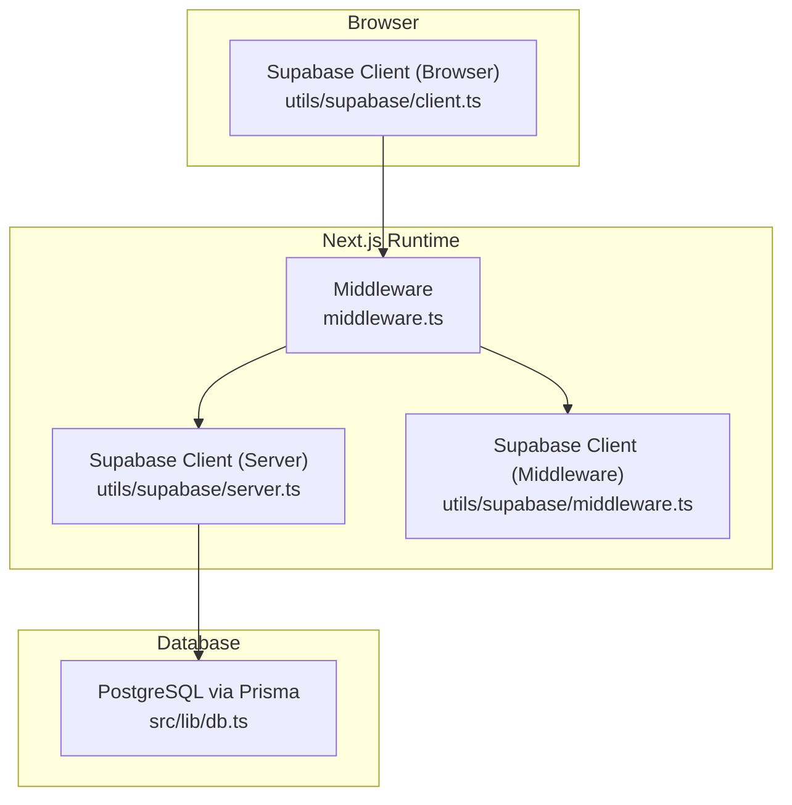
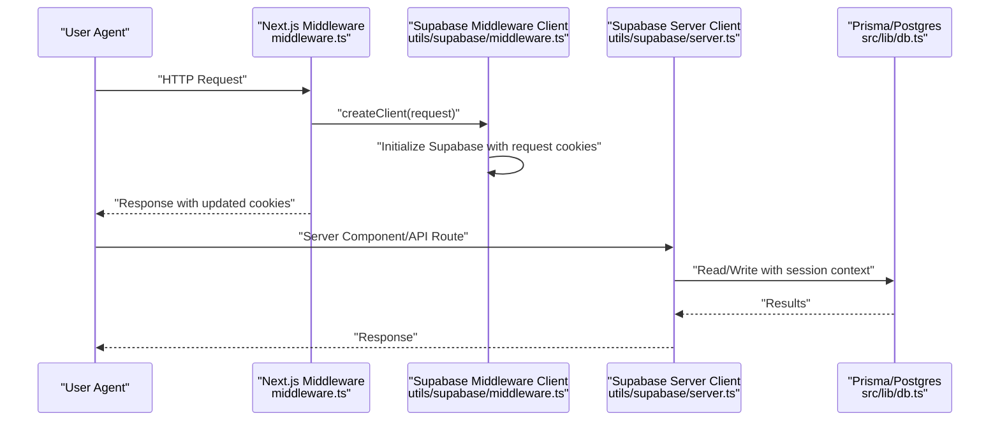
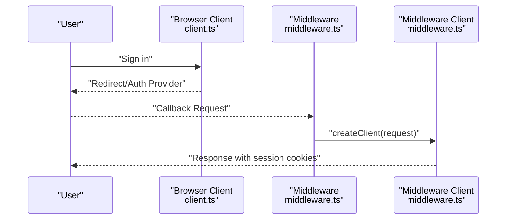
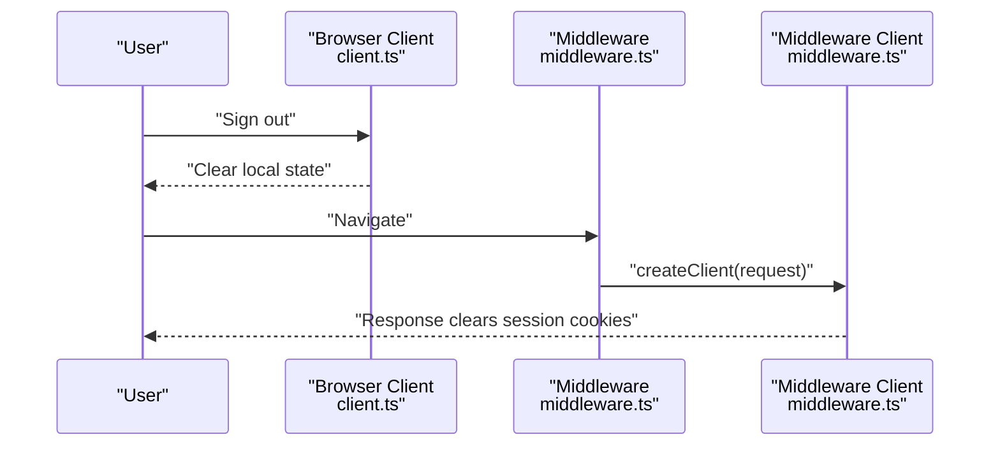
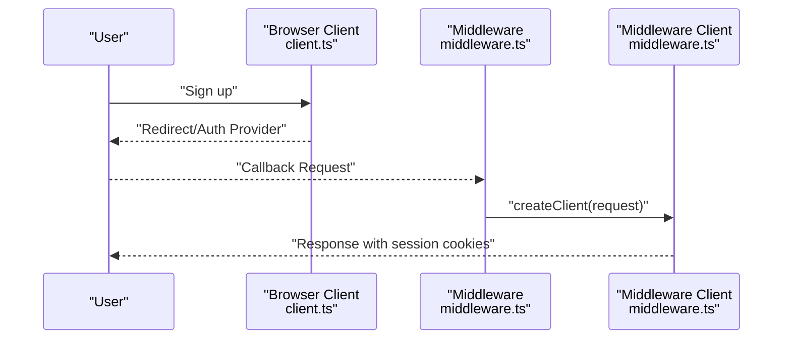
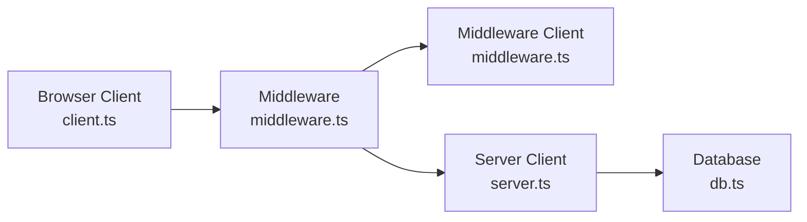

# Authentication & Authorization

<cite>
**Referenced Files in This Document**
- [client.ts](file://src/utils/supabase/client.ts)
- [server.ts](file://src/utils/supabase/server.ts)
- [middleware.ts](file://src/utils/supabase/middleware.ts)
- [middleware.ts](file://middleware.ts)
- [db.ts](file://src/lib/db.ts)
- [route.ts](file://src/app/api/decks/[id]/route.ts)
- [route.ts](file://src/app/api/decks/[id]/cards/route.ts)
- [route.ts](file://src/app/api/review/route.ts)
</cite>

## Table of Contents
1. [Introduction](#introduction)
2. [Project Structure](#project-structure)
3. [Core Components](#core-components)
4. [Architecture Overview](#architecture-overview)
5. [Detailed Component Analysis](#detailed-component-analysis)
6. [Dependency Analysis](#dependency-analysis)
7. [Performance Considerations](#performance-considerations)
8. [Troubleshooting Guide](#troubleshooting-guide)
9. [Conclusion](#conclusion)

## Introduction
This document explains recall’s authentication and authorization system built on Supabase Auth and Next.js middleware. It covers how Supabase is integrated for client and server-side authentication, how user sessions are managed, and how protected routes are enforced. It also documents the authentication middleware, server-side utilities, client-side helpers, and patterns for protected components. Finally, it outlines role-based access control patterns, permission management, and security considerations, including token handling and session persistence.

## Project Structure
The authentication stack is organized around three layers:
- Client-side Supabase client for browser interactions
- Server-side Supabase client for SSR and API routes
- Next.js middleware that initializes Supabase session handling on every request

**Diagram sources**
- [middleware.ts:1-22](file://middleware.ts#L1-L22)
- [server.ts:1-29](file://src/utils/supabase/server.ts#L1-L29)
- [middleware.ts:1-38](file://src/utils/supabase/middleware.ts#L1-L38)
- [client.ts:1-11](file://src/utils/supabase/client.ts#L1-L11)
- [db.ts:1-68](file://src/lib/db.ts#L1-L68)

**Section sources**
- [middleware.ts:1-22](file://middleware.ts#L1-L22)
- [server.ts:1-29](file://src/utils/supabase/server.ts#L1-L29)
- [middleware.ts:1-38](file://src/utils/supabase/middleware.ts#L1-L38)
- [client.ts:1-11](file://src/utils/supabase/client.ts#L1-L11)
- [db.ts:1-68](file://src/lib/db.ts#L1-L68)

## Core Components
- Supabase Browser Client: Provides a typed client for browser-based authentication operations such as sign-in, sign-out, and session retrieval.
- Supabase Server Client: Manages server-side session state and persists auth cookies across requests in Server Components and API routes.
- Supabase Middleware Client: Initializes Supabase on every incoming request, synchronizing cookies and ensuring session availability for protected routes.
- Next.js Middleware: Applies the Supabase middleware to non-static/public paths, enforcing session presence for protected areas.
- Database Layer: Uses Prisma with a Postgres datasource configured for secure connections and pooling-friendly URLs.

Key responsibilities:
- Session synchronization and persistence via cookies
- Transparent auth state propagation across server and client boundaries
- Protected routing enforcement at the framework level

**Section sources**
- [client.ts:1-11](file://src/utils/supabase/client.ts#L1-L11)
- [server.ts:1-29](file://src/utils/supabase/server.ts#L1-L29)
- [middleware.ts:1-38](file://src/utils/supabase/middleware.ts#L1-L38)
- [middleware.ts:1-22](file://middleware.ts#L1-L22)
- [db.ts:1-68](file://src/lib/db.ts#L1-L68)

## Architecture Overview
The system ensures that every incoming request initializes a Supabase client bound to the current cookie store. This guarantees that:
- Auth state is available in server-side code
- Cookies are synchronized across responses
- Protected routes can rely on consistent session data

**Diagram sources**
- [middleware.ts:1-22](file://middleware.ts#L1-L22)
- [middleware.ts:1-38](file://src/utils/supabase/middleware.ts#L1-L38)
- [server.ts:1-29](file://src/utils/supabase/server.ts#L1-L29)
- [db.ts:1-68](file://src/lib/db.ts#L1-L68)

## Detailed Component Analysis

### Supabase Browser Client
Purpose:
- Provide a client for browser-based authentication operations
- Access current session and listen to auth state changes

Implementation highlights:
- Reads public Supabase configuration from environment variables
- Exposes a factory to create a browser client instance

Usage patterns:
- Wrap app shell or pages that require auth-aware behavior
- Use for sign-in/sign-out flows and session checks

**Section sources**
- [client.ts:1-11](file://src/utils/supabase/client.ts#L1-L11)

### Supabase Server Client
Purpose:
- Manage Supabase session state in server contexts
- Synchronize cookies across server-rendered pages and API routes

Implementation highlights:
- Accepts a cookie store from Next.js headers
- Implements cookie getters/setters to persist auth state
- Handles exceptions when setting cookies from server components

Usage patterns:
- Use in Server Components and API routes to access session data
- Combine with database queries to enforce row-level security

**Section sources**
- [server.ts:1-29](file://src/utils/supabase/server.ts#L1-L29)

### Supabase Middleware Client
Purpose:
- Initialize Supabase on every request
- Synchronize cookies between request and response

Implementation highlights:
- Creates an unmodified response and augments it with Supabase cookie handling
- Reads and writes cookies from the request and response objects
- Returns the augmented response to propagate cookie updates

Usage patterns:
- Apply to all non-static/public routes via Next.js middleware

**Section sources**
- [middleware.ts:1-38](file://src/utils/supabase/middleware.ts#L1-L38)

### Next.js Middleware
Purpose:
- Enforce session availability for protected routes
- Apply Supabase initialization to eligible paths

Implementation highlights:
- Matcher excludes static assets, images, favicon, and public folder
- Delegates to the Supabase middleware client to manage cookies

Usage patterns:
- Extend matcher to include additional protected paths
- Add redirect logic to enforce authentication when needed

**Section sources**
- [middleware.ts:1-22](file://middleware.ts#L1-L22)

### Protected Routes and API Endpoints
Protected route patterns:
- Middleware applies session initialization to all non-excluded paths
- Server-side logic can check session and enforce access controls
- API routes operate under the same session context

Examples of server-side usage:
- Update deck metadata with validated session context
- Create cards with session-bound ownership
- Process reviews with atomic transaction and session-aware logging

Note: The referenced API route files demonstrate server-side Prisma usage and request handling. They do not explicitly check session state in the shown code; however, the middleware ensures session availability for all matched routes.

**Section sources**
- [route.ts:1-43](file://src/app/api/decks/[id]/route.ts#L1-L43)
- [route.ts:1-40](file://src/app/api/decks/[id]/cards/route.ts#L1-L40)
- [route.ts:1-76](file://src/app/api/review/route.ts#L1-L76)

### Authentication Flows

#### Login Flow

**Diagram sources**
- [client.ts:1-11](file://src/utils/supabase/client.ts#L1-L11)
- [middleware.ts:1-22](file://middleware.ts#L1-L22)
- [middleware.ts:1-38](file://src/utils/supabase/middleware.ts#L1-L38)

#### Logout Flow

**Diagram sources**
- [client.ts:1-11](file://src/utils/supabase/client.ts#L1-L11)
- [middleware.ts:1-22](file://middleware.ts#L1-L22)
- [middleware.ts:1-38](file://src/utils/supabase/middleware.ts#L1-L38)

#### Registration Flow

**Diagram sources**
- [client.ts:1-11](file://src/utils/supabase/client.ts#L1-L11)
- [middleware.ts:1-22](file://middleware.ts#L1-L22)
- [middleware.ts:1-38](file://src/utils/supabase/middleware.ts#L1-L38)

### Session Persistence and Token Handling
- Cookies are synchronized on every request and response
- Supabase manages refresh tokens transparently during server operations
- Environment variables provide Supabase configuration for both browser and server

Security considerations:
- Ensure HTTPS in production to protect cookies
- Rely on Supabase’s cookie management; avoid manual token manipulation
- Use middleware to centralize session initialization

**Section sources**
- [middleware.ts:1-38](file://src/utils/supabase/middleware.ts#L1-L38)
- [server.ts:1-29](file://src/utils/supabase/server.ts#L1-L29)
- [client.ts:1-11](file://src/utils/supabase/client.ts#L1-L11)

### Role-Based Access Control and Permissions
Current codebase does not define roles or permissions. Recommended patterns:
- Define roles in the database (e.g., user, admin) and attach them to the session
- Enforce RBAC in server-side code before performing privileged operations
- Use database row-level security (RLS) policies to restrict data visibility and mutations

Integration points:
- Middleware and server clients can access session data to derive roles
- API routes should validate roles before executing sensitive operations

[No sources needed since this section provides general guidance]

### Auth-Aware Component Patterns
- Wrap pages/components that require authentication with a session check
- Use the browser client to detect signed-in state and redirect unauthenticated users
- For server-rendered pages, rely on middleware-initialized session context

[No sources needed since this section provides general guidance]

## Dependency Analysis
The authentication system depends on:
- Supabase SDK for SSR and browser
- Next.js middleware and headers for cookie management
- Prisma/Postgres for data operations

**Diagram sources**
- [client.ts:1-11](file://src/utils/supabase/client.ts#L1-L11)
- [middleware.ts:1-22](file://middleware.ts#L1-L22)
- [middleware.ts:1-38](file://src/utils/supabase/middleware.ts#L1-L38)
- [server.ts:1-29](file://src/utils/supabase/server.ts#L1-L29)
- [db.ts:1-68](file://src/lib/db.ts#L1-L68)

**Section sources**
- [client.ts:1-11](file://src/utils/supabase/client.ts#L1-L11)
- [middleware.ts:1-22](file://middleware.ts#L1-L22)
- [middleware.ts:1-38](file://src/utils/supabase/middleware.ts#L1-L38)
- [server.ts:1-29](file://src/utils/supabase/server.ts#L1-L29)
- [db.ts:1-68](file://src/lib/db.ts#L1-L68)

## Performance Considerations
- Prefer server components for heavy computations to reduce client payload
- Use middleware to centralize session initialization and avoid redundant client calls
- Ensure database URLs include sslmode=require in serverless environments to minimize connection overhead

[No sources needed since this section provides general guidance]

## Troubleshooting Guide
Common issues and resolutions:
- Cookies not persisting: Verify middleware matcher and that cookies are being set on the response
- Session not available in server components: Confirm the server client is used and cookies are readable
- Database connectivity errors: Ensure the Prisma URL includes sslmode=require and matches the environment

**Section sources**
- [middleware.ts:1-38](file://src/utils/supabase/middleware.ts#L1-L38)
- [server.ts:1-29](file://src/utils/supabase/server.ts#L1-L29)
- [db.ts:1-68](file://src/lib/db.ts#L1-L68)

## Conclusion
Recall’s authentication and authorization system leverages Supabase Auth integrated with Next.js middleware and server-side clients. The middleware ensures consistent session initialization across requests, while the server client enables secure database operations with session context. Protected routes are enforced by the middleware’s path matching. To implement role-based access control, extend server-side logic to validate roles and complement with database row-level security policies. Follow the provided patterns for client and server interactions to maintain secure and reliable authentication state management.