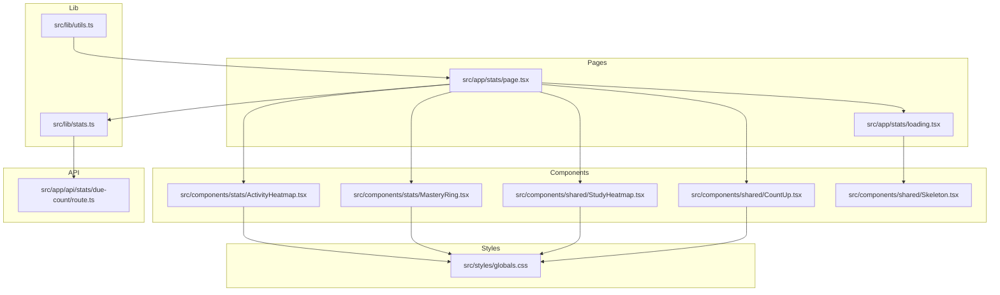
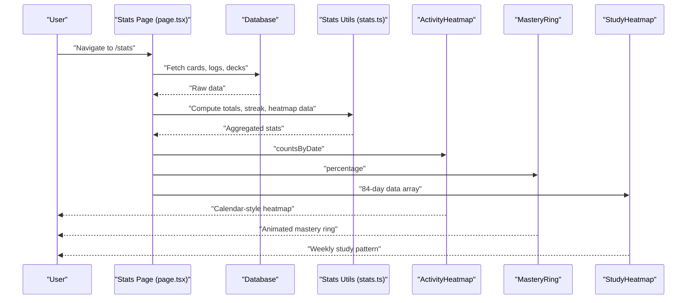
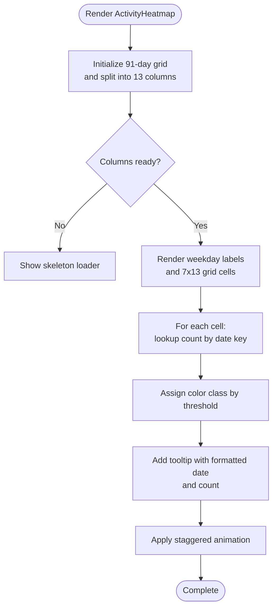
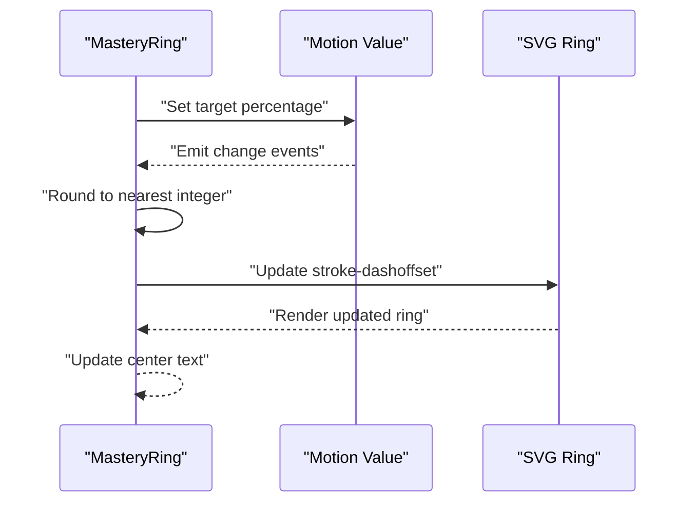
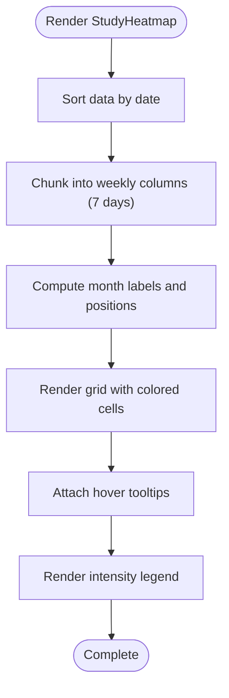
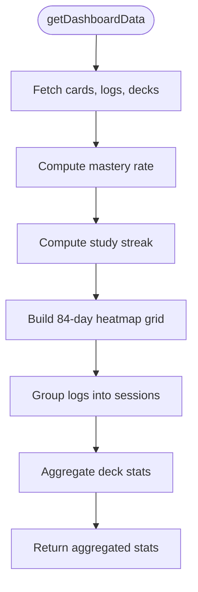
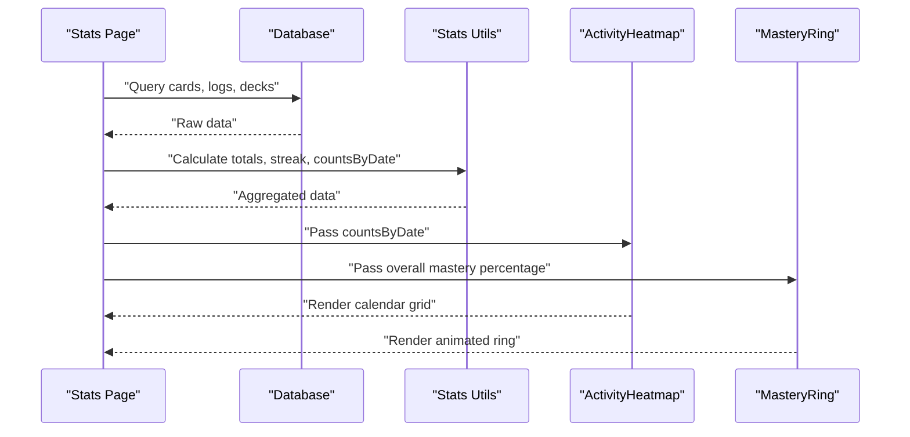
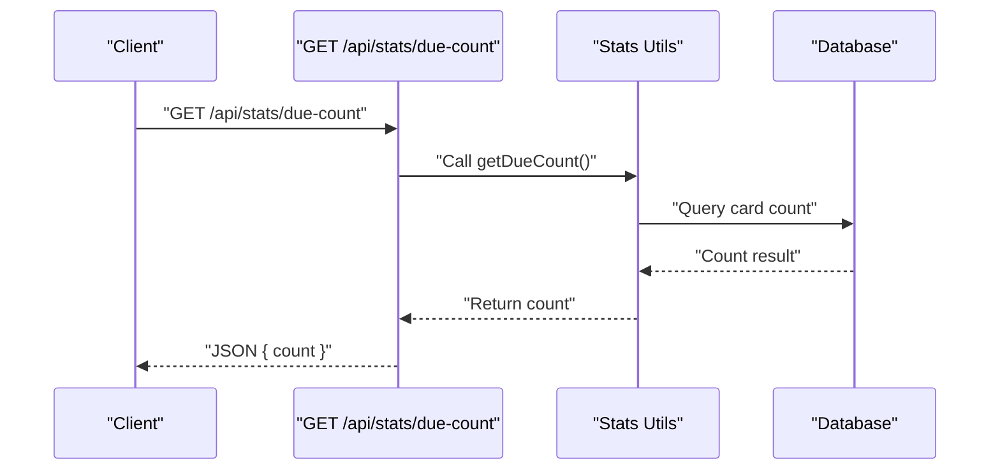
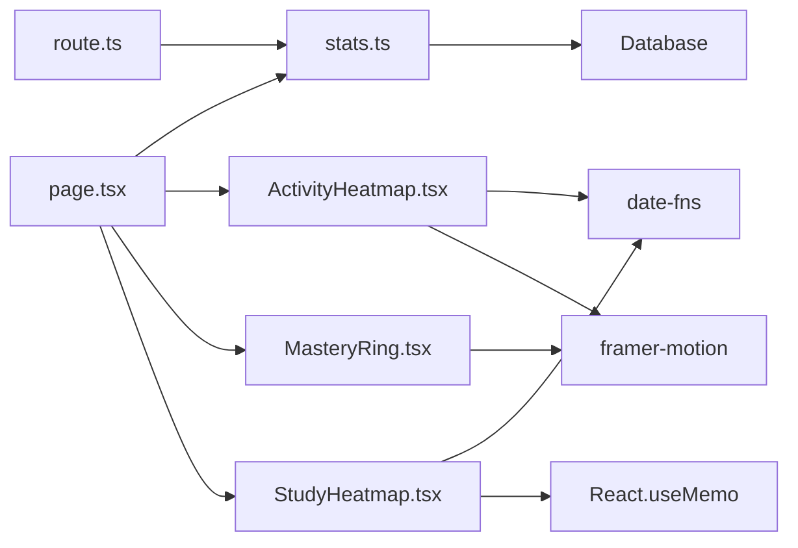

# Analytics Components

<cite>
**Referenced Files in This Document**
- [ActivityHeatmap.tsx](file://src/components/stats/ActivityHeatmap.tsx)
- [MasteryRing.tsx](file://src/components/stats/MasteryRing.tsx)
- [StudyHeatmap.tsx](file://src/components/shared/StudyHeatmap.tsx)
- [stats.ts](file://src/lib/stats.ts)
- [page.tsx](file://src/app/stats/page.tsx)
- [route.ts](file://src/app/api/stats/due-count/route.ts)
- [CountUp.tsx](file://src/components/shared/CountUp.tsx)
- [loading.tsx](file://src/app/stats/loading.tsx)
- [Skeleton.tsx](file://src/components/shared/Skeleton.tsx)
- [globals.css](file://src/styles/globals.css)
- [utils.ts](file://src/lib/utils.ts)
</cite>

## Update Summary
**Changes Made**
- Updated Performance Considerations section to include specific React.memo and useMemo usage patterns
- Enhanced StudyHeatmap optimization details with useMemo implementation specifics
- Refined ActivityHeatmap animation optimization details
- Added detailed memoization patterns and performance optimization strategies

## Table of Contents
1. [Introduction](#introduction)
2. [Project Structure](#project-structure)
3. [Core Components](#core-components)
4. [Architecture Overview](#architecture-overview)
5. [Detailed Component Analysis](#detailed-component-analysis)
6. [Dependency Analysis](#dependency-analysis)
7. [Performance Considerations](#performance-considerations)
8. [Troubleshooting Guide](#troubleshooting-guide)
9. [Conclusion](#conclusion)
10. [Appendices](#appendices)

## Introduction
This document explains the analytics and visualization components that display learning progress and statistics. It covers three key visualizations:
- ActivityHeatmap: Calendar-style visualization of review activity over the last 90 days with date range selection and color-coded intensity.
- MasteryRing: Circular progress indicator showing mastery percentages with animated transitions.
- StudyHeatmap: Study pattern visualization over 84 days (12 weeks), including streak tracking and habit formation metrics.

It also documents data formatting, responsive design adaptations, interactive features, integration with the statistics API, data fetching patterns, real-time update considerations, customization options, theming support, and accessibility considerations.

## Project Structure
The analytics components are organized under dedicated folders:
- Visualization components: src/components/stats and src/components/shared
- Data utilities and calculations: src/lib/stats.ts
- Page rendering and data fetching: src/app/stats/page.tsx
- API endpoints: src/app/api/stats/due-count/route.ts
- Supporting UI utilities: src/components/shared/CountUp.tsx, src/app/stats/loading.tsx, src/components/shared/Skeleton.tsx
- Theming and styles: src/styles/globals.css
- General utilities: src/lib/utils.ts

**Diagram sources**
- [page.tsx:14-187](file://src/app/stats/page.tsx#L14-L187)
- [ActivityHeatmap.tsx:22-74](file://src/components/stats/ActivityHeatmap.tsx#L22-L74)
- [MasteryRing.tsx:15-63](file://src/components/stats/MasteryRing.tsx#L15-L63)
- [StudyHeatmap.tsx:15-136](file://src/components/shared/StudyHeatmap.tsx#L15-L136)
- [stats.ts:51-222](file://src/lib/stats.ts#L51-L222)
- [route.ts:7-14](file://src/app/api/stats/due-count/route.ts#L7-L14)
- [CountUp.tsx:12-31](file://src/components/shared/CountUp.tsx#L12-L31)
- [loading.tsx:3-36](file://src/app/stats/loading.tsx#L3-L36)
- [globals.css:60-82](file://src/styles/globals.css#L60-L82)

**Section sources**
- [page.tsx:14-187](file://src/app/stats/page.tsx#L14-L187)
- [ActivityHeatmap.tsx:22-74](file://src/components/stats/ActivityHeatmap.tsx#L22-L74)
- [MasteryRing.tsx:15-63](file://src/components/stats/MasteryRing.tsx#L15-L63)
- [StudyHeatmap.tsx:15-136](file://src/components/shared/StudyHeatmap.tsx#L15-L136)
- [stats.ts:51-222](file://src/lib/stats.ts#L51-L222)
- [route.ts:7-14](file://src/app/api/stats/due-count/route.ts#L7-L14)
- [CountUp.tsx:12-31](file://src/components/shared/CountUp.tsx#L12-L31)
- [loading.tsx:3-36](file://src/app/stats/loading.tsx#L3-L36)
- [globals.css:60-82](file://src/styles/globals.css#L60-L82)

## Core Components
This section summarizes the primary analytics components and their responsibilities.

- ActivityHeatmap
  - Renders a 90-day calendar-style grid with weekly columns and weekday markers.
  - Uses color intensity to represent daily review counts.
  - Provides tooltips with formatted dates and counts.
  - Implements staggered animations for visual appeal.

- MasteryRing
  - Displays a circular progress ring with animated percentage transitions.
  - Calculates stroke dasharray and dashoffset to reflect progress.
  - Shows percentage text centered within the ring.

- StudyHeatmap
  - Visualizes study activity over 84 days (12 weeks) in a 7 rows × 12 columns grid.
  - Includes month labels and a legend indicating activity intensity.
  - Offers hover tooltips with detailed counts and dates.
  - Ensures data is sorted chronologically and grouped into weekly columns.

- Supporting Utilities
  - CountUp: Animated numeric counters for statistics display.
  - Loading skeleton: Skeleton-based loading states for improved perceived performance.
  - Theming: Tailwind-based dark theme with glass-like cards and shimmer effects.

**Section sources**
- [ActivityHeatmap.tsx:7-20](file://src/components/stats/ActivityHeatmap.tsx#L7-L20)
- [ActivityHeatmap.tsx:22-74](file://src/components/stats/ActivityHeatmap.tsx#L22-L74)
- [MasteryRing.tsx:6-14](file://src/components/stats/MasteryRing.tsx#L6-L14)
- [MasteryRing.tsx:15-63](file://src/components/stats/MasteryRing.tsx#L15-L63)
- [StudyHeatmap.tsx:6-13](file://src/components/shared/StudyHeatmap.tsx#L6-L13)
- [StudyHeatmap.tsx:15-136](file://src/components/shared/StudyHeatmap.tsx#L15-L136)
- [CountUp.tsx:6-10](file://src/components/shared/CountUp.tsx#L6-L10)
- [CountUp.tsx:12-31](file://src/components/shared/CountUp.tsx#L12-L31)
- [loading.tsx:3-36](file://src/app/stats/loading.tsx#L3-L36)
- [globals.css:60-82](file://src/styles/globals.css#L60-L82)

## Architecture Overview
The analytics page orchestrates data fetching and visualization:
- The stats page performs database queries to compute totals, streaks, and per-day counts.
- It passes data to visualization components:
  - ActivityHeatmap receives daily counts keyed by date.
  - MasteryRing receives a percentage value.
  - StudyHeatmap receives structured 84-day arrays with date and count pairs.
- An API endpoint exposes a simple due count for external integrations.

**Diagram sources**
- [page.tsx:14-96](file://src/app/stats/page.tsx#L14-L96)
- [stats.ts:51-222](file://src/lib/stats.ts#L51-L222)
- [ActivityHeatmap.tsx:22-74](file://src/components/stats/ActivityHeatmap.tsx#L22-L74)
- [MasteryRing.tsx:15-63](file://src/components/stats/MasteryRing.tsx#L15-L63)
- [StudyHeatmap.tsx:15-136](file://src/components/shared/StudyHeatmap.tsx#L15-L136)

## Detailed Component Analysis

### ActivityHeatmap Component
- Purpose: Calendar-style visualization of review activity over the last 90 days.
- Data Input: countsByDate (Record<string, number>) representing yyyy-MM-dd keys and daily counts.
- Rendering:
  - Generates 13 columns (91 days) and 7 rows (weekdays).
  - Labels every other weekday row with abbreviated labels.
  - Applies color intensity classes based on value thresholds.
  - Adds tooltips with formatted dates and pluralized counts.
  - Uses staggered animations for smooth reveal.
- Responsiveness:
  - Horizontal scrolling container accommodates the 90-day span.
  - Minimal vertical footprint with compact squares.
- Accessibility:
  - Tooltips provide readable text labels for each cell.
  - Color contrast maintained against dark backgrounds.
- Customization:
  - Intensity thresholds and color classes can be adjusted.
  - Labels and weekday markers can be localized or redefined.

**Diagram sources**
- [ActivityHeatmap.tsx:22-74](file://src/components/stats/ActivityHeatmap.tsx#L22-L74)

**Section sources**
- [ActivityHeatmap.tsx:7-20](file://src/components/stats/ActivityHeatmap.tsx#L7-L20)
- [ActivityHeatmap.tsx:22-74](file://src/components/stats/ActivityHeatmap.tsx#L22-L74)

### MasteryRing Component
- Purpose: Circular progress ring displaying mastery percentage with smooth animation.
- Data Input: percentage (number) from 0 to 100.
- Rendering:
  - SVG circle with stroke-dasharray and stroke-dashoffset to show progress.
  - Centered percentage text updates via motion value events.
  - Animated transitions from previous value to current value.
- Customization:
  - Size, stroke width, and radius are configurable constants.
  - Colors and typography can be adapted via CSS classes.
- Accessibility:
  - Percentage text is visible and centered.
  - No dynamic aria-labels are present; consider adding aria-valuetext for screen readers.

**Diagram sources**
- [MasteryRing.tsx:15-63](file://src/components/stats/MasteryRing.tsx#L15-L63)

**Section sources**
- [MasteryRing.tsx:6-14](file://src/components/stats/MasteryRing.tsx#L6-L14)
- [MasteryRing.tsx:15-63](file://src/components/stats/MasteryRing.tsx#L15-L63)

### StudyHeatmap Component
- Purpose: Weekly study pattern visualization over 84 days (12 weeks) with habit metrics.
- Data Input: data (HeatmapData[]) with date (yyyy-MM-dd) and count fields.
- Rendering:
  - Sorts data chronologically and groups into weekly columns.
  - Computes month labels and positions them above the grid.
  - Applies color classes based on count thresholds with optional glow.
  - Hover tooltips display card counts and formatted dates.
  - Includes a legend indicating intensity levels.
- Responsiveness:
  - Horizontal scroll container supports long-term views.
  - Month labels positioned absolutely to avoid layout shifts.
- Accessibility:
  - Hover-triggered tooltips provide contextual information.
  - Consider adding keyboard navigation and focus indicators for enhanced accessibility.

**Diagram sources**
- [StudyHeatmap.tsx:15-136](file://src/components/shared/StudyHeatmap.tsx#L15-L136)

**Section sources**
- [StudyHeatmap.tsx:6-13](file://src/components/shared/StudyHeatmap.tsx#L6-L13)
- [StudyHeatmap.tsx:15-136](file://src/components/shared/StudyHeatmap.tsx#L15-L136)

### Data Formatting and Calculation Utilities
- Streak calculation:
  - Converts timestamps to UTC start-of-day keys and iterates backward to compute consecutive active days.
- Dashboard aggregation:
  - Computes mastery rate, study streak, and 84-day heatmap data.
  - Groups review logs into sessions with boundaries based on time gaps and deck changes.
  - Builds deck breakdowns with counts per status and due counts.
- Date utilities:
  - Provides helpers for formatting and relative time display.

**Diagram sources**
- [stats.ts:51-222](file://src/lib/stats.ts#L51-L222)

**Section sources**
- [stats.ts:6-18](file://src/lib/stats.ts#L6-L18)
- [stats.ts:51-222](file://src/lib/stats.ts#L51-L222)
- [utils.ts:9-19](file://src/lib/utils.ts#L9-L19)

### Page Integration and Data Fetching Patterns
- The stats page performs database queries to gather cards, logs, and decks.
- It computes:
  - Overall mastery percentage.
  - Current streak.
  - Daily counts keyed by date for ActivityHeatmap.
  - Upcoming review counts across time windows.
- It renders:
  - MasteryRing with overall mastery.
  - ActivityHeatmap with daily counts.
  - Deck breakdown bars and upcoming reviews.
- Loading state:
  - Uses skeleton-based loading UI for perceived performance.

**Diagram sources**
- [page.tsx:14-96](file://src/app/stats/page.tsx#L14-L96)
- [stats.ts:51-222](file://src/lib/stats.ts#L51-L222)

**Section sources**
- [page.tsx:14-96](file://src/app/stats/page.tsx#L14-L96)
- [loading.tsx:3-36](file://src/app/stats/loading.tsx#L3-L36)

### API Integration and Real-Time Updates
- Due count API:
  - Exposes a GET endpoint returning a simple JSON payload with the current due count.
  - Forces dynamic rendering to ensure fresh data on each request.
- Real-time considerations:
  - Current page renders at request time; consider client-side polling or server-sent events for live updates.
  - The due count endpoint can be consumed by external clients for dashboards or notifications.

**Diagram sources**
- [route.ts:7-14](file://src/app/api/stats/due-count/route.ts#L7-L14)
- [stats.ts:20-31](file://src/lib/stats.ts#L20-L31)

**Section sources**
- [route.ts:7-14](file://src/app/api/stats/due-count/route.ts#L7-L14)
- [stats.ts:20-31](file://src/lib/stats.ts#L20-L31)

## Dependency Analysis
- Component dependencies:
  - ActivityHeatmap depends on date formatting and animation libraries.
  - MasteryRing depends on motion values and SVG rendering.
  - StudyHeatmap depends on date formatting and memoization for performance.
- Data dependencies:
  - Stats utilities encapsulate database queries and computations.
  - Page composes data from multiple sources and passes to components.
- External libraries:
  - date-fns for date manipulation and formatting.
  - framer-motion for animations and motion values.
  - Tailwind CSS for styling and theming.

**Diagram sources**
- [ActivityHeatmap.tsx:3-6](file://src/components/stats/ActivityHeatmap.tsx#L3-L6)
- [MasteryRing.tsx:3-4](file://src/components/stats/MasteryRing.tsx#L3-L4)
- [StudyHeatmap.tsx:3-4](file://src/components/shared/StudyHeatmap.tsx#L3-L4)
- [page.tsx:14-96](file://src/app/stats/page.tsx#L14-L96)
- [stats.ts:51-222](file://src/lib/stats.ts#L51-L222)
- [route.ts:7-14](file://src/app/api/stats/due-count/route.ts#L7-L14)

**Section sources**
- [ActivityHeatmap.tsx:3-6](file://src/components/stats/ActivityHeatmap.tsx#L3-L6)
- [MasteryRing.tsx:3-4](file://src/components/stats/MasteryRing.tsx#L3-L4)
- [StudyHeatmap.tsx:3-4](file://src/components/shared/StudyHeatmap.tsx#L3-L4)
- [page.tsx:14-96](file://src/app/stats/page.tsx#L14-L96)
- [stats.ts:51-222](file://src/lib/stats.ts#L51-L222)
- [route.ts:7-14](file://src/app/api/stats/due-count/route.ts#L7-L14)

## Performance Considerations
**Updated** Enhanced with specific React.memo and useMemo usage patterns for optimization.

- Memoization Strategies:
  - **StudyHeatmap useMemo Optimization**: The component implements strategic memoization patterns:
    - `sortedData`: Uses `useMemo` to sort incoming data chronologically, preventing unnecessary recomputations when data prop remains stable
    - `columns`: Memoizes the transformation of flat arrays into weekly column structures, avoiding repeated chunking operations
    - `monthLabels`: Computes and caches month label positions, eliminating redundant date formatting and positioning calculations
  - **ActivityHeatmap Animation Optimization**: Implements staggered animation delays (`colIndex * 0.03 + rowIndex * 0.01`) to balance visual appeal with performance
  - **Component-Level Memoization**: Consider wrapping components with `React.memo` for stable props to prevent unnecessary re-renders

- Animation Costs:
  - ActivityHeatmap applies staggered animations; keep the number of animated elements reasonable.
  - MasteryRing animates percentage changes; consider throttling updates if data updates frequently.

- Rendering Scope:
  - ActivityHeatmap and StudyHeatmap use horizontal scrolling containers to avoid layout thrashing.

- Data Volume:
  - 90-day and 84-day grids are small enough to render efficiently; avoid rendering larger ranges without pagination or virtualization.

- Loading States:
  - Skeleton-based loading improves perceived performance during data fetches.

**Section sources**
- [StudyHeatmap.tsx:24-60](file://src/components/shared/StudyHeatmap.tsx#L24-L60)
- [ActivityHeatmap.tsx:58-62](file://src/components/stats/ActivityHeatmap.tsx#L58-L62)

## Troubleshooting Guide
- Empty or missing data:
  - ActivityHeatmap shows a skeleton when columns are uninitialized; ensure countsByDate is populated before rendering.
  - StudyHeatmap requires sorted and chunked data; verify the input array contains 84 entries and is properly ordered.
- Incorrect percentages:
  - MasteryRing percentage must be within 0–100; clamp values before passing to the component.
- Tooltip visibility:
  - StudyHeatmap tooltips rely on hover; ensure parent containers do not clip or hide the tooltip elements.
- API errors:
  - The due count endpoint returns a fallback count on failure; inspect network requests and server logs for failures.
- Accessibility:
  - Consider adding aria-labels and roles for screen readers, especially for interactive elements like tooltips and rings.

**Section sources**
- [ActivityHeatmap.tsx:32-38](file://src/components/stats/ActivityHeatmap.tsx#L32-L38)
- [StudyHeatmap.tsx:62-68](file://src/components/shared/StudyHeatmap.tsx#L62-L68)
- [route.ts:11-13](file://src/app/api/stats/due-count/route.ts#L11-L13)

## Conclusion
The analytics components provide a cohesive suite of visualizations for learning progress:
- ActivityHeatmap offers a concise 90-day overview with color-coded intensity and tooltips.
- MasteryRing delivers a smooth, animated mastery indicator suitable for summary cards.
- StudyHeatmap presents long-term study patterns with month labels, legends, and interactive tooltips.
Data is computed centrally and passed to components, with a simple API for due counts. Theming and responsive design ensure a consistent, accessible experience across devices.

## Appendices

### Theming and Customization Options
- Dark theme:
  - Glass-like cards and shimmer effects are defined in global styles.
  - Adjust color tokens and gradients to match brand guidelines.
- Component-level theming:
  - Modify color classes for heatmaps and rings to align with your palette.
  - Adjust sizes and spacing constants in components for different layouts.
- Typography and spacing:
  - Use Tailwind utilities to scale text sizes and paddings responsively.

**Section sources**
- [globals.css:60-82](file://src/styles/globals.css#L60-L82)
- [ActivityHeatmap.tsx:14-20](file://src/components/stats/ActivityHeatmap.tsx#L14-L20)
- [StudyHeatmap.tsx:37-43](file://src/components/shared/StudyHeatmap.tsx#L37-L43)
- [MasteryRing.tsx:10-13](file://src/components/stats/MasteryRing.tsx#L10-L13)

### Accessibility Checklist
- Alt text and labels:
  - Provide meaningful aria-labels for interactive elements.
- Keyboard navigation:
  - Ensure focus states are visible and navigable via keyboard.
- Contrast and readability:
  - Maintain sufficient contrast for text and tooltips against dark backgrounds.
- Screen reader support:
  - Announce dynamic values (e.g., mastery percentage) with appropriate verbosity.