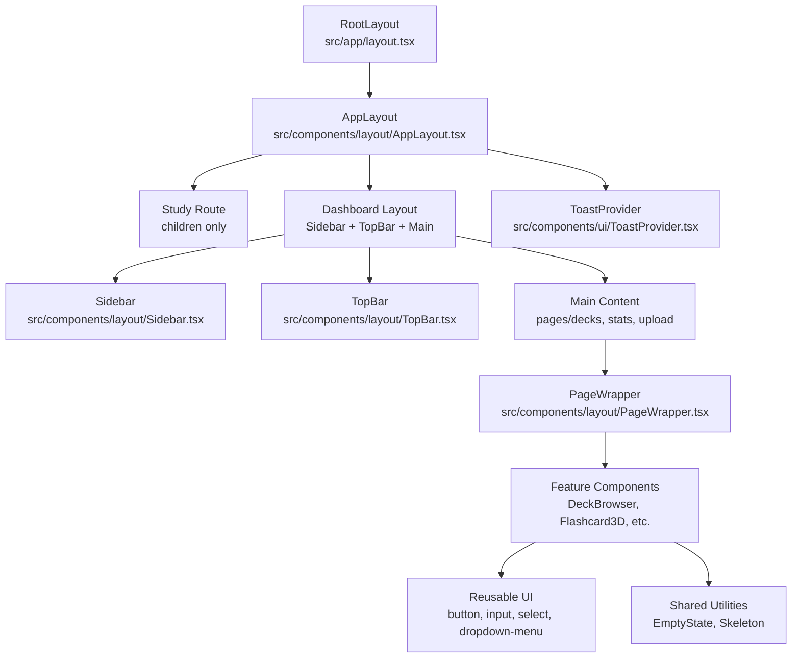
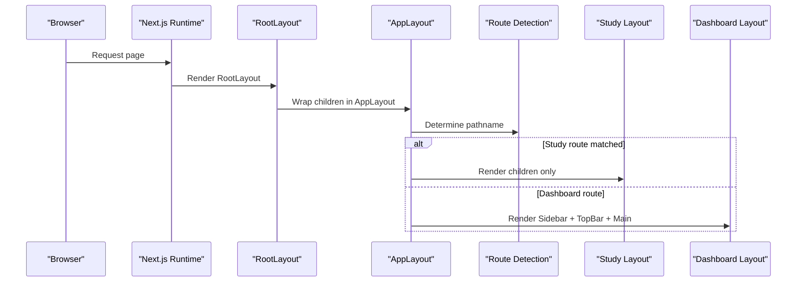
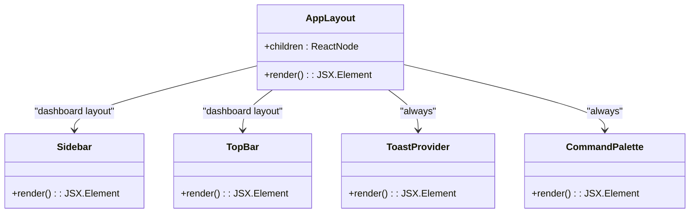
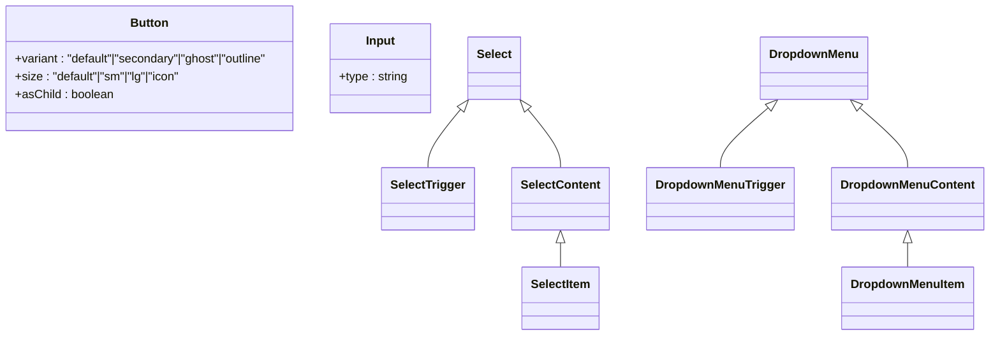
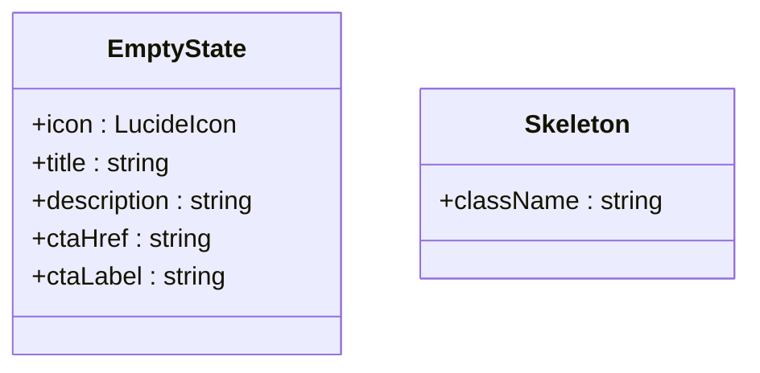
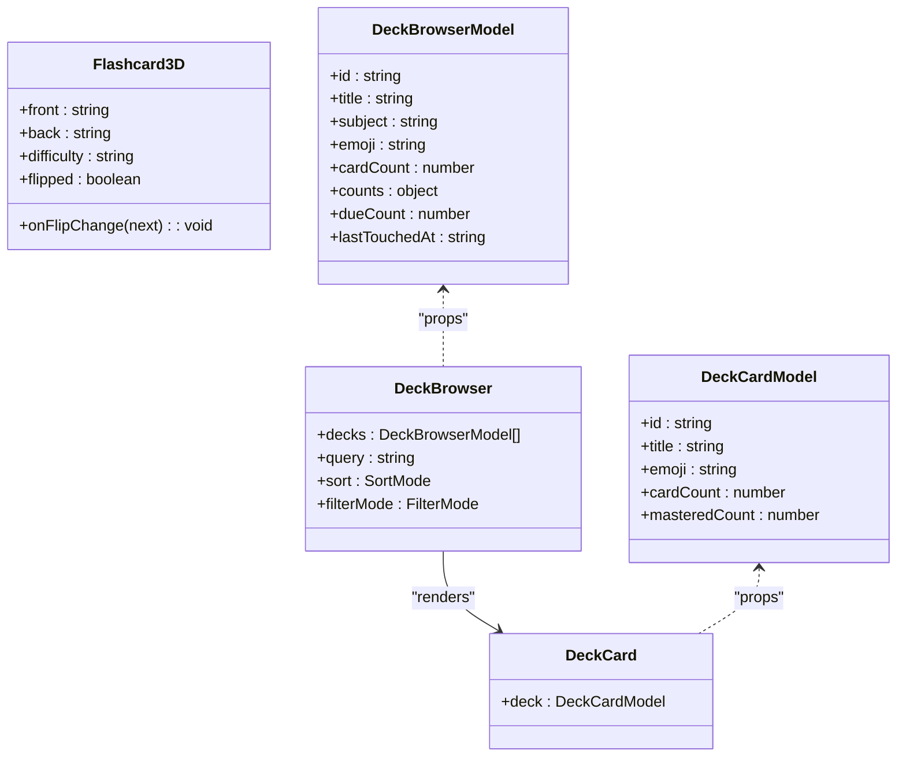
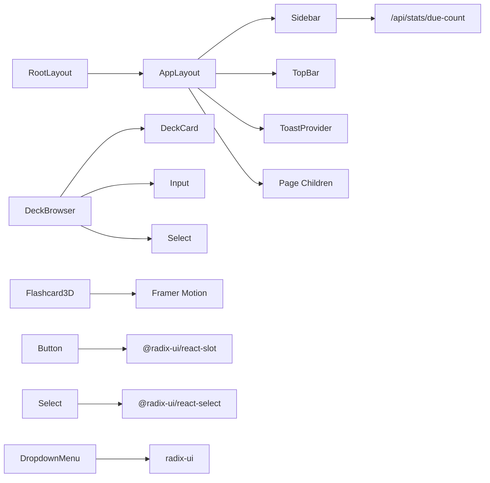

# Component Architecture

<cite>
**Referenced Files in This Document**
- [AppLayout.tsx](file://src/components/layout/AppLayout.tsx)
- [RootLayout.tsx](file://src/app/layout.tsx)
- [PageWrapper.tsx](file://src/components/layout/PageWrapper.tsx)
- [Sidebar.tsx](file://src/components/layout/Sidebar.tsx)
- [TopBar.tsx](file://src/components/layout/TopBar.tsx)
- [button.tsx](file://src/components/ui/button.tsx)
- [input.tsx](file://src/components/ui/input.tsx)
- [select.tsx](file://src/components/ui/select.tsx)
- [dropdown-menu.tsx](file://src/components/ui/dropdown-menu.tsx)
- [ToastProvider.tsx](file://src/components/ui/ToastProvider.tsx)
- [EmptyState.tsx](file://src/components/shared/EmptyState.tsx)
- [Skeleton.tsx](file://src/components/shared/Skeleton.tsx)
- [DeckBrowser.tsx](file://src/components/deck/DeckBrowser.tsx)
- [DeckCard.tsx](file://src/components/deck/DeckCard.tsx)
- [Flashcard3D.tsx](file://src/components/flashcard/Flashcard3D.tsx)
</cite>

## Table of Contents
1. [Introduction](#introduction)
2. [Project Structure](#project-structure)
3. [Core Components](#core-components)
4. [Architecture Overview](#architecture-overview)
5. [Detailed Component Analysis](#detailed-component-analysis)
6. [Dependency Analysis](#dependency-analysis)
7. [Performance Considerations](#performance-considerations)
8. [Troubleshooting Guide](#troubleshooting-guide)
9. [Conclusion](#conclusion)
10. [Appendices](#appendices)

## Introduction
This document describes recall’s component architecture with a focus on the layout hierarchy starting at AppLayout and its child components. It documents reusable UI components, shared utilities, and feature-specific components, along with composition patterns, prop interfaces, state management integration, lifecycle and event handling, inter-component communication, design system implementation using Tailwind CSS and Framer Motion, responsive design patterns, accessibility considerations, and customization options. Examples of usage and integration patterns are included to guide developers building on or extending the system.

## Project Structure
The Next.js application bootstraps the UI through a root layout that wraps all pages in AppLayout. AppLayout conditionally renders either a full-study layout or a dashboard layout with sidebar and top bar. Feature areas such as decks, stats, and uploads render within AppLayout’s main content area. Reusable UI primitives live under components/ui, shared utilities under components/shared, and feature-specific components under components/<feature>.

**Diagram sources**
- [RootLayout.tsx:39-51](file://src/app/layout.tsx#L39-L51)
- [AppLayout.tsx:15-40](file://src/components/layout/AppLayout.tsx#L15-L40)
- [Sidebar.tsx:18-97](file://src/components/layout/Sidebar.tsx#L18-L97)
- [TopBar.tsx:16-40](file://src/components/layout/TopBar.tsx#L16-L40)
- [PageWrapper.tsx:18-29](file://src/components/layout/PageWrapper.tsx#L18-L29)
- [ToastProvider.tsx:28-65](file://src/components/ui/ToastProvider.tsx#L28-L65)

**Section sources**
- [RootLayout.tsx:1-52](file://src/app/layout.tsx#L1-L52)
- [AppLayout.tsx:1-41](file://src/components/layout/AppLayout.tsx#L1-L41)

## Core Components
This section outlines the primary layout and UI components that form the backbone of the application.

- AppLayout
  - Purpose: Provides global layout scaffolding and conditional rendering for study vs. dashboard modes.
  - Props: children (ReactNode)
  - Behavior: Uses path detection to decide whether to render a minimal study layout or a full layout with sidebar and top bar. Injects global providers for toasts and command palette.
  - Lifecycle: Uses path navigation hook to compute mode; renders children inside a dark-themed container with responsive spacing.

- PageWrapper
  - Purpose: Adds page transition animations and consistent vertical spacing.
  - Props: children (ReactNode), className (optional)
  - Behavior: Wraps content with a motion div and applies a transition configuration for smooth page changes.

- Sidebar
  - Purpose: Navigation and quick stats for due cards.
  - Props: none
  - Behavior: Computes active nav item based on path, fetches due count from an API endpoint, and renders navigation links with animated indicators using layoutId and Framer Motion.

- TopBar
  - Purpose: Dynamic header with contextual title and current date.
  - Props: none
  - Behavior: Derives title from pathname and sets today’s date on mount.

- ToastProvider
  - Purpose: Global toast notifications with animated entries/exits.
  - Props: none
  - Behavior: Consumes a toast store, renders icons per toast type, and supports dismissal.

**Section sources**
- [AppLayout.tsx:11-40](file://src/components/layout/AppLayout.tsx#L11-L40)
- [PageWrapper.tsx:8-29](file://src/components/layout/PageWrapper.tsx#L8-L29)
- [Sidebar.tsx:18-97](file://src/components/layout/Sidebar.tsx#L18-L97)
- [TopBar.tsx:16-40](file://src/components/layout/TopBar.tsx#L16-L40)
- [ToastProvider.tsx:28-65](file://src/components/ui/ToastProvider.tsx#L28-L65)

## Architecture Overview
The layout architecture centers around a single-page app pattern with a root layout that injects AppLayout. AppLayout branches based on route patterns:
- Study route: Minimal layout focused on flashcard interaction.
- Dashboard route: Full layout with persistent sidebar and top bar, plus main content area.

**Diagram sources**
- [RootLayout.tsx:39-51](file://src/app/layout.tsx#L39-L51)
- [AppLayout.tsx:15-40](file://src/components/layout/AppLayout.tsx#L15-L40)

## Detailed Component Analysis

### AppLayout and Child Layout Components
AppLayout orchestrates the global layout. It conditionally switches between a study-focused layout and a dashboard layout with persistent navigation and top bar. It also renders global providers for toasts and command palette.

**Diagram sources**
- [AppLayout.tsx:6-9](file://src/components/layout/AppLayout.tsx#L6-L9)
- [Sidebar.tsx:18-97](file://src/components/layout/Sidebar.tsx#L18-L97)
- [TopBar.tsx:16-40](file://src/components/layout/TopBar.tsx#L16-L40)
- [ToastProvider.tsx:28-65](file://src/components/ui/ToastProvider.tsx#L28-L65)

**Section sources**
- [AppLayout.tsx:15-40](file://src/components/layout/AppLayout.tsx#L15-L40)

### Reusable UI Components
Reusable UI components define the design system and are composed across features.

- Button
  - Purpose: Action primitive with variants and sizes.
  - Props: variant, size, asChild, and standard button attributes.
  - Composition: Uses a variant factory and slot composition for semantic flexibility.

- Input
  - Purpose: Text input with consistent styling and focus states.
  - Props: standard input attributes.
  - Composition: Forward ref with consistent base classes.

- Select (Radix UI + Icons)
  - Purpose: Accessible dropdown selection with trigger, content, items, and scroll controls.
  - Props: standard Radix Select attributes plus custom trigger/content styling.
  - Composition: Composed primitives with portal rendering and scroll helpers.

- Dropdown Menu (Radix UI)
  - Purpose: Complex menu with items, checkboxes, radio groups, submenus, and shortcuts.
  - Props: standard Radix Dropdown attributes plus variant and inset styling.
  - Composition: Extensive composition of primitives with consistent animation classes.

**Diagram sources**
- [button.tsx:31-46](file://src/components/ui/button.tsx#L31-L46)
- [input.tsx:5-22](file://src/components/ui/input.tsx#L5-L22)
- [select.tsx:9-144](file://src/components/ui/select.tsx#L9-L144)
- [dropdown-menu.tsx:9-257](file://src/components/ui/dropdown-menu.tsx#L9-L257)

**Section sources**
- [button.tsx:1-47](file://src/components/ui/button.tsx#L1-L47)
- [input.tsx:1-23](file://src/components/ui/input.tsx#L1-L23)
- [select.tsx:1-145](file://src/components/ui/select.tsx#L1-L145)
- [dropdown-menu.tsx:1-258](file://src/components/ui/dropdown-menu.tsx#L1-L258)

### Shared Utilities
Shared components encapsulate common UI patterns.

- EmptyState
  - Purpose: Present friendly empty states with optional CTA.
  - Props: icon, title, description, ctaHref, ctaLabel.
  - Composition: Renders icon, title, description, and optional button linking to a target.

- Skeleton
  - Purpose: Provide skeleton loaders with a shimmer animation.
  - Props: className.
  - Composition: Applies a base skeleton class and animation utility.

**Diagram sources**
- [EmptyState.tsx:6-27](file://src/components/shared/EmptyState.tsx#L6-L27)
- [Skeleton.tsx:3-9](file://src/components/shared/Skeleton.tsx#L3-L9)

**Section sources**
- [EmptyState.tsx:1-28](file://src/components/shared/EmptyState.tsx#L1-L28)
- [Skeleton.tsx:1-10](file://src/components/shared/Skeleton.tsx#L1-L10)

### Feature-Specific Components
Feature components demonstrate composition patterns and state management integration.

- DeckBrowser
  - Purpose: Browse and filter decks with search, filtering chips, and sorting.
  - Props: decks (DeckBrowserModel[]).
  - State: query, debounced query, sort mode, filter mode.
  - Composition: Uses Input and Select for controls, computes filtered/sorted decks via memoization, and renders DeckGrid or an EmptyState.

- DeckCard
  - Purpose: Individual deck tile with mastery progress visualization.
  - Props: deck (DeckCardModel).
  - Composition: Uses motion for hover and progress animation; navigates to deck detail on click.

- Flashcard3D
  - Purpose: Interactive 3D flashcard with keyboard support and difficulty badges.
  - Props: front, back, difficulty, flipped (controlled), onFlipChange.
  - Composition: Handles keyboard events, animates flip transitions, and applies gradient borders.

**Diagram sources**
- [DeckBrowser.tsx:20-92](file://src/components/deck/DeckBrowser.tsx#L20-L92)
- [DeckCard.tsx:6-16](file://src/components/deck/DeckCard.tsx#L6-L16)
- [Flashcard3D.tsx:8-26](file://src/components/flashcard/Flashcard3D.tsx#L8-L26)

**Section sources**
- [DeckBrowser.tsx:1-188](file://src/components/deck/DeckBrowser.tsx#L1-L188)
- [DeckCard.tsx:1-50](file://src/components/deck/DeckCard.tsx#L1-L50)
- [Flashcard3D.tsx:1-113](file://src/components/flashcard/Flashcard3D.tsx#L1-L113)

### Component Composition Patterns
- Slot composition: Button uses a slot to wrap either a native button or a child component, enabling semantic composition.
- Primitive composition: Select and Dropdown Menu compose multiple Radix UI primitives into cohesive widgets.
- Conditional rendering: AppLayout switches layouts based on route detection; Sidebar highlights active items and fetches dynamic data.
- Controlled props: Flashcard3D exposes a controlled flip state and callback, allowing parent shells to manage state centrally.
- Memoization: DeckBrowser uses memoized computations for filtering and sorting to optimize re-renders.

**Section sources**
- [button.tsx:37-43](file://src/components/ui/button.tsx#L37-L43)
- [select.tsx:9-144](file://src/components/ui/select.tsx#L9-L144)
- [dropdown-menu.tsx:9-257](file://src/components/ui/dropdown-menu.tsx#L9-L257)
- [AppLayout.tsx:15-40](file://src/components/layout/AppLayout.tsx#L15-L40)
- [Flashcard3D.tsx:17-26](file://src/components/flashcard/Flashcard3D.tsx#L17-L26)
- [DeckBrowser.tsx:41-92](file://src/components/deck/DeckBrowser.tsx#L41-L92)

### Prop Interfaces and State Management Integration
- AppLayout: Receives children; no internal state; relies on routing for mode selection.
- Sidebar: Manages dueCount state and fetches data on mount; derives active path from pathname.
- TopBar: Manages today’s date string; computes title from pathname.
- ToastProvider: Consumes a toast store to render notifications and supports dismissal.
- DeckBrowser: Owns local state for query, sort, and filter; computes derived data via useMemo.
- Flashcard3D: Controlled component with external state via flipped and onFlipChange.

**Section sources**
- [AppLayout.tsx:11-13](file://src/components/layout/AppLayout.tsx#L11-L13)
- [Sidebar.tsx:20-39](file://src/components/layout/Sidebar.tsx#L20-L39)
- [TopBar.tsx:18-30](file://src/components/layout/TopBar.tsx#L18-L30)
- [ToastProvider.tsx:29](file://src/components/ui/ToastProvider.tsx#L29)
- [DeckBrowser.tsx:35-39](file://src/components/deck/DeckBrowser.tsx#L35-L39)
- [Flashcard3D.tsx:17-26](file://src/components/flashcard/Flashcard3D.tsx#L17-L26)

### Component Lifecycle, Event Handling, and Inter-Component Communication
- Lifecycle: AppLayout mounts once per navigation; Sidebar fetches due count on mount and path changes; TopBar initializes date on mount; DeckBrowser manages local state and recomputes on updates.
- Event handling: Flashcard3D listens to keyboard events globally but ignores inputs/textareas; Sidebar handles navigation clicks; ToastProvider handles close button clicks.
- Inter-component communication:
  - Parent-to-child: DeckBrowser passes filtered decks to DeckGrid; DeckCard receives deck model; Flashcard3D receives controlled flip state.
  - Store-driven: ToastProvider reads from a toast store and removes toasts by id.
  - Navigation: Sidebar and TopBar drive route changes via Link/Navigation.

**Section sources**
- [AppLayout.tsx:15-40](file://src/components/layout/AppLayout.tsx#L15-L40)
- [Sidebar.tsx:22-39](file://src/components/layout/Sidebar.tsx#L22-L39)
- [TopBar.tsx:20-28](file://src/components/layout/TopBar.tsx#L20-L28)
- [DeckBrowser.tsx:94-187](file://src/components/deck/DeckBrowser.tsx#L94-L187)
- [Flashcard3D.tsx:29-40](file://src/components/flashcard/Flashcard3D.tsx#L29-L40)
- [ToastProvider.tsx:52-58](file://src/components/ui/ToastProvider.tsx#L52-L58)

### Design System Implementation (Tailwind CSS and Framer Motion)
- Tailwind CSS:
  - Consistent color tokens using zinc palette for backgrounds, borders, and text.
  - Component-specific variants for buttons and inputs.
  - Responsive utilities for mobile-first layouts (e.g., lg: prefixes).
- Framer Motion:
  - Page transitions via PageWrapper with custom easing and duration.
  - Animated indicators in Sidebar using layoutId for smooth transitions.
  - Interactive animations in DeckCard and Flashcard3D for hover and flip effects.

**Section sources**
- [PageWrapper.tsx:18-29](file://src/components/layout/PageWrapper.tsx#L18-L29)
- [Sidebar.tsx:70-76](file://src/components/layout/Sidebar.tsx#L70-L76)
- [DeckCard.tsx:23-47](file://src/components/deck/DeckCard.tsx#L23-L47)
- [Flashcard3D.tsx:61-71](file://src/components/flashcard/Flashcard3D.tsx#L61-L71)

### Responsive Design Patterns and Accessibility Compliance
- Responsive patterns:
  - Mobile-first with lg: prefixed Tailwind classes for desktop layouts.
  - Fixed positioning for sidebar and top bar with appropriate z-index stacking.
  - Flexible grids in DeckGrid and adaptive spacing in main content area.
- Accessibility:
  - Semantic HTML and proper labeling (e.g., aria-label on close button).
  - Focus-visible rings and keyboard operability (e.g., Flashcard3D keyboard handling).
  - Contrast and readable typography using zinc palette.

**Section sources**
- [AppLayout.tsx:29-39](file://src/components/layout/AppLayout.tsx#L29-L39)
- [Sidebar.tsx:49-97](file://src/components/layout/Sidebar.tsx#L49-L97)
- [ToastProvider.tsx:52-58](file://src/components/ui/ToastProvider.tsx#L52-L58)
- [Flashcard3D.tsx:29-40](file://src/components/flashcard/Flashcard3D.tsx#L29-L40)

### Component Customization Options
- Variants and sizes: Button supports multiple variants and sizes; Select and Dropdown Menu offer consistent styling hooks.
- Theming: Tailwind utilities enable easy overrides for colors, spacing, and typography.
- Animation: Framer Motion configurations are exposed via props and defaults; consumers can adjust easing and durations.
- Composition: Slot-based Button allows wrapping with Links or other components; Select/Dropdown Menu provide composable primitives.

**Section sources**
- [button.tsx:7-29](file://src/components/ui/button.tsx#L7-L29)
- [select.tsx:15-32](file://src/components/ui/select.tsx#L15-L32)
- [dropdown-menu.tsx:23-52](file://src/components/ui/dropdown-menu.tsx#L23-L52)
- [PageWrapper.tsx:13-16](file://src/components/layout/PageWrapper.tsx#L13-L16)

## Dependency Analysis
The following diagram shows key dependencies among layout, UI, and feature components.

**Diagram sources**
- [RootLayout.tsx:39-51](file://src/app/layout.tsx#L39-L51)
- [AppLayout.tsx:6-9](file://src/components/layout/AppLayout.tsx#L6-L9)
- [Sidebar.tsx:24-32](file://src/components/layout/Sidebar.tsx#L24-L32)
- [DeckBrowser.tsx:7-15](file://src/components/deck/DeckBrowser.tsx#L7-L15)
- [Flashcard3D.tsx:4](file://src/components/flashcard/Flashcard3D.tsx#L4)
- [button.tsx:2](file://src/components/ui/button.tsx#L2)
- [select.tsx:4](file://src/components/ui/select.tsx#L4)
- [dropdown-menu.tsx:5](file://src/components/ui/dropdown-menu.tsx#L5)

**Section sources**
- [RootLayout.tsx:39-51](file://src/app/layout.tsx#L39-L51)
- [AppLayout.tsx:6-9](file://src/components/layout/AppLayout.tsx#L6-L9)
- [Sidebar.tsx:24-32](file://src/components/layout/Sidebar.tsx#L24-L32)
- [DeckBrowser.tsx:7-15](file://src/components/deck/DeckBrowser.tsx#L7-L15)
- [Flashcard3D.tsx:4](file://src/components/flashcard/Flashcard3D.tsx#L4)
- [button.tsx:2](file://src/components/ui/button.tsx#L2)
- [select.tsx:4](file://src/components/ui/select.tsx#L4)
- [dropdown-menu.tsx:5](file://src/components/ui/dropdown-menu.tsx#L5)

## Performance Considerations
- Memoization: Use useMemo for expensive derived computations (e.g., DeckBrowser filtering/sorting).
- Debouncing: Debounce search inputs to reduce re-renders during typing.
- Conditional rendering: AppLayout avoids unnecessary DOM in study mode.
- Animations: Keep motion configs lightweight; avoid heavy transforms on many elements simultaneously.
- Network calls: Fetch due count once on mount and rely on cache policies suitable for stats.

[No sources needed since this section provides general guidance]

## Troubleshooting Guide
- Navigation indicator not updating:
  - Verify pathname logic and active path derivation in Sidebar.
  - Ensure layoutId matches between indicator and trigger.
- Toasts not appearing:
  - Confirm ToastProvider is rendered and store is initialized.
  - Check toast type and message payload.
- Flashcard not flipping:
  - Ensure controlled flipped prop is toggled by parent and onFlipChange is passed down.
  - Verify keyboard event listeners do not conflict with input focus.

**Section sources**
- [Sidebar.tsx:41-47](file://src/components/layout/Sidebar.tsx#L41-L47)
- [ToastProvider.tsx:29](file://src/components/ui/ToastProvider.tsx#L29)
- [Flashcard3D.tsx:24-26](file://src/components/flashcard/Flashcard3D.tsx#L24-L26)

## Conclusion
recall’s component architecture emphasizes a clean separation between layout, reusable UI primitives, shared utilities, and feature-specific components. AppLayout serves as the central orchestrator, switching between study and dashboard modes while injecting global providers. The design system leverages Tailwind CSS for consistent styling and Framer Motion for delightful interactions. Composition patterns, controlled props, and memoization enable scalable and maintainable UI development. The provided examples and integration patterns offer a foundation for building new features and customizing existing ones.

[No sources needed since this section summarizes without analyzing specific files]

## Appendices
- Example usage patterns:
  - Wrap page content with PageWrapper for consistent page transitions.
  - Use Button with variant and size props for unified actions.
  - Compose Select and Dropdown Menu primitives for complex forms and settings.
  - Render EmptyState when collections are empty and provide actionable CTAs.
  - Manage flashcard flip state in a parent shell and pass controlled props to Flashcard3D.

[No sources needed since this section provides general guidance]