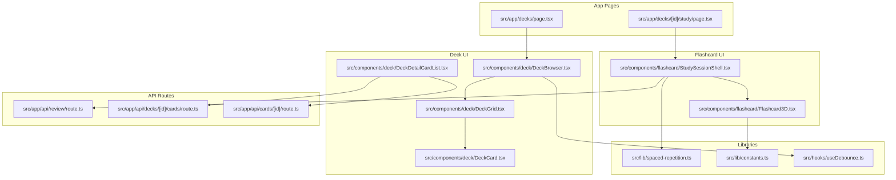
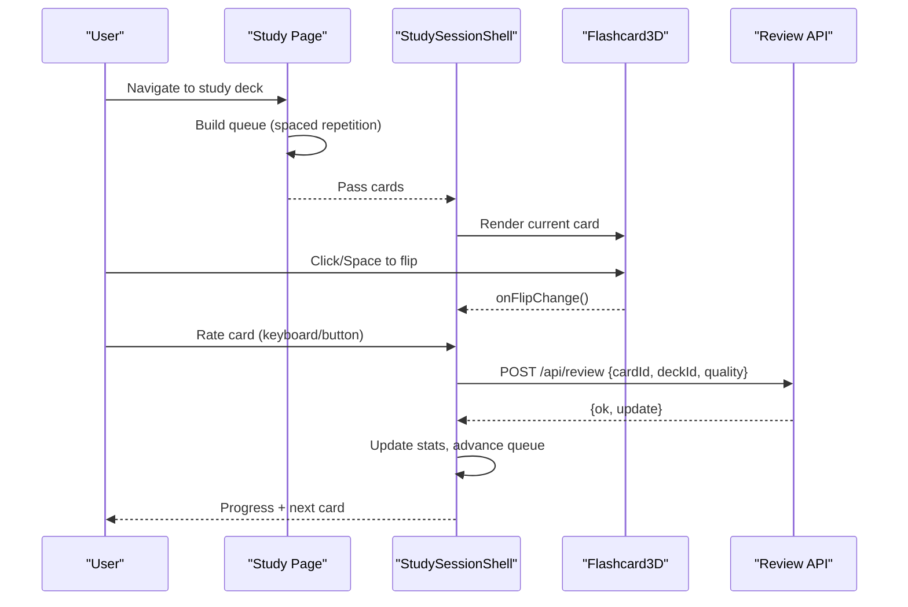
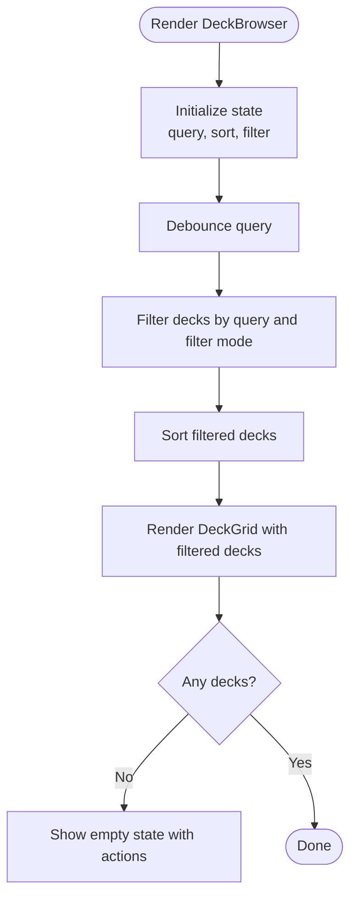
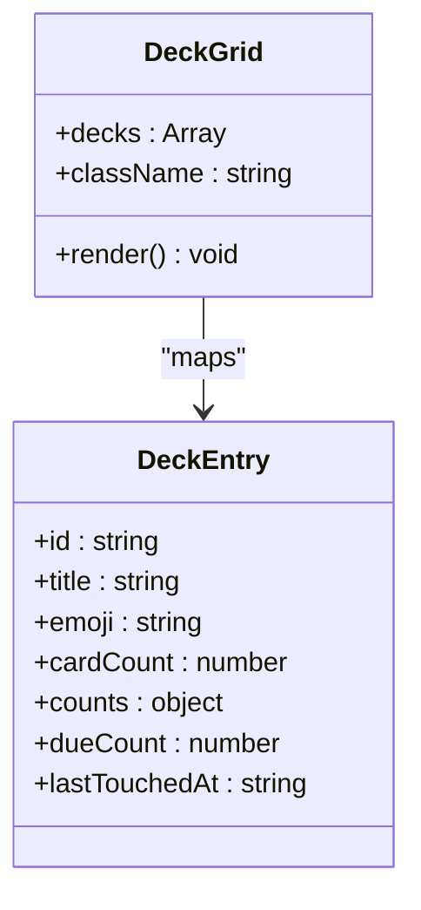
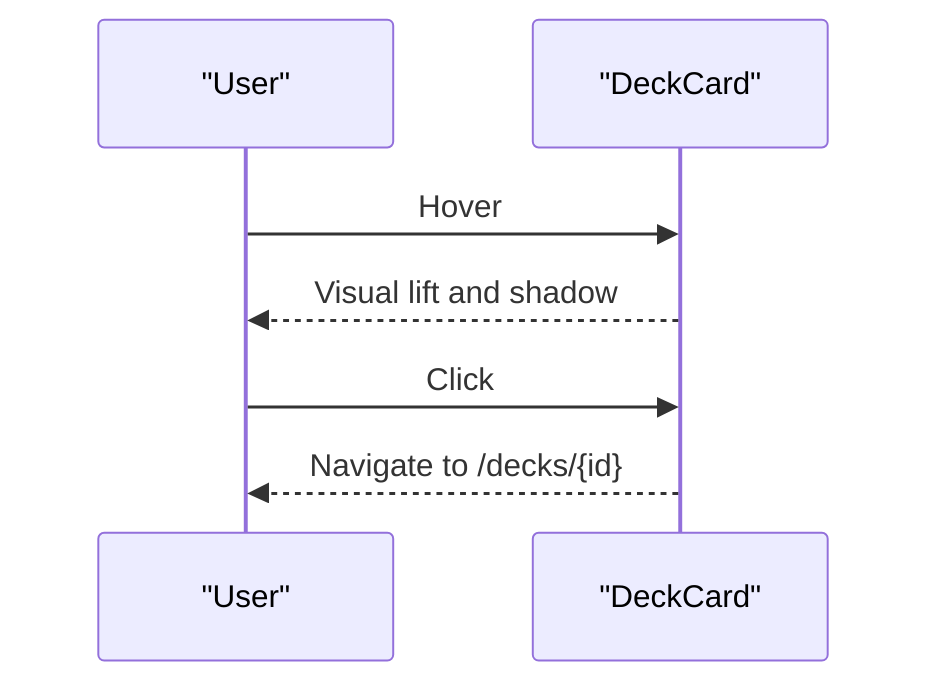
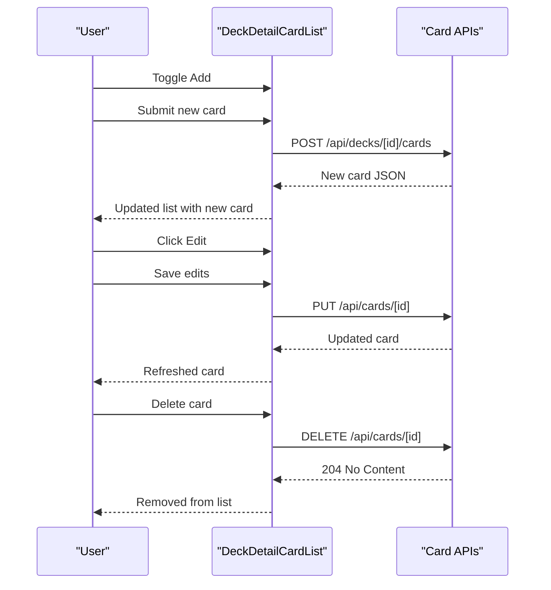
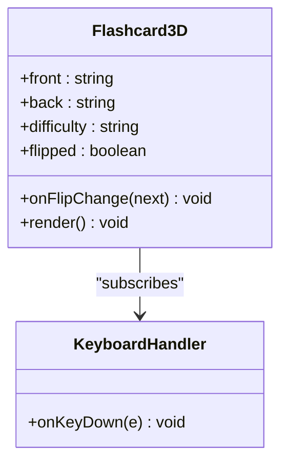
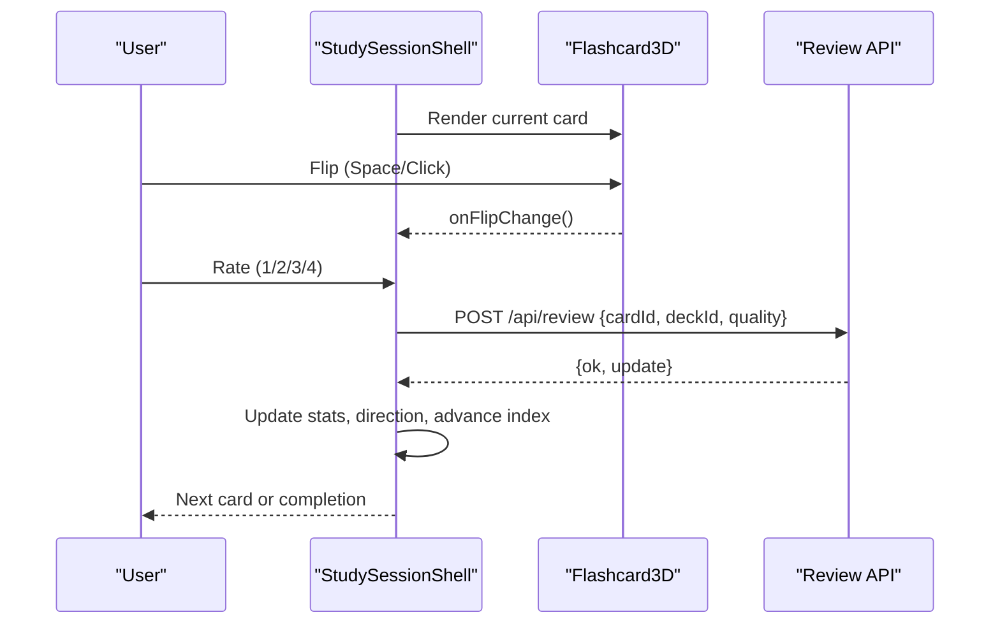
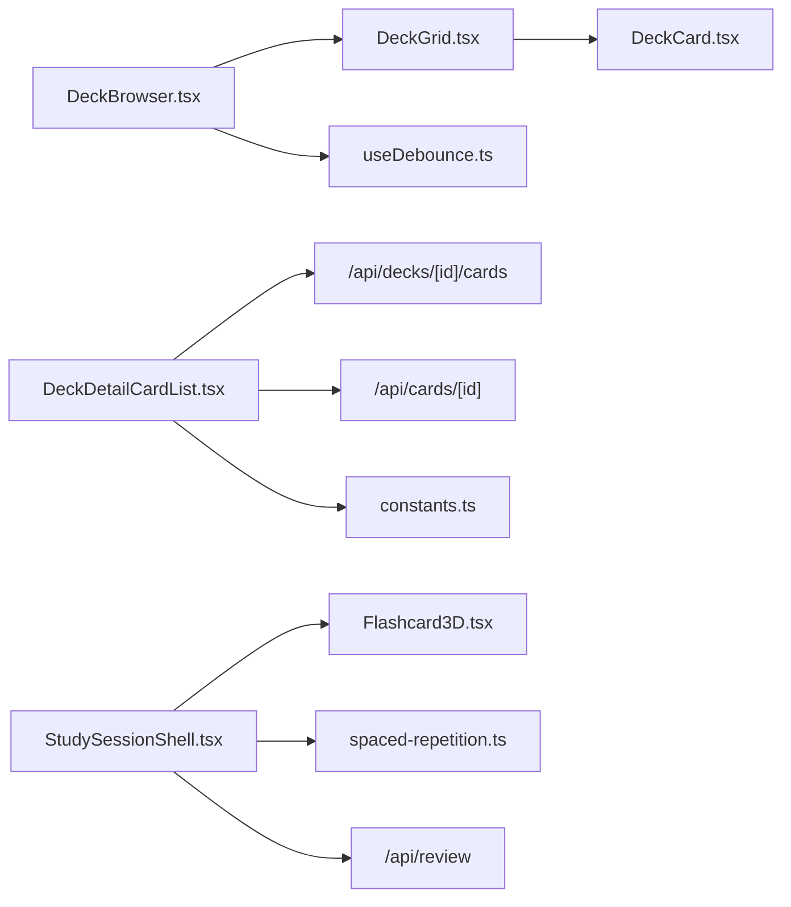

# Feature Components

<cite>
**Referenced Files in This Document**
- [DeckBrowser.tsx](file://src/components/deck/DeckBrowser.tsx)
- [DeckCard.tsx](file://src/components/deck/DeckCard.tsx)
- [DeckDetailCardList.tsx](file://src/components/deck/DeckDetailCardList.tsx)
- [DeckGrid.tsx](file://src/components/deck/DeckGrid.tsx)
- [Flashcard3D.tsx](file://src/components/flashcard/Flashcard3D.tsx)
- [StudySessionShell.tsx](file://src/components/flashcard/StudySessionShell.tsx)
- [spaced-repetition.ts](file://src/lib/spaced-repetition.ts)
- [constants.ts](file://src/lib/constants.ts)
- [useDebounce.ts](file://src/hooks/useDebounce.ts)
- [page.tsx (Decks page)](file://src/app/decks/page.tsx)
- [page.tsx (Study page)](file://src/app/decks/[id]/study/page.tsx)
- [route.ts (review API)](file://src/app/api/review/route.ts)
- [route.ts (deck cards API)](file://src/app/api/decks/[id]/cards/route.ts)
- [route.ts (card API)](file://src/app/api/cards/[id]/route.ts)
</cite>

## Table of Contents
1. [Introduction](#introduction)
2. [Project Structure](#project-structure)
3. [Core Components](#core-components)
4. [Architecture Overview](#architecture-overview)
5. [Detailed Component Analysis](#detailed-component-analysis)
6. [Dependency Analysis](#dependency-analysis)
7. [Performance Considerations](#performance-considerations)
8. [Troubleshooting Guide](#troubleshooting-guide)
9. [Conclusion](#conclusion)

## Introduction
This document explains the feature-specific components that implement core application functionality for deck browsing, flashcard study, and spaced repetition integration. It focuses on:
- DeckBrowser grid/list view switching, filtering, and sorting
- DeckCard interactive elements and hover effects
- DeckDetailCardList card management, bulk operations, and editing
- DeckGrid responsive grid layout and card arrangement
- Flashcard3D 3D animation system and user interaction handling
- StudySessionShell study session orchestration, timing controls, and progress tracking
It also covers component composition patterns, prop interfaces, state management, and integration with the spaced repetition system.

## Project Structure
The relevant components and pages are organized under src/components and src/app, with supporting libraries for constants, debouncing, and spaced repetition logic.

**Diagram sources**
- [page.tsx (Decks page):1-89](file://src/app/decks/page.tsx#L1-L89)
- [page.tsx (Study page):1-92](file://src/app/decks/[id]/study/page.tsx#L1-L92)
- [DeckBrowser.tsx:1-188](file://src/components/deck/DeckBrowser.tsx#L1-L188)
- [DeckGrid.tsx:1-95](file://src/components/deck/DeckGrid.tsx#L1-L95)
- [DeckCard.tsx:1-50](file://src/components/deck/DeckCard.tsx#L1-L50)
- [DeckDetailCardList.tsx:1-358](file://src/components/deck/DeckDetailCardList.tsx#L1-L358)
- [Flashcard3D.tsx:1-113](file://src/components/flashcard/Flashcard3D.tsx#L1-L113)
- [StudySessionShell.tsx:1-430](file://src/components/flashcard/StudySessionShell.tsx#L1-L430)
- [spaced-repetition.ts:1-141](file://src/lib/spaced-repetition.ts#L1-L141)
- [constants.ts:1-31](file://src/lib/constants.ts#L1-L31)
- [useDebounce.ts:1-18](file://src/hooks/useDebounce.ts#L1-L18)
- [route.ts (review API):1-76](file://src/app/api/review/route.ts#L1-L76)
- [route.ts (deck cards API):1-40](file://src/app/api/decks/[id]/cards/route.ts#L1-L40)
- [route.ts (card API):1-47](file://src/app/api/cards/[id]/route.ts#L1-L47)

**Section sources**
- [page.tsx (Decks page):1-89](file://src/app/decks/page.tsx#L1-L89)
- [page.tsx (Study page):1-92](file://src/app/decks/[id]/study/page.tsx#L1-L92)
- [DeckBrowser.tsx:1-188](file://src/components/deck/DeckBrowser.tsx#L1-L188)
- [DeckGrid.tsx:1-95](file://src/components/deck/DeckGrid.tsx#L1-L95)
- [DeckCard.tsx:1-50](file://src/components/deck/DeckCard.tsx#L1-L50)
- [DeckDetailCardList.tsx:1-358](file://src/components/deck/DeckDetailCardList.tsx#L1-L358)
- [Flashcard3D.tsx:1-113](file://src/components/flashcard/Flashcard3D.tsx#L1-L113)
- [StudySessionShell.tsx:1-430](file://src/components/flashcard/StudySessionShell.tsx#L1-L430)
- [spaced-repetition.ts:1-141](file://src/lib/spaced-repetition.ts#L1-L141)
- [constants.ts:1-31](file://src/lib/constants.ts#L1-L31)
- [useDebounce.ts:1-18](file://src/hooks/useDebounce.ts#L1-L18)
- [route.ts (review API):1-76](file://src/app/api/review/route.ts#L1-L76)
- [route.ts (deck cards API):1-40](file://src/app/api/decks/[id]/cards/route.ts#L1-L40)
- [route.ts (card API):1-47](file://src/app/api/cards/[id]/route.ts#L1-L47)

## Core Components
This section summarizes the primary components and their responsibilities.

- DeckBrowser: Provides search, filter chips, and sort controls; renders DeckGrid with filtered decks.
- DeckGrid: Renders a responsive grid of deck cards with mastery indicators and due badges.
- DeckCard: Individual deck card with hover animations and mastery progress visualization.
- DeckDetailCardList: Manages deck card lists with search, expand/collapse, inline edit, add/delete, and animated transitions.
- Flashcard3D: 3D flip animation with keyboard/mouse interaction and gradient border styling.
- StudySessionShell: Orchestrates study sessions, handles ratings, progress tracking, timing, and completion screens.

**Section sources**
- [DeckBrowser.tsx:35-187](file://src/components/deck/DeckBrowser.tsx#L35-L187)
- [DeckGrid.tsx:22-94](file://src/components/deck/DeckGrid.tsx#L22-L94)
- [DeckCard.tsx:18-49](file://src/components/deck/DeckCard.tsx#L18-L49)
- [DeckDetailCardList.tsx:28-357](file://src/components/deck/DeckDetailCardList.tsx#L28-L357)
- [Flashcard3D.tsx:17-112](file://src/components/flashcard/Flashcard3D.tsx#L17-L112)
- [StudySessionShell.tsx:42-429](file://src/components/flashcard/StudySessionShell.tsx#L42-L429)

## Architecture Overview
The system integrates UI components with server-side APIs and the spaced repetition engine. The study flow starts from a Next.js page that builds a queue using the spaced repetition library, then renders StudySessionShell, which drives Flashcard3D and communicates with the review API.

**Diagram sources**
- [page.tsx (Study page):30-91](file://src/app/decks/[id]/study/page.tsx#L30-L91)
- [StudySessionShell.tsx:42-125](file://src/components/flashcard/StudySessionShell.tsx#L42-L125)
- [Flashcard3D.tsx:17-40](file://src/components/flashcard/Flashcard3D.tsx#L17-L40)
- [route.ts (review API):5-75](file://src/app/api/review/route.ts#L5-L75)

## Detailed Component Analysis

### DeckBrowser: Grid/List View, Filtering, Sorting
- Props: decks array of DeckBrowserModel
- State: query, debounced query, sort mode, filter mode
- Filtering modes:
  - Has Due Cards: decks with dueCount > 0
  - Recently Studied: lastTouchedAt within a rolling window
  - Never Studied: counts equal to new count
- Sorting modes:
  - Last Studied (default)
  - Alphabetical
  - Most Cards
  - Lowest Mastery (computed from mastered vs. non-new cards)
- Rendering: Delegates to DeckGrid with responsive grid classes; empty state with actions to clear filters or upload

**Diagram sources**
- [DeckBrowser.tsx:35-92](file://src/components/deck/DeckBrowser.tsx#L35-L92)

**Section sources**
- [DeckBrowser.tsx:35-187](file://src/components/deck/DeckBrowser.tsx#L35-L187)
- [useDebounce.ts:1-18](file://src/hooks/useDebounce.ts#L1-L18)

### DeckGrid: Responsive Grid Layout and Card Arrangement
- Props: decks array, className for grid columns
- Behavior: Renders deck entries with emoji, title, card count, due badges, and mastery breakdown bars
- Hover and animation: subtle lift and shadow on hover; staggered entrance animation per item
- Empty state: centered message prompting to create/upload a deck

**Diagram sources**
- [DeckGrid.tsx:9-20](file://src/components/deck/DeckGrid.tsx#L9-L20)

**Section sources**
- [DeckGrid.tsx:22-94](file://src/components/deck/DeckGrid.tsx#L22-L94)

### DeckCard: Interactive Elements, Hover Effects, Navigation Triggers
- Props: deck of DeckCardModel
- Interactions:
  - Hover: slight lift and glow effect
  - Click: navigates to deck detail page
- Visuals:
  - Emoji icon
  - Title
  - Card count
  - Mastery progress bar with animated width
  - Percentage label

**Diagram sources**
- [DeckCard.tsx:18-49](file://src/components/deck/DeckCard.tsx#L18-L49)

**Section sources**
- [DeckCard.tsx:18-49](file://src/components/deck/DeckCard.tsx#L18-L49)

### DeckDetailCardList: Card Management, Bulk Operations, Editing
- Props: deckId, cards array
- State:
  - Search with debounced query
  - Expanded card ID
  - Editing state (editingId, editFront, editBack)
  - Adding state (isAdding, newFront, newBack)
- Features:
  - Search across front/back content
  - Expand/Collapse per card
  - Inline edit: save/cancel
  - Delete with confirmation
  - Add new card via POST to deck cards API
  - Animated transitions for adding and list items
- API integrations:
  - PUT /api/cards/[id] to update
  - DELETE /api/cards/[id] to remove
  - POST /api/decks/[id]/cards to add

**Diagram sources**
- [DeckDetailCardList.tsx:28-142](file://src/components/deck/DeckDetailCardList.tsx#L28-L142)
- [route.ts (deck cards API):4-39](file://src/app/api/decks/[id]/cards/route.ts#L4-L39)
- [route.ts (card API):4-46](file://src/app/api/cards/[id]/route.ts#L4-L46)

**Section sources**
- [DeckDetailCardList.tsx:28-357](file://src/components/deck/DeckDetailCardList.tsx#L28-L357)
- [route.ts (deck cards API):1-40](file://src/app/api/decks/[id]/cards/route.ts#L1-L40)
- [route.ts (card API):1-47](file://src/app/api/cards/[id]/route.ts#L1-L47)

### Flashcard3D: 3D Animation System, Flip Mechanics, Interaction Handling
- Props: front/back content, difficulty, controlled flipped state, onFlipChange callback
- Interaction:
  - Mouse click toggles flip
  - Keyboard events (Space/Enter) toggle flip when not focused on inputs
- Visuals:
  - Gradient border ring changes with flip state
  - 3D flip with preserve-3d and backface visibility
  - Difficulty badge on front
- Animation: Smooth 3D rotation with easing and shadow transitions

**Diagram sources**
- [Flashcard3D.tsx:8-26](file://src/components/flashcard/Flashcard3D.tsx#L8-L26)

**Section sources**
- [Flashcard3D.tsx:17-112](file://src/components/flashcard/Flashcard3D.tsx#L17-L112)
- [constants.ts:19-30](file://src/lib/constants.ts#L19-L30)

### StudySessionShell: Study Session Orchestration, Timing, Progress Tracking
- Props: deckId, deckTitle, cards (CardForReview[])
- State:
  - Queue index, direction, flip state, completion flag
  - Confirmation modal for ending session
  - Submission guard during API calls
- Stats:
  - Studied count, correct answers, newly mastered, start time
- Flow:
  - Progress bar and header display current position
  - Animated card swap with directional transitions
  - Rating buttons appear after flip; keyboard shortcuts supported
  - On rating:
    - Optimistically advance queue
    - Fire POST /api/review with cardId, deckId, quality
    - Confetti on perfect rating
- Completion:
  - Final screen with stats and navigation options

**Diagram sources**
- [StudySessionShell.tsx:42-125](file://src/components/flashcard/StudySessionShell.tsx#L42-L125)
- [Flashcard3D.tsx:17-40](file://src/components/flashcard/Flashcard3D.tsx#L17-L40)
- [route.ts (review API):5-75](file://src/app/api/review/route.ts#L5-L75)

**Section sources**
- [StudySessionShell.tsx:42-429](file://src/components/flashcard/StudySessionShell.tsx#L42-L429)
- [spaced-repetition.ts:29-76](file://src/lib/spaced-repetition.ts#L29-L76)
- [page.tsx (Study page):30-91](file://src/app/decks/[id]/study/page.tsx#L30-L91)

## Dependency Analysis
- DeckBrowser depends on:
  - DeckGrid for rendering
  - useDebounce for search throttling
  - UI primitives (Input, Select)
- DeckGrid depends on:
  - DeckCard for individual entries
  - Utility formatting for relative dates
- DeckDetailCardList depends on:
  - Card APIs for CRUD
  - Constants for difficulty/status styles
  - Framer Motion for animations
- StudySessionShell depends on:
  - Flashcard3D for rendering
  - Spaced repetition library for queue building and updates
  - Review API for persistence
- Spaced repetition library provides:
  - Queue builder (getCardsForStudy)
  - Review processor (processReview)
  - Rating option definitions

**Diagram sources**
- [DeckBrowser.tsx:3-15](file://src/components/deck/DeckBrowser.tsx#L3-L15)
- [DeckGrid.tsx:3-7](file://src/components/deck/DeckGrid.tsx#L3-L7)
- [DeckCard.tsx:3-4](file://src/components/deck/DeckCard.tsx#L3-L4)
- [DeckDetailCardList.tsx:5-12](file://src/components/deck/DeckDetailCardList.tsx#L5-L12)
- [StudySessionShell.tsx:9-10](file://src/components/flashcard/StudySessionShell.tsx#L9-L10)
- [spaced-repetition.ts:1-2](file://src/lib/spaced-repetition.ts#L1-L2)
- [constants.ts:6-30](file://src/lib/constants.ts#L6-L30)
- [route.ts (review API):1-3](file://src/app/api/review/route.ts#L1-L3)
- [route.ts (deck cards API):1-3](file://src/app/api/decks/[id]/cards/route.ts#L1-L3)
- [route.ts (card API):1-3](file://src/app/api/cards/[id]/route.ts#L1-L3)

**Section sources**
- [DeckBrowser.tsx:3-15](file://src/components/deck/DeckBrowser.tsx#L3-L15)
- [DeckGrid.tsx:3-7](file://src/components/deck/DeckGrid.tsx#L3-L7)
- [DeckCard.tsx:3-4](file://src/components/deck/DeckCard.tsx#L3-L4)
- [DeckDetailCardList.tsx:5-12](file://src/components/deck/DeckDetailCardList.tsx#L5-L12)
- [StudySessionShell.tsx:9-10](file://src/components/flashcard/StudySessionShell.tsx#L9-L10)
- [spaced-repetition.ts:1-2](file://src/lib/spaced-repetition.ts#L1-L2)
- [constants.ts:6-30](file://src/lib/constants.ts#L6-L30)
- [route.ts (review API):1-3](file://src/app/api/review/route.ts#L1-L3)
- [route.ts (deck cards API):1-3](file://src/app/api/decks/[id]/cards/route.ts#L1-L3)
- [route.ts (card API):1-3](file://src/app/api/cards/[id]/route.ts#L1-L3)

## Performance Considerations
- Debounced search: useDebounce reduces re-filtering frequency for smoother UX.
- Memoized computations: DeckBrowser uses useMemo for filtering/sorting to avoid unnecessary recalculations.
- Animations: Framer Motion is used selectively; staggering and transitions are tuned for responsiveness.
- Infinite scrolling: Not implemented in DeckBrowser; pagination or virtualization could be considered for very large decks.
- API calls: StudySessionShell uses optimistic UI and fire-and-forgets updates to keep interactions smooth.

[No sources needed since this section provides general guidance]

## Troubleshooting Guide
- Deck list not loading:
  - Verify DATABASE_URL and Prisma schema; errors surface on decks page.
- Study session stuck or not advancing:
  - Ensure /api/review responds successfully; check network tab for failures.
- Card edits not persisting:
  - Confirm /api/cards/[id] PUT returns success; verify toast messages.
- Adding cards fails:
  - Check /api/decks/[id]/cards POST payload and server logs.
- Keyboard shortcuts not working:
  - Ensure focus is not inside inputs; StudySessionShell prevents arrow keys from scrolling.

**Section sources**
- [page.tsx (Decks page):71-87](file://src/app/decks/page.tsx#L71-L87)
- [route.ts (review API):5-75](file://src/app/api/review/route.ts#L5-L75)
- [route.ts (card API):4-46](file://src/app/api/cards/[id]/route.ts#L4-L46)
- [route.ts (deck cards API):4-39](file://src/app/api/decks/[id]/cards/route.ts#L4-L39)
- [StudySessionShell.tsx:128-158](file://src/components/flashcard/StudySessionShell.tsx#L128-L158)

## Conclusion
These components form a cohesive study system:
- DeckBrowser and DeckGrid provide efficient discovery and navigation.
- DeckDetailCardList offers robust card lifecycle management.
- Flashcard3D delivers immersive, accessible interactions.
- StudySessionShell orchestrates spaced repetition-driven sessions with clear feedback and progress tracking.
Integration with the spaced repetition library and REST APIs ensures accurate scheduling and persistence.

[No sources needed since this section summarizes without analyzing specific files]