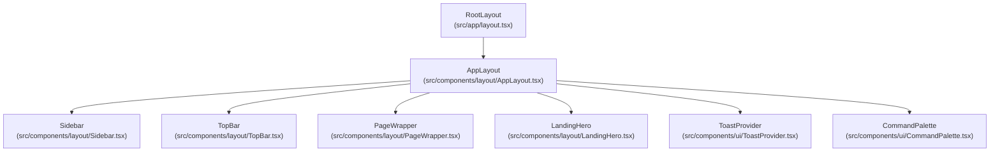
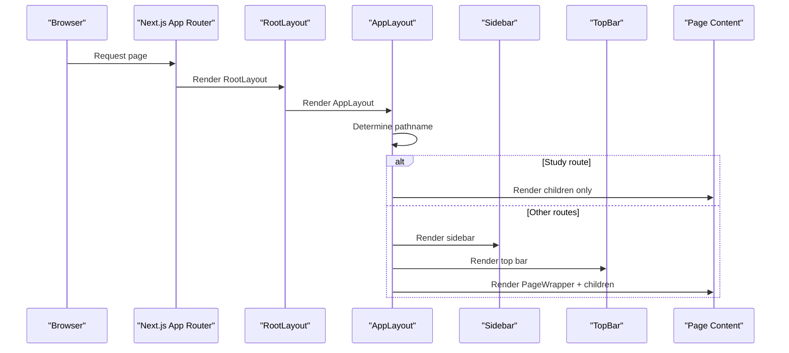
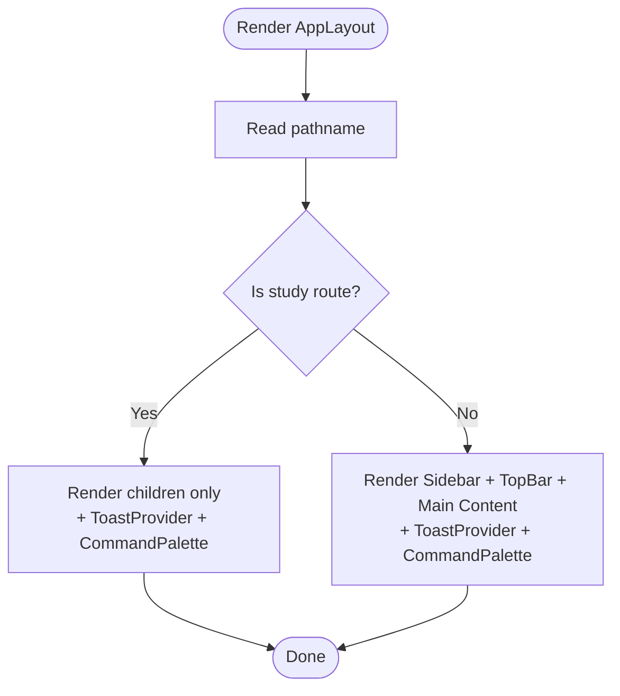
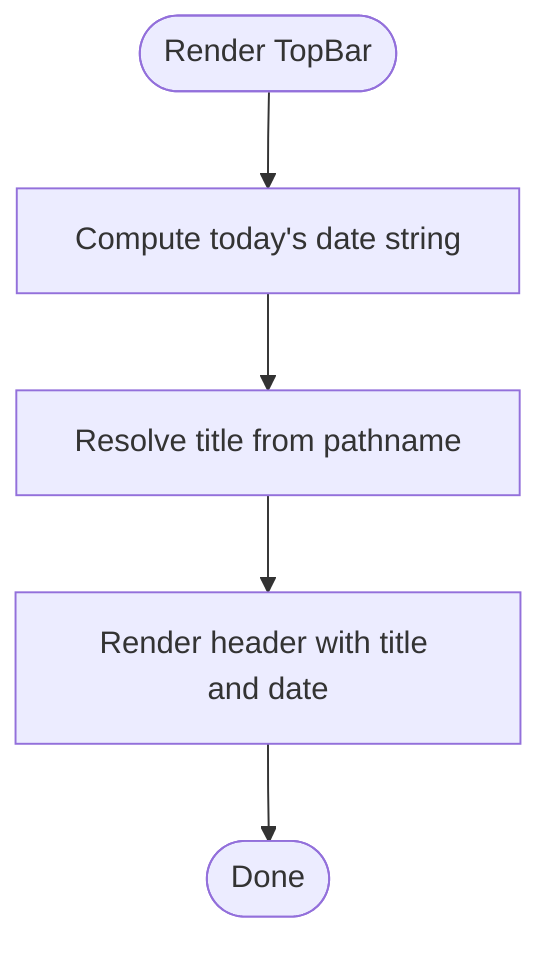
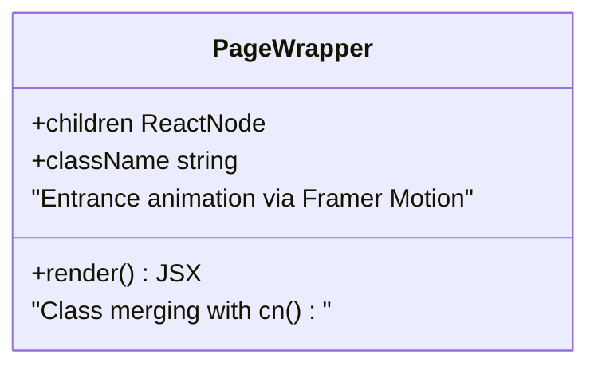
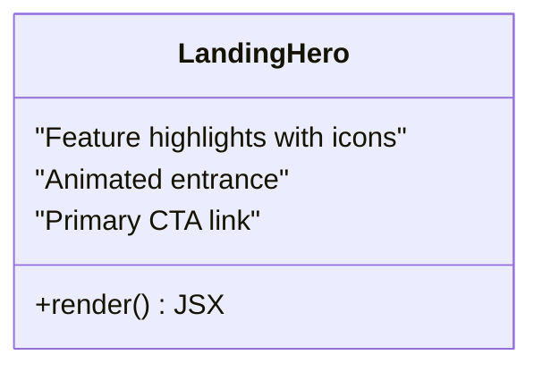
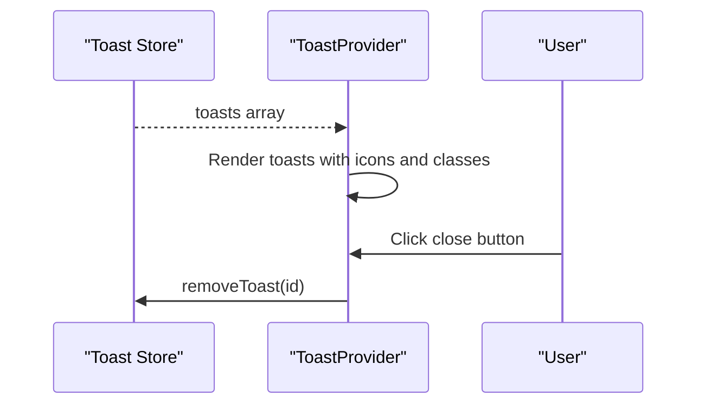
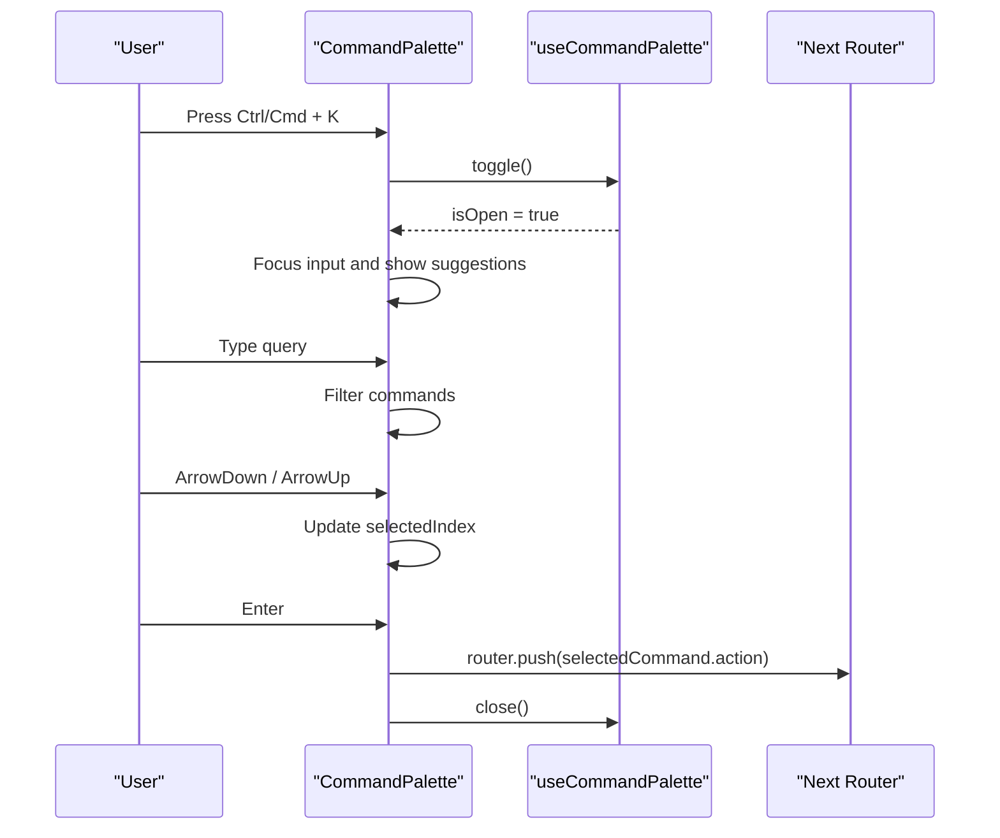
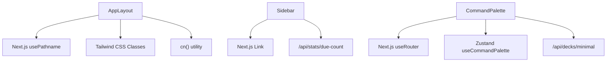

# Layout Components

<cite>
**Referenced Files in This Document**
- [AppLayout.tsx](file://src/components/layout/AppLayout.tsx)
- [Sidebar.tsx](file://src/components/layout/Sidebar.tsx)
- [TopBar.tsx](file://src/components/layout/TopBar.tsx)
- [PageWrapper.tsx](file://src/components/layout/PageWrapper.tsx)
- [LandingHero.tsx](file://src/components/layout/LandingHero.tsx)
- [RootLayout.tsx](file://src/app/layout.tsx)
- [DashboardPage.tsx](file://src/app/page.tsx)
- [DeckDetailPage.tsx](file://src/app/decks/[id]/page.tsx)
- [StudyPage.tsx](file://src/app/decks/[id]/study/page.tsx)
- [ToastProvider.tsx](file://src/components/ui/ToastProvider.tsx)
- [CommandPalette.tsx](file://src/components/ui/CommandPalette.tsx)
- [useCommandPalette.ts](file://src/lib/store/useCommandPalette.ts)
- [globals.css](file://src/styles/globals.css)
- [utils.ts](file://src/lib/utils.ts)
</cite>

## Table of Contents
1. [Introduction](#introduction)
2. [Project Structure](#project-structure)
3. [Core Components](#core-components)
4. [Architecture Overview](#architecture-overview)
5. [Detailed Component Analysis](#detailed-component-analysis)
6. [Dependency Analysis](#dependency-analysis)
7. [Performance Considerations](#performance-considerations)
8. [Troubleshooting Guide](#troubleshooting-guide)
9. [Conclusion](#conclusion)
10. [Appendices](#appendices)

## Introduction
This document explains the layout components system used across the application. It focuses on how the AppLayout component conditionally renders study versus dashboard views, how the Sidebar provides navigation and due counts, how the TopBar displays contextual titles and dates, and how PageWrapper and LandingHero wrap content. It also covers responsive design patterns, styling with Tailwind CSS, and integration with Next.js routing and client-side state.

## Project Structure
The layout system is centered around a root AppLayout wrapper that delegates to either:
- Full layout with Sidebar and TopBar for most routes, or
- Minimal layout for the study route.

The RootLayout composes AppLayout around page content, ensuring consistent theming and global styles via globals.css.



**Diagram sources**
- [RootLayout.tsx:39-51](file://src/app/layout.tsx#L39-L51)
- [AppLayout.tsx:15-40](file://src/components/layout/AppLayout.tsx#L15-L40)
- [Sidebar.tsx:18-98](file://src/components/layout/Sidebar.tsx#L18-L98)
- [TopBar.tsx:16-40](file://src/components/layout/TopBar.tsx#L16-L40)
- [PageWrapper.tsx:18-29](file://src/components/layout/PageWrapper.tsx#L18-L29)
- [LandingHero.tsx:7-52](file://src/components/layout/LandingHero.tsx#L7-L52)
- [ToastProvider.tsx:28-65](file://src/components/ui/ToastProvider.tsx#L28-L65)
- [CommandPalette.tsx:32-194](file://src/components/ui/CommandPalette.tsx#L32-L194)

**Section sources**
- [RootLayout.tsx:39-51](file://src/app/layout.tsx#L39-L51)
- [AppLayout.tsx:15-40](file://src/components/layout/AppLayout.tsx#L15-L40)

## Core Components
- AppLayout: Decides between full layout (sidebar/topbar) and minimal layout (study-only) based on the current route. Applies consistent dark theme and spacing.
- Sidebar: Navigation menu with icons and labels, active-state highlighting, due count badge fetched from an API, and responsive mobile layout.
- TopBar: Sticky header showing contextual title and current date.
- PageWrapper: Page-level content wrapper with subtle entrance animation.
- LandingHero: Hero section for empty-state landing experience.
- ToastProvider: Global toast notifications with animated entries/exits.
- CommandPalette: Global command palette with keyboard navigation and dynamic deck commands.

**Section sources**
- [AppLayout.tsx:11-13](file://src/components/layout/AppLayout.tsx#L11-L13)
- [Sidebar.tsx:11-16](file://src/components/layout/Sidebar.tsx#L11-L16)
- [TopBar.tsx:6-14](file://src/components/layout/TopBar.tsx#L6-L14)
- [PageWrapper.tsx:8-11](file://src/components/layout/PageWrapper.tsx#L8-L11)
- [LandingHero.tsx:7-52](file://src/components/layout/LandingHero.tsx#L7-L52)
- [ToastProvider.tsx:28-65](file://src/components/ui/ToastProvider.tsx#L28-L65)
- [CommandPalette.tsx:32-194](file://src/components/ui/CommandPalette.tsx#L32-L194)

## Architecture Overview
The layout architecture follows a layered pattern:
- RootLayout wraps the entire app and injects AppLayout.
- AppLayout branches on pathname to choose between full layout and minimal layout.
- Full layout composes Sidebar, TopBar, and page content wrapped by PageWrapper.
- Global UI helpers (ToastProvider, CommandPalette) are rendered alongside content.



**Diagram sources**
- [RootLayout.tsx:39-51](file://src/app/layout.tsx#L39-L51)
- [AppLayout.tsx:15-40](file://src/components/layout/AppLayout.tsx#L15-L40)
- [Sidebar.tsx:18-98](file://src/components/layout/Sidebar.tsx#L18-L98)
- [TopBar.tsx:16-40](file://src/components/layout/TopBar.tsx#L16-L40)

## Detailed Component Analysis

### AppLayout
- Purpose: Central layout orchestrator deciding between full and minimal layouts.
- Props:
  - children: ReactNode
- Behavior:
  - Reads pathname via Next.js hook.
  - Uses regex to detect study route pattern.
  - Renders minimal layout (only children and global providers) for study route.
  - Renders full layout (Sidebar + TopBar + main content) otherwise.
- Styling:
  - Dark theme background and text colors applied consistently.
  - Responsive margins/paddings for mobile and desktop.
- Providers:
  - ToastProvider and CommandPalette are always mounted.



**Diagram sources**
- [AppLayout.tsx:15-40](file://src/components/layout/AppLayout.tsx#L15-L40)

**Section sources**
- [AppLayout.tsx:11-13](file://src/components/layout/AppLayout.tsx#L11-L13)
- [AppLayout.tsx:15-40](file://src/components/layout/AppLayout.tsx#L15-L40)

### Sidebar
- Purpose: Persistent navigation and quick stats.
- Menu Items:
  - Dashboard, Upload, Decks, Stats.
- Active State:
  - Computes active path considering nested deck routes.
  - Uses motion layoutId for smooth indicator transitions.
- Due Count:
  - Fetches daily due count from a stats endpoint.
  - Animates the count when greater than zero.
- Responsiveness:
  - Mobile: horizontal bottom bar with lg-hide elements.
  - Desktop: vertical sidebar with fixed positioning and backdrop blur.
- Styling:
  - Tailwind classes for dark theme, backdrop blur, and responsive breakpoints.

```mermaid
classDiagram
class Sidebar {
+pathname string
+dueCount number
+render() JSX
-fetchDueCount() void
-computeActivePath() string
}
Sidebar : "Menu items : Dashboard, Upload, Decks, Stats"
Sidebar : "Active indicator with Framer Motion"
Sidebar : "Responsive : mobile bottom bar, desktop sidebar"
```

**Diagram sources**
- [Sidebar.tsx:18-98](file://src/components/layout/Sidebar.tsx#L18-L98)

**Section sources**
- [Sidebar.tsx:11-16](file://src/components/layout/Sidebar.tsx#L11-L16)
- [Sidebar.tsx:41-47](file://src/components/layout/Sidebar.tsx#L41-L47)
- [Sidebar.tsx:22-39](file://src/components/layout/Sidebar.tsx#L22-L39)
- [Sidebar.tsx:50-95](file://src/components/layout/Sidebar.tsx#L50-L95)

### TopBar
- Purpose: Sticky header with contextual title and current date.
- Title Resolution:
  - Maps pathname to human-friendly titles.
- Date Rendering:
  - Formats current weekday, month, and day on mount.
- Styling:
  - Backdrop blur, semi-transparent background, and sticky positioning.



**Diagram sources**
- [TopBar.tsx:16-40](file://src/components/layout/TopBar.tsx#L16-L40)
- [TopBar.tsx:6-14](file://src/components/layout/TopBar.tsx#L6-L14)

**Section sources**
- [TopBar.tsx:16-40](file://src/components/layout/TopBar.tsx#L16-L40)

### PageWrapper
- Purpose: Page-level content wrapper with entrance animation.
- Props:
  - children: ReactNode
  - className?: string
- Animation:
  - Framer Motion entrance effect with custom easing and duration.
- Styling:
  - Uses cn utility for class merging.



**Diagram sources**
- [PageWrapper.tsx:8-11](file://src/components/layout/PageWrapper.tsx#L8-L11)
- [PageWrapper.tsx:18-29](file://src/components/layout/PageWrapper.tsx#L18-L29)

**Section sources**
- [PageWrapper.tsx:13-16](file://src/components/layout/PageWrapper.tsx#L13-L16)
- [PageWrapper.tsx:18-29](file://src/components/layout/PageWrapper.tsx#L18-L29)

### LandingHero
- Purpose: Hero section for empty dashboard state.
- Elements:
  - Brand headline, feature copy, feature highlights with icons, and primary CTA.
- Animation:
  - Staggered entrance animations for feature blocks and CTA.
- Styling:
  - Centered layout, responsive typography, and vibrant accent colors.



**Diagram sources**
- [LandingHero.tsx:7-52](file://src/components/layout/LandingHero.tsx#L7-L52)

**Section sources**
- [LandingHero.tsx:7-52](file://src/components/layout/LandingHero.tsx#L7-L52)

### ToastProvider
- Purpose: Global toast notifications with animated entries/exits.
- State:
  - Consumes toast store to render messages.
- Types:
  - Supports success, error, and info variants with distinct styling.
- Interaction:
  - Dismiss button per toast; click removes toast.



**Diagram sources**
- [ToastProvider.tsx:28-65](file://src/components/ui/ToastProvider.tsx#L28-L65)

**Section sources**
- [ToastProvider.tsx:28-65](file://src/components/ui/ToastProvider.tsx#L28-L65)

### CommandPalette
- Purpose: Global command palette with keyboard navigation and dynamic deck commands.
- State:
  - Uses Zustand store to manage open/close state.
- Commands:
  - Static navigation commands plus dynamic deck commands (study/view).
- Interaction:
  - Keyboard shortcuts (Ctrl/Cmd + K) to toggle.
  - Arrow keys to navigate; Enter to execute; Escape to dismiss.
- Routing:
  - Uses Next.js router to navigate on selection.



**Diagram sources**
- [CommandPalette.tsx:32-194](file://src/components/ui/CommandPalette.tsx#L32-L194)
- [useCommandPalette.ts:1-15](file://src/lib/store/useCommandPalette.ts#L1-L15)

**Section sources**
- [CommandPalette.tsx:32-194](file://src/components/ui/CommandPalette.tsx#L32-L194)
- [useCommandPalette.ts:1-15](file://src/lib/store/useCommandPalette.ts#L1-L15)

## Dependency Analysis
- Routing and Navigation:
  - AppLayout uses Next.js pathname to branch layouts.
  - Sidebar uses Next.js Link for navigation.
  - CommandPalette uses Next.js useRouter for programmatic navigation.
- State Management:
  - CommandPalette uses a Zustand store for visibility state.
  - ToastProvider consumes a toast store (not shown here) to render notifications.
- Styling:
  - Tailwind utility classes dominate layout and theming.
  - cn utility merges classes safely.
- Data Fetching:
  - Sidebar fetches due count from a stats endpoint.
  - CommandPalette fetches minimal deck list for commands.



**Diagram sources**
- [AppLayout.tsx:4](file://src/components/layout/AppLayout.tsx#L4)
- [Sidebar.tsx:3](file://src/components/layout/Sidebar.tsx#L3)
- [CommandPalette.tsx:4](file://src/components/ui/CommandPalette.tsx#L4)
- [useCommandPalette.ts:1](file://src/lib/store/useCommandPalette.ts#L1)
- [Sidebar.tsx:25](file://src/components/layout/Sidebar.tsx#L25)
- [CommandPalette.tsx:23](file://src/components/ui/CommandPalette.tsx#L23)
- [AppLayout.tsx:21](file://src/components/layout/AppLayout.tsx#L21)
- [utils.ts:5-7](file://src/lib/utils.ts#L5-L7)

**Section sources**
- [AppLayout.tsx:4](file://src/components/layout/AppLayout.tsx#L4)
- [Sidebar.tsx:3](file://src/components/layout/Sidebar.tsx#L3)
- [CommandPalette.tsx:4](file://src/components/ui/CommandPalette.tsx#L4)
- [useCommandPalette.ts:1](file://src/lib/store/useCommandPalette.ts#L1)
- [Sidebar.tsx:25](file://src/components/layout/Sidebar.tsx#L25)
- [CommandPalette.tsx:23](file://src/components/ui/CommandPalette.tsx#L23)
- [utils.ts:5-7](file://src/lib/utils.ts#L5-L7)

## Performance Considerations
- Conditional Rendering:
  - AppLayout avoids mounting unnecessary components by checking the pathname early.
- Client-Side Effects:
  - Sidebar’s due count fetch runs on mount and path change; consider caching or debouncing if frequent navigation occurs.
- Animations:
  - Framer Motion animations are lightweight but should avoid excessive concurrent instances.
- Routing:
  - CommandPalette filters commands client-side; keep the deck list reasonably sized to maintain responsiveness.

[No sources needed since this section provides general guidance]

## Troubleshooting Guide
- Study Route Not Using Minimal Layout:
  - Verify pathname regex matches the intended pattern.
  - Confirm the route structure under decks/[id]/study.
- Sidebar Active State Incorrect:
  - Ensure nested deck paths resolve to the parent route for active highlighting.
- Due Count Not Updating:
  - Check network tab for /api/stats/due-count; confirm endpoint returns JSON with count field.
- Command Palette Not Opening:
  - Ensure keyboard shortcut is pressed with correct modifier key.
  - Verify Zustand store isOpen toggles on shortcut.
- Toasts Not Appearing:
  - Confirm the toast store provides toasts and removeToast works.

**Section sources**
- [AppLayout.tsx:17](file://src/components/layout/AppLayout.tsx#L17)
- [Sidebar.tsx:41-47](file://src/components/layout/Sidebar.tsx#L41-L47)
- [Sidebar.tsx:25](file://src/components/layout/Sidebar.tsx#L25)
- [useCommandPalette.ts:10-15](file://src/lib/store/useCommandPalette.ts#L10-L15)
- [ToastProvider.tsx:29](file://src/components/ui/ToastProvider.tsx#L29)

## Conclusion
The layout components system provides a clean separation of concerns: AppLayout orchestrates the overall shell, Sidebar and TopBar deliver navigation and context, PageWrapper and LandingHero wrap content, and global providers (ToastProvider and CommandPalette) enhance UX. The system leverages Next.js routing, Tailwind CSS, and client-side state to achieve a responsive, accessible, and performant interface.

[No sources needed since this section summarizes without analyzing specific files]

## Appendices

### Responsive Design Patterns
- Mobile-first approach with lg breakpoint thresholds.
- Fixed positioning for Sidebar and TopBar on desktop; bottom bar on mobile.
- Padding and spacing adjusted for small screens and larger viewports.

**Section sources**
- [Sidebar.tsx:50](file://src/components/layout/Sidebar.tsx#L50)
- [TopBar.tsx:32-38](file://src/components/layout/TopBar.tsx#L32-L38)
- [AppLayout.tsx:32](file://src/components/layout/AppLayout.tsx#L32)

### Styling with Tailwind CSS
- Dark theme variables defined globally.
- Utility classes for backgrounds, borders, backdrop blur, and responsive grids.
- cn utility ensures safe class merging.

**Section sources**
- [globals.css:3-12](file://src/styles/globals.css#L3-L12)
- [globals.css:60-81](file://src/styles/globals.css#L60-L81)
- [utils.ts:5-7](file://src/lib/utils.ts#L5-L7)

### Integration with Next.js Routing
- usePathname for layout branching.
- Next Link for internal navigation.
- useRouter for programmatic navigation in CommandPalette.
- Dynamic routes for decks and study sessions.

**Section sources**
- [AppLayout.tsx:4](file://src/components/layout/AppLayout.tsx#L4)
- [Sidebar.tsx:3](file://src/components/layout/Sidebar.tsx#L3)
- [CommandPalette.tsx:4](file://src/components/ui/CommandPalette.tsx#L4)
- [DeckDetailPage.tsx:26](file://src/app/decks/[id]/page.tsx#L26)
- [StudyPage.tsx:30](file://src/app/decks/[id]/study/page.tsx#L30)