# UI Components

<cite>
**Referenced Files in This Document**
- [button.tsx](file://src/components/ui/button.tsx)
- [input.tsx](file://src/components/ui/input.tsx)
- [select.tsx](file://src/components/ui/select.tsx)
- [dropdown-menu.tsx](file://src/components/ui/dropdown-menu.tsx)
- [ToastProvider.tsx](file://src/components/ui/ToastProvider.tsx)
- [CommandPalette.tsx](file://src/components/ui/CommandPalette.tsx)
- [EmptyState.tsx](file://src/components/shared/EmptyState.tsx)
- [Skeleton.tsx](file://src/components/shared/Skeleton.tsx)
- [CountUp.tsx](file://src/components/shared/CountUp.tsx)
- [useToast.ts](file://src/lib/store/useToast.ts)
- [useCommandPalette.ts](file://src/lib/store/useCommandPalette.ts)
- [utils.ts](file://src/lib/utils.ts)
- [components.json](file://components.json)
</cite>

## Table of Contents
1. [Introduction](#introduction)
2. [Project Structure](#project-structure)
3. [Core Components](#core-components)
4. [Architecture Overview](#architecture-overview)
5. [Detailed Component Analysis](#detailed-component-analysis)
6. [Dependency Analysis](#dependency-analysis)
7. [Performance Considerations](#performance-considerations)
8. [Troubleshooting Guide](#troubleshooting-guide)
9. [Conclusion](#conclusion)
10. [Appendices](#appendices)

## Introduction
This document describes the reusable UI components that compose the application’s design system. It focuses on:
- Button variants, sizes, states, and accessibility
- Input validation handling, error states, and form integration
- Select dropdown functionality, option rendering, and controlled/uncontrolled usage
- Dropdown menu positioning, trigger mechanisms, and keyboard navigation
- ToastProvider notification system, positioning, and dismissal handling
- CommandPalette search, command execution, and keyboard shortcuts
- Shared components: EmptyState, Skeleton, and CountUp
It also provides usage examples, customization options, and integration patterns with forms and modals.

## Project Structure
The UI components live under src/components/ui and src/components/shared. They integrate with a Tailwind-based theming system and a small Zustand store for cross-cutting UI state (toasts and command palette). The design system is configured via components.json.

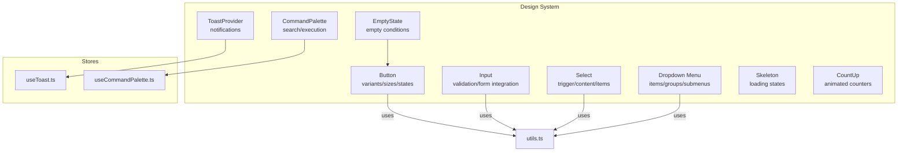

**Diagram sources**
- [button.tsx:1-47](file://src/components/ui/button.tsx#L1-L47)
- [input.tsx:1-23](file://src/components/ui/input.tsx#L1-L23)
- [select.tsx:1-145](file://src/components/ui/select.tsx#L1-L145)
- [dropdown-menu.tsx:1-258](file://src/components/ui/dropdown-menu.tsx#L1-L258)
- [ToastProvider.tsx:1-66](file://src/components/ui/ToastProvider.tsx#L1-L66)
- [CommandPalette.tsx:1-195](file://src/components/ui/CommandPalette.tsx#L1-L195)
- [EmptyState.tsx:1-28](file://src/components/shared/EmptyState.tsx#L1-L28)
- [Skeleton.tsx:1-10](file://src/components/shared/Skeleton.tsx#L1-L10)
- [CountUp.tsx:1-31](file://src/components/shared/CountUp.tsx#L1-L31)
- [useToast.ts:1-36](file://src/lib/store/useToast.ts#L1-L36)
- [useCommandPalette.ts:1-15](file://src/lib/store/useCommandPalette.ts#L1-L15)
- [utils.ts:1-34](file://src/lib/utils.ts#L1-L34)

**Section sources**
- [components.json:1-21](file://components.json#L1-L21)

## Core Components
This section summarizes the primary UI components and their capabilities.

- Button
  - Variants: default, secondary, ghost, outline
  - Sizes: default, sm, lg, icon
  - States: disabled, focus-visible ring, hover/focus styles
  - Accessibility: focus-visible ring, disabled pointer-events
  - Composition: supports asChild via Radix Slot

- Input
  - Base styling for text inputs with focus-visible ring and placeholder color
  - Form integration: standard HTML attributes supported

- Select
  - Trigger, Content, Item, Label, Separator, Scroll buttons
  - Controlled via Root/Value; supports groups and viewport sizing
  - Positioning: popper-side transitions

- Dropdown Menu
  - Root, Portal, Trigger, Content, Group, Label, Item, Checkbox/Radio items
  - Submenus, separators, shortcuts
  - Positioning: slide-in animations and side-aware transforms

- ToastProvider
  - Fixed-position notifications with icons and auto-dismiss
  - Dismissal via close button and programmatic removal

- CommandPalette
  - Global shortcut (Ctrl/Cmd+K) to toggle
  - Searchable command list with keyboard navigation (Up/Down/Enter/Escape)
  - Dynamic commands from API plus static actions

- Shared Components
  - EmptyState: renders icon, title, description, optional CTA
  - Skeleton: shimmer animation for loading placeholders
  - CountUp: animated numeric counter with configurable duration

**Section sources**
- [button.tsx:7-47](file://src/components/ui/button.tsx#L7-L47)
- [input.tsx:5-22](file://src/components/ui/input.tsx#L5-L22)
- [select.tsx:9-144](file://src/components/ui/select.tsx#L9-L144)
- [dropdown-menu.tsx:9-257](file://src/components/ui/dropdown-menu.tsx#L9-L257)
- [ToastProvider.tsx:28-65](file://src/components/ui/ToastProvider.tsx#L28-L65)
- [CommandPalette.tsx:32-194](file://src/components/ui/CommandPalette.tsx#L32-L194)
- [EmptyState.tsx:6-27](file://src/components/shared/EmptyState.tsx#L6-L27)
- [Skeleton.tsx:7-9](file://src/components/shared/Skeleton.tsx#L7-L9)
- [CountUp.tsx:12-30](file://src/components/shared/CountUp.tsx#L12-L30)

## Architecture Overview
The design system is built around:
- Styled primitives using Tailwind classes and a shared cn utility
- Radix UI primitives for accessible, composable interactions
- Zustand stores for lightweight, cross-component state (toasts, command palette)
- Framer Motion for smooth entrance/exit animations

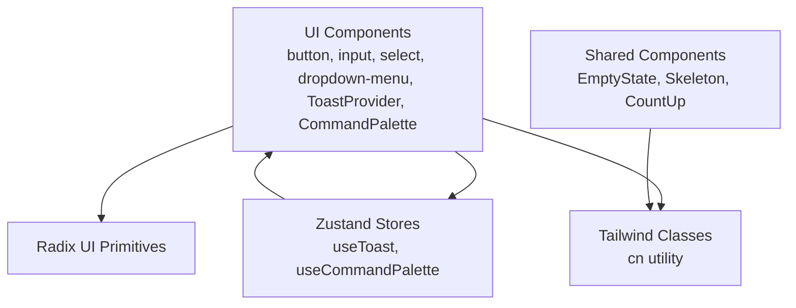

**Diagram sources**
- [button.tsx:1-47](file://src/components/ui/button.tsx#L1-L47)
- [input.tsx:1-23](file://src/components/ui/input.tsx#L1-L23)
- [select.tsx:1-145](file://src/components/ui/select.tsx#L1-L145)
- [dropdown-menu.tsx:1-258](file://src/components/ui/dropdown-menu.tsx#L1-L258)
- [ToastProvider.tsx:1-66](file://src/components/ui/ToastProvider.tsx#L1-L66)
- [CommandPalette.tsx:1-195](file://src/components/ui/CommandPalette.tsx#L1-L195)
- [EmptyState.tsx:1-28](file://src/components/shared/EmptyState.tsx#L1-L28)
- [Skeleton.tsx:1-10](file://src/components/shared/Skeleton.tsx#L1-L10)
- [CountUp.tsx:1-31](file://src/components/shared/CountUp.tsx#L1-L31)
- [useToast.ts:1-36](file://src/lib/store/useToast.ts#L1-L36)
- [useCommandPalette.ts:1-15](file://src/lib/store/useCommandPalette.ts#L1-L15)
- [utils.ts:5-7](file://src/lib/utils.ts#L5-L7)

## Detailed Component Analysis

### Button
- Purpose: Unified button primitive with variant and size scales
- Variants and sizes: Defined via class-variance-authority and applied through a forwardRef component
- Accessibility: Focus-visible ring and disabled pointer-events
- Composition: asChild enables rendering as a child element (e.g., Link) while preserving styling

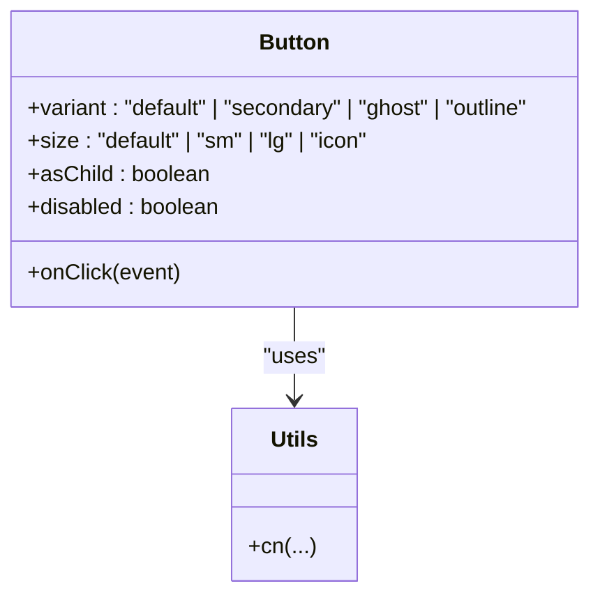

**Diagram sources**
- [button.tsx:31-46](file://src/components/ui/button.tsx#L31-L46)
- [utils.ts:5-7](file://src/lib/utils.ts#L5-L7)

**Section sources**
- [button.tsx:7-47](file://src/components/ui/button.tsx#L7-L47)

### Input
- Purpose: Styled base input with focus-visible ring and placeholder styling
- Validation integration: Works with standard form libraries; apply error classes via className
- Accessibility: Inherits native input semantics; supports disabled state

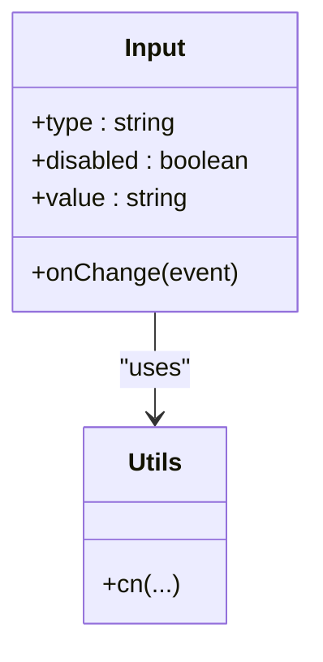

**Diagram sources**
- [input.tsx:5-22](file://src/components/ui/input.tsx#L5-L22)
- [utils.ts:5-7](file://src/lib/utils.ts#L5-L7)

**Section sources**
- [input.tsx:1-23](file://src/components/ui/input.tsx#L1-L23)

### Select
- Purpose: Accessible single/multi-select with scrollable viewport and indicator
- Composition: Root, Trigger, Content, Viewport, Item, Label, Separator, Scroll buttons
- Controlled usage: Wrap children with Value and manage selection externally
- Uncontrolled usage: Use Value with a name prop to bind to a form

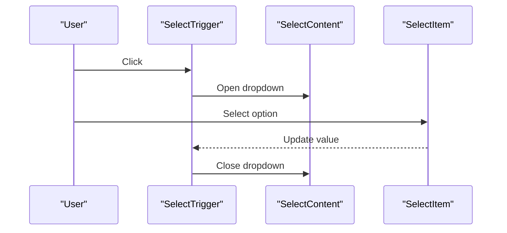

**Diagram sources**
- [select.tsx:9-144](file://src/components/ui/select.tsx#L9-L144)

**Section sources**
- [select.tsx:1-145](file://src/components/ui/select.tsx#L1-L145)

### Dropdown Menu
- Purpose: Contextual menus with groups, checkboxes, radios, and submenus
- Positioning: Side-aware slide-in animations and transform origins
- Keyboard navigation: Arrow keys move focus; Enter activates; Escape closes
- Trigger mechanisms: Supports nested submenus and separators

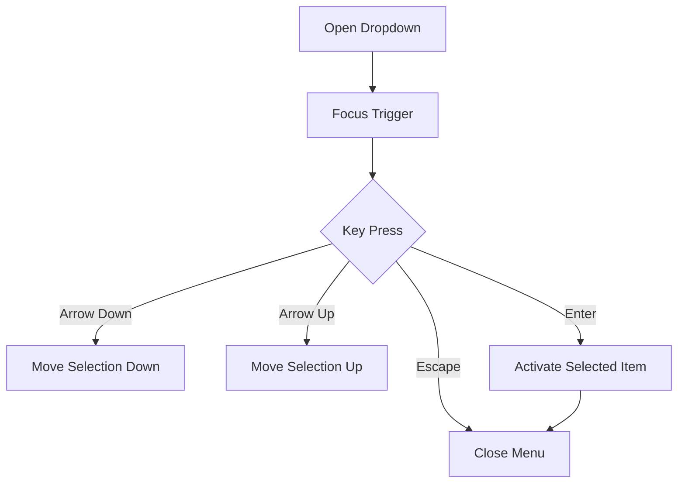

**Diagram sources**
- [dropdown-menu.tsx:34-52](file://src/components/ui/dropdown-menu.tsx#L34-L52)

**Section sources**
- [dropdown-menu.tsx:1-258](file://src/components/ui/dropdown-menu.tsx#L1-L258)

### ToastProvider
- Purpose: Non-blocking notifications with auto-dismiss and manual dismissal
- Types: success, error, info with distinct icons and borders
- Positioning: Fixed top-right stack with spring animation
- Dismissal: Close button and automatic removal after a delay

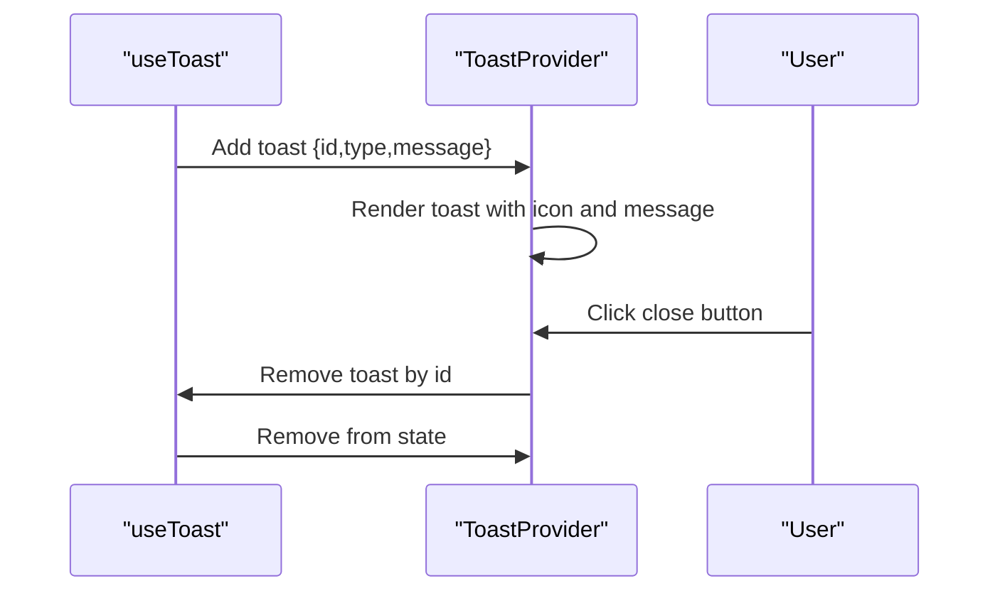

**Diagram sources**
- [ToastProvider.tsx:28-65](file://src/components/ui/ToastProvider.tsx#L28-L65)
- [useToast.ts:17-36](file://src/lib/store/useToast.ts#L17-L36)

**Section sources**
- [ToastProvider.tsx:1-66](file://src/components/ui/ToastProvider.tsx#L1-L66)
- [useToast.ts:1-36](file://src/lib/store/useToast.ts#L1-L36)

### CommandPalette
- Purpose: Application-wide command hub with search and keyboard navigation
- Commands: Static actions plus dynamic deck commands fetched from API
- Shortcuts: Ctrl/Cmd+K to toggle; Up/Down/Enter/Escape for navigation
- Execution: Invokes router actions; closes on selection

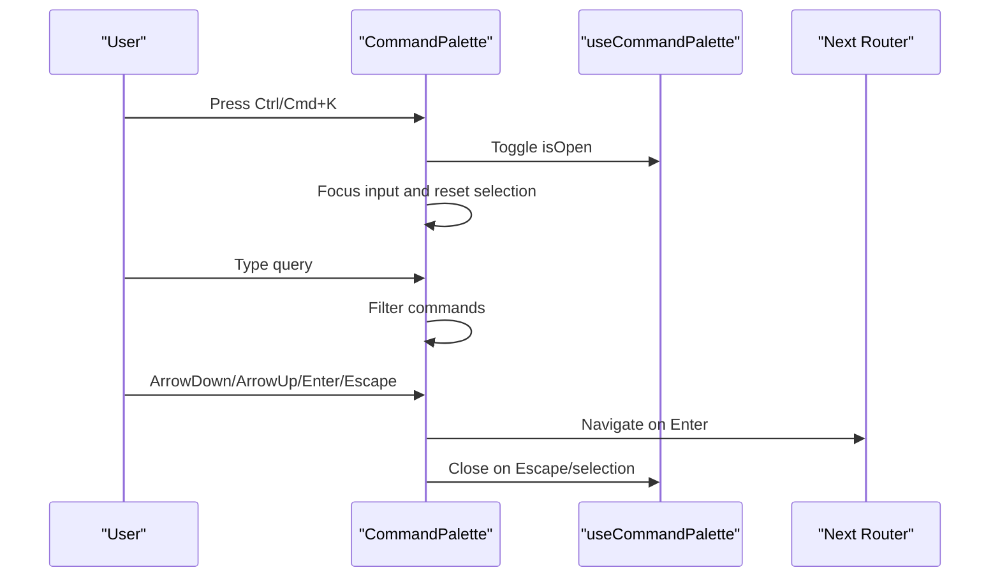

**Diagram sources**
- [CommandPalette.tsx:32-194](file://src/components/ui/CommandPalette.tsx#L32-L194)
- [useCommandPalette.ts:10-15](file://src/lib/store/useCommandPalette.ts#L10-L15)

**Section sources**
- [CommandPalette.tsx:1-195](file://src/components/ui/CommandPalette.tsx#L1-L195)
- [useCommandPalette.ts:1-15](file://src/lib/store/useCommandPalette.ts#L1-L15)

### Shared Components

#### EmptyState
- Purpose: Present friendly empty states with optional call-to-action
- Integration: Uses Button asChild to wrap a Link

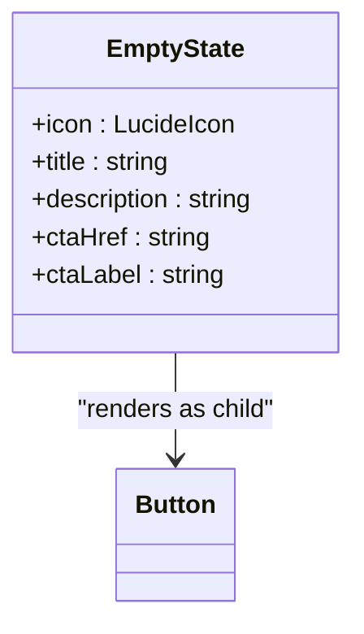

**Diagram sources**
- [EmptyState.tsx:6-27](file://src/components/shared/EmptyState.tsx#L6-L27)
- [button.tsx:31-46](file://src/components/ui/button.tsx#L31-L46)

**Section sources**
- [EmptyState.tsx:1-28](file://src/components/shared/EmptyState.tsx#L1-L28)

#### Skeleton
- Purpose: Loading placeholders with animated shimmer
- Integration: Apply className to wrap content during async loads

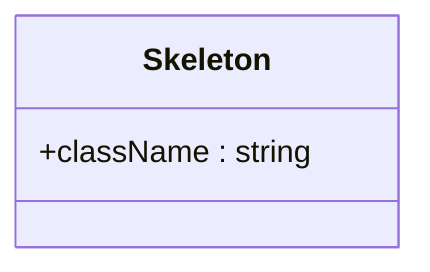

**Diagram sources**
- [Skeleton.tsx:3-9](file://src/components/shared/Skeleton.tsx#L3-L9)

**Section sources**
- [Skeleton.tsx:1-10](file://src/components/shared/Skeleton.tsx#L1-L10)

#### CountUp
- Purpose: Animated numeric counters for metrics and stats
- Integration: Pass target value and optional duration; render returned span

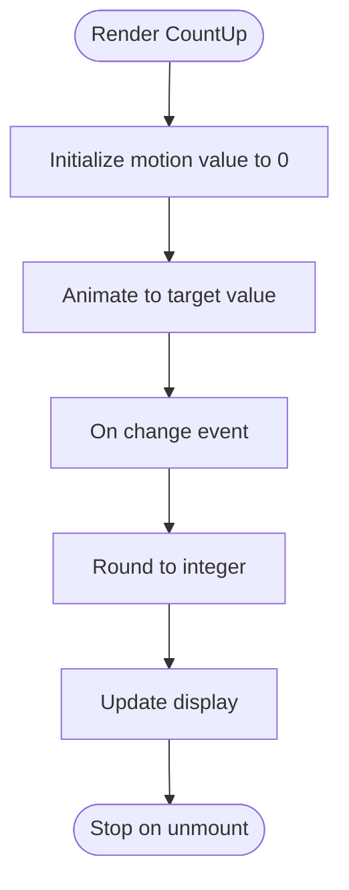

**Diagram sources**
- [CountUp.tsx:12-30](file://src/components/shared/CountUp.tsx#L12-L30)

**Section sources**
- [CountUp.tsx:1-31](file://src/components/shared/CountUp.tsx#L1-L31)

## Dependency Analysis
- Component coupling
  - UI components depend on Radix UI primitives and a shared cn utility
  - ToastProvider and CommandPalette depend on Zustand stores
- Cohesion
  - Each component encapsulates its own styling and behavior
- External dependencies
  - class-variance-authority for variants
  - @radix-ui/react-* for accessible primitives
  - framer-motion for animations
  - lucide-react for icons
  - zustand for state

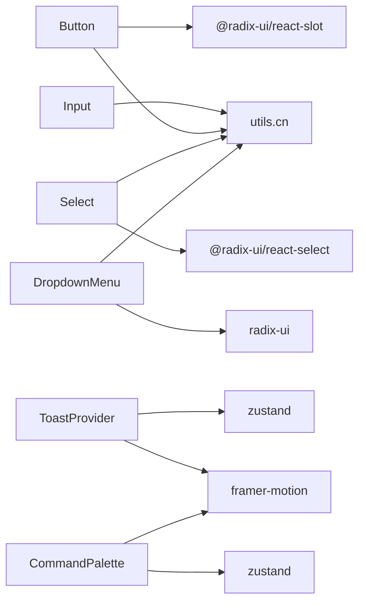

**Diagram sources**
- [button.tsx:1-6](file://src/components/ui/button.tsx#L1-L6)
- [input.tsx:1-4](file://src/components/ui/input.tsx#L1-L4)
- [select.tsx:1-8](file://src/components/ui/select.tsx#L1-L8)
- [dropdown-menu.tsx:1-8](file://src/components/ui/dropdown-menu.tsx#L1-L8)
- [ToastProvider.tsx:1-6](file://src/components/ui/ToastProvider.tsx#L1-L6)
- [CommandPalette.tsx:1-6](file://src/components/ui/CommandPalette.tsx#L1-L6)
- [utils.ts:5-7](file://src/lib/utils.ts#L5-L7)
- [useToast.ts:1-1](file://src/lib/store/useToast.ts#L1-L1)
- [useCommandPalette.ts:1-1](file://src/lib/store/useCommandPalette.ts#L1-L1)

**Section sources**
- [button.tsx:1-47](file://src/components/ui/button.tsx#L1-L47)
- [input.tsx:1-23](file://src/components/ui/input.tsx#L1-L23)
- [select.tsx:1-145](file://src/components/ui/select.tsx#L1-L145)
- [dropdown-menu.tsx:1-258](file://src/components/ui/dropdown-menu.tsx#L1-L258)
- [ToastProvider.tsx:1-66](file://src/components/ui/ToastProvider.tsx#L1-L66)
- [CommandPalette.tsx:1-195](file://src/components/ui/CommandPalette.tsx#L1-L195)
- [utils.ts:1-34](file://src/lib/utils.ts#L1-L34)
- [useToast.ts:1-36](file://src/lib/store/useToast.ts#L1-L36)
- [useCommandPalette.ts:1-15](file://src/lib/store/useCommandPalette.ts#L1-L15)

## Performance Considerations
- Prefer controlled components for large lists (Select viewport) to avoid unnecessary re-renders
- Memoize computed command lists in CommandPalette to reduce filtering overhead
- Use Skeleton sparingly; consider batching shimmer animations for long lists
- Keep ToastProvider mounted at the app root to minimize re-mount churn
- Use CountUp for frequently updating metrics to avoid excessive re-renders

## Troubleshooting Guide
- Button focus ring not visible
  - Ensure focus-visible styles are not overridden; verify Tailwind configuration
- Select dropdown not opening
  - Confirm Trigger is wrapped inside Root and Portal is present
- Dropdown menu keyboard navigation not working
  - Verify items are within Content and not disabled
- Toast not dismissing
  - Check that removeToast is called with the correct id and that the store is initialized
- CommandPalette not toggling
  - Ensure global shortcut handler is attached and useCommandPalette isOpen state updates

**Section sources**
- [ToastProvider.tsx:28-65](file://src/components/ui/ToastProvider.tsx#L28-L65)
- [useToast.ts:17-36](file://src/lib/store/useToast.ts#L17-L36)
- [CommandPalette.tsx:76-95](file://src/components/ui/CommandPalette.tsx#L76-L95)
- [useCommandPalette.ts:10-15](file://src/lib/store/useCommandPalette.ts#L10-L15)

## Conclusion
The design system provides a cohesive set of accessible, customizable UI primitives. By leveraging Radix UI, class-variance-authority, and Zustand, components remain composable, testable, and maintainable. The shared components enhance ergonomics for common patterns like empty states, loading placeholders, and animated counters.

## Appendices

### Usage Examples and Integration Patterns
- Button
  - Variant and size: pass variant and size props; use asChild for Link integration
  - Accessibility: rely on focus-visible ring; avoid overriding disabled pointer-events
  - Reference: [button.tsx:31-46](file://src/components/ui/button.tsx#L31-L46)

- Input
  - Validation: apply error classes via className; pair with form libraries
  - Integration: use standard onChange/onBlur handlers
  - Reference: [input.tsx:5-22](file://src/components/ui/input.tsx#L5-L22)

- Select
  - Controlled: use Value with a controlled selected value
  - Uncontrolled: use Value without a controlled value for form submission
  - Reference: [select.tsx:9-144](file://src/components/ui/select.tsx#L9-L144)

- Dropdown Menu
  - Trigger: wrap actionable elements with Trigger
  - Submenus: nest Sub and SubContent for hierarchical actions
  - Reference: [dropdown-menu.tsx:23-52](file://src/components/ui/dropdown-menu.tsx#L23-L52)

- ToastProvider
  - Add to app root; dispatch toasts via useToast.addToast(message, type)
  - Reference: [ToastProvider.tsx:28-65](file://src/components/ui/ToastProvider.tsx#L28-L65), [useToast.ts:17-36](file://src/lib/store/useToast.ts#L17-L36)

- CommandPalette
  - Mount globally; toggle via useCommandPalette.toggle()
  - Reference: [CommandPalette.tsx:32-194](file://src/components/ui/CommandPalette.tsx#L32-L194), [useCommandPalette.ts:10-15](file://src/lib/store/useCommandPalette.ts#L10-L15)

- EmptyState
  - Provide icon, title, description; optionally CTA with asChild Link
  - Reference: [EmptyState.tsx:14-27](file://src/components/shared/EmptyState.tsx#L14-L27)

- Skeleton
  - Wrap content blocks during async operations
  - Reference: [Skeleton.tsx:7-9](file://src/components/shared/Skeleton.tsx#L7-L9)

- CountUp
  - Pass numeric value and optional duration; render returned span
  - Reference: [CountUp.tsx:12-30](file://src/components/shared/CountUp.tsx#L12-L30)