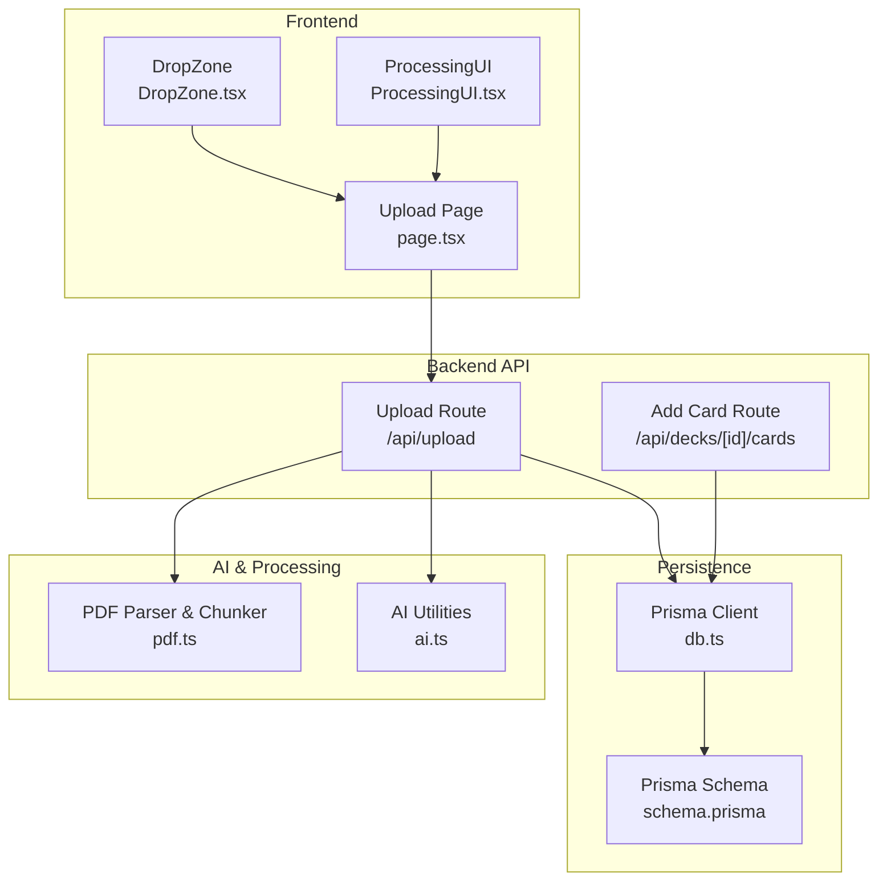
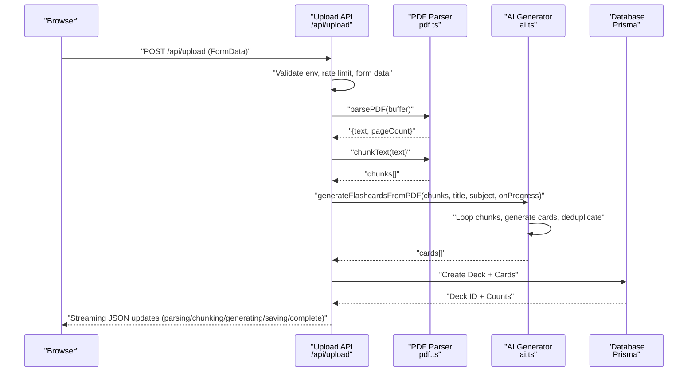
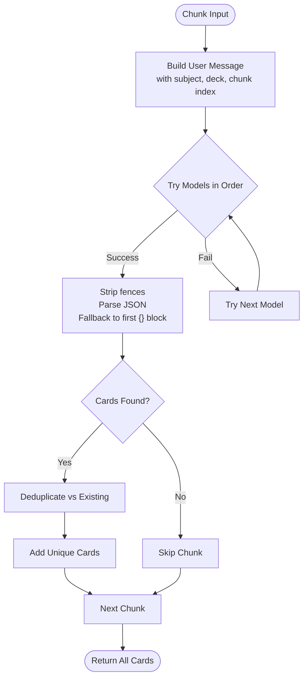
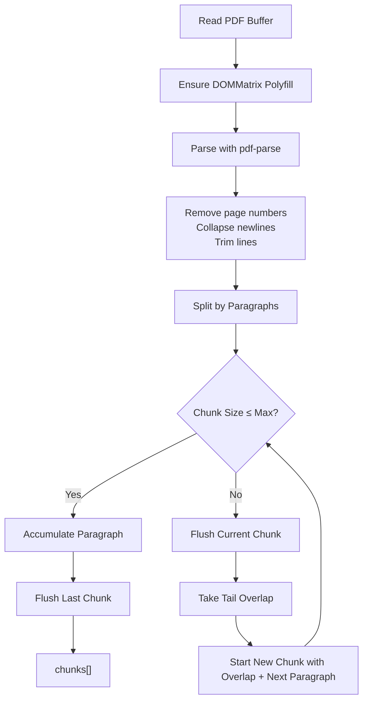
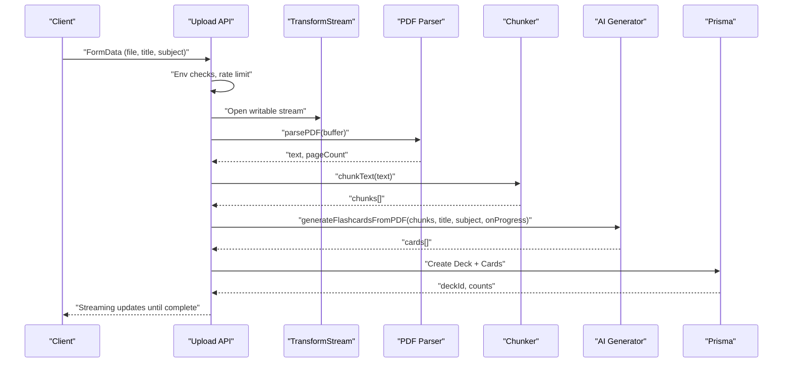
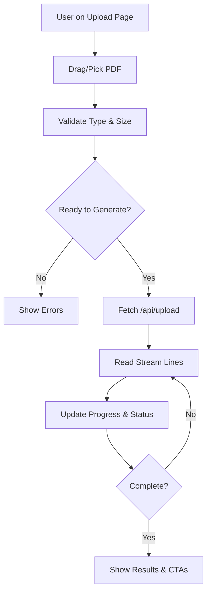
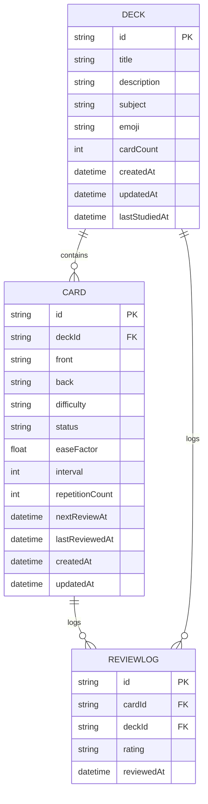
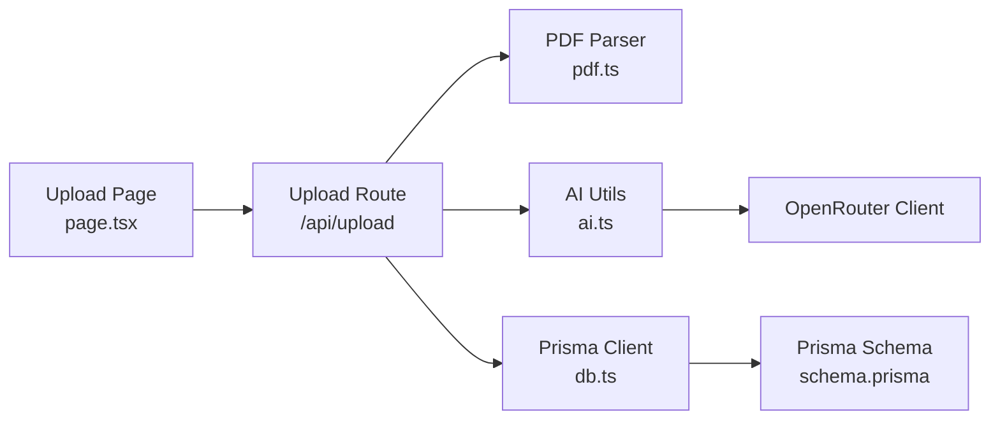

# AI-Powered Flashcard Generation

<cite>
**Referenced Files in This Document**
- [ai.ts](file://src/lib/ai.ts)
- [route.ts](file://src/app/api/upload/route.ts)
- [pdf.ts](file://src/lib/pdf.ts)
- [constants.ts](file://src/lib/constants.ts)
- [db.ts](file://src/lib/db.ts)
- [schema.prisma](file://prisma/schema.prisma)
- [page.tsx](file://src/app/upload/page.tsx)
- [DropZone.tsx](file://src/components/upload/DropZone.tsx)
- [ProcessingUI.tsx](file://src/components/upload/ProcessingUI.tsx)
- [route.ts](file://src/app/api/decks/[id]/cards/route.ts)
</cite>

## Table of Contents
1. [Introduction](#introduction)
2. [Project Structure](#project-structure)
3. [Core Components](#core-components)
4. [Architecture Overview](#architecture-overview)
5. [Detailed Component Analysis](#detailed-component-analysis)
6. [Dependency Analysis](#dependency-analysis)
7. [Performance Considerations](#performance-considerations)
8. [Troubleshooting Guide](#troubleshooting-guide)
9. [Conclusion](#conclusion)

## Introduction
This document explains the AI-powered flashcard generation system that transforms uploaded PDFs into spaced-repetition flashcards. The system integrates with OpenRouter/OpenAI-compatible APIs, applies structured prompt engineering, processes content through intelligent chunking, and delivers streaming progress updates. It includes robust error handling, rate limiting, duplicate detection, and fallback strategies for API availability.

## Project Structure
The system spans frontend upload and processing, backend API endpoints, AI generation utilities, PDF parsing and chunking, and persistent storage via Prisma/PostgreSQL.

**Diagram sources**
- [page.tsx:1-504](file://src/app/upload/page.tsx#L1-L504)
- [DropZone.tsx:1-100](file://src/components/upload/DropZone.tsx#L1-L100)
- [ProcessingUI.tsx:1-53](file://src/components/upload/ProcessingUI.tsx#L1-L53)
- [route.ts:1-298](file://src/app/api/upload/route.ts#L1-L298)
- [route.ts:1-40](file://src/app/api/decks/[id]/cards/route.ts#L1-L40)
- [ai.ts:1-233](file://src/lib/ai.ts#L1-L233)
- [pdf.ts:1-112](file://src/lib/pdf.ts#L1-L112)
- [db.ts:1-68](file://src/lib/db.ts#L1-L68)
- [schema.prisma:1-51](file://prisma/schema.prisma#L1-L51)

**Section sources**
- [page.tsx:1-504](file://src/app/upload/page.tsx#L1-L504)
- [route.ts:1-298](file://src/app/api/upload/route.ts#L1-L298)
- [ai.ts:1-233](file://src/lib/ai.ts#L1-L233)
- [pdf.ts:1-112](file://src/lib/pdf.ts#L1-L112)
- [db.ts:1-68](file://src/lib/db.ts#L1-L68)
- [schema.prisma:1-51](file://prisma/schema.prisma#L1-L51)

## Core Components
- AI Generation Engine: Implements system prompts, model fallbacks, JSON extraction, and duplicate detection.
- PDF Processing Pipeline: Parses PDFs, cleans text, and splits into overlapping chunks optimized for AI consumption.
- Streaming Upload API: Orchestrates parsing, chunking, AI generation, deduplication, and persistence with real-time progress.
- Frontend Upload Experience: Handles file selection, validation, streaming updates, and success/error states.
- Persistence Layer: Stores decks and cards with spaced-repetition fields and integrates with PostgreSQL via Prisma.

Key responsibilities:
- Prompt Engineering: System prompt defines categories, quality rules, and strict JSON output expectations.
- Content Processing: Paragraph-aware chunking with overlap to preserve context.
- Streaming Progress: Real-time updates for parsing, chunking, generation, and saving stages.
- Error Handling: Public error messages for API keys, rate limits, model availability, and database connectivity.
- Duplicate Detection: Normalized front text comparison to prevent redundant cards.

**Section sources**
- [ai.ts:27-153](file://src/lib/ai.ts#L27-L153)
- [pdf.ts:67-111](file://src/lib/pdf.ts#L67-L111)
- [route.ts:164-297](file://src/app/api/upload/route.ts#L164-L297)
- [page.tsx:84-177](file://src/app/upload/page.tsx#L84-L177)

## Architecture Overview
The end-to-end flow is a streaming pipeline: frontend uploads a PDF, backend parses and chunks the text, generates flashcards via AI with fallback models, deduplicates results, persists to the database, and streams progress updates to the client.

**Diagram sources**
- [route.ts:86-297](file://src/app/api/upload/route.ts#L86-L297)
- [pdf.ts:13-61](file://src/lib/pdf.ts#L13-L61)
- [pdf.ts:67-111](file://src/lib/pdf.ts#L67-L111)
- [ai.ts:168-232](file://src/lib/ai.ts#L168-L232)
- [db.ts:51-67](file://src/lib/db.ts#L51-L67)

## Detailed Component Analysis

### AI Generation Engine
Implements:
- OpenRouter client initialization with lazy instantiation.
- System prompt with explicit categories, quality rules, and strict JSON output requirement.
- Multi-model fallback strategy for resilience.
- Robust JSON parsing with fenced code block stripping and regex extraction.
- Duplicate detection using normalized front text slices.
- Controlled pacing to respect free-tier rate limits.

**Diagram sources**
- [ai.ts:76-153](file://src/lib/ai.ts#L76-L153)
- [ai.ts:168-232](file://src/lib/ai.ts#L168-L232)

**Section sources**
- [ai.ts:8-24](file://src/lib/ai.ts#L8-L24)
- [ai.ts:53-74](file://src/lib/ai.ts#L53-L74)
- [ai.ts:93-125](file://src/lib/ai.ts#L93-L125)
- [ai.ts:127-153](file://src/lib/ai.ts#L127-L153)
- [ai.ts:155-163](file://src/lib/ai.ts#L155-L163)
- [ai.ts:168-232](file://src/lib/ai.ts#L168-L232)

### PDF Parsing and Chunking
- Cleans page numbers and standalone digits.
- Collapses excessive newlines and trims whitespace.
- Splits text into overlapping chunks at paragraph boundaries.
- Maintains context across chunk boundaries with overlap.

**Diagram sources**
- [pdf.ts:13-61](file://src/lib/pdf.ts#L13-L61)
- [pdf.ts:67-111](file://src/lib/pdf.ts#L67-L111)

**Section sources**
- [pdf.ts:13-61](file://src/lib/pdf.ts#L13-L61)
- [pdf.ts:67-111](file://src/lib/pdf.ts#L67-L111)

### Upload API Pipeline
- Validates environment variables early.
- Enforces per-IP rate limiting.
- Streams progress updates using newline-delimited JSON.
- Applies public error mapping for API and infrastructure issues.
- Final deduplication and Prisma creation of deck and cards.

**Diagram sources**
- [route.ts:86-297](file://src/app/api/upload/route.ts#L86-L297)
- [pdf.ts:13-61](file://src/lib/pdf.ts#L13-L61)
- [pdf.ts:67-111](file://src/lib/pdf.ts#L67-L111)
- [ai.ts:168-232](file://src/lib/ai.ts#L168-L232)
- [db.ts:51-67](file://src/lib/db.ts#L51-L67)

**Section sources**
- [route.ts:86-106](file://src/app/api/upload/route.ts#L86-L106)
- [route.ts:108-115](file://src/app/api/upload/route.ts#L108-L115)
- [route.ts:164-297](file://src/app/api/upload/route.ts#L164-L297)

### Frontend Upload Experience
- Drag-and-drop file selection with validation.
- Real-time progress bar and status messages.
- Streaming JSON parsing from the upload endpoint.
- Success screen with confetti and navigation actions.

**Diagram sources**
- [page.tsx:84-177](file://src/app/upload/page.tsx#L84-L177)
- [DropZone.tsx:21-99](file://src/components/upload/DropZone.tsx#L21-L99)
- [ProcessingUI.tsx:12-52](file://src/components/upload/ProcessingUI.tsx#L12-L52)

**Section sources**
- [page.tsx:84-177](file://src/app/upload/page.tsx#L84-L177)
- [DropZone.tsx:21-99](file://src/components/upload/DropZone.tsx#L21-L99)
- [ProcessingUI.tsx:12-52](file://src/components/upload/ProcessingUI.tsx#L12-L52)

### Subject Classification and Emoji Mapping
- Subject-to-emoji mapping supports Mathematics, Science, History, Literature, Languages, and defaults to a brain emoji.
- Frontend subject options align with backend mapping for consistent UX.

**Section sources**
- [ai.ts:41-50](file://src/lib/ai.ts#L41-L50)
- [constants.ts:1-17](file://src/lib/constants.ts#L1-L17)

### Spaced Repetition Data Model
Decks and cards include fields supporting spaced repetition scheduling and status tracking.

**Diagram sources**
- [schema.prisma:10-50](file://prisma/schema.prisma#L10-L50)

**Section sources**
- [schema.prisma:10-50](file://prisma/schema.prisma#L10-L50)
- [db.ts:51-67](file://src/lib/db.ts#L51-L67)

## Dependency Analysis
- Frontend depends on Next.js routing and React state for upload flow.
- Backend routes depend on:
  - OpenRouter client for AI generation.
  - PDF parsing library for text extraction.
  - Prisma client for database operations.
- AI utilities encapsulate prompt logic and model fallbacks.
- PDF utilities encapsulate parsing and chunking logic.
- Database schema defines deck/card relationships and spaced repetition fields.

**Diagram sources**
- [page.tsx:1-504](file://src/app/upload/page.tsx#L1-L504)
- [route.ts:1-298](file://src/app/api/upload/route.ts#L1-L298)
- [pdf.ts:1-112](file://src/lib/pdf.ts#L1-L112)
- [ai.ts:1-233](file://src/lib/ai.ts#L1-L233)
- [db.ts:1-68](file://src/lib/db.ts#L1-L68)
- [schema.prisma:1-51](file://prisma/schema.prisma#L1-L51)

**Section sources**
- [route.ts:1-298](file://src/app/api/upload/route.ts#L1-L298)
- [ai.ts:1-233](file://src/lib/ai.ts#L1-L233)
- [pdf.ts:1-112](file://src/lib/pdf.ts#L1-L112)
- [db.ts:1-68](file://src/lib/db.ts#L1-L68)
- [schema.prisma:1-51](file://prisma/schema.prisma#L1-L51)

## Performance Considerations
- Chunk sizing: Paragraph-aware splitting with overlap preserves context while managing token limits.
- Request pacing: Delays between chunk generations mitigate free-tier rate limits.
- Retry strategy: Single retry with backoff for transient failures.
- JSON parsing robustness: Fenced code block removal and regex extraction improve reliability.
- Streaming: Progressive updates reduce perceived latency and enable responsive UI.

[No sources needed since this section provides general guidance]

## Troubleshooting Guide
Common issues and their resolution:
- Missing environment variables:
  - OPENROUTER_API_KEY: Set the API key to enable AI generation.
  - DATABASE_URL: Ensure the database URL is configured for Prisma.
- Rate limit errors:
  - Free-tier quotas trigger 429 responses; the UI displays a friendly message advising to wait.
- Model unavailability:
  - When models are not found or unavailable, the system falls back to alternate models and surfaces a retry message.
- Database connectivity:
  - Prisma-related errors map to a clear message instructing to verify the database URL.
- Scanned/image-based PDFs:
  - If extracted text is below a threshold, the pipeline reports insufficient readable text.

Operational tips:
- Use text-based PDFs for best results.
- Monitor streaming progress for early failure signals.
- Retry generation after waiting for rate limit windows.

**Section sources**
- [route.ts:11-63](file://src/app/api/upload/route.ts#L11-L63)
- [route.ts:87-106](file://src/app/api/upload/route.ts#L87-L106)
- [route.ts:179-189](file://src/app/api/upload/route.ts#L179-L189)
- [ai.ts:93-125](file://src/lib/ai.ts#L93-L125)

## Conclusion
The system provides a robust, streaming pipeline for converting PDFs into spaced-repetition flashcards. Its prompt engineering, chunking strategy, and fallback mechanisms ensure reliable operation under free-tier constraints. The frontend delivers immediate feedback, while the backend safeguards against common infrastructure pitfalls. Extending the system can focus on prompt refinement, model selection, and incremental improvements to chunking and deduplication.