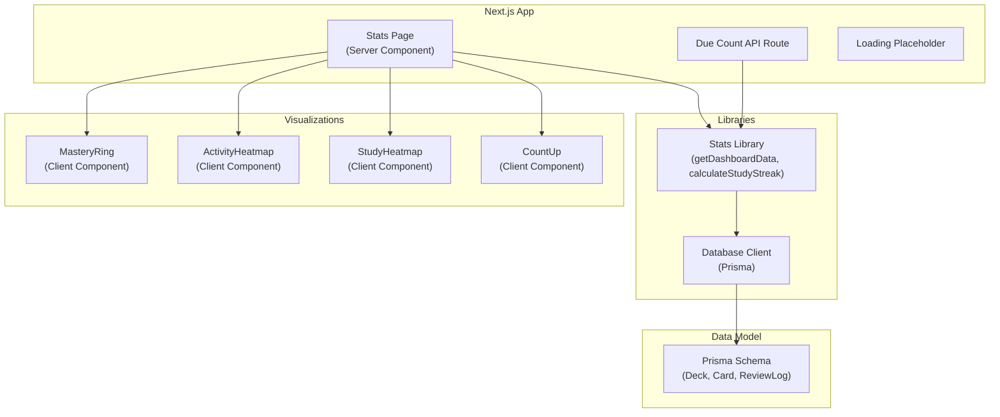
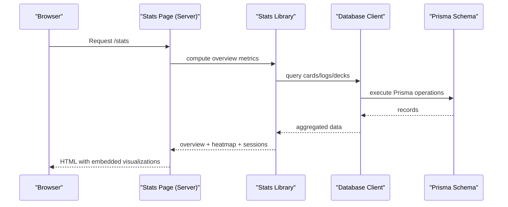
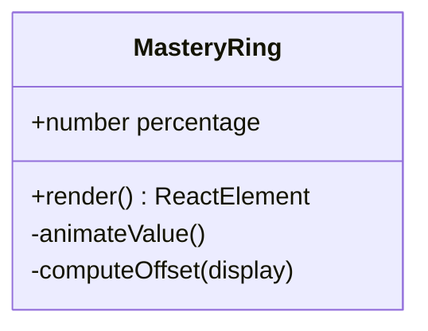
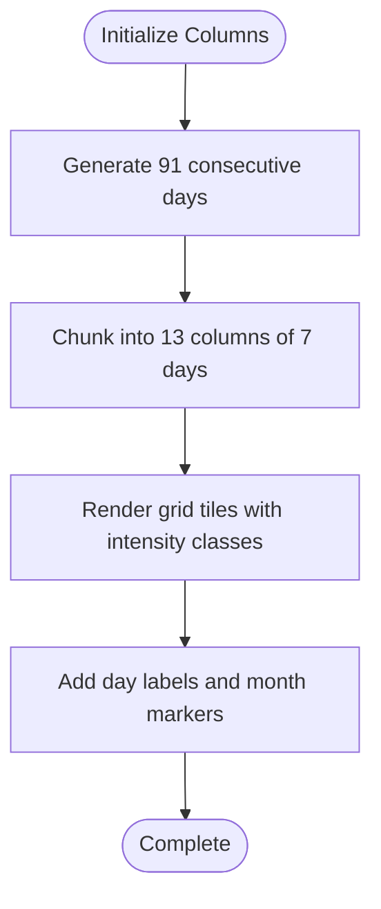
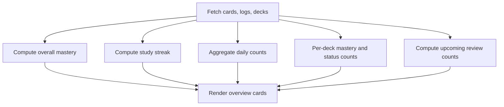
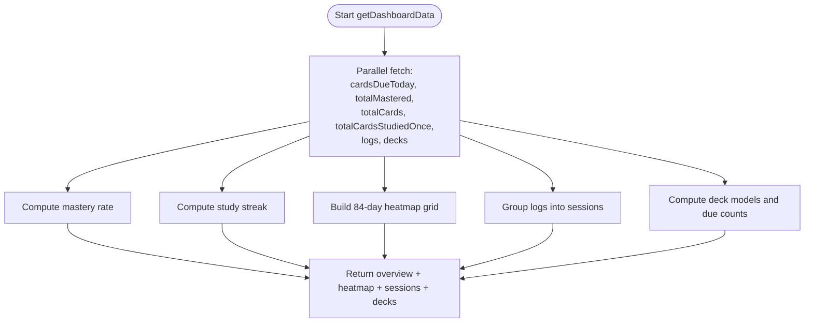
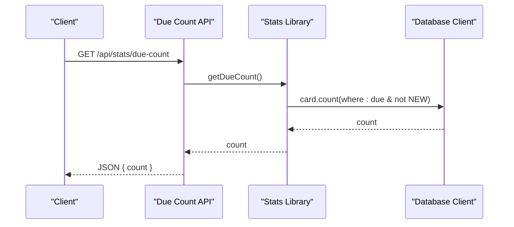
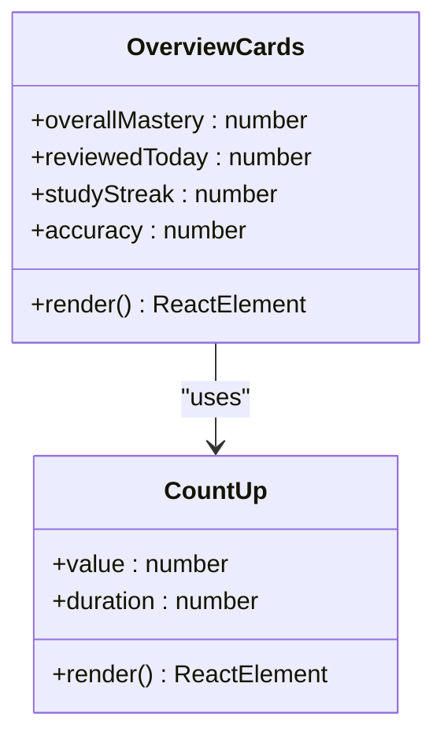
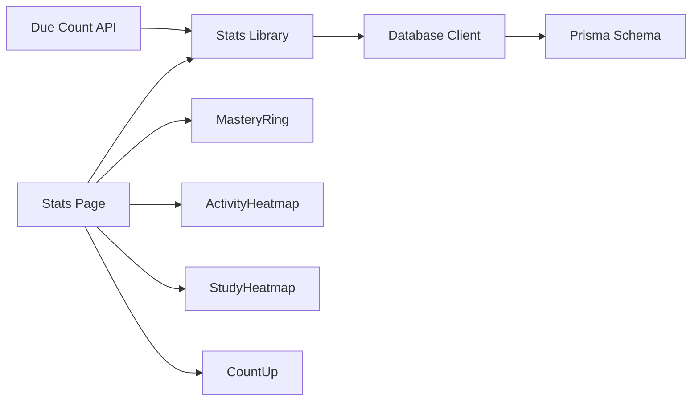
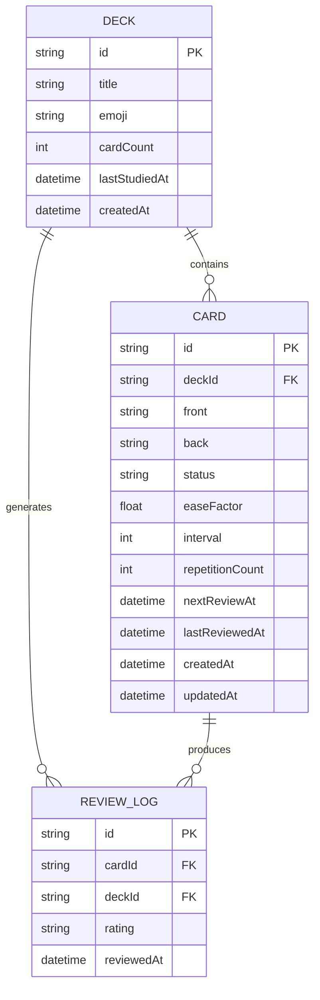

# Analytics and Statistics Dashboard

<cite>
**Referenced Files in This Document**
- [src/app/stats/page.tsx](file://src/app/stats/page.tsx)
- [src/components/stats/MasteryRing.tsx](file://src/components/stats/MasteryRing.tsx)
- [src/components/stats/ActivityHeatmap.tsx](file://src/components/stats/ActivityHeatmap.tsx)
- [src/components/shared/StudyHeatmap.tsx](file://src/components/shared/StudyHeatmap.tsx)
- [src/lib/stats.ts](file://src/lib/stats.ts)
- [src/app/api/stats/due-count/route.ts](file://src/app/api/stats/due-count/route.ts)
- [src/lib/db.ts](file://src/lib/db.ts)
- [src/app/stats/loading.tsx](file://src/app/stats/loading.tsx)
- [src/components/shared/CountUp.tsx](file://src/components/shared/CountUp.tsx)
- [prisma/schema.prisma](file://prisma/schema.prisma)
- [src/utils/supabase/middleware.ts](file://src/utils/supabase/middleware.ts)
- [src/utils/supabase/server.ts](file://src/utils/supabase/server.ts)
- [src/utils/supabase/client.ts](file://src/utils/supabase/client.ts)
</cite>

## Table of Contents
1. [Introduction](#introduction)
2. [Project Structure](#project-structure)
3. [Core Components](#core-components)
4. [Architecture Overview](#architecture-overview)
5. [Detailed Component Analysis](#detailed-component-analysis)
6. [Dependency Analysis](#dependency-analysis)
7. [Performance Considerations](#performance-considerations)
8. [Troubleshooting Guide](#troubleshooting-guide)
9. [Conclusion](#conclusion)
10. [Appendices](#appendices)

## Introduction
This document explains the analytics and statistics dashboard that visualizes user learning progress, activity patterns, and upcoming review workload. It covers three primary visualizations:
- Mastery ring: a radial progress indicator for overall mastery percentage
- Activity heatmaps: weekly and daily review intensity displays
- Progress tracking: overview statistics such as reviewed today, study streak, and accuracy

It also documents the statistical calculations, data aggregation methods, visualization techniques, due count tracking, overview statistics, and performance metrics. Guidance is included for interpreting trends, deriving user progress insights, integrating frontend components with backend data sources, caching strategies, and real-time update considerations.

## Project Structure
The analytics dashboard is implemented as a Next.js Server Component that fetches data at request time, computes derived metrics, and renders reusable client-side visualizations. Supporting libraries encapsulate database access and complex computations.

**Diagram sources**
- [src/app/stats/page.tsx:14-186](file://src/app/stats/page.tsx#L14-L186)
- [src/lib/stats.ts:50-221](file://src/lib/stats.ts#L50-L221)
- [src/app/api/stats/due-count/route.ts:7-14](file://src/app/api/stats/due-count/route.ts#L7-L14)
- [src/lib/db.ts:51-67](file://src/lib/db.ts#L51-L67)
- [prisma/schema.prisma:10-51](file://prisma/schema.prisma#L10-L51)

**Section sources**
- [src/app/stats/page.tsx:14-186](file://src/app/stats/page.tsx#L14-L186)
- [src/lib/stats.ts:50-221](file://src/lib/stats.ts#L50-L221)
- [src/app/api/stats/due-count/route.ts:7-14](file://src/app/api/stats/due-count/route.ts#L7-L14)
- [src/lib/db.ts:51-67](file://src/lib/db.ts#L51-L67)
- [prisma/schema.prisma:10-51](file://prisma/schema.prisma#L10-L51)

## Core Components
- Stats Page (Server Component): Orchestrates data fetching, computes overview statistics, and renders visualizations.
- Mastery Ring: Animated radial progress visualization for mastery percentage.
- Activity Heatmap: Weekly review intensity grid with color-coded intensity.
- Study Heatmap: Alternative weekly grid with month labels and tooltips.
- Stats Library: Centralizes statistical computations (streaks, due counts, heatmap grids).
- Due Count API: Exposes a JSON endpoint for current overdue review count.
- Database Client: Provides Prisma-based access with environment-aware connection selection.
- CountUp: Smooth animated numeric counters for overview metrics.

**Section sources**
- [src/app/stats/page.tsx:14-186](file://src/app/stats/page.tsx#L14-L186)
- [src/components/stats/MasteryRing.tsx:15-62](file://src/components/stats/MasteryRing.tsx#L15-L62)
- [src/components/stats/ActivityHeatmap.tsx:22-73](file://src/components/stats/ActivityHeatmap.tsx#L22-L73)
- [src/components/shared/StudyHeatmap.tsx:15-137](file://src/components/shared/StudyHeatmap.tsx#L15-L137)
- [src/lib/stats.ts:6-18](file://src/lib/stats.ts#L6-L18)
- [src/app/api/stats/due-count/route.ts:7-14](file://src/app/api/stats/due-count/route.ts#L7-L14)
- [src/lib/db.ts:51-67](file://src/lib/db.ts#L51-L67)
- [src/components/shared/CountUp.tsx:12-29](file://src/components/shared/CountUp.tsx#L12-L29)

## Architecture Overview
The dashboard follows a server-rendered pattern for analytics:
- The Stats Page performs database queries and computes derived metrics at request time.
- Client components handle animations and interactive overlays.
- A dedicated API endpoint serves the due count for external integrations or client-side polling.

**Diagram sources**
- [src/app/stats/page.tsx:14-186](file://src/app/stats/page.tsx#L14-L186)
- [src/lib/stats.ts:50-221](file://src/lib/stats.ts#L50-L221)
- [src/lib/db.ts:51-67](file://src/lib/db.ts#L51-L67)
- [prisma/schema.prisma:10-51](file://prisma/schema.prisma#L10-L51)

## Detailed Component Analysis

### Mastery Ring Visualization
The mastery ring is a client-side animated radial progress indicator that smoothly animates to the target percentage. It calculates the circumference and stroke offset to visually represent the completion ratio.

**Diagram sources**
- [src/components/stats/MasteryRing.tsx:15-62](file://src/components/stats/MasteryRing.tsx#L15-L62)

Key implementation aspects:
- Uses motion values and animation controls for smooth transitions.
- Computes circumference and stroke offset to draw the arc.
- Displays the current percentage during animation.

**Section sources**
- [src/components/stats/MasteryRing.tsx:15-62](file://src/components/stats/MasteryRing.tsx#L15-L62)

### Activity Heatmaps
Two complementary weekly heatmap visualizations present review activity over time:

- ActivityHeatmap (weekly grid):
  - Renders a 13-column grid representing 91 days.
  - Color intensity increases with review count per day.
  - Includes day-of-week labels and animated tile reveals.

- StudyHeatmap (alternative weekly grid):
  - Accepts pre-bucketed daily counts.
  - Groups 7-day columns into 12-week windows.
  - Provides month labels and interactive tooltips.

**Diagram sources**
- [src/components/stats/ActivityHeatmap.tsx:22-73](file://src/components/stats/ActivityHeatmap.tsx#L22-L73)
- [src/components/shared/StudyHeatmap.tsx:15-137](file://src/components/shared/StudyHeatmap.tsx#L15-L137)

Statistical and aggregation highlights:
- Counts are bucketed by calendar date ("yyyy-MM-dd").
- Intensity classes map counts to color levels for visual interpretation.

**Section sources**
- [src/components/stats/ActivityHeatmap.tsx:22-73](file://src/components/stats/ActivityHeatmap.tsx#L22-L73)
- [src/components/shared/StudyHeatmap.tsx:15-137](file://src/components/shared/StudyHeatmap.tsx#L15-L137)

### Progress Tracking Components
The Stats Page computes and displays key overview metrics:

- Overall Mastery: Percentage of MASTERED cards among all cards.
- Reviewed Today: Count of review logs for the current day.
- Study Streak: Consecutive calendar days with at least one review.
- Accuracy: Percentage of "good" or "easy" ratings among all reviews.
- Upcoming Reviews: Cards due today, tomorrow, and within the next week.

**Diagram sources**
- [src/app/stats/page.tsx:14-186](file://src/app/stats/page.tsx#L14-L186)

**Section sources**
- [src/app/stats/page.tsx:14-186](file://src/app/stats/page.tsx#L14-L186)

### Statistical Calculations and Data Aggregation
Centralized computation logic resides in the stats library:

- Study Streak:
  - Converts timestamps to UTC midnight dates.
  - Iteratively checks backwards from today to compute consecutive days.

- Due Count:
  - Counts cards where next review is due now or past, excluding NEW cards.

- Heatmap Data (Last 84 days):
  - Initializes a dense grid for 84 days.
  - Populates counts from review logs, ensuring all dates are represented.

- Session Grouping:
  - Groups review logs into sessions separated by >30 minutes or deck changes.
  - Computes session-level accuracy and duration.

- Deck Breakdown:
  - Aggregates per-deck counts for each status category.
  - Computes due counts for decks based on nextReviewAt.

**Diagram sources**
- [src/lib/stats.ts:50-221](file://src/lib/stats.ts#L50-L221)

**Section sources**
- [src/lib/stats.ts:6-18](file://src/lib/stats.ts#L6-L18)
- [src/lib/stats.ts:20-31](file://src/lib/stats.ts#L20-L31)
- [src/lib/stats.ts:50-221](file://src/lib/stats.ts#L50-L221)

### Due Count Tracking
The due count endpoint provides the number of cards ready for review right now (excluding NEW cards). This supports external integrations and client-side polling.

**Diagram sources**
- [src/app/api/stats/due-count/route.ts:7-14](file://src/app/api/stats/due-count/route.ts#L7-L14)
- [src/lib/stats.ts:20-31](file://src/lib/stats.ts#L20-L31)
- [src/lib/db.ts:51-67](file://src/lib/db.ts#L51-L67)

**Section sources**
- [src/app/api/stats/due-count/route.ts:7-14](file://src/app/api/stats/due-count/route.ts#L7-L14)
- [src/lib/stats.ts:20-31](file://src/lib/stats.ts#L20-L31)

### Overview Statistics and Performance Metrics
Overview cards combine computed metrics with animated counters:

- Overall Mastery: Radial ring visualization with smooth percentage animation.
- Reviewed Today: Animated counter with a small bar chart-like indicator.
- Study Streak: Animated flame counter with descriptive label.
- Accuracy: Animated percentage counter with explanatory caption.

**Diagram sources**
- [src/app/stats/page.tsx:108-144](file://src/app/stats/page.tsx#L108-L144)
- [src/components/shared/CountUp.tsx:12-29](file://src/components/shared/CountUp.tsx#L12-L29)

**Section sources**
- [src/app/stats/page.tsx:108-144](file://src/app/stats/page.tsx#L108-L144)
- [src/components/shared/CountUp.tsx:12-29](file://src/components/shared/CountUp.tsx#L12-L29)

### Data Interpretation, Trend Analysis, and User Insights
- Mastery Trends:
  - Track weekly heatmap intensities to identify study bursts and plateaus.
  - Compare per-deck mastery bars to focus retention efforts on lower-performing decks.
- Daily Habits:
  - Use streak indicators to reinforce consistency.
  - Monitor accuracy to detect recall difficulties or fatigue.
- Upcoming Workload:
  - Plan study sessions around upcoming review volumes (today/tomorrow/this week).
- Session Quality:
  - Use session grouping to evaluate study efficiency and identify optimal session lengths.

[No sources needed since this section provides general guidance]

### Frontend-Backend Integration and Real-Time Updates
- Server Component Rendering:
  - Analytics data is fetched and rendered server-side to ensure freshness and avoid client-side hydration mismatches.
- Client Components:
  - Visualizations rely on client-side animations and interactivity (hover tooltips, smooth counters).
- Supabase Integration:
  - Supabase utilities provide SSR-compatible client creation for server-side rendering and cookie handling.
- Real-Time Considerations:
  - Current implementation is request-time based. For live updates, consider client-side polling of the due count endpoint or WebSocket subscriptions.

**Section sources**
- [src/app/stats/page.tsx:11-12](file://src/app/stats/page.tsx#L11-L12)
- [src/utils/supabase/middleware.ts:7-36](file://src/utils/supabase/middleware.ts#L7-L36)
- [src/utils/supabase/server.ts:7-27](file://src/utils/supabase/server.ts#L7-L27)
- [src/utils/supabase/client.ts:6-10](file://src/utils/supabase/client.ts#L6-L10)

## Dependency Analysis
The dashboard relies on Prisma for data access and date-fns for temporal operations. Client animations leverage Framer Motion.

**Diagram sources**
- [src/app/stats/page.tsx:14-186](file://src/app/stats/page.tsx#L14-L186)
- [src/lib/stats.ts:50-221](file://src/lib/stats.ts#L50-L221)
- [src/app/api/stats/due-count/route.ts:7-14](file://src/app/api/stats/due-count/route.ts#L7-L14)
- [src/lib/db.ts:51-67](file://src/lib/db.ts#L51-L67)
- [prisma/schema.prisma:10-51](file://prisma/schema.prisma#L10-L51)

**Section sources**
- [src/app/stats/page.tsx:14-186](file://src/app/stats/page.tsx#L14-L186)
- [src/lib/stats.ts:50-221](file://src/lib/stats.ts#L50-L221)
- [src/app/api/stats/due-count/route.ts:7-14](file://src/app/api/stats/due-count/route.ts#L7-L14)
- [src/lib/db.ts:51-67](file://src/lib/db.ts#L51-L67)
- [prisma/schema.prisma:10-51](file://prisma/schema.prisma#L10-L51)

## Performance Considerations
- Request-time computation:
  - Analytics are computed per-request to ensure freshness; cache at CDN or edge if needed.
- Efficient queries:
  - Use selective field retrieval and ordering to minimize payload sizes.
- Client animations:
  - Keep animation durations reasonable to avoid blocking UI.
- Data windowing:
  - Limit heatmap windows to reduce DOM size and rendering cost.

[No sources needed since this section provides general guidance]

## Troubleshooting Guide
- Empty or stale analytics:
  - Verify database connectivity and environment variables for the database URL.
  - Confirm that review logs and cards exist for meaningful computations.
- Streak calculation anomalies:
  - Ensure timestamps are normalized to UTC midnight for accurate day comparisons.
- Heatmap gaps:
  - Confirm that all dates within the selected range are populated in the grid.
- API failures:
  - Check error handling in the due count endpoint and return fallback values.

**Section sources**
- [src/lib/db.ts:8-39](file://src/lib/db.ts#L8-L39)
- [src/lib/stats.ts:6-18](file://src/lib/stats.ts#L6-L18)
- [src/app/api/stats/due-count/route.ts:7-14](file://src/app/api/stats/due-count/route.ts#L7-L14)

## Conclusion
The analytics and statistics dashboard combines server-rendered data computation with client-side visualizations to deliver actionable insights into user learning progress. The mastery ring, activity heatmaps, and overview cards provide a comprehensive view of retention, study habits, and upcoming workload. With modular libraries and clear separation of concerns, the system is maintainable and extensible for future enhancements such as caching and real-time updates.

[No sources needed since this section summarizes without analyzing specific files]

## Appendices

### Data Model Overview

**Diagram sources**
- [prisma/schema.prisma:10-51](file://prisma/schema.prisma#L10-L51)

### Loading States
The stats page includes a skeleton-based loading placeholder to improve perceived performance during data fetch and computation.

**Section sources**
- [src/app/stats/loading.tsx:3-35](file://src/app/stats/loading.tsx#L3-L35)