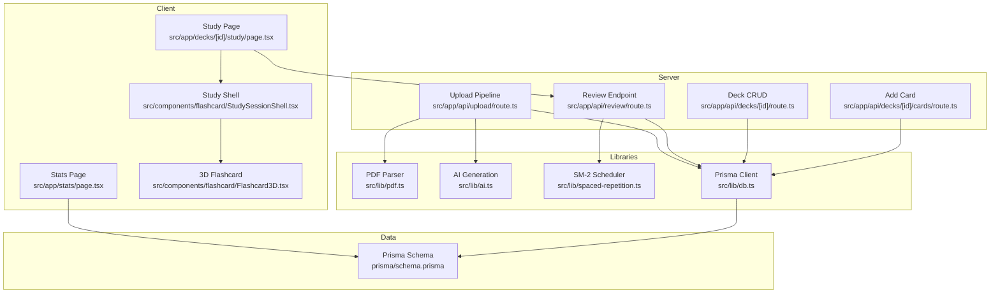
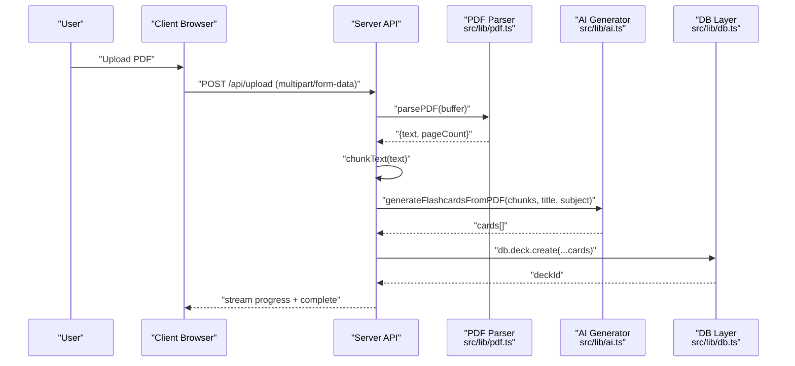
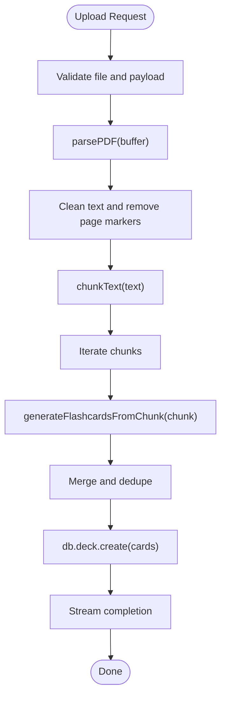
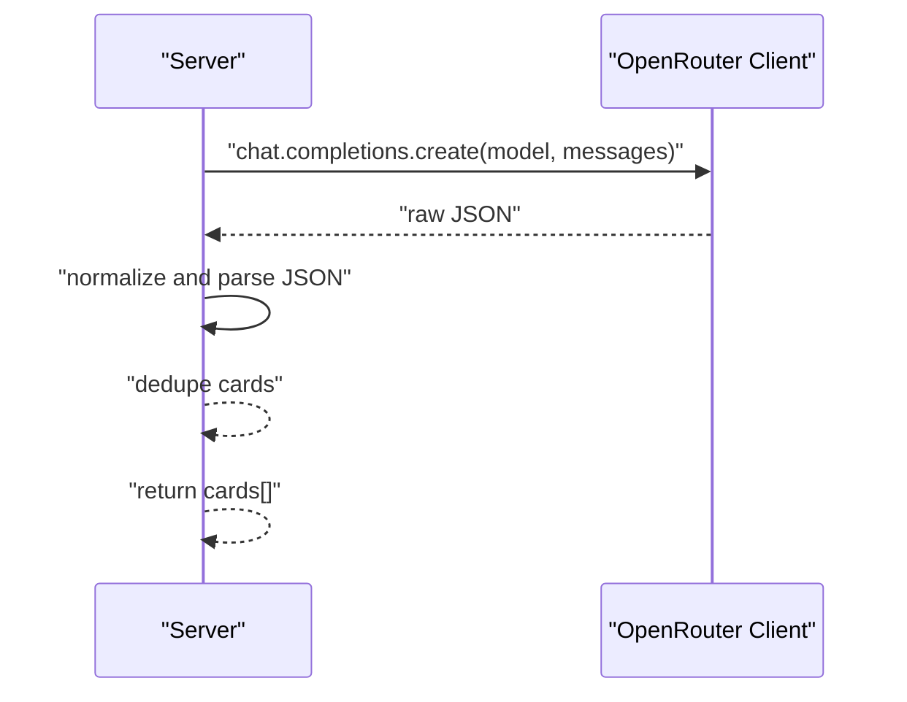
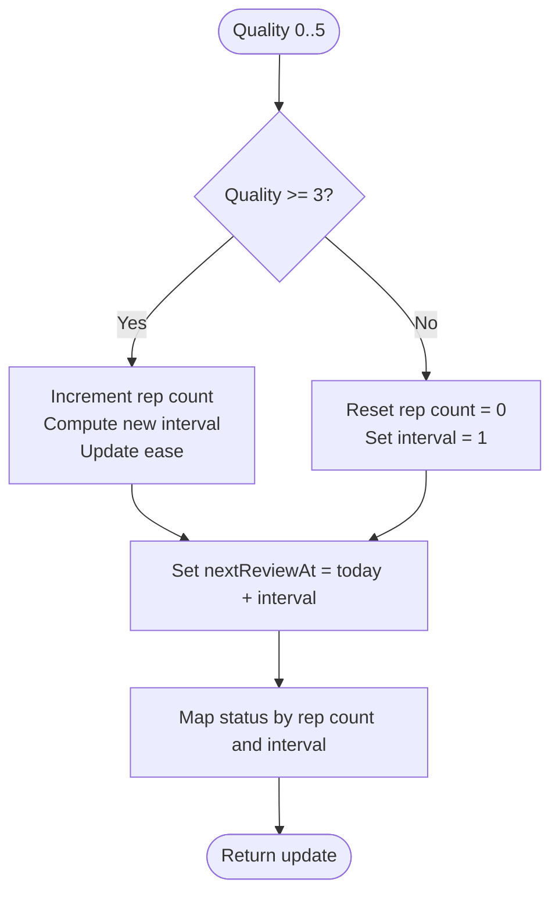
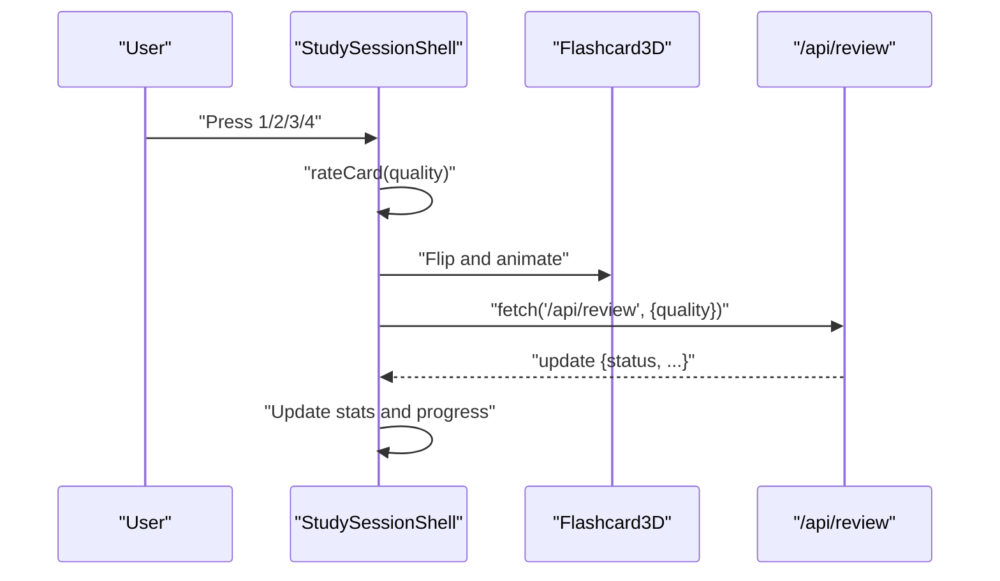
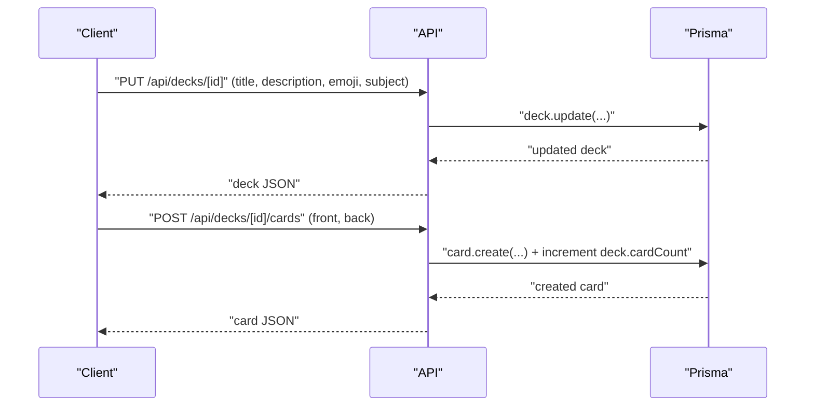
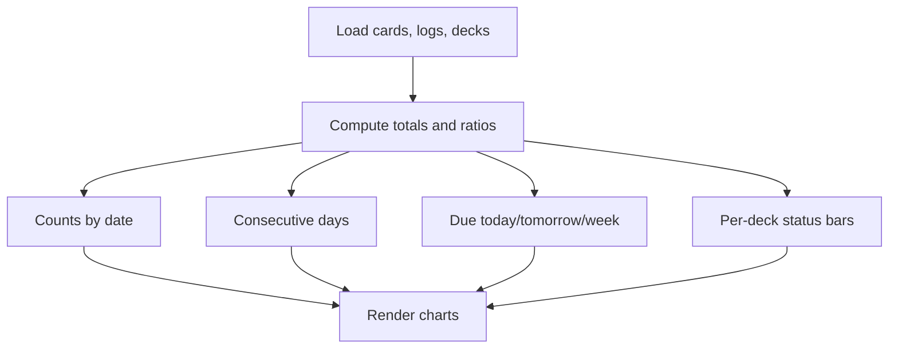
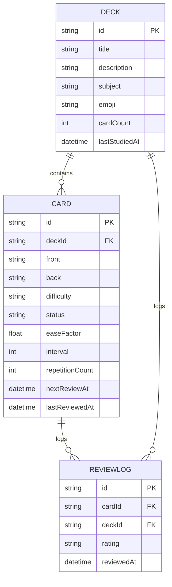

# Core Features

<cite>
**Referenced Files in This Document**
- [README.md](file://README.md)
- [package.json](file://package.json)
- [prisma/schema.prisma](file://prisma/schema.prisma)
- [src/lib/db.ts](file://src/lib/db.ts)
- [src/lib/constants.ts](file://src/lib/constants.ts)
- [src/lib/pdf.ts](file://src/lib/pdf.ts)
- [src/lib/ai.ts](file://src/lib/ai.ts)
- [src/lib/spaced-repetition.ts](file://src/lib/spaced-repetition.ts)
- [src/app/api/upload/route.ts](file://src/app/api/upload/route.ts)
- [src/app/api/review/route.ts](file://src/app/api/review/route.ts)
- [src/app/api/decks/[id]/route.ts](file://src/app/api/decks/[id]/route.ts)
- [src/app/api/decks/[id]/cards/route.ts](file://src/app/api/decks/[id]/cards/route.ts)
- [src/components/flashcard/Flashcard3D.tsx](file://src/components/flashcard/Flashcard3D.tsx)
- [src/components/flashcard/StudySessionShell.tsx](file://src/components/flashcard/StudySessionShell.tsx)
- [src/app/decks/[id]/study/page.tsx](file://src/app/decks/[id]/study/page.tsx)
- [src/app/stats/page.tsx](file://src/app/stats/page.tsx)
</cite>

## Table of Contents
1. [Introduction](#introduction)
2. [Project Structure](#project-structure)
3. [Core Components](#core-components)
4. [Architecture Overview](#architecture-overview)
5. [Detailed Component Analysis](#detailed-component-analysis)
6. [Dependency Analysis](#dependency-analysis)
7. [Performance Considerations](#performance-considerations)
8. [Troubleshooting Guide](#troubleshooting-guide)
9. [Conclusion](#conclusion)
10. [Appendices](#appendices)

## Introduction
This document explains recall’s core features and how they fit together to deliver a complete learning experience: PDF upload and processing pipeline, AI-powered flashcard generation, spaced repetition system (SM-2), study interface with 3D flashcards, deck management, and analytics dashboard. It covers implementation details, user interaction patterns, algorithmic behavior, and configuration options.

## Project Structure
recall is a Next.js 14 App Router application with:
- Server-side processing APIs under src/app/api
- Client-side study and stats pages under src/app
- Shared UI components under src/components
- Utilities for PDF parsing, AI generation, SM-2 scheduling, and database access under src/lib
- Prisma schema defining Deck, Card, and ReviewLog models

**Diagram sources**
- [src/app/decks/[id]/study/page.tsx:1-92](file://src/app/decks/[id]/study/page.tsx#L1-L92)
- [src/app/stats/page.tsx:1-187](file://src/app/stats/page.tsx#L1-L187)
- [src/components/flashcard/Flashcard3D.tsx:1-113](file://src/components/flashcard/Flashcard3D.tsx#L1-L113)
- [src/components/flashcard/StudySessionShell.tsx:1-430](file://src/components/flashcard/StudySessionShell.tsx#L1-L430)
- [src/app/api/upload/route.ts:1-298](file://src/app/api/upload/route.ts#L1-L298)
- [src/app/api/review/route.ts:1-76](file://src/app/api/review/route.ts#L1-L76)
- [src/app/api/decks/[id]/route.ts:1-43](file://src/app/api/decks/[id]/route.ts#L1-L43)
- [src/app/api/decks/[id]/cards/route.ts:1-40](file://src/app/api/decks/[id]/cards/route.ts#L1-L40)
- [src/lib/pdf.ts:1-112](file://src/lib/pdf.ts#L1-L112)
- [src/lib/ai.ts:1-233](file://src/lib/ai.ts#L1-L233)
- [src/lib/spaced-repetition.ts:1-141](file://src/lib/spaced-repetition.ts#L1-L141)
- [src/lib/db.ts:1-68](file://src/lib/db.ts#L1-L68)
- [prisma/schema.prisma:1-51](file://prisma/schema.prisma#L1-L51)

**Section sources**
- [README.md:1-102](file://README.md#L1-L102)
- [package.json](file://package.json)
- [prisma/schema.prisma:1-51](file://prisma/schema.prisma#L1-L51)

## Core Components
- PDF Upload and Processing Pipeline: Parses PDFs, cleans text, chunks content, generates flashcards via AI, deduplicates, persists decks and cards, and streams progress.
- AI-Powered Flashcard Generation: Uses OpenRouter-compatible clients to generate structured flashcards per chunk with difficulty labels.
- Spaced Repetition System (SM-2): Implements the SM-2 algorithm for scheduling reviews, mapping quality ratings to updates in ease, interval, repetition count, and status.
- Study Interface with 3D Flashcards: Interactive study shell with keyboard controls, animated flip transitions, and rating-based review submission.
- Deck Management: Create, update, delete decks; add individual cards; maintain card counts.
- Analytics Dashboard: Aggregates mastery, upcoming reviews, streaks, and per-deck breakdowns.

**Section sources**
- [src/app/api/upload/route.ts:1-298](file://src/app/api/upload/route.ts#L1-L298)
- [src/lib/ai.ts:1-233](file://src/lib/ai.ts#L1-L233)
- [src/lib/pdf.ts:1-112](file://src/lib/pdf.ts#L1-L112)
- [src/lib/spaced-repetition.ts:1-141](file://src/lib/spaced-repetition.ts#L1-L141)
- [src/components/flashcard/StudySessionShell.tsx:1-430](file://src/components/flashcard/StudySessionShell.tsx#L1-L430)
- [src/components/flashcard/Flashcard3D.tsx:1-113](file://src/components/flashcard/Flashcard3D.tsx#L1-L113)
- [src/app/api/decks/[id]/route.ts:1-43](file://src/app/api/decks/[id]/route.ts#L1-L43)
- [src/app/api/decks/[id]/cards/route.ts:1-40](file://src/app/api/decks/[id]/cards/route.ts#L1-L40)
- [src/app/stats/page.tsx:1-187](file://src/app/stats/page.tsx#L1-L187)

## Architecture Overview
The system integrates client and server components around a PostgreSQL-backed Prisma data model. The upload pipeline runs server-side with streaming progress, while the study session runs client-side with optimistic UI updates and server-side persistence of reviews.

**Diagram sources**
- [src/app/api/upload/route.ts:164-297](file://src/app/api/upload/route.ts#L164-L297)
- [src/lib/pdf.ts:13-61](file://src/lib/pdf.ts#L13-L61)
- [src/lib/ai.ts:168-232](file://src/lib/ai.ts#L168-L232)
- [src/lib/db.ts:51-63](file://src/lib/db.ts#L51-L63)

## Detailed Component Analysis

### PDF Upload and Processing Pipeline
- Responsibilities:
  - Validate file type and size
  - Parse PDF to text, clean, and chunk
  - Stream progress to the client
  - Generate flashcards per chunk via AI
  - Deduplicate cards and persist deck with cards
  - Apply rate limiting and environment checks
- Key behaviors:
  - Streaming response with JSON lines for progress
  - Chunking strategy: paragraph-aware with overlap and minimum size thresholds
  - AI fallback models and retry logic
  - Final deduplication and default card attributes
- User interaction:
  - DropZone and ProcessingUI on the upload page
  - Real-time progress updates until completion

**Diagram sources**
- [src/app/api/upload/route.ts:108-297](file://src/app/api/upload/route.ts#L108-L297)
- [src/lib/pdf.ts:67-111](file://src/lib/pdf.ts#L67-L111)
- [src/lib/ai.ts:76-153](file://src/lib/ai.ts#L76-L153)
- [src/lib/ai.ts:168-232](file://src/lib/ai.ts#L168-L232)

**Section sources**
- [src/app/api/upload/route.ts:1-298](file://src/app/api/upload/route.ts#L1-L298)
- [src/lib/pdf.ts:1-112](file://src/lib/pdf.ts#L1-L112)
- [src/lib/ai.ts:1-233](file://src/lib/ai.ts#L1-L233)

### AI-Powered Flashcard Generation
- Prompting strategy:
  - System prompt defines categories and quality rules
  - User message includes subject, deck title, and chunk context
- Reliability:
  - Multiple model fallbacks
  - Retry-once pattern for transient failures
  - Robust JSON extraction with fallback parsing
- Output normalization:
  - Deduplicate by normalized front text
  - Enforce difficulty labels

**Diagram sources**
- [src/lib/ai.ts:53-153](file://src/lib/ai.ts#L53-L153)
- [src/lib/ai.ts:168-232](file://src/lib/ai.ts#L168-L232)

**Section sources**
- [src/lib/ai.ts:1-233](file://src/lib/ai.ts#L1-L233)

### Spaced Repetition System (SM-2)
- Implementation:
  - processReview computes new ease, interval, repetition count, next review date, and status based on quality
  - getCardsForStudy builds a study queue prioritizing overdue cards and shuffling within groups
  - Rating options map to numeric quality values
- Behavior:
  - Correct answers increase interval and repetition count; incorrect resets
  - Ease factor is adjusted with a minimum bound
  - Status transitions: NEW → LEARNING → REVIEW → MASTERED

**Diagram sources**
- [src/lib/spaced-repetition.ts:29-76](file://src/lib/spaced-repetition.ts#L29-L76)
- [src/lib/spaced-repetition.ts:88-104](file://src/lib/spaced-repetition.ts#L88-L104)
- [src/lib/spaced-repetition.ts:107-140](file://src/lib/spaced-repetition.ts#L107-L140)

**Section sources**
- [src/lib/spaced-repetition.ts:1-141](file://src/lib/spaced-repetition.ts#L1-L141)

### Study Interface with 3D Flashcards
- StudySessionShell:
  - Maintains queue, current index, flip state, direction, and session stats
  - Keyboard shortcuts: Space/Enter to flip, 1–4 to rate
  - Optimistic UI: advances immediately on rating, then updates server
  - Animations powered by Framer Motion; confetti on perfect rating
- Flashcard3D:
  - 3D flip with gradient border and backdrop blur
  - Difficulty badge styling from constants
- Queue selection:
  - Study page converts Prisma cards to SM-2 format and selects cards via getCardsForStudy

**Diagram sources**
- [src/components/flashcard/StudySessionShell.tsx:68-125](file://src/components/flashcard/StudySessionShell.tsx#L68-L125)
- [src/app/api/review/route.ts:5-75](file://src/app/api/review/route.ts#L5-L75)
- [src/components/flashcard/Flashcard3D.tsx:17-40](file://src/components/flashcard/Flashcard3D.tsx#L17-L40)
- [src/app/decks/[id]/study/page.tsx:60-82](file://src/app/decks/[id]/study/page.tsx#L60-L82)

**Section sources**
- [src/components/flashcard/StudySessionShell.tsx:1-430](file://src/components/flashcard/StudySessionShell.tsx#L1-L430)
- [src/components/flashcard/Flashcard3D.tsx:1-113](file://src/components/flashcard/Flashcard3D.tsx#L1-L113)
- [src/app/decks/[id]/study/page.tsx:1-92](file://src/app/decks/[id]/study/page.tsx#L1-L92)
- [src/lib/spaced-repetition.ts:88-104](file://src/lib/spaced-repetition.ts#L88-L104)

### Deck Management
- Create deck with title, subject, emoji, description; cards created via AI pipeline
- Update deck metadata (PUT)
- Delete deck (DELETE)
- Add individual cards to a deck (POST)

**Diagram sources**
- [src/app/api/decks/[id]/route.ts:4-26](file://src/app/api/decks/[id]/route.ts#L4-L26)
- [src/app/api/decks/[id]/cards/route.ts:4-34](file://src/app/api/decks/[id]/cards/route.ts#L4-L34)

**Section sources**
- [src/app/api/decks/[id]/route.ts:1-43](file://src/app/api/decks/[id]/route.ts#L1-L43)
- [src/app/api/decks/[id]/cards/route.ts:1-40](file://src/app/api/decks/[id]/cards/route.ts#L1-L40)

### Analytics Dashboard
- Computes:
  - Overall mastery percentage
  - Streak using review logs
  - Cards reviewed today, upcoming windows
  - Per-deck breakdown of statuses
- Renders:
  - Mastery ring, activity heatmap, streak flame, accuracy metrics
  - Upcoming reviews summary

**Diagram sources**
- [src/app/stats/page.tsx:14-96](file://src/app/stats/page.tsx#L14-L96)

**Section sources**
- [src/app/stats/page.tsx:1-187](file://src/app/stats/page.tsx#L1-L187)

## Dependency Analysis
- Data model:
  - Deck has many Cards and ReviewLogs
  - Card belongs to Deck and has ReviewLogs
  - ReviewLog belongs to Card and Deck
- Library dependencies:
  - PDF parsing and chunking
  - AI generation with fallbacks
  - SM-2 scheduling and rating mapping
  - Prisma client with environment-aware URL selection

**Diagram sources**
- [prisma/schema.prisma:10-51](file://prisma/schema.prisma#L10-L51)

**Section sources**
- [prisma/schema.prisma:1-51](file://prisma/schema.prisma#L1-L51)
- [src/lib/db.ts:1-68](file://src/lib/db.ts#L1-L68)

## Performance Considerations
- PDF parsing and chunking:
  - Lazy-loading of pdf-parse reduces cold start impact
  - Paragraph-aware chunking with overlap improves AI context coherence
- AI generation:
  - Fallback models and retry-once reduce failure rates
  - Pacing delays mitigate free-tier rate limits
- Study sessions:
  - Client-side optimistic updates minimize perceived latency
  - Dynamic rendering ensures current timestamps drive queue composition
- Database:
  - Environment-aware Prisma URL selection and SSL requirement for serverless
  - Transactions for atomic review updates and logs

[No sources needed since this section provides general guidance]

## Troubleshooting Guide
- Missing environment variables:
  - DATABASE_URL must be set in deployment; otherwise, database connection errors occur
  - OPENROUTER_API_KEY must be set for AI generation; otherwise, upload pipeline fails early
- Rate limiting:
  - IP-based rate limiter caps uploads; wait for the window to expire
- Free-tier limitations:
  - AI rate limits and service overloads are surfaced with user-friendly messages
- Database connectivity:
  - Ensure the URL points to PostgreSQL, not SQLite; SSL mode is enforced in serverless

**Section sources**
- [src/app/api/upload/route.ts:87-116](file://src/app/api/upload/route.ts#L87-L116)
- [src/app/api/upload/route.ts:14-63](file://src/app/api/upload/route.ts#L14-L63)
- [src/lib/db.ts:8-47](file://src/lib/db.ts#L8-L47)

## Conclusion
Recall combines a robust server-side PDF processing pipeline with AI-driven flashcard generation, a native SM-2 spaced repetition engine, and a polished study interface featuring 3D flashcards. Deck management and analytics round out the experience, enabling efficient, data-backed learning. The modular design and clear separation of concerns make customization straightforward, from prompt tuning to scheduling parameters and UI themes.

[No sources needed since this section summarizes without analyzing specific files]

## Appendices

### Configuration Options and Customization
- Environment variables:
  - DATABASE_URL: PostgreSQL connection string
  - OPENROUTER_API_KEY: OpenRouter-compatible API key
- AI generation:
  - Adjust system prompt and model fallbacks in the AI module
  - Tune chunk sizes and overlap in the PDF module
- SM-2:
  - Modify quality mapping and status thresholds in the spaced repetition module
- UI and UX:
  - Customize difficulty and status styles in constants
  - Extend rating options and keyboard shortcuts in the study shell

**Section sources**
- [src/lib/ai.ts:53-153](file://src/lib/ai.ts#L53-L153)
- [src/lib/pdf.ts:67-111](file://src/lib/pdf.ts#L67-L111)
- [src/lib/spaced-repetition.ts:107-140](file://src/lib/spaced-repetition.ts#L107-L140)
- [src/lib/constants.ts:19-31](file://src/lib/constants.ts#L19-L31)
- [src/components/flashcard/StudySessionShell.tsx:128-158](file://src/components/flashcard/StudySessionShell.tsx#L128-L158)