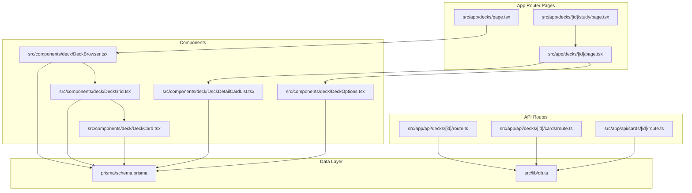
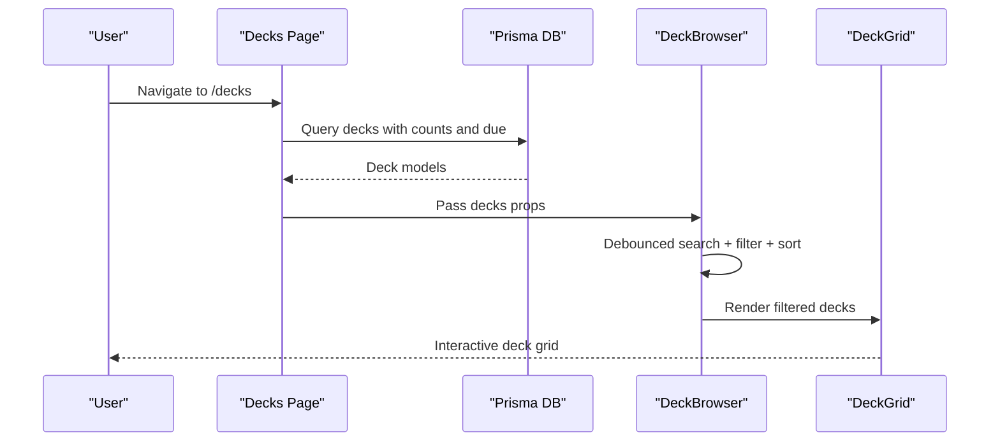
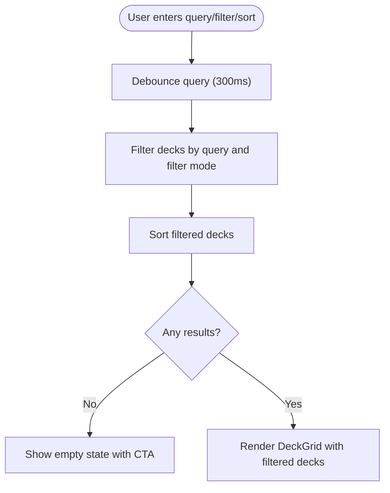
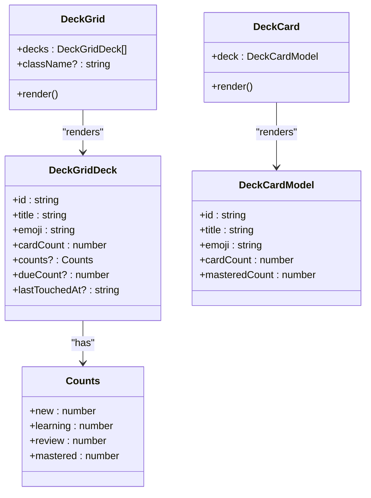
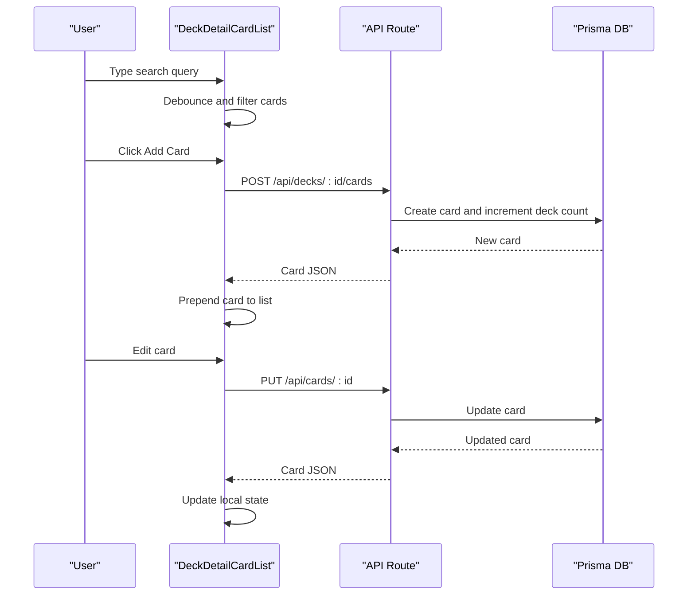
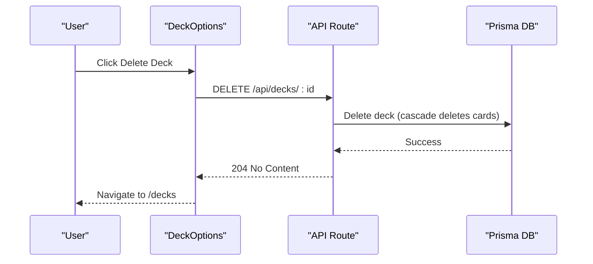
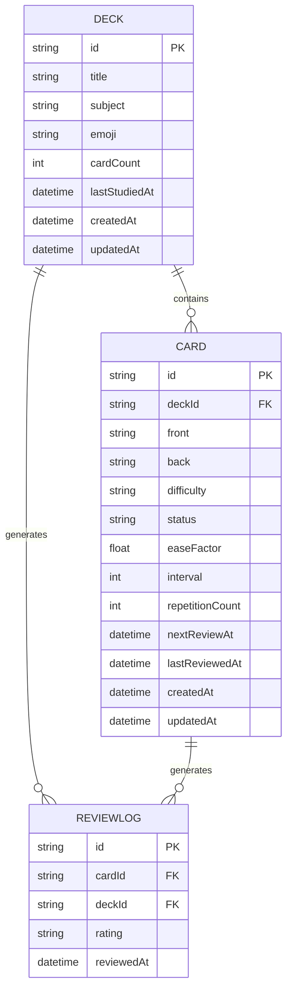
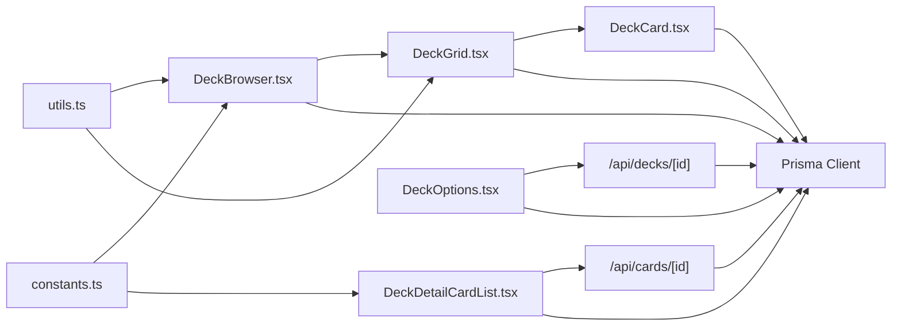

# Deck Management System

<cite>
**Referenced Files in This Document**
- [DeckBrowser.tsx](file://src/components/deck/DeckBrowser.tsx)
- [DeckGrid.tsx](file://src/components/deck/DeckGrid.tsx)
- [DeckCard.tsx](file://src/components/deck/DeckCard.tsx)
- [DeckDetailCardList.tsx](file://src/components/deck/DeckDetailCardList.tsx)
- [DeckOptions.tsx](file://src/components/deck/DeckOptions.tsx)
- [page.tsx](file://src/app/decks/page.tsx)
- [page.tsx](file://src/app/decks/[id]/page.tsx)
- [route.ts](file://src/app/api/decks/[id]/route.ts)
- [route.ts](file://src/app/api/decks/[id]/cards/route.ts)
- [route.ts](file://src/app/api/cards/[id]/route.ts)
- [schema.prisma](file://prisma/schema.prisma)
- [db.ts](file://src/lib/db.ts)
- [constants.ts](file://src/lib/constants.ts)
- [utils.ts](file://src/lib/utils.ts)
- [page.tsx](file://src/app/decks/[id]/study/page.tsx)
</cite>

## Table of Contents
1. [Introduction](#introduction)
2. [Project Structure](#project-structure)
3. [Core Components](#core-components)
4. [Architecture Overview](#architecture-overview)
5. [Detailed Component Analysis](#detailed-component-analysis)
6. [Dependency Analysis](#dependency-analysis)
7. [Performance Considerations](#performance-considerations)
8. [Troubleshooting Guide](#troubleshooting-guide)
9. [Conclusion](#conclusion)

## Introduction
This document explains the deck management system that powers deck browsing, card organization, and subject categorization. It covers the deck grid layout, individual deck cards, detailed card lists, deck creation/editing/deletion workflows, filtering and search capabilities, and the emoji-based visualization of decks. It also addresses the relationship between decks and cards, and provides performance optimization strategies for large collections.

## Project Structure
The deck management system is organized around:
- UI components for browsing and managing decks and cards
- Next.js app router pages for server-rendered views
- API routes for CRUD operations on decks and cards
- Prisma schema defining the data model
- Utilities for styling, constants, and date formatting

**Diagram sources**
- [page.tsx:1-89](file://src/app/decks/page.tsx#L1-L89)
- [page.tsx:1-206](file://src/app/decks/[id]/page.tsx#L1-L206)
- [page.tsx:1-92](file://src/app/decks/[id]/study/page.tsx#L1-L92)
- [DeckBrowser.tsx:1-188](file://src/components/deck/DeckBrowser.tsx#L1-L188)
- [DeckGrid.tsx:1-95](file://src/components/deck/DeckGrid.tsx#L1-L95)
- [DeckCard.tsx:1-50](file://src/components/deck/DeckCard.tsx#L1-L50)
- [DeckDetailCardList.tsx:1-358](file://src/components/deck/DeckDetailCardList.tsx#L1-L358)
- [DeckOptions.tsx:1-90](file://src/components/deck/DeckOptions.tsx#L1-L90)
- [route.ts:1-43](file://src/app/api/decks/[id]/route.ts#L1-L43)
- [route.ts:1-40](file://src/app/api/decks/[id]/cards/route.ts#L1-L40)
- [route.ts:1-47](file://src/app/api/cards/[id]/route.ts#L1-L47)
- [schema.prisma:1-51](file://prisma/schema.prisma#L1-L51)
- [db.ts:1-68](file://src/lib/db.ts#L1-L68)

**Section sources**
- [page.tsx:1-89](file://src/app/decks/page.tsx#L1-L89)
- [page.tsx:1-206](file://src/app/decks/[id]/page.tsx#L1-L206)
- [DeckBrowser.tsx:1-188](file://src/components/deck/DeckBrowser.tsx#L1-L188)
- [DeckGrid.tsx:1-95](file://src/components/deck/DeckGrid.tsx#L1-L95)
- [DeckDetailCardList.tsx:1-358](file://src/components/deck/DeckDetailCardList.tsx#L1-L358)
- [route.ts:1-43](file://src/app/api/decks/[id]/route.ts#L1-L43)
- [route.ts:1-40](file://src/app/api/decks/[id]/cards/route.ts#L1-L40)
- [route.ts:1-47](file://src/app/api/cards/[id]/route.ts#L1-L47)
- [schema.prisma:1-51](file://prisma/schema.prisma#L1-L51)
- [db.ts:1-68](file://src/lib/db.ts#L1-L68)

## Core Components
- DeckBrowser: Provides search, filtering, and sorting for decks, renders a responsive grid of decks.
- DeckGrid: Renders deck tiles with emoji, due badges, card counts, and mastery breakdown bars.
- DeckCard: Compact deck tile with emoji, title, card count, and percentage mastery.
- DeckDetailCardList: Manages detailed card list with search, expand/collapse, inline edit, add/delete, and animations.
- DeckOptions: Deck actions menu (edit placeholder, export JSON, delete).
- API routes: CRUD endpoints for decks and cards.
- Prisma schema: Defines Deck, Card, and ReviewLog models with relations.

Key data models:
- DeckBrowserModel: Used by DeckBrowser to render deck rows with counts and due info.
- DeckCardModel: Used by DeckCard to render compact deck tiles.
- DeckDetailCard: Used by DeckDetailCardList to manage card rows with difficulty/status metadata.

**Section sources**
- [DeckBrowser.tsx:20-33](file://src/components/deck/DeckBrowser.tsx#L20-L33)
- [DeckCard.tsx:6-16](file://src/components/deck/DeckCard.tsx#L6-L16)
- [DeckDetailCardList.tsx:14-26](file://src/components/deck/DeckDetailCardList.tsx#L14-L26)
- [DeckGrid.tsx:9-20](file://src/components/deck/DeckGrid.tsx#L9-L20)
- [route.ts:4-26](file://src/app/api/decks/[id]/route.ts#L4-L26)
- [route.ts:4-34](file://src/app/api/decks/[id]/cards/route.ts#L4-L34)
- [route.ts:4-46](file://src/app/api/cards/[id]/route.ts#L4-L46)

## Architecture Overview
The system follows a server-rendered Next.js app pattern with client-side interactivity:
- Server pages fetch data from Prisma and pass typed models to components.
- Client components implement interactive features like search, filtering, and animations.
- API routes handle mutations (create/update/delete) and maintain referential integrity.

**Diagram sources**
- [page.tsx:8-53](file://src/app/decks/page.tsx#L8-L53)
- [DeckBrowser.tsx:35-92](file://src/components/deck/DeckBrowser.tsx#L35-L92)
- [DeckGrid.tsx:22-94](file://src/components/deck/DeckGrid.tsx#L22-L94)
- [db.ts:51-63](file://src/lib/db.ts#L51-L63)

## Detailed Component Analysis

### Deck Browsing Interface
DeckBrowser provides:
- Search: Debounced input that filters by title and subject.
- Filters: "All", "Has Due Cards", "Recently Studied", "Never Studied".
- Sorting: "Last Studied", "Alphabetical", "Most Cards", "Lowest Mastery".
- Empty states: Guidance to upload or clear filters.

**Diagram sources**
- [DeckBrowser.tsx:35-92](file://src/components/deck/DeckBrowser.tsx#L35-L92)

**Section sources**
- [DeckBrowser.tsx:35-187](file://src/components/deck/DeckBrowser.tsx#L35-L187)

### Deck Grid Layout and Individual Deck Cards
DeckGrid renders responsive deck tiles with:
- Emoji avatar
- Due badge when applicable
- Card count
- Mastery breakdown bar (mastered, reviewing, learning, new)
- Relative "last studied" indicator

DeckCard provides a compact representation with:
- Emoji and title
- Card count
- Animated mastery progress bar
- Hover effects and navigation to deck detail

**Diagram sources**
- [DeckGrid.tsx:9-20](file://src/components/deck/DeckGrid.tsx#L9-L20)
- [DeckCard.tsx:6-16](file://src/components/deck/DeckCard.tsx#L6-L16)

**Section sources**
- [DeckGrid.tsx:22-94](file://src/components/deck/DeckGrid.tsx#L22-L94)
- [DeckCard.tsx:18-49](file://src/components/deck/DeckCard.tsx#L18-L49)

### Detailed Card Lists
DeckDetailCardList manages:
- Search: Debounced search across front/back content.
- Expand/Collapse: Flip card view with smooth animations.
- Inline Edit: Toggle edit mode per card with save/cancel.
- Add Card: Form to create new cards via POST to `/api/decks/:id/cards`.
- Delete Card: Confirmation and DELETE to `/api/cards/:id` with cascade updates.

**Diagram sources**
- [DeckDetailCardList.tsx:28-142](file://src/components/deck/DeckDetailCardList.tsx#L28-L142)
- [route.ts:4-34](file://src/app/api/decks/[id]/cards/route.ts#L4-L34)
- [route.ts:4-46](file://src/app/api/cards/[id]/route.ts#L4-L46)

**Section sources**
- [DeckDetailCardList.tsx:28-358](file://src/components/deck/DeckDetailCardList.tsx#L28-L358)
- [route.ts:1-40](file://src/app/api/decks/[id]/cards/route.ts#L1-L40)
- [route.ts:1-47](file://src/app/api/cards/[id]/route.ts#L1-L47)

### Deck Creation, Editing, and Deletion Workflows
- Creation: Triggered by upload flow; creates cards and increments deck cardCount.
- Editing: PUT to `/api/decks/:id` updates title, description, emoji, subject.
- Deletion: DELETE to `/api/decks/:id` removes deck and cascades to cards.

**Diagram sources**
- [DeckOptions.tsx:48-64](file://src/components/deck/DeckOptions.tsx#L48-L64)
- [route.ts:28-42](file://src/app/api/decks/[id]/route.ts#L28-L42)

**Section sources**
- [DeckOptions.tsx:23-89](file://src/components/deck/DeckOptions.tsx#L23-L89)
- [route.ts:4-43](file://src/app/api/decks/[id]/route.ts#L4-L43)

### Subject Categorization and Emoji Visualization
- Subjects: Defined in constants with default emoji mapping for Mathematics, Science, History, Literature, Languages, Other.
- Emoji display: Shown in deck grids and detail pages for quick recognition.
- Filtering: Decks can be filtered by subject via search on the browsing page.

**Section sources**
- [constants.ts:1-31](file://src/lib/constants.ts#L1-L31)
- [DeckGrid.tsx:62-64](file://src/components/deck/DeckGrid.tsx#L62-L64)
- [page.tsx:91-93](file://src/app/decks/[id]/page.tsx#L91-L93)

### Relationship Between Decks and Cards
- One-to-many relation: Deck has many Cards; deleting a deck cascades to cards.
- Derived metrics: Counts and due counts computed server-side for efficient rendering.
- Status and scheduling: Cards track difficulty, status, ease factor, interval, repetition count, and next review time.

**Diagram sources**
- [schema.prisma:10-50](file://prisma/schema.prisma#L10-L50)

**Section sources**
- [schema.prisma:10-50](file://prisma/schema.prisma#L10-L50)
- [page.tsx:30-53](file://src/app/decks/page.tsx#L30-L53)
- [page.tsx:66-84](file://src/app/decks/[id]/page.tsx#L66-L84)

### Study Workflow Integration
- Study page loads deck and cards, computes due queue using spaced repetition logic, and renders the study shell.
- Supports "All cards" mode with random shuffling.

**Section sources**
- [page.tsx:30-91](file://src/app/decks/[id]/study/page.tsx#L30-L91)

## Dependency Analysis
- Components depend on:
  - Prisma models for data typing and rendering.
  - Utility functions for date formatting and styling.
  - Constants for styling tokens and subject defaults.
- API routes depend on Prisma client for persistence.
- Pages orchestrate data fetching and transform results into component models.

**Diagram sources**
- [DeckBrowser.tsx:1-18](file://src/components/deck/DeckBrowser.tsx#L1-L18)
- [DeckGrid.tsx:1-8](file://src/components/deck/DeckGrid.tsx#L1-L8)
- [DeckCard.tsx:1-4](file://src/components/deck/DeckCard.tsx#L1-L4)
- [DeckDetailCardList.tsx:1-12](file://src/components/deck/DeckDetailCardList.tsx#L1-L12)
- [DeckOptions.tsx:1-6](file://src/components/deck/DeckOptions.tsx#L1-L6)
- [route.ts:1-2](file://src/app/api/decks/[id]/route.ts#L1-L2)
- [route.ts:1-2](file://src/app/api/cards/[id]/route.ts#L1-L2)
- [db.ts:1-68](file://src/lib/db.ts#L1-L68)
- [utils.ts:1-34](file://src/lib/utils.ts#L1-L34)
- [constants.ts:1-31](file://src/lib/constants.ts#L1-L31)

**Section sources**
- [DeckBrowser.tsx:1-18](file://src/components/deck/DeckBrowser.tsx#L1-L18)
- [DeckGrid.tsx:1-8](file://src/components/deck/DeckGrid.tsx#L1-L8)
- [DeckDetailCardList.tsx:1-12](file://src/components/deck/DeckDetailCardList.tsx#L1-L12)
- [DeckOptions.tsx:1-6](file://src/components/deck/DeckOptions.tsx#L1-L6)
- [route.ts:1-2](file://src/app/api/decks/[id]/route.ts#L1-L2)
- [route.ts:1-2](file://src/app/api/cards/[id]/route.ts#L1-L2)
- [db.ts:1-68](file://src/lib/db.ts#L1-L68)
- [utils.ts:1-34](file://src/lib/utils.ts#L1-L34)
- [constants.ts:1-31](file://src/lib/constants.ts#L1-L31)

## Performance Considerations
- Debounced search: Both deck browser and card list debounce input to reduce re-computation.
- Client-side filtering/sorting: Efficient for moderate collection sizes; avoid heavy computations on large datasets.
- Memoization: useMemo used for filtered decks and card lists to prevent unnecessary recalculations.
- Responsive grid: CSS grid adapts to screen size; consider virtualization for very large collections.
- Database queries: Pages fetch pre-aggregated counts and due counts server-side to minimize client work.
- Animation thresholds: Consider disabling animations for low-powered devices.

[No sources needed since this section provides general guidance]

## Troubleshooting Guide
Common issues and resolutions:
- Database connectivity errors: Verify DATABASE_URL and platform-specific environment variables; the database utility selects appropriate URLs and ensures SSL mode.
- Deck load failures: The decks page displays a user-friendly error message when server fails to fetch decks.
- Study session errors: Study page handles failures gracefully and reports database configuration issues.
- Card operations: Card list uses toast notifications for success/error feedback during add/edit/delete.

**Section sources**
- [db.ts:8-63](file://src/lib/db.ts#L8-L63)
- [page.tsx:71-87](file://src/app/decks/page.tsx#L71-L87)
- [page.tsx:43-54](file://src/app/decks/[id]/study/page.tsx#L43-L54)
- [DeckDetailCardList.tsx:71-102](file://src/components/deck/DeckDetailCardList.tsx#L71-L102)

## Conclusion
The deck management system combines server-rendered pages with client-side interactivity to deliver a responsive, emoji-rich interface for browsing and organizing decks and cards. Its modular components, clear API boundaries, and pragmatic performance strategies support both small and large collections. The design emphasizes usability through search, filtering, sorting, and visual mastery indicators, while maintaining robust data integrity through Prisma relations and API-driven mutations.