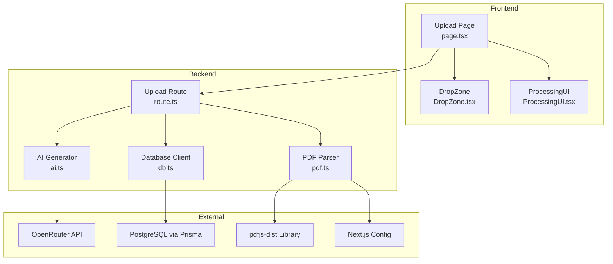
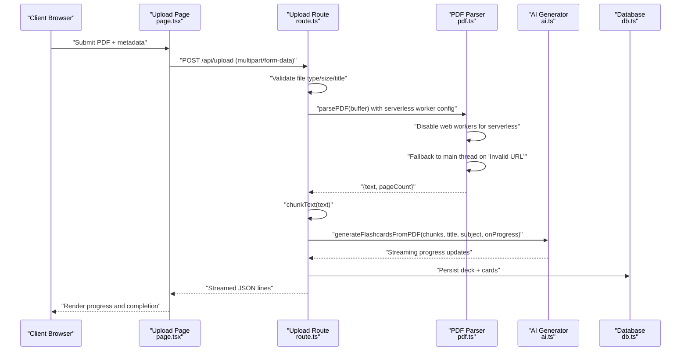
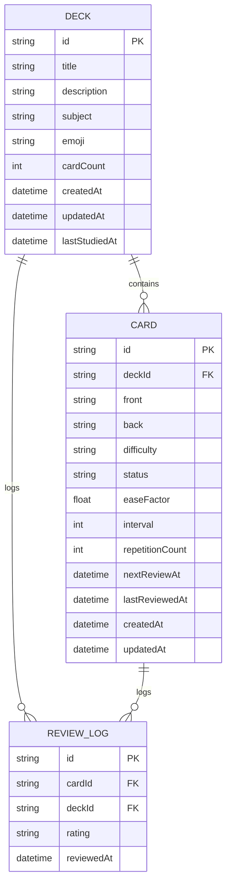
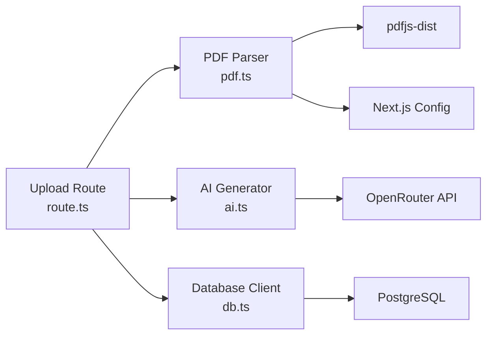

# PDF Upload and Processing

<cite>
**Referenced Files in This Document**
- [route.ts](file://src/app/api/upload/route.ts)
- [pdf.ts](file://src/lib/pdf.ts)
- [ai.ts](file://src/lib/ai.ts)
- [db.ts](file://src/lib/db.ts)
- [page.tsx](file://src/app/upload/page.tsx)
- [DropZone.tsx](file://src/components/upload/DropZone.tsx)
- [ProcessingUI.tsx](file://src/components/upload/ProcessingUI.tsx)
- [constants.ts](file://src/lib/constants.ts)
- [schema.prisma](file://prisma/schema.prisma)
- [package.json](file://package.json)
- [README.md](file://README.md)
- [next.config.mjs](file://next.config.mjs)
</cite>

## Update Summary
**Changes Made**
- Enhanced PDF.js worker configuration for Vercel serverless environments with defensive error handling and fallback mechanisms
- Added comprehensive workerSrc and workerPort configuration improvements to address 'Invalid URL' and 'fake worker' errors
- Implemented automatic worker thread disabling for Node.js/serverless environments
- Added maximally constrained fallback configuration for PDF processing failures
- Updated Next.js configuration to externalize pdfjs-dist for serverless compatibility

## Table of Contents
1. [Introduction](#introduction)
2. [Project Structure](#project-structure)
3. [Core Components](#core-components)
4. [Architecture Overview](#architecture-overview)
5. [Detailed Component Analysis](#detailed-component-analysis)
6. [Dependency Analysis](#dependency-analysis)
7. [Performance Considerations](#performance-considerations)
8. [Troubleshooting Guide](#troubleshooting-guide)
9. [Conclusion](#conclusion)
10. [Appendices](#appendices)

## Introduction
This document explains the complete PDF upload and processing pipeline that transforms a PDF into structured flashcards. It covers the frontend upload flow, multipart form handling, file validation, streaming response implementation, PDF parsing and text extraction, content chunking, AI-driven flashcard generation, rate limiting, error handling, and progress reporting. Practical examples and configuration options are included, along with troubleshooting guidance for common issues such as unsupported file types or large files.

**Updated** Enhanced with improved PDF.js worker compatibility for Vercel serverless environments, featuring automatic worker thread disabling, defensive error handling, and fallback mechanisms to prevent 'Invalid URL' and 'fake worker' errors during PDF processing.

## Project Structure
The PDF upload pipeline spans frontend and backend components:
- Frontend: Upload page and UI components manage file selection, validation, and streaming progress.
- Backend: API route handles multipart form parsing, validation, streaming, and persistence.
- Libraries: PDF parsing, AI generation, and database utilities encapsulate reusable logic.
- Database: Prisma schema defines deck and card models persisted after processing.

**Diagram sources**
- [page.tsx:1-504](file://src/app/upload/page.tsx#L1-L504)
- [DropZone.tsx:1-100](file://src/components/upload/DropZone.tsx#L1-L100)
- [ProcessingUI.tsx:1-53](file://src/components/upload/ProcessingUI.tsx#L1-L53)
- [route.ts:86-298](file://src/app/api/upload/route.ts#L86-L298)
- [pdf.ts:13-112](file://src/lib/pdf.ts#L13-L112)
- [ai.ts:8-233](file://src/lib/ai.ts#L8-L233)
- [db.ts:51-68](file://src/lib/db.ts#L51-L68)
- [next.config.mjs:1-9](file://next.config.mjs#L1-L9)

**Section sources**
- [README.md:9-16](file://README.md#L9-L16)
- [package.json:18-41](file://package.json#L18-L41)

## Core Components
- Upload API route: Parses multipart form data, validates inputs, streams progress, orchestrates PDF parsing, chunking, AI generation, deduplication, and persistence.
- PDF library: Parses PDF buffers with enhanced serverless compatibility, featuring automatic worker thread disabling and fallback error handling for Vercel deployments.
- AI library: Generates flashcards from text chunks using OpenRouter, with fallback models, retry logic, and progress callbacks.
- Database client: Provides a Prisma client configured for production-grade pooling and SSL requirements.
- Frontend upload page: Manages file selection, form submission, streaming response parsing, and progress UI updates.
- UI components: DropZone and ProcessingUI provide user feedback during upload and processing.

**Updated** Enhanced PDF processing reliability with automatic worker thread management and comprehensive error recovery mechanisms for serverless environments.

**Section sources**
- [route.ts:86-298](file://src/app/api/upload/route.ts#L86-L298)
- [pdf.ts:13-112](file://src/lib/pdf.ts#L13-L112)
- [ai.ts:8-233](file://src/lib/ai.ts#L8-L233)
- [db.ts:51-68](file://src/lib/db.ts#L51-L68)
- [page.tsx:84-177](file://src/app/upload/page.tsx#L84-L177)
- [DropZone.tsx:21-36](file://src/components/upload/DropZone.tsx#L21-L36)
- [ProcessingUI.tsx:12-25](file://src/components/upload/ProcessingUI.tsx#L12-L25)

## Architecture Overview
The pipeline is a server-side streaming process that returns incremental progress updates to the client. The API route performs:
- Environment checks for required secrets.
- Rate limiting per IP.
- Multipart form parsing and validation (type, size, title).
- PDF parsing and text cleaning with serverless-compatible worker configuration.
- Content chunking for AI processing.
- Streaming AI generation with progress callbacks.
- Deduplication and persistence to the database.

**Diagram sources**
- [route.ts:169-286](file://src/app/api/upload/route.ts#L169-L286)
- [pdf.ts:13-61](file://src/lib/pdf.ts#L13-L61)
- [ai.ts:168-232](file://src/lib/ai.ts#L168-L232)
- [page.tsx:99-177](file://src/app/upload/page.tsx#L99-L177)

## Detailed Component Analysis

### Upload API Route
Responsibilities:
- Environment preflight checks for database and AI keys.
- Rate limiting keyed by IP with a 60-second window and 5 requests cap.
- Multipart form parsing and validation:
  - File presence and type enforcement to PDF.
  - Size limit of 20 MB.
  - Title requirement.
- PDF parsing and text extraction with serverless-compatible configuration.
- Content chunking for AI processing.
- Streaming progress updates to the client.
- AI generation with retry and fallback models.
- Deduplication and database persistence.
- Robust error handling with user-friendly messages.

Key behaviors:
- Streams JSON lines with status, message, progress, and completion metadata.
- Uses a TransformStream to emit incremental updates.
- Applies a 5-minute maxDuration to accommodate large PDFs and free-tier AI latency.
- Encodes progress percentages across stages: parsing, chunking, generating, saving, complete.

**Section sources**
- [route.ts:86-106](file://src/app/api/upload/route.ts#L86-L106)
- [route.ts:70-84](file://src/app/api/upload/route.ts#L70-L84)
- [route.ts:117-157](file://src/app/api/upload/route.ts#L117-L157)
- [route.ts:169-286](file://src/app/api/upload/route.ts#L169-L286)
- [route.ts:288-298](file://src/app/api/upload/route.ts#L288-L298)

### PDF Parsing and Text Cleaning
Responsibilities:
- Loads pdf-parse lazily to reduce cold start overhead.
- Provides automatic server-side worker detection and fallback logic for Vercel serverless environments.
- Disables web workers in Node.js environments to prevent file path resolution issues.
- Implements defensive error handling with fallback mechanisms for 'Invalid URL' and 'fake worker' errors.
- Parses PDF buffer to text and metadata with optimized serverless configuration.
- Cleans text:
  - Removes page number patterns.
  - Collapses excessive newlines.
  - Trims lines and final text.
- Exposes a chunkText function that splits text into overlapping segments suitable for AI processing.

**Updated** Enhanced with comprehensive worker thread management including automatic workerSrc and workerPort configuration, defensive per-call worker disabling, and maximally constrained fallback configuration to resolve serverless deployment issues.

Chunking strategy:
- Splits by paragraph boundaries.
- Maintains overlap between chunks to preserve context.
- Enforces minimum chunk size and hard-splits oversized paragraphs.

**Section sources**
- [pdf.ts:13-61](file://src/lib/pdf.ts#L13-L61)
- [pdf.ts:67-111](file://src/lib/pdf.ts#L67-L111)

### AI Generation and Deduplication
Responsibilities:
- Generates flashcards from each text chunk using OpenRouter.
- Implements fallback models and retry logic.
- Emits progress updates with stage-specific messages and percentage.
- Deduplicates cards across chunks and before persistence.

Generation details:
- Uses two models as fallbacks.
- Parses JSON responses and extracts card arrays.
- Retries a failed chunk once after a short delay.
- Deduplicates by normalizing front text and truncating to a prefix length.

**Section sources**
- [ai.ts:8-24](file://src/lib/ai.ts#L8-L24)
- [ai.ts:76-153](file://src/lib/ai.ts#L76-L153)
- [ai.ts:168-232](file://src/lib/ai.ts#L168-L232)
- [ai.ts:155-163](file://src/lib/ai.ts#L155-L163)

### Database Persistence
Responsibilities:
- Creates a deck with metadata and associated cards.
- Applies emoji mapping based on subject.
- Sets default card attributes for spaced repetition.
- Persists review logs implicitly via relations.

Prisma configuration:
- Production-aware URL selection and SSL enforcement.
- Global client caching for development.

**Section sources**
- [db.ts:51-68](file://src/lib/db.ts#L51-L68)
- [route.ts:232-251](file://src/app/api/upload/route.ts#L232-L251)
- [schema.prisma:10-50](file://prisma/schema.prisma#L10-L50)

### Frontend Upload Flow
Responsibilities:
- Validates file type locally before submission.
- Builds multipart form data and posts to the API.
- Reads the streamed response incrementally and updates UI.
- Handles completion and navigates to the newly created deck.

User experience:
- DropZone component provides drag-and-drop and file selection.
- ProcessingUI shows animated status and progress bars.
- On completion, confetti animation and navigation options are presented.

**Section sources**
- [page.tsx:54-62](file://src/app/upload/page.tsx#L54-L62)
- [page.tsx:84-177](file://src/app/upload/page.tsx#L84-L177)
- [DropZone.tsx:21-36](file://src/components/upload/DropZone.tsx#L21-L36)
- [ProcessingUI.tsx:12-25](file://src/components/upload/ProcessingUI.tsx#L12-L25)

### Rate Limiting Mechanism
- Tracks per-IP counts with a 60-second sliding window.
- Allows 5 requests per window.
- Returns 429 with a helpful message when exceeded.

**Section sources**
- [route.ts:70-84](file://src/app/api/upload/route.ts#L70-L84)

### Progress Reporting System
- Server emits JSON lines with status, message, and progress.
- Client decodes and renders progress bars and status messages.
- Stages include parsing, chunking, generating, saving, and complete.

**Section sources**
- [route.ts:172-177](file://src/app/api/upload/route.ts#L172-L177)
- [route.ts:192-198](file://src/app/api/upload/route.ts#L192-L198)
- [route.ts:204-209](file://src/app/api/upload/route.ts#L204-L209)
- [route.ts:212-218](file://src/app/api/upload/route.ts#L212-L218)
- [route.ts:258-266](file://src/app/api/upload/route.ts#L258-L266)
- [page.tsx:123-168](file://src/app/upload/page.tsx#L123-L168)

### Data Models Diagram

**Diagram sources**
- [schema.prisma:10-50](file://prisma/schema.prisma#L10-L50)

## Dependency Analysis
- Runtime and timeout: Node runtime with a 5-minute maxDuration to handle large PDFs and AI latency.
- External libraries: pdf-parse for PDF parsing, OpenAI client for OpenRouter, Prisma for database access.
- Environment dependencies: DATABASE_URL and OPENROUTER_API_KEY are mandatory for operation.
- Serverless optimization: Next.js configuration externalizes pdfjs-dist to prevent bundling issues in serverless environments.

**Updated** Enhanced PDF.js worker compatibility for Vercel serverless environments with automatic worker thread configuration and Next.js external package optimization.

**Diagram sources**
- [route.ts:7-9](file://src/app/api/upload/route.ts#L7-L9)
- [pdf.ts:29-31](file://src/lib/pdf.ts#L29-L31)
- [ai.ts:1-7](file://src/lib/ai.ts#L1-L7)
- [db.ts:1-6](file://src/lib/db.ts#L1-L6)
- [package.json:33-34](file://package.json#L33-L34)
- [package.json:32](file://package.json#L32)
- [package.json:19](file://package.json#L19)
- [next.config.mjs:1-9](file://next.config.mjs#L1-L9)

**Section sources**
- [route.ts:7-9](file://src/app/api/upload/route.ts#L7-L9)
- [package.json:18-41](file://package.json#L18-L41)

## Performance Considerations
- Cold start mitigation: Lazy-loading pdf-parse reduces initial bundle size and cold start time.
- Streaming: Immediate response delivery allows the UI to render progress without waiting for completion.
- Chunking: Paragraph-aware chunking with overlap improves AI comprehension and reduces token waste.
- Rate limiting: Prevents overload on free-tier AI services and ensures fair usage.
- Memory management: Processing occurs in-memory for buffers and chunks; large PDFs may increase memory usage. Consider optimizing chunk sizes or adding streaming-to-disk strategies if needed.
- Database pooling: Production-aware Prisma configuration ensures efficient connection reuse.
- Serverless optimization: Automatic worker thread disabling prevents unnecessary resource allocation in serverless environments.
- PDF.js worker management: Defensive per-call worker configuration eliminates persistent worker thread overhead in serverless deployments.

**Updated** Enhanced serverless performance with comprehensive worker thread optimization, automatic fallback mechanisms, and Next.js external package configuration for optimal Vercel deployment.

## Troubleshooting Guide
Common issues and resolutions:
- Unsupported file type:
  - Symptom: Error indicating only PDF files are supported.
  - Cause: Non-PDF file selected.
  - Resolution: Ensure the uploaded file has a PDF MIME type.
  - Section sources
    - [route.ts:139-144](file://src/app/api/upload/route.ts#L139-L144)
    - [page.tsx:56-59](file://src/app/upload/page.tsx#L56-L59)
    - [DropZone.tsx:31-33](file://src/components/upload/DropZone.tsx#L31-L33)

- File too large:
  - Symptom: Error stating maximum size is 20 MB.
  - Cause: File exceeds the 20 MB limit.
  - Resolution: Compress or split the PDF before uploading.
  - Section sources
    - [route.ts:145-151](file://src/app/api/upload/route.ts#L145-L151)

- Missing required title:
  - Symptom: Error requiring a deck title.
  - Cause: Empty or missing title field.
  - Resolution: Provide a non-empty title.
  - Section sources
    - [route.ts:152-157](file://src/app/api/upload/route.ts#L152-L157)

- AI generation not configured:
  - Symptom: Error indicating OPENROUTER_API_KEY is missing.
  - Cause: Missing environment variable.
  - Resolution: Set OPENROUTER_API_KEY in the deployment environment.
  - Section sources
    - [route.ts:98-106](file://src/app/api/upload/route.ts#L98-L106)
    - [ai.ts:11-16](file://src/lib/ai.ts#L11-L16)

- AI rate limit reached:
  - Symptom: Error indicating rate limit or 429 status.
  - Cause: Free-tier usage caps exceeded.
  - Resolution: Wait a minute and retry.
  - Section sources
    - [route.ts:109-115](file://src/app/api/upload/route.ts#L109-L115)
    - [route.ts:19-24](file://src/app/api/upload/route.ts#L19-L24)

- AI model unavailable:
  - Symptom: Error indicating model not found or unavailable.
  - Cause: Model endpoint issues.
  - Resolution: Retry later; the system attempts fallback models.
  - Section sources
    - [ai.ts:93-96](file://src/lib/ai.ts#L93-L96)
    - [ai.ts:115-120](file://src/lib/ai.ts#L115-L120)

- Database connectivity issues:
  - Symptom: Error mentioning DATABASE_URL or Prisma errors.
  - Cause: Incorrect or missing DATABASE_URL.
  - Resolution: Verify DATABASE_URL in the deployment environment.
  - Section sources
    - [route.ts:88-96](file://src/app/api/upload/route.ts#L88-L96)
    - [db.ts:8-39](file://src/lib/db.ts#L8-L39)

- Scanned or image-based PDF:
  - Symptom: Error indicating not enough readable text.
  - Cause: PDF lacks selectable text.
  - Resolution: Convert to a text-based PDF or use OCR preprocessing.
  - Section sources
    - [route.ts:179-189](file://src/app/api/upload/route.ts#L179-L189)

- Streaming response issues:
  - Symptom: No progress updates or malformed JSON.
  - Cause: Network or proxy buffering.
  - Resolution: Ensure streaming headers are respected; avoid buffering proxies.
  - Section sources
    - [route.ts:288-296](file://src/app/api/upload/route.ts#L288-L296)

- PDF processing failures in serverless environments:
  - Symptom: Worker thread initialization errors or PDF parsing failures.
  - Cause: Web worker conflicts in Vercel serverless functions.
  - Resolution: The system automatically disables workers for serverless environments and uses fallback configurations.
  - Section sources
    - [pdf.ts:3-14](file://src/lib/pdf.ts#L3-L14)

- Serverless worker compatibility issues:
  - Symptom: PDF processing hangs or fails in Vercel deployments.
  - Cause: Worker thread file path resolution issues in bundled functions.
  - Resolution: Automatic server-side detection and worker fallback to main thread with maximally constrained configuration.
  - Section sources
    - [pdf.ts:8-14](file://src/lib/pdf.ts#L8-L14)
    - [pdf.ts:48-65](file://src/lib/pdf.ts#L48-L65)

- Invalid URL or fake worker errors:
  - Symptom: PDF parsing fails with 'Invalid URL' or 'fake worker' messages.
  - Cause: PDF.js worker URL validation failing in serverless environments.
  - Resolution: System automatically applies fallback configuration with useWorkerFetch=false and disableFontFace=true.
  - Section sources
    - [pdf.ts:48-65](file://src/lib/pdf.ts#L48-L65)

## Conclusion
The PDF upload and processing pipeline integrates robust validation, streaming progress reporting, intelligent PDF parsing with enhanced serverless compatibility, and AI-powered flashcard generation. It balances performance with reliability through lazy loading, chunking, rate limiting, fallback mechanisms, and comprehensive worker thread configuration for Vercel serverless environments. The enhanced PDF.js worker configuration includes automatic worker disabling, defensive per-call configuration, and fallback error handling to resolve 'Invalid URL' and 'fake worker' errors. Proper configuration of environment variables and adherence to file constraints ensure smooth operation across different deployment targets.

**Updated** Enhanced with comprehensive serverless compatibility including automatic worker thread management, defensive error handling, and Next.js external package optimization for reliable PDF processing in Vercel and other serverless platforms.

## Appendices

### Configuration Options
- Environment variables:
  - DATABASE_URL: PostgreSQL connection string for Prisma.
  - OPENROUTER_API_KEY: API key for OpenRouter.
- Frontend limits:
  - Max file size: 20 MB.
  - Accepted file type: application/pdf.
- Backend limits:
  - Max duration: 300 seconds.
  - Rate limit: 5 requests per 60 seconds per IP.
- Serverless compatibility:
  - Automatic worker thread disabling for Node.js environments.
  - Per-call workerSrc and workerPort configuration for defensive error handling.
  - Maximally constrained fallback configuration for 'Invalid URL' and 'fake worker' errors.
  - Next.js external package configuration for pdfjs-dist optimization.

**Updated** Added comprehensive serverless compatibility configuration options including worker thread management and fallback mechanisms.

**Section sources**
- [route.ts:8-9](file://src/app/api/upload/route.ts#L8-L9)
- [route.ts:145](file://src/app/api/upload/route.ts#L145)
- [page.tsx:260](file://src/app/upload/page.tsx#L260)
- [DropZone.tsx:68](file://src/components/upload/DropZone.tsx#L68)
- [db.ts:8-39](file://src/lib/db.ts#L8-L39)
- [ai.ts:11-16](file://src/lib/ai.ts#L11-L16)
- [pdf.ts:3-14](file://src/lib/pdf.ts#L3-L14)
- [next.config.mjs:1-9](file://next.config.mjs#L1-L9)

### Practical Examples
- Uploading a PDF:
  - Use the DropZone to select a PDF or drag-and-drop.
  - Enter a deck title and optional subject.
  - Click "Generate Flashcards" to submit the form.
  - Observe progress updates and completion.
- Expected outcomes:
  - A new deck is created with flashcards derived from the PDF.
  - Navigation options lead to studying or viewing the deck.
- Serverless deployment:
  - Works seamlessly on Vercel without worker thread conflicts.
  - Automatic PDF processing optimization for serverless environments with fallback error handling.
  - Comprehensive worker thread management prevents 'Invalid URL' and 'fake worker' errors.

**Updated** Added serverless deployment considerations with automatic worker thread management and comprehensive error recovery mechanisms.

**Section sources**
- [page.tsx:227-348](file://src/app/upload/page.tsx#L227-L348)
- [DropZone.tsx:21-36](file://src/components/upload/DropZone.tsx#L21-L36)
- [ProcessingUI.tsx:12-25](file://src/components/upload/ProcessingUI.tsx#L12-L25)
- [pdf.ts:8-14](file://src/lib/pdf.ts#L8-L14)
- [pdf.ts:48-65](file://src/lib/pdf.ts#L48-L65)