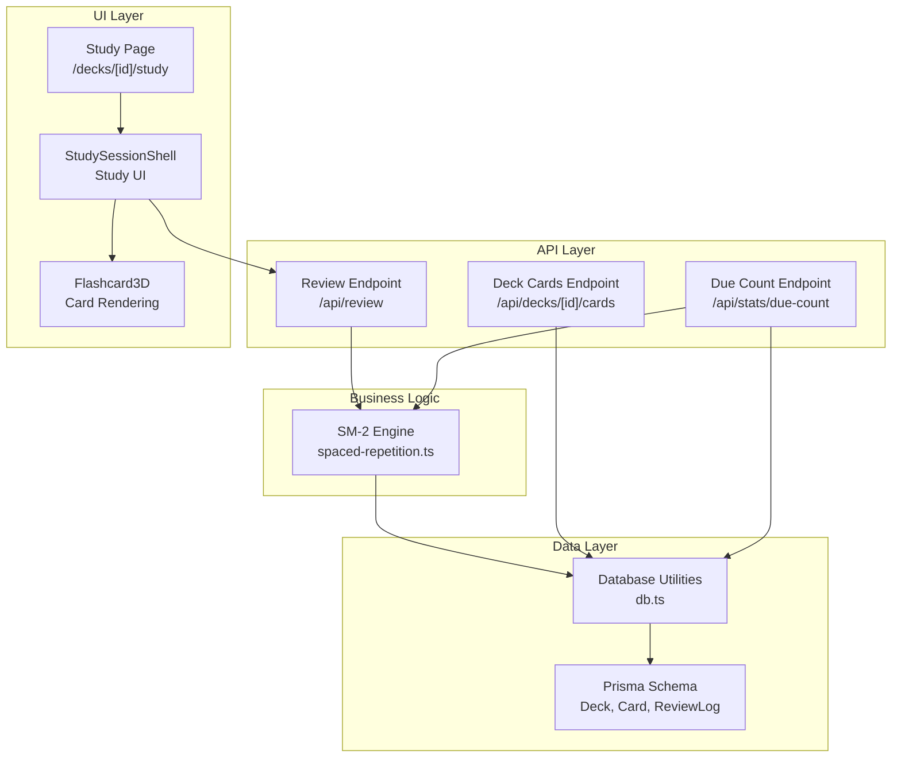
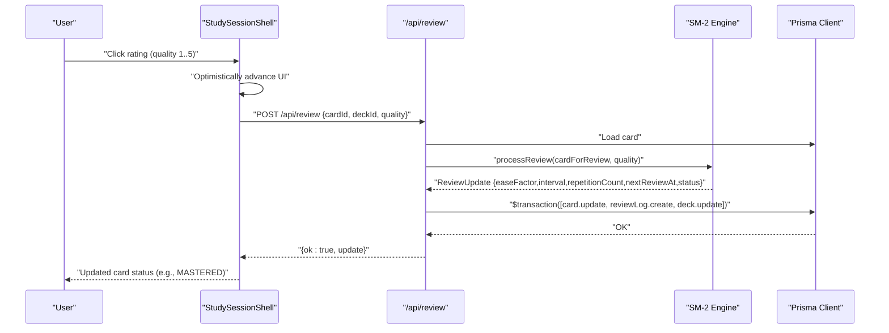
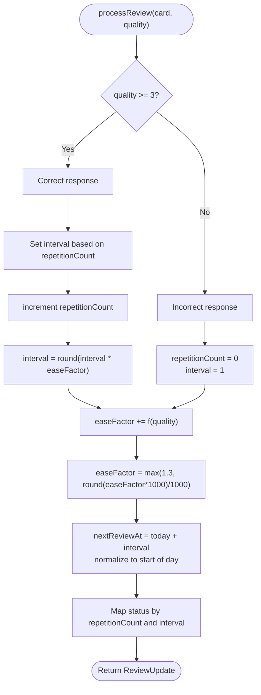
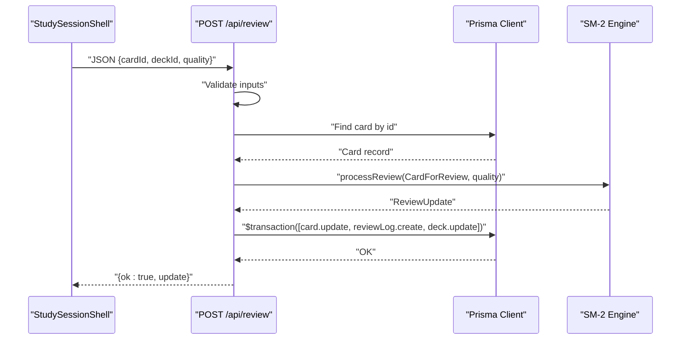
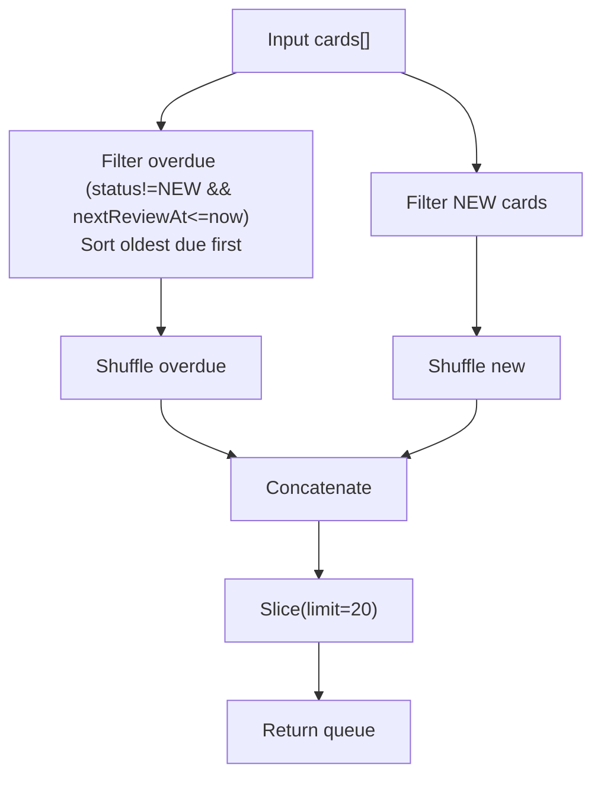
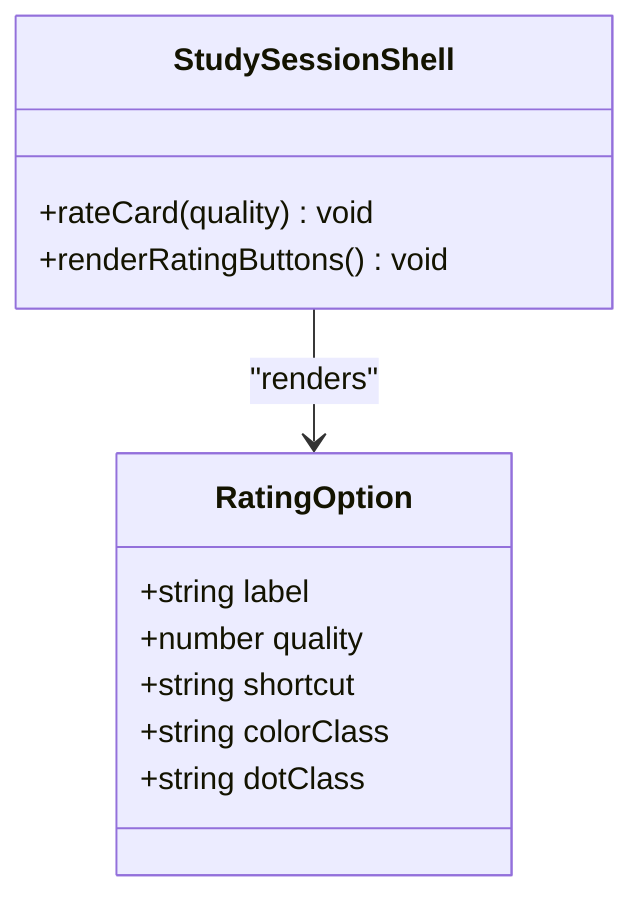
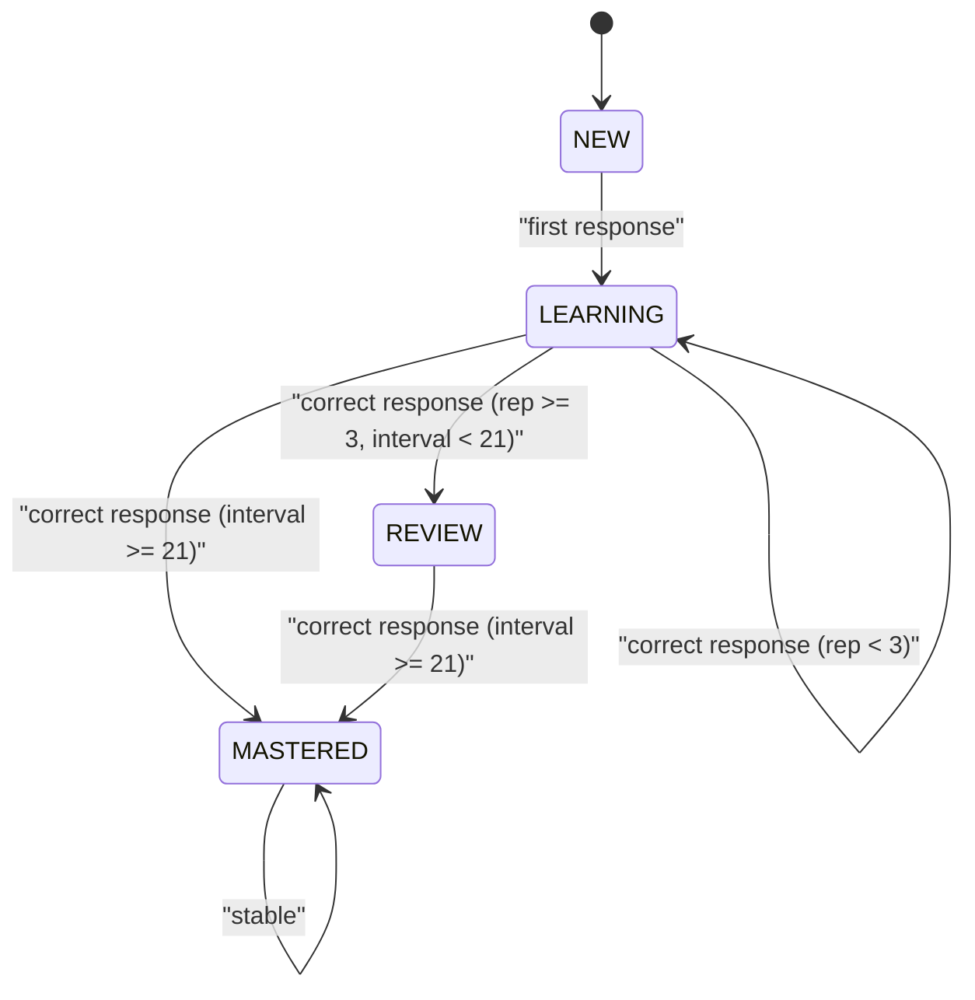
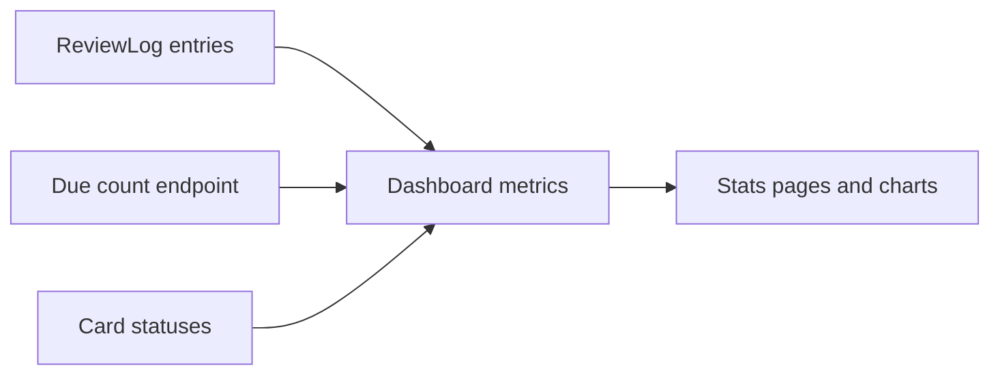
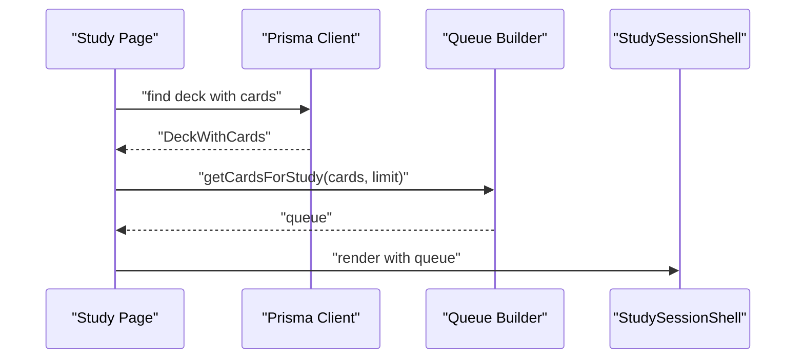
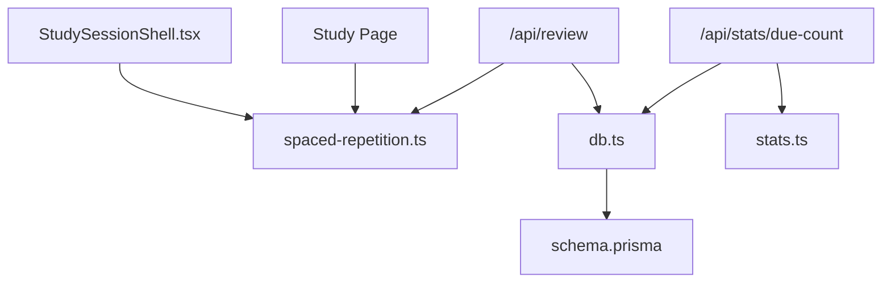

# Spaced Repetition System

<cite>
**Referenced Files in This Document**
- [spaced-repetition.ts](file://src/lib/spaced-repetition.ts)
- [route.ts](file://src/app/api/review/route.ts)
- [db.ts](file://src/lib/db.ts)
- [schema.prisma](file://prisma/schema.prisma)
- [page.tsx](file://src/app/decks/[id]/study/page.tsx)
- [StudySessionShell.tsx](file://src/components/flashcard/StudySessionShell.tsx)
- [Flashcard3D.tsx](file://src/components/flashcard/Flashcard3D.tsx)
- [route.ts](file://src/app/api/decks/[id]/cards/route.ts)
- [route.ts](file://src/app/api/stats/due-count/route.ts)
- [stats.ts](file://src/lib/stats.ts)
- [page.tsx](file://src/app/stats/page.tsx)
- [seed.ts](file://prisma/seed.ts)
</cite>

## Table of Contents
1. [Introduction](#introduction)
2. [Project Structure](#project-structure)
3. [Core Components](#core-components)
4. [Architecture Overview](#architecture-overview)
5. [Detailed Component Analysis](#detailed-component-analysis)
6. [Dependency Analysis](#dependency-analysis)
7. [Performance Considerations](#performance-considerations)
8. [Troubleshooting Guide](#troubleshooting-guide)
9. [Conclusion](#conclusion)

## Introduction
This document explains the spaced repetition system built on the SM-2 algorithm. It covers how cards are scheduled, how reviews are processed, how queues are managed, and how progress is tracked. It also documents the rating system, status transitions, and integration with the study interface. Edge cases, batch processing considerations, and performance optimization strategies are included to help operators maintain a robust and responsive system.

## Project Structure
The spaced repetition system spans three layers:
- Data model and persistence: Prisma schema and database utilities
- Business logic: SM-2 scheduling and queue management
- API and UI: Review endpoints, study session shell, and flashcard rendering

**Diagram sources**
- [spaced-repetition.ts:1-141](file://src/lib/spaced-repetition.ts#L1-L141)
- [route.ts:1-76](file://src/app/api/review/route.ts#L1-L76)
- [db.ts:1-68](file://src/lib/db.ts#L1-L68)
- [schema.prisma:1-51](file://prisma/schema.prisma#L1-L51)
- [page.tsx:1-92](file://src/app/decks/[id]/study/page.tsx#L1-L92)
- [StudySessionShell.tsx:1-430](file://src/components/flashcard/StudySessionShell.tsx#L1-L430)
- [Flashcard3D.tsx:1-113](file://src/components/flashcard/Flashcard3D.tsx#L1-L113)
- [route.ts:1-40](file://src/app/api/decks/[id]/cards/route.ts#L1-L40)
- [route.ts:1-15](file://src/app/api/stats/due-count/route.ts#L1-L15)

**Section sources**
- [spaced-repetition.ts:1-141](file://src/lib/spaced-repetition.ts#L1-L141)
- [route.ts:1-76](file://src/app/api/review/route.ts#L1-L76)
- [db.ts:1-68](file://src/lib/db.ts#L1-L68)
- [schema.prisma:1-51](file://prisma/schema.prisma#L1-L51)
- [page.tsx:1-92](file://src/app/decks/[id]/study/page.tsx#L1-L92)
- [StudySessionShell.tsx:1-430](file://src/components/flashcard/StudySessionShell.tsx#L1-L430)
- [Flashcard3D.tsx:1-113](file://src/components/flashcard/Flashcard3D.tsx#L1-L113)
- [route.ts:1-40](file://src/app/api/decks/[id]/cards/route.ts#L1-L40)
- [route.ts:1-15](file://src/app/api/stats/due-count/route.ts#L1-L15)

## Core Components
- SM-2 engine: Implements the spaced repetition algorithm, including ease factor updates, interval adjustments, and status mapping.
- Review endpoint: Handles review submissions, validates inputs, runs SM-2, persists updates atomically, and records review logs.
- Queue builder: Builds a study queue prioritizing overdue cards and mixing new cards, with shuffling and limits.
- Study interface: Loads cards, renders flashcards, collects ratings, and optimistically advances the session.
- Stats and due counting: Provides due card counts and dashboard metrics.

**Section sources**
- [spaced-repetition.ts:29-76](file://src/lib/spaced-repetition.ts#L29-L76)
- [route.ts:5-75](file://src/app/api/review/route.ts#L5-L75)
- [spaced-repetition.ts:88-104](file://src/lib/spaced-repetition.ts#L88-L104)
- [StudySessionShell.tsx:68-125](file://src/components/flashcard/StudySessionShell.tsx#L68-L125)
- [route.ts:1-15](file://src/app/api/stats/due-count/route.ts#L1-L15)

## Architecture Overview
The system follows a clean separation of concerns:
- The SM-2 engine encapsulates scheduling logic and returns a deterministic update.
- The review endpoint is the single integration point for user ratings, ensuring atomic persistence of card state and review logs.
- The study interface is a client-driven shell that optimistically advances the UI while asynchronously posting ratings to the backend.
- Data is persisted via Prisma with a transactional guarantee for each review.

**Diagram sources**
- [StudySessionShell.tsx:68-125](file://src/components/flashcard/StudySessionShell.tsx#L68-L125)
- [route.ts:5-75](file://src/app/api/review/route.ts#L5-L75)
- [spaced-repetition.ts:29-76](file://src/lib/spaced-repetition.ts#L29-L76)
- [db.ts:1-68](file://src/lib/db.ts#L1-L68)

## Detailed Component Analysis

### SM-2 Algorithm Integration
The SM-2 engine defines the core scheduling logic:
- Quality mapping: 0–5 scale where 0 is blackout and 5 is perfect recall.
- Interval progression:
  - First correct response after NEW sets interval to 1 day.
  - Second correct response sets interval to 6 days.
  - Subsequent correct responses multiply the current interval by the ease factor, rounded to the nearest day.
- Reset on incorrect response: repetition count resets to 0 and interval resets to 1.
- Ease factor updates:
  - Adjusted by a formula dependent on quality.
  - Clamped to a minimum of 1.3 and rounded to three decimal places.
- Status mapping:
  - NEW or repetitionCount 0 → LEARNING
  - repetitionCount < 3 → LEARNING
  - interval < 21 → REVIEW
  - otherwise → MASTERED
- Next review date:
  - Calculated as today plus the computed interval.
  - Normalized to the start of the day.

**Diagram sources**
- [spaced-repetition.ts:29-76](file://src/lib/spaced-repetition.ts#L29-L76)

**Section sources**
- [spaced-repetition.ts:29-76](file://src/lib/spaced-repetition.ts#L29-L76)

### Review Processing Endpoint
The review endpoint:
- Validates presence and range of inputs (quality 0–5).
- Loads the card from the database.
- Converts the card to the internal CardForReview format.
- Invokes the SM-2 engine to compute the update.
- Persists changes atomically:
  - Updates card fields: easeFactor, interval, repetitionCount, nextReviewAt, status, lastReviewedAt.
  - Creates a review log entry linking card and deck.
  - Updates deck’s last studied timestamp.
- Returns the computed update to the client.

**Diagram sources**
- [route.ts:5-75](file://src/app/api/review/route.ts#L5-L75)
- [spaced-repetition.ts:29-76](file://src/lib/spaced-repetition.ts#L29-L76)
- [db.ts:1-68](file://src/lib/db.ts#L1-L68)

**Section sources**
- [route.ts:5-75](file://src/app/api/review/route.ts#L5-L75)

### Review Queue Management
The queue builder:
- Filters overdue cards (status ≠ NEW and nextReviewAt ≤ now), sorting oldest due first.
- Collects all NEW cards.
- Shuffles both groups independently and concatenates them.
- Limits the resulting queue to a configurable cap (default 20).

**Diagram sources**
- [spaced-repetition.ts:88-104](file://src/lib/spaced-repetition.ts#L88-L104)

**Section sources**
- [spaced-repetition.ts:88-104](file://src/lib/spaced-repetition.ts#L88-L104)

### Rating System Implementation
The rating options map numeric qualities to user-facing labels and keyboard shortcuts:
- Forgot (1)
- Hard (3)
- Good (4)
- Easy (5)

The study shell:
- Renders four rating buttons with color-coded styles and keyboard hints.
- On selection, it optimistically increments counters and fires a fire-and-forget request to the review endpoint.
- On successful response indicating a status change to MASTERED, it increments a “newly mastered” counter.

**Diagram sources**
- [spaced-repetition.ts:107-141](file://src/lib/spaced-repetition.ts#L107-L141)
- [StudySessionShell.tsx:366-382](file://src/components/flashcard/StudySessionShell.tsx#L366-L382)

**Section sources**
- [spaced-repetition.ts:107-141](file://src/lib/spaced-repetition.ts#L107-L141)
- [StudySessionShell.tsx:68-125](file://src/components/flashcard/StudySessionShell.tsx#L68-L125)

### Card Status Transitions
Status mapping is derived from repetition count and interval:
- LEARNING: repetitionCount 0 or < 3
- REVIEW: interval < 21
- MASTERED: interval ≥ 21
- NEW remains NEW until the first response.

**Diagram sources**
- [spaced-repetition.ts:58-67](file://src/lib/spaced-repetition.ts#L58-L67)

**Section sources**
- [spaced-repetition.ts:58-67](file://src/lib/spaced-repetition.ts#L58-L67)

### Difficulty Scoring Mechanisms
Difficulty is stored per card and influences perceived recall effort. The study shell displays a difficulty badge on the flashcard. While difficulty does not directly alter SM-2 scheduling in the current implementation, it can inform user interface cues and future extensions.

**Section sources**
- [Flashcard3D.tsx:78-87](file://src/components/flashcard/Flashcard3D.tsx#L78-L87)
- [schema.prisma](file://prisma/schema.prisma#L30)

### Progress Tracking
Progress is tracked through:
- Review logs: linked to cards and decks, enabling analytics.
- Dashboard metrics: due counts, mastery rates, streaks, and heatmaps.
- Due count endpoint: returns the number of cards past due (excluding NEW).

**Diagram sources**
- [stats.ts:20-31](file://src/lib/stats.ts#L20-L31)
- [route.ts:1-15](file://src/app/api/stats/due-count/route.ts#L1-L15)
- [page.tsx:73-186](file://src/app/stats/page.tsx#L73-L186)

**Section sources**
- [stats.ts:20-31](file://src/lib/stats.ts#L20-L31)
- [route.ts:1-15](file://src/app/api/stats/due-count/route.ts#L1-L15)
- [page.tsx:73-186](file://src/app/stats/page.tsx#L73-L186)

### Integration with the Study Interface
The study page:
- Loads a deck and its cards.
- Converts Prisma records to the internal CardForReview format.
- Builds a queue using the queue builder (or shuffles all cards in override mode).
- Passes the queue to the StudySessionShell.

The StudySessionShell:
- Manages UI state, animations, and keyboard controls.
- Posts ratings to the review endpoint and reacts to status changes.

**Diagram sources**
- [page.tsx:30-92](file://src/app/decks/[id]/study/page.tsx#L30-L92)
- [spaced-repetition.ts:88-104](file://src/lib/spaced-repetition.ts#L88-L104)
- [StudySessionShell.tsx:42-90](file://src/components/flashcard/StudySessionShell.tsx#L42-L90)

**Section sources**
- [page.tsx:30-92](file://src/app/decks/[id]/study/page.tsx#L30-L92)
- [StudySessionShell.tsx:42-90](file://src/components/flashcard/StudySessionShell.tsx#L42-L90)

### Examples of Scheduling Calculations
- Example 1: First correct response on a NEW card
  - repetitionCount 0 → interval becomes 1 day
  - repetitionCount increments to 1
  - easeFactor adjusted by quality-dependent formula
  - nextReviewAt = today + 1 day
  - status mapped to LEARNING

- Example 2: Subsequent correct response
  - interval = round(previousInterval × easeFactor)
  - repetitionCount increments
  - status remains LEARNING until threshold met

- Example 3: Incorrect response
  - repetitionCount resets to 0
  - interval resets to 1
  - easeFactor adjusted downward
  - status mapped to LEARNING

These behaviors are implemented in the SM-2 engine and validated by the review endpoint’s transactional persistence.

**Section sources**
- [spaced-repetition.ts:29-76](file://src/lib/spaced-repetition.ts#L29-L76)
- [route.ts:44-68](file://src/app/api/review/route.ts#L44-L68)

### Edge Cases in Scheduling
- Nonexistent card: The review endpoint returns a 404.
- Invalid quality: The endpoint rejects values outside 0–5.
- Atomicity: The endpoint uses a transaction to ensure card, log, and deck updates are consistent.
- Day normalization: nextReviewAt is normalized to the start of the day, aligning daily due counts and UI expectations.

**Section sources**
- [route.ts:15-26](file://src/app/api/review/route.ts#L15-L26)
- [spaced-repetition.ts:52-55](file://src/lib/spaced-repetition.ts#L52-L55)

### Batch Review Processing
The current implementation processes one card at a time per request. To support batch processing:
- Extend the endpoint to accept an array of {cardId, deckId, quality} tuples.
- Validate each tuple and collect updates.
- Apply a single transaction with multiple card updates and log creations.
- Return a summary of successes and failures.

This approach preserves atomicity and reduces network overhead for bulk operations.

**Section sources**
- [route.ts:5-75](file://src/app/api/review/route.ts#L5-L75)

### Data Model and Persistence
The Prisma schema defines:
- Deck: title, emoji, cardCount, timestamps, relations to Card and ReviewLog.
- Card: front/back, difficulty, status, easeFactor, interval, repetitionCount, nextReviewAt, lastReviewedAt, relations to Deck and ReviewLog.
- ReviewLog: cardId, deckId, rating, reviewedAt.

Transactions in the review endpoint ensure referential integrity and consistent state.

**Section sources**
- [schema.prisma:10-51](file://prisma/schema.prisma#L10-L51)
- [route.ts:44-68](file://src/app/api/review/route.ts#L44-L68)
- [db.ts:1-68](file://src/lib/db.ts#L1-L68)

## Dependency Analysis
The system exhibits low coupling and clear boundaries:
- Study UI depends on the queue builder and rating options.
- Review endpoint depends on the SM-2 engine and database utilities.
- Database utilities abstract Prisma configuration and connection handling.
- Stats module depends on database queries and date utilities.

**Diagram sources**
- [StudySessionShell.tsx:1-430](file://src/components/flashcard/StudySessionShell.tsx#L1-L430)
- [spaced-repetition.ts:1-141](file://src/lib/spaced-repetition.ts#L1-L141)
- [route.ts:1-76](file://src/app/api/review/route.ts#L1-L76)
- [db.ts:1-68](file://src/lib/db.ts#L1-L68)
- [schema.prisma:1-51](file://prisma/schema.prisma#L1-L51)
- [route.ts:1-15](file://src/app/api/stats/due-count/route.ts#L1-L15)
- [stats.ts:1-222](file://src/lib/stats.ts#L1-L222)

**Section sources**
- [StudySessionShell.tsx:1-430](file://src/components/flashcard/StudySessionShell.tsx#L1-L430)
- [spaced-repetition.ts:1-141](file://src/lib/spaced-repetition.ts#L1-L141)
- [route.ts:1-76](file://src/app/api/review/route.ts#L1-L76)
- [db.ts:1-68](file://src/lib/db.ts#L1-L68)
- [schema.prisma:1-51](file://prisma/schema.prisma#L1-L51)
- [route.ts:1-15](file://src/app/api/stats/due-count/route.ts#L1-L15)
- [stats.ts:1-222](file://src/lib/stats.ts#L1-L222)

## Performance Considerations
- Queue sizing: Limit active sessions to a small, manageable cap (default 20) to reduce UI churn and database load.
- Atomic writes: Keep review updates in a single transaction to minimize write amplification and ensure consistency.
- Date normalization: Aligning nextReviewAt to the start of the day simplifies daily due computations and reduces index fragmentation.
- Network efficiency: The study shell uses optimistic UI updates and fire-and forget requests to avoid blocking animations during rating submission.
- Database pooling: Use platform-provided Postgres URLs and enforce sslmode=require for serverless environments to improve reliability and performance.

[No sources needed since this section provides general guidance]

## Troubleshooting Guide
- Missing fields or invalid quality: The review endpoint returns 400 errors for missing or out-of-range inputs.
- Card not found: Returns 404 when the requested card does not exist.
- Internal server errors: The endpoint returns 500 on unhandled exceptions; check server logs for stack traces.
- Database connectivity: Verify DATABASE_URL and platform-specific overrides; ensure sslmode=require is present in production.
- Seeding data: Seed script initializes realistic card states and logs for testing scheduling behavior.

**Section sources**
- [route.ts:15-26](file://src/app/api/review/route.ts#L15-L26)
- [route.ts:71-74](file://src/app/api/review/route.ts#L71-L74)
- [db.ts:8-47](file://src/lib/db.ts#L8-L47)
- [seed.ts:1-331](file://prisma/seed.ts#L1-L331)

## Conclusion
The spaced repetition system integrates the SM-2 algorithm with a clean API and a responsive study interface. The queue builder ensures timely exposure of due cards, while the review endpoint guarantees atomic persistence and accurate progress tracking. The design supports scalability through transactions, optimistic UI updates, and careful data modeling. Extending the system to batch processing and adding difficulty-aware scheduling would further enhance retention and user experience.