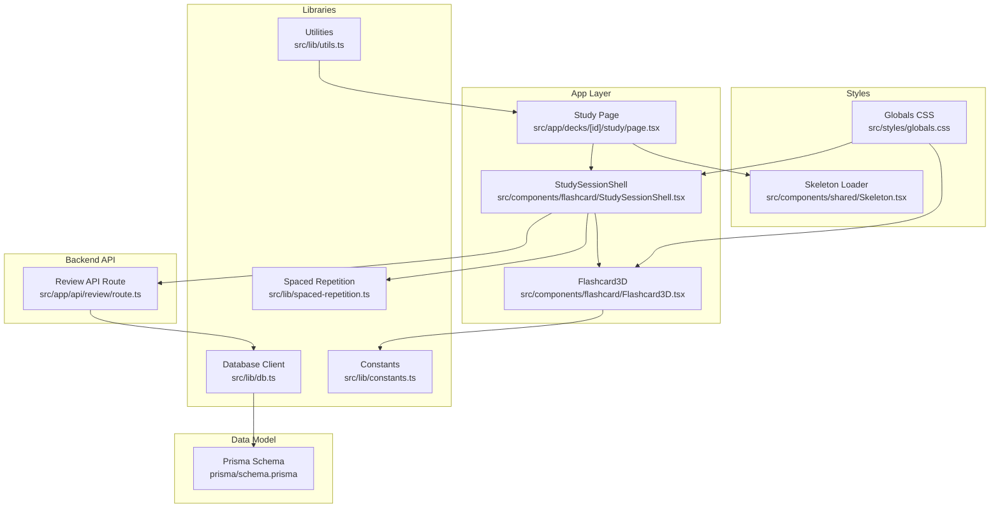
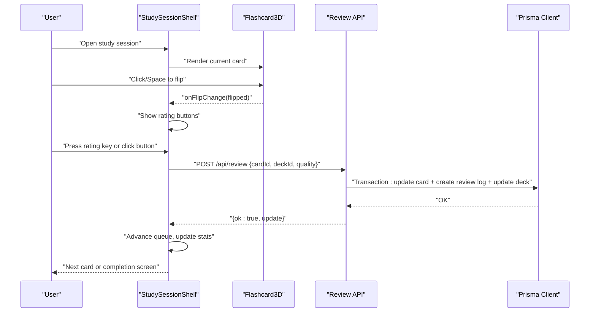
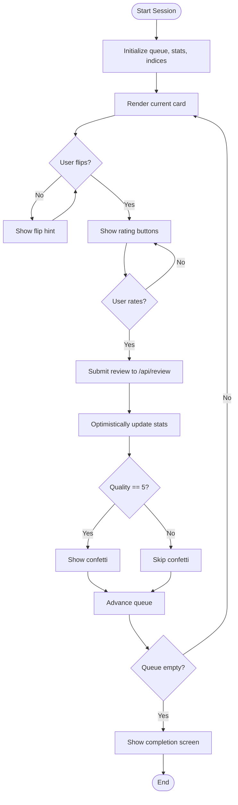
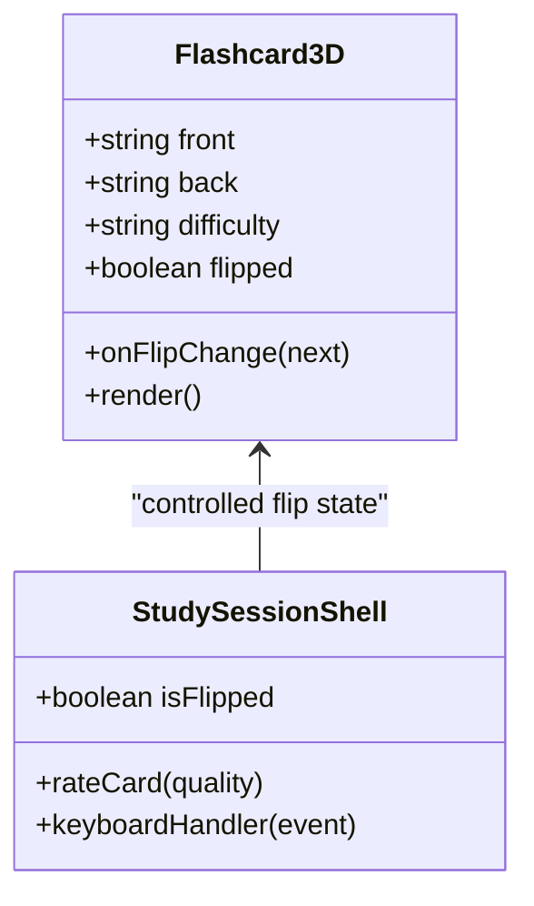
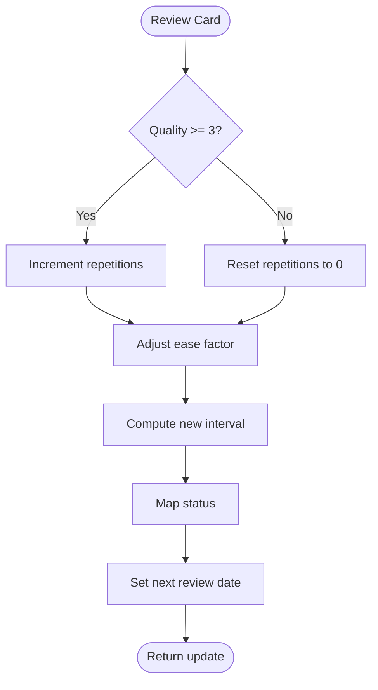
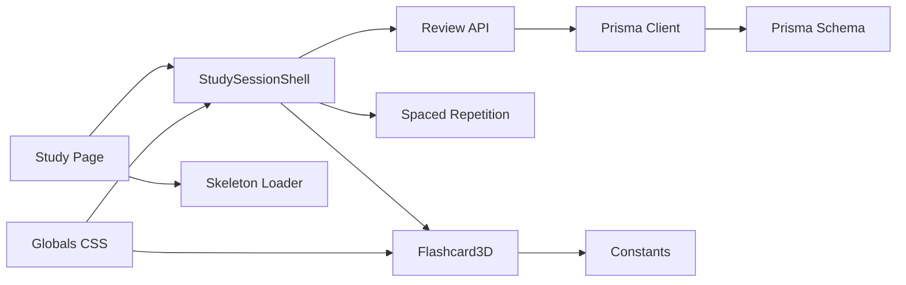

# Study Interface and 3D Flashcards

<cite>
**Referenced Files in This Document**
- [Flashcard3D.tsx](file://src/components/flashcard/Flashcard3D.tsx)
- [StudySessionShell.tsx](file://src/components/flashcard/StudySessionShell.tsx)
- [page.tsx](file://src/app/decks/[id]/study/page.tsx)
- [route.ts](file://src/app/api/review/route.ts)
- [spaced-repetition.ts](file://src/lib/spaced-repetition.ts)
- [db.ts](file://src/lib/db.ts)
- [schema.prisma](file://prisma/schema.prisma)
- [constants.ts](file://src/lib/constants.ts)
- [globals.css](file://src/styles/globals.css)
- [Skeleton.tsx](file://src/components/shared/Skeleton.tsx)
- [loading.tsx](file://src/app/decks/[id]/loading.tsx)
- [utils.ts](file://src/lib/utils.ts)
</cite>

## Table of Contents
1. [Introduction](#introduction)
2. [Project Structure](#project-structure)
3. [Core Components](#core-components)
4. [Architecture Overview](#architecture-overview)
5. [Detailed Component Analysis](#detailed-component-analysis)
6. [Dependency Analysis](#dependency-analysis)
7. [Performance Considerations](#performance-considerations)
8. [Accessibility Guide](#accessibility-guide)
9. [Mobile Optimization](#mobile-optimization)
10. [Troubleshooting Guide](#troubleshooting-guide)
11. [Conclusion](#conclusion)

## Introduction
This document explains the study interface and 3D flashcard system. It covers interactive flashcard mechanics, flip animations, user interaction patterns, the study session shell component, card queue management, progress indicators, 3D card implementation, animation systems, responsive design, study session workflows, rating systems, session persistence, accessibility features, mobile optimization, and performance considerations for smooth animations.

## Project Structure
The study interface is implemented as a Next.js app with a dedicated study page, a 3D flashcard component, and a study session shell that orchestrates the learning experience. Backend integration uses Prisma ORM and a server action for spaced repetition updates.

**Diagram sources**
- [page.tsx:30-91](file://src/app/decks/[id]/study/page.tsx#L30-L91)
- [StudySessionShell.tsx:42-429](file://src/components/flashcard/StudySessionShell.tsx#L42-L429)
- [Flashcard3D.tsx:17-112](file://src/components/flashcard/Flashcard3D.tsx#L17-L112)
- [spaced-repetition.ts:29-76](file://src/lib/spaced-repetition.ts#L29-L76)
- [route.ts:5-75](file://src/app/api/review/route.ts#L5-L75)
- [db.ts:51-63](file://src/lib/db.ts#L51-L63)
- [schema.prisma:10-50](file://prisma/schema.prisma#L10-L50)
- [constants.ts:19-30](file://src/lib/constants.ts#L19-L30)
- [globals.css:1-82](file://src/styles/globals.css#L1-L82)
- [Skeleton.tsx:7-9](file://src/components/shared/Skeleton.tsx#L7-L9)
- [utils.ts:5-7](file://src/lib/utils.ts#L5-L7)

**Section sources**
- [page.tsx:30-91](file://src/app/decks/[id]/study/page.tsx#L30-L91)
- [StudySessionShell.tsx:42-429](file://src/components/flashcard/StudySessionShell.tsx#L42-L429)
- [Flashcard3D.tsx:17-112](file://src/components/flashcard/Flashcard3D.tsx#L17-L112)
- [spaced-repetition.ts:29-76](file://src/lib/spaced-repetition.ts#L29-L76)
- [route.ts:5-75](file://src/app/api/review/route.ts#L5-L75)
- [db.ts:51-63](file://src/lib/db.ts#L51-L63)
- [schema.prisma:10-50](file://prisma/schema.prisma#L10-L50)
- [constants.ts:19-30](file://src/lib/constants.ts#L19-L30)
- [globals.css:1-82](file://src/styles/globals.css#L1-L82)
- [Skeleton.tsx:7-9](file://src/components/shared/Skeleton.tsx#L7-L9)
- [utils.ts:5-7](file://src/lib/utils.ts#L5-L7)

## Core Components
- StudySessionShell: Manages the study session lifecycle, card queue, progress, keyboard interactions, rating, and completion screen.
- Flashcard3D: Renders a 3D flip card with gradient borders, difficulty badges, and flip animations.
- Spaced Repetition Engine: Implements SM-2 algorithm for scheduling reviews and calculating card states.
- Review API: Persists review outcomes and updates card schedules atomically.
- Database Layer: Provides Prisma client with environment-aware connection configuration.
- Constants and Styles: Define difficulty and status styles, and global dark theme styling.

**Section sources**
- [StudySessionShell.tsx:42-429](file://src/components/flashcard/StudySessionShell.tsx#L42-L429)
- [Flashcard3D.tsx:17-112](file://src/components/flashcard/Flashcard3D.tsx#L17-L112)
- [spaced-repetition.ts:29-76](file://src/lib/spaced-repetition.ts#L29-L76)
- [route.ts:5-75](file://src/app/api/review/route.ts#L5-L75)
- [db.ts:51-63](file://src/lib/db.ts#L51-L63)
- [constants.ts:19-30](file://src/lib/constants.ts#L19-L30)
- [globals.css:1-82](file://src/styles/globals.css#L1-L82)

## Architecture Overview
The study interface follows a client-driven session shell with server-side spaced repetition updates. The study page builds a queue of cards for review, passes them to the session shell, which manages user interactions and animations. Ratings trigger asynchronous updates to the backend, while optimistic UI ensures smooth transitions.

**Diagram sources**
- [StudySessionShell.tsx:68-125](file://src/components/flashcard/StudySessionShell.tsx#L68-L125)
- [Flashcard3D.tsx:24-40](file://src/components/flashcard/Flashcard3D.tsx#L24-L40)
- [route.ts:5-75](file://src/app/api/review/route.ts#L5-L75)
- [db.ts:51-63](file://src/lib/db.ts#L51-L63)

## Detailed Component Analysis

### StudySessionShell: Study Session Orchestrator
Responsibilities:
- Maintains queue, current index, flip state, direction, completion state, and confirmation modal.
- Tracks session statistics: cards studied, correct answers, newly mastered cards, and start time.
- Handles keyboard shortcuts: Space/Enter to flip, Escape to confirm exit, arrow keys prevented from scrolling.
- Presents rating buttons with keyboard shortcuts and applies optimistic UI updates.
- Animates card transitions and displays completion screen with stats and navigation.

Key behaviors:
- Queue management: Uses initialCards prop to seed queue; advances on successful rating.
- Progress indicator: Fixed top bar width animates based on current index vs total.
- Completion screen: Calculates accuracy, formats elapsed time, and shows mastery metrics.
- End session confirmation: Modal prevents accidental exits; progress is saved automatically.

**Diagram sources**
- [StudySessionShell.tsx:42-429](file://src/components/flashcard/StudySessionShell.tsx#L42-L429)

**Section sources**
- [StudySessionShell.tsx:42-429](file://src/components/flashcard/StudySessionShell.tsx#L42-L429)

### Flashcard3D: 3D Card Implementation
Responsibilities:
- Renders front/back faces with difficulty badges and gradient borders.
- Implements flip animation using Framer Motion with controlled state from parent.
- Handles keyboard events (Space/Enter) to toggle flip, ignoring input focus contexts.
- Applies perspective and 3D transforms with backface visibility for realistic flip.

Animation system:
- Parent controls flip state; child reacts to prop changes.
- Motion component animates rotateY with easing curve for natural feel.
- Gradient border and shadow change on flip for depth perception.

Responsive design:
- Full-width card with max-width constraint for larger screens.
- Flex layouts adapt to content height; backdrop blur for glass effect.

Accessibility:
- Click/tap to flip; keyboard Space/Enter supported.
- Focus-aware event handling avoids interfering with input fields.

**Diagram sources**
- [Flashcard3D.tsx:8-26](file://src/components/flashcard/Flashcard3D.tsx#L8-L26)
- [StudySessionShell.tsx:327-334](file://src/components/flashcard/StudySessionShell.tsx#L327-L334)

**Section sources**
- [Flashcard3D.tsx:17-112](file://src/components/flashcard/Flashcard3D.tsx#L17-L112)
- [constants.ts:19-23](file://src/lib/constants.ts#L19-L23)

### Spaced Repetition Engine: SM-2 Algorithm
Responsibilities:
- Computes next review schedule based on quality ratings (0–5).
- Updates ease factor, interval, repetition count, and status.
- Builds review queue prioritizing overdue cards and shuffling new cards.

Rating semantics:
- Quality 0–2: Incorrect response resets learning progression.
- Quality 3+: Correct response advances interval and repetition count.
- Status mapping: NEW/LEARNING/REVIEW/MASTERED based on intervals and counts.

**Diagram sources**
- [spaced-repetition.ts:29-76](file://src/lib/spaced-repetition.ts#L29-L76)

**Section sources**
- [spaced-repetition.ts:29-76](file://src/lib/spaced-repetition.ts#L29-L76)
- [spaced-repetition.ts:107-140](file://src/lib/spaced-repetition.ts#L107-L140)

### Study Page: Session Initialization and Queue Building
Responsibilities:
- Loads deck and cards from the database.
- Converts Prisma card records to the internal CardForReview format.
- Builds the active review queue:
  - Default mode: overdue and new cards, shuffled, limited to 20.
  - All mode: all cards shuffled.
- Passes deck metadata and queue to StudySessionShell.

Dynamic rendering:
- Forces dynamic rendering to ensure queue reflects current timestamps.

**Section sources**
- [page.tsx:30-91](file://src/app/decks/[id]/study/page.tsx#L30-L91)

### Review API: Persistence and Atomic Transactions
Responsibilities:
- Validates request payload and card existence.
- Runs SM-2 calculation and persists updates atomically:
  - Update card fields (ease factor, interval, repetition count, next review, status, last reviewed).
  - Create review log entry.
  - Update deck last studied timestamp.
- Returns success with computed update.

**Section sources**
- [route.ts:5-75](file://src/app/api/review/route.ts#L5-L75)
- [db.ts:51-63](file://src/lib/db.ts#L51-L63)
- [schema.prisma:24-40](file://prisma/schema.prisma#L24-L40)

### Data Model: Cards, Decks, and Review Logs
Entities and relationships:
- Deck: contains cards and review logs; tracks last studied time.
- Card: belongs to a deck; stores SM-2 fields and review history.
- ReviewLog: records each rating with timestamp.

Constraints and defaults:
- Defaults for difficulty, status, ease factor, and intervals.
- Cascading deletes for related records.

**Section sources**
- [schema.prisma:10-50](file://prisma/schema.prisma#L10-L50)

### Styles and Accessibility: Dark Theme and Animations
- Global dark theme variables and glass-like card styling.
- Skeleton loaders for improved perceived performance during hydration.
- Reduced motion support for confetti and animations.
- Tabular numbers for progress counters; consistent spacing and typography.

**Section sources**
- [globals.css:1-82](file://src/styles/globals.css#L1-L82)
- [Skeleton.tsx:7-9](file://src/components/shared/Skeleton.tsx#L7-L9)
- [StudySessionShell.tsx:99-108](file://src/components/flashcard/StudySessionShell.tsx#L99-L108)

## Dependency Analysis
The study interface exhibits clear separation of concerns:
- UI components depend on constants and utilities for styling and formatting.
- Session shell depends on the spaced repetition engine and API for state transitions.
- API depends on the database client and Prisma schema for persistence.
- Study page depends on database access and queue builder.

**Diagram sources**
- [page.tsx:30-91](file://src/app/decks/[id]/study/page.tsx#L30-L91)
- [StudySessionShell.tsx:42-429](file://src/components/flashcard/StudySessionShell.tsx#L42-L429)
- [Flashcard3D.tsx:17-112](file://src/components/flashcard/Flashcard3D.tsx#L17-L112)
- [spaced-repetition.ts:29-76](file://src/lib/spaced-repetition.ts#L29-L76)
- [route.ts:5-75](file://src/app/api/review/route.ts#L5-L75)
- [db.ts:51-63](file://src/lib/db.ts#L51-L63)
- [schema.prisma:10-50](file://prisma/schema.prisma#L10-L50)
- [constants.ts:19-30](file://src/lib/constants.ts#L19-L30)
- [globals.css:1-82](file://src/styles/globals.css#L1-L82)
- [Skeleton.tsx:7-9](file://src/components/shared/Skeleton.tsx#L7-L9)

**Section sources**
- [page.tsx:30-91](file://src/app/decks/[id]/study/page.tsx#L30-L91)
- [StudySessionShell.tsx:42-429](file://src/components/flashcard/StudySessionShell.tsx#L42-L429)
- [Flashcard3D.tsx:17-112](file://src/components/flashcard/Flashcard3D.tsx#L17-L112)
- [spaced-repetition.ts:29-76](file://src/lib/spaced-repetition.ts#L29-L76)
- [route.ts:5-75](file://src/app/api/review/route.ts#L5-L75)
- [db.ts:51-63](file://src/lib/db.ts#L51-L63)
- [schema.prisma:10-50](file://prisma/schema.prisma#L10-L50)
- [constants.ts:19-30](file://src/lib/constants.ts#L19-L30)
- [globals.css:1-82](file://src/styles/globals.css#L1-L82)
- [Skeleton.tsx:7-9](file://src/components/shared/Skeleton.tsx#L7-L9)

## Performance Considerations
- Optimistic UI: Advance queue immediately on rating to reduce perceived latency; server updates fire-and-forget.
- Minimal re-renders: Controlled flip state in Flashcard3D reduces unnecessary renders.
- Animation tuning: Short durations and easing curves balance responsiveness and smoothness.
- Reduced motion support: Confetti respects reduced motion preferences.
- Queue limits: Default limit of 20 cards prevents excessive DOM and network load.
- Dynamic rendering: Study page forces dynamic to ensure accurate due dates.

[No sources needed since this section provides general guidance]

## Accessibility Guide
- Keyboard navigation: Space/Enter to flip; Escape to confirm exit; arrow keys disabled to prevent page scrolling.
- Focus handling: Event handlers ignore input/textarea targets to avoid conflicting with form inputs.
- Visual contrast: Dark theme with sufficient contrast for text and interactive elements.
- Motion preferences: Reduced motion settings respected for animations and confetti.
- ARIA: Button elements include aria-labels for icon buttons.
- Responsive touch targets: Rating buttons sized for mobile taps.

**Section sources**
- [StudySessionShell.tsx:128-158](file://src/components/flashcard/StudySessionShell.tsx#L128-L158)
- [StudySessionShell.tsx:299-305](file://src/components/flashcard/StudySessionShell.tsx#L299-L305)
- [Flashcard3D.tsx:29-40](file://src/components/flashcard/Flashcard3D.tsx#L29-L40)

## Mobile Optimization
- Touch-friendly flip area and rating buttons.
- Responsive max-width constraints for cards and rating grids.
- Fixed progress bar at the top for quick orientation.
- Skeleton loaders improve perceived performance on slower connections.
- Tabular numbers and consistent spacing for readability.

**Section sources**
- [StudySessionShell.tsx:280-385](file://src/components/flashcard/StudySessionShell.tsx#L280-L385)
- [StudySessionShell.tsx:364-384](file://src/components/flashcard/StudySessionShell.tsx#L364-L384)
- [loading.tsx:3-36](file://src/app/decks/[id]/loading.tsx#L3-L36)
- [globals.css:60-81](file://src/styles/globals.css#L60-L81)

## Troubleshooting Guide
Common issues and resolutions:
- Database connectivity: Verify environment variables for database URLs and SSL mode requirements.
- Session not starting: Check study page error handling and dynamic rendering settings.
- Ratings not persisting: Inspect API route validation and transaction logs.
- Queue appears empty: Confirm overdue/new card filtering and shuffling logic.
- Animation stutter: Reduce motion or adjust animation durations and easing.

**Section sources**
- [page.tsx:34-54](file://src/app/decks/[id]/study/page.tsx#L34-L54)
- [route.ts:15-26](file://src/app/api/review/route.ts#L15-L26)
- [spaced-repetition.ts:88-104](file://src/lib/spaced-repetition.ts#L88-L104)
- [db.ts:8-47](file://src/lib/db.ts#L8-L47)

## Conclusion
The study interface combines a polished 3D flashcard experience with robust spaced repetition scheduling and smooth animations. The session shell coordinates user interactions, maintains progress, and persists results efficiently. The system balances performance, accessibility, and mobile usability while leveraging a clean separation of concerns across UI, logic, and persistence layers.