# Data Access Patterns

<cite>
**Referenced Files in This Document**
- [schema.prisma](file://prisma/schema.prisma)
- [db.ts](file://src/lib/db.ts)
- [seed.ts](file://prisma/seed.ts)
- [route.ts](file://src/app/api/decks/[id]/route.ts)
- [route.ts](file://src/app/api/decks/[id]/cards/route.ts)
- [route.ts](file://src/app/api/review/route.ts)
- [route.ts](file://src/app/api/stats/due-count/route.ts)
- [route.ts](file://src/app/api/decks/minimal/route.ts)
- [route.ts](file://src/app/api/upload/route.ts)
- [stats.ts](file://src/lib/stats.ts)
- [spaced-repetition.ts](file://src/lib/spaced-repetition.ts)
- [package.json](file://package.json)
- [setup-db.ts](file://scripts/setup-db.ts)
</cite>

## Table of Contents
1. [Introduction](#introduction)
2. [Project Structure](#project-structure)
3. [Core Components](#core-components)
4. [Architecture Overview](#architecture-overview)
5. [Detailed Component Analysis](#detailed-component-analysis)
6. [Dependency Analysis](#dependency-analysis)
7. [Performance Considerations](#performance-considerations)
8. [Troubleshooting Guide](#troubleshooting-guide)
9. [Conclusion](#conclusion)
10. [Appendices](#appendices)

## Introduction
This document explains the database access patterns and Prisma client configuration used in the project. It covers Prisma client initialization, connection management, and environment-aware URL selection. It documents common query patterns for CRUD operations, relationship queries, and filtering. It also details transaction handling, batch operations, and performance optimization techniques. Complex queries involving joins across Deck, Card, and ReviewLog are explained, along with error handling strategies, connection troubleshooting, and best practices for type safety and serialization.

## Project Structure
The database layer centers around a single Prisma client exported from a dedicated library module. API routes consume this client to implement CRUD, filtering, and aggregation operations. Utility modules encapsulate domain logic such as spaced repetition and dashboard statistics.

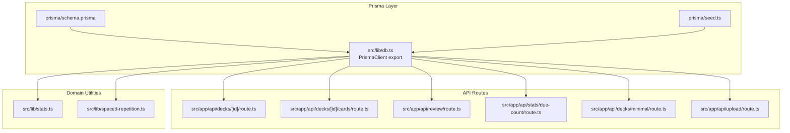

**Diagram sources**
- [schema.prisma:1-51](file://prisma/schema.prisma#L1-L51)
- [db.ts:1-68](file://src/lib/db.ts#L1-L68)
- [seed.ts:1-332](file://prisma/seed.ts#L1-L332)
- [route.ts:1-43](file://src/app/api/decks/[id]/route.ts#L1-L43)
- [route.ts:1-40](file://src/app/api/decks/[id]/cards/route.ts#L1-L40)
- [route.ts:1-76](file://src/app/api/review/route.ts#L1-L76)
- [route.ts:1-15](file://src/app/api/stats/due-count/route.ts#L1-L15)
- [route.ts:1-41](file://src/app/api/decks/minimal/route.ts#L1-L41)
- [route.ts:1-298](file://src/app/api/upload/route.ts#L1-L298)
- [stats.ts:1-222](file://src/lib/stats.ts#L1-L222)
- [spaced-repetition.ts:1-141](file://src/lib/spaced-repetition.ts#L1-L141)

**Section sources**
- [schema.prisma:1-51](file://prisma/schema.prisma#L1-L51)
- [db.ts:1-68](file://src/lib/db.ts#L1-L68)
- [package.json:1-54](file://package.json#L1-L54)

## Core Components
- Prisma client initialization and environment-aware URL selection
- CRUD operations via API routes
- Relationship queries and filtering
- Transaction handling for atomic updates
- Batch operations and seeding
- Dashboard statistics and complex aggregations
- Spaced repetition integration
- Upload pipeline with streaming and deduplication

**Section sources**
- [db.ts:1-68](file://src/lib/db.ts#L1-L68)
- [route.ts:1-43](file://src/app/api/decks/[id]/route.ts#L1-L43)
- [route.ts:1-40](file://src/app/api/decks/[id]/cards/route.ts#L1-L40)
- [route.ts:1-76](file://src/app/api/review/route.ts#L1-L76)
- [route.ts:1-15](file://src/app/api/stats/due-count/route.ts#L1-L15)
- [route.ts:1-41](file://src/app/api/decks/minimal/route.ts#L1-L41)
- [route.ts:1-298](file://src/app/api/upload/route.ts#L1-L298)
- [stats.ts:1-222](file://src/lib/stats.ts#L1-L222)
- [spaced-repetition.ts:1-141](file://src/lib/spaced-repetition.ts#L1-L141)
- [seed.ts:1-332](file://prisma/seed.ts#L1-L332)

## Architecture Overview
The application uses a singleton Prisma client initialized once per process. API routes import this client to perform database operations. Domain logic is encapsulated in utility modules that rely on the client for data access. Transactions ensure atomicity for review updates and related logs.

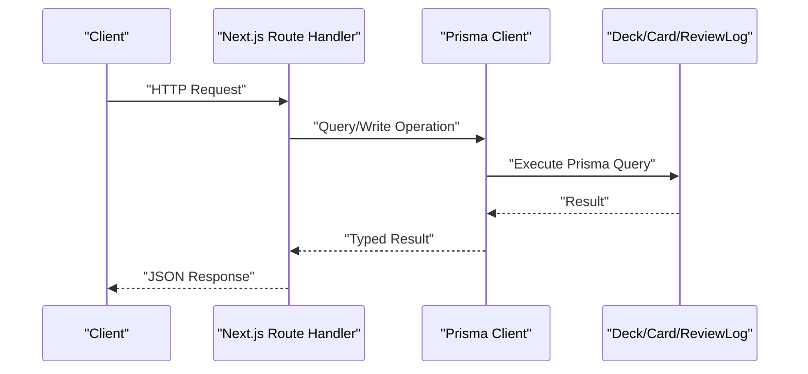

**Diagram sources**
- [db.ts:1-68](file://src/lib/db.ts#L1-L68)
- [route.ts:1-76](file://src/app/api/review/route.ts#L1-L76)
- [stats.ts:1-222](file://src/lib/stats.ts#L1-L222)

## Detailed Component Analysis

### Prisma Client Initialization and Connection Management
- Environment-aware URL selection prioritizes platform-specific pooled URLs in production and falls back to standard Postgres URLs.
- SSL mode is enforced for serverless environments to satisfy provider requirements.
- A singleton pattern prevents multiple client instances and supports hot reloading during development.

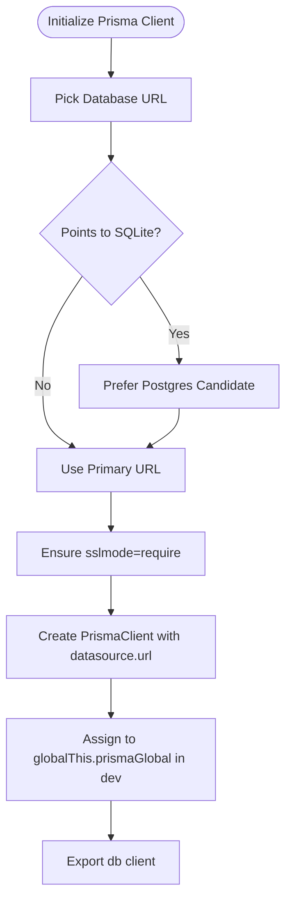

**Diagram sources**
- [db.ts:8-67](file://src/lib/db.ts#L8-L67)

**Section sources**
- [db.ts:8-67](file://src/lib/db.ts#L8-L67)

### CRUD Operations
- Update a deck by ID with selective field updates.
- Delete a deck by ID.
- Create a card under a deck and increment the deck’s card count.
- Minimal deck listing with due counts computed client-side from selected fields.

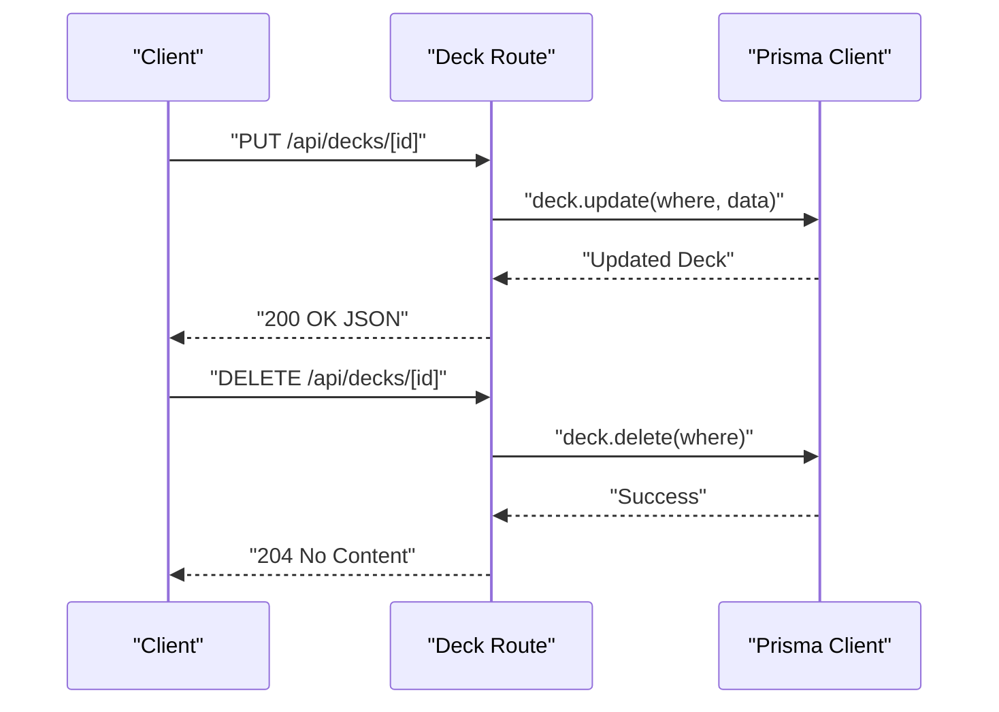

**Diagram sources**
- [route.ts:1-43](file://src/app/api/decks/[id]/route.ts#L1-L43)

**Section sources**
- [route.ts:1-43](file://src/app/api/decks/[id]/route.ts#L1-L43)
- [route.ts:1-40](file://src/app/api/decks/[id]/cards/route.ts#L1-L40)
- [route.ts:1-41](file://src/app/api/decks/minimal/route.ts#L1-L41)

### Relationship Queries and Filtering
- Fetch related entities with include/select to avoid N+1 and limit payload size.
- Filter by composite conditions such as next review deadline and status.
- Compute derived metrics (e.g., due counts) by filtering and counting.

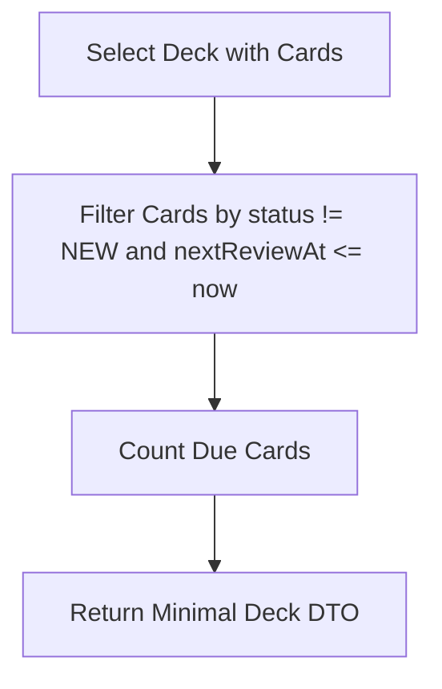

**Diagram sources**
- [route.ts:8-35](file://src/app/api/decks/minimal/route.ts#L8-L35)
- [stats.ts:20-31](file://src/lib/stats.ts#L20-L31)

**Section sources**
- [route.ts:1-41](file://src/app/api/decks/minimal/route.ts#L1-L41)
- [stats.ts:20-31](file://src/lib/stats.ts#L20-L31)

### Transaction Handling
- Atomic updates combine card state, review log creation, and deck last-studied timestamp in a single transaction to maintain consistency.

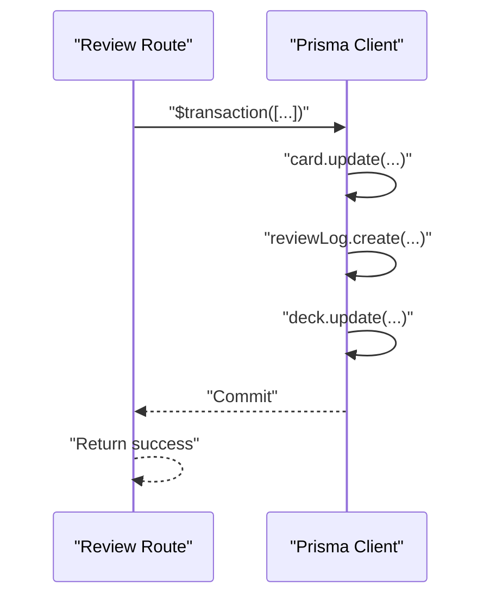

**Diagram sources**
- [route.ts:45-68](file://src/app/api/review/route.ts#L45-L68)

**Section sources**
- [route.ts:1-76](file://src/app/api/review/route.ts#L1-L76)

### Batch Operations and Seeding
- Seed script performs bulk deletes followed by batch creates for decks, cards, and review logs.
- Uses batch insert for review logs to minimize round-trips.

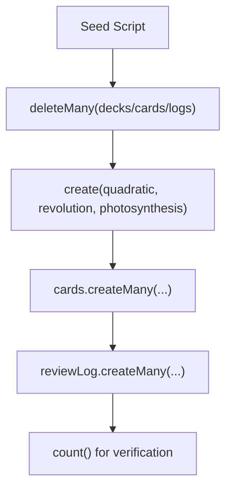

**Diagram sources**
- [seed.ts:9-332](file://prisma/seed.ts#L9-L332)

**Section sources**
- [seed.ts:1-332](file://prisma/seed.ts#L1-L332)

### Complex Queries: Joins Across Deck, Card, and ReviewLog
- Dashboard overview aggregates counts, heatmap data, recent sessions, and deck-level segmentation by joining across models.
- Uses include/orderBy/select to efficiently fetch related data and compute derived metrics.

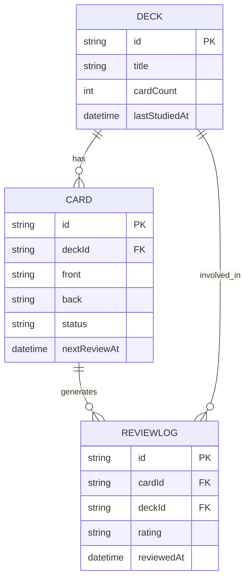

**Diagram sources**
- [schema.prisma:10-50](file://prisma/schema.prisma#L10-L50)

**Section sources**
- [stats.ts:51-88](file://src/lib/stats.ts#L51-L88)
- [stats.ts:122-177](file://src/lib/stats.ts#L122-L177)

### Spaced Repetition Integration
- Review quality drives algorithmic updates to ease factor, interval, repetition count, and status.
- Session queue builds a prioritized set of cards combining overdue and new items.

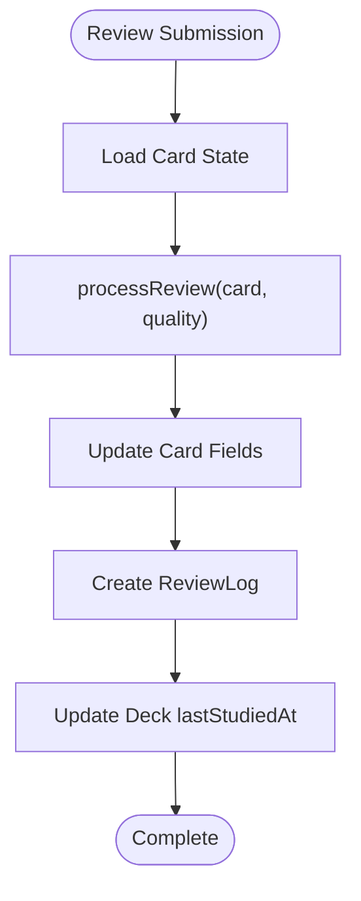

**Diagram sources**
- [route.ts:5-76](file://src/app/api/review/route.ts#L5-L76)
- [spaced-repetition.ts:29-76](file://src/lib/spaced-repetition.ts#L29-L76)

**Section sources**
- [route.ts:1-76](file://src/app/api/review/route.ts#L1-L76)
- [spaced-repetition.ts:1-141](file://src/lib/spaced-repetition.ts#L1-L141)

### Upload Pipeline and Deduplication
- Parses PDF, chunks text, generates flashcards via AI, deduplicates cards, and persists a new deck with cards.
- Streams progress to the client and handles public error messages for common failures.

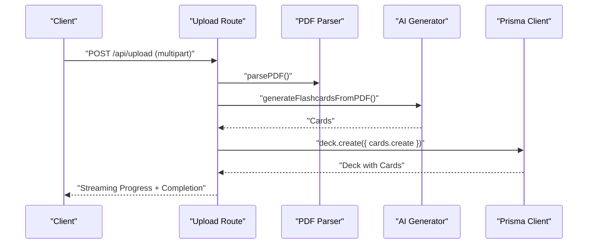

**Diagram sources**
- [route.ts:86-298](file://src/app/api/upload/route.ts#L86-L298)

**Section sources**
- [route.ts:1-298](file://src/app/api/upload/route.ts#L1-L298)

## Dependency Analysis
- The Prisma client depends on the schema definition and environment variables.
- API routes depend on the client for data access.
- Utilities depend on the client for aggregations and computations.
- Scripts depend on the client for seeding.

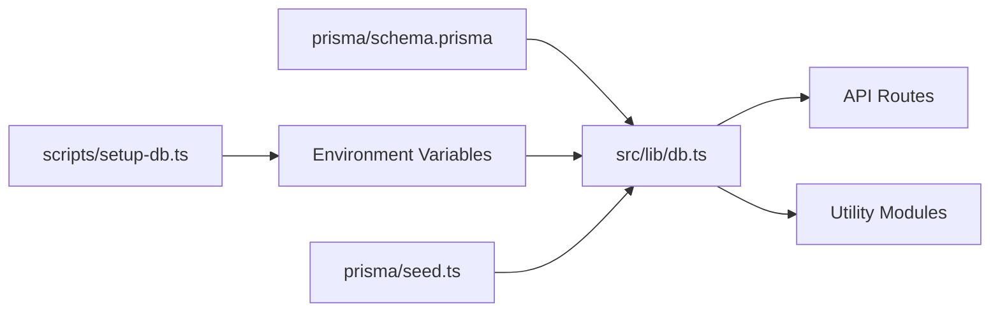

**Diagram sources**
- [schema.prisma:1-51](file://prisma/schema.prisma#L1-L51)
- [db.ts:1-68](file://src/lib/db.ts#L1-L68)
- [setup-db.ts:1-58](file://scripts/setup-db.ts#L1-L58)
- [seed.ts:1-332](file://prisma/seed.ts#L1-L332)

**Section sources**
- [schema.prisma:1-51](file://prisma/schema.prisma#L1-L51)
- [db.ts:1-68](file://src/lib/db.ts#L1-L68)
- [package.json:15-17](file://package.json#L15-L17)

## Performance Considerations
- Prefer select projections to limit payload size and reduce bandwidth.
- Use include judiciously; for read-heavy views, prefer separate queries or denormalized fields.
- Batch operations (e.g., createMany) reduce round-trips during seeding or imports.
- Leverage transactions to avoid partial writes and maintain consistency.
- Use indexes and appropriate filters to optimize count and due-date queries.
- Minimize N+1 queries by fetching relations in a single operation.

[No sources needed since this section provides general guidance]

## Troubleshooting Guide
Common issues and remedies:
- Missing or incorrect DATABASE_URL: The upload route checks for DATABASE_URL early and returns a clear message if missing.
- Prisma connection/authentication errors: The upload route recognizes Prisma-related error patterns and surfaces a helpful message.
- SSL requirements in serverless: The client enforces sslmode=require for Postgres URLs.
- Environment precedence: Production prefers platform-specific pooled URLs; development favors DATABASE_URL.

**Section sources**
- [route.ts:86-106](file://src/app/api/upload/route.ts#L86-L106)
- [route.ts:50-62](file://src/app/api/upload/route.ts#L50-L62)
- [db.ts:41-47](file://src/lib/db.ts#L41-L47)
- [db.ts:11-39](file://src/lib/db.ts#L11-L39)

## Conclusion
The project employs a clean, centralized Prisma client with environment-aware configuration and strong type safety. API routes implement robust CRUD, filtering, and aggregation patterns, while transactions guarantee consistency for critical operations like reviews. Utilities encapsulate domain logic for statistics and spaced repetition. The upload pipeline demonstrates scalable patterns for large data ingestion with streaming and deduplication. Adhering to the outlined best practices ensures reliable, performant, and maintainable data access.

[No sources needed since this section summarizes without analyzing specific files]

## Appendices

### Best Practices Checklist
- Centralize Prisma client initialization and reuse the exported instance.
- Use select/include to control payload sizes and avoid N+1.
- Wrap critical updates in transactions.
- Prefer batch operations for bulk inserts/updates.
- Validate inputs and return explicit error messages.
- Enforce sslmode=require for Postgres URLs in serverless.
- Keep environment variables secure and documented.

[No sources needed since this section provides general guidance]