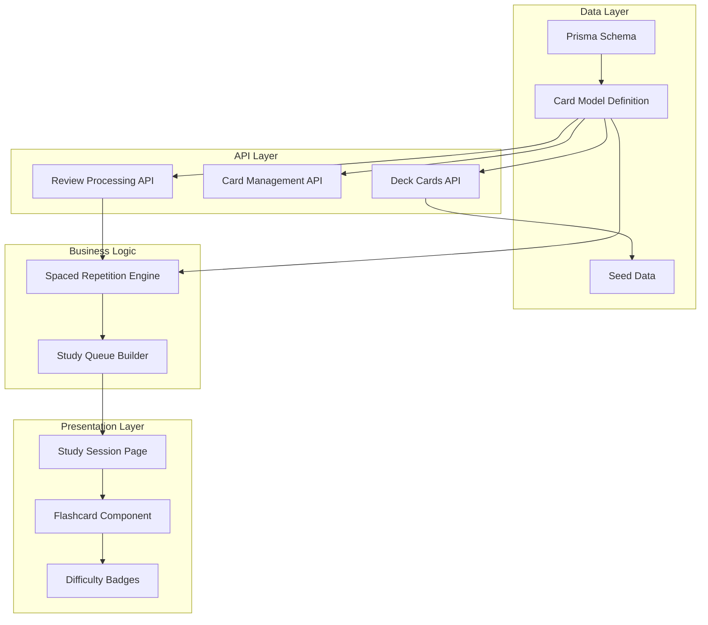
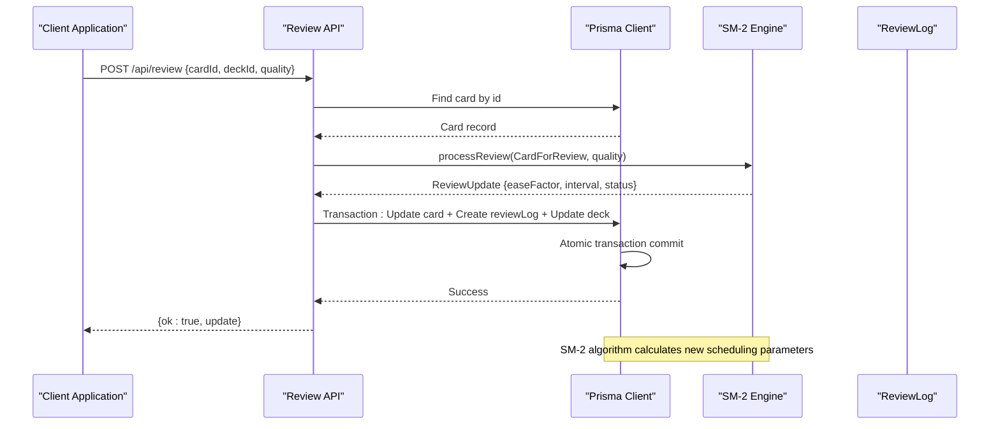
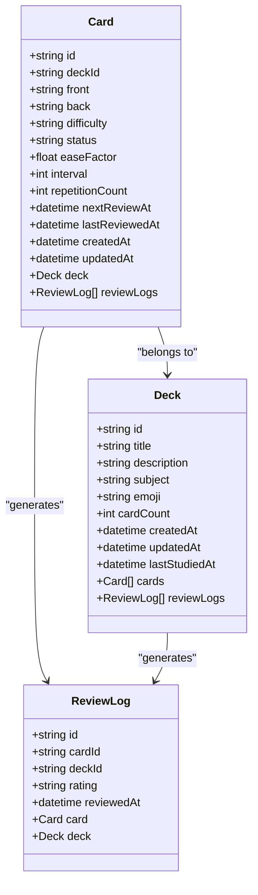
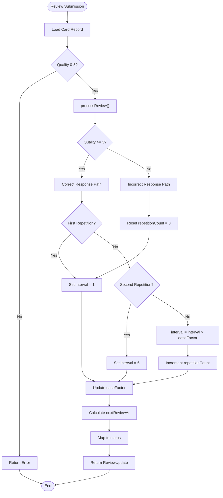
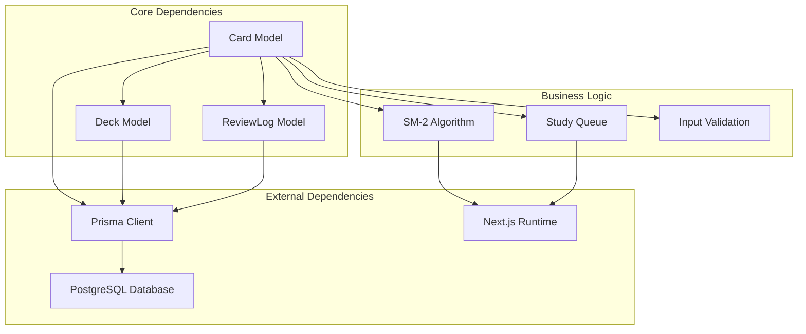

# Card Model

<cite>
**Referenced Files in This Document**
- [schema.prisma](file://prisma/schema.prisma)
- [seed.ts](file://prisma/seed.ts)
- [db.ts](file://src/lib/db.ts)
- [route.ts](file://src/app/api/decks/[id]/cards/route.ts)
- [route.ts](file://src/app/api/cards/[id]/route.ts)
- [route.ts](file://src/app/api/review/route.ts)
- [spaced-repetition.ts](file://src/lib/spaced-repetition.ts)
- [page.tsx](file://src/app/decks/[id]/study/page.tsx)
- [Flashcard3D.tsx](file://src/components/flashcard/Flashcard3D.tsx)
- [constants.ts](file://src/lib/constants.ts)
</cite>

## Table of Contents
1. [Introduction](#introduction)
2. [Project Structure](#project-structure)
3. [Core Components](#core-components)
4. [Architecture Overview](#architecture-overview)
5. [Detailed Component Analysis](#detailed-component-analysis)
6. [Dependency Analysis](#dependency-analysis)
7. [Performance Considerations](#performance-considerations)
8. [Troubleshooting Guide](#troubleshooting-guide)
9. [Conclusion](#conclusion)

## Introduction
This document provides comprehensive documentation for the Card model entity used in the spaced repetition learning system. The Card model represents individual flashcards within a deck, storing both content (front/back) and scheduling metadata for intelligent review scheduling using the SM-2 algorithm. The model integrates tightly with Deck (one-to-many relationship) and ReviewLog (one-to-many relationship) to support comprehensive learning analytics and review tracking.

## Project Structure
The Card model is defined within the Prisma schema and integrated across multiple layers of the application stack:



**Diagram sources**
- [schema.prisma:24-40](file://prisma/schema.prisma#L24-L40)
- [route.ts:1-40](file://src/app/api/decks/[id]/cards/route.ts#L1-L40)
- [route.ts:1-76](file://src/app/api/review/route.ts#L1-L76)
- [spaced-repetition.ts:1-92](file://src/lib/spaced-repetition.ts#L1-L92)

**Section sources**
- [schema.prisma:1-51](file://prisma/schema.prisma#L1-L51)
- [db.ts:1-68](file://src/lib/db.ts#L1-L68)

## Core Components
The Card model serves as the fundamental unit of the spaced repetition system, containing both content and scheduling intelligence:

### Primary Fields
- **id**: Unique identifier using cuid() for guaranteed uniqueness
- **deckId**: Foreign key linking to the parent Deck entity
- **front/back**: Content fields storing question and answer text
- **difficulty**: Learning difficulty level (EASY/MEDIUM/HARD)
- **status**: Current learning status (NEW/LEARNING/REVIEW/MASTERED)

### Spaced Repetition Fields
- **easeFactor**: SM-2 ease factor (Float) with default 2.5
- **interval**: Days until next review (Int) with default 0
- **repetitionCount**: Number of successful reviews (Int) with default 0

### Scheduling Fields
- **nextReviewAt**: Next scheduled review datetime with default now()
- **lastReviewedAt**: Timestamp of last review completion

### Timestamps
- **createdAt**: Automatic timestamp for record creation
- **updatedAt**: Automatic timestamp for record updates

**Section sources**
- [schema.prisma:24-40](file://prisma/schema.prisma#L24-L40)

## Architecture Overview
The Card model participates in a sophisticated three-tier architecture combining data persistence, business logic, and presentation layers:



**Diagram sources**
- [route.ts:5-75](file://src/app/api/review/route.ts#L5-L75)
- [spaced-repetition.ts:29-76](file://src/lib/spaced-repetition.ts#L29-L76)

The architecture ensures atomicity through Prisma transactions, maintaining data consistency across card updates, review logging, and deck statistics.

## Detailed Component Analysis

### Card Model Definition
The Card model implements a comprehensive schema supporting both content storage and intelligent scheduling:



**Diagram sources**
- [schema.prisma:10-22](file://prisma/schema.prisma#L10-L22)
- [schema.prisma:24-40](file://prisma/schema.prisma#L24-L40)
- [schema.prisma:42-50](file://prisma/schema.prisma#L42-L50)

### SM-2 Algorithm Integration
The Card model's spaced repetition fields directly integrate with the SM-2 algorithm, a proven technique for optimizing long-term retention:

#### Algorithm Implementation Details
The SM-2 engine processes user ratings (0-5) to adjust scheduling parameters:



**Diagram sources**
- [spaced-repetition.ts:29-76](file://src/lib/spaced-repetition.ts#L29-L76)

#### Status Classification Logic
The algorithm maps repetition patterns to meaningful learning states:

| Repetition Count | Interval | Status |
|------------------|----------|--------|
| 0 | - | LEARNING |
| 1 | - | LEARNING |
| 2 | - | LEARNING |
| ≥3 & <21 | - | REVIEW |
| ≥3 & ≥21 | - | MASTERED |

**Section sources**
- [spaced-repetition.ts:58-76](file://src/lib/spaced-repetition.ts#L58-L76)

### Prisma Client Usage Patterns
The Card model integrates with Prisma client through standardized CRUD operations:

#### Card Creation Pattern
```typescript
// POST /api/decks/[id]/cards
const card = await db.card.create({
  data: {
    deckId: params.id,
    front,
    back,
    difficulty: "MEDIUM",
    status: "NEW",
    easeFactor: 2.5,
    interval: 0,
    repetitionCount: 0,
  },
});
```

#### Card Update Pattern
```typescript
// PUT /api/cards/[id]
const card = await db.card.update({
  where: { id: params.id },
  data: {
    front,
    back,
  },
});
```

#### Card Deletion Pattern
```typescript
// DELETE /api/cards/[id]
const card = await db.card.delete({
  where: { id: params.id },
});

// Cascade deletion automatically removes associated ReviewLog entries
await db.deck.update({
  where: { id: card.deckId },
  data: { cardCount: { decrement: 1 } },
});
```

**Section sources**
- [route.ts:4-39](file://src/app/api/decks/[id]/cards/route.ts#L4-L39)
- [route.ts:4-46](file://src/app/api/cards/[id]/route.ts#L4-L46)

### Review Processing Workflow
The review system coordinates multiple data operations atomically:

```mermaid
sequenceDiagram
participant Client as "Client"
participant API as "Review API"
participant DB as "Prisma Client"
participant Engine as "SM-2 Engine"
Client->>API : Submit review {cardId, deckId, quality}
API->>DB : Find card
DB-->>API : Card data
API->>Engine : processReview(card, quality)
Engine-->>API : Calculated update
API->>DB : $transaction([
card.update(),
reviewLog.create(),
deck.update()
])
DB-->>API : Success
API-->>Client : {ok : true, update}
```

**Diagram sources**
- [route.ts:5-75](file://src/app/api/review/route.ts#L5-L75)

**Section sources**
- [route.ts:44-68](file://src/app/api/review/route.ts#L44-L68)

### Frontend Integration
The Card model drives the user interface through multiple components:

#### Study Session Integration
The study page converts database records to the SM-2 processing format:

```typescript
const allCards: CardForReview[] = deck.cards.map((card) => ({
  id: card.id,
  front: card.front,
  back: card.back,
  difficulty: card.difficulty,
  status: card.status,
  easeFactor: card.easeFactor,
  interval: card.interval,
  repetitionCount: card.repetitionCount,
  nextReviewAt: card.nextReviewAt.toISOString(),
  lastReviewedAt: card.lastReviewedAt?.toISOString() ?? null,
}));
```

#### Flashcard Presentation
The flashcard component displays difficulty indicators and content:

```typescript
// Difficulty badge styling based on card difficulty
<span className={`rounded-full px-2.5 py-1 text-[11px] font-medium uppercase tracking-wide ${
  DIFFICULTY_STYLES[difficulty] ?? DIFFICULTY_STYLES.MEDIUM
}`}>
  {difficulty}
</span>
```

**Section sources**
- [page.tsx:60-72](file://src/app/decks/[id]/study/page.tsx#L60-L72)
- [Flashcard3D.tsx:78-87](file://src/components/flashcard/Flashcard3D.tsx#L78-L87)

## Dependency Analysis
The Card model participates in several critical dependency relationships:



**Diagram sources**
- [schema.prisma:10-50](file://prisma/schema.prisma#L10-L50)
- [db.ts:1-68](file://src/lib/db.ts#L1-L68)

### Relationship Constraints
- **Cascade Deletion**: Card deletion triggers automatic ReviewLog cleanup
- **Foreign Key Integrity**: deckId maintains referential integrity
- **Default Values**: Comprehensive defaults ensure consistent initial state

**Section sources**
- [schema.prisma:27](file://prisma/schema.prisma#L27)
- [schema.prisma:45](file://prisma/schema.prisma#L45)

## Performance Considerations
The Card model architecture incorporates several performance optimizations:

### Indexing Strategy
- Primary key indexing on id field
- Foreign key indexing on deckId for join operations
- Composite indexing for review scheduling queries

### Memory Management
- Efficient DTO conversion in study sessions
- Lazy loading of related entities
- Batch operations for bulk updates

### Scalability Features
- Atomic transactions prevent partial updates
- Cascade relationships reduce manual cleanup operations
- Default values minimize database round trips

## Troubleshooting Guide

### Common Issues and Solutions

#### Review Calculation Errors
**Problem**: Incorrect ease factor or interval values after review
**Solution**: Verify quality parameter range (0-5) and check for transaction failures

#### Scheduling Conflicts
**Problem**: Cards appearing due for review incorrectly
**Solution**: Ensure nextReviewAt normalization to start of day and timezone consistency

#### Data Consistency Issues
**Problem**: Inconsistent card counts or orphaned records
**Solution**: Leverage cascade deletion and atomic transactions

**Section sources**
- [route.ts:15-20](file://src/app/api/review/route.ts#L15-L20)
- [spaced-repetition.ts:52-55](file://src/lib/spaced-repetition.ts#L52-L55)

### Debugging Patterns
- Monitor Prisma client queries for performance bottlenecks
- Validate input parameters before processing
- Use transaction rollback for error recovery
- Track ReviewLog creation for audit trails

## Conclusion
The Card model represents a sophisticated integration of content storage and intelligent scheduling mechanics. Through its comprehensive field definitions, SM-2 algorithm integration, and robust API patterns, it provides a solid foundation for effective spaced repetition learning. The model's design emphasizes data integrity through cascade relationships, atomic operations, and comprehensive default values, while its frontend integration delivers an intuitive user experience for flashcard-based learning.

The implementation demonstrates best practices in modern web development, combining Prisma's type safety with Next.js's performance optimizations and React's component architecture to create a seamless learning experience.