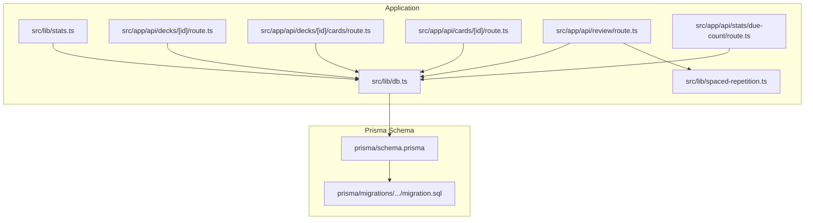
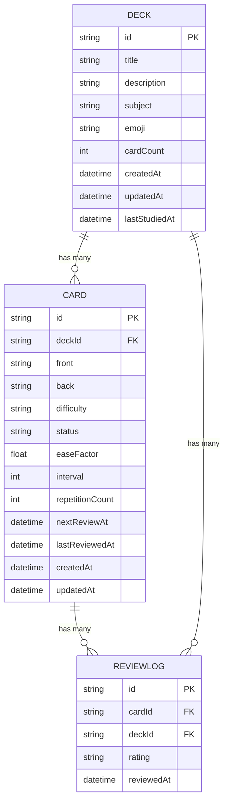
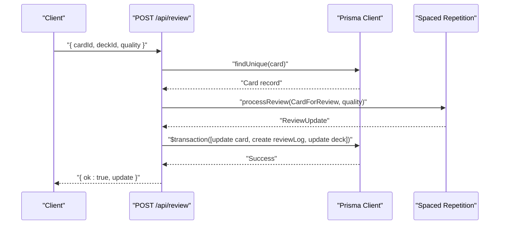
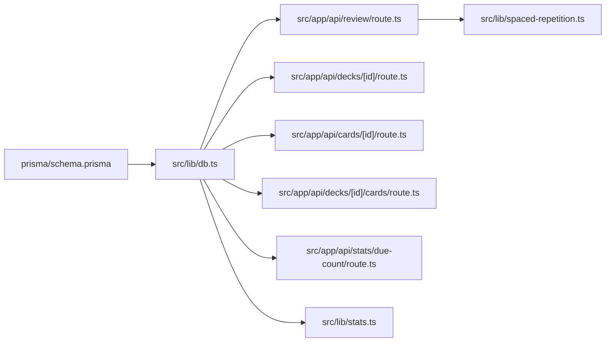

# Data Models

<cite>
**Referenced Files in This Document**
- [prisma/schema.prisma](file://prisma/schema.prisma)
- [prisma/migrations/20260421034221_init/migration.sql](file://prisma/migrations/20260421034221_init/migration.sql)
- [prisma/seed.ts](file://prisma/seed.ts)
- [src/lib/db.ts](file://src/lib/db.ts)
- [src/lib/spaced-repetition.ts](file://src/lib/spaced-repetition.ts)
- [src/lib/stats.ts](file://src/lib/stats.ts)
- [src/app/api/decks/[id]/route.ts](file://src/app/api/decks/[id]/route.ts)
- [src/app/api/decks/[id]/cards/route.ts](file://src/app/api/decks/[id]/cards/route.ts)
- [src/app/api/cards/[id]/route.ts](file://src/app/api/cards/[id]/route.ts)
- [src/app/api/review/route.ts](file://src/app/api/review/route.ts)
- [src/app/api/stats/due-count/route.ts](file://src/app/api/stats/due-count/route.ts)
- [src/lib/constants.ts](file://src/lib/constants.ts)
</cite>

## Table of Contents
1. [Introduction](#introduction)
2. [Project Structure](#project-structure)
3. [Core Components](#core-components)
4. [Architecture Overview](#architecture-overview)
5. [Detailed Component Analysis](#detailed-component-analysis)
6. [Dependency Analysis](#dependency-analysis)
7. [Performance Considerations](#performance-considerations)
8. [Troubleshooting Guide](#troubleshooting-guide)
9. [Conclusion](#conclusion)

## Introduction
This document provides detailed data model documentation for the Deck, Card, and ReviewLog entities in the application’s database schema. It covers field definitions, constraints, defaults, data types, validation rules, and practical usage patterns with the Prisma client. It also explains how these models relate to each other and how they are used across the backend API and statistics computations.

## Project Structure
The data models are defined in the Prisma schema and enforced by the database migration. The application uses a Prisma client wrapper for database access and applies spaced repetition logic during reviews.

**Diagram sources**
- [prisma/schema.prisma:10-50](file://prisma/schema.prisma#L10-L50)
- [prisma/migrations/20260421034221_init/migration.sql:1-42](file://prisma/migrations/20260421034221_init/migration.sql#L1-L42)
- [src/lib/db.ts:1-68](file://src/lib/db.ts#L1-L68)
- [src/lib/spaced-repetition.ts:1-141](file://src/lib/spaced-repetition.ts#L1-L141)
- [src/lib/stats.ts:1-222](file://src/lib/stats.ts#L1-L222)
- [src/app/api/decks/[id]/route.ts:1-43](file://src/app/api/decks/[id]/route.ts#L1-L43)
- [src/app/api/decks/[id]/cards/route.ts:1-40](file://src/app/api/decks/[id]/cards/route.ts#L1-L40)
- [src/app/api/cards/[id]/route.ts:1-47](file://src/app/api/cards/[id]/route.ts#L1-L47)
- [src/app/api/review/route.ts:1-76](file://src/app/api/review/route.ts#L1-L76)
- [src/app/api/stats/due-count/route.ts:1-15](file://src/app/api/stats/due-count/route.ts#L1-L15)

**Section sources**
- [prisma/schema.prisma:1-51](file://prisma/schema.prisma#L1-L51)
- [prisma/migrations/20260421034221_init/migration.sql:1-42](file://prisma/migrations/20260421034221_init/migration.sql#L1-L42)
- [src/lib/db.ts:1-68](file://src/lib/db.ts#L1-L68)

## Core Components
This section documents each model with its fields, constraints, defaults, and usage patterns.

### Deck Model
- Purpose: Represents a collection of flashcards organized by subject and metadata.
- Fields:
  - id: String, primary key, generated via cuid().
  - title: String, required.
  - description: String, optional.
  - subject: String, optional.
  - emoji: String, default "🧠".
  - cardCount: Int, default 0.
  - createdAt: DateTime, default now().
  - updatedAt: DateTime, auto-updated.
  - lastStudiedAt: DateTime, optional.
- Relationships:
  - Has many cards (one-to-many).
  - Has many reviewLogs (one-to-many).
- Defaults and constraints:
  - Emoji defaults to a brain emoji.
  - Card count defaults to 0.
  - Timestamps default to current time when created.
  - lastStudiedAt is nullable.
- Typical usage:
  - Creation with initial cardCount and optional metadata.
  - Updates to metadata and deletion.
  - Increment/decrement cardCount when cards are added/removed.

**Section sources**
- [prisma/schema.prisma:10-22](file://prisma/schema.prisma#L10-L22)
- [prisma/migrations/20260421034221_init/migration.sql:2-12](file://prisma/migrations/20260421034221_init/migration.sql#L2-L12)
- [src/app/api/decks/[id]/route.ts:4-42](file://src/app/api/decks/[id]/route.ts#L4-L42)
- [src/app/api/decks/[id]/cards/route.ts:15-32](file://src/app/api/decks/[id]/cards/route.ts#L15-L32)

### Card Model
- Purpose: Represents individual flashcards within a deck.
- Fields:
  - id: String, primary key, cuid().
  - deckId: String, foreign key to Deck(id), cascade delete.
  - front: String, required.
  - back: String, required.
  - difficulty: String, default "MEDIUM".
  - status: String, default "NEW".
  - easeFactor: Float, default 2.5.
  - interval: Int, default 0.
  - repetitionCount: Int, default 0.
  - nextReviewAt: DateTime, default now().
  - lastReviewedAt: DateTime, optional.
  - createdAt: DateTime, default now().
  - updatedAt: DateTime, auto-updated.
- Relationships:
  - Belongs to Deck (many-to-one).
  - Has many reviewLogs (one-to-many).
- Defaults and constraints:
  - Difficulty and status have defaults aligned with spaced repetition and lifecycle.
  - Ease factor, interval, and repetition count are initialized for new cards.
  - nextReviewAt defaults to creation time; later updated by scheduling logic.
  - lastReviewedAt is nullable.
- Typical usage:
  - Creation with defaults and association to a deck.
  - Updates to front/back content.
  - Deletion cascades to child records.

**Section sources**
- [prisma/schema.prisma:24-40](file://prisma/schema.prisma#L24-L40)
- [prisma/migrations/20260421034221_init/migration.sql:14-30](file://prisma/migrations/20260421034221_init/migration.sql#L14-L30)
- [src/app/api/cards/[id]/route.ts:4-46](file://src/app/api/cards/[id]/route.ts#L4-L46)
- [src/app/api/decks/[id]/cards/route.ts:15-26](file://src/app/api/decks/[id]/cards/route.ts#L15-L26)

### ReviewLog Model
- Purpose: Records a single review event with a rating and timestamp.
- Fields:
  - id: String, primary key, cuid().
  - cardId: String, foreign key to Card(id), cascade delete.
  - deckId: String, foreign key to Deck(id), cascade delete.
  - rating: String, required.
  - reviewedAt: DateTime, default now().
- Relationships:
  - Belongs to Card (many-to-one).
  - Belongs to Deck (many-to-one).
- Defaults and constraints:
  - Rating is stored as a string representation of a numeric quality score.
  - reviewedAt defaults to current time.
- Typical usage:
  - Creation upon successful review submission.
  - Aggregated for statistics and session grouping.

**Section sources**
- [prisma/schema.prisma:42-50](file://prisma/schema.prisma#L42-L50)
- [prisma/migrations/20260421034221_init/migration.sql:32-41](file://prisma/migrations/20260421034221_init/migration.sql#L32-L41)
- [src/app/api/review/route.ts:57-63](file://src/app/api/review/route.ts#L57-L63)

## Architecture Overview
The data models are connected through foreign keys and enforced by Prisma and PostgreSQL. The application uses a Prisma client wrapper for database access and applies spaced repetition scheduling during review submissions. Statistics endpoints query the models to compute derived metrics.

**Diagram sources**
- [prisma/schema.prisma:10-50](file://prisma/schema.prisma#L10-L50)
- [prisma/migrations/20260421034221_init/migration.sql:2-41](file://prisma/migrations/20260421034221_init/migration.sql#L2-L41)

## Detailed Component Analysis

### Deck Model Details
- Field constraints and defaults:
  - title is required.
  - subject and description are optional.
  - emoji defaults to a brain emoji.
  - cardCount defaults to 0.
  - createdAt and updatedAt are managed automatically.
  - lastStudiedAt is optional.
- Validation rules observed in usage:
  - Metadata updates are performed via API endpoints.
  - Deletion removes associated cards due to cascade.
- Usage patterns:
  - Creation with initial cardCount and optional metadata.
  - Increment/decrement cardCount when cards are added/removed.
  - Update lastStudiedAt on successful review completion.

**Section sources**
- [prisma/schema.prisma:10-22](file://prisma/schema.prisma#L10-L22)
- [prisma/migrations/20260421034221_init/migration.sql:2-12](file://prisma/migrations/20260421034221_init/migration.sql#L2-L12)
- [src/app/api/decks/[id]/route.ts:4-42](file://src/app/api/decks/[id]/route.ts#L4-L42)
- [src/app/api/decks/[id]/cards/route.ts:28-32](file://src/app/api/decks/[id]/cards/route.ts#L28-L32)

### Card Model Details
- Field constraints and defaults:
  - front and back are required.
  - difficulty defaults to "MEDIUM".
  - status defaults to "NEW".
  - easeFactor defaults to 2.5.
  - interval and repetitionCount default to 0.
  - nextReviewAt defaults to current time.
  - createdAt and updatedAt are managed automatically.
  - lastReviewedAt is optional.
- Validation rules observed in usage:
  - Creation requires front/back content.
  - Deletion decrements deck cardCount.
- Spaced repetition integration:
  - easeFactor, interval, repetitionCount, nextReviewAt, and status are updated by the scheduling algorithm.
  - lastReviewedAt is set upon review completion.

**Diagram sources**
- [src/app/api/review/route.ts:5-75](file://src/app/api/review/route.ts#L5-L75)
- [src/lib/spaced-repetition.ts:29-76](file://src/lib/spaced-repetition.ts#L29-L76)

**Section sources**
- [prisma/schema.prisma:24-40](file://prisma/schema.prisma#L24-L40)
- [prisma/migrations/20260421034221_init/migration.sql:14-30](file://prisma/migrations/20260421034221_init/migration.sql#L14-L30)
- [src/app/api/cards/[id]/route.ts:4-46](file://src/app/api/cards/[id]/route.ts#L4-L46)
- [src/app/api/review/route.ts:22-68](file://src/app/api/review/route.ts#L22-L68)
- [src/lib/spaced-repetition.ts:29-76](file://src/lib/spaced-repetition.ts#L29-L76)

### ReviewLog Model Details
- Field constraints and defaults:
  - rating is required.
  - reviewedAt defaults to current time.
- Usage patterns:
  - Created alongside card updates during review submissions.
  - Used for statistics computation (session grouping, heatmap, mastery rate).

**Section sources**
- [prisma/schema.prisma:42-50](file://prisma/schema.prisma#L42-L50)
- [prisma/migrations/20260421034221_init/migration.sql:32-41](file://prisma/migrations/20260421034221_init/migration.sql#L32-L41)
- [src/app/api/review/route.ts:57-63](file://src/app/api/review/route.ts#L57-L63)
- [src/lib/stats.ts:64-87](file://src/lib/stats.ts#L64-L87)

### Prisma Client Usage Patterns
- Database initialization:
  - A Prisma client is created and exported from a dedicated module with environment-aware URL selection and SSL enforcement.
- Typical operations:
  - CRUD on Deck and Card via API routes.
  - Atomic transaction for review updates combining card update, review log creation, and deck last-studied update.
  - Queries for statistics including counts, joins with related models, and computed metrics.

**Section sources**
- [src/lib/db.ts:1-68](file://src/lib/db.ts#L1-L68)
- [src/app/api/decks/[id]/route.ts:11-19](file://src/app/api/decks/[id]/route.ts#L11-L19)
- [src/app/api/decks/[id]/cards/route.ts:15-26](file://src/app/api/decks/[id]/cards/route.ts#L15-L26)
- [src/app/api/cards/[id]/route.ts:11-17](file://src/app/api/cards/[id]/route.ts#L11-L17)
- [src/app/api/review/route.ts:45-68](file://src/app/api/review/route.ts#L45-L68)
- [src/lib/stats.ts:20-31](file://src/lib/stats.ts#L20-L31)

## Dependency Analysis
The models are tightly coupled through foreign keys and are consumed by multiple API endpoints and statistics computations.

**Diagram sources**
- [prisma/schema.prisma:10-50](file://prisma/schema.prisma#L10-L50)
- [src/lib/db.ts:1-68](file://src/lib/db.ts#L1-L68)
- [src/app/api/review/route.ts:1-76](file://src/app/api/review/route.ts#L1-L76)
- [src/app/api/decks/[id]/route.ts:1-43](file://src/app/api/decks/[id]/route.ts#L1-L43)
- [src/app/api/cards/[id]/route.ts:1-47](file://src/app/api/cards/[id]/route.ts#L1-L47)
- [src/app/api/decks/[id]/cards/route.ts:1-40](file://src/app/api/decks/[id]/cards/route.ts#L1-L40)
- [src/app/api/stats/due-count/route.ts:1-15](file://src/app/api/stats/due-count/route.ts#L1-L15)
- [src/lib/stats.ts:1-222](file://src/lib/stats.ts#L1-L222)
- [src/lib/spaced-repetition.ts:1-141](file://src/lib/spaced-repetition.ts#L1-L141)

**Section sources**
- [prisma/schema.prisma:10-50](file://prisma/schema.prisma#L10-L50)
- [src/lib/db.ts:1-68](file://src/lib/db.ts#L1-L68)
- [src/app/api/review/route.ts:1-76](file://src/app/api/review/route.ts#L1-L76)
- [src/lib/stats.ts:1-222](file://src/lib/stats.ts#L1-L222)

## Performance Considerations
- Indexing: Foreign keys are defined in the migration; consider adding indexes on frequently filtered columns such as nextReviewAt and status for improved query performance.
- Transactions: Review updates are executed atomically, reducing race conditions and ensuring consistency.
- Aggregation queries: Statistics endpoints perform multiple counts and joins; ensure appropriate indexing and consider caching for dashboard-heavy workloads.

[No sources needed since this section provides general guidance]

## Troubleshooting Guide
- Missing fields during review:
  - The review endpoint validates presence of cardId, deckId, and quality and rejects invalid inputs.
- Quality bounds:
  - Quality must be within 0–5; otherwise, the endpoint returns a 400 error.
- Not found errors:
  - If a card is missing, the review endpoint responds with a 404 error.
- Transaction failures:
  - Review updates occur in a transaction; failures will roll back changes to maintain consistency.

**Section sources**
- [src/app/api/review/route.ts:15-26](file://src/app/api/review/route.ts#L15-L26)
- [src/app/api/review/route.ts:22-26](file://src/app/api/review/route.ts#L22-L26)
- [src/app/api/review/route.ts:71-74](file://src/app/api/review/route.ts#L71-L74)

## Conclusion
The Deck, Card, and ReviewLog models form a cohesive spaced repetition system. Defaults and constraints are carefully chosen to support the SM-2 scheduling algorithm and lifecycle states. The application’s API and statistics modules demonstrate robust usage patterns with transactions, cascading deletes, and computed metrics. Proper indexing and monitoring will help sustain performance as the dataset grows.