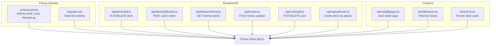
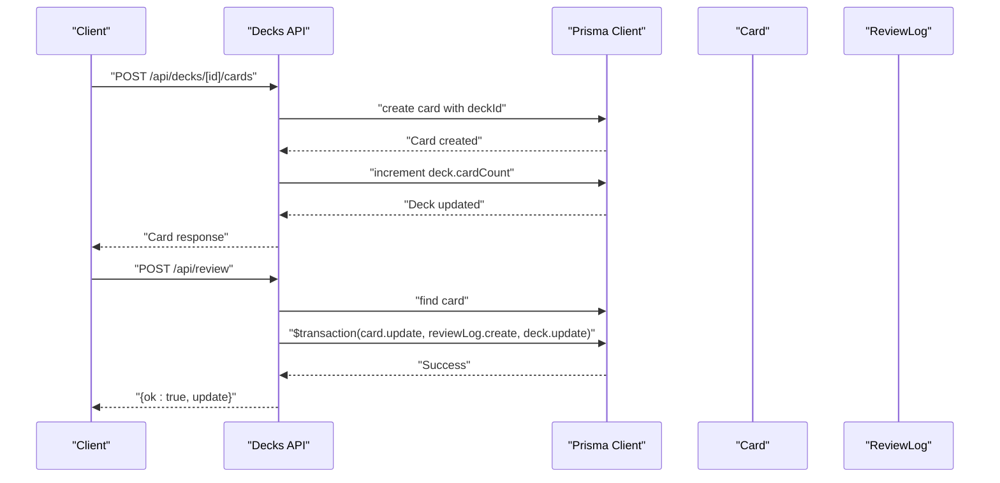
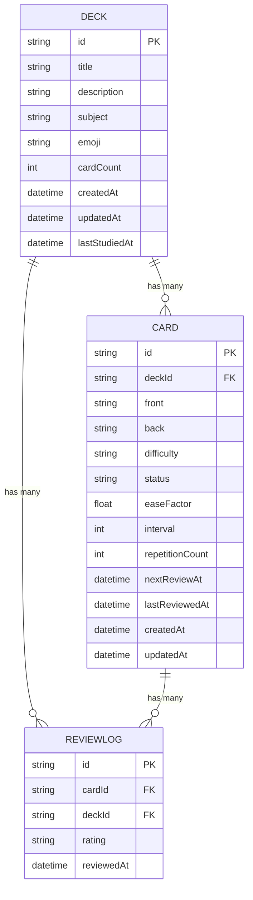
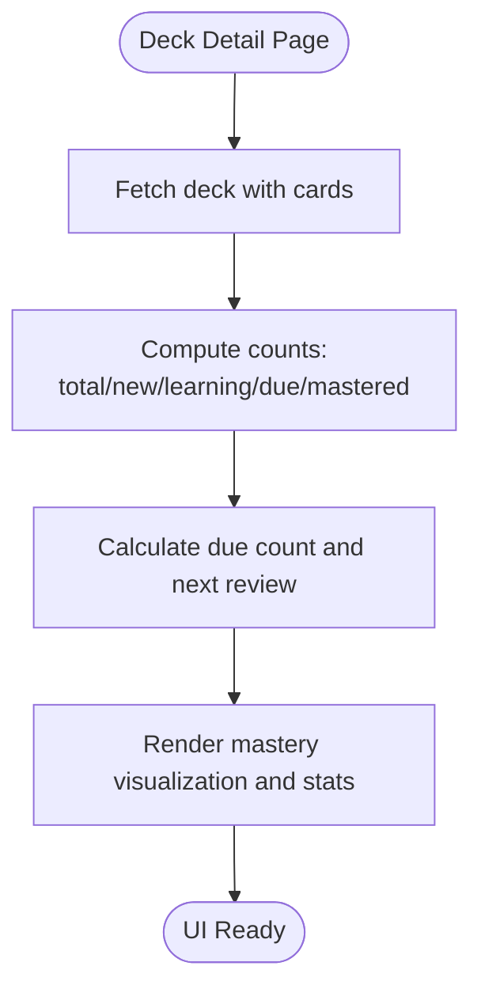
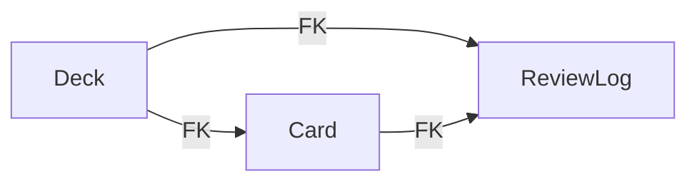

# Deck Model

<cite>
**Referenced Files in This Document**
- [schema.prisma](file://prisma/schema.prisma)
- [migration.sql](file://prisma/migrations/20260421034221_init/migration.sql)
- [db.ts](file://src/lib/db.ts)
- [route.ts](file://src/app/api/decks/[id]/route.ts)
- [route.ts](file://src/app/api/decks/[id]/cards/route.ts)
- [route.ts](file://src/app/api/decks/minimal/route.ts)
- [route.ts](file://src/app/api/review/route.ts)
- [page.tsx](file://src/app/decks/[id]/page.tsx)
- [DeckBrowser.tsx](file://src/components/deck/DeckBrowser.tsx)
- [DeckGrid.tsx](file://src/components/deck/DeckGrid.tsx)
- [route.ts](file://src/app/api/cards/[id]/route.ts)
- [route.ts](file://src/app/api/upload/route.ts)
- [seed.ts](file://prisma/seed.ts)
</cite>

## Table of Contents
1. [Introduction](#introduction)
2. [Project Structure](#project-structure)
3. [Core Components](#core-components)
4. [Architecture Overview](#architecture-overview)
5. [Detailed Component Analysis](#detailed-component-analysis)
6. [Dependency Analysis](#dependency-analysis)
7. [Performance Considerations](#performance-considerations)
8. [Troubleshooting Guide](#troubleshooting-guide)
9. [Conclusion](#conclusion)

## Introduction
This document provides comprehensive documentation for the Deck model entity used in the application. It covers all model fields, their types, defaults, and validations; describes relationships with Card and ReviewLog; and explains Prisma client usage patterns for CRUD operations, queries, and relationship handling. Practical examples demonstrate deck creation, updates, and retrieval across the backend API routes and frontend pages.

## Project Structure
The Deck model is defined in the Prisma schema and backed by PostgreSQL. API routes expose CRUD and domain-specific operations, while pages and components render deck data and drive user interactions.

**Diagram sources**
- [schema.prisma:10-22](file://prisma/schema.prisma#L10-L22)
- [migration.sql:1-42](file://prisma/migrations/20260421034221_init/migration.sql#L1-L42)
- [db.ts:1-68](file://src/lib/db.ts#L1-L68)
- [route.ts:1-43](file://src/app/api/decks/[id]/route.ts#L1-L43)
- [route.ts:1-40](file://src/app/api/decks/[id]/cards/route.ts#L1-L40)
- [route.ts:1-41](file://src/app/api/decks/minimal/route.ts#L1-L41)
- [route.ts:1-76](file://src/app/api/review/route.ts#L1-L76)
- [page.tsx:1-206](file://src/app/decks/[id]/page.tsx#L1-L206)
- [DeckBrowser.tsx:1-188](file://src/components/deck/DeckBrowser.tsx#L1-L188)
- [DeckGrid.tsx:1-95](file://src/components/deck/DeckGrid.tsx#L1-L95)
- [route.ts:1-47](file://src/app/api/cards/[id]/route.ts#L1-L47)
- [route.ts:211-255](file://src/app/api/upload/route.ts#L211-L255)

**Section sources**
- [schema.prisma:10-22](file://prisma/schema.prisma#L10-L22)
- [migration.sql:1-42](file://prisma/migrations/20260421034221_init/migration.sql#L1-L42)
- [db.ts:1-68](file://src/lib/db.ts#L1-L68)

## Core Components
This section documents the Deck model fields, defaults, and constraints, and outlines its relationships with Card and ReviewLog.

- Field: id
  - Type: String
  - Constraints: Required, unique identifier
  - Default: Generated automatically using cuid()
  - Notes: Used as the primary key

- Field: title
  - Type: String
  - Constraints: Required
  - Notes: Human-readable deck name

- Field: description
  - Type: String?
  - Constraints: Optional
  - Notes: Descriptive text for the deck

- Field: subject
  - Type: String?
  - Constraints: Optional
  - Notes: Subject category (e.g., Mathematics, History)

- Field: emoji
  - Type: String
  - Constraints: Required
  - Default: "🧠"
  - Notes: Display icon for the deck

- Field: cardCount
  - Type: Int
  - Constraints: Required
  - Default: 0
  - Notes: Tracks number of cards in the deck

- Field: createdAt
  - Type: DateTime
  - Constraints: Required
  - Default: Current timestamp
  - Notes: Creation time of the deck

- Field: updatedAt
  - Type: DateTime
  - Constraints: Required
  - Notes: Automatic timestamp update on record change

- Field: lastStudiedAt
  - Type: DateTime?
  - Constraints: Optional
  - Notes: Latest study activity timestamp

Relationships:
- One-to-many with Card[]
  - Cards are cascade-deleted when a deck is deleted
  - Maintained via deckId foreign key on Card

- One-to-many with ReviewLog[]
  - Review logs are cascade-deleted when a deck is deleted
  - Each ReviewLog references both Card and Deck

Field constraints and defaults are enforced by both Prisma schema and the generated PostgreSQL migration.

**Section sources**
- [schema.prisma:10-22](file://prisma/schema.prisma#L10-L22)
- [migration.sql:2-12](file://prisma/migrations/20260421034221_init/migration.sql#L2-L12)
- [schema.prisma:24-40](file://prisma/schema.prisma#L24-L40)
- [schema.prisma:42-50](file://prisma/schema.prisma#L42-L50)

## Architecture Overview
The Deck model participates in several workflows:
- Creation via upload pipeline
- Retrieval for minimal dashboard and detailed deck page
- Updates via API endpoints
- Cascade deletion of related cards and review logs
- Study session updates that modify card scheduling and deck timestamps

**Diagram sources**
- [route.ts:1-40](file://src/app/api/decks/[id]/cards/route.ts#L1-L40)
- [route.ts:1-76](file://src/app/api/review/route.ts#L1-L76)
- [db.ts:1-68](file://src/lib/db.ts#L1-L68)

## Detailed Component Analysis

### Deck Model Fields and Defaults
- id: String, @id, @default(cuid())
- title: String
- description: String?
- subject: String?
- emoji: String, @default("🧠")
- cardCount: Int, @default(0)
- createdAt: DateTime, @default(now())
- updatedAt: DateTime, @updatedAt
- lastStudiedAt: DateTime?

Defaults and constraints originate from the Prisma schema and are materialized in the migration.

**Section sources**
- [schema.prisma:10-22](file://prisma/schema.prisma#L10-L22)
- [migration.sql:2-12](file://prisma/migrations/20260421034221_init/migration.sql#L2-L12)

### Relationships with Card and ReviewLog
- Deck has many Cards; Card belongs to Deck
- Deck has many ReviewLogs; ReviewLog belongs to Deck
- Foreign keys and cascade delete are defined in the schema and migration

**Diagram sources**
- [schema.prisma:10-22](file://prisma/schema.prisma#L10-L22)
- [schema.prisma:24-40](file://prisma/schema.prisma#L24-L40)
- [schema.prisma:42-50](file://prisma/schema.prisma#L42-L50)
- [migration.sql:14-30](file://prisma/migrations/20260421034221_init/migration.sql#L14-L30)
- [migration.sql:32-41](file://prisma/migrations/20260421034221_init/migration.sql#L32-L41)

### Prisma Client Usage Patterns

#### CRUD Operations
- Create deck
  - Via upload pipeline: [route.ts:232-251](file://src/app/api/upload/route.ts#L232-L251)
  - Directly via Prisma: [seed.ts:14-115](file://prisma/seed.ts#L14-L115)

- Retrieve deck
  - Detailed page with included cards: [page.tsx:31-42](file://src/app/decks/[id]/page.tsx#L31-L42)
  - Minimal list with due counts: [route.ts:8-19](file://src/app/api/decks/minimal/route.ts#L8-L19)

- Update deck
  - API endpoint updates title/description/emoji/subject: [route.ts:9-19](file://src/app/api/decks/[id]/route.ts#L9-L19)

- Delete deck
  - API endpoint deletes deck (cascade removes cards/logs): [route.ts:33-35](file://src/app/api/decks/[id]/route.ts#L33-L35)

#### Relationship Queries
- Include cards when fetching deck: [page.tsx:35-41](file://src/app/decks/[id]/page.tsx#L35-L41)
- Create card and increment deck cardCount: [route.ts:15-32](file://src/app/api/decks/[id]/cards/route.ts#L15-L32)
- Delete card and decrement deck cardCount: [route.ts:36-39](file://src/app/api/cards/[id]/route.ts#L36-L39)
- Review updates: card update, review log creation, deck lastStudiedAt update: [route.ts:45-68](file://src/app/api/review/route.ts#L45-L68)

#### Examples of Deck Operations
- Create deck with cards (upload pipeline):
  - [route.ts:232-251](file://src/app/api/upload/route.ts#L232-L251)
- Update deck metadata:
  - [route.ts:9-19](file://src/app/api/decks/[id]/route.ts#L9-L19)
- Retrieve deck with cards ordered by creation time:
  - [page.tsx:31-42](file://src/app/decks/[id]/page.tsx#L31-L42)
- Get minimal deck list with due counts:
  - [route.ts:8-35](file://src/app/api/decks/minimal/route.ts#L8-L35)

**Section sources**
- [route.ts:1-43](file://src/app/api/decks/[id]/route.ts#L1-L43)
- [route.ts:1-40](file://src/app/api/decks/[id]/cards/route.ts#L1-L40)
- [route.ts:1-41](file://src/app/api/decks/minimal/route.ts#L1-L41)
- [route.ts:1-76](file://src/app/api/review/route.ts#L1-L76)
- [page.tsx:1-206](file://src/app/decks/[id]/page.tsx#L1-L206)
- [route.ts:1-47](file://src/app/api/cards/[id]/route.ts#L1-L47)
- [route.ts:232-251](file://src/app/api/upload/route.ts#L232-L251)
- [seed.ts:14-115](file://prisma/seed.ts#L14-L115)

### Frontend Integration
- Deck detail page computes due counts and displays mastery breakdown:
  - [page.tsx:66-84](file://src/app/decks/[id]/page.tsx#L66-L84)
- Deck browser filters and sorts decks client-side:
  - [DeckBrowser.tsx:41-92](file://src/components/deck/DeckBrowser.tsx#L41-L92)
- Deck grid renders deck cards and due indicators:
  - [DeckGrid.tsx:52-91](file://src/components/deck/DeckGrid.tsx#L52-L91)

**Diagram sources**
- [page.tsx:66-84](file://src/app/decks/[id]/page.tsx#L66-L84)

**Section sources**
- [page.tsx:1-206](file://src/app/decks/[id]/page.tsx#L1-L206)
- [DeckBrowser.tsx:1-188](file://src/components/deck/DeckBrowser.tsx#L1-L188)
- [DeckGrid.tsx:1-95](file://src/components/deck/DeckGrid.tsx#L1-L95)

## Dependency Analysis
Deck depends on Card and ReviewLog through foreign keys and cascade semantics. The API routes orchestrate deck lifecycle operations and maintain referential integrity.

**Diagram sources**
- [schema.prisma:24-40](file://prisma/schema.prisma#L24-L40)
- [schema.prisma:42-50](file://prisma/schema.prisma#L42-L50)
- [migration.sql:29](file://prisma/migrations/20260421034221_init/migration.sql#L29)
- [migration.sql:40](file://prisma/migrations/20260421034221_init/migration.sql#L40)

**Section sources**
- [schema.prisma:10-22](file://prisma/schema.prisma#L10-L22)
- [migration.sql:14-41](file://prisma/migrations/20260421034221_init/migration.sql#L14-L41)

## Performance Considerations
- Prefer selective field retrieval using Prisma select to reduce payload sizes (e.g., minimal decks endpoint).
- Use include judiciously; heavy includes can increase query cost.
- Batch operations and transactions (as used in review updates) help maintain consistency and reduce round-trips.
- Keep cardCount synchronized with actual card counts to avoid expensive recomputations.

## Troubleshooting Guide
Common issues and resolutions:
- Database URL configuration errors in production cause deck fetch failures:
  - See error handling in deck detail page:
    - [page.tsx:43-60](file://src/app/decks/[id]/page.tsx#L43-L60)
- Missing or invalid fields during deck/card operations:
  - Validation and error responses in API routes:
    - [route.ts:22-25](file://src/app/api/decks/[id]/route.ts#L22-L25)
    - [route.ts:11-13](file://src/app/api/decks/[id]/cards/route.ts#L11-L13)
    - [route.ts:15-20](file://src/app/api/review/route.ts#L15-L20)
- Cascade deletion behavior:
  - Deleting a deck removes related cards and review logs:
    - [schema.prisma:27](file://prisma/schema.prisma#L27)
    - [schema.prisma:47](file://prisma/schema.prisma#L47)

**Section sources**
- [page.tsx:43-60](file://src/app/decks/[id]/page.tsx#L43-L60)
- [route.ts:22-25](file://src/app/api/decks/[id]/route.ts#L22-L25)
- [route.ts:11-13](file://src/app/api/decks/[id]/cards/route.ts#L11-L13)
- [route.ts:15-20](file://src/app/api/review/route.ts#L15-L20)
- [schema.prisma:27](file://prisma/schema.prisma#L27)
- [schema.prisma:47](file://prisma/schema.prisma#L47)

## Conclusion
The Deck model encapsulates core study set metadata and maintains strong relationships with Cards and ReviewLogs. Its schema enforces defaults and constraints, while API routes and frontend components provide robust CRUD and presentation capabilities. Following the documented patterns ensures consistent behavior, data integrity, and efficient operations.