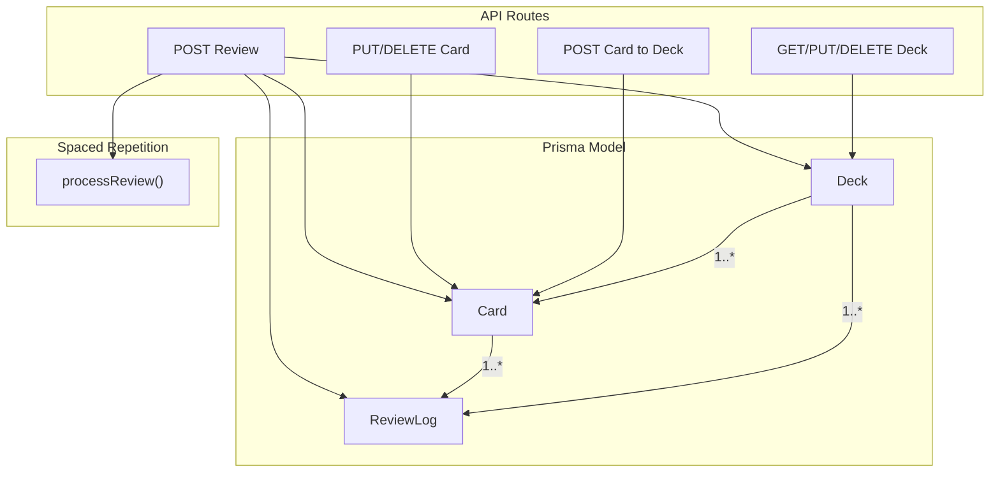
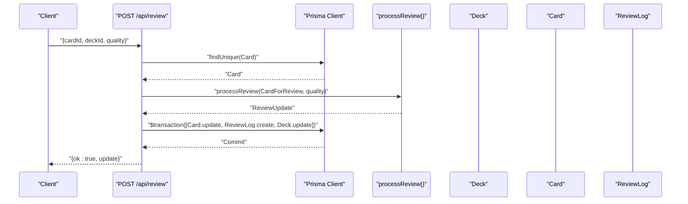
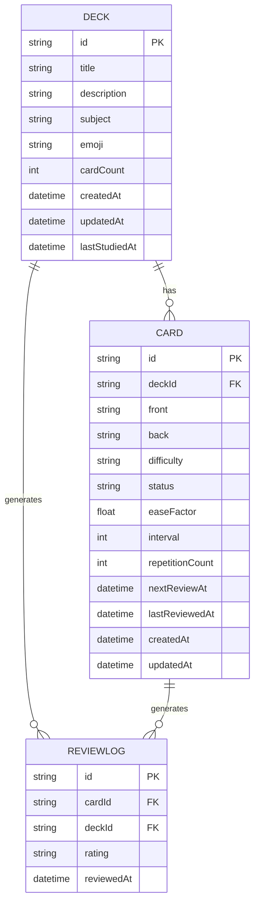
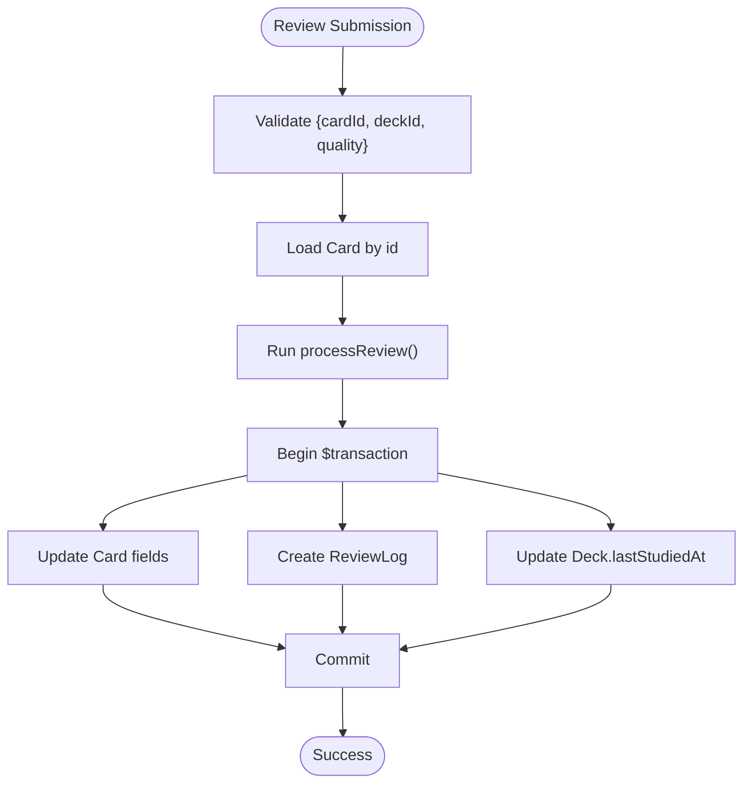
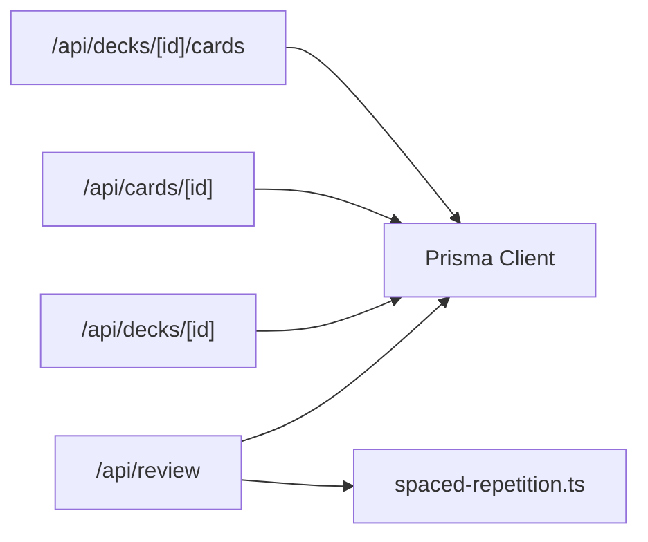

# Entity Relationships

<cite>
**Referenced Files in This Document**
- [schema.prisma](file://prisma/schema.prisma)
- [migration.sql](file://prisma/migrations/20260421034221_init/migration.sql)
- [db.ts](file://src/lib/db.ts)
- [route.ts](file://src/app/api/decks/[id]/route.ts)
- [route.ts](file://src/app/api/decks/[id]/cards/route.ts)
- [route.ts](file://src/app/api/cards/[id]/route.ts)
- [route.ts](file://src/app/api/review/route.ts)
- [spaced-repetition.ts](file://src/lib/spaced-repetition.ts)
- [seed.ts](file://prisma/seed.ts)
</cite>

## Table of Contents
1. [Introduction](#introduction)
2. [Project Structure](#project-structure)
3. [Core Components](#core-components)
4. [Architecture Overview](#architecture-overview)
5. [Detailed Component Analysis](#detailed-component-analysis)
6. [Dependency Analysis](#dependency-analysis)
7. [Performance Considerations](#performance-considerations)
8. [Troubleshooting Guide](#troubleshooting-guide)
9. [Conclusion](#conclusion)

## Introduction
This document explains the relationships among Deck, Card, and ReviewLog entities and how they support a spaced repetition system. It covers:
- One-to-many relationships and referential integrity
- Cascade deletion behavior
- How these relationships enable review tracking and analytics
- Prisma client patterns for querying related data, nested operations, and relationship management
- Examples of complex queries and aggregation patterns

## Project Structure
The entity model is defined in the Prisma schema and enforced by database migrations. API routes demonstrate practical usage of these relationships for CRUD, cascading updates, and transactional writes.

**Diagram sources**
- [schema.prisma:10-50](file://prisma/schema.prisma#L10-L50)
- [migration.sql:14-41](file://prisma/migrations/20260421034221_init/migration.sql#L14-L41)
- [route.ts:1-43](file://src/app/api/decks/[id]/route.ts#L1-L43)
- [route.ts:1-40](file://src/app/api/decks/[id]/cards/route.ts#L1-L40)
- [route.ts:1-47](file://src/app/api/cards/[id]/route.ts#L1-L47)
- [route.ts:1-76](file://src/app/api/review/route.ts#L1-L76)
- [spaced-repetition.ts:29-76](file://src/lib/spaced-repetition.ts#L29-L76)

**Section sources**
- [schema.prisma:10-50](file://prisma/schema.prisma#L10-L50)
- [migration.sql:14-41](file://prisma/migrations/20260421034221_init/migration.sql#L14-L41)

## Core Components
- Deck: Represents a collection of flashcards and tracks deck-level metadata such as cardCount and lastStudiedAt.
- Card: Represents individual flashcards belonging to a Deck; stores scheduling fields (easeFactor, interval, repetitionCount, nextReviewAt, lastReviewedAt) and status.
- ReviewLog: Records each review event with a rating and timestamp, linking both Card and Deck.

Relationships:
- Deck 1..* Card (via deckId foreign key)
- Deck 1..* ReviewLog (via deckId foreign key)
- Card 1..* ReviewLog (via cardId foreign key)

Cascade deletion:
- Deleting a Card deletes its ReviewLogs (and vice versa).
- Deleting a Deck deletes its Cards and their ReviewLogs.

Referential integrity:
- Foreign keys enforce that every Card belongs to a Deck.
- Every ReviewLog references both a Card and a Deck.

**Section sources**
- [schema.prisma:10-50](file://prisma/schema.prisma#L10-L50)
- [migration.sql:29-41](file://prisma/migrations/20260421034221_init/migration.sql#L29-L41)

## Architecture Overview
The system integrates Prisma ORM with Next.js API routes. Review submissions trigger the spaced repetition algorithm and persist updates atomically across Card, ReviewLog, and Deck.

**Diagram sources**
- [route.ts:5-76](file://src/app/api/review/route.ts#L5-L76)
- [spaced-repetition.ts:29-76](file://src/lib/spaced-repetition.ts#L29-L76)
- [db.ts:1-68](file://src/lib/db.ts#L1-L68)

## Detailed Component Analysis

### Relationship Model and Referential Integrity
- Deck to Cards: One Deck has many Cards; enforced by Card.deckId → Deck.id with cascade delete.
- Deck to ReviewLogs: One Deck has many ReviewLogs; enforced by ReviewLog.deckId → Deck.id with cascade delete.
- Card to ReviewLogs: One Card has many ReviewLogs; enforced by ReviewLog.cardId → Card.id with cascade delete.

Cascade deletion ensures that removing a Deck removes all dependent Cards and ReviewLogs, preventing orphaned records.

**Diagram sources**
- [schema.prisma:10-50](file://prisma/schema.prisma#L10-L50)
- [migration.sql:14-41](file://prisma/migrations/20260421034221_init/migration.sql#L14-L41)

**Section sources**
- [schema.prisma:10-50](file://prisma/schema.prisma#L10-L50)
- [migration.sql:14-41](file://prisma/migrations/20260421034221_init/migration.sql#L14-L41)

### Cascade Deletion Behavior
- Deleting a Card deletes all associated ReviewLogs automatically due to foreign key constraints.
- Deleting a Deck deletes all its Cards and their ReviewLogs due to cascade on both Card.deckId and ReviewLog.deckId.

Operational implications:
- Safe removal of decks without manual cleanup of child entities.
- Automatic cleanup of review history when cards are removed.

**Section sources**
- [migration.sql:29-41](file://prisma/migrations/20260421034221_init/migration.sql#L29-L41)
- [schema.prisma:27-47](file://prisma/schema.prisma#L27-L47)

### Spaced Repetition and Scheduling
Review submissions drive scheduling via the SM-2 algorithm. The API route:
- Validates inputs
- Loads the Card
- Runs processReview() to compute new scheduling fields
- Persists Card update, creates ReviewLog, and updates Deck.lastStudiedAt in a single transaction

**Diagram sources**
- [route.ts:5-76](file://src/app/api/review/route.ts#L5-L76)
- [spaced-repetition.ts:29-76](file://src/lib/spaced-repetition.ts#L29-L76)

**Section sources**
- [route.ts:5-76](file://src/app/api/review/route.ts#L5-L76)
- [spaced-repetition.ts:29-76](file://src/lib/spaced-repetition.ts#L29-L76)

### Prisma Client Patterns for Relationships

- Querying related data
  - Find Deck with Cards and ReviewLogs: use include or select relations in Prisma queries.
  - Find Card with ReviewLogs: similarly include relations.
  - Aggregate counts per Deck: use groupBy or count on related fields.

- Nested operations
  - Create Card under a Deck: pass deckId or use nested create.
  - Create ReviewLog with both Card and Deck: pass cardId and deckId.

- Relationship management
  - Maintain deck.cardCount: increment on Card creation, decrement on Card deletion.
  - Update Deck.lastStudiedAt on each review submission.

- Transactional writes
  - Use Prisma $transaction to ensure atomicity across Card update, ReviewLog creation, and Deck update.

Examples of patterns (paths only):
- Create Card under Deck and update deck.cardCount: [route.ts:15-32](file://src/app/api/decks/[id]/cards/route.ts#L15-L32)
- Delete Card and decrement deck.cardCount: [route.ts:31-39](file://src/app/api/cards/[id]/route.ts#L31-L39)
- Delete Deck (cascades to Cards and ReviewLogs): [route.ts:33-35](file://src/app/api/decks/[id]/route.ts#L33-L35)
- Review submission with transaction: [route.ts:45-68](file://src/app/api/review/route.ts#L45-L68)

**Section sources**
- [route.ts:15-32](file://src/app/api/decks/[id]/cards/route.ts#L15-L32)
- [route.ts:31-39](file://src/app/api/cards/[id]/route.ts#L31-L39)
- [route.ts:33-35](file://src/app/api/decks/[id]/route.ts#L33-L35)
- [route.ts:45-68](file://src/app/api/review/route.ts#L45-L68)

### Analytics and Aggregation Capabilities
With the three-way relationship, you can build analytics such as:
- Due counts per deck: filter Card.nextReviewAt <= now grouped by Deck.
- Review frequency per deck: count ReviewLog entries grouped by Deck.
- Difficulty distribution per deck: group Card.difficulty by Deck.
- Mastery trends: track Card.status transitions over time via ReviewLog timestamps.

These aggregations rely on the foreign keys and can be expressed with Prisma’s aggregate/groupBy patterns.

**Section sources**
- [schema.prisma:24-50](file://prisma/schema.prisma#L24-L50)
- [migration.sql:33-41](file://prisma/migrations/20260421034221_init/migration.sql#L33-L41)

### Example Queries and Data Aggregation Patterns
Below are representative query patterns (paths only). Replace these with your own Prisma calls using include/select and aggregate/groupBy as needed.

- Get Deck with all Cards and ReviewLogs:
  - [schema.prisma:20-21](file://prisma/schema.prisma#L20-L21)
- Get Card with ReviewLogs:
  - [schema.prisma:39-39](file://prisma/schema.prisma#L39-L39)
- Count reviews per deck:
  - Group ReviewLog by deckId and count
  - [migration.sql:33-41](file://prisma/migrations/20260421034221_init/migration.sql#L33-L41)
- Due cards per deck:
  - Filter Card by nextReviewAt <= now and group by deckId
  - [spaced-repetition.ts:88-104](file://src/lib/spaced-repetition.ts#L88-L104)

**Section sources**
- [schema.prisma:20-21](file://prisma/schema.prisma#L20-L21)
- [schema.prisma:39-39](file://prisma/schema.prisma#L39-L39)
- [migration.sql:33-41](file://prisma/migrations/20260421034221_init/migration.sql#L33-L41)
- [spaced-repetition.ts:88-104](file://src/lib/spaced-repetition.ts#L88-L104)

## Dependency Analysis
- API routes depend on Prisma client for database operations.
- Review submission depends on the spaced repetition module for scheduling updates.
- Cascade deletion ensures low maintenance of referential integrity.

**Diagram sources**
- [route.ts:1-76](file://src/app/api/review/route.ts#L1-L76)
- [route.ts:1-43](file://src/app/api/decks/[id]/route.ts#L1-L43)
- [route.ts:1-40](file://src/app/api/decks/[id]/cards/route.ts#L1-L40)
- [route.ts:1-47](file://src/app/api/cards/[id]/route.ts#L1-L47)
- [spaced-repetition.ts:29-76](file://src/lib/spaced-repetition.ts#L29-L76)
- [db.ts:1-68](file://src/lib/db.ts#L1-L68)

**Section sources**
- [route.ts:1-76](file://src/app/api/review/route.ts#L1-L76)
- [route.ts:1-43](file://src/app/api/decks/[id]/route.ts#L1-L43)
- [route.ts:1-40](file://src/app/api/decks/[id]/cards/route.ts#L1-L40)
- [route.ts:1-47](file://src/app/api/cards/[id]/route.ts#L1-L47)
- [spaced-repetition.ts:29-76](file://src/lib/spaced-repetition.ts#L29-L76)
- [db.ts:1-68](file://src/lib/db.ts#L1-L68)

## Performance Considerations
- Use transactions for atomic writes to avoid partial state during reviews.
- Index foreign keys (already present via Prisma relations) to speed up joins and cascades.
- Batch operations for seeding and bulk updates (as seen in seed.ts).
- Minimize N+1 queries by selecting related fields explicitly.

**Section sources**
- [seed.ts:1-331](file://prisma/seed.ts#L1-L331)
- [route.ts:45-68](file://src/app/api/review/route.ts#L45-L68)

## Troubleshooting Guide
Common issues and resolutions:
- Missing fields validation in review submission:
  - Ensure cardId, deckId, and quality are provided and within range.
  - [route.ts:15-20](file://src/app/api/review/route.ts#L15-L20)
- Card not found:
  - Verify card exists before processing review.
  - [route.ts:22-26](file://src/app/api/review/route.ts#L22-L26)
- Cascade deletion unexpected:
  - Confirm foreign key constraints and relation onDelete: Cascade.
  - [schema.prisma:27-47](file://prisma/schema.prisma#L27-L47)
- Deck cardCount drift:
  - Ensure increments on Card creation and decrements on Card deletion.
  - [route.ts:28-32](file://src/app/api/decks/[id]/cards/route.ts#L28-L32)
  - [route.ts:35-39](file://src/app/api/cards/[id]/route.ts#L35-L39)

**Section sources**
- [route.ts:15-20](file://src/app/api/review/route.ts#L15-L20)
- [route.ts:22-26](file://src/app/api/review/route.ts#L22-L26)
- [schema.prisma:27-47](file://prisma/schema.prisma#L27-L47)
- [route.ts:28-32](file://src/app/api/decks/[id]/cards/route.ts#L28-L32)
- [route.ts:35-39](file://src/app/api/cards/[id]/route.ts#L35-L39)

## Conclusion
The Deck–Card–ReviewLog model enforces strong referential integrity with cascade deletion, enabling robust spaced repetition workflows. API routes demonstrate transactional updates, and the schema supports efficient analytics through foreign key relations. Following the Prisma patterns outlined here ensures correctness, performance, and maintainability.