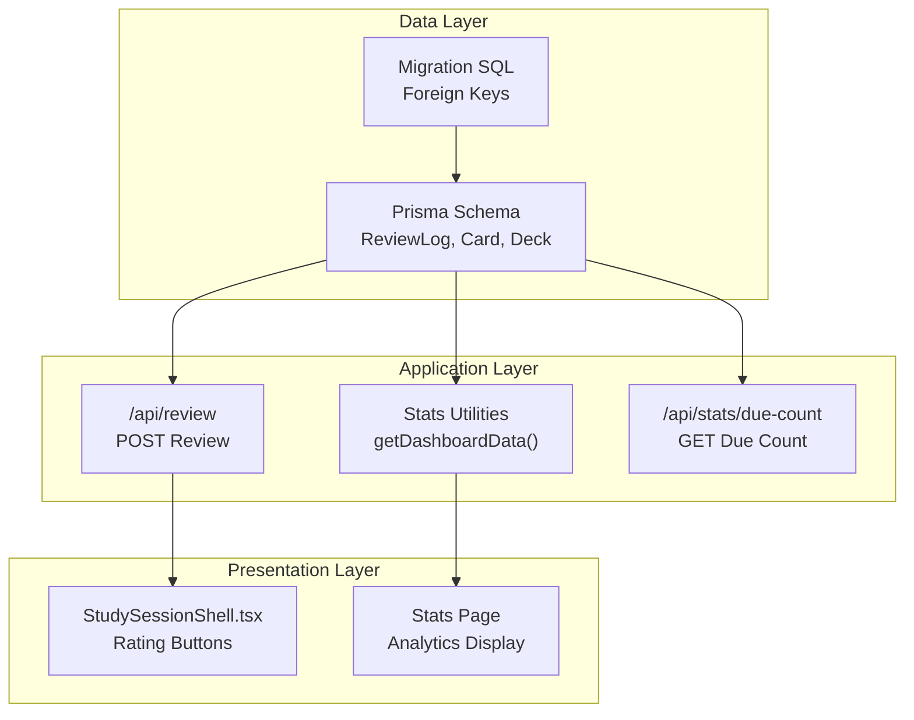
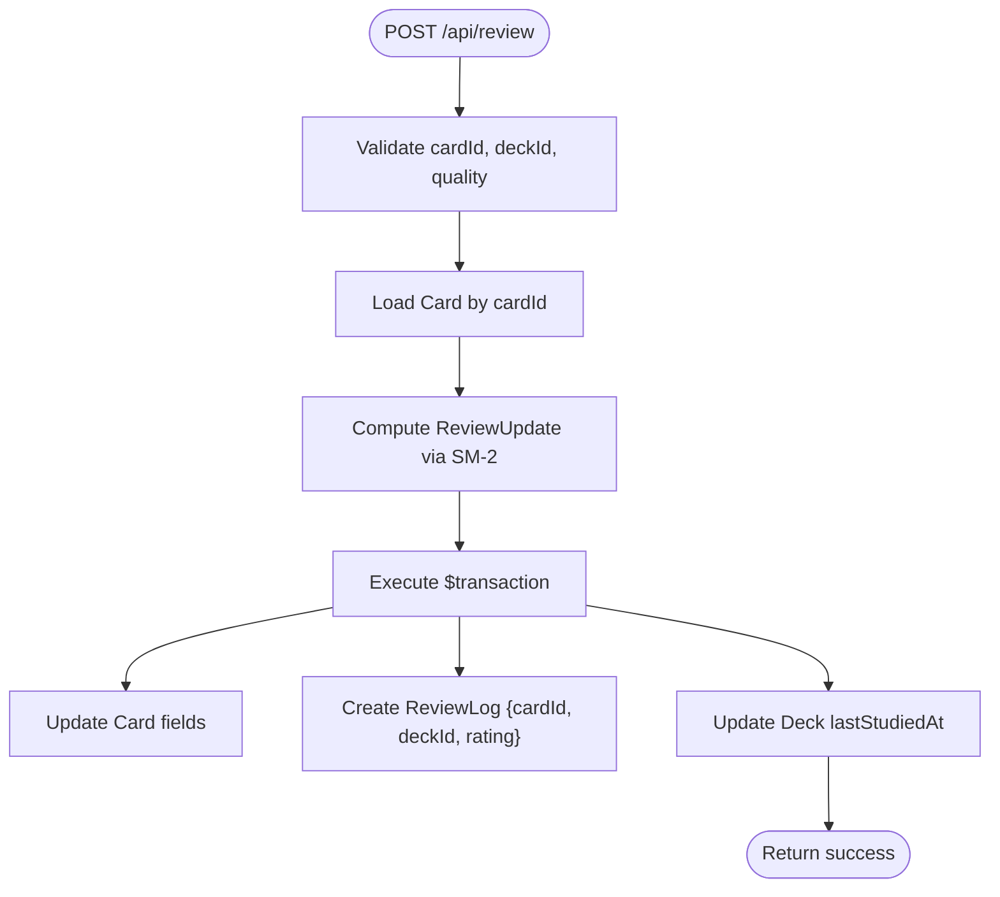
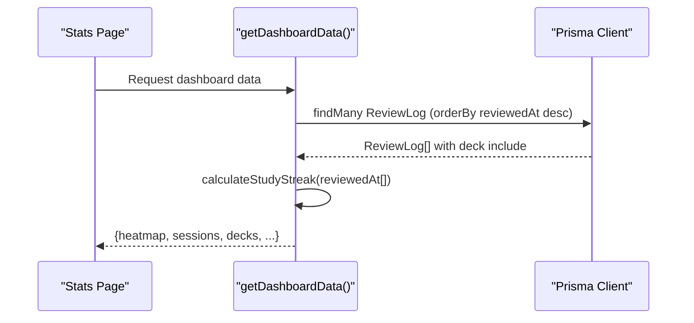
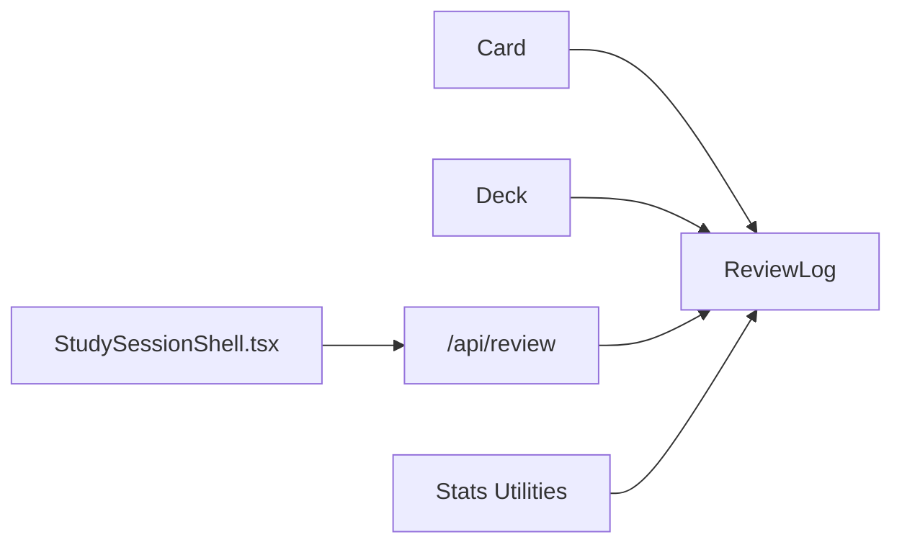

# ReviewLog Model

<cite>
**Referenced Files in This Document**
- [schema.prisma](file://prisma/schema.prisma)
- [migration.sql](file://prisma/migrations/20260421034221_init/migration.sql)
- [db.ts](file://src/lib/db.ts)
- [spaced-repetition.ts](file://src/lib/spaced-repetition.ts)
- [route.ts](file://src/app/api/review/route.ts)
- [stats.ts](file://src/lib/stats.ts)
- [route.ts](file://src/app/api/stats/due-count/route.ts)
- [page.tsx](file://src/app/stats/page.tsx)
- [StudySessionShell.tsx](file://src/components/flashcard/StudySessionShell.tsx)
</cite>

## Table of Contents
1. [Introduction](#introduction)
2. [Project Structure](#project-structure)
3. [Core Components](#core-components)
4. [Architecture Overview](#architecture-overview)
5. [Detailed Component Analysis](#detailed-component-analysis)
6. [Dependency Analysis](#dependency-analysis)
7. [Performance Considerations](#performance-considerations)
8. [Troubleshooting Guide](#troubleshooting-guide)
9. [Conclusion](#conclusion)

## Introduction
This document provides comprehensive documentation for the ReviewLog model entity, focusing on its role in the spaced repetition system. ReviewLog captures user ratings for card reviews, enabling adaptive scheduling and detailed learning analytics. It maintains dual relationships with both Card and Deck entities, ensuring contextual tracking at both individual card and deck levels.

## Project Structure
The ReviewLog model is defined in the Prisma schema alongside Card and Deck models. The application integrates ReviewLog through:
- API endpoints that create review logs and update card scheduling
- Analytics utilities that compute study streaks, heatmaps, and session statistics
- Frontend components that trigger reviews and present performance insights



**Diagram sources**
- [schema.prisma:42-50](file://prisma/schema.prisma#L42-L50)
- [migration.sql:32-41](file://prisma/migrations/20260421034221_init/migration.sql#L32-L41)
- [route.ts:5-75](file://src/app/api/review/route.ts#L5-L75)
- [stats.ts:51-221](file://src/lib/stats.ts#L51-L221)
- [route.ts:1-15](file://src/app/api/stats/due-count/route.ts#L1-L15)
- [StudySessionShell.tsx:68-96](file://src/components/flashcard/StudySessionShell.tsx#L68-L96)
- [page.tsx:14-75](file://src/app/stats/page.tsx#L14-L75)

**Section sources**
- [schema.prisma:10-50](file://prisma/schema.prisma#L10-L50)
- [migration.sql:1-42](file://prisma/migrations/20260421034221_init/migration.sql#L1-L42)

## Core Components
ReviewLog is a central entity in the learning system, designed to:
- Track individual review events with timestamps
- Capture user ratings that drive spaced repetition scheduling
- Maintain relationships to both Card and Deck for contextual analytics

Key attributes and constraints:
- id: String, @id, @default(cuid()) — Unique identifier for each review log
- cardId: String — Links to Card; cascade deletion ensures cleanup when cards are removed
- deckId: String — Links to Deck; cascade deletion ensures cleanup when decks are removed
- rating: String — User-provided quality score (mapped to numeric values)
- reviewedAt: DateTime, @default(now()) — Timestamp of the review event

Dual relationship structure:
- ReviewLog.card: Relation to Card with onDelete: Cascade
- ReviewLog.deck: Relation to Deck with onDelete: Cascade

These relationships enable:
- Historical analysis at both card and deck levels
- Automatic cleanup when parent entities are deleted
- Efficient joins for analytics and reporting

**Section sources**
- [schema.prisma:42-50](file://prisma/schema.prisma#L42-L50)
- [migration.sql:32-41](file://prisma/migrations/20260421034221_init/migration.sql#L32-L41)

## Architecture Overview
ReviewLog participates in a transactional pipeline that updates card scheduling and records review history atomically. The system integrates with the spaced repetition algorithm to adjust card intervals and statuses based on user ratings.

```mermaid
sequenceDiagram
participant Client as "Student UI"
participant API as "/api/review"
participant DB as "Prisma Client"
participant SR as "Spaced Repetition"
participant Log as "ReviewLog"
Client->>API : POST /api/review {cardId, deckId, quality}
API->>DB : Load Card by cardId
DB-->>API : Card record
API->>SR : processReview(CardForReview, quality)
SR-->>API : ReviewUpdate {easeFactor, interval, repetitionCount, nextReviewAt, status}
API->>DB : $transaction([
DB.card.update(...),
DB.reviewLog.create({cardId, deckId, rating}),
DB.deck.update({lastStudiedAt})
])
DB-->>API : Transaction committed
API-->>Client : {ok : true, update}
```

**Diagram sources**
- [route.ts:5-75](file://src/app/api/review/route.ts#L5-L75)
- [spaced-repetition.ts:29-76](file://src/lib/spaced-repetition.ts#L29-L76)
- [db.ts:1-68](file://src/lib/db.ts#L1-L68)

## Detailed Component Analysis

### ReviewLog Model Definition
ReviewLog encapsulates the essential data for tracking reviews:
- Identity: id (String, @id, @default(cuid()))
- Context: cardId (String) and deckId (String)
- Behavior: rating (String) representing user quality scores
- Timestamp: reviewedAt (DateTime, @default(now()))

Dual relationships ensure:
- Card.reviewLogs: Collection of ReviewLog entries for a card
- Deck.reviewLogs: Collection of ReviewLog entries for a deck

Cascade deletion guarantees referential integrity when cards or decks are removed.

**Section sources**
- [schema.prisma:42-50](file://prisma/schema.prisma#L42-L50)
- [migration.sql:32-41](file://prisma/migrations/20260421034221_init/migration.sql#L32-L41)

### Spaced Repetition Integration
The rating system integrates with the SM-2 algorithm:
- Quality mapping: Ratings are numeric values (0–5) indicating recall difficulty
- Algorithm behavior:
  - Correct responses increase interval and repetition count
  - Incorrect responses reset progression
  - Ease factor adjusts based on quality
  - Status transitions: NEW → LEARNING → REVIEW → MASTERED

ReviewLog stores the rating as a String, enabling downstream analytics and UI rendering.

**Section sources**
- [spaced-repetition.ts:29-76](file://src/lib/spaced-repetition.ts#L29-L76)
- [spaced-repetition.ts:107-140](file://src/lib/spaced-repetition.ts#L107-L140)

### Prisma Client Usage Patterns

#### Logging Reviews
- Endpoint: POST /api/review
- Workflow:
  - Validate input (cardId, deckId, quality)
  - Load card, compute review update, and persist atomically
  - Create ReviewLog entry with cardId, deckId, and rating
  - Update deck lastStudiedAt



**Diagram sources**
- [route.ts:5-75](file://src/app/api/review/route.ts#L5-L75)

**Section sources**
- [route.ts:5-75](file://src/app/api/review/route.ts#L5-L75)

#### Retrieving Review History
- Dashboard overview: getDashboardData() retrieves recent ReviewLog entries with deck metadata
- Stats page: Direct database queries for reviewedAt and rating fields
- Analytics: Functions like calculateStudyStreak operate on arrays of ReviewLog timestamps



**Diagram sources**
- [stats.ts:51-221](file://src/lib/stats.ts#L51-L221)
- [page.tsx:14-43](file://src/app/stats/page.tsx#L14-L43)

**Section sources**
- [stats.ts:51-221](file://src/lib/stats.ts#L51-L221)
- [page.tsx:14-75](file://src/app/stats/page.tsx#L14-L75)

#### Generating Statistics
- Study streak calculation: Uses ReviewLog reviewedAt timestamps
- Heatmap aggregation: Counts daily ReviewLog entries over an 84-day window
- Session grouping: Groups consecutive logs into study sessions based on time and deck boundaries
- Accuracy computation: Computes percentage of correct responses using ReviewLog rating values

**Section sources**
- [stats.ts:6-18](file://src/lib/stats.ts#L6-L18)
- [stats.ts:95-182](file://src/lib/stats.ts#L95-L182)

### Frontend Integration
- StudySessionShell triggers reviews via fetch to /api/review
- Rating buttons map to quality values (1–5)
- Optimistic UI updates improve perceived responsiveness

**Section sources**
- [StudySessionShell.tsx:68-96](file://src/components/flashcard/StudySessionShell.tsx#L68-L96)

## Dependency Analysis
ReviewLog depends on and influences several components:



**Diagram sources**
- [schema.prisma:24-50](file://prisma/schema.prisma#L24-L50)
- [route.ts:5-75](file://src/app/api/review/route.ts#L5-L75)
- [stats.ts:51-221](file://src/lib/stats.ts#L51-L221)
- [StudySessionShell.tsx:68-96](file://src/components/flashcard/StudySessionShell.tsx#L68-L96)

**Section sources**
- [schema.prisma:24-50](file://prisma/schema.prisma#L24-L50)
- [route.ts:5-75](file://src/app/api/review/route.ts#L5-L75)
- [stats.ts:51-221](file://src/lib/stats.ts#L51-L221)

## Performance Considerations
- Atomic transactions: ReviewLog creation occurs within a Prisma transaction alongside card and deck updates, minimizing partial states and reducing race conditions.
- Cascade deletion: Ensures referential integrity without manual cleanup, preventing orphaned logs.
- Indexing strategy: Consider indexing ReviewLog.reviewedAt and ReviewLog.cardId/deckId for efficient analytics queries.
- Query batching: Dashboard data uses Promise.all to minimize round-trips and improve load times.
- Concurrency: Frontend uses optimistic UI updates to reduce perceived latency during review submissions.

[No sources needed since this section provides general guidance]

## Troubleshooting Guide
Common issues and resolutions:
- Missing fields in review submission: Ensure cardId, deckId, and quality are provided and within valid range (0–5).
- Card not found: Verify card existence before attempting review logging.
- Transaction failures: ReviewLog creation is part of a transaction; check for database connectivity and constraint violations.
- Analytics discrepancies: Confirm ReviewLog timestamps are timezone-normalized and that daily aggregations align with start-of-day boundaries.

**Section sources**
- [route.ts:15-26](file://src/app/api/review/route.ts#L15-L26)
- [stats.ts:95-120](file://src/lib/stats.ts#L95-L120)

## Conclusion
ReviewLog serves as the backbone of the spaced repetition system, capturing user ratings and enabling rich analytics. Its dual relationships with Card and Deck provide contextual insights, while the integrated algorithm ensures adaptive scheduling. The Prisma client patterns demonstrate robust transactional updates and efficient analytics retrieval, supporting both real-time student feedback and long-term learning insights.