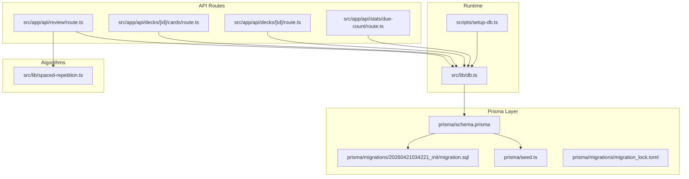
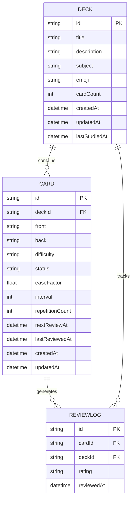
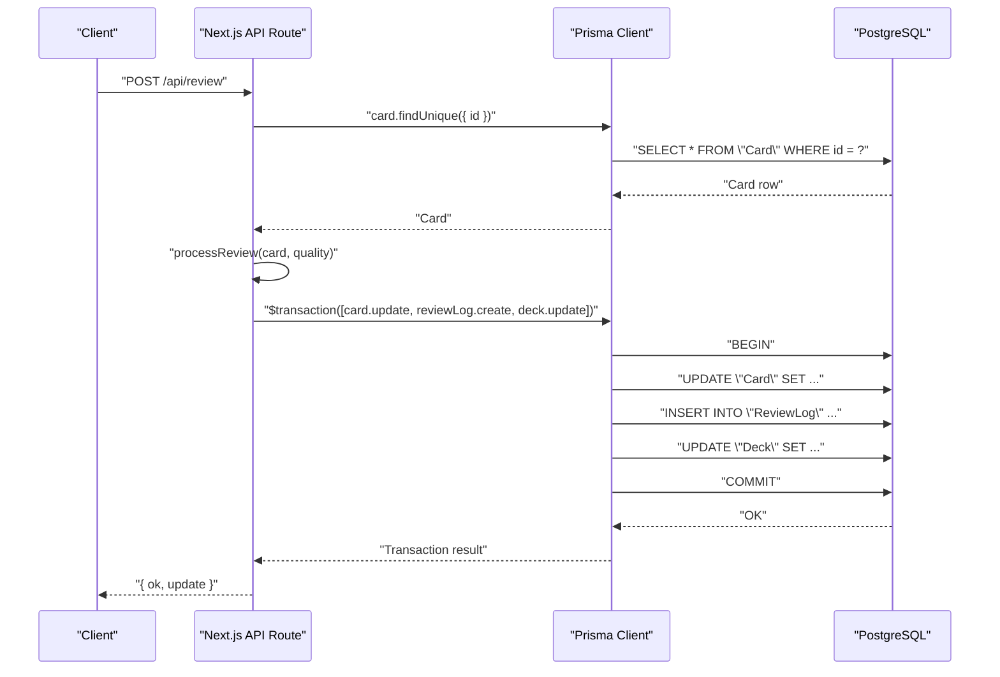
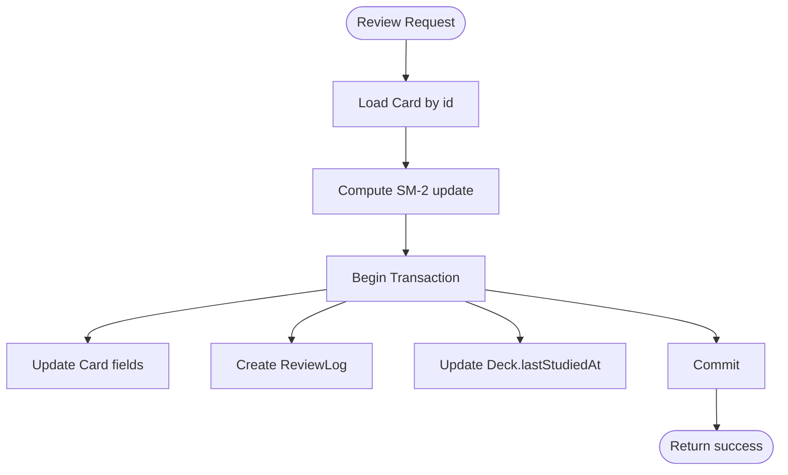
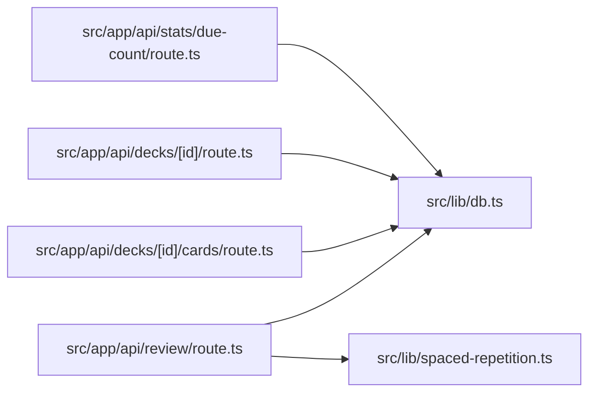

# Database Design

<cite>
**Referenced Files in This Document**
- [schema.prisma](file://prisma/schema.prisma)
- [20260421034221_init/migration.sql](file://prisma/migrations/20260421034221_init/migration.sql)
- [seed.ts](file://prisma/seed.ts)
- [db.ts](file://src/lib/db.ts)
- [setup-db.ts](file://scripts/setup-db.ts)
- [route.ts](file://src/app/api/review/route.ts)
- [route.ts](file://src/app/api/decks/[id]/cards/route.ts)
- [route.ts](file://src/app/api/decks/[id]/route.ts)
- [route.ts](file://src/app/api/stats/due-count/route.ts)
- [spaced-repetition.ts](file://src/lib/spaced-repetition.ts)
- [package.json](file://package.json)
- [migration_lock.toml](file://prisma/migrations/migration_lock.toml)
</cite>

## Table of Contents
1. [Introduction](#introduction)
2. [Project Structure](#project-structure)
3. [Core Components](#core-components)
4. [Architecture Overview](#architecture-overview)
5. [Detailed Component Analysis](#detailed-component-analysis)
6. [Dependency Analysis](#dependency-analysis)
7. [Performance Considerations](#performance-considerations)
8. [Troubleshooting Guide](#troubleshooting-guide)
9. [Conclusion](#conclusion)
10. [Appendices](#appendices)

## Introduction
This document provides comprehensive database design documentation for Recall's learning application. It details the data model for Decks, Cards, and Review Logs, explains Prisma schema-to-PostgreSQL mapping, documents data access patterns, seeding strategy, migration management, data lifecycle, retention considerations, and performance/security guidance. The goal is to help developers understand how entities relate, how data flows through the system, and how to maintain and optimize the database safely.

## Project Structure
The database layer is defined via Prisma schema and migrations, with TypeScript-based seeding and runtime database connection management. API routes orchestrate CRUD operations and spaced-repetition updates, while utility libraries encapsulate scheduling logic.

**Diagram sources**
- [schema.prisma:1-51](file://prisma/schema.prisma#L1-L51)
- [20260421034221_init/migration.sql:1-42](file://prisma/migrations/20260421034221_init/migration.sql#L1-L42)
- [seed.ts:1-332](file://prisma/seed.ts#L1-L332)
- [db.ts:1-68](file://src/lib/db.ts#L1-L68)
- [setup-db.ts:1-58](file://scripts/setup-db.ts#L1-L58)
- [route.ts:1-76](file://src/app/api/review/route.ts#L1-L76)
- [route.ts:1-40](file://src/app/api/decks/[id]/cards/route.ts#L1-L40)
- [route.ts:1-43](file://src/app/api/decks/[id]/route.ts#L1-L43)
- [route.ts:1-15](file://src/app/api/stats/due-count/route.ts#L1-L15)
- [spaced-repetition.ts:1-141](file://src/lib/spaced-repetition.ts#L1-L141)

**Section sources**
- [schema.prisma:1-51](file://prisma/schema.prisma#L1-L51)
- [20260421034221_init/migration.sql:1-42](file://prisma/migrations/20260421034221_init/migration.sql#L1-L42)
- [seed.ts:1-332](file://prisma/seed.ts#L1-L332)
- [db.ts:1-68](file://src/lib/db.ts#L1-L68)
- [setup-db.ts:1-58](file://scripts/setup-db.ts#L1-L58)
- [route.ts:1-76](file://src/app/api/review/route.ts#L1-L76)
- [route.ts:1-40](file://src/app/api/decks/[id]/cards/route.ts#L1-L40)
- [route.ts:1-43](file://src/app/api/decks/[id]/route.ts#L1-L43)
- [route.ts:1-15](file://src/app/api/stats/due-count/route.ts#L1-L15)
- [spaced-repetition.ts:1-141](file://src/lib/spaced-repetition.ts#L1-L141)
- [package.json:1-56](file://package.json#L1-L56)
- [migration_lock.toml:1-3](file://prisma/migrations/migration_lock.toml#L1-L3)

## Core Components
This section documents the three core entities and their relationships, including field definitions, data types, primary/foreign keys, indexes, and constraints.

- Deck
  - Purpose: Container for learning content with metadata and statistics.
  - Fields:
    - id: String (Primary Key)
    - title: String
    - description: String?
    - subject: String?
    - emoji: String (Default: "🧠")
    - cardCount: Int (Default: 0)
    - createdAt: DateTime (Default: now())
    - updatedAt: DateTime (Default: now(), Updated on modification)
    - lastStudiedAt: DateTime?
  - Relationships:
    - One-to-many with Card via deckId (Cascade delete)
    - One-to-many with ReviewLog via deckId (Cascade delete)

- Card
  - Purpose: Individual learning item with scheduling state.
  - Fields:
    - id: String (Primary Key)
    - deckId: String (Foreign Key to Deck.id, Cascade delete)
    - front: String
    - back: String
    - difficulty: String (Default: "MEDIUM")
    - status: String (Default: "NEW")
    - easeFactor: Float (Default: 2.5)
    - interval: Int (Default: 0)
    - repetitionCount: Int (Default: 0)
    - nextReviewAt: DateTime (Default: now())
    - lastReviewedAt: DateTime?
    - createdAt: DateTime (Default: now())
    - updatedAt: DateTime (Updated on modification)
  - Relationships:
    - Belongs to Deck (via deckId)
    - One-to-many with ReviewLog via cardId (Cascade delete)

- ReviewLog
  - Purpose: Record of a single review event with rating.
  - Fields:
    - id: String (Primary Key)
    - cardId: String (Foreign Key to Card.id, Cascade delete)
    - deckId: String (Foreign Key to Deck.id, Cascade delete)
    - rating: String
    - reviewedAt: DateTime (Default: now())
  - Relationships:
    - Belongs to Card and Deck (via cardId and deckId)

**Diagram sources**
- [schema.prisma:10-50](file://prisma/schema.prisma#L10-L50)
- [20260421034221_init/migration.sql:1-42](file://prisma/migrations/20260421034221_init/migration.sql#L1-L42)

**Section sources**
- [schema.prisma:10-50](file://prisma/schema.prisma#L10-L50)
- [20260421034221_init/migration.sql:1-42](file://prisma/migrations/20260421034221_init/migration.sql#L1-L42)

## Architecture Overview
The database architecture centers on Prisma ORM mapping the schema to PostgreSQL. Runtime connection management selects the appropriate URL and ensures SSL mode. API routes coordinate reads/writes and maintain referential integrity through transactions. Seeding initializes realistic sample data for development and testing.

**Diagram sources**
- [route.ts:1-76](file://src/app/api/review/route.ts#L1-L76)
- [spaced-repetition.ts:1-141](file://src/lib/spaced-repetition.ts#L1-L141)
- [db.ts:1-68](file://src/lib/db.ts#L1-L68)

**Section sources**
- [route.ts:1-76](file://src/app/api/review/route.ts#L1-L76)
- [spaced-repetition.ts:1-141](file://src/lib/spaced-repetition.ts#L1-L141)
- [db.ts:1-68](file://src/lib/db.ts#L1-L68)

## Detailed Component Analysis

### Prisma Schema and PostgreSQL Mapping
- Provider and URL:
  - Provider is PostgreSQL.
  - URL is sourced from environment variables via Prisma configuration.
- Models and relations:
  - Deck, Card, ReviewLog defined with explicit relations and cascade deletes.
- Migration mapping:
  - Initial migration creates tables with primary keys, defaults, and foreign keys with cascade behavior.
- Indexes and constraints:
  - Primary keys are implicit via @id in Prisma and PRIMARY KEY in SQL.
  - Foreign keys are explicitly defined in SQL with ON DELETE CASCADE.
  - No additional indexes are present in the initial migration.

**Section sources**
- [schema.prisma:1-51](file://prisma/schema.prisma#L1-L51)
- [20260421034221_init/migration.sql:1-42](file://prisma/migrations/20260421034221_init/migration.sql#L1-L42)

### Data Access Patterns
- CRUD on Decks:
  - Update and Delete endpoints target Deck by id.
- Create Cards within a Deck:
  - POST to deck cards endpoint creates a Card and increments Deck.cardCount.
- Review Processing:
  - POST to review endpoint loads a Card, computes next scheduling state using SM-2, persists updates atomically, and records a ReviewLog while updating Deck.lastStudiedAt.

**Diagram sources**
- [route.ts:1-76](file://src/app/api/review/route.ts#L1-L76)
- [spaced-repetition.ts:1-141](file://src/lib/spaced-repetition.ts#L1-L141)

**Section sources**
- [route.ts:1-43](file://src/app/api/decks/[id]/route.ts#L1-L43)
- [route.ts:1-40](file://src/app/api/decks/[id]/cards/route.ts#L1-L40)
- [route.ts:1-76](file://src/app/api/review/route.ts#L1-L76)
- [spaced-repetition.ts:1-141](file://src/lib/spaced-repetition.ts#L1-L141)

### Seeding Strategy
- Purpose: Populate development/test databases with realistic decks, cards, and review logs.
- Approach:
  - Deletes existing data to ensure idempotency.
  - Creates multiple Decks with associated Cards.
  - Generates ReviewLog entries linking to specific Card/Deck combinations.
  - Reports totals after seeding.

**Section sources**
- [seed.ts:1-332](file://prisma/seed.ts#L1-L332)

### Migration Management
- Scripts:
  - Migration command configured via package.json.
  - Seed command configured via package.json with TSX runner.
- Lock file:
  - Migration lock indicates provider and prevents concurrent migrations.
- Best practices:
  - Use safe constraint addition patterns to avoid migration failures.
  - Consider partial indexes and composite indexes for query performance.

**Section sources**
- [package.json:5-16](file://package.json#L5-L16)
- [migration_lock.toml:1-3](file://prisma/migrations/migration_lock.toml#L1-L3)

### Data Lifecycle and Retention
- Lifecycle stages:
  - NEW → LEARNING → REVIEW → MASTERED (status progression driven by SM-2).
  - nextReviewAt determines due items; overdue items are prioritized for study.
- Retention considerations:
  - No explicit retention policies are defined in the schema or seeding.
  - Consider implementing periodic cleanup of ReviewLog entries beyond a configurable horizon to manage growth.

**Section sources**
- [spaced-repetition.ts:1-141](file://src/lib/spaced-repetition.ts#L1-L141)
- [schema.prisma:24-50](file://prisma/schema.prisma#L24-L50)

### Prisma Client Configuration and Connection Management
- URL selection logic:
  - Production prefers platform-specific pooling-friendly URLs; development prefers DATABASE_URL variants.
  - Rejects sqlite file URLs and substitutes with Postgres candidates when needed.
- SSL enforcement:
  - Ensures sslmode=require is present in the URL for serverless environments.
- Singleton pattern:
  - Maintains a global PrismaClient instance outside production for development hot reload safety.

**Section sources**
- [db.ts:1-68](file://src/lib/db.ts#L1-L68)

### Environment Setup for Deployment
- Setup script:
  - Automates setting DATABASE_URL in Vercel production environment using vercel CLI.
  - Validates PostgreSQL URL format before applying.

**Section sources**
- [setup-db.ts:1-58](file://scripts/setup-db.ts#L1-L58)

## Dependency Analysis
The following diagram shows how API routes depend on the database client and scheduling logic.

**Diagram sources**
- [route.ts:1-76](file://src/app/api/review/route.ts#L1-L76)
- [route.ts:1-40](file://src/app/api/decks/[id]/cards/route.ts#L1-L40)
- [route.ts:1-43](file://src/app/api/decks/[id]/route.ts#L1-L43)
- [route.ts:1-15](file://src/app/api/stats/due-count/route.ts#L1-L15)
- [db.ts:1-68](file://src/lib/db.ts#L1-L68)
- [spaced-repetition.ts:1-141](file://src/lib/spaced-repetition.ts#L1-L141)

**Section sources**
- [route.ts:1-76](file://src/app/api/review/route.ts#L1-L76)
- [route.ts:1-40](file://src/app/api/decks/[id]/cards/route.ts#L1-L40)
- [route.ts:1-43](file://src/app/api/decks/[id]/route.ts#L1-L43)
- [route.ts:1-15](file://src/app/api/stats/due-count/route.ts#L1-L15)
- [db.ts:1-68](file://src/lib/db.ts#L1-L68)
- [spaced-repetition.ts:1-141](file://src/lib/spaced-repetition.ts#L1-L141)

## Performance Considerations
- Current state:
  - No additional indexes exist in the initial migration; queries rely on primary keys and foreign keys.
- Recommended optimizations:
  - Composite indexes for common join/filter patterns (e.g., Card(deckId, nextReviewAt), ReviewLog(deckId, reviewedAt)).
  - Partial indexes for frequently filtered conditions (e.g., overdue cards, recent logs).
  - Covering indexes to avoid heap fetches for common report queries.
  - Consider partitioning large tables by time-bound indexes if growth warrants.

[No sources needed since this section provides general guidance]

## Troubleshooting Guide
- Migration failures:
  - Ensure constraints are added safely using guard blocks to avoid duplicate constraint errors.
- Connection issues:
  - Verify DATABASE_URL format and presence of sslmode=require in serverless environments.
  - Confirm production URL precedence and fallbacks in connection selection logic.
- Data inconsistencies:
  - Use atomic transactions for review updates to maintain consistency across Card, ReviewLog, and Deck.

**Section sources**
- [20260421034221_init/migration.sql:1-42](file://prisma/migrations/20260421034221_init/migration.sql#L1-L42)
- [db.ts:1-68](file://src/lib/db.ts#L1-L68)

## Conclusion
Recall’s database model centers on Decks, Cards, and ReviewLogs with clear relations and defaults. Prisma maps the schema to PostgreSQL with cascade deletes and basic constraints. API routes implement robust data access patterns, including atomic transactional updates for reviews. The seeding strategy provides realistic sample data. To scale effectively, introduce targeted indexes and consider retention policies aligned with application usage.

## Appendices

### Appendix A: Field Reference and Defaults
- Deck
  - emoji: default "🧠"
  - cardCount: default 0
- Card
  - difficulty: default "MEDIUM"
  - status: default "NEW"
  - easeFactor: default 2.5
  - interval: default 0
  - repetitionCount: default 0
  - nextReviewAt: default now()
- ReviewLog
  - reviewedAt: default now()

**Section sources**
- [schema.prisma:10-50](file://prisma/schema.prisma#L10-L50)

### Appendix B: Sample Data Structures
- Deck
  - Example fields: title, description, subject, emoji, cardCount, lastStudiedAt.
- Card
  - Example fields: front, back, difficulty, status, easeFactor, interval, repetitionCount, nextReviewAt, lastReviewedAt.
- ReviewLog
  - Example fields: rating, reviewedAt.

**Section sources**
- [seed.ts:14-306](file://prisma/seed.ts#L14-L306)