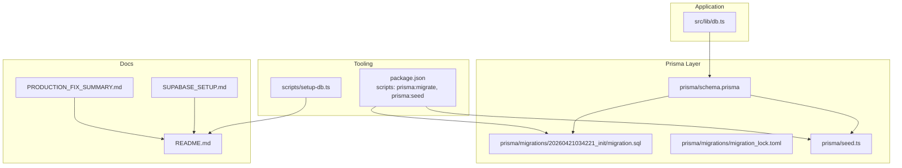
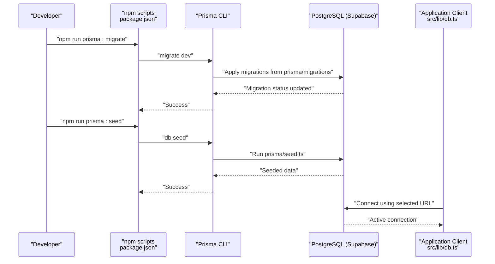
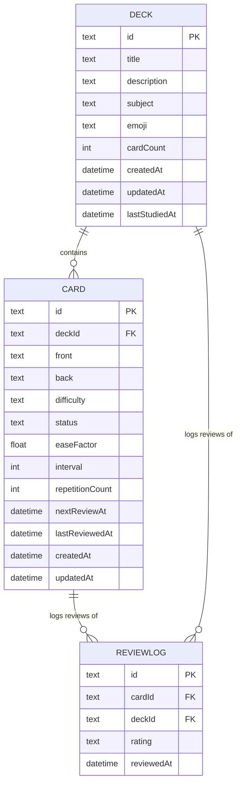
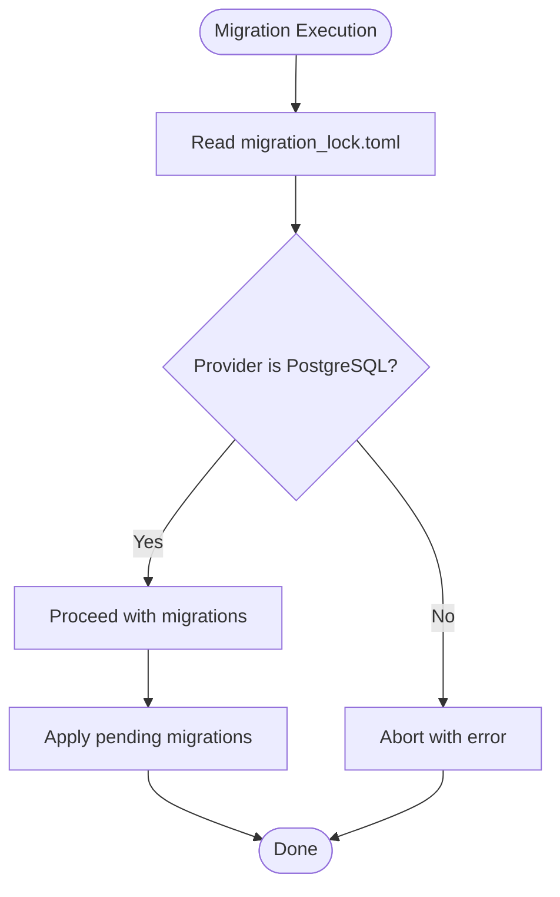
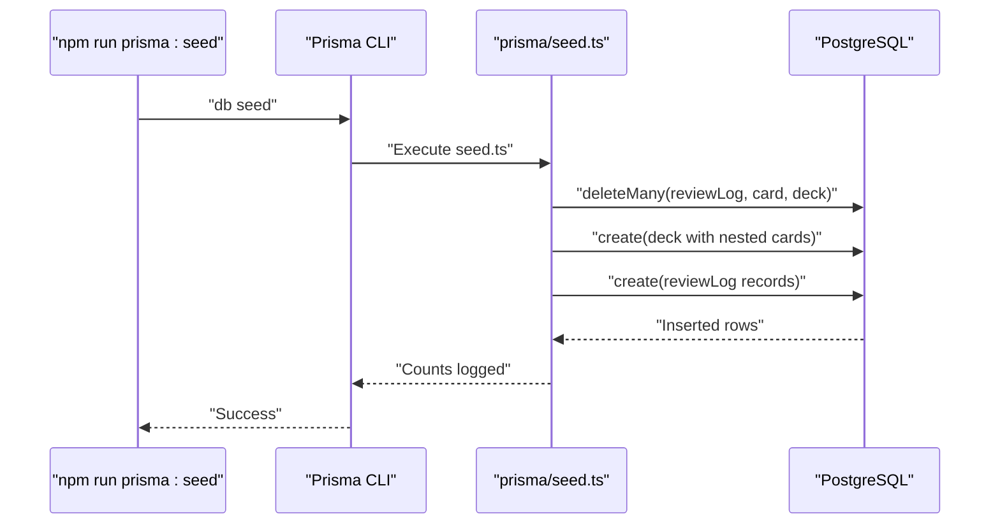
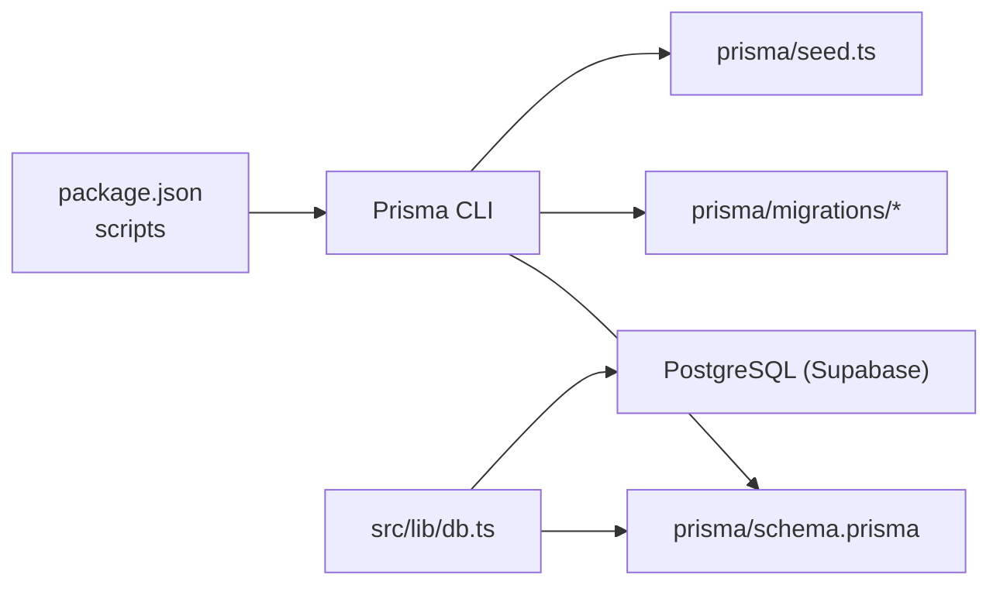

# Migrations and Seeding

<cite>
**Referenced Files in This Document**
- [package.json](file://package.json)
- [schema.prisma](file://prisma/schema.prisma)
- [migration_lock.toml](file://prisma/migrations/migration_lock.toml)
- [20260421034221_init/migration.sql](file://prisma/migrations/20260421034221_init/migration.sql)
- [seed.ts](file://prisma/seed.ts)
- [db.ts](file://src/lib/db.ts)
- [README.md](file://README.md)
- [SUPABASE_SETUP.md](file://SUPABASE_SETUP.md)
- [setup-db.ts](file://scripts/setup-db.ts)
- [PRODUCTION_FIX_SUMMARY.md](file://PRODUCTION_FIX_SUMMARY.md)
</cite>

## Table of Contents
1. [Introduction](#introduction)
2. [Project Structure](#project-structure)
3. [Core Components](#core-components)
4. [Architecture Overview](#architecture-overview)
5. [Detailed Component Analysis](#detailed-component-analysis)
6. [Dependency Analysis](#dependency-analysis)
7. [Performance Considerations](#performance-considerations)
8. [Troubleshooting Guide](#troubleshooting-guide)
9. [Conclusion](#conclusion)
10. [Appendices](#appendices)

## Introduction
This document explains the database migration and seeding processes used by the project. It covers the initial migration structure, schema evolution patterns, migration locking, and the seeding strategy for initial data. It also documents migration execution commands, rollback procedures, production deployment considerations, best practices for schema changes and data preservation, and testing migration scripts. Finally, it explains the migration_lock.toml file and concurrent migration handling.

## Project Structure
The migration and seeding system is organized around Prisma’s toolchain and a small set of scripts:
- Prisma schema defines models and datasource configuration.
- Migrations live under prisma/migrations with an initial migration and a lock file.
- Seed script populates initial data for development and testing.
- Scripts and documentation guide setup and deployment.

**Diagram sources**
- [schema.prisma](file://prisma/schema.prisma)
- [2026042103421034221_init/migration.sql](file://prisma/migrations/20260421034221_init/migration.sql)
- [migration_lock.toml](file://prisma/migrations/migration_lock.toml)
- [seed.ts](file://prisma/seed.ts)
- [db.ts](file://src/lib/db.ts)
- [package.json](file://package.json)
- [setup-db.ts](file://scripts/setup-db.ts)
- [README.md](file://README.md)
- [SUPABASE_SETUP.md](file://SUPABASE_SETUP.md)
- [PRODUCTION_FIX_SUMMARY.md](file://PRODUCTION_FIX_SUMMARY.md)

**Section sources**
- [package.json](file://package.json)
- [schema.prisma](file://prisma/schema.prisma)
- [migration_lock.toml](file://prisma/migrations/migration_lock.toml)
- [20260421034221_init/migration.sql](file://prisma/migrations/20260421034221_init/migration.sql)
- [seed.ts](file://prisma/seed.ts)
- [db.ts](file://src/lib/db.ts)
- [README.md](file://README.md)
- [SUPABASE_SETUP.md](file://SUPABASE_SETUP.md)
- [setup-db.ts](file://scripts/setup-db.ts)
- [PRODUCTION_FIX_SUMMARY.md](file://PRODUCTION_FIX_SUMMARY.md)

## Core Components
- Prisma schema: Defines the data model and datasource configuration.
- Initial migration: Creates the baseline schema.
- Migration lock: Ensures safe concurrent migration execution.
- Seed script: Populates initial data for decks, cards, and review logs.
- Application database client: Selects the appropriate connection URL and enforces SSL requirements.
- Tooling scripts: Provide commands to run migrations and seeds, and to set DATABASE_URL in Vercel.

Key responsibilities:
- schema.prisma: Declares Deck, Card, and ReviewLog models and their relations.
- 20260421034221_init/migration.sql: Implements the initial schema with primary keys, defaults, and foreign keys.
- migration_lock.toml: Locks the migration provider to PostgreSQL to avoid accidental misuse.
- seed.ts: Deletes existing data and inserts realistic sample datasets.
- db.ts: Chooses the correct database URL and ensures sslmode=require for Supabase.
- package.json: Exposes migration and seeding commands and configures the seed runtime.

**Section sources**
- [schema.prisma](file://prisma/schema.prisma)
- [20260421034221_init/migration.sql](file://prisma/migrations/20260421034221_init/migration.sql)
- [migration_lock.toml](file://prisma/migrations/migration_lock.toml)
- [seed.ts](file://prisma/seed.ts)
- [db.ts](file://src/lib/db.ts)
- [package.json](file://package.json)

## Architecture Overview
The migration and seeding pipeline connects developer tooling, Prisma, and the database. The application uses a Prisma client configured from environment variables. Migrations evolve the schema; seeds populate initial data. Production requires a persistent PostgreSQL connection.

**Diagram sources**
- [package.json](file://package.json)
- [20260421034221_init/migration.sql](file://prisma/migrations/20260421034221_init/migration.sql)
- [seed.ts](file://prisma/seed.ts)
- [db.ts](file://src/lib/db.ts)

## Detailed Component Analysis

### Initial Migration Structure
The initial migration creates three tables and their relationships:
- Deck: Primary key id, metadata fields, timestamps.
- Card: Primary key id, foreign key deckId referencing Deck, content fields, spaced repetition fields, timestamps.
- ReviewLog: Primary key id, foreign keys cardId and deckId referencing Card and Deck, rating, and reviewedAt timestamp.

Foreign keys are defined with cascade delete/update to maintain referential integrity.

**Diagram sources**
- [20260421034221_init/migration.sql](file://prisma/migrations/20260421034221_init/migration.sql)

**Section sources**
- [20260421034221_init/migration.sql](file://prisma/migrations/20260421034221_init/migration.sql)

### Schema Evolution Patterns
- Idempotent additions: When adding constraints or indexes, check for existence before creating to avoid failure on re-runs.
- Safe constraint creation: Use DO blocks to guard against duplicate constraint creation.
- Prefer explicit defaults: Define defaults at the schema level to simplify application logic and reduce migration complexity.
- Foreign keys: Always define foreign keys with appropriate ON DELETE actions to preserve referential integrity.

Best practice references:
- Add constraints safely in migrations.
- Keep transactions short to reduce lock contention.
- Use SKIP LOCKED for non-blocking queue processing.
- Use advisory locks for application-level coordination.

**Section sources**
- [.agents\skills\supabase-postgres-best-practices\references\schema-constraints.md](file://.agents/skills/supabase-postgres-best-practices/references/schema-constraints.md)
- [.agents\skills\supabase-postgres-best-practices\references\lock-short-transactions.md](file://.agents/skills/supabase-postgres-best-practices/references/lock-short-transactions.md)
- [.agents\skills\supabase-postgres-best-practices\references\lock-skip-locked.md](file://.agents/skills/supabase-postgres-best-practices/references/lock-skip-locked.md)
- [.agents\skills\supabase-postgres-best-practices\references\lock-advisory.md](file://.agents/skills/supabase-postgres-best-practices/references/lock-advisory.md)

### Migration Locking Mechanism
The migration_lock.toml file sets the provider to PostgreSQL and prevents manual edits. This ensures migrations are applied consistently and avoids accidental misconfiguration.

**Diagram sources**
- [migration_lock.toml](file://prisma/migrations/migration_lock.toml)

**Section sources**
- [migration_lock.toml](file://prisma/migrations/migration_lock.toml)

### Seeding Strategy
The seed script performs the following:
- Clears existing data to ensure deterministic runs.
- Creates sample Decks with associated Cards.
- Generates ReviewLog entries linked to the created Cards and Decks.
- Reports counts for verification.

Seed data structure:
- Decks: title, description, subject, emoji, cardCount, lastStudiedAt.
- Cards: front/back content, difficulty/status/easeFactor/interval/repetitionCount/nextReviewAt/lastReviewedAt.
- ReviewLogs: rating and reviewedAt aligned to seeded decks/cards.

**Diagram sources**
- [package.json](file://package.json)
- [seed.ts](file://prisma/seed.ts)

**Section sources**
- [seed.ts](file://prisma/seed.ts)
- [package.json](file://package.json)

### Migration Execution Commands
- Run migrations: npm run prisma:migrate
- Seed database: npm run prisma:seed
- Open Prisma Studio: npm run prisma:studio

These commands are defined in package.json and rely on Prisma’s CLI to apply migrations and seed data.

**Section sources**
- [package.json](file://package.json)

### Rollback Procedures
Rollback capability depends on the migration provider and tooling. For Prisma:
- Use Prisma’s migration history to understand applied changes.
- Revert by writing corrective migrations or by restoring backups.
- Avoid destructive changes in production without careful planning and backups.

Guidance:
- Keep migrations reversible where practical.
- Test rollbacks in staging before production.
- Use idempotent patterns to minimize risk.

[No sources needed since this section provides general guidance]

### Production Deployment Considerations
- Use PostgreSQL via Supabase; SQLite does not work in production due to ephemeral filesystems.
- Set DATABASE_URL in Vercel production environment.
- Ensure sslmode=require is present in the connection string for serverless environments.
- Prefer platform-provided URLs (e.g., POSTGRES_PRISMA_URL) in production for pooling-friendly connections.

References:
- Production error fix summary and setup guide.
- Supabase setup guide for environment configuration and deployment.

**Section sources**
- [PRODUCTION_FIX_SUMMARY.md](file://PRODUCTION_FIX_SUMMARY.md)
- [SUPABASE_SETUP.md](file://SUPABASE_SETUP.md)
- [README.md](file://README.md)
- [db.ts](file://src/lib/db.ts)
- [setup-db.ts](file://scripts/setup-db.ts)

### Best Practices for Schema Changes and Data Preservation
- Add constraints safely using existence checks.
- Keep transactions short to reduce lock contention.
- Use SKIP LOCKED for parallel processing.
- Use advisory locks for application-level coordination.
- Prefer explicit defaults and immutable identifiers.
- Validate migrations in staging and test rollback scenarios.

**Section sources**
- [.agents\skills\supabase-postgres-best-practices\references\schema-constraints.md](file://.agents/skills/supabase-postgres-best-practices/references/schema-constraints.md)
- [.agents\skills\supabase-postgres-best-practices\references\lock-short-transactions.md](file://.agents/skills/supabase-postgres-best-practices/references/lock-short-transactions.md)
- [.agents\skills\supabase-postgres-best-practices\references\lock-skip-locked.md](file://.agents/skills/supabase-postgres-best-practices/references/lock-skip-locked.md)
- [.agents\skills\supabase-postgres-best-practices\references\lock-advisory.md](file://.agents/skills/supabase-postgres-best-practices/references/lock-advisory.md)

### Testing Migration Scripts
- Run migrations locally before seeding to validate schema changes.
- Use Prisma Studio to inspect data after seeding.
- Verify counts and relationships programmatically in the seed script.
- Test in a disposable database instance to avoid polluting production or shared environments.

**Section sources**
- [package.json](file://package.json)
- [seed.ts](file://prisma/seed.ts)

## Dependency Analysis
The migration and seeding system depends on:
- Prisma schema for model definitions.
- Prisma CLI for applying migrations and seeding.
- Environment variables for database connectivity.
- Application client for connecting to the database.

**Diagram sources**
- [package.json](file://package.json)
- [schema.prisma](file://prisma/schema.prisma)
- [20260421034221_init/migration.sql](file://prisma/migrations/20260421034221_init/migration.sql)
- [seed.ts](file://prisma/seed.ts)
- [db.ts](file://src/lib/db.ts)

**Section sources**
- [package.json](file://package.json)
- [schema.prisma](file://prisma/schema.prisma)
- [20260421034221_init/migration.sql](file://prisma/migrations/20260421034221_init/migration.sql)
- [seed.ts](file://prisma/seed.ts)
- [db.ts](file://src/lib/db.ts)

## Performance Considerations
- Keep transactions short to reduce lock contention and improve throughput.
- Use SKIP LOCKED for parallel queue processing.
- Use advisory locks for application-level coordination without row-level lock overhead.
- Ensure sslmode=require for serverless environments to avoid connection issues.

**Section sources**
- [.agents\skills\supabase-postgres-best-practices\references\lock-short-transactions.md](file://.agents/skills/supabase-postgres-best-practices/references/lock-short-transactions.md)
- [.agents\skills\supabase-postgres-best-practices\references\lock-skip-locked.md](file://.agents/skills/supabase-postgres-best-practices/references/lock-skip-locked.md)
- [.agents\skills\supabase-postgres-best-practices\references\lock-advisory.md](file://.agents/skills/supabase-postgres-best-practices/references/lock-advisory.md)
- [db.ts](file://src/lib/db.ts)

## Troubleshooting Guide
Common issues and resolutions:
- Connection refused: Verify DATABASE_URL and Supabase project status.
- Relation does not exist: Run migrations using the migration command.
- Auth not working: Clear browser cookies and restart the dev server.
- Production deployment fails: Ensure DATABASE_URL is set in Vercel and migrations are applied.

**Section sources**
- [README.md](file://README.md)
- [SUPABASE_SETUP.md](file://SUPABASE_SETUP.md)

## Conclusion
The project’s migration and seeding system leverages Prisma to manage schema evolution and initial data population. The initial migration establishes a robust schema with foreign keys and defaults. The seed script provides realistic sample data for development. The migration_lock.toml file ensures consistent provider configuration. Production requires PostgreSQL via Supabase, proper environment setup, and adherence to best practices for schema changes and concurrency.

[No sources needed since this section summarizes without analyzing specific files]

## Appendices

### Appendix A: Migration and Seeding Commands
- Run migrations: npm run prisma:migrate
- Seed database: npm run prisma:seed
- Open Prisma Studio: npm run prisma:studio

**Section sources**
- [package.json](file://package.json)

### Appendix B: Environment and Connection Notes
- Use DATABASE_URL for local development and POSTGRES_PRISMA_URL in production for pooling-friendly connections.
- Ensure sslmode=require for serverless environments.

**Section sources**
- [db.ts](file://src/lib/db.ts)