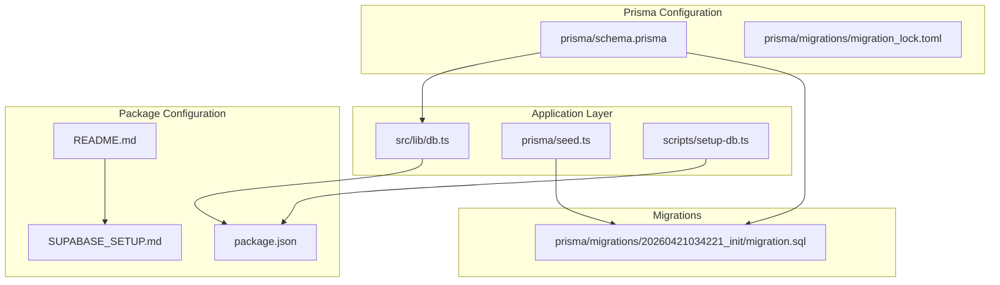
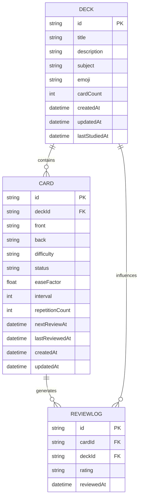
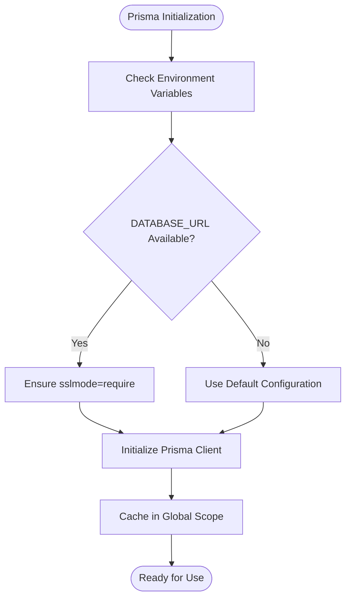
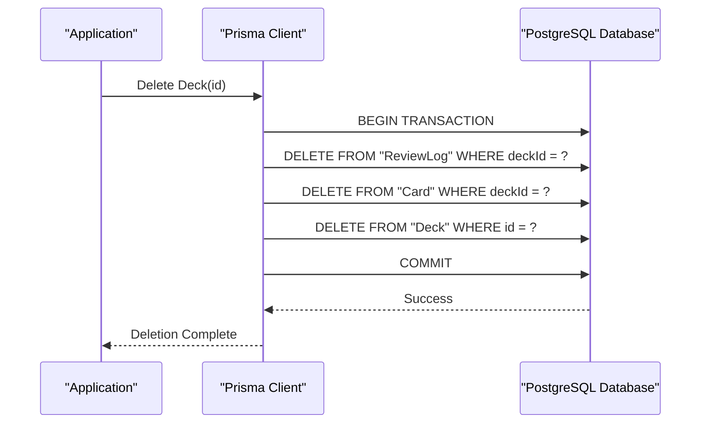
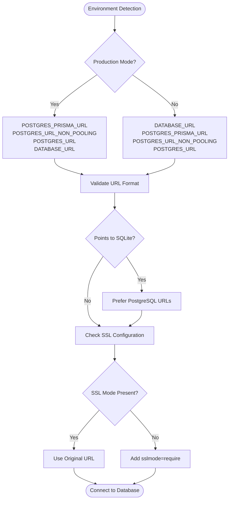
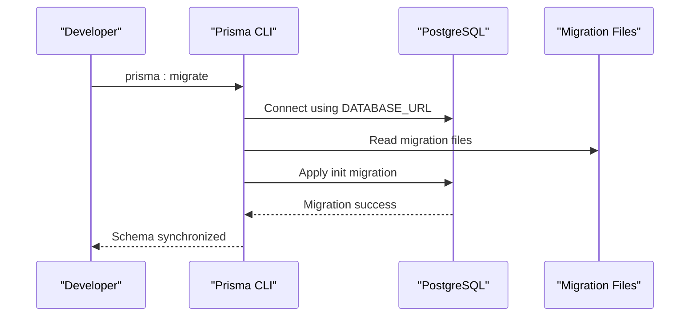
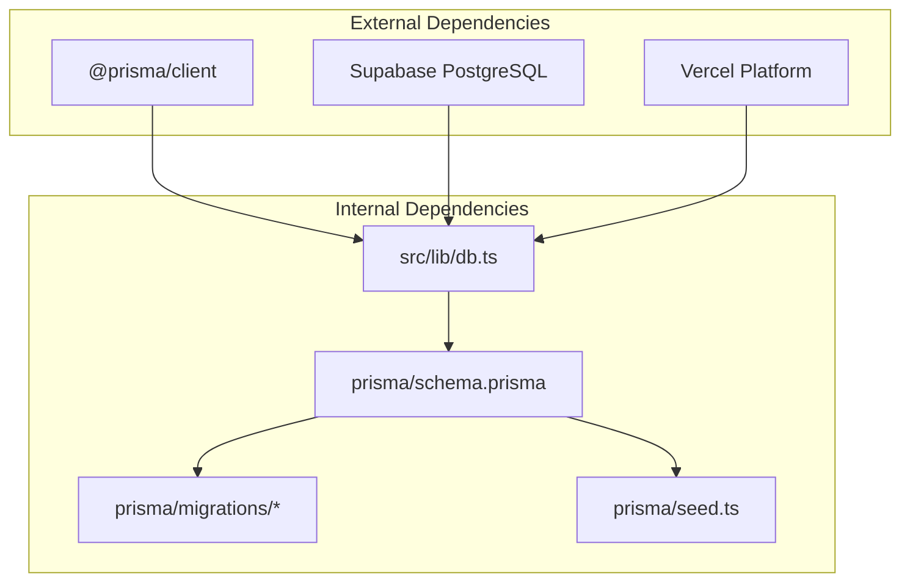

# Schema Overview

<cite>
**Referenced Files in This Document**
- [schema.prisma](file://prisma/schema.prisma)
- [migration.sql](file://prisma/migrations/20260421034221_init/migration.sql)
- [migration_lock.toml](file://prisma/migrations/migration_lock.toml)
- [db.ts](file://src/lib/db.ts)
- [seed.ts](file://prisma/seed.ts)
- [setup-db.ts](file://scripts/setup-db.ts)
- [package.json](file://package.json)
- [README.md](file://README.md)
- [SUPABASE_SETUP.md](file://SUPABASE_SETUP.md)
</cite>

## Table of Contents
1. [Introduction](#introduction)
2. [Project Structure](#project-structure)
3. [Core Components](#core-components)
4. [Architecture Overview](#architecture-overview)
5. [Detailed Component Analysis](#detailed-component-analysis)
6. [Dependency Analysis](#dependency-analysis)
7. [Performance Considerations](#performance-considerations)
8. [Troubleshooting Guide](#troubleshooting-guide)
9. [Conclusion](#conclusion)

## Introduction
This document provides a comprehensive schema overview for the Prisma database configuration used in the cumaths application. It explains the overall database architecture, entity relationships between Deck, Card, and ReviewLog models, Prisma configuration including datasource setup, generator settings, and PostgreSQL provider configuration. It also details the ID generation strategy using cuid(), timestamps management, automatic updatedAt fields, entity relationship diagrams with foreign key relationships and cascade deletion policies, database URL configuration through environment variables, and the migration system with initial schema setup.

## Project Structure
The database schema is managed through Prisma with the following key components:
- Prisma schema definition specifying models, relations, and field attributes
- Migration files defining the initial database structure
- Database connection management with environment variable support
- Seed script for initial data population
- Setup script for configuring deployment environments

**Diagram sources**
- [schema.prisma:1-51](file://prisma/schema.prisma#L1-L51)
- [migration.sql:1-42](file://prisma/migrations/20260421034221_init/migration.sql#L1-L42)
- [db.ts:1-68](file://src/lib/db.ts#L1-L68)
- [seed.ts:1-332](file://prisma/seed.ts#L1-L332)
- [setup-db.ts:1-58](file://scripts/setup-db.ts#L1-L58)
- [package.json:1-56](file://package.json#L1-L56)
- [README.md:1-102](file://README.md#L1-L102)
- [SUPABASE_SETUP.md:1-93](file://SUPABASE_SETUP.md#L1-L93)

**Section sources**
- [schema.prisma:1-51](file://prisma/schema.prisma#L1-L51)
- [package.json:1-56](file://package.json#L1-L56)

## Core Components
The database schema consists of three primary models that form the foundation of the spaced-repetition learning system:

### Model Definitions
- **Deck**: Represents study collections with metadata and statistics
- **Card**: Individual flashcards belonging to decks with spaced-repetition parameters
- **ReviewLog**: Records of user reviews with ratings and timing

### Key Field Attributes
- All models use string-based IDs generated with cuid()
- Automatic timestamp management with createdAt defaults and updatedAt tracking
- Spaced-repetition algorithm fields (easeFactor, interval, repetitionCount)
- Status tracking for learning progression

**Section sources**
- [schema.prisma:10-50](file://prisma/schema.prisma#L10-L50)

## Architecture Overview
The database architecture follows a hierarchical relationship pattern optimized for spaced-repetition learning:

**Diagram sources**
- [schema.prisma:10-50](file://prisma/schema.prisma#L10-L50)
- [migration.sql:1-42](file://prisma/migrations/20260421034221_init/migration.sql#L1-L42)

The architecture enforces referential integrity through foreign key constraints with cascade deletion policies, ensuring data consistency when parent records are removed.

## Detailed Component Analysis

### Prisma Configuration
The Prisma configuration establishes the foundation for database connectivity and model generation:

#### Datasource Configuration
- Provider: PostgreSQL for production deployments
- Connection URL: Environment variable driven for flexibility across environments
- SSL enforcement: Automatic sslmode=require for serverless environments

#### Generator Settings
- Client provider: prisma-client-js for TypeScript integration
- Automatic generation: Integrated into post-install lifecycle

**Diagram sources**
- [db.ts:8-67](file://src/lib/db.ts#L8-L67)

**Section sources**
- [schema.prisma:1-8](file://prisma/schema.prisma#L1-L8)
- [db.ts:1-68](file://src/lib/db.ts#L1-L68)
- [package.json:5-17](file://package.json#L5-L17)

### Entity Relationship Management
The relationship layer defines how models interact and maintain data integrity:

#### Foreign Key Relationships
- Card.decksId → Deck.id (one-to-many)
- ReviewLog.cardId → Card.id (one-to-many)
- ReviewLog.deckId → Deck.id (one-to-many)

#### Cascade Deletion Policies
- Deleting a Deck cascades to all associated Cards and ReviewLogs
- Deleting a Card cascades to all associated ReviewLogs
- Maintains referential integrity while enabling clean data removal

**Diagram sources**
- [schema.prisma:27-47](file://prisma/schema.prisma#L27-L47)
- [migration.sql:29-41](file://prisma/migrations/20260421034221_init/migration.sql#L29-L41)

**Section sources**
- [schema.prisma:24-50](file://prisma/schema.prisma#L24-L50)
- [migration.sql:14-41](file://prisma/migrations/20260421034221_init/migration.sql#L14-L41)

### Data Generation and Timestamp Management
The schema implements robust timestamp management for temporal tracking:

#### ID Generation Strategy
- All models use cuid() for globally unique string identifiers
- Ensures cross-service uniqueness without centralized coordination
- Supports distributed deployment scenarios

#### Timestamp Fields
- createdAt: Automatic timestamp with current time default
- updatedAt: Automatic timestamp updates on record modifications
- lastReviewedAt: Manual timestamp for review tracking
- lastStudiedAt: Manual timestamp for deck activity tracking

**Section sources**
- [schema.prisma:11-18](file://prisma/schema.prisma#L11-L18)
- [schema.prisma:37-38](file://prisma/schema.prisma#L37-L38)

### Spaced Repetition Algorithm Integration
The schema supports the SM-2 spaced repetition algorithm through dedicated fields:

#### Algorithm Fields
- easeFactor: Difficulty adjustment factor (Float)
- interval: Days until next review (Int)
- repetitionCount: Number of successful reviews (Int)
- nextReviewAt: Scheduled review date/time (DateTime)
- status: Learning progression state (String)

#### Rating System
- ReviewLog.rating: User assessment (String)
- Supported ratings: "again", "hard", "good", "easy"
- Drives algorithm parameter adjustments

**Section sources**
- [schema.prisma:32-38](file://prisma/schema.prisma#L32-L38)
- [schema.prisma:48-49](file://prisma/schema.prisma#L48-L49)
- [seed.ts:290-315](file://prisma/seed.ts#L290-L315)

### Database URL Configuration and Connection Management
The application supports flexible database connection configuration:

#### Environment Variable Priority
- Production: POSTGRES_PRISMA_URL → POSTGRES_URL_NON_POOLING → POSTGRES_URL → DATABASE_URL
- Development: DATABASE_URL → POSTGRES_PRISMA_URL → POSTGRES_URL_NON_POOLING → POSTGRES_URL

#### SSL Configuration
- Automatic sslmode=require injection for serverless environments
- Preserves existing sslmode settings when present
- Ensures secure connections to cloud databases

**Diagram sources**
- [db.ts:8-47](file://src/lib/db.ts#L8-L47)

**Section sources**
- [db.ts:8-67](file://src/lib/db.ts#L8-L67)

### Migration System and Initial Schema Setup
The migration system provides version-controlled database evolution:

#### Migration Lock Configuration
- Migration lock ensures single-writer consistency
- PostgreSQL provider specification prevents conflicts
- Version control integration recommended

#### Initial Migration Structure
- Creates Deck, Card, and ReviewLog tables
- Establishes foreign key relationships with cascade policies
- Defines index constraints for performance optimization
- Sets default values for algorithm parameters

**Diagram sources**
- [migration.sql:1-42](file://prisma/migrations/20260421034221_init/migration.sql#L1-L42)
- [migration_lock.toml:1-4](file://prisma/migrations/migration_lock.toml#L1-L4)

**Section sources**
- [migration.sql:1-42](file://prisma/migrations/20260421034221_init/migration.sql#L1-L42)
- [migration_lock.toml:1-4](file://prisma/migrations/migration_lock.toml#L1-L4)

### Seed Data Configuration
The seed script establishes realistic initial data for development and testing:

#### Sample Content Creation
- Three decks: Mathematics, History, and Science topics
- 21 total cards across all decks
- 15 review log entries simulating spaced-repetition sessions
- Realistic difficulty distributions and learning progressions

#### Data Population Strategy
- Deletes existing data before seeding
- Creates hierarchical relationships (decks → cards → reviews)
- Simulates realistic learning patterns and review schedules

**Section sources**
- [seed.ts:9-332](file://prisma/seed.ts#L9-L332)

## Dependency Analysis
The database schema integrates with multiple application layers and external services:

**Diagram sources**
- [package.json:18-39](file://package.json#L18-L39)
- [db.ts:1-68](file://src/lib/db.ts#L1-L68)
- [schema.prisma:1-51](file://prisma/schema.prisma#L1-L51)

The dependency chain ensures type-safe database operations while maintaining flexibility for different deployment environments.

**Section sources**
- [package.json:18-39](file://package.json#L18-L39)
- [db.ts:1-68](file://src/lib/db.ts#L1-L68)

## Performance Considerations
The schema design incorporates several performance optimization strategies:

### Indexing Strategy
- Primary key indexes on all ID fields
- Foreign key constraints with cascade policies
- Default value optimization for frequently accessed fields
- Efficient timestamp indexing for query performance

### Connection Pooling
- Production environment prioritizes pooling-friendly URLs
- Automatic SSL mode enforcement for serverless environments
- Global Prisma client caching reduces connection overhead

### Data Type Selection
- String IDs with cuid() for universal uniqueness
- Integer types for counters and intervals
- Float for precision calculations in spaced-repetition algorithm
- DateTime for temporal operations and scheduling

## Troubleshooting Guide

### Common Connection Issues
- **SQLite in Production**: Ensure DATABASE_URL points to PostgreSQL, not file-based SQLite
- **SSL Connection Errors**: Verify sslmode=require is properly configured
- **Environment Variable Conflicts**: Check priority order and format correctness

### Migration Problems
- **Lock File Issues**: Ensure migration_lock.toml is committed to version control
- **Schema Mismatch**: Run prisma:migrate to synchronize with current schema
- **Permission Errors**: Verify database user has CREATE TABLE permissions

### Data Integrity Issues
- **Cascade Deletion**: Understand that deleting decks removes associated cards and logs
- **Foreign Key Constraints**: Ensure parent records exist before creating child records
- **Timestamp Synchronization**: Verify system clock accuracy for temporal operations

**Section sources**
- [db.ts:8-67](file://src/lib/db.ts#L8-L67)
- [SUPABASE_SETUP.md:72-93](file://SUPABASE_SETUP.md#L72-L93)

## Conclusion
The Prisma database schema provides a robust foundation for the cumaths spaced-repetition learning application. The hierarchical model structure with Deck, Card, and ReviewLog entities creates a logical organization for educational content management. The PostgreSQL configuration ensures production-ready scalability with proper SSL enforcement and connection management. The cuid() ID strategy and automatic timestamp fields support distributed deployment scenarios while maintaining data integrity. The cascade deletion policies and foreign key constraints ensure referential integrity across the learning progression system. The comprehensive migration system and seed data configuration enable smooth development and deployment workflows.