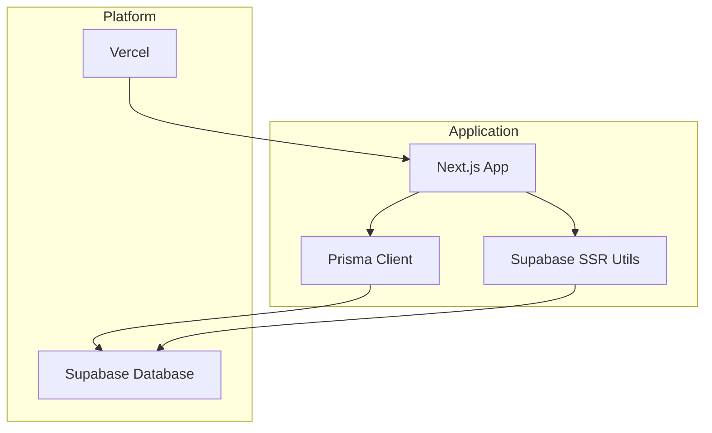
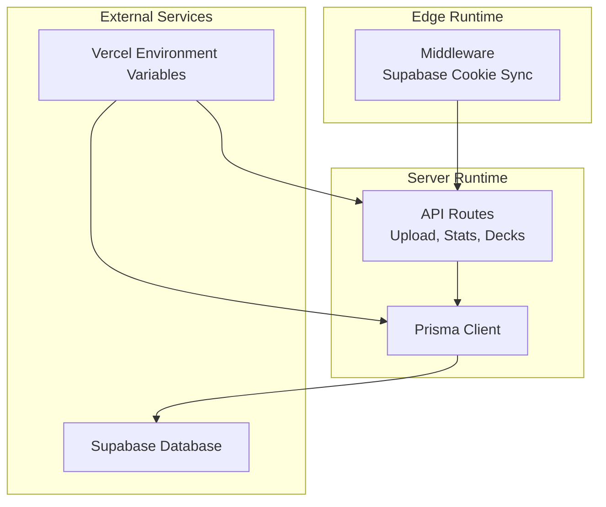
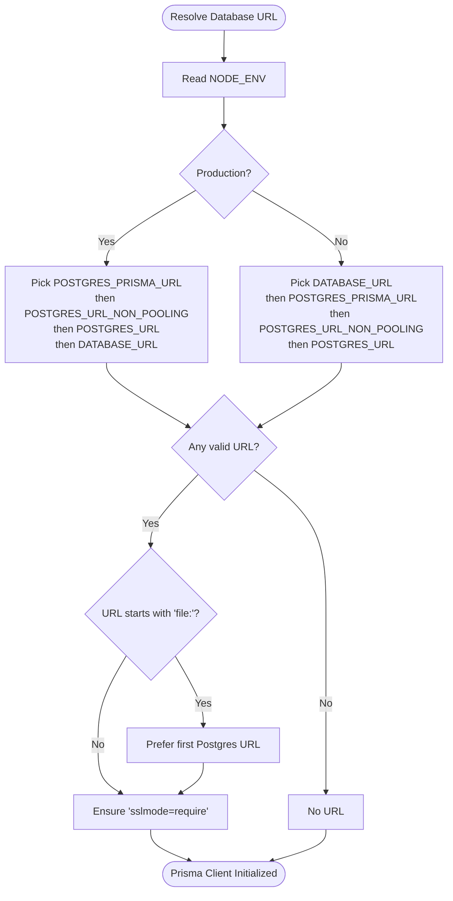
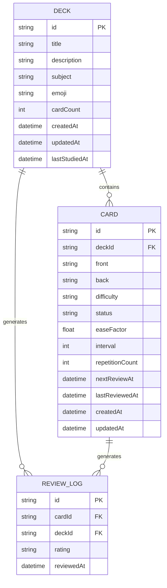
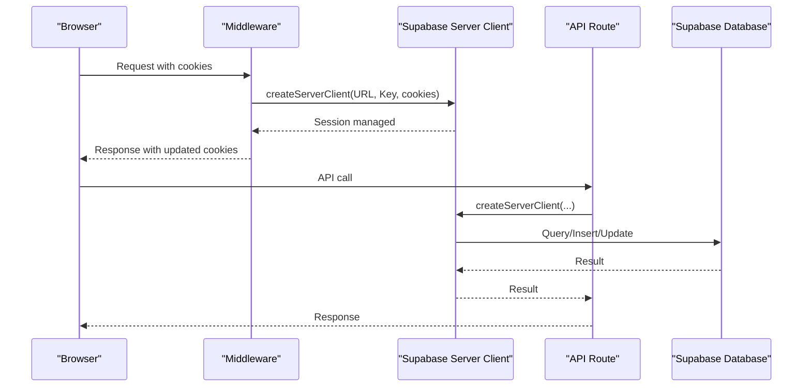
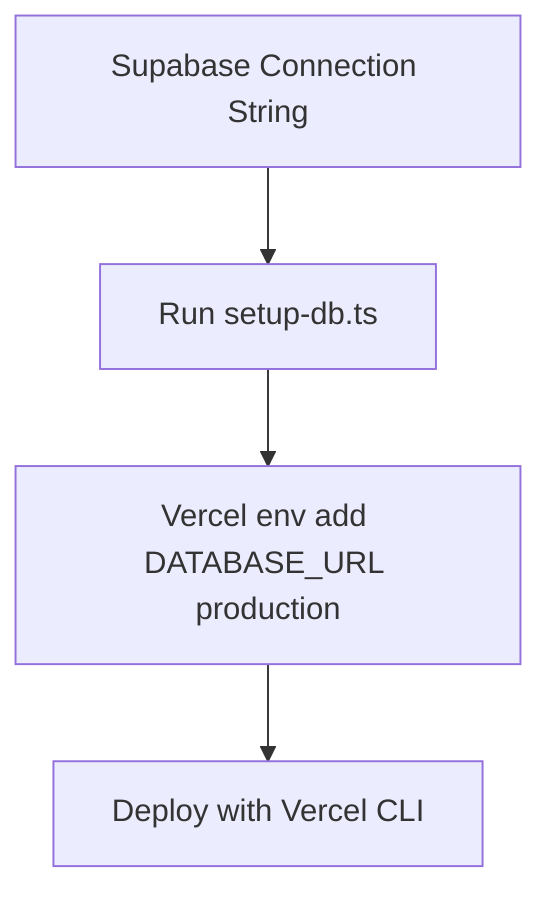
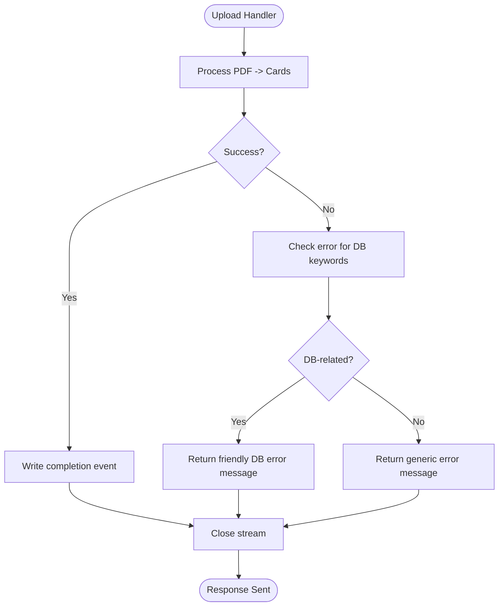
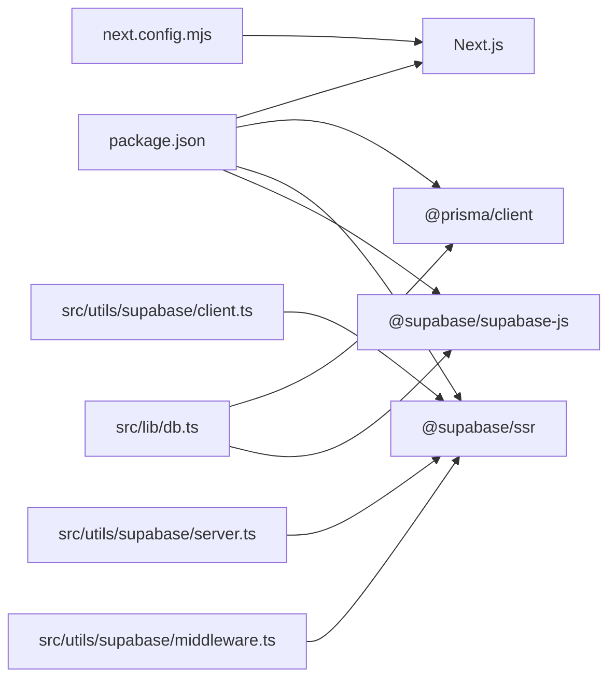

# Deployment & DevOps

<cite>
**Referenced Files in This Document**
- [package.json](file://package.json)
- [next.config.mjs](file://next.config.mjs)
- [middleware.ts](file://middleware.ts)
- [src/lib/db.ts](file://src/lib/db.ts)
- [prisma/schema.prisma](file://prisma/schema.prisma)
- [prisma/migrations/20260421034221_init/migration.sql](file://prisma/migrations/20260421034221_init/migration.sql)
- [prisma/migrations/migration_lock.toml](file://prisma/migrations/migration_lock.toml)
- [scripts/setup-db.ts](file://scripts/setup-db.ts)
- [src/utils/supabase/client.ts](file://src/utils/supabase/client.ts)
- [src/utils/supabase/server.ts](file://src/utils/supabase/server.ts)
- [src/utils/supabase/middleware.ts](file://src/utils/supabase/middleware.ts)
- [src/app/api/upload/route.ts](file://src/app/api/upload/route.ts)
- [VERCEL_SUPABASE_MCP_GUIDE.md](file://VERCEL_SUPABASE_MCP_GUIDE.md)
- [PRODUCTION_FIX_SUMMARY.md](file://PRODUCTION_FIX_SUMMARY.md)
</cite>

## Table of Contents
1. [Introduction](#introduction)
2. [Project Structure](#project-structure)
3. [Core Components](#core-components)
4. [Architecture Overview](#architecture-overview)
5. [Detailed Component Analysis](#detailed-component-analysis)
6. [Dependency Analysis](#dependency-analysis)
7. [Performance Considerations](#performance-considerations)
8. [Troubleshooting Guide](#troubleshooting-guide)
9. [Conclusion](#conclusion)
10. [Appendices](#appendices)

## Introduction
This document explains how recall is deployed and operated in production, focusing on Vercel deployment configuration, environment variable management, Supabase database setup and migration management, and operational practices such as monitoring, logging, error tracking, rollback procedures, and deployment validation. It consolidates configuration and automation artifacts present in the repository to provide a practical, end-to-end DevOps guide.

## Project Structure
The repository is a Next.js application with:
- Prisma ORM for schema and migrations
- Supabase for database and SSR client utilities
- Vercel for hosting and environment management
- A helper script to automate setting the database connection string in Vercel

**Section sources**
- [package.json:1-56](file://package.json#L1-L56)
- [next.config.mjs:1-14](file://next.config.mjs#L1-L14)
- [prisma/schema.prisma:1-51](file://prisma/schema.prisma#L1-L51)

## Core Components
- Database connectivity and pooling: The application selects the appropriate Postgres URL from environment variables and ensures SSL mode is required for serverless contexts.
- Prisma schema and migrations: The schema defines Deck, Card, and ReviewLog models with relations. Migrations are tracked and applied via Prisma.
- Supabase integration: Browser and server-side clients are created using environment variables for the Supabase URL and publishable key. Middleware coordinates session cookies with Supabase.
- Vercel deployment and environment variables: The project relies on Vercel-managed environment variables for production, including the database URL. A script automates setting the database URL in Vercel.
- Upload API error handling: The upload route includes targeted error messages for common database connectivity issues.

**Section sources**
- [src/lib/db.ts:1-68](file://src/lib/db.ts#L1-L68)
- [prisma/schema.prisma:1-51](file://prisma/schema.prisma#L1-L51)
- [prisma/migrations/20260421034221_init/migration.sql:1-42](file://prisma/migrations/20260421034221_init/migration.sql#L1-L42)
- [src/utils/supabase/client.ts:1-11](file://src/utils/supabase/client.ts#L1-L11)
- [src/utils/supabase/server.ts:1-29](file://src/utils/supabase/server.ts#L1-L29)
- [src/utils/supabase/middleware.ts:1-38](file://src/utils/supabase/middleware.ts#L1-L38)
- [scripts/setup-db.ts:1-58](file://scripts/setup-db.ts#L1-L58)
- [src/app/api/upload/route.ts:50-63](file://src/app/api/upload/route.ts#L50-L63)

## Architecture Overview
The runtime architecture ties together the frontend, backend API routes, Prisma ORM, Supabase, and Vercel.

**Diagram sources**
- [middleware.ts:1-22](file://middleware.ts#L1-L22)
- [src/app/api/upload/route.ts:50-63](file://src/app/api/upload/route.ts#L50-L63)
- [src/lib/db.ts:1-68](file://src/lib/db.ts#L1-L68)
- [prisma/schema.prisma:1-51](file://prisma/schema.prisma#L1-L51)

## Detailed Component Analysis

### Database Connectivity and Pooling
The database URL selection logic prioritizes platform-specific pooled URLs in production and falls back to non-pooled or alternative variables in development. It also enforces SSL mode for serverless environments.

**Diagram sources**
- [src/lib/db.ts:8-39](file://src/lib/db.ts#L8-L39)
- [src/lib/db.ts:41-47](file://src/lib/db.ts#L41-L47)

**Section sources**
- [src/lib/db.ts:1-68](file://src/lib/db.ts#L1-L68)

### Prisma Schema and Migrations
The schema defines three models with relations. The initial migration creates the corresponding tables and foreign keys. Migration state is tracked via a lock file.

**Diagram sources**
- [prisma/schema.prisma:10-50](file://prisma/schema.prisma#L10-L50)
- [prisma/migrations/20260421034221_init/migration.sql:1-42](file://prisma/migrations/20260421034221_init/migration.sql#L1-L42)

**Section sources**
- [prisma/schema.prisma:1-51](file://prisma/schema.prisma#L1-L51)
- [prisma/migrations/20260421034221_init/migration.sql:1-42](file://prisma/migrations/20260421034221_init/migration.sql#L1-L42)
- [prisma/migrations/migration_lock.toml:1-4](file://prisma/migrations/migration_lock.toml#L1-L4)

### Supabase Integration
The application uses Supabase for SSR and browser-side operations. Environment variables are used to configure the Supabase URL and publishable key. Middleware synchronizes cookies with Supabase to maintain session state.

**Diagram sources**
- [src/utils/supabase/middleware.ts:1-38](file://src/utils/supabase/middleware.ts#L1-L38)
- [src/utils/supabase/server.ts:1-29](file://src/utils/supabase/server.ts#L1-L29)
- [src/utils/supabase/client.ts:1-11](file://src/utils/supabase/client.ts#L1-L11)

**Section sources**
- [src/utils/supabase/client.ts:1-11](file://src/utils/supabase/client.ts#L1-L11)
- [src/utils/supabase/server.ts:1-29](file://src/utils/supabase/server.ts#L1-L29)
- [src/utils/supabase/middleware.ts:1-38](file://src/utils/supabase/middleware.ts#L1-L38)

### Vercel Deployment and Environment Variables
- The application is a Next.js app with a custom Webpack configuration to exclude server-only modules from browser bundling.
- Environment variables are consumed by Supabase utilities and the database layer. In production, the database URL is expected to be provided via Vercel environment variables.
- A helper script automates setting the database URL in Vercel production environment and suggests a subsequent deployment command.

**Diagram sources**
- [scripts/setup-db.ts:32-50](file://scripts/setup-db.ts#L32-L50)

**Section sources**
- [next.config.mjs:1-14](file://next.config.mjs#L1-L14)
- [scripts/setup-db.ts:1-58](file://scripts/setup-db.ts#L1-L58)
- [VERCEL_SUPABASE_MCP_GUIDE.md:1-137](file://VERCEL_SUPABASE_MCP_GUIDE.md#L1-L137)

### Upload API Error Handling
The upload route inspects error messages for database-related keywords and returns a user-friendly message when connectivity issues are detected. It also writes structured progress updates to a streaming response.

**Diagram sources**
- [src/app/api/upload/route.ts:50-63](file://src/app/api/upload/route.ts#L50-L63)
- [src/app/api/upload/route.ts:267-285](file://src/app/api/upload/route.ts#L267-L285)

**Section sources**
- [src/app/api/upload/route.ts:50-63](file://src/app/api/upload/route.ts#L50-L63)
- [src/app/api/upload/route.ts:267-285](file://src/app/api/upload/route.ts#L267-L285)

## Dependency Analysis
- Application dependencies include Next.js, Prisma Client, and Supabase libraries.
- Build-time and runtime behavior is influenced by the Webpack configuration that marks certain modules as external in server builds.
- Prisma is configured to load the database URL from environment variables, aligning with platform-managed secrets.

**Diagram sources**
- [package.json:18-41](file://package.json#L18-L41)
- [next.config.mjs:1-14](file://next.config.mjs#L1-L14)
- [src/lib/db.ts:1-68](file://src/lib/db.ts#L1-L68)
- [src/utils/supabase/client.ts:1-11](file://src/utils/supabase/client.ts#L1-L11)
- [src/utils/supabase/server.ts:1-29](file://src/utils/supabase/server.ts#L1-L29)
- [src/utils/supabase/middleware.ts:1-38](file://src/utils/supabase/middleware.ts#L1-L38)

**Section sources**
- [package.json:18-41](file://package.json#L18-L41)
- [next.config.mjs:1-14](file://next.config.mjs#L1-L14)
- [src/lib/db.ts:1-68](file://src/lib/db.ts#L1-L68)

## Performance Considerations
- Database URL selection prefers pooled connections in production to reduce connection overhead.
- SSL mode is enforced for serverless environments to satisfy database requirements.
- Middleware and API routes should avoid unnecessary repeated client initialization; reuse Supabase clients per request where possible.
- Streaming responses in upload routes prevent large payloads from accumulating in memory.

**Section sources**
- [src/lib/db.ts:8-39](file://src/lib/db.ts#L8-L39)
- [src/lib/db.ts:41-47](file://src/lib/db.ts#L41-L47)
- [src/app/api/upload/route.ts:267-285](file://src/app/api/upload/route.ts#L267-L285)

## Troubleshooting Guide
Common deployment and runtime issues and their resolution steps:

- Database connection failures during uploads
  - Symptom: Errors mentioning database URL, Prisma, or authentication failures.
  - Resolution: Verify the production environment variable for the database URL is set correctly in Vercel. Re-run the setup script to apply the connection string and redeploy.
  - Validation: After redeployment, confirm the environment variable is present and test an upload operation.

- Missing or invalid Supabase configuration
  - Symptom: Authentication or session errors related to Supabase credentials.
  - Resolution: Ensure the Supabase URL and publishable key are set in Vercel and match the project configuration.

- Build failures due to server-only modules
  - Symptom: Bundling errors for modules like pdf-parse in the browser bundle.
  - Resolution: The project’s Webpack configuration marks certain modules as external for server builds. Confirm the configuration is active and re-run the build.

- Migration state conflicts
  - Symptom: Migration errors indicating stale state.
  - Resolution: Ensure migrations are applied and the migration lock file reflects the current provider. Re-run migrations if necessary.

**Section sources**
- [src/app/api/upload/route.ts:50-63](file://src/app/api/upload/route.ts#L50-L63)
- [scripts/setup-db.ts:32-50](file://scripts/setup-db.ts#L32-L50)
- [next.config.mjs:1-14](file://next.config.mjs#L1-L14)
- [prisma/migrations/migration_lock.toml:1-4](file://prisma/migrations/migration_lock.toml#L1-L4)

## Conclusion
Recall’s deployment model integrates Next.js with Vercel for hosting and Supabase for the database. Environment variables are managed via Vercel, while Prisma handles schema and migrations. The provided scripts and configuration streamline setup, validation, and ongoing operations. Following the outlined practices ensures reliable deployments, robust error handling, and efficient database connectivity.

## Appendices

### Environment Variable Reference
- Database URL
  - Purpose: Connect Prisma to the Supabase Postgres database.
  - Consumption: Used by the database URL selection logic and Prisma.
  - Management: Set in Vercel production environment; automated via the setup script.

- Supabase URL and Publishable Key
  - Purpose: Configure Supabase clients for browser and server.
  - Consumption: Used by Supabase client utilities.
  - Management: Set in Vercel environment variables.

- Node Environment
  - Purpose: Controls URL selection precedence and Prisma client caching behavior.
  - Consumption: Checked in database URL selection logic.

**Section sources**
- [src/lib/db.ts:8-39](file://src/lib/db.ts#L8-L39)
- [prisma/schema.prisma:1-4](file://prisma/schema.prisma#L1-L4)
- [src/utils/supabase/client.ts:1-11](file://src/utils/supabase/client.ts#L1-L11)
- [src/utils/supabase/server.ts:1-29](file://src/utils/supabase/server.ts#L1-L29)
- [scripts/setup-db.ts:32-50](file://scripts/setup-db.ts#L32-L50)

### CI/CD and Automation Notes
- The repository includes a helper script to set the database URL in Vercel production and suggests a subsequent deployment command. This enables automation in CI/CD pipelines by invoking the script and deploying the app.
- The MCP guide describes integrated workflows for verifying environment variables and database connectivity after deployment.

**Section sources**
- [scripts/setup-db.ts:32-50](file://scripts/setup-db.ts#L32-L50)
- [VERCEL_SUPABASE_MCP_GUIDE.md:35-51](file://VERCEL_SUPABASE_MCP_GUIDE.md#L35-L51)