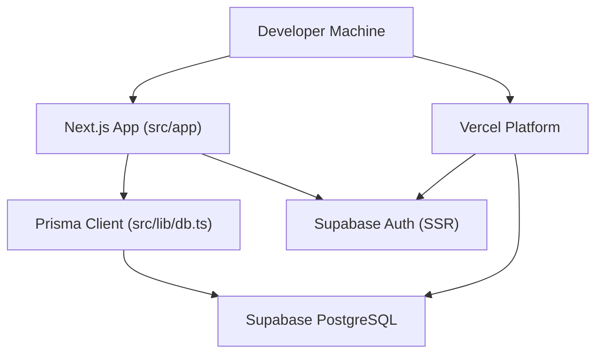
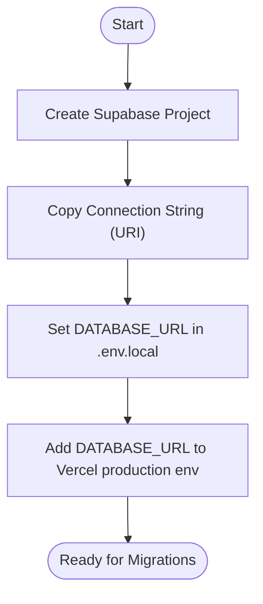
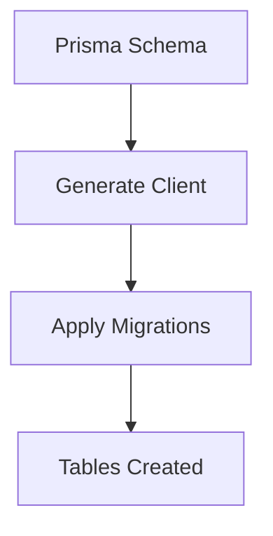
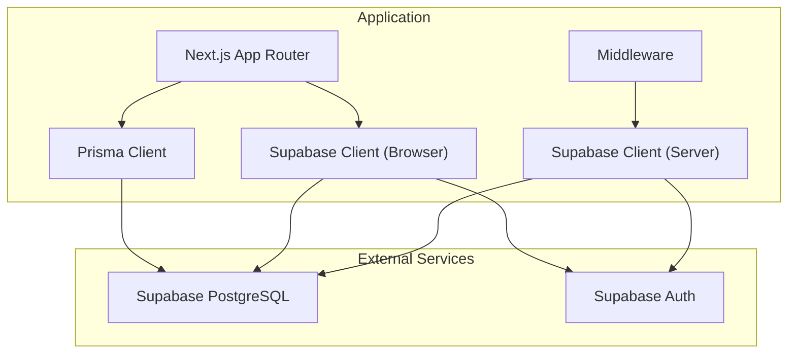

# Getting Started

<cite>
**Referenced Files in This Document**
- [README.md](file://README.md)
- [SUPABASE_SETUP.md](file://SUPABASE_SETUP.md)
- [package.json](file://package.json)
- [prisma/schema.prisma](file://prisma/schema.prisma)
- [src/lib/db.ts](file://src/lib/db.ts)
- [.env.example](file://.env.example)
- [scripts/setup-db.ts](file://scripts/setup-db.ts)
- [prisma/seed.ts](file://prisma/seed.ts)
- [src/utils/supabase/client.ts](file://src/utils/supabase/client.ts)
- [src/utils/supabase/server.ts](file://src/utils/supabase/server.ts)
- [middleware.ts](file://middleware.ts)
- [next.config.mjs](file://next.config.mjs)
- [VERCEL_SUPABASE_MCP_GUIDE.md](file://VERCEL_SUPABASE_MCP_GUIDE.md)
</cite>

## Table of Contents
1. [Introduction](#introduction)
2. [Prerequisites](#prerequisites)
3. [Project Structure](#project-structure)
4. [Installation](#installation)
5. [Environment Variables](#environment-variables)
6. [Database Setup](#database-setup)
7. [Run Migrations](#run-migrations)
8. [Seed Initial Data](#seed-initial-data)
9. [Launch Application](#launch-application)
10. [Verification](#verification)
11. [Architecture Overview](#architecture-overview)
12. [Troubleshooting Guide](#troubleshooting-guide)
13. [Conclusion](#conclusion)

## Introduction
This guide walks you through setting up the recall application from scratch. You will clone the repository, install dependencies, configure Supabase PostgreSQL, run database migrations, seed initial data, and launch the development server. It also covers deployment to Vercel and provides troubleshooting tips for common setup issues.

## Prerequisites
- Node.js installed on your machine
- Git for version control
- A free Supabase account to provision a PostgreSQL database
- A modern browser to test the app locally

Why PostgreSQL on Vercel: SQLite with an ephemeral filesystem does not persist across deployments on Vercel. The project is configured to use PostgreSQL via Supabase for reliable persistence and production readiness.

**Section sources**
- [README.md:18-22](file://README.md#L18-L22)
- [SUPABASE_SETUP.md:3-4](file://SUPABASE_SETUP.md#L3-L4)

## Project Structure
At a high level, the project uses Next.js App Router, Prisma for database modeling and migrations, Supabase for authentication and database connectivity, and Vercel for deployment. Key areas you will interact with during setup:
- Application entry points and pages under src/app
- Database client and Prisma configuration
- Supabase client utilities for server and browser
- Environment variables and scripts for Vercel integration

[No sources needed since this diagram shows conceptual workflow, not actual code structure]

## Installation
Follow these steps to install and run the application locally:

1. Clone the repository
   - Use your preferred Git client to clone the repository to your machine.
2. Navigate into the project directory
3. Install dependencies
   - Run the package manager install command to fetch all required packages.
4. Configure environment variables
   - Create or update your local environment file with database and Supabase credentials.
5. Run migrations
   - Apply Prisma migrations to create database tables.
6. Seed initial data (optional)
   - Populate the database with example decks and cards.
7. Launch the development server
   - Start the Next.js dev server and open the app in your browser.

These steps are summarized in the project’s README and setup guides.

**Section sources**
- [README.md:24-57](file://README.md#L24-L57)
- [package.json:5-13](file://package.json#L5-L13)

## Environment Variables
You will need several environment variables for local development and production deployment. The example template shows the expected format and keys.

- Database URL: Points to your Supabase PostgreSQL instance
- Supabase public URL and publishable key: For client-side Supabase SDK usage
- OpenRouter API key: For AI-powered features
- Supabase personal access token and project ref: For MCP tooling
- Vercel token (optional): For automated deployments

Ensure you replace placeholders with your actual values. For production on Vercel, set these variables in the platform’s environment settings.

**Section sources**
- [.env.example:1-8](file://.env.example#L1-L8)
- [SUPABASE_SETUP.md:38-55](file://SUPABASE_SETUP.md#L38-L55)
- [VERCEL_SUPABASE_MCP_GUIDE.md:65-72](file://VERCEL_SUPABASE_MCP_GUIDE.md#L65-L72)

## Database Setup
The project uses Prisma with PostgreSQL via Supabase. The schema defines three core models: Deck, Card, and ReviewLog. Prisma is configured to use PostgreSQL as the provider and reads the connection URL from environment variables.

Why not SQLite on Vercel: Vercel runs applications in a serverless environment with an ephemeral filesystem. SQLite files are not persisted across requests and deploys, making it unsuitable for production.

Steps:
1. Provision a free Supabase PostgreSQL project
2. Retrieve the connection string from the Supabase dashboard
3. Set the DATABASE_URL in your local environment file
4. For Vercel production, add DATABASE_URL to the platform’s environment variables

**Section sources**
- [prisma/schema.prisma:1-4](file://prisma/schema.prisma#L1-L4)
- [README.md:18-22](file://README.md#L18-L22)
- [SUPABASE_SETUP.md:8-55](file://SUPABASE_SETUP.md#L8-L55)

## Run Migrations
After setting up the database, apply Prisma migrations to create the required tables and indexes. The project includes a convenience script to run migrations locally.

- Run the migration command to create tables defined in the Prisma schema
- After successful migrations, you can optionally seed the database with example data

**Diagram sources**
- [prisma/schema.prisma:1-51](file://prisma/schema.prisma#L1-L51)
- [package.json:11-11](file://package.json#L11-L11)

**Section sources**
- [package.json:11-11](file://package.json#L11-L11)
- [SUPABASE_SETUP.md:56-64](file://SUPABASE_SETUP.md#L56-L64)

## Seed Initial Data
Optionally, seed the database with example decks and cards to explore the application immediately. The seed script creates sample content across multiple subjects and adds review logs for realistic scheduling behavior.

- Run the seed command to populate example data
- Verify counts in the database after seeding completes

**Section sources**
- [prisma/seed.ts:1-332](file://prisma/seed.ts#L1-L332)
- [package.json:12-12](file://package.json#L12-L12)

## Launch Application
Start the Next.js development server to run the application locally. The server will watch for file changes and hot-reload the UI.

- Start the dev server using the project’s script
- Open the application in your browser at the port indicated by the server

**Section sources**
- [package.json:7-7](file://package.json#L7-L7)
- [README.md:54-57](file://README.md#L54-L57)

## Verification
Confirm your setup is working correctly by checking the following:

- The development server starts without errors
- Decks and cards load in the UI
- You can navigate to study pages and interact with flashcards
- Database connectivity verified via Supabase dashboard (e.g., run a count query)

If you encounter errors related to missing tables or migrations, re-run the migration command.

**Section sources**
- [SUPABASE_SETUP.md:80-88](file://SUPABASE_SETUP.md#L80-L88)
- [README.md:54-57](file://README.md#L54-L57)

## Architecture Overview
The application integrates Next.js, Prisma, and Supabase with a clear separation of concerns:
- Next.js handles routing and rendering
- Prisma manages database schema and client generation
- Supabase provides PostgreSQL and authentication
- Vercel hosts the application and manages environment variables

**Diagram sources**
- [src/lib/db.ts:1-68](file://src/lib/db.ts#L1-L68)
- [src/utils/supabase/client.ts:1-11](file://src/utils/supabase/client.ts#L1-L11)
- [src/utils/supabase/server.ts:1-29](file://src/utils/supabase/server.ts#L1-L29)
- [middleware.ts:1-22](file://middleware.ts#L1-L22)

## Troubleshooting Guide
Common issues and resolutions during setup:

- Connection string format
  - Ensure the connection string starts with the PostgreSQL scheme and includes the correct password
- “Relation does not exist” or missing tables
  - Run migrations again to create required tables
- “Connection refused”
  - Verify the database password and that the Supabase project is running
- Auth not working
  - Clear browser cookies and restart the development server
- Vercel environment variables
  - Ensure DATABASE_URL is present in Vercel production environment before deploying
- PDF parsing in server builds
  - The project marks certain Node.js modules as external for server builds; ensure your environment supports server-side execution

**Section sources**
- [SUPABASE_SETUP.md:72-88](file://SUPABASE_SETUP.md#L72-L88)
- [VERCEL_SUPABASE_MCP_GUIDE.md:115-128](file://VERCEL_SUPABASE_MCP_GUIDE.md#L115-L128)
- [next.config.mjs:3-10](file://next.config.mjs#L3-L10)

## Conclusion
You now have the recall application running locally with a properly configured Supabase PostgreSQL database. You can explore decks, study flashcards, and deploy to Vercel with confidence. Use the troubleshooting section if you encounter issues, and refer back to the setup guides for environment variable and migration steps.