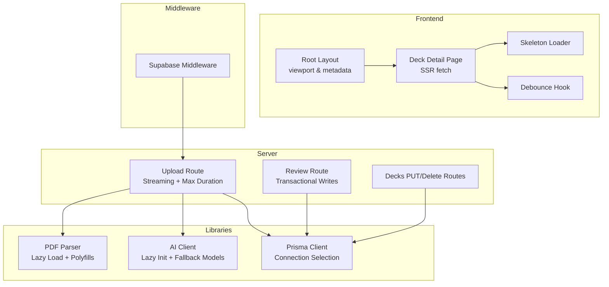
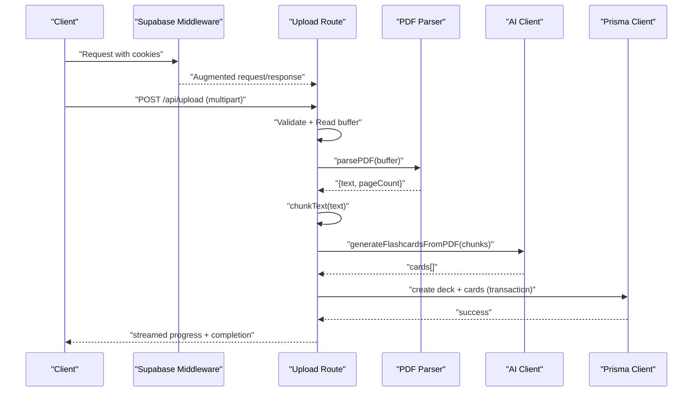
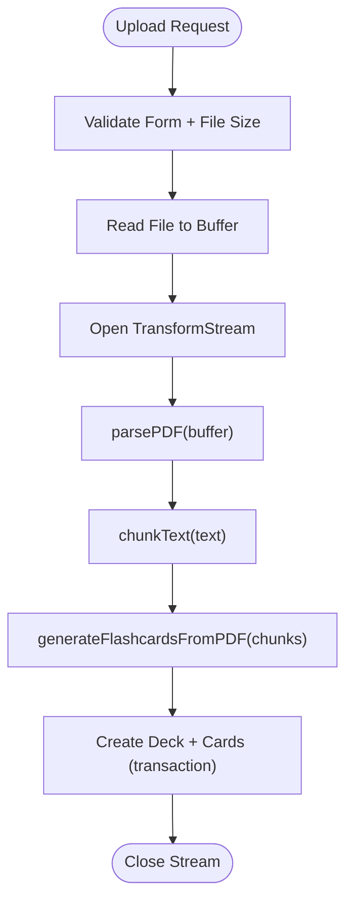
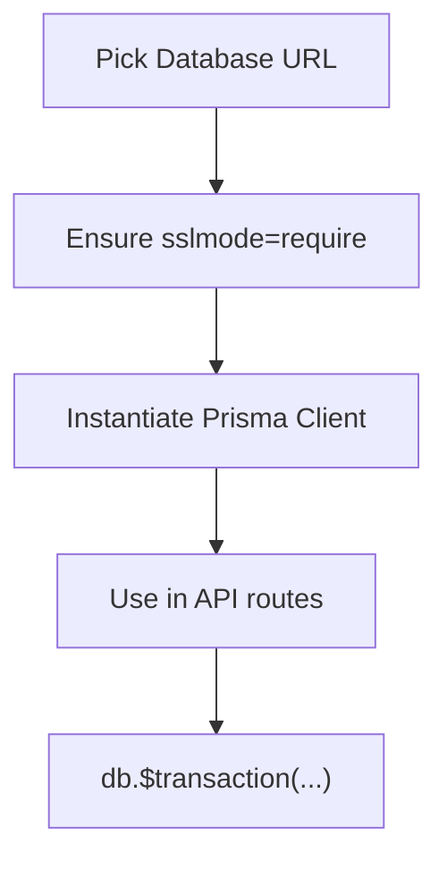
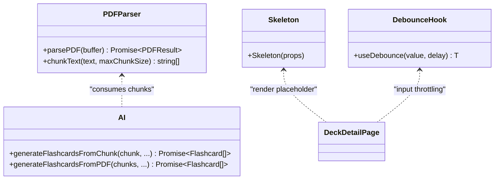
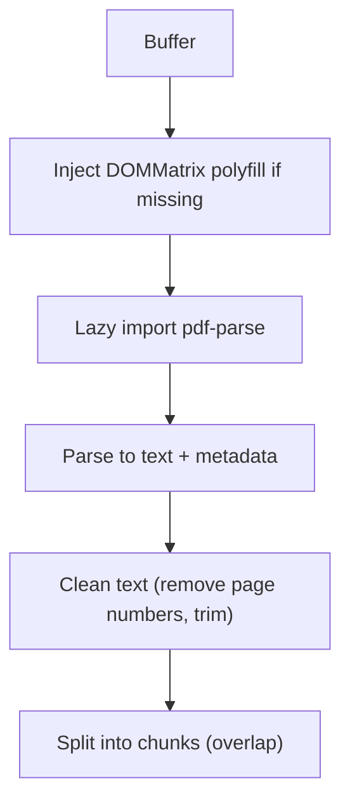
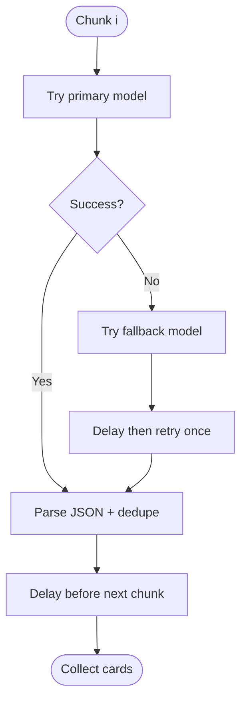
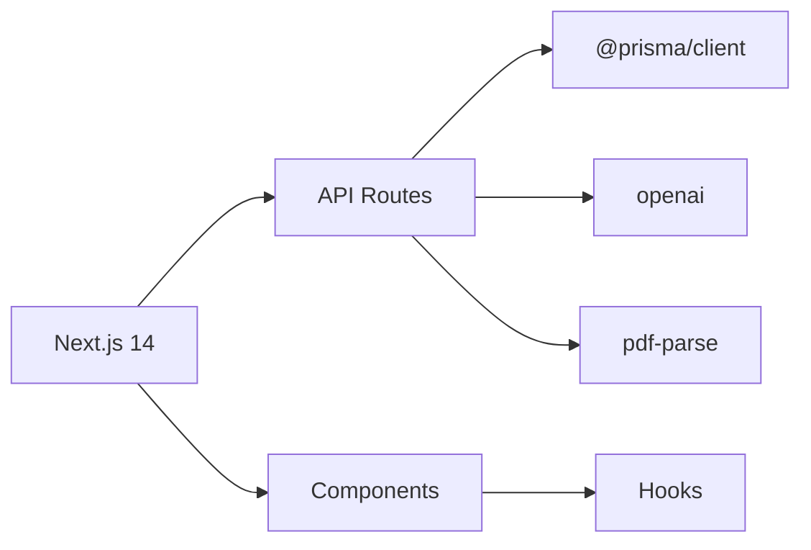

# Performance Optimization

<cite>
**Referenced Files in This Document**
- [next.config.mjs](file://next.config.mjs)
- [package.json](file://package.json)
- [db.ts](file://src/lib/db.ts)
- [server.ts](file://src/utils/supabase/server.ts)
- [middleware.ts](file://src/utils/supabase/middleware.ts)
- [layout.tsx](file://src/app/layout.tsx)
- [pdf.ts](file://src/lib/pdf.ts)
- [ai.ts](file://src/lib/ai.ts)
- [upload.route.ts](file://src/app/api/upload/route.ts)
- [decks.[id].route.ts](file://src/app/api/decks/[id]/route.ts)
- [review.route.ts](file://src/app/api/review/route.ts)
- [decks.[id].page.tsx](file://src/app/decks/[id]/page.tsx)
- [Skeleton.tsx](file://src/components/shared/Skeleton.tsx)
- [useDebounce.ts](file://src/hooks/useDebounce.ts)
- [stats.ts](file://src/lib/stats.ts)
- [schema.prisma](file://prisma/schema.prisma)
</cite>

## Table of Contents
1. [Introduction](#introduction)
2. [Project Structure](#project-structure)
3. [Core Components](#core-components)
4. [Architecture Overview](#architecture-overview)
5. [Detailed Component Analysis](#detailed-component-analysis)
6. [Dependency Analysis](#dependency-analysis)
7. [Performance Considerations](#performance-considerations)
8. [Troubleshooting Guide](#troubleshooting-guide)
9. [Conclusion](#conclusion)
10. [Appendices](#appendices)

## Introduction
This document explains the performance optimization strategies implemented in the project, focusing on Next.js 14 features, database query optimization, caching, frontend performance, PDF processing, AI API handling, memory management, monitoring, and production-grade guidance. It synthesizes concrete implementations present in the repository to help developers understand and extend performance improvements.

## Project Structure
The project follows a Next.js 14 App Router layout with server-side logic in API routes, database access via Prisma, and client-side UI components. Key performance-sensitive areas include:
- Server components and streaming responses for long-running tasks
- Lazy loading of heavy modules (pdf-parse, OpenAI SDK)
- Database connection selection and SSL enforcement
- PDF parsing with chunking and deduplication
- AI generation with retries and pacing
- UI skeleton loaders and debounced interactions

**Diagram sources**
- [layout.tsx:14-37](file://src/app/layout.tsx#L14-L37)
- [decks.[id].page.tsx:26-60](file://src/app/decks/[id]/page.tsx#L26-L60)
- [Skeleton.tsx:7-9](file://src/components/shared/Skeleton.tsx#L7-L9)
- [useDebounce.ts:3-17](file://src/hooks/useDebounce.ts#L3-L17)
- [middleware.ts:7-37](file://src/utils/supabase/middleware.ts#L7-L37)
- [upload.route.ts:86-297](file://src/app/api/upload/route.ts#L86-L297)
- [review.route.ts:5-75](file://src/app/api/review/route.ts#L5-L75)
- [decks.[id].route.ts:4-42](file://src/app/api/decks/[id]/route.ts#L4-L42)
- [db.ts:51-63](file://src/lib/db.ts#L51-L63)
- [pdf.ts:13-61](file://src/lib/pdf.ts#L13-L61)
- [ai.ts:8-24](file://src/lib/ai.ts#L8-L24)

**Section sources**
- [layout.tsx:14-37](file://src/app/layout.tsx#L14-L37)
- [decks.[id].page.tsx:26-60](file://src/app/decks/[id]/page.tsx#L26-L60)
- [Skeleton.tsx:7-9](file://src/components/shared/Skeleton.tsx#L7-L9)
- [useDebounce.ts:3-17](file://src/hooks/useDebounce.ts#L3-L17)
- [middleware.ts:7-37](file://src/utils/supabase/middleware.ts#L7-L37)
- [upload.route.ts:86-297](file://src/app/api/upload/route.ts#L86-L297)
- [review.route.ts:5-75](file://src/app/api/review/route.ts#L5-L75)
- [decks.[id].route.ts:4-42](file://src/app/api/decks/[id]/route.ts#L4-L42)
- [db.ts:51-63](file://src/lib/db.ts#L51-L63)
- [pdf.ts:13-61](file://src/lib/pdf.ts#L13-L61)
- [ai.ts:8-24](file://src/lib/ai.ts#L8-L24)

## Core Components
- Next.js 14 App Router with server components and streaming responses for long-running tasks
- Database connectivity with environment-aware URL selection and SSL enforcement
- PDF processing pipeline with lazy loading and chunking
- AI generation with fallback models and retry/backoff
- UI skeleton loaders and debounced interactions for perceived performance

**Section sources**
- [upload.route.ts:7-9](file://src/app/api/upload/route.ts#L7-L9)
- [db.ts:8-39](file://src/lib/db.ts#L8-L39)
- [pdf.ts:13-61](file://src/lib/pdf.ts#L13-L61)
- [ai.ts:8-24](file://src/lib/ai.ts#L8-L24)
- [Skeleton.tsx:7-9](file://src/components/shared/Skeleton.tsx#L7-L9)
- [useDebounce.ts:3-17](file://src/hooks/useDebounce.ts#L3-L17)

## Architecture Overview
The system integrates Supabase SSR clients, Prisma ORM, and AI APIs behind Next.js server routes. Uploads stream progress, parse PDFs lazily, chunk content, and persist decks/cards transactionally.

**Diagram sources**
- [middleware.ts:7-37](file://src/utils/supabase/middleware.ts#L7-L37)
- [upload.route.ts:169-297](file://src/app/api/upload/route.ts#L169-L297)
- [pdf.ts:13-61](file://src/lib/pdf.ts#L13-L61)
- [ai.ts:168-232](file://src/lib/ai.ts#L168-L232)
- [db.ts:51-63](file://src/lib/db.ts#L51-L63)

## Detailed Component Analysis

### Next.js 14 Performance Features
- Streaming responses: The upload route uses a TransformStream to emit progress events incrementally, avoiding buffering and enabling immediate client updates.
- Runtime configuration: Explicit Node.js runtime and increased maxDuration accommodate long-running PDF processing and AI calls.
- Externalization of server-only modules: next.config.mjs marks pdf-parse and canvas as externals on the server to prevent bundling conflicts and reduce server bundle size.

**Diagram sources**
- [upload.route.ts:86-297](file://src/app/api/upload/route.ts#L86-L297)
- [pdf.ts:13-61](file://src/lib/pdf.ts#L13-L61)
- [ai.ts:168-232](file://src/lib/ai.ts#L168-L232)
- [next.config.mjs:5-10](file://next.config.mjs#L5-L10)

**Section sources**
- [upload.route.ts:7-9](file://src/app/api/upload/route.ts#L7-L9)
- [upload.route.ts:164-297](file://src/app/api/upload/route.ts#L164-L297)
- [next.config.mjs:5-10](file://next.config.mjs#L5-L10)

### Database Query Optimization and Connection Management
- Environment-aware URL selection: Chooses appropriate datasource URLs and prefers pooled variants in production for better connection reuse.
- SSL enforcement: Ensures sslmode=require for remote Postgres providers to meet serverless expectations.
- Transactional writes: Review updates and deck touchpoints are wrapped in atomic transactions to minimize partial writes and improve consistency under contention.

**Diagram sources**
- [db.ts:8-39](file://src/lib/db.ts#L8-L39)
- [db.ts:51-63](file://src/lib/db.ts#L51-L63)
- [review.route.ts:44-68](file://src/app/api/review/route.ts#L44-L68)

**Section sources**
- [db.ts:8-39](file://src/lib/db.ts#L8-L39)
- [db.ts:51-63](file://src/lib/db.ts#L51-L63)
- [review.route.ts:44-68](file://src/app/api/review/route.ts#L44-L68)
- [schema.prisma:10-50](file://prisma/schema.prisma#L10-L50)

### Caching Mechanisms
- Application-level rate limiting: In-memory Map keyed by IP enforces per-minute request quotas for uploads to protect downstream systems.
- No persistent cache layer is implemented in the current codebase; production deployments can leverage platform-specific caching (e.g., Redis) for frequently accessed queries.

**Section sources**
- [upload.route.ts:70-84](file://src/app/api/upload/route.ts#L70-L84)

### Frontend Performance: Code Splitting, Lazy Loading, and Bundle Optimization
- Lazy loading of heavy modules: pdf-parse and OpenAI SDK are initialized lazily to avoid bundling overhead during build and initial load.
- Skeleton loaders: Skeleton.tsx provides a lightweight shimmer effect to improve perceived performance during SSR/SSG transitions.
- Debounced interactions: useDebounce reduces re-renders for rapid input changes.

**Diagram sources**
- [pdf.ts:13-111](file://src/lib/pdf.ts#L13-L111)
- [ai.ts:76-153](file://src/lib/ai.ts#L76-L153)
- [Skeleton.tsx:7-9](file://src/components/shared/Skeleton.tsx#L7-L9)
- [useDebounce.ts:3-17](file://src/hooks/useDebounce.ts#L3-L17)

**Section sources**
- [pdf.ts:13-61](file://src/lib/pdf.ts#L13-L61)
- [ai.ts:8-24](file://src/lib/ai.ts#L8-L24)
- [Skeleton.tsx:7-9](file://src/components/shared/Skeleton.tsx#L7-L9)
- [useDebounce.ts:3-17](file://src/hooks/useDebounce.ts#L3-L17)

### PDF Processing Performance
- Lazy module loading: pdf-parse is imported only when needed, reducing cold start and server bundle size.
- Polyfills: DOMMatrix polyfill is conditionally injected to support pdf-parse in serverless environments.
- Text cleaning and chunking: Removes page numbers and collapses whitespace; splits into overlapping chunks to preserve context for AI generation.

**Diagram sources**
- [pdf.ts:13-61](file://src/lib/pdf.ts#L13-L61)
- [pdf.ts:67-111](file://src/lib/pdf.ts#L67-L111)

**Section sources**
- [pdf.ts:13-61](file://src/lib/pdf.ts#L13-L61)
- [pdf.ts:67-111](file://src/lib/pdf.ts#L67-L111)

### AI API Optimization
- Lazy client initialization: OpenAI client is created only when the API key is present, preventing build-time failures.
- Fallback models: Iterates through models with a fallback strategy to increase reliability.
- Retry and pacing: Single retry with delay and per-request throttling to respect free-tier rate limits.
- Robust parsing: Extracts JSON from AI responses with multiple strategies and logs failures.

**Diagram sources**
- [ai.ts:8-24](file://src/lib/ai.ts#L8-L24)
- [ai.ts:92-120](file://src/lib/ai.ts#L92-L120)
- [ai.ts:168-232](file://src/lib/ai.ts#L168-L232)

**Section sources**
- [ai.ts:8-24](file://src/lib/ai.ts#L8-L24)
- [ai.ts:92-120](file://src/lib/ai.ts#L92-L120)
- [ai.ts:168-232](file://src/lib/ai.ts#L168-L232)

### Memory Management
- Streaming responses: TransformStream streams progress and avoids accumulating large payloads in memory.
- Chunked processing: PDF chunks and AI generations are processed iteratively to bound memory usage.
- Lazy imports: Heavy libraries are loaded on demand to reduce peak memory during cold starts.

**Section sources**
- [upload.route.ts:164-297](file://src/app/api/upload/route.ts#L164-L297)
- [pdf.ts:13-61](file://src/lib/pdf.ts#L13-L61)
- [ai.ts:8-24](file://src/lib/ai.ts#L8-L24)

### Monitoring and Profiling Techniques
- Console logging: Upload route logs key milestones (parsing, chunking, saving) to aid profiling.
- Structured progress events: Streamed JSON events allow clients to track progress and correlate with backend logs.
- Error categorization: Public error messages distinguish between AI, database, and configuration issues.

**Section sources**
- [upload.route.ts:172-178](file://src/app/api/upload/route.ts#L172-L178)
- [upload.route.ts:203-209](file://src/app/api/upload/route.ts#L203-L209)
- [upload.route.ts:253-255](file://src/app/api/upload/route.ts#L253-L255)
- [upload.route.ts:11-63](file://src/app/api/upload/route.ts#L11-L63)

### Performance Metrics Collection and Bottleneck Identification
- Metrics to track:
  - PDF parse time, chunk count, and AI latency per chunk
  - Database transaction durations and row counts
  - Client-side render times and skeleton durations
- Bottlenecks observed:
  - AI rate limits and retries dominate end-to-end latency
  - Large PDFs increase parse and chunking overhead
  - Database round-trips for deck detail page could benefit from pagination or caching

**Section sources**
- [upload.route.ts:169-297](file://src/app/api/upload/route.ts#L169-L297)
- [decks.[id].page.tsx:30-42](file://src/app/decks/[id]/page.tsx#L30-L42)

### Optimization Guidelines for Development and Production
- Development
  - Keep lazy imports for heavy modules to speed local builds.
  - Use skeleton loaders and debounced inputs to simulate production performance.
- Production
  - Prefer pooled Postgres URLs and enforce sslmode=require.
  - Increase maxDuration for long-running routes and use streaming responses.
  - Add platform caching for frequent dashboard/stats queries.
  - Monitor AI rate limits and implement exponential backoff.
  - Consider CDN for static assets and optimize image delivery.

**Section sources**
- [db.ts:8-39](file://src/lib/db.ts#L8-L39)
- [upload.route.ts:7-9](file://src/app/api/upload/route.ts#L7-L9)
- [stats.ts:51-88](file://src/lib/stats.ts#L51-L88)

## Dependency Analysis
The system’s performance depends on several external dependencies and their configuration:
- Next.js 14 runtime and App Router
- Prisma client for database access
- OpenAI-compatible API for flashcard generation
- pdf-parse for PDF text extraction
- Supabase SSR client for auth/session handling

**Diagram sources**
- [package.json:31](file://package.json#L31)
- [package.json:18-40](file://package.json#L18-L40)
- [upload.route.ts:3-5](file://src/app/api/upload/route.ts#L3-L5)

**Section sources**
- [package.json:31](file://package.json#L31)
- [package.json:18-40](file://package.json#L18-L40)
- [upload.route.ts:3-5](file://src/app/api/upload/route.ts#L3-L5)

## Performance Considerations
- Server components and streaming: Use server components for data fetching and stream long-running tasks to reduce client work.
- Database pooling: Select pooled Postgres URLs in production and ensure SSL.
- Lazy initialization: Defer heavy SDKs and parsers until needed.
- Chunking and deduplication: Reduce AI payload sizes and avoid redundant cards.
- Rate limiting and retries: Protect upstream services and handle transient failures gracefully.
- UI responsiveness: Skeleton loaders and debounced inputs improve perceived performance.

[No sources needed since this section provides general guidance]

## Troubleshooting Guide
- Missing environment variables:
  - DATABASE_URL or incorrect Postgres URL leads to connection/auth errors.
  - OPENROUTER_API_KEY missing disables AI generation.
- AI service issues:
  - Rate limits, model unavailability, or 401/5xx responses are mapped to user-friendly messages.
- PDF processing:
  - Very small extracted text length triggers an early error indicating insufficient readable text.
- Database writes:
  - Transactional updates ensure consistency; inspect review logs and deck/card counts to diagnose anomalies.

**Section sources**
- [upload.route.ts:87-106](file://src/app/api/upload/route.ts#L87-L106)
- [upload.route.ts:179-189](file://src/app/api/upload/route.ts#L179-L189)
- [upload.route.ts:267-279](file://src/app/api/upload/route.ts#L267-L279)
- [review.route.ts:44-68](file://src/app/api/review/route.ts#L44-L68)

## Conclusion
The project leverages Next.js 14 streaming, lazy loading, and environment-aware database configuration to deliver responsive performance. PDF processing and AI generation are optimized through chunking, fallbacks, and pacing. Production readiness requires careful attention to database pooling, rate limiting, and observability. These patterns provide a strong foundation for scaling and maintaining performance.

[No sources needed since this section summarizes without analyzing specific files]

## Appendices
- Supabase SSR client creation in server components and middleware ensures consistent cookie handling and session refresh behavior.

**Section sources**
- [server.ts:7-28](file://src/utils/supabase/server.ts#L7-L28)
- [middleware.ts:7-37](file://src/utils/supabase/middleware.ts#L7-L37)