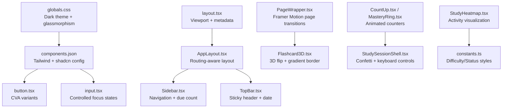
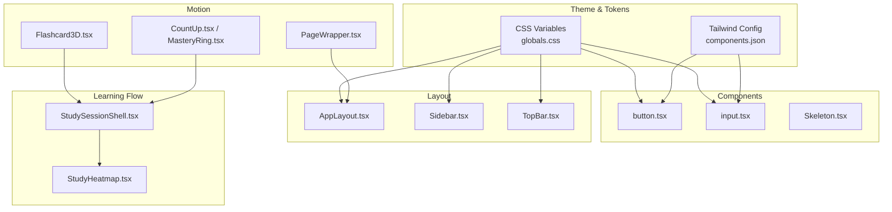
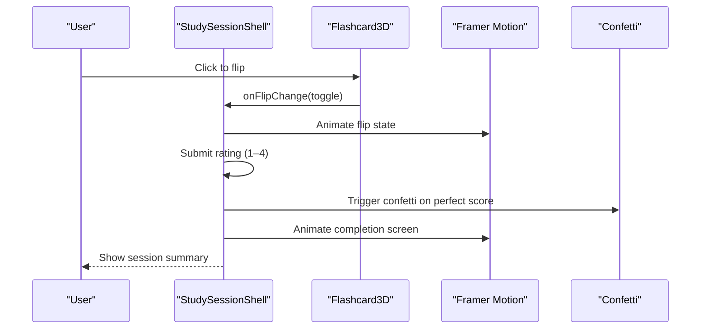
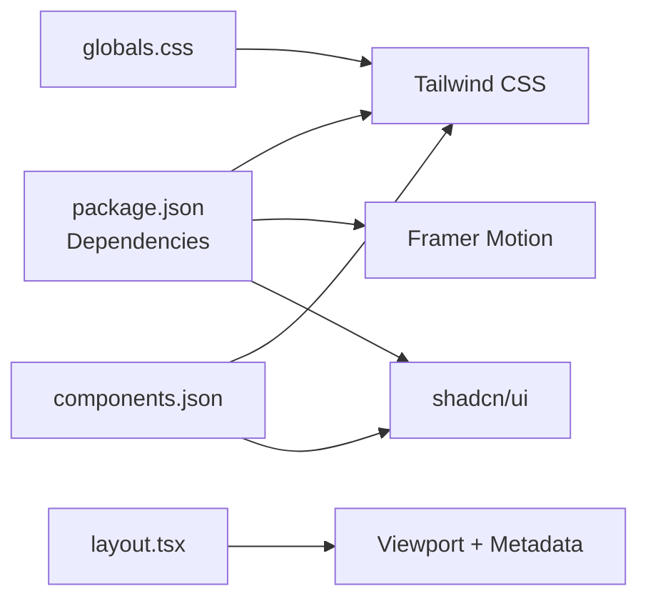

# Design Philosophy

<cite>
**Referenced Files in This Document**
- [globals.css](file://src/styles/globals.css)
- [components.json](file://components.json)
- [package.json](file://package.json)
- [layout.tsx](file://src/app/layout.tsx)
- [AppLayout.tsx](file://src/components/layout/AppLayout.tsx)
- [Sidebar.tsx](file://src/components/layout/Sidebar.tsx)
- [TopBar.tsx](file://src/components/layout/TopBar.tsx)
- [PageWrapper.tsx](file://src/components/layout/PageWrapper.tsx)
- [button.tsx](file://src/components/ui/button.tsx)
- [input.tsx](file://src/components/ui/input.tsx)
- [Skeleton.tsx](file://src/components/shared/Skeleton.tsx)
- [CountUp.tsx](file://src/components/shared/CountUp.tsx)
- [MasteryRing.tsx](file://src/components/stats/MasteryRing.tsx)
- [Flashcard3D.tsx](file://src/components/flashcard/Flashcard3D.tsx)
- [StudySessionShell.tsx](file://src/components/flashcard/StudySessionShell.tsx)
- [StudyHeatmap.tsx](file://src/components/shared/StudyHeatmap.tsx)
- [utils.ts](file://src/lib/utils.ts)
- [constants.ts](file://src/lib/constants.ts)
</cite>

## Table of Contents
1. [Introduction](#introduction)
2. [Project Structure](#project-structure)
3. [Core Components](#core-components)
4. [Architecture Overview](#architecture-overview)
5. [Detailed Component Analysis](#detailed-component-analysis)
6. [Dependency Analysis](#dependency-analysis)
7. [Performance Considerations](#performance-considerations)
8. [Troubleshooting Guide](#troubleshooting-guide)
9. [Conclusion](#conclusion)
10. [Appendices](#appendices)

## Introduction
This document outlines the design philosophy underpinning the application’s aesthetic principles and user experience approach. It focuses on the glassmorphism design language, micro-interaction philosophy, dark theme implementation, and mobile-first responsive design. It also explains the animation systems powered by Framer Motion, accessibility considerations, and guidelines for maintaining design consistency, component styling patterns, and customization options. Finally, it demonstrates how the design supports learning workflows and enhances user engagement through thoughtful interaction patterns.

## Project Structure
The design system is built on a cohesive stack:
- Tailwind CSS and CSS variables define a dark color scheme and foundational tokens.
- shadcn/ui components provide consistent, accessible UI primitives with a New York style.
- Framer Motion powers micro-interactions and page transitions.
- Next.js app router enforces mobile-first responsiveness and viewport configuration.

**Diagram sources**
- [globals.css:1-82](file://src/styles/globals.css#L1-L82)
- [components.json:1-21](file://components.json#L1-L21)
- [layout.tsx:1-52](file://src/app/layout.tsx#L1-L52)
- [AppLayout.tsx:1-41](file://src/components/layout/AppLayout.tsx#L1-L41)
- [Sidebar.tsx:1-98](file://src/components/layout/Sidebar.tsx#L1-L98)
- [TopBar.tsx:1-41](file://src/components/layout/TopBar.tsx#L1-L41)
- [PageWrapper.tsx:1-29](file://src/components/layout/PageWrapper.tsx#L1-L29)
- [button.tsx:1-47](file://src/components/ui/button.tsx#L1-L47)
- [input.tsx:1-23](file://src/components/ui/input.tsx#L1-L23)
- [Flashcard3D.tsx:1-58](file://src/components/flashcard/Flashcard3D.tsx#L1-L58)
- [CountUp.tsx:1-30](file://src/components/shared/CountUp.tsx#L1-L30)
- [MasteryRing.tsx:1-62](file://src/components/stats/MasteryRing.tsx#L1-L62)
- [StudySessionShell.tsx:98-207](file://src/components/flashcard/StudySessionShell.tsx#L98-L207)
- [StudyHeatmap.tsx:120-137](file://src/components/shared/StudyHeatmap.tsx#L120-L137)
- [constants.ts:1-31](file://src/lib/constants.ts#L1-L31)

**Section sources**
- [globals.css:1-82](file://src/styles/globals.css#L1-L82)
- [components.json:1-21](file://components.json#L1-L21)
- [package.json:18-40](file://package.json#L18-L40)
- [layout.tsx:14-37](file://src/app/layout.tsx#L14-L37)

## Core Components
- Dark theme foundation: CSS variables define background, surface, border, foreground, muted, and accent colors. The color-scheme is set to dark globally.
- Glassmorphism: A reusable class applies backdrop blur, translucent backgrounds, and subtle borders to create depth without sacrificing readability.
- Micro-interactions: Framer Motion animates page transitions, navigation indicators, counters, and completion feedback. These are intentionally lightweight to preserve performance.
- Mobile-first responsive design: Breakpoints and spacing adapt from mobile to desktop; sticky headers and collapsible navigation support small screens.
- Accessibility: Focus-visible rings, reduced-motion-safe animations, keyboard-driven controls, and semantic markup ensure inclusive experiences.

**Section sources**
- [globals.css:3-12](file://src/styles/globals.css#L3-L12)
- [globals.css:60-65](file://src/styles/globals.css#L60-L65)
- [PageWrapper.tsx:13-28](file://src/components/layout/PageWrapper.tsx#L13-L28)
- [Sidebar.tsx:49-97](file://src/components/layout/Sidebar.tsx#L49-L97)
- [TopBar.tsx:32-38](file://src/components/layout/TopBar.tsx#L32-L38)
- [StudySessionShell.tsx:127-158](file://src/components/flashcard/StudySessionShell.tsx#L127-L158)

## Architecture Overview
The design architecture centers on a layered approach:
- Theming and tokens in CSS variables and globals.
- Component primitives from shadcn/ui with controlled variants.
- Motion orchestration via Framer Motion for page and micro-interactions.
- Learning-centric flows with keyboard shortcuts, progress visualization, and celebratory feedback.

**Diagram sources**
- [globals.css:1-82](file://src/styles/globals.css#L1-L82)
- [components.json:6-12](file://components.json#L6-L12)
- [button.tsx:7-29](file://src/components/ui/button.tsx#L7-L29)
- [input.tsx:5-19](file://src/components/ui/input.tsx#L5-L19)
- [Skeleton.tsx:7-9](file://src/components/shared/Skeleton.tsx#L7-L9)
- [AppLayout.tsx:15-40](file://src/components/layout/AppLayout.tsx#L15-L40)
- [Sidebar.tsx:18-97](file://src/components/layout/Sidebar.tsx#L18-L97)
- [TopBar.tsx:16-40](file://src/components/layout/TopBar.tsx#L16-L40)
- [PageWrapper.tsx:18-28](file://src/components/layout/PageWrapper.tsx#L18-L28)
- [Flashcard3D.tsx:17-58](file://src/components/flashcard/Flashcard3D.tsx#L17-L58)
- [CountUp.tsx:12-27](file://src/components/shared/CountUp.tsx#L12-L27)
- [MasteryRing.tsx:15-30](file://src/components/stats/MasteryRing.tsx#L15-L30)
- [StudySessionShell.tsx:98-207](file://src/components/flashcard/StudySessionShell.tsx#L98-L207)
- [StudyHeatmap.tsx:120-137](file://src/components/shared/StudyHeatmap.tsx#L120-L137)

## Detailed Component Analysis

### Glassmorphism Design Language
Glassmorphism is implemented through a dedicated class that:
- Applies a translucent background with reduced opacity.
- Uses backdrop blur to maintain readability while adding depth.
- Includes a thin border and a soft shadow to separate elements from the background.

Guidelines:
- Use the glass class on cards and panels that benefit from depth without solid fills.
- Combine with appropriate contrast and avoid excessive blur on dense content.
- Keep z-index stacking consistent to prevent visual layering conflicts.

**Section sources**
- [globals.css:60-65](file://src/styles/globals.css#L60-L65)

### Micro-Interaction Philosophy
Micro-interactions reinforce learning and feedback:
- Page transitions: Smooth entrance animations for page changes.
- Navigation indicator: Spring-loaded background highlight that tracks active routes.
- Animated counters: Incremental updates for mastery metrics and due counts.
- Completion celebration: Confetti and animated checkmark with motivational messaging.

**Diagram sources**
- [StudySessionShell.tsx:98-207](file://src/components/flashcard/StudySessionShell.tsx#L98-L207)
- [Flashcard3D.tsx:17-58](file://src/components/flashcard/Flashcard3D.tsx#L17-L58)
- [PageWrapper.tsx:18-28](file://src/components/layout/PageWrapper.tsx#L18-L28)

**Section sources**
- [PageWrapper.tsx:13-28](file://src/components/layout/PageWrapper.tsx#L13-L28)
- [Sidebar.tsx:70-76](file://src/components/layout/Sidebar.tsx#L70-L76)
- [CountUp.tsx:12-27](file://src/components/shared/CountUp.tsx#L12-L27)
- [MasteryRing.tsx:15-30](file://src/components/stats/MasteryRing.tsx#L15-L30)
- [StudySessionShell.tsx:98-109](file://src/components/flashcard/StudySessionShell.tsx#L98-L109)
- [StudySessionShell.tsx:175-207](file://src/components/flashcard/StudySessionShell.tsx#L175-L207)

### Dark Theme Implementation
The dark theme is defined centrally:
- CSS variables for background, surface, border, foreground, muted, and accent.
- Global body styles apply font smoothing and establish z-index layers.
- SVG noise texture subtly adds tactility beneath content.

Principles:
- Maintain sufficient contrast for readability and accessibility.
- Use accent color sparingly for interactive elements and highlights.
- Preserve consistent spacing and typography scales across breakpoints.

**Section sources**
- [globals.css:3-12](file://src/styles/globals.css#L3-L12)
- [globals.css:25-48](file://src/styles/globals.css#L25-L48)
- [globals.css:35-43](file://src/styles/globals.css#L35-L43)

### Mobile-First Responsive Design
Responsive patterns:
- Sticky headers and collapsible sidebar adapt to small screens.
- Breakpoint-based layout shifts to desktop-friendly navigation and spacing.
- Viewport configuration ensures proper scaling and prevents overscroll behavior.

**Section sources**
- [layout.tsx:14-19](file://src/app/layout.tsx#L14-L19)
- [AppLayout.tsx:15-40](file://src/components/layout/AppLayout.tsx#L15-L40)
- [Sidebar.tsx:49-97](file://src/components/layout/Sidebar.tsx#L49-L97)
- [TopBar.tsx:32-38](file://src/components/layout/TopBar.tsx#L32-L38)

### Animation Systems Using Framer Motion
Key animation patterns:
- Page transitions: Controlled entrance animations for smooth routing.
- Navigation: Layout ID-based spring animations for active indicator.
- Learning metrics: Animated counters for mastery and due counts.
- Completion: Staggered and spring-based animations for celebratory feedback.

Best practices:
- Prefer constrained easing curves for natural motion.
- Use reduced-motion-safe fallbacks for continuous animations.
- Keep animation durations short for learning-heavy contexts.

**Section sources**
- [PageWrapper.tsx:13-28](file://src/components/layout/PageWrapper.tsx#L13-L28)
- [Sidebar.tsx:70-76](file://src/components/layout/Sidebar.tsx#L70-L76)
- [CountUp.tsx:20-27](file://src/components/shared/CountUp.tsx#L20-L27)
- [MasteryRing.tsx:23-30](file://src/components/stats/MasteryRing.tsx#L23-L30)
- [StudySessionShell.tsx:177-207](file://src/components/flashcard/StudySessionShell.tsx#L177-L207)

### Accessibility Considerations
Accessibility features present in the codebase:
- Focus-visible rings on interactive elements for keyboard navigation.
- Reduced-motion-safe animations to respect user preferences.
- Keyboard-driven controls for flashcard flipping and rating.
- Semantic markup and readable typography scales.

Recommendations:
- Continue testing with assistive technologies.
- Ensure color contrasts meet WCAG guidelines.
- Provide skip links and ARIA live regions for dynamic content.

**Section sources**
- [button.tsx:8](file://src/components/ui/button.tsx#L8)
- [input.tsx:11](file://src/components/ui/input.tsx#L11)
- [StudySessionShell.tsx:127-158](file://src/components/flashcard/StudySessionShell.tsx#L127-L158)

### Guidelines for Design Consistency
- Use the central color palette and CSS variables for all components.
- Apply the glass-card class for elevated surfaces requiring depth.
- Leverage shadcn/ui primitives with consistent variants and sizes.
- Maintain consistent spacing using Tailwind utilities and rem-based scales.

**Section sources**
- [globals.css:3-12](file://src/styles/globals.css#L3-L12)
- [globals.css:60-65](file://src/styles/globals.css#L60-L65)
- [button.tsx:7-29](file://src/components/ui/button.tsx#L7-L29)
- [input.tsx:5-19](file://src/components/ui/input.tsx#L5-L19)

### Component Styling Patterns
- Buttons: Variants (default, secondary, ghost, outline) and sizes (default, sm, lg, icon) driven by class variance authority.
- Inputs: Controlled focus states with ring emphasis and disabled states.
- Skeleton: Shimmer animation with a reusable class for loading states.

**Section sources**
- [button.tsx:7-29](file://src/components/ui/button.tsx#L7-L29)
- [input.tsx:5-19](file://src/components/ui/input.tsx#L5-L19)
- [Skeleton.tsx:7-9](file://src/components/shared/Skeleton.tsx#L7-L9)

### Customization Options
- Tailwind CSS variables enable easy theme overrides.
- shadcn/ui aliases and style configuration allow consistent customization.
- Motion easing and duration can be tuned per component for performance and feel.

**Section sources**
- [components.json:6-12](file://components.json#L6-L12)
- [components.json:13-19](file://components.json#L13-L19)
- [package.json:28](file://package.json#L28)

### Supporting Learning Workflows and Engagement
- Visual feedback: Gradient borders on flashcards, animated counters, and celebratory confetti reinforce progress.
- Interaction patterns: Keyboard shortcuts reduce friction during study sessions; springy navigation provides tactile feedback.
- Progress visualization: Mastery rings and heatmaps help learners track retention and activity.
- Micro-animations: Subtle pulsing and transitions keep the interface lively without being distracting.

**Section sources**
- [Flashcard3D.tsx:42-58](file://src/components/flashcard/Flashcard3D.tsx#L42-L58)
- [MasteryRing.tsx:15-30](file://src/components/stats/MasteryRing.tsx#L15-L30)
- [StudyHeatmap.tsx:120-137](file://src/components/shared/StudyHeatmap.tsx#L120-L137)
- [StudySessionShell.tsx:98-109](file://src/components/flashcard/StudySessionShell.tsx#L98-L109)

## Dependency Analysis
The design stack relies on:
- Tailwind CSS and shadcn/ui for component primitives and styling.
- Framer Motion for micro-interactions and page transitions.
- Next.js for routing and viewport configuration.

**Diagram sources**
- [package.json:18-40](file://package.json#L18-L40)
- [components.json:1-21](file://components.json#L1-L21)
- [globals.css:1-82](file://src/styles/globals.css#L1-L82)
- [layout.tsx:14-19](file://src/app/layout.tsx#L14-L19)

**Section sources**
- [package.json:18-40](file://package.json#L18-L40)
- [components.json:1-21](file://components.json#L1-L21)

## Performance Considerations
- Keep animations lightweight and scoped to critical paths.
- Use reduced-motion-safe patterns and avoid long-running animations.
- Prefer CSS transforms and opacity for motion to leverage GPU acceleration.
- Minimize layout thrashing by batching DOM reads/writes.

## Troubleshooting Guide
- If glass surfaces appear too opaque, adjust the translucent background alpha in the glass class.
- If motion feels sluggish, verify easing curves and reduce unnecessary chained animations.
- If focus rings are missing, ensure focus-visible utilities are applied consistently across interactive components.
- If counters jump instead of animating, confirm motion values are initialized and updated correctly.

**Section sources**
- [globals.css:60-65](file://src/styles/globals.css#L60-L65)
- [CountUp.tsx:12-27](file://src/components/shared/CountUp.tsx#L12-L27)
- [MasteryRing.tsx:15-30](file://src/components/stats/MasteryRing.tsx#L15-L30)
- [button.tsx:8](file://src/components/ui/button.tsx#L8)

## Conclusion
The application’s design philosophy blends a cohesive dark theme with glassmorphism, micro-interactions, and mobile-first responsiveness. Framer Motion elevates the user experience without compromising performance, while accessibility and learning-focused patterns ensure engagement and comprehension. By adhering to the established styling patterns and customization options, teams can maintain consistency and continue enhancing the product’s usability and delight.

## Appendices
- Token reference: CSS variables for background, surface, border, foreground, muted, and accent.
- Component reference: Button and Input variants, Skeleton shimmer class, and PageWrapper transition pattern.
- Constants reference: Difficulty and status style mappings for consistent visual semantics.

**Section sources**
- [globals.css:3-12](file://src/styles/globals.css#L3-L12)
- [button.tsx:7-29](file://src/components/ui/button.tsx#L7-L29)
- [input.tsx:5-19](file://src/components/ui/input.tsx#L5-L19)
- [Skeleton.tsx:7-9](file://src/components/shared/Skeleton.tsx#L7-L9)
- [PageWrapper.tsx:13-28](file://src/components/layout/PageWrapper.tsx#L13-L28)
- [constants.ts:19-30](file://src/lib/constants.ts#L19-L30)