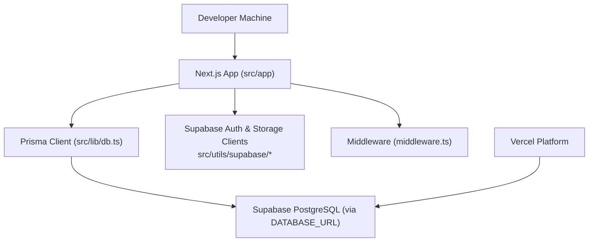
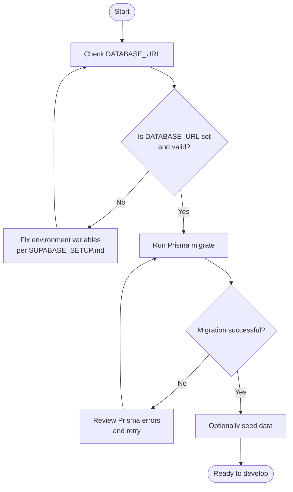
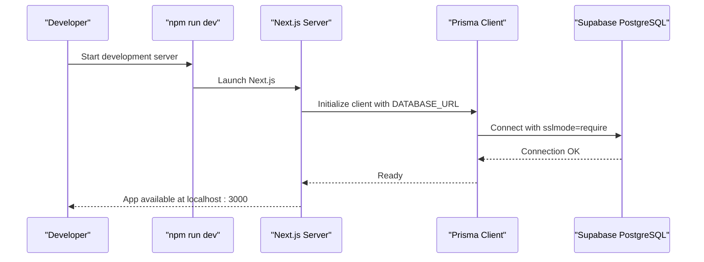
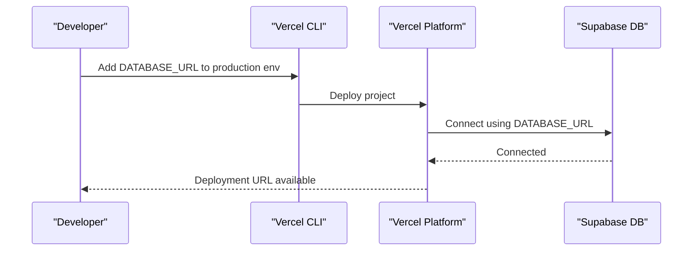
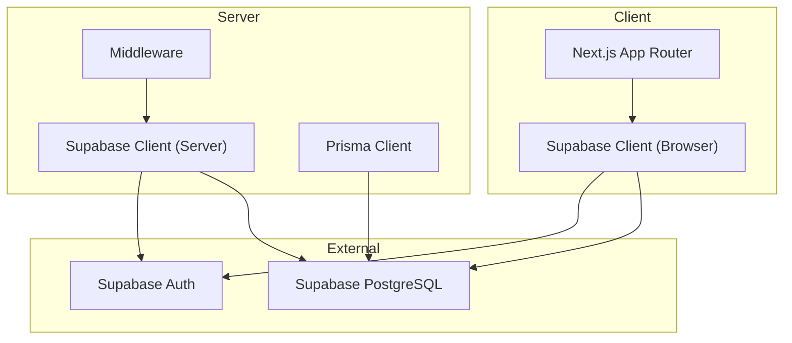

# Getting Started

<cite>
**Referenced Files in This Document**
- [README.md](file://README.md)
- [SUPABASE_SETUP.md](file://SUPABASE_SETUP.md)
- [SUPABASE_INTEGRATION_COMPLETE.md](file://SUPABASE_INTEGRATION_COMPLETE.md)
- [package.json](file://package.json)
- [prisma/schema.prisma](file://prisma/schema.prisma)
- [src/lib/db.ts](file://src/lib/db.ts)
- [.env.example](file://.env.example)
- [scripts/setup-db.ts](file://scripts/setup-db.ts)
- [src/utils/supabase/client.ts](file://src/utils/supabase/client.ts)
- [src/utils/supabase/server.ts](file://src/utils/supabase/server.ts)
- [middleware.ts](file://middleware.ts)
- [next.config.mjs](file://next.config.mjs)
- [prisma/seed.ts](file://prisma/seed.ts)
- [VERCEL_SUPABASE_MCP_GUIDE.md](file://VERCEL_SUPABASE_MCP_GUIDE.md)
</cite>

## Table of Contents
1. [Introduction](#introduction)
2. [Prerequisites](#prerequisites)
3. [Project Structure Overview](#project-structure-overview)
4. [Step-by-Step Setup](#step-by-step-setup)
5. [Environment Variables](#environment-variables)
6. [Database Migration and Seeding](#database-migration-and-seeding)
7. [Running the Development Server](#running-the-development-server)
8. [First-Time Deployment](#first-time-deployment)
9. [Verification Checklist](#verification-checklist)
10. [Troubleshooting Guide](#troubleshooting-guide)
11. [Architecture Overview](#architecture-overview)
12. [Conclusion](#conclusion)

## Introduction
This guide helps you get the recall application up and running quickly. It covers prerequisites, Supabase setup, environment configuration, database migrations, local development, and first-time deployment. The project is a Next.js 14 application using Prisma with a PostgreSQL database (via Supabase), AI-powered PDF processing, and a modern UI.

## Prerequisites
Before starting, ensure you have:
- Node.js installed (LTS recommended)
- Git for version control
- A Supabase account and project (free tier sufficient)
- A Vercel account for deployment (optional but recommended)
- Basic familiarity with the command line and npm

## Project Structure Overview
The application follows a standard Next.js 14 App Router structure with:
- Application pages and API routes under src/app
- Shared components under src/components
- Utilities for Supabase client creation under src/utils/supabase
- Database configuration via Prisma in prisma/schema.prisma
- Environment variables defined in .env.example

**Diagram sources**
- [src/lib/db.ts:1-68](file://src/lib/db.ts#L1-L68)
- [prisma/schema.prisma:1-51](file://prisma/schema.prisma#L1-L51)
- [src/utils/supabase/client.ts:1-11](file://src/utils/supabase/client.ts#L1-L11)
- [src/utils/supabase/server.ts:1-29](file://src/utils/supabase/server.ts#L1-L29)
- [middleware.ts:1-22](file://middleware.ts#L1-L22)

**Section sources**
- [README.md:9-16](file://README.md#L9-L16)
- [prisma/schema.prisma:1-51](file://prisma/schema.prisma#L1-L51)

## Step-by-Step Setup
Follow these steps to prepare your environment and launch the app.

### 1. Clone the repository
- Use Git to clone the repository and navigate into the project directory.

**Section sources**
- [README.md:26-30](file://README.md#L26-L30)

### 2. Install dependencies
- Run the package manager install command to fetch all required packages.

**Section sources**
- [README.md:32-35](file://README.md#L32-L35)
- [package.json:5-14](file://package.json#L5-L14)

### 3. Configure Supabase database
- Create a free Supabase PostgreSQL project and obtain the connection string.
- Set the DATABASE_URL in your local environment file.
- For Vercel production, add DATABASE_URL as an environment variable.

**Section sources**
- [SUPABASE_SETUP.md:8-64](file://SUPABASE_SETUP.md#L8-L64)
- [SUPABASE_INTEGRATION_COMPLETE.md:30-64](file://SUPABASE_INTEGRATION_COMPLETE.md#L30-L64)

### 4. Configure Supabase client variables
- Set NEXT_PUBLIC_SUPABASE_URL and NEXT_PUBLIC_SUPABASE_PUBLISHABLE_KEY in your environment.
- These are used by the Supabase client utilities for browser and server components.

**Section sources**
- [.env.example:1-8](file://.env.example#L1-L8)
- [src/utils/supabase/client.ts:3-10](file://src/utils/supabase/client.ts#L3-L10)
- [src/utils/supabase/server.ts:4-11](file://src/utils/supabase/server.ts#L4-L11)

### 5. Prepare Prisma for PostgreSQL
- The schema is already configured for PostgreSQL via the datasource URL.
- Ensure DATABASE_URL points to your Supabase PostgreSQL instance.

**Section sources**
- [prisma/schema.prisma:1-4](file://prisma/schema.prisma#L1-L4)

### 6. Run migrations
- Apply Prisma migrations to create tables in your database.

**Section sources**
- [README.md:49-52](file://README.md#L49-L52)
- [package.json:11-11](file://package.json#L11-L11)

### 7. Seed the database (optional)
- Optionally seed the database with sample data to explore features immediately.

**Section sources**
- [package.json:12-12](file://package.json#L12-L12)
- [prisma/seed.ts:1-332](file://prisma/seed.ts#L1-L332)

## Environment Variables
Configure the following environment variables for local and production runs.

- DATABASE_URL: Supabase PostgreSQL connection string (required)
- NEXT_PUBLIC_SUPABASE_URL: Supabase project URL (required)
- NEXT_PUBLIC_SUPABASE_PUBLISHABLE_KEY: Supabase publishable key (required)
- OPENROUTER_API_KEY: API key for OpenRouter (required for AI features)
- SUPABASE_ACCESS_TOKEN and SUPABASE_PROJECT_REF: For local MCP tooling (optional)
- VERCEL_TOKEN: For automated deployments (optional)

Notes:
- On production platforms, prefer using platform-specific environment variables (e.g., POSTGRES_PRISMA_URL) as the Prisma client selects the most appropriate URL automatically.
- The Prisma client enforces sslmode=require for serverless environments.

**Section sources**
- [.env.example:1-8](file://.env.example#L1-L8)
- [src/lib/db.ts:8-47](file://src/lib/db.ts#L8-L47)
- [src/lib/db.ts:51-63](file://src/lib/db.ts#L51-L63)

## Database Migration and Seeding
- Migrations: Apply Prisma migrations to create tables and indexes.
- Seeding: Optionally populate the database with sample decks, cards, and review logs.

**Diagram sources**
- [SUPABASE_SETUP.md:56-64](file://SUPABASE_SETUP.md#L56-L64)
- [package.json:11-12](file://package.json#L11-L12)
- [prisma/seed.ts:1-332](file://prisma/seed.ts#L1-L332)

**Section sources**
- [README.md:49-52](file://README.md#L49-L52)
- [package.json:11-12](file://package.json#L11-L12)
- [prisma/seed.ts:1-332](file://prisma/seed.ts#L1-L332)

## Running the Development Server
- Start the Next.js development server.
- The app will be available at http://localhost:3000 by default.

**Diagram sources**
- [package.json:7-7](file://package.json#L7-L7)
- [src/lib/db.ts:49-63](file://src/lib/db.ts#L49-L63)

**Section sources**
- [README.md:54-57](file://README.md#L54-L57)
- [package.json:7-7](file://package.json#L7-L7)

## First-Time Deployment
- Set DATABASE_URL in Vercel production environment.
- Build and deploy the application.
- Verify the deployed site and database connectivity.

**Diagram sources**
- [SUPABASE_SETUP.md:48-64](file://SUPABASE_SETUP.md#L48-L64)
- [scripts/setup-db.ts:32-50](file://scripts/setup-db.ts#L32-L50)

**Section sources**
- [README.md:59-67](file://README.md#L59-L67)
- [SUPABASE_SETUP.md:48-64](file://SUPABASE_SETUP.md#L48-L64)
- [scripts/setup-db.ts:1-58](file://scripts/setup-db.ts#L1-L58)

## Verification Checklist
- Local development
  - App starts without errors on http://localhost:3000
  - Decks and cards load without database errors
- Database
  - Prisma migrations applied successfully
  - Sample data present (if seeded)
- Supabase
  - DATABASE_URL connects to your Supabase project
  - Supabase Auth and Storage clients initialize with NEXT_PUBLIC_SUPABASE_URL and NEXT_PUBLIC_SUPABASE_PUBLISHABLE_KEY
- Middleware
  - Session management works via middleware
- Production
  - Vercel environment variables set correctly
  - Deployment succeeds and serves the app

**Section sources**
- [README.md:18-22](file://README.md#L18-L22)
- [src/utils/supabase/client.ts:3-10](file://src/utils/supabase/client.ts#L3-L10)
- [src/utils/supabase/server.ts:4-11](file://src/utils/supabase/server.ts#L4-L11)
- [middleware.ts:4-7](file://middleware.ts#L4-L7)

## Troubleshooting Guide
Common issues and resolutions:

- Database connection failures
  - Ensure DATABASE_URL is set and includes the correct password
  - Confirm the Supabase project is running and reachable
- Migration errors
  - Run migrations again to create missing tables
  - Verify Prisma schema matches your database state
- Auth not working
  - Clear browser cookies and restart the development server
- PDF processing errors
  - The server-side PDF parsing library is marked external in Webpack; ensure it runs on the server and not in the browser bundle
- Vercel deployment issues
  - Confirm DATABASE_URL is set in Vercel production environment
  - Re-run the deployment after fixing environment variables

**Section sources**
- [SUPABASE_SETUP.md:72-93](file://SUPABASE_SETUP.md#L72-L93)
- [SUPABASE_INTEGRATION_COMPLETE.md:115-128](file://SUPABASE_INTEGRATION_COMPLETE.md#L115-L128)
- [next.config.mjs:5-10](file://next.config.mjs#L5-L10)

## Architecture Overview
The application integrates Next.js, Prisma, and Supabase with Supabase Auth and Storage clients. Middleware manages sessions, and environment variables drive client configuration.

**Diagram sources**
- [src/utils/supabase/client.ts:1-11](file://src/utils/supabase/client.ts#L1-L11)
- [src/utils/supabase/server.ts:1-29](file://src/utils/supabase/server.ts#L1-L29)
- [middleware.ts:1-22](file://middleware.ts#L1-L22)
- [src/lib/db.ts:1-68](file://src/lib/db.ts#L1-L68)

**Section sources**
- [README.md:9-16](file://README.md#L9-L16)
- [src/lib/db.ts:1-68](file://src/lib/db.ts#L1-L68)

## Conclusion
You now have the foundation to run the recall application locally, connect it to Supabase, apply migrations, and deploy to Vercel. Use the verification checklist to confirm everything is working, and consult the troubleshooting section if you encounter issues. For advanced workflows, consider integrating the Vercel and Supabase MCP tools as described in the project documentation.