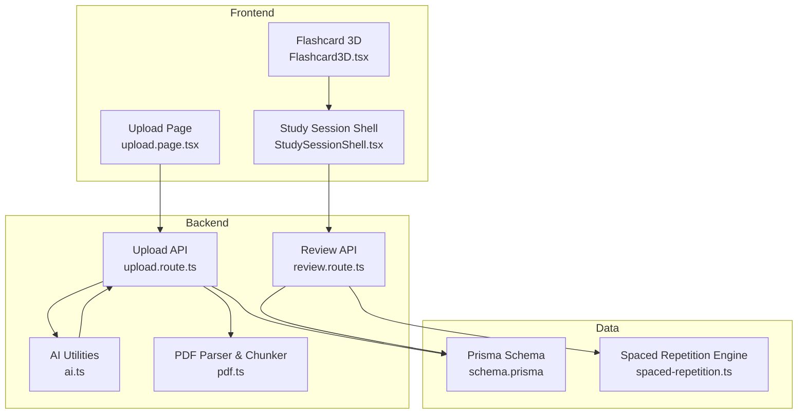
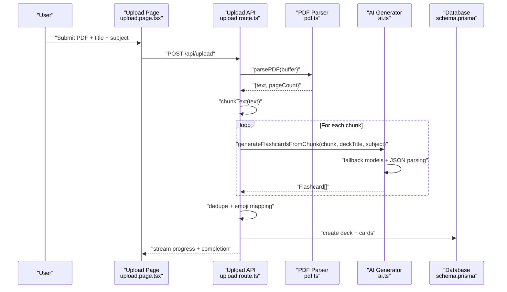
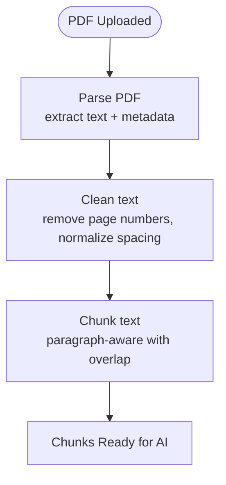
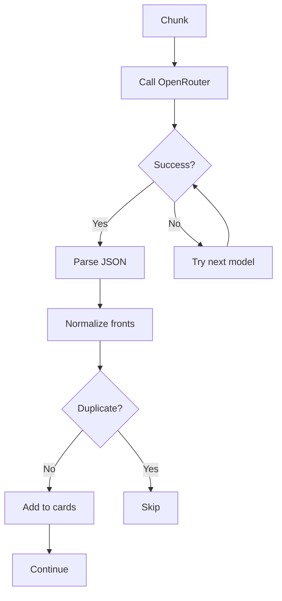
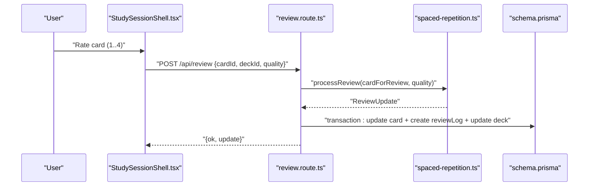
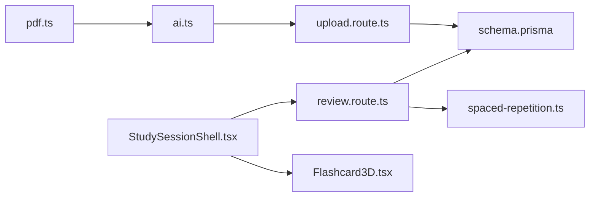
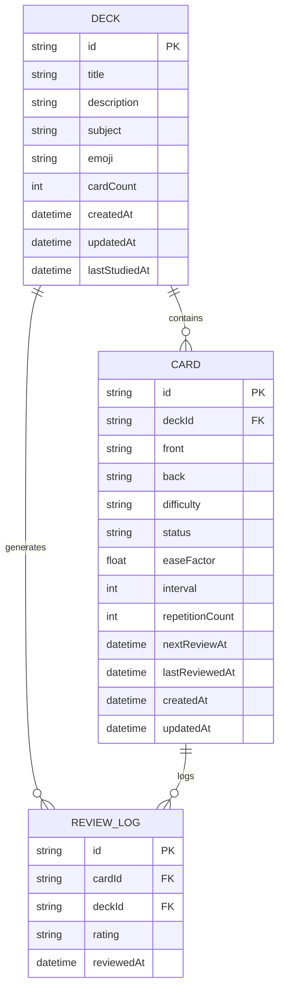

# AI-Powered Flashcard Generation

<cite>
**Referenced Files in This Document**
- [ai.ts](file://src/lib/ai.ts)
- [pdf.ts](file://src/lib/pdf.ts)
- [upload.route.ts](file://src/app/api/upload/route.ts)
- [review.route.ts](file://src/app/api/review/route.ts)
- [spaced-repetition.ts](file://src/lib/spaced-repetition.ts)
- [StudySessionShell.tsx](file://src/components/flashcard/StudySessionShell.tsx)
- [Flashcard3D.tsx](file://src/components/flashcard/Flashcard3D.tsx)
- [upload.page.tsx](file://src/app/upload/page.tsx)
- [constants.ts](file://src/lib/constants.ts)
- [schema.prisma](file://prisma/schema.prisma)
</cite>

## Table of Contents
1. [Introduction](#introduction)
2. [Project Structure](#project-structure)
3. [Core Components](#core-components)
4. [Architecture Overview](#architecture-overview)
5. [Detailed Component Analysis](#detailed-component-analysis)
6. [Dependency Analysis](#dependency-analysis)
7. [Performance Considerations](#performance-considerations)
8. [Troubleshooting Guide](#troubleshooting-guide)
9. [Conclusion](#conclusion)
10. [Appendices](#appendices)

## Introduction
This document explains the AI-powered flashcard generation system built on OpenAI/OpenRouter integration and a robust content processing pipeline. It covers prompt engineering, system prompts, content categorization, chunk processing, duplicate detection, quality filtering, subject classification, emoji mapping, content validation, model selection and fallbacks, rate limiting, and integration with the spaced repetition system. It also provides practical guidance for optimizing prompts across subjects and content types, and outlines how generated content feeds into the learning workflow.

## Project Structure
The system spans frontend upload UI, backend APIs, AI generation utilities, PDF parsing and chunking, and the spaced repetition engine. The Prisma schema defines decks, cards, and review logs.

**Diagram sources**
- [upload.page.tsx:1-504](file://src/app/upload/page.tsx#L1-L504)
- [upload.route.ts:1-298](file://src/app/api/upload/route.ts#L1-L298)
- [pdf.ts:1-130](file://src/lib/pdf.ts#L1-L130)
- [ai.ts:1-233](file://src/lib/ai.ts#L1-L233)
- [review.route.ts:1-76](file://src/app/api/review/route.ts#L1-L76)
- [spaced-repetition.ts:1-141](file://src/lib/spaced-repetition.ts#L1-L141)
- [schema.prisma:1-51](file://prisma/schema.prisma#L1-L51)

**Section sources**
- [upload.page.tsx:1-504](file://src/app/upload/page.tsx#L1-L504)
- [upload.route.ts:1-298](file://src/app/api/upload/route.ts#L1-L298)
- [pdf.ts:1-130](file://src/lib/pdf.ts#L1-L130)
- [ai.ts:1-233](file://src/lib/ai.ts#L1-L233)
- [review.route.ts:1-76](file://src/app/api/review/route.ts#L1-L76)
- [spaced-repetition.ts:1-141](file://src/lib/spaced-repetition.ts#L1-L141)
- [schema.prisma:1-51](file://prisma/schema.prisma#L1-L51)

## Core Components
- AI generation and deduplication pipeline: orchestrates chunked processing, model fallbacks, JSON parsing, and duplicate removal.
- PDF parsing and chunking: extracts clean text and splits into overlapping chunks optimized for AI consumption.
- Spaced repetition engine: implements SM-2 with review updates and session queuing.
- Upload API: streams progress, validates inputs, persists decks and cards, and handles errors.
- Study UI: interactive 3D flashcard review with keyboard controls and rating options.

**Section sources**
- [ai.ts:53-153](file://src/lib/ai.ts#L53-L153)
- [pdf.ts:85-129](file://src/lib/pdf.ts#L85-L129)
- [spaced-repetition.ts:29-104](file://src/lib/spaced-repetition.ts#L29-L104)
- [upload.route.ts:86-297](file://src/app/api/upload/route.ts#L86-L297)
- [StudySessionShell.tsx:68-125](file://src/components/flashcard/StudySessionShell.tsx#L68-L125)

## Architecture Overview
The end-to-end flow:
- User uploads a PDF via the upload page.
- Backend parses the PDF, chunks the text, and streams progress.
- For each chunk, the system queries OpenRouter with a curated system prompt and user context.
- Generated cards are deduplicated and persisted to the database as a new deck.
- Users study via the interactive session shell, which updates card states using the SM-2 algorithm.

**Diagram sources**
- [upload.page.tsx:84-177](file://src/app/upload/page.tsx#L84-L177)
- [upload.route.ts:169-286](file://src/app/api/upload/route.ts#L169-L286)
- [pdf.ts:14-79](file://src/lib/pdf.ts#L14-L79)
- [pdf.ts:85-129](file://src/lib/pdf.ts#L85-L129)
- [ai.ts:76-153](file://src/lib/ai.ts#L76-L153)
- [schema.prisma:10-40](file://prisma/schema.prisma#L10-L40)

## Detailed Component Analysis

### Prompt Engineering and System Prompts
- System prompt instructs the model to focus on deep understanding and long-term retention, covering multiple card categories (core concepts, definitions, relationships, edge cases, worked examples, application, common mistakes).
- Quality rules emphasize clear questions, concise yet complete answers, single-concept-per-card, varied question formats, mathematical notation hygiene, and difficulty assignment.
- The prompt enforces a strict JSON output format to simplify parsing.

Key prompt characteristics:
- Category coverage: ensures comprehensive recall across cognitive levels.
- Quality constraints: improves educational value and readability.
- Output contract: JSON envelope for robust parsing.

**Section sources**
- [ai.ts:53-74](file://src/lib/ai.ts#L53-L74)

### Content Processing Pipeline
- PDF parsing:
  - Extracts text respecting line breaks and removes page numbers and standalone digits.
  - Collapses excessive newlines and trims whitespace.
- Chunking:
  - Splits at paragraph boundaries with overlap to preserve context.
  - Enforces minimum chunk size and handles oversized paragraphs by hard splitting.

**Diagram sources**
- [pdf.ts:14-79](file://src/lib/pdf.ts#L14-L79)
- [pdf.ts:85-129](file://src/lib/pdf.ts#L85-L129)

**Section sources**
- [pdf.ts:14-79](file://src/lib/pdf.ts#L14-L79)
- [pdf.ts:85-129](file://src/lib/pdf.ts#L85-L129)

### Flashcard Generation and Deduplication
- Per-chunk generation:
  - Sends a structured user message including subject, deck title, chunk index, and content.
  - Iterates through fallback models until successful completion.
  - Parses JSON with robust fallbacks (strip code fences, extract first JSON block).
- Duplicate detection:
  - Normalizes front text (lowercase, remove punctuation, trim length) to detect near-duplicates across chunks.
  - Deduplicates incrementally during collection and once more post-generation.

**Diagram sources**
- [ai.ts:76-153](file://src/lib/ai.ts#L76-L153)
- [ai.ts:155-163](file://src/lib/ai.ts#L155-L163)

**Section sources**
- [ai.ts:76-153](file://src/lib/ai.ts#L76-L153)
- [ai.ts:155-163](file://src/lib/ai.ts#L155-L163)

### Subject Classification and Emoji Mapping
- Subject-to-emoji mapping supports common subjects and falls back to a brain emoji for others.
- The upload endpoint derives an emoji from the selected subject and stores it with the deck.

**Section sources**
- [ai.ts:41-50](file://src/lib/ai.ts#L41-L50)
- [upload.route.ts:229-230](file://src/app/api/upload/route.ts#L229-L230)
- [constants.ts:10-17](file://src/lib/constants.ts#L10-L17)

### Content Validation and Error Handling
- Upload API validates:
  - Presence of file, type, size, and title.
  - Environment variables for database and OpenRouter keys.
- Robust error mapping:
  - API key issues, rate limits, model unavailability, database connectivity, and generic failures.
- Streaming progress:
  - Parses JSON lines from the server to update UI in real time.

**Section sources**
- [upload.route.ts:11-63](file://src/app/api/upload/route.ts#L11-L63)
- [upload.route.ts:132-158](file://src/app/api/upload/route.ts#L132-L158)
- [upload.page.tsx:115-169](file://src/app/upload/page.tsx#L115-L169)

### Model Selection, Fallback Strategies, and Rate Limiting
- Model fallback:
  - Primary model followed by secondary model to improve reliability on free tiers.
- Request pacing:
  - Delays between chunk requests to mitigate free-tier rate limits.
- IP-based rate limiting:
  - Simple sliding-window limiter to cap concurrent upload requests per IP.

**Section sources**
- [ai.ts:92-120](file://src/lib/ai.ts#L92-L120)
- [ai.ts:225-229](file://src/lib/ai.ts#L225-L229)
- [upload.route.ts:70-84](file://src/app/api/upload/route.ts#L70-L84)

### Integration with the Spaced Repetition System
- Database schema:
  - Decks, Cards, and ReviewLogs define the persistence layer.
- Review API:
  - Accepts cardId, deckId, and quality (0–5).
  - Loads card, computes SM-2 update, and writes atomic transaction including card update and review log.
- Study session:
  - Queues overdue and new cards, supports keyboard ratings, and updates card state after submission.

**Diagram sources**
- [StudySessionShell.tsx:68-125](file://src/components/flashcard/StudySessionShell.tsx#L68-L125)
- [review.route.ts:5-76](file://src/app/api/review/route.ts#L5-L76)
- [spaced-repetition.ts:29-76](file://src/lib/spaced-repetition.ts#L29-L76)
- [schema.prisma:24-50](file://prisma/schema.prisma#L24-L50)

**Section sources**
- [review.route.ts:5-76](file://src/app/api/review/route.ts#L5-L76)
- [spaced-repetition.ts:29-104](file://src/lib/spaced-repetition.ts#L29-L104)
- [schema.prisma:24-50](file://prisma/schema.prisma#L24-L50)

### Learning Workflow and UI
- Upload page:
  - Drag-and-drop PDF upload, subject selection, and streaming progress.
- Study session:
  - 3D flip animation, keyboard shortcuts, rating buttons, and completion statistics.
- Flashcard component:
  - Difficulty badges and visual feedback.

**Section sources**
- [upload.page.tsx:34-177](file://src/app/upload/page.tsx#L34-L177)
- [StudySessionShell.tsx:42-430](file://src/components/flashcard/StudySessionShell.tsx#L42-L430)
- [Flashcard3D.tsx:17-113](file://src/components/flashcard/Flashcard3D.tsx#L17-L113)

## Dependency Analysis
- AI utilities depend on OpenRouter SDK and export:
  - Flashcard type, progress callback type, subject-to-emoji mapping, chunk generation, and full PDF pipeline.
- Upload API depends on:
  - PDF parser, chunker, AI utilities, and database client.
- Study session depends on:
  - Spaced repetition utilities and rating options.
- Database schema ties decks, cards, and review logs together.

**Diagram sources**
- [pdf.ts:1-130](file://src/lib/pdf.ts#L1-L130)
- [ai.ts:1-233](file://src/lib/ai.ts#L1-L233)
- [upload.route.ts:1-298](file://src/app/api/upload/route.ts#L1-L298)
- [review.route.ts:1-76](file://src/app/api/review/route.ts#L1-L76)
- [spaced-repetition.ts:1-141](file://src/lib/spaced-repetition.ts#L1-L141)
- [StudySessionShell.tsx:1-430](file://src/components/flashcard/StudySessionShell.tsx#L1-L430)
- [Flashcard3D.tsx:1-113](file://src/components/flashcard/Flashcard3D.tsx#L1-L113)
- [schema.prisma:1-51](file://prisma/schema.prisma#L1-L51)

**Section sources**
- [ai.ts:1-233](file://src/lib/ai.ts#L1-L233)
- [upload.route.ts:1-298](file://src/app/api/upload/route.ts#L1-L298)
- [review.route.ts:1-76](file://src/app/api/review/route.ts#L1-L76)
- [spaced-repetition.ts:1-141](file://src/lib/spaced-repetition.ts#L1-L141)
- [schema.prisma:1-51](file://prisma/schema.prisma#L1-L51)

## Performance Considerations
- Chunk sizing and overlap:
  - Balances context preservation with token limits; tune maxChunkSize and overlap for content density.
- Model fallback:
  - Improves throughput and resilience on free tiers; consider staggering retries and exponential backoff for production deployments.
- Request pacing:
  - Delays between chunk requests reduce rate-limit risk; adjust delays based on provider quotas.
- JSON parsing robustness:
  - Strips code fences and extracts first JSON block to handle LLM output variations.
- UI streaming:
  - Server-sent JSON lines keep the UI responsive during long generations.

[No sources needed since this section provides general guidance]

## Troubleshooting Guide
Common issues and resolutions:
- Missing environment variables:
  - OPENROUTER_API_KEY or DATABASE_URL cause immediate failure with clear messages.
- Rate limit errors:
  - Free-tier throttling manifests as rate limit or 429-like errors; wait and retry.
  - IP-based rate limiting caps uploads per minute.
- Model unavailability:
  - Model not found/not available errors indicate temporary outages; retry later.
- Invalid API key:
  - 401/incorrect key errors require credential verification.
- Overloaded AI service:
  - 5xx/overloaded responses suggest provider-side issues; retry after cooldown.
- PDF quality:
  - Scanned/image-based PDFs produce insufficient text; prompt users to supply text-based PDFs.

**Section sources**
- [upload.route.ts:11-63](file://src/app/api/upload/route.ts#L11-L63)
- [upload.route.ts:108-106](file://src/app/api/upload/route.ts#L108-L106)
- [upload.page.tsx:346-348](file://src/app/upload/page.tsx#L346-L348)

## Conclusion
The system combines a strong educational prompt, careful content preprocessing, resilient AI generation with fallbacks, and a robust spaced repetition workflow. Together, these components deliver a reliable, scalable, and effective flashcard generation and study experience.

[No sources needed since this section summarizes without analyzing specific files]

## Appendices

### Prompt Variations and Customization Options
- Subject-specific emphasis:
  - Add domain-specific vocabulary or notation conventions to the system prompt.
- Content-type tuning:
  - For highly mathematical content, emphasize symbolic notation and step-by-step derivations.
  - For historical content, prioritize causality, timelines, and comparative analysis.
- Difficulty targeting:
  - Adjust temperature and max_tokens to encourage deeper reasoning for harder cards.
- Output formatting:
  - Keep the JSON envelope strict to minimize parsing errors.

[No sources needed since this section provides general guidance]

### Examples of Generated Flashcards
- Example categories covered by the system prompt:
  - Definitions, relationships, edge cases, worked examples, applications, and common mistakes.
- Front/back structure:
  - Clear, specific questions on the front; concise, complete answers on the back with brief explanations.

[No sources needed since this section provides general guidance]

### Data Model Overview

**Diagram sources**
- [schema.prisma:10-50](file://prisma/schema.prisma#L10-L50)