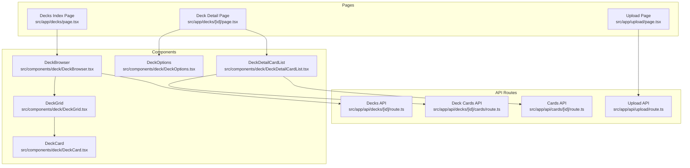
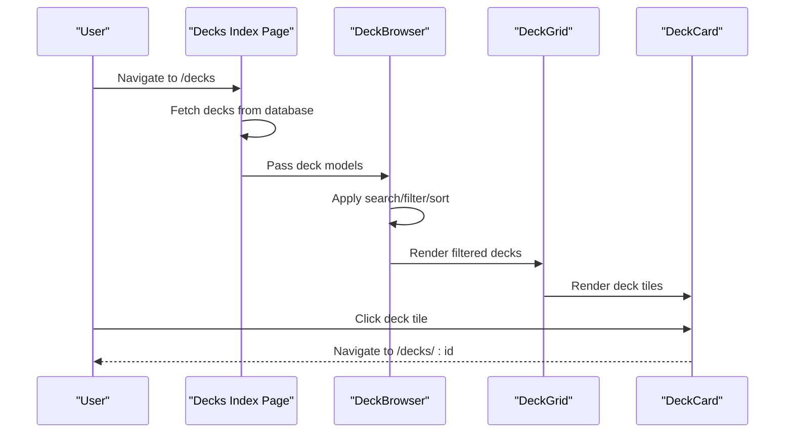
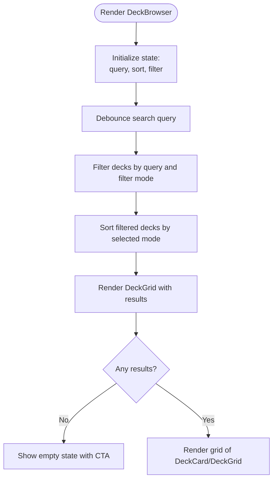
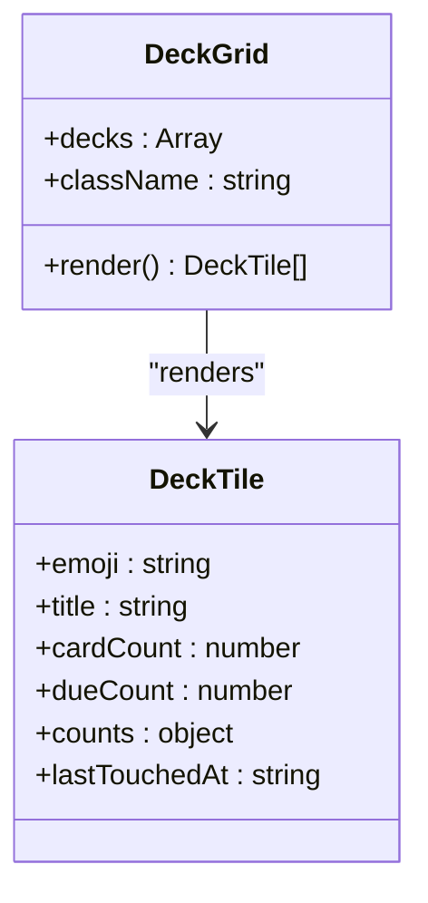
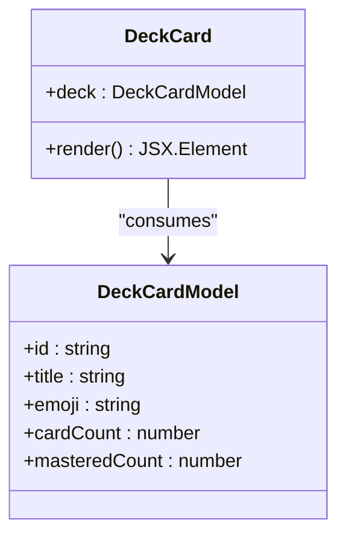
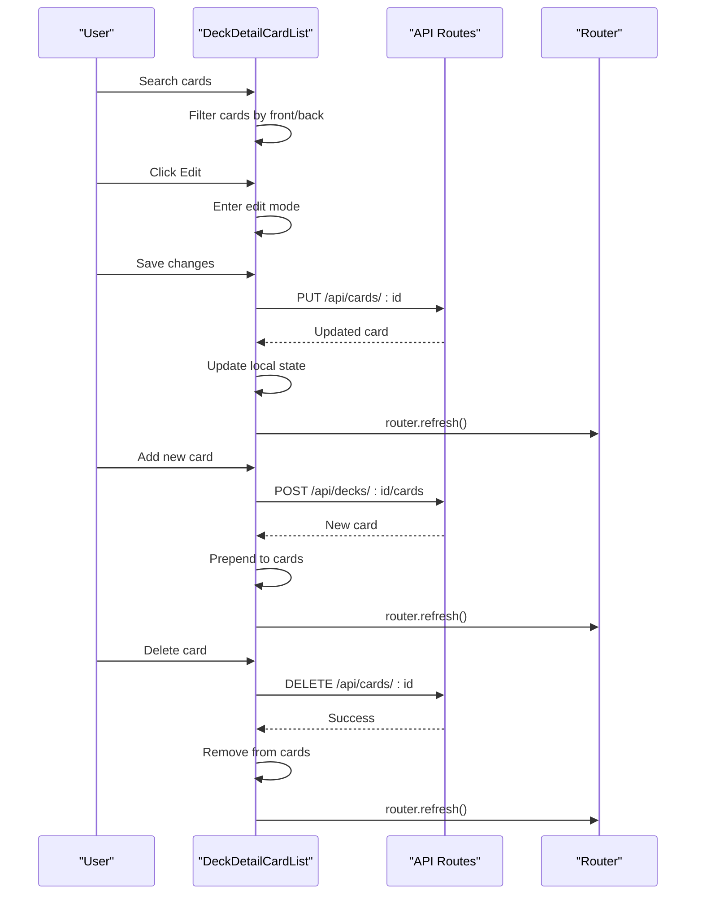
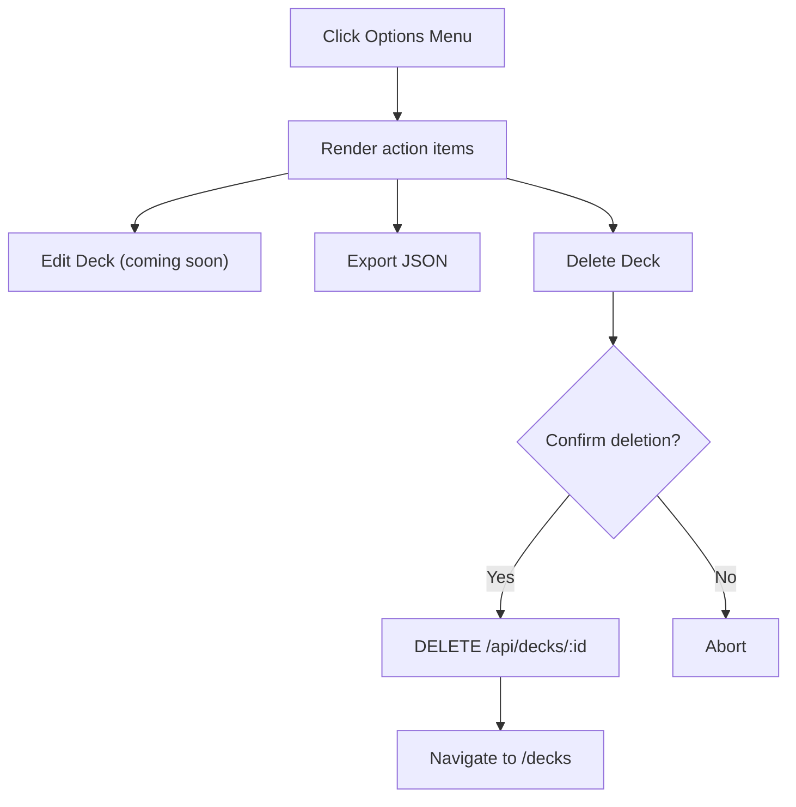
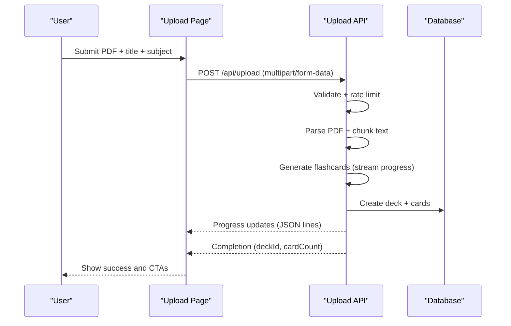
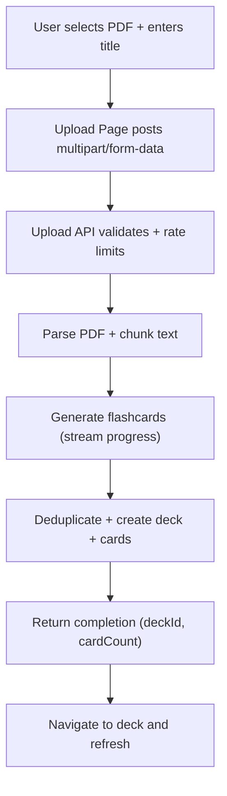

# Deck Management System

<cite>
**Referenced Files in This Document**
- [DeckBrowser.tsx](file://src/components/deck/DeckBrowser.tsx)
- [DeckCard.tsx](file://src/components/deck/DeckCard.tsx)
- [DeckDetailCardList.tsx](file://src/components/deck/DeckDetailCardList.tsx)
- [DeckGrid.tsx](file://src/components/deck/DeckGrid.tsx)
- [DeckOptions.tsx](file://src/components/deck/DeckOptions.tsx)
- [page.tsx (Decks index)](file://src/app/decks/page.tsx)
- [page.tsx (Deck detail)](file://src/app/decks/[id]/page.tsx)
- [route.ts (Decks API)](file://src/app/api/decks/[id]/route.ts)
- [route.ts (Deck cards API)](file://src/app/api/decks/[id]/cards/row.ts)
- [route.ts (Cards API)](file://src/app/api/cards/[id]/route.ts)
- [route.ts (Upload API)](file://src/app/api/upload/route.ts)
- [page.tsx (Upload)](file://src/app/upload/page.tsx)
- [constants.ts](file://src/lib/constants.ts)
- [utils.ts](file://src/lib/utils.ts)
</cite>

## Table of Contents
1. [Introduction](#introduction)
2. [Project Structure](#project-structure)
3. [Core Components](#core-components)
4. [Architecture Overview](#architecture-overview)
5. [Detailed Component Analysis](#detailed-component-analysis)
6. [API Endpoints and Data Flow](#api-endpoints-and-data-flow)
7. [Search and Filtering Capabilities](#search-and-filtering-capabilities)
8. [Visual Indicators and Interactive Elements](#visual-indicators-and-interactive-elements)
9. [Integration with Upload System](#integration-with-upload-system)
10. [Organization Strategies and Best Practices](#organization-strategies-and-best-practices)
11. [Performance Considerations](#performance-considerations)
12. [Troubleshooting Guide](#troubleshooting-guide)
13. [Conclusion](#conclusion)

## Introduction
This document provides comprehensive technical documentation for the deck management system, focusing on deck organization, card management, and content browsing. It covers the DeckBrowser component, deck listing functionality, search/filter capabilities, the DeckCard component implementation, visual indicators, interactive elements, and the DeckDetailCardList for individual deck management and bulk operations. It also documents the integration with the upload system, automatic subject detection, emoji-based visualization, API endpoints for deck operations, data synchronization, and practical guidance for organizing study materials and optimizing discovery workflows.

## Project Structure
The deck management system is organized around three primary areas:
- UI Components: DeckBrowser, DeckCard, DeckDetailCardList, DeckGrid, DeckOptions
- Pages: Decks index page and individual deck detail page
- APIs: Decks, cards, and upload endpoints

**Diagram sources**
- [page.tsx (Decks index):1-89](file://src/app/decks/page.tsx#L1-L89)
- [page.tsx (Deck detail):1-206](file://src/app/decks/[id]/page.tsx#L1-L206)
- [page.tsx (Upload):1-504](file://src/app/upload/page.tsx#L1-L504)
- [DeckBrowser.tsx:1-188](file://src/components/deck/DeckBrowser.tsx#L1-L188)
- [DeckGrid.tsx:1-95](file://src/components/deck/DeckGrid.tsx#L1-L95)
- [DeckCard.tsx:1-50](file://src/components/deck/DeckCard.tsx#L1-L50)
- [DeckDetailCardList.tsx:1-358](file://src/components/deck/DeckDetailCardList.tsx#L1-L358)
- [DeckOptions.tsx:1-90](file://src/components/deck/DeckOptions.tsx#L1-L90)
- [route.ts (Decks API):1-43](file://src/app/api/decks/[id]/route.ts#L1-L43)
- [route.ts (Deck cards API):1-40](file://src/app/api/decks/[id]/cards/route.ts#L1-L40)
- [route.ts (Cards API):1-47](file://src/app/api/cards/[id]/route.ts#L1-L47)
- [route.ts (Upload API):1-298](file://src/app/api/upload/route.ts#L1-L298)

**Section sources**
- [page.tsx (Decks index):1-89](file://src/app/decks/page.tsx#L1-L89)
- [page.tsx (Deck detail):1-206](file://src/app/decks/[id]/page.tsx#L1-L206)
- [page.tsx (Upload):1-504](file://src/app/upload/page.tsx#L1-L504)
- [DeckBrowser.tsx:1-188](file://src/components/deck/DeckBrowser.tsx#L1-L188)
- [DeckGrid.tsx:1-95](file://src/components/deck/DeckGrid.tsx#L1-L95)
- [DeckCard.tsx:1-50](file://src/components/deck/DeckCard.tsx#L1-L50)
- [DeckDetailCardList.tsx:1-358](file://src/components/deck/DeckDetailCardList.tsx#L1-L358)
- [DeckOptions.tsx:1-90](file://src/components/deck/DeckOptions.tsx#L1-L90)
- [route.ts (Decks API):1-43](file://src/app/api/decks/[id]/route.ts#L1-L43)
- [route.ts (Deck cards API):1-40](file://src/app/api/decks/[id]/cards/route.ts#L1-L40)
- [route.ts (Cards API):1-47](file://src/app/api/cards/[id]/route.ts#L1-L47)
- [route.ts (Upload API):1-298](file://src/app/api/upload/route.ts#L1-L298)

## Core Components
This section analyzes the primary components that implement deck browsing, filtering, card management, and deck options.

- DeckBrowser: Provides search, filtering, and sorting for deck listings. It computes derived metrics (counts, due counts, last touched) and renders a responsive grid via DeckGrid.
- DeckGrid: Renders deck tiles with emoji, card counts, due indicators, and mastery breakdown bars.
- DeckCard: Minimal deck tile used within grids, displaying emoji, title, card count, and a mastery percentage bar.
- DeckDetailCardList: Manages individual deck card lists with search, expand/collapse, inline editing, adding new cards, and deletion.
- DeckOptions: Dropdown menu for deck actions including export and deletion.

Key implementation patterns:
- Client-side state management with React hooks for search, filters, and editing states.
- Debounced search inputs to optimize filtering performance.
- Responsive grid layouts with motion animations for enhanced UX.
- Real-time UI refresh after CRUD operations using router.refresh().

**Section sources**
- [DeckBrowser.tsx:1-188](file://src/components/deck/DeckBrowser.tsx#L1-L188)
- [DeckGrid.tsx:1-95](file://src/components/deck/DeckGrid.tsx#L1-L95)
- [DeckCard.tsx:1-50](file://src/components/deck/DeckCard.tsx#L1-L50)
- [DeckDetailCardList.tsx:1-358](file://src/components/deck/DeckDetailCardList.tsx#L1-L358)
- [DeckOptions.tsx:1-90](file://src/components/deck/DeckOptions.tsx#L1-L90)

## Architecture Overview
The system follows a Next.js app router architecture with server-rendered pages and client-side interactive components. Data flows from server-side queries to client components, with API routes handling mutations and uploads.

**Diagram sources**
- [page.tsx (Decks index):1-89](file://src/app/decks/page.tsx#L1-L89)
- [DeckBrowser.tsx:1-188](file://src/components/deck/DeckBrowser.tsx#L1-L188)
- [DeckGrid.tsx:1-95](file://src/components/deck/DeckGrid.tsx#L1-L95)
- [DeckCard.tsx:1-50](file://src/components/deck/DeckCard.tsx#L1-L50)

## Detailed Component Analysis

### DeckBrowser Component
DeckBrowser orchestrates the deck listing experience:
- State: query (search), sort mode, filter mode.
- Computed: Debounced query, filtered decks, sorted decks.
- Rendering: Top controls (search input, filter chips, sort selector), empty state, and DeckGrid.

Filter modes:
- All: No filtering.
- Has Due Cards: Only decks with dueCount > 0.
- Recently Studied: Heuristic based on lastTouchedAt within a time window.
- Never Studied: Decks where all card counts sum to new count (no reviews/learning/mastered).

Sorting modes:
- Last Studied (default): Descending by lastTouchedAt.
- Alphabetical: Ascending by title.
- Most Cards: Descending by cardCount.
- Lowest Mastery: Ascending by mastery rate (mastered ratio excluding NEW cards).

**Diagram sources**
- [DeckBrowser.tsx:1-188](file://src/components/deck/DeckBrowser.tsx#L1-L188)

**Section sources**
- [DeckBrowser.tsx:1-188](file://src/components/deck/DeckBrowser.tsx#L1-L188)

### DeckGrid Component
DeckGrid renders deck tiles with:
- Emoji badge and title.
- Card count display.
- Due indicator badge when dueCount > 0.
- Mastery breakdown bar composed of segments for mastered, reviewing, learning, and new.
- Relative "last studied" timestamp.

**Diagram sources**
- [DeckGrid.tsx:1-95](file://src/components/deck/DeckGrid.tsx#L1-L95)

**Section sources**
- [DeckGrid.tsx:1-95](file://src/components/deck/DeckGrid.tsx#L1-L95)

### DeckCard Component
DeckCard provides a compact deck representation:
- Displays emoji and title.
- Shows total card count.
- Visualizes mastery percentage with a horizontal progress bar.
- Hover animations and transitions for enhanced interactivity.

**Diagram sources**
- [DeckCard.tsx:1-50](file://src/components/deck/DeckCard.tsx#L1-L50)

**Section sources**
- [DeckCard.tsx:1-50](file://src/components/deck/DeckCard.tsx#L1-L50)

### DeckDetailCardList Component
DeckDetailCardList manages individual deck card operations:
- State: cards, search, expandedId, editingId, isAdding, newFront/newBack, isSubmitting.
- Features:
  - Search within card front/back content.
  - Expand/collapse card content.
  - Inline edit (front/back) with save/cancel.
  - Add new card with validation.
  - Delete card with confirmation.
  - Toast notifications for user feedback.
  - Refresh navigation after mutations.

API interactions:
- PUT /api/cards/:id for editing a card.
- DELETE /api/cards/:id for deleting a card.
- POST /api/decks/:id/cards for adding a new card.

**Diagram sources**
- [DeckDetailCardList.tsx:1-358](file://src/components/deck/DeckDetailCardList.tsx#L1-L358)
- [route.ts (Deck cards API):1-40](file://src/app/api/decks/[id]/cards/route.ts#L1-L40)
- [route.ts (Cards API):1-47](file://src/app/api/cards/[id]/route.ts#L1-L47)

**Section sources**
- [DeckDetailCardList.tsx:1-358](file://src/components/deck/DeckDetailCardList.tsx#L1-L358)
- [route.ts (Deck cards API):1-40](file://src/app/api/decks/[id]/cards/route.ts#L1-L40)
- [route.ts (Cards API):1-47](file://src/app/api/cards/[id]/route.ts#L1-L47)

### DeckOptions Component
DeckOptions provides deck-level actions:
- Edit deck (placeholder for future modal).
- Export deck as JSON.
- Delete deck with confirmation and network request to /api/decks/:id.

**Diagram sources**
- [DeckOptions.tsx:1-90](file://src/components/deck/DeckOptions.tsx#L1-L90)
- [route.ts (Decks API):1-43](file://src/app/api/decks/[id]/route.ts#L1-L43)

**Section sources**
- [DeckOptions.tsx:1-90](file://src/components/deck/DeckOptions.tsx#L1-L90)
- [route.ts (Decks API):1-43](file://src/app/api/decks/[id]/route.ts#L1-L43)

## API Endpoints and Data Flow
The system exposes REST-like API endpoints for deck and card operations, plus an upload endpoint that streams progress updates.

- Decks
  - PUT /api/decks/[id]: Update deck metadata (title, description, emoji, subject).
  - DELETE /api/decks/[id]: Delete a deck and all associated cards.

- Deck Cards
  - POST /api/decks/[id]/cards: Create a new card in a deck with front/back content.

- Cards
  - PUT /api/cards/[id]: Update card front/back content.
  - DELETE /api/cards/[id]: Delete a card and decrement deck cardCount.

- Upload
  - POST /api/upload: Stream PDF processing, AI generation, deduplication, and deck creation. Returns progress updates and completion status.

**Diagram sources**
- [page.tsx (Upload):1-504](file://src/app/upload/page.tsx#L1-L504)
- [route.ts (Upload API):1-298](file://src/app/api/upload/route.ts#L1-L298)

**Section sources**
- [route.ts (Decks API):1-43](file://src/app/api/decks/[id]/route.ts#L1-L43)
- [route.ts (Deck cards API):1-40](file://src/app/api/decks/[id]/cards/route.ts#L1-L40)
- [route.ts (Cards API):1-47](file://src/app/api/cards/[id]/route.ts#L1-L47)
- [route.ts (Upload API):1-298](file://src/app/api/upload/route.ts#L1-L298)
- [page.tsx (Upload):1-504](file://src/app/upload/page.tsx#L1-L504)

## Search and Filtering Capabilities
DeckBrowser implements robust search and filtering:
- Search: Debounced query applied to deck title and subject fields.
- Filters:
  - Has Due Cards: Requires dueCount > 0.
  - Recently Studied: Uses lastTouchedAt within a time window.
  - Never Studied: All card counts sum to new count (no mastered/learning/review).
- Sorting:
  - Last Studied (default): Descending by lastTouchedAt.
  - Alphabetical: Ascending by title.
  - Most Cards: Descending by cardCount.
  - Lowest Mastery: Ascending by mastered/(total-new) ratio.

DeckGrid augments the listing with:
- Due badges when dueCount > 0.
- Mastery breakdown bars segmented by status categories.

**Section sources**
- [DeckBrowser.tsx:1-188](file://src/components/deck/DeckBrowser.tsx#L1-L188)
- [DeckGrid.tsx:1-95](file://src/components/deck/DeckGrid.tsx#L1-L95)

## Visual Indicators and Interactive Elements
Visual design and interactions:
- Mastery visualization:
  - DeckCard: Horizontal progress bar showing mastery percentage.
  - DeckGrid: Segmented bar for mastered, reviewing, learning, new.
  - Deck detail: Combined mastery breakdown with color-coded segments and percentages.
- Status and difficulty badges:
  - Styled badges for card status (NEW, LEARNING, REVIEW, MASTERED) and difficulty (EASY, MEDIUM, HARD) using constant styles.
- Interactive elements:
  - Hover animations and transitions for deck tiles and cards.
  - Expand/collapse for card content with chevron rotation.
  - Inline editing with save/cancel controls.
  - Toast notifications for operation feedback.

**Section sources**
- [DeckCard.tsx:1-50](file://src/components/deck/DeckCard.tsx#L1-L50)
- [DeckGrid.tsx:1-95](file://src/components/deck/DeckGrid.tsx#L1-L95)
- [DeckDetailCardList.tsx:1-358](file://src/components/deck/DeckDetailCardList.tsx#L1-L358)
- [constants.ts:1-31](file://src/lib/constants.ts#L1-L31)

## Integration with Upload System
The upload system integrates seamlessly with deck management:
- Upload Page collects PDF, title, and optional subject.
- Upload API validates input, parses PDF, chunks text, generates flashcards via AI, deduplicates, and creates a deck with cards.
- Automatic subject detection maps subject to emoji using subjectToEmoji.
- Streaming progress updates allow real-time feedback during generation.
- On completion, the UI navigates to the new deck and triggers a refresh.

**Diagram sources**
- [page.tsx (Upload):1-504](file://src/app/upload/page.tsx#L1-L504)
- [route.ts (Upload API):1-298](file://src/app/api/upload/route.ts#L1-L298)
- [constants.ts:1-31](file://src/lib/constants.ts#L1-L31)

**Section sources**
- [page.tsx (Upload):1-504](file://src/app/upload/page.tsx#L1-L504)
- [route.ts (Upload API):1-298](file://src/app/api/upload/route.ts#L1-L298)
- [constants.ts:1-31](file://src/lib/constants.ts#L1-L31)

## Organization Strategies and Best Practices
Practical guidance for organizing study materials and optimizing discovery workflows:
- Subject categorization:
  - Use the subject dropdown during upload to leverage automatic emoji mapping and categorization.
  - Maintain consistent subject naming to improve search accuracy.
- Emoji-based visualization:
  - Emojis serve as quick visual cues; choose subjects that naturally map to recognizable emojis for intuitive scanning.
- Search and filter workflows:
  - Combine search with filter chips to narrow down relevant decks quickly.
  - Use "Recently Studied" to focus on active decks and "Has Due Cards" to prioritize review.
- Bulk operations:
  - Use DeckDetailCardList to search, edit, and delete cards in bulk.
  - Add new cards in batches to populate decks efficiently.
- Export and backup:
  - Export decks as JSON for backup or migration to other systems.
- Large collection management:
  - Keep titles and subjects descriptive to enhance discoverability.
  - Regularly review mastery breakdowns to identify underperforming decks for re-study or consolidation.

[No sources needed since this section provides general guidance]

## Performance Considerations
Optimization strategies:
- Debounced search: Applied in DeckBrowser and DeckDetailCardList to reduce unnecessary computations.
- Client-side filtering and sorting: Efficient for moderate dataset sizes; consider pagination/server-side filtering for very large collections.
- Motion animations: Lightweight framer-motion usage; keep thresholds minimal for large grids.
- Network efficiency: API endpoints return only necessary fields; upload uses streaming to avoid blocking.
- Database queries: Pages fetch aggregated counts and statuses to minimize downstream computations.

[No sources needed since this section provides general guidance]

## Troubleshooting Guide
Common issues and resolutions:
- Upload failures:
  - Verify OPENROUTER_API_KEY and DATABASE_URL are set in the environment.
  - Check rate limit messages and retry after cooling off.
  - Ensure the PDF is text-based and within size limits.
- Deck loading errors:
  - Confirm DATABASE_URL is correct and reachable.
  - Review server logs for Prisma-related errors.
- Card operations:
  - Validate that both front and back content are provided when adding cards.
  - Confirm network connectivity for API calls; check toast notifications for failure messages.
- Navigation refresh:
  - After edits/deletes/adds, router.refresh() ensures UI reflects server state.

**Section sources**
- [route.ts (Upload API):1-298](file://src/app/api/upload/route.ts#L1-L298)
- [page.tsx (Decks index):1-89](file://src/app/decks/page.tsx#L1-L89)
- [DeckDetailCardList.tsx:1-358](file://src/components/deck/DeckDetailCardList.tsx#L1-L358)

## Conclusion
The deck management system combines server-rendered pages with client-side interactivity to deliver a seamless deck browsing, search, filtering, and card management experience. It integrates tightly with the upload pipeline, enabling rapid generation of study decks with automatic subject detection and emoji visualization. The modular component architecture, robust API endpoints, and thoughtful UX patterns support efficient organization of large study collections and optimized discovery workflows.

[No sources needed since this section summarizes without analyzing specific files]