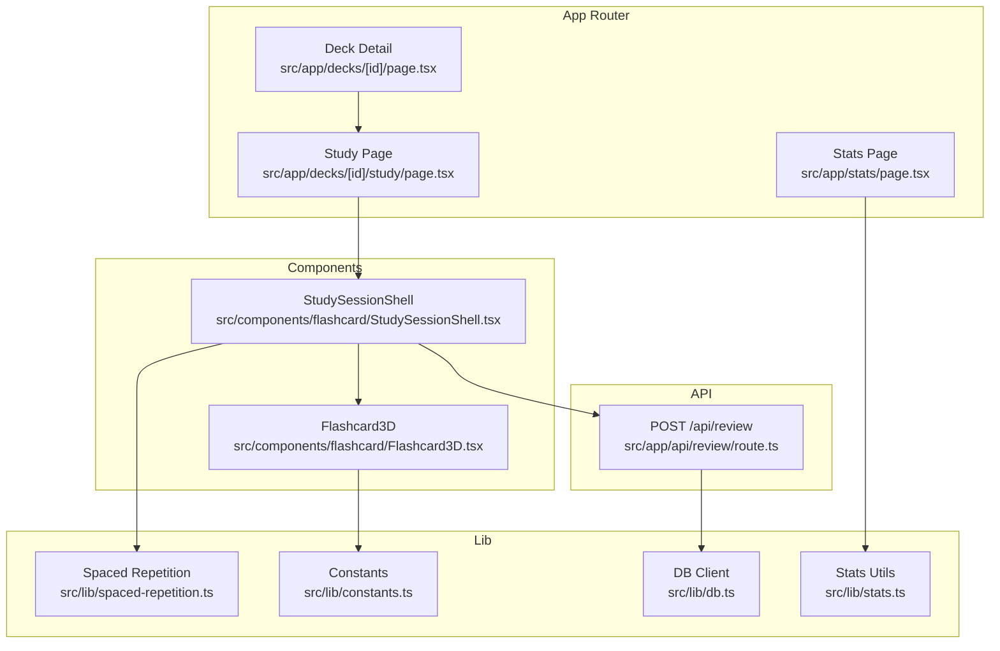
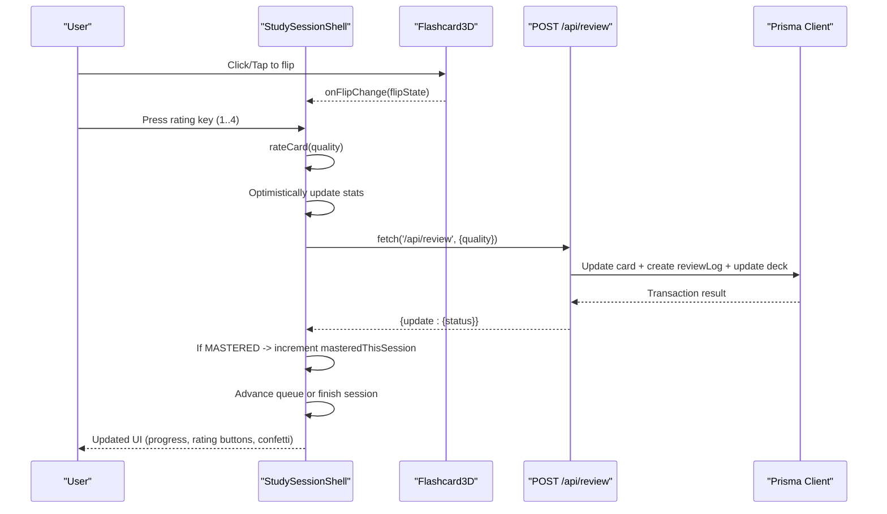
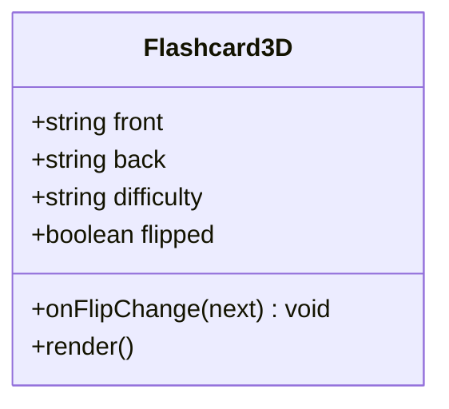
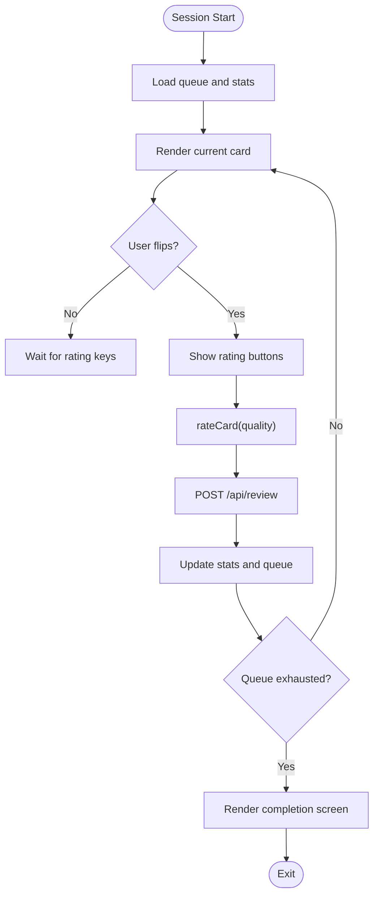
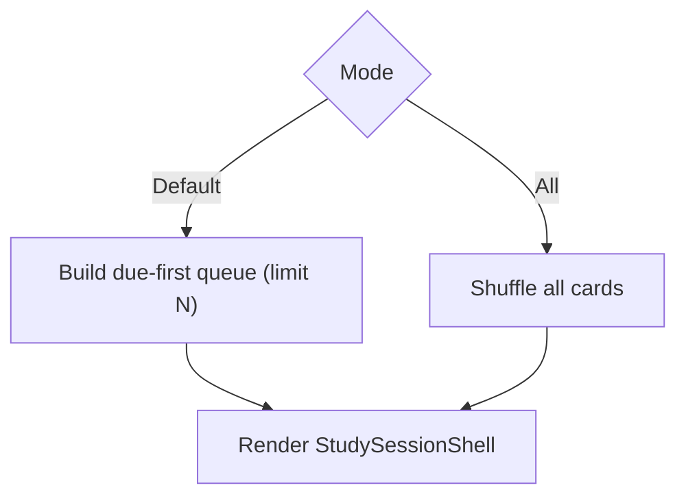
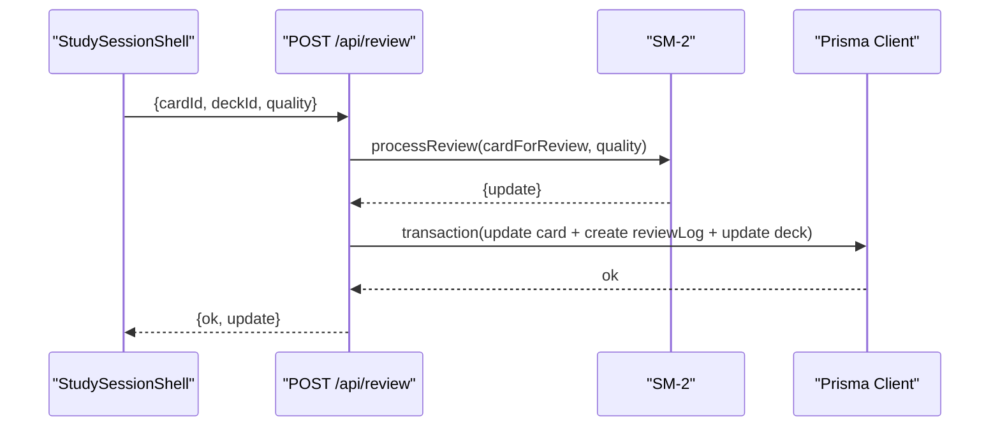
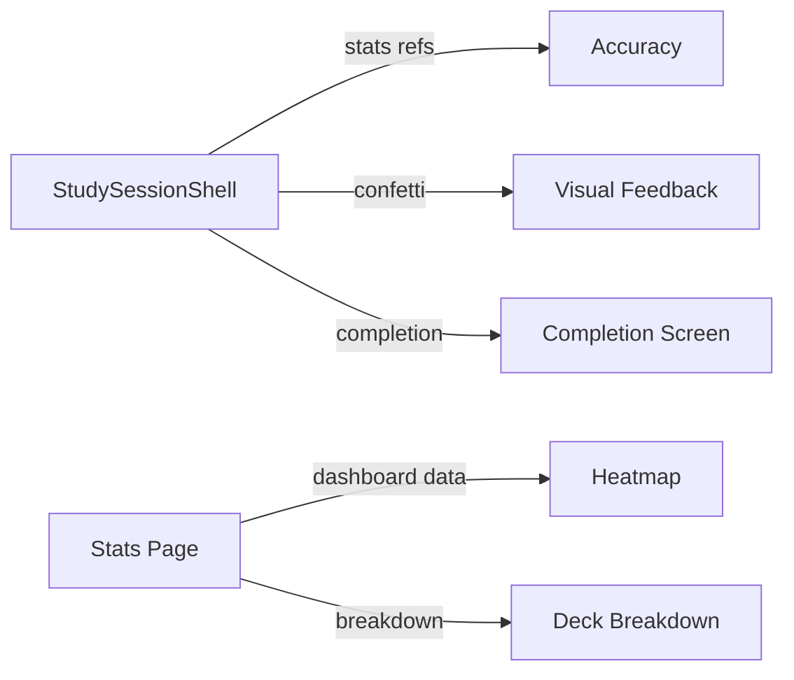
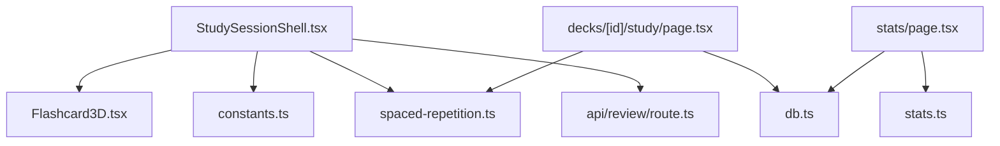

# Interactive Study Interface

<cite>
**Referenced Files in This Document**
- [Flashcard3D.tsx](file://src/components/flashcard/Flashcard3D.tsx)
- [StudySessionShell.tsx](file://src/components/flashcard/StudySessionShell.tsx)
- [page.tsx](file://src/app/decks/[id]/study/page.tsx)
- [route.ts](file://src/app/api/review/route.ts)
- [spaced-repetition.ts](file://src/lib/spaced-repetition.ts)
- [constants.ts](file://src/lib/constants.ts)
- [db.ts](file://src/lib/db.ts)
- [page.tsx](file://src/app/decks/[id]/page.tsx)
- [page.tsx](file://src/app/stats/page.tsx)
- [stats.ts](file://src/lib/stats.ts)
</cite>

## Table of Contents
1. [Introduction](#introduction)
2. [Project Structure](#project-structure)
3. [Core Components](#core-components)
4. [Architecture Overview](#architecture-overview)
5. [Detailed Component Analysis](#detailed-component-analysis)
6. [Dependency Analysis](#dependency-analysis)
7. [Performance Considerations](#performance-considerations)
8. [Troubleshooting Guide](#troubleshooting-guide)
9. [Conclusion](#conclusion)
10. [Appendices](#appendices)

## Introduction
This document describes the interactive study interface centered around a 3D flashcard system and study session management. It covers the Flashcard3D component, the animation system using Framer Motion, user interaction patterns, the study session lifecycle, card navigation, progress tracking, the rating system with immediate feedback, session statistics, study modes and difficulty considerations, review scheduling, responsive design and accessibility, cross-platform compatibility, integration with the spaced repetition system, real-time progress updates, and session persistence. Guidance is also provided for customizing study interfaces and optimizing the experience for different learning preferences.

## Project Structure
The study interface spans UI components, Next.js app router pages, API handlers, and domain logic for spaced repetition and persistence.

**Diagram sources**
- [page.tsx:30-91](file://src/app/decks/[id]/study/page.tsx#L30-L91)
- [StudySessionShell.tsx:42-429](file://src/components/flashcard/StudySessionShell.tsx#L42-L429)
- [Flashcard3D.tsx:17-112](file://src/components/flashcard/Flashcard3D.tsx#L17-L112)
- [spaced-repetition.ts:29-76](file://src/lib/spaced-repetition.ts#L29-L76)
- [route.ts:5-75](file://src/app/api/review/route.ts#L5-L75)
- [constants.ts:19-30](file://src/lib/constants.ts#L19-L30)
- [db.ts:51-67](file://src/lib/db.ts#L51-L67)
- [page.tsx:26-205](file://src/app/decks/[id]/page.tsx#L26-L205)
- [page.tsx:14-186](file://src/app/stats/page.tsx#L14-L186)
- [stats.ts:6-18](file://src/lib/stats.ts#L6-L18)

**Section sources**
- [page.tsx:30-91](file://src/app/decks/[id]/study/page.tsx#L30-L91)
- [StudySessionShell.tsx:42-429](file://src/components/flashcard/StudySessionShell.tsx#L42-L429)
- [Flashcard3D.tsx:17-112](file://src/components/flashcard/Flashcard3D.tsx#L17-L112)
- [spaced-repetition.ts:29-76](file://src/lib/spaced-repetition.ts#L29-L76)
- [route.ts:5-75](file://src/app/api/review/route.ts#L5-L75)
- [constants.ts:19-30](file://src/lib/constants.ts#L19-L30)
- [db.ts:51-67](file://src/lib/db.ts#L51-L67)
- [page.tsx:26-205](file://src/app/decks/[id]/page.tsx#L26-L205)
- [page.tsx:14-186](file://src/app/stats/page.tsx#L14-L186)
- [stats.ts:6-18](file://src/lib/stats.ts#L6-L18)

## Core Components
- Flashcard3D: A 3D flip card with gradient border and shadow effects, driven by Framer Motion animations. It exposes a controlled flip state and keyboard support for flipping.
- StudySessionShell: Orchestrates the study session lifecycle, including queue management, card navigation, progress tracking, rating, immediate feedback, and completion screens. It integrates with the spaced repetition system via an API endpoint.

Key responsibilities:
- Manage current card index, flip state, direction, and completion state.
- Build session statistics (studied, correct, newly mastered, elapsed time).
- Handle keyboard shortcuts and submit ratings to the backend.
- Provide optimistic UI updates and confetti feedback for high ratings.
- Render progress bar, header, rating buttons, and end-session confirmation.

**Section sources**
- [Flashcard3D.tsx:17-112](file://src/components/flashcard/Flashcard3D.tsx#L17-L112)
- [StudySessionShell.tsx:42-429](file://src/components/flashcard/StudySessionShell.tsx#L42-L429)

## Architecture Overview
The study interface follows a clear separation of concerns:
- UI components handle presentation and user interactions.
- App router pages prepare the session queue and pass data to the shell.
- The spaced repetition library computes updates.
- The API endpoint persists updates and logs reviews.
- Database utilities centralize connection configuration.

**Diagram sources**
- [StudySessionShell.tsx:68-125](file://src/components/flashcard/StudySessionShell.tsx#L68-L125)
- [route.ts:5-75](file://src/app/api/review/route.ts#L5-L75)
- [db.ts:51-67](file://src/lib/db.ts#L51-L67)

## Detailed Component Analysis

### Flashcard3D Component
- Props: front/back content, difficulty, controlled flipped state, and a callback to change flip state.
- Interaction: Click/tap toggles flip; keyboard events (Space/Enter) toggle when not editing inputs.
- Animation: Framer Motion rotates the card along the Y-axis with easing and preserves 3D style.
- Visuals: Gradient border ring changes with flip state; shadow depth increases on flip; difficulty badge uses theme tokens.

**Diagram sources**
- [Flashcard3D.tsx:8-23](file://src/components/flashcard/Flashcard3D.tsx#L8-L23)

**Section sources**
- [Flashcard3D.tsx:17-112](file://src/components/flashcard/Flashcard3D.tsx#L17-L112)
- [constants.ts:19-23](file://src/lib/constants.ts#L19-L23)

### StudySessionShell Component
- Session lifecycle:
  - Initializes queue from props and manages current index, flip state, direction, completion, and confirmation modal.
  - Builds live stats (studied, correct, newly mastered, start time).
- Navigation:
  - Uses AnimatePresence with custom direction for smooth card transitions.
  - Keyboard shortcuts: Escape to end session, Arrow keys suppressed, Space/Enter to flip, 1–4 to rate.
- Rating and feedback:
  - Optimistic UI advances immediately upon rating.
  - Calls POST /api/review with cardId, deckId, and quality.
  - Confetti effect for top rating.
- Completion screen:
  - Calculates accuracy and renders stats grid with motivational message.
  - Provides navigation to restart, deck, or dashboard.

**Diagram sources**
- [StudySessionShell.tsx:42-429](file://src/components/flashcard/StudySessionShell.tsx#L42-L429)
- [route.ts:5-75](file://src/app/api/review/route.ts#L5-L75)

**Section sources**
- [StudySessionShell.tsx:42-429](file://src/components/flashcard/StudySessionShell.tsx#L42-L429)
- [spaced-repetition.ts:107-140](file://src/lib/spaced-repetition.ts#L107-L140)

### Study Modes and Difficulty Considerations
- Study modes:
  - Default: Due-first queue built from cards using the spaced repetition algorithm, limited per session.
  - All cards mode: Shuffled selection of all cards for study.
- Difficulty:
  - Difficulty badge is rendered on the front of the card using theme tokens.
  - The queue builder prioritizes overdue cards first, then shuffles new cards.

**Diagram sources**
- [page.tsx:74-82](file://src/app/decks/[id]/study/page.tsx#L74-L82)
- [spaced-repetition.ts:88-104](file://src/lib/spaced-repetition.ts#L88-L104)
- [constants.ts:19-23](file://src/lib/constants.ts#L19-L23)

**Section sources**
- [page.tsx:74-82](file://src/app/decks/[id]/study/page.tsx#L74-L82)
- [spaced-repetition.ts:88-104](file://src/lib/spaced-repetition.ts#L88-L104)
- [constants.ts:19-23](file://src/lib/constants.ts#L19-L23)

### Review Scheduling and Spaced Repetition Integration
- The API endpoint validates inputs, loads the card, runs the SM-2 algorithm, and persists updates atomically.
- Persistence includes updating card fields (easeFactor, interval, repetitionCount, nextReviewAt, status, lastReviewedAt), creating a review log, and updating deck lastStudiedAt.
- The shell reads the returned status to increment newly mastered counters.

**Diagram sources**
- [route.ts:5-75](file://src/app/api/review/route.ts#L5-L75)
- [spaced-repetition.ts:29-76](file://src/lib/spaced-repetition.ts#L29-L76)
- [db.ts:51-67](file://src/lib/db.ts#L51-L67)

**Section sources**
- [route.ts:5-75](file://src/app/api/review/route.ts#L5-L75)
- [spaced-repetition.ts:29-76](file://src/lib/spaced-repetition.ts#L29-L76)
- [db.ts:51-67](file://src/lib/db.ts#L51-L67)

### Progress Tracking and Statistics
- Live stats:
  - Studied count increments optimistically.
  - Correct count increments for quality ≥ 3.
  - Newly mastered counter increments when the server reports MASTERED status.
- Completion screen:
  - Accuracy computed from correct/studied.
  - Time spent formatted from start time.
  - Motivational message based on accuracy.
- Global stats:
  - Stats page aggregates mastery, streaks, activity heatmaps, and upcoming reviews.

**Diagram sources**
- [StudySessionShell.tsx:56-173](file://src/components/flashcard/StudySessionShell.tsx#L56-L173)
- [page.tsx:14-186](file://src/app/stats/page.tsx#L14-L186)
- [stats.ts:6-18](file://src/lib/stats.ts#L6-L18)

**Section sources**
- [StudySessionShell.tsx:56-173](file://src/components/flashcard/StudySessionShell.tsx#L56-L173)
- [page.tsx:14-186](file://src/app/stats/page.tsx#L14-L186)
- [stats.ts:6-18](file://src/lib/stats.ts#L6-L18)

### Responsive Design and Accessibility
- Responsive layout:
  - Grid-based rating buttons adapt from two to four columns based on viewport.
  - Max widths and padding adjust for mobile and tablet screens.
- Accessibility:
  - Keyboard navigation is supported (Space/Enter to flip, 1–4 to rate).
  - Focusable buttons and semantic markup for controls.
  - Reduced motion considerations for confetti and animations.
- Cross-platform compatibility:
  - Next.js App Router ensures consistent rendering across platforms.
  - Tailwind utilities provide consistent spacing and typography.

**Section sources**
- [StudySessionShell.tsx:310-384](file://src/components/flashcard/StudySessionShell.tsx#L310-L384)
- [Flashcard3D.tsx:42-112](file://src/components/flashcard/Flashcard3D.tsx#L42-L112)

### Session Persistence and Real-Time Updates
- Persistence:
  - Atomic transaction ensures card update, review log creation, and deck last-studied update occur together.
- Real-time progress:
  - Optimistic UI updates provide immediate feedback during rating.
  - Completion screen displays final stats after server response.

**Section sources**
- [route.ts:44-68](file://src/app/api/review/route.ts#L44-L68)
- [StudySessionShell.tsx:68-125](file://src/components/flashcard/StudySessionShell.tsx#L68-L125)

## Dependency Analysis
- StudySessionShell depends on:
  - Flashcard3D for rendering and flip behavior.
  - RATING_OPTIONS and difficulty styles from constants.
  - Spaced repetition utilities for queue building and rating semantics.
  - API route for review submission.
- Study Page depends on:
  - Database client to load deck and cards.
  - Spaced repetition utilities to build the due-first queue.
  - Router to navigate to the study shell.
- Stats Page depends on:
  - Stats utilities for streaks, heatmaps, and recent sessions.
  - Database client for aggregated metrics.

**Diagram sources**
- [StudySessionShell.tsx:9-10](file://src/components/flashcard/StudySessionShell.tsx#L9-L10)
- [Flashcard3D.tsx](file://src/components/flashcard/Flashcard3D.tsx#L6)
- [spaced-repetition.ts](file://src/lib/spaced-repetition.ts#L10)
- [route.ts:2-3](file://src/app/api/review/route.ts#L2-L3)
- [page.tsx:4-5](file://src/app/decks/[id]/study/page.tsx#L4-L5)
- [db.ts:1-2](file://src/lib/db.ts#L1-L2)
- [page.tsx:8-9](file://src/app/stats/page.tsx#L8-L9)
- [stats.ts:1-3](file://src/lib/stats.ts#L1-L3)

**Section sources**
- [StudySessionShell.tsx:9-10](file://src/components/flashcard/StudySessionShell.tsx#L9-L10)
- [Flashcard3D.tsx](file://src/components/flashcard/Flashcard3D.tsx#L6)
- [spaced-repetition.ts](file://src/lib/spaced-repetition.ts#L10)
- [route.ts:2-3](file://src/app/api/review/route.ts#L2-L3)
- [page.tsx:4-5](file://src/app/decks/[id]/study/page.tsx#L4-L5)
- [db.ts:1-2](file://src/lib/db.ts#L1-L2)
- [page.tsx:8-9](file://src/app/stats/page.tsx#L8-L9)
- [stats.ts:1-3](file://src/lib/stats.ts#L1-L3)

## Performance Considerations
- Animation performance:
  - Use of Framer Motion with easing and preserve-3d reduces jank.
  - Direction-aware transitions minimize layout thrash.
- Network responsiveness:
  - Optimistic UI prevents perceived latency; server response updates counters.
  - Fire-and-forget review submission avoids blocking transitions.
- Rendering:
  - AnimatePresence with mode="wait" and custom variants ensures smooth card swaps.
  - Conditional rendering of rating buttons reduces DOM overhead until needed.

[No sources needed since this section provides general guidance]

## Troubleshooting Guide
- Study session fails to start:
  - Verify deck exists and cards are loaded; errors surface informative messages.
- Review submission errors:
  - Ensure cardId, deckId, and quality are provided and within range.
  - Confirm database connectivity and environment variables for production.
- Missing database configuration:
  - Check DATABASE_URL and related Postgres variables; the DB client selects appropriate URLs and enforces sslmode=require in serverless.

**Section sources**
- [page.tsx:43-54](file://src/app/decks/[id]/study/page.tsx#L43-L54)
- [route.ts:15-20](file://src/app/api/review/route.ts#L15-L20)
- [db.ts:8-47](file://src/lib/db.ts#L8-L47)

## Conclusion
The interactive study interface combines a polished 3D flashcard experience with a robust spaced repetition system. Users benefit from smooth animations, responsive design, and immediate feedback, while the backend ensures reliable persistence and meaningful progress insights. The modular architecture supports customization and extension for diverse learning preferences.

[No sources needed since this section summarizes without analyzing specific files]

## Appendices

### Customization and UX Optimization
- Customize difficulty badges and rating semantics by adjusting constants and rating options.
- Extend study modes by adding filters (e.g., difficulty, tags) to the queue builder.
- Optimize pacing by tuning animation durations and transition curves.
- Enhance accessibility by adding ARIA labels and keyboard hints for controls.

**Section sources**
- [constants.ts:19-30](file://src/lib/constants.ts#L19-L30)
- [spaced-repetition.ts:107-140](file://src/lib/spaced-repetition.ts#L107-L140)
- [StudySessionShell.tsx:310-384](file://src/components/flashcard/StudySessionShell.tsx#L310-L384)