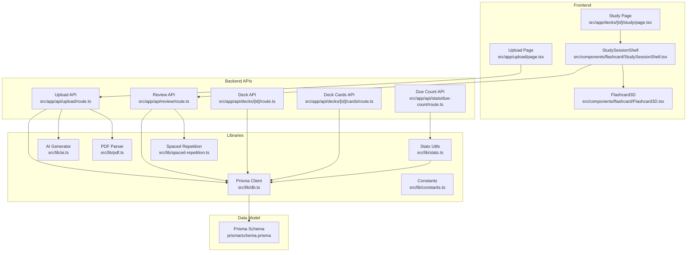
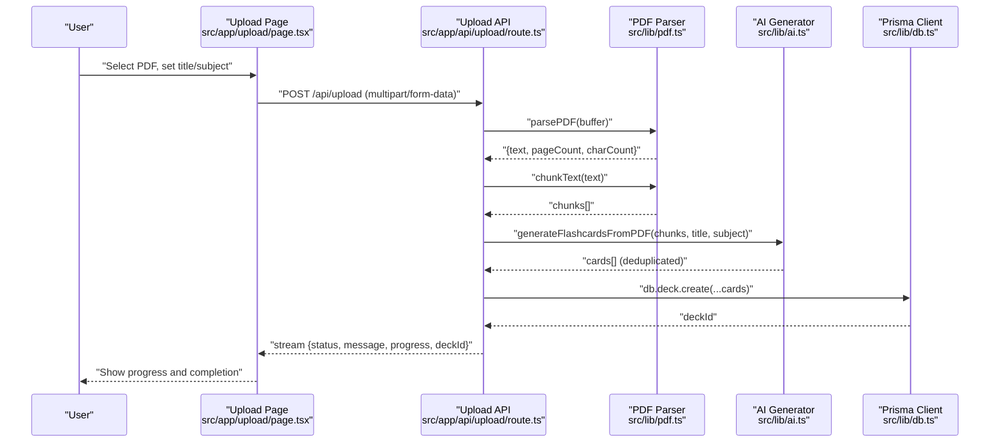
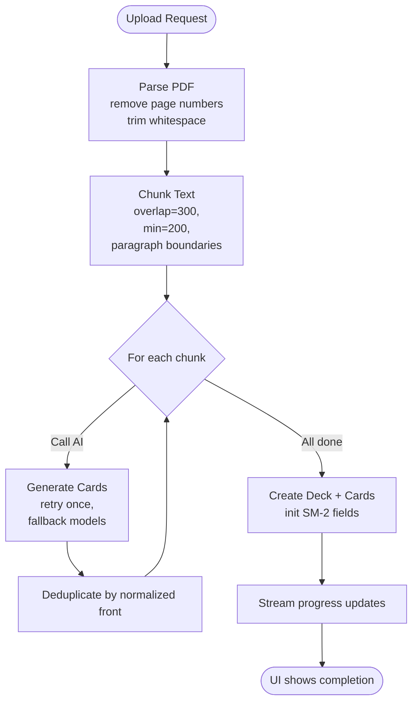
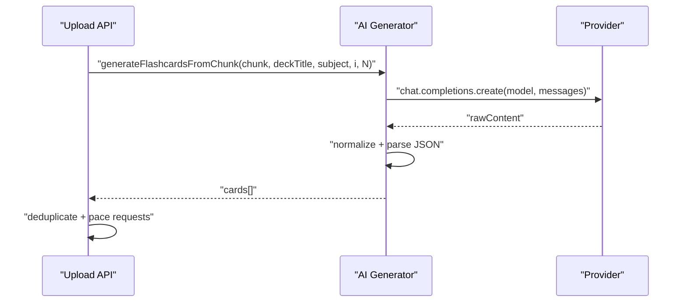
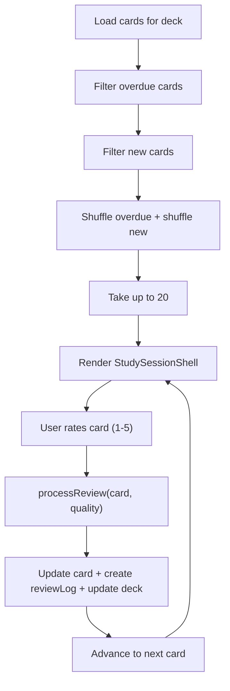
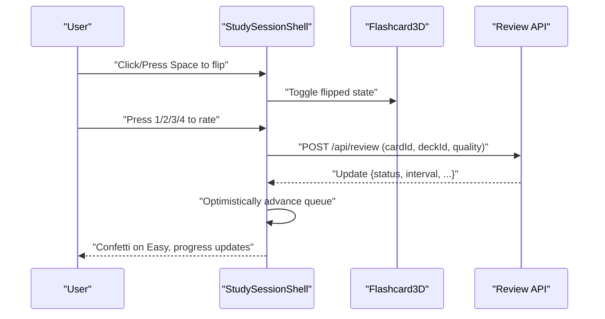
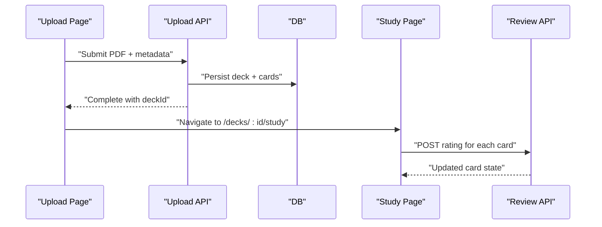
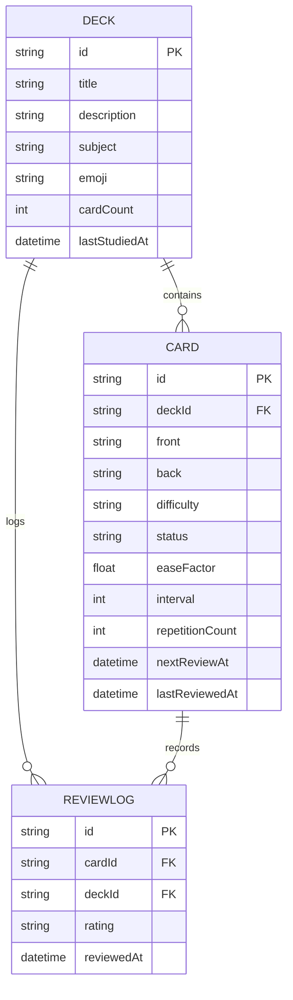

# Key Features

<cite>
**Referenced Files in This Document**
- [src/app/upload/page.tsx](file://src/app/upload/page.tsx)
- [src/app/api/upload/route.ts](file://src/app/api/upload/route.ts)
- [src/lib/pdf.ts](file://src/lib/pdf.ts)
- [src/lib/ai.ts](file://src/lib/ai.ts)
- [src/components/upload/DropZone.tsx](file://src/components/upload/DropZone.tsx)
- [src/app/decks/[id]/study/page.tsx](file://src/app/decks/[id]/study/page.tsx)
- [src/components/flashcard/StudySessionShell.tsx](file://src/components/flashcard/StudySessionShell.tsx)
- [src/components/flashcard/Flashcard3D.tsx](file://src/components/flashcard/Flashcard3D.tsx)
- [src/app/api/review/route.ts](file://src/app/api/review/route.ts)
- [src/lib/spaced-repetition.ts](file://src/lib/spaced-repetition.ts)
- [src/app/api/decks/[id]/route.ts](file://src/app/api/decks/[id]/route.ts)
- [src/app/api/decks/[id]/cards/route.ts](file://src/app/api/decks/[id]/cards/route.ts)
- [src/lib/db.ts](file://src/lib/db.ts)
- [prisma/schema.prisma](file://prisma/schema.prisma)
- [src/lib/constants.ts](file://src/lib/constants.ts)
- [src/app/api/stats/due-count/route.ts](file://src/app/api/stats/due-count/route.ts)
- [src/lib/stats.ts](file://src/lib/stats.ts)
</cite>

## Table of Contents
1. [Introduction](#introduction)
2. [Project Structure](#project-structure)
3. [Core Components](#core-components)
4. [Architecture Overview](#architecture-overview)
5. [Detailed Component Analysis](#detailed-component-analysis)
6. [Dependency Analysis](#dependency-analysis)
7. [Performance Considerations](#performance-considerations)
8. [Troubleshooting Guide](#troubleshooting-guide)
9. [Conclusion](#conclusion)

## Introduction
This document explains the key features of the system with a focus on recall’s core functionality and capabilities. It covers:
- PDF-to-flashcard conversion pipeline
- AI-powered content generation
- Spaced repetition system implementation
- Study interface features

It also provides practical examples of the complete workflow from PDF upload through study sessions, along with user experience aspects, performance characteristics, and customization options. Both end users and developers can use this guide to understand how features work, how they integrate, and how to troubleshoot or extend them.

## Project Structure
The system is a Next.js application with a clear separation of concerns:
- Frontend pages and components for upload, study, and statistics
- Backend API routes for upload, review, deck management, and stats
- Libraries for PDF parsing, AI generation, spaced repetition, database access, constants, and statistics
- Prisma schema modeling decks, cards, and review logs

**Diagram sources**
- [src/app/upload/page.tsx:1-504](file://src/app/upload/page.tsx#L1-L504)
- [src/app/api/upload/route.ts:1-298](file://src/app/api/upload/route.ts#L1-L298)
- [src/lib/pdf.ts:1-112](file://src/lib/pdf.ts#L1-L112)
- [src/lib/ai.ts:1-233](file://src/lib/ai.ts#L1-L233)
- [src/app/decks/[id]/study/page.tsx](file://src/app/decks/[id]/study/page.tsx#L1-L92)
- [src/components/flashcard/StudySessionShell.tsx:1-430](file://src/components/flashcard/StudySessionShell.tsx#L1-L430)
- [src/components/flashcard/Flashcard3D.tsx:1-113](file://src/components/flashcard/Flashcard3D.tsx#L1-L113)
- [src/app/api/review/route.ts:1-76](file://src/app/api/review/route.ts#L1-L76)
- [src/lib/spaced-repetition.ts:1-141](file://src/lib/spaced-repetition.ts#L1-L141)
- [src/app/api/decks/[id]/route.ts](file://src/app/api/decks/[id]/route.ts#L1-L43)
- [src/app/api/decks/[id]/cards/route.ts](file://src/app/api/decks/[id]/cards/route.ts#L1-L40)
- [src/lib/db.ts:1-68](file://src/lib/db.ts#L1-L68)
- [prisma/schema.prisma:1-51](file://prisma/schema.prisma#L1-L51)
- [src/app/api/stats/due-count/route.ts:1-15](file://src/app/api/stats/due-count/route.ts#L1-L15)
- [src/lib/stats.ts:1-222](file://src/lib/stats.ts#L1-L222)

**Section sources**
- [src/app/upload/page.tsx:1-504](file://src/app/upload/page.tsx#L1-L504)
- [src/app/api/upload/route.ts:1-298](file://src/app/api/upload/route.ts#L1-L298)
- [src/lib/pdf.ts:1-112](file://src/lib/pdf.ts#L1-L112)
- [src/lib/ai.ts:1-233](file://src/lib/ai.ts#L1-L233)
- [src/app/decks/[id]/study/page.tsx](file://src/app/decks/[id]/study/page.tsx#L1-L92)
- [src/components/flashcard/StudySessionShell.tsx:1-430](file://src/components/flashcard/StudySessionShell.tsx#L1-L430)
- [src/components/flashcard/Flashcard3D.tsx:1-113](file://src/components/flashcard/Flashcard3D.tsx#L1-L113)
- [src/app/api/review/route.ts:1-76](file://src/app/api/review/route.ts#L1-L76)
- [src/lib/spaced-repetition.ts:1-141](file://src/lib/spaced-repetition.ts#L1-L141)
- [src/app/api/decks/[id]/route.ts](file://src/app/api/decks/[id]/route.ts#L1-L43)
- [src/app/api/decks/[id]/cards/route.ts](file://src/app/api/decks/[id]/cards/route.ts#L1-L40)
- [src/lib/db.ts:1-68](file://src/lib/db.ts#L1-L68)
- [prisma/schema.prisma:1-51](file://prisma/schema.prisma#L1-L51)
- [src/app/api/stats/due-count/route.ts:1-15](file://src/app/api/stats/due-count/route.ts#L1-L15)
- [src/lib/stats.ts:1-222](file://src/lib/stats.ts#L1-L222)

## Core Components
- PDF-to-flashcard conversion pipeline: Parses PDFs, cleans text, splits into chunks, generates flashcards via AI, deduplicates, persists to the database, and streams progress to the UI.
- AI-powered content generation: Uses a configurable provider to produce structured flashcards with difficulty labels and varied question formats.
- Spaced repetition system: Implements SM-2 with a due-card queue, rating options, and persistence of updates and review logs.
- Study interface: Provides a 3D flip animation, keyboard-driven ratings, progress tracking, and completion analytics.

**Section sources**
- [src/app/api/upload/route.ts:164-297](file://src/app/api/upload/route.ts#L164-L297)
- [src/lib/pdf.ts:13-61](file://src/lib/pdf.ts#L13-L61)
- [src/lib/pdf.ts:67-111](file://src/lib/pdf.ts#L67-L111)
- [src/lib/ai.ts:76-153](file://src/lib/ai.ts#L76-L153)
- [src/lib/ai.ts:168-232](file://src/lib/ai.ts#L168-L232)
- [src/lib/spaced-repetition.ts:29-76](file://src/lib/spaced-repetition.ts#L29-L76)
- [src/lib/spaced-repetition.ts:88-104](file://src/lib/spaced-repetition.ts#L88-L104)
- [src/components/flashcard/StudySessionShell.tsx:68-125](file://src/components/flashcard/StudySessionShell.tsx#L68-L125)
- [src/components/flashcard/Flashcard3D.tsx:17-40](file://src/components/flashcard/Flashcard3D.tsx#L17-L40)

## Architecture Overview
The system follows a frontend-to-backend API pattern with a persistent data layer. The upload flow is streamed to the client, while the study flow is interactive and stateful in the browser.

**Diagram sources**
- [src/app/upload/page.tsx:84-177](file://src/app/upload/page.tsx#L84-L177)
- [src/app/api/upload/route.ts:164-297](file://src/app/api/upload/route.ts#L164-L297)
- [src/lib/pdf.ts:13-111](file://src/lib/pdf.ts#L13-L111)
- [src/lib/ai.ts:168-232](file://src/lib/ai.ts#L168-L232)
- [src/lib/db.ts:1-68](file://src/lib/db.ts#L1-L68)

## Detailed Component Analysis

### PDF-to-Flashcard Conversion Pipeline
- PDF parsing: Handles Node.js server limitations by providing a lightweight polyfill and lazy-loads the parser to reduce cold start overhead. Removes page numbers and trims whitespace to improve readability.
- Text chunking: Splits content into overlapping segments aligned with paragraph boundaries to preserve context for AI generation.
- AI generation: Sends each chunk to a provider, retries on failure, and parses structured JSON responses. Applies deduplication across chunks and a final deduplication pass before saving.
- Persistence: Creates a deck with metadata and inserts cards with initial spaced repetition fields. Streams progress to the UI via a server-side streaming response.

**Diagram sources**
- [src/lib/pdf.ts:13-111](file://src/lib/pdf.ts#L13-L111)
- [src/lib/ai.ts:76-153](file://src/lib/ai.ts#L76-L153)
- [src/lib/ai.ts:168-232](file://src/lib/ai.ts#L168-L232)
- [src/app/api/upload/route.ts:164-297](file://src/app/api/upload/route.ts#L164-L297)

**Section sources**
- [src/lib/pdf.ts:13-111](file://src/lib/pdf.ts#L13-L111)
- [src/lib/ai.ts:76-153](file://src/lib/ai.ts#L76-L153)
- [src/lib/ai.ts:168-232](file://src/lib/ai.ts#L168-L232)
- [src/app/api/upload/route.ts:164-297](file://src/app/api/upload/route.ts#L164-L297)

### AI-Powered Content Generation
- Provider abstraction: Lazily initializes a client and tries multiple models with fallbacks. Enforces a reasonable temperature and token limit for deterministic, concise outputs.
- Prompt engineering: System prompt defines categories, quality rules, and JSON schema expectations. User message includes subject, deck title, and chunk context.
- Robust parsing: Strips markdown fences and attempts partial extraction if JSON is malformed.
- Progress reporting: Emits structured progress updates to the UI during generation.

**Diagram sources**
- [src/lib/ai.ts:76-153](file://src/lib/ai.ts#L76-L153)
- [src/lib/ai.ts:168-232](file://src/lib/ai.ts#L168-L232)

**Section sources**
- [src/lib/ai.ts:8-24](file://src/lib/ai.ts#L8-L24)
- [src/lib/ai.ts:53-74](file://src/lib/ai.ts#L53-L74)
- [src/lib/ai.ts:100-120](file://src/lib/ai.ts#L100-L120)
- [src/lib/ai.ts:127-152](file://src/lib/ai.ts#L127-L152)
- [src/lib/ai.ts:178-229](file://src/lib/ai.ts#L178-L229)

### Spaced Repetition System Implementation
- Algorithm: Implements SM-2 with ease factor adjustments, interval progression, and status transitions (NEW → LEARNING → REVIEW → MASTERED).
- Queue builder: Builds a study queue prioritizing overdue cards and mixing in new cards, with randomized order to reduce memorization bias.
- Rating options: Provides four intuitive rating labels mapped to numeric quality scores with keyboard shortcuts and visual feedback.
- Review persistence: Updates card fields and creates a review log atomically within a transaction, and updates deck last-studied timestamp.

**Diagram sources**
- [src/lib/spaced-repetition.ts:29-76](file://src/lib/spaced-repetition.ts#L29-L76)
- [src/lib/spaced-repetition.ts:88-104](file://src/lib/spaced-repetition.ts#L88-L104)
- [src/app/api/review/route.ts:22-68](file://src/app/api/review/route.ts#L22-L68)
- [src/app/decks/[id]/study/page.tsx](file://src/app/decks/[id]/study/page.tsx#L74-L82)

**Section sources**
- [src/lib/spaced-repetition.ts:29-76](file://src/lib/spaced-repetition.ts#L29-L76)
- [src/lib/spaced-repetition.ts:88-104](file://src/lib/spaced-repetition.ts#L88-L104)
- [src/lib/spaced-repetition.ts:107-140](file://src/lib/spaced-repetition.ts#L107-L140)
- [src/app/api/review/route.ts:22-68](file://src/app/api/review/route.ts#L22-L68)
- [src/app/decks/[id]/study/page.tsx](file://src/app/decks/[id]/study/page.tsx#L74-L82)

### Study Interface Features
- Interactive 3D flashcard: Smooth flip animation with gradient border and depth effects; supports click and keyboard toggle.
- Rating UX: Four rating buttons with keyboard shortcuts (1–4), visual feedback, and optimistic advancement.
- Progress tracking: Real-time progress bar and card counter; completion screen with session stats and confetti.
- Accessibility and UX: Escape key to end session, space/enter to flip, reduced-motion safe animations, and clear messaging.

**Diagram sources**
- [src/components/flashcard/StudySessionShell.tsx:68-125](file://src/components/flashcard/StudySessionShell.tsx#L68-L125)
- [src/components/flashcard/Flashcard3D.tsx:24-40](file://src/components/flashcard/Flashcard3D.tsx#L24-L40)
- [src/app/api/review/route.ts:5-20](file://src/app/api/review/route.ts#L5-L20)

**Section sources**
- [src/components/flashcard/StudySessionShell.tsx:12-31](file://src/components/flashcard/StudySessionShell.tsx#L12-L31)
- [src/components/flashcard/StudySessionShell.tsx:127-158](file://src/components/flashcard/StudySessionShell.tsx#L127-L158)
- [src/components/flashcard/StudySessionShell.tsx:160-254](file://src/components/flashcard/StudySessionShell.tsx#L160-L254)
- [src/components/flashcard/StudySessionShell.tsx:257-428](file://src/components/flashcard/StudySessionShell.tsx#L257-L428)
- [src/components/flashcard/Flashcard3D.tsx:17-40](file://src/components/flashcard/Flashcard3D.tsx#L17-L40)

### Practical Workflow Examples
- From PDF upload to study session:
  1. User navigates to the upload page, selects a PDF, sets title and optional subject, and clicks “Generate Flashcards.”
  2. The frontend streams progress from the backend, showing parsing, chunking, generation, and saving stages.
  3. On completion, the user is redirected to the study page for the new deck.
  4. The study page builds a due-card queue, renders the 3D flashcards, and records ratings.
  5. Ratings update the card’s SM-2 schedule and persist review logs.

**Diagram sources**
- [src/app/upload/page.tsx:84-177](file://src/app/upload/page.tsx#L84-L177)
- [src/app/api/upload/route.ts:204-251](file://src/app/api/upload/route.ts#L204-L251)
- [src/app/decks/[id]/study/page.tsx](file://src/app/decks/[id]/study/page.tsx#L30-L91)
- [src/app/api/review/route.ts:5-20](file://src/app/api/review/route.ts#L5-L20)

**Section sources**
- [src/app/upload/page.tsx:84-177](file://src/app/upload/page.tsx#L84-L177)
- [src/app/api/upload/route.ts:204-251](file://src/app/api/upload/route.ts#L204-L251)
- [src/app/decks/[id]/study/page.tsx](file://src/app/decks/[id]/study/page.tsx#L30-L91)
- [src/app/api/review/route.ts:5-20](file://src/app/api/review/route.ts#L5-L20)

## Dependency Analysis
- Data model: Decks own Cards and ReviewLogs; Cards belong to a Deck and track SM-2 fields; ReviewLogs capture ratings and timestamps.
- Frontend-to-backend: Upload page drives the upload API; study page drives the review API; deck APIs support editing and adding cards.
- External integrations: PDF parsing uses a Node-compatible library with a polyfill; AI generation uses a provider client; database access uses Prisma.

**Diagram sources**
- [prisma/schema.prisma:10-50](file://prisma/schema.prisma#L10-L50)

**Section sources**
- [prisma/schema.prisma:10-50](file://prisma/schema.prisma#L10-L50)
- [src/lib/db.ts:1-68](file://src/lib/db.ts#L1-L68)

## Performance Considerations
- Cold start mitigation: PDF parser is lazily imported to reduce initial bundle size and server startup cost.
- Streaming responses: Upload progress is streamed to the UI to provide immediate feedback and reduce perceived latency.
- Rate limiting and pacing: Upload API enforces per-IP rate limiting and adds small delays between AI requests to respect free-tier quotas.
- Database selection: The database client chooses appropriate URLs and ensures SSL mode for serverless environments.
- Study queue sizing: Defaults to a manageable batch size to balance responsiveness and cognitive load.

[No sources needed since this section provides general guidance]

## Troubleshooting Guide
- Missing environment variables:
  - OPENROUTER_API_KEY: Required for AI generation; the upload route returns a clear public message if missing.
  - DATABASE_URL: Required for database connectivity; misconfiguration surfaces as a database-related error.
- Free-tier limitations:
  - AI rate limits and model availability can cause transient failures; the upload route maps common errors to actionable messages.
- PDF quality:
  - Very low text density triggers an early error suggesting the PDF might be scanned or image-based.
- UI feedback:
  - The upload page displays structured error cards and provides a reset option to retry.

**Section sources**
- [src/app/api/upload/route.ts:11-63](file://src/app/api/upload/route.ts#L11-L63)
- [src/app/api/upload/route.ts:87-106](file://src/app/api/upload/route.ts#L87-L106)
- [src/app/api/upload/route.ts:179-189](file://src/app/api/upload/route.ts#L179-L189)
- [src/app/upload/page.tsx:192-214](file://src/app/upload/page.tsx#L192-L214)

## Conclusion
Recall delivers a seamless learning workflow from PDF ingestion to spaced-repetition-powered study sessions. The modular design separates parsing, AI generation, persistence, and UI, enabling maintainability and extensibility. Users benefit from a responsive, distraction-free study interface, while developers gain clear APIs, robust error handling, and performance-conscious defaults.