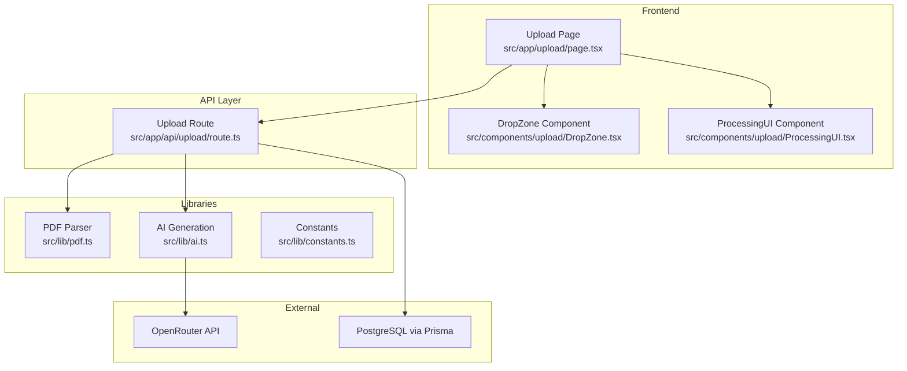
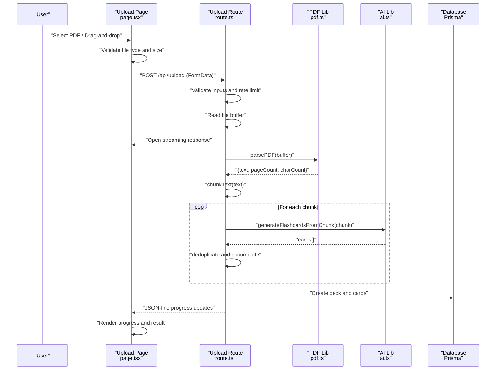
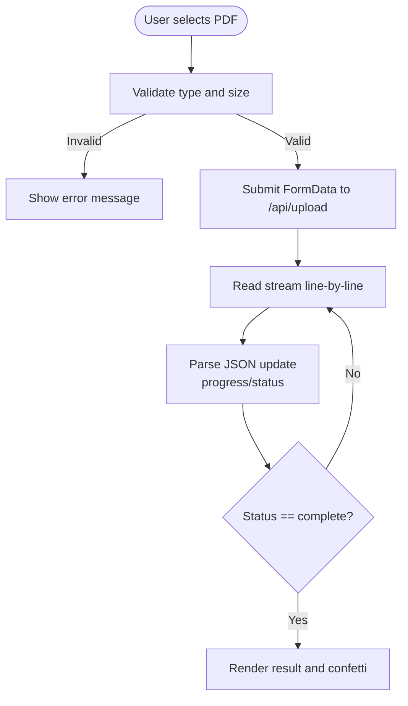
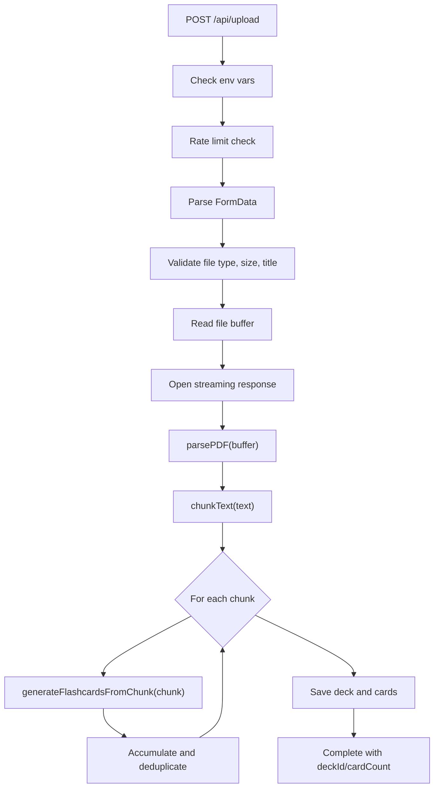
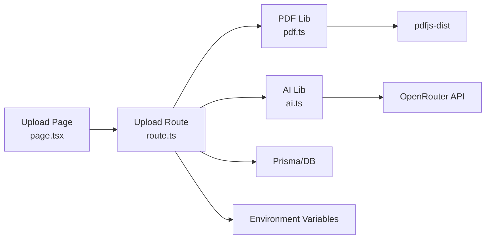

# PDF Upload and Processing

<cite>
**Referenced Files in This Document**
- [page.tsx](file://src/app/upload/page.tsx)
- [DropZone.tsx](file://src/components/upload/DropZone.tsx)
- [ProcessingUI.tsx](file://src/components/upload/ProcessingUI.tsx)
- [route.ts](file://src/app/api/upload/route.ts)
- [pdf.ts](file://src/lib/pdf.ts)
- [ai.ts](file://src/lib/ai.ts)
- [constants.ts](file://src/lib/constants.ts)
- [README.md](file://README.md)
- [package.json](file://package.json)
</cite>

## Table of Contents
1. [Introduction](#introduction)
2. [Project Structure](#project-structure)
3. [Core Components](#core-components)
4. [Architecture Overview](#architecture-overview)
5. [Detailed Component Analysis](#detailed-component-analysis)
6. [Dependency Analysis](#dependency-analysis)
7. [Performance Considerations](#performance-considerations)
8. [Troubleshooting Guide](#troubleshooting-guide)
9. [Conclusion](#conclusion)

## Introduction
This document explains the complete PDF upload and processing workflow, from file selection to flashcard generation. It covers the frontend upload interface with drag-and-drop support, client-side validation, and real-time progress tracking. On the backend, it details the PDF parsing pipeline using pdfjs-dist, text extraction and preprocessing, chunking strategy for large documents, AI-driven flashcard generation, deduplication, and persistence to the database. It also includes practical guidance on supported formats, size limits, processing expectations, accessibility, and integration with the AI generation system.

## Project Structure
The PDF upload feature spans several layers:
- Frontend pages and components for user interaction
- API route for server-side processing
- Libraries for PDF parsing, chunking, and AI generation
- Constants for UI and styling

**Diagram sources**
- [page.tsx:1-504](file://src/app/upload/page.tsx#L1-L504)
- [DropZone.tsx:1-100](file://src/components/upload/DropZone.tsx#L1-L100)
- [ProcessingUI.tsx:1-53](file://src/components/upload/ProcessingUI.tsx#L1-L53)
- [route.ts:1-298](file://src/app/api/upload/route.ts#L1-L298)
- [pdf.ts:1-130](file://src/lib/pdf.ts#L1-L130)
- [ai.ts:1-233](file://src/lib/ai.ts#L1-L233)
- [constants.ts:1-31](file://src/lib/constants.ts#L1-L31)

**Section sources**
- [page.tsx:1-504](file://src/app/upload/page.tsx#L1-L504)
- [route.ts:1-298](file://src/app/api/upload/route.ts#L1-L298)
- [pdf.ts:1-130](file://src/lib/pdf.ts#L1-L130)
- [ai.ts:1-233](file://src/lib/ai.ts#L1-L233)
- [constants.ts:1-31](file://src/lib/constants.ts#L1-L31)

## Core Components
- Upload Page: Orchestrates file selection, validation, and streaming progress updates from the backend.
- DropZone: Reusable drag-and-drop area for PDF selection with visual feedback.
- ProcessingUI: Alternative progress indicator component for processing steps.
- Upload Route: Validates input, streams progress events, parses PDF, chunks text, generates flashcards, deduplicates, and persists to the database.
- PDF Library: Parses PDFs and cleans extracted text.
- AI Library: Generates flashcards from text chunks with fallback models and deduplication.
- Constants: Provides subject options and UI styling tokens.

**Section sources**
- [page.tsx:34-177](file://src/app/upload/page.tsx#L34-L177)
- [DropZone.tsx:21-44](file://src/components/upload/DropZone.tsx#L21-L44)
- [ProcessingUI.tsx:12-25](file://src/components/upload/ProcessingUI.tsx#L12-L25)
- [route.ts:86-297](file://src/app/api/upload/route.ts#L86-L297)
- [pdf.ts:14-79](file://src/lib/pdf.ts#L14-L79)
- [ai.ts:168-232](file://src/lib/ai.ts#L168-L232)
- [constants.ts:1-8](file://src/lib/constants.ts#L1-L8)

## Architecture Overview
The upload workflow is a client-to-server streaming pipeline:
1. User selects a PDF via drag-and-drop or file picker.
2. Client validates the file type and size and initiates a POST request with multipart/form-data.
3. Server validates inputs, reads the file buffer, and immediately returns a streaming response.
4. Server parses the PDF, chunks the text, and streams progress updates.
5. Server calls the AI generation pipeline for each chunk, deduplicates results, and saves to the database.
6. Client renders progress and final result, including confetti on completion.

**Diagram sources**
- [page.tsx:84-177](file://src/app/upload/page.tsx#L84-L177)
- [route.ts:169-286](file://src/app/api/upload/route.ts#L169-L286)
- [pdf.ts:14-79](file://src/lib/pdf.ts#L14-L79)
- [ai.ts:168-232](file://src/lib/ai.ts#L168-L232)

## Detailed Component Analysis

### Upload Page (Client)
Responsibilities:
- Accepts PDF via drag-and-drop and file input.
- Validates file type and size.
- Streams progress updates from the server using a line-delimited JSON protocol.
- Renders progress, status messages, and final result with confetti.

Key behaviors:
- Drag-and-drop toggles visual feedback and sets state on drop.
- File input accepts only PDFs and updates state.
- On submit, constructs FormData and initiates a fetch to the upload endpoint.
- Reads the stream line-by-line, parses JSON updates, and updates progress and status.
- Handles errors and resets state.

**Diagram sources**
- [page.tsx:54-177](file://src/app/upload/page.tsx#L54-L177)

**Section sources**
- [page.tsx:34-177](file://src/app/upload/page.tsx#L34-L177)

### DropZone Component
Responsibilities:
- Provides a reusable drag-and-drop area for PDF selection.
- Displays selected file name and size.
- Enforces PDF-only acceptance and clears selection.

Key behaviors:
- Tracks drag state for visual feedback.
- Filters accepted files to PDFs.
- Emits change events to parent components.

**Section sources**
- [DropZone.tsx:21-44](file://src/components/upload/DropZone.tsx#L21-L44)

### ProcessingUI Component
Responsibilities:
- Provides a lightweight animated progress indicator during processing.
- Cycles through predefined status messages and animates progress.

Key behaviors:
- Maintains an internal index and cycles statuses at intervals.
- Computes progress based on status index.

**Section sources**
- [ProcessingUI.tsx:12-25](file://src/components/upload/ProcessingUI.tsx#L12-L25)

### Upload Route (Server)
Responsibilities:
- Validates environment variables, rate limits, and request inputs.
- Streams progress updates to the client.
- Parses PDF, chunks text, generates flashcards, deduplicates, and persists to the database.
- Returns structured error messages for common failure modes.

Key behaviors:
- Pre-flight checks for required environment variables.
- Rate limiting per IP with a simple in-memory map.
- Reads file buffer and immediately opens a streaming response.
- Progress streaming with JSON lines for parsing, chunking, generation, saving, and completion.
- Deduplication using normalized front text keys.
- Database creation of deck and cards.

**Diagram sources**
- [route.ts:86-297](file://src/app/api/upload/route.ts#L86-L297)
- [pdf.ts:85-129](file://src/lib/pdf.ts#L85-L129)
- [ai.ts:168-232](file://src/lib/ai.ts#L168-L232)

**Section sources**
- [route.ts:86-297](file://src/app/api/upload/route.ts#L86-L297)

### PDF Parsing and Text Extraction
Responsibilities:
- Extract text from PDF pages while preserving logical line breaks.
- Clean extracted text by removing page numbers and excessive whitespace.
- Provide metadata (page count, character count).

Key behaviors:
- Uses pdfjs-dist to load PDFs without requiring native canvas.
- Iterates pages and concatenates text items respecting vertical positions to reconstruct lines.
- Applies regex-based cleanup for page number patterns and collapses excessive newlines.
- Returns normalized text and counts.

**Section sources**
- [pdf.ts:14-79](file://src/lib/pdf.ts#L14-L79)

### Chunking Strategy
Responsibilities:
- Split large text into overlapping chunks suitable for AI processing.
- Prefer paragraph boundaries to maintain coherence.

Key behaviors:
- Splits text into paragraphs using double newlines.
- Builds chunks up to a configurable maximum size with overlap.
- Hard-splits oversized paragraphs to ensure minimum chunk size.
- Ensures the last chunk is flushed if it meets the minimum threshold.

**Section sources**
- [pdf.ts:85-129](file://src/lib/pdf.ts#L85-L129)

### AI Generation Pipeline
Responsibilities:
- Generate flashcards from each text chunk.
- Provide progress updates and handle retries.
- Deduplicate cards across chunks.

Key behaviors:
- Uses OpenRouter client lazily initialized to avoid build-time failures.
- Iterates chunks, generating cards with a system prompt and user context.
- Implements fallback models and retry logic for robustness.
- Deduplicates by normalizing front text and slicing a prefix for comparison.
- Emits progress updates with estimated completion percentage.

**Section sources**
- [ai.ts:8-24](file://src/lib/ai.ts#L8-L24)
- [ai.ts:168-232](file://src/lib/ai.ts#L168-L232)

### Constants and UI Integration
Responsibilities:
- Provide subject options for deck categorization.
- Map subjects to emojis for visual cues.

**Section sources**
- [constants.ts:1-8](file://src/lib/constants.ts#L1-L8)

## Dependency Analysis
- Frontend depends on:
  - Next.js App Router for routing and page components.
  - Framer Motion for animations and transitions.
  - Lucide icons for visual feedback.
  - Canvas-confetti for celebratory effects.
- Backend depends on:
  - pdfjs-dist for reliable serverless PDF parsing.
  - OpenAI client via OpenRouter for flashcard generation.
  - Prisma for database operations.
  - Node.js TransformStream for streaming responses.

**Diagram sources**
- [page.tsx:1-504](file://src/app/upload/page.tsx#L1-L504)
- [route.ts:1-298](file://src/app/api/upload/route.ts#L1-L298)
- [pdf.ts:1-130](file://src/lib/pdf.ts#L1-L130)
- [ai.ts:1-233](file://src/lib/ai.ts#L1-L233)
- [package.json:18-39](file://package.json#L18-L39)

**Section sources**
- [package.json:18-39](file://package.json#L18-L39)
- [README.md:9-16](file://README.md#L9-L16)

## Performance Considerations
- Streaming responses: The server immediately opens a streaming response and writes progress updates, minimizing perceived latency.
- Chunking: Large documents are split into manageable chunks to fit within AI model constraints and reduce memory pressure.
- Deduplication: Duplicate cards are removed early to reduce database writes and improve quality.
- Rate limiting: Prevents abuse and protects downstream services under load.
- Retry logic: AI generation includes a retry mechanism for transient failures.
- Memory efficiency: PDF parsing uses incremental processing and avoids storing entire documents in memory beyond necessary.

[No sources needed since this section provides general guidance]

## Troubleshooting Guide
Common issues and resolutions:
- Missing environment variables:
  - DATABASE_URL or OPENROUTER_API_KEY: The server returns explicit error messages indicating missing configuration. Set the required environment variables and redeploy.
- File too large:
  - Maximum size is 20 MB. Reduce file size or split the document.
- Unsupported file type:
  - Only PDFs are accepted. Convert images to text-based PDFs or use a scanning solution.
- AI generation errors:
  - Rate limits, invalid API key, or model unavailability trigger specific error messages. Check your API key and try again later.
- Database connectivity:
  - Misconfigured DATABASE_URL leads to connection errors. Verify the connection string and redeploy.
- Scanned or image-based PDFs:
  - If the extracted text is too short, the system reports insufficient readable text. Use a text-based PDF for best results.
- Slow processing:
  - Free-tier AI may be slower. Expect 30–60 seconds for typical documents; larger ones may take longer.

**Section sources**
- [route.ts:87-106](file://src/app/api/upload/route.ts#L87-L106)
- [route.ts:139-157](file://src/app/api/upload/route.ts#L139-L157)
- [route.ts:179-189](file://src/app/api/upload/route.ts#L179-L189)
- [route.ts:267-279](file://src/app/api/upload/route.ts#L267-L279)

## Conclusion
The PDF upload and processing feature provides a robust, user-friendly pipeline from file upload to generated flashcards. It emphasizes reliability through streaming progress, resilient AI generation with fallbacks, and careful text preprocessing. The modular architecture separates concerns across frontend, backend, and libraries, enabling maintainability and scalability. Users benefit from clear feedback, accessibility, and integration with the spaced-repetition system for effective studying.