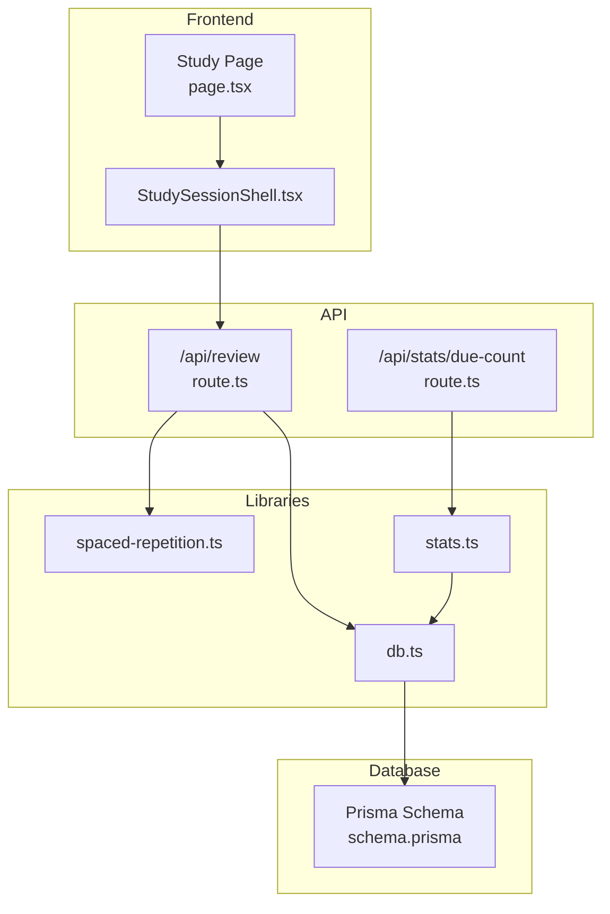
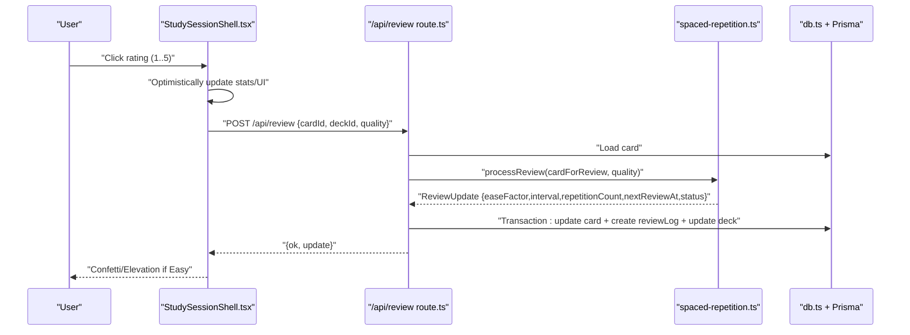
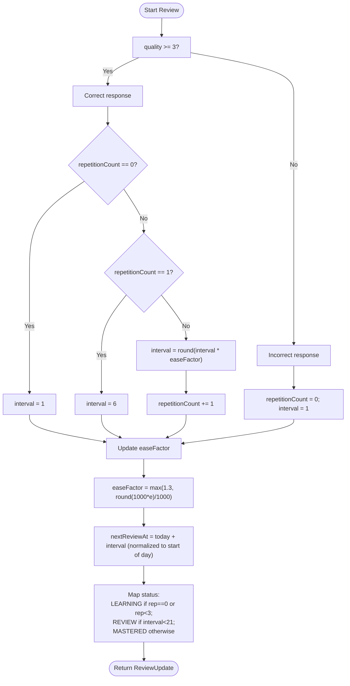
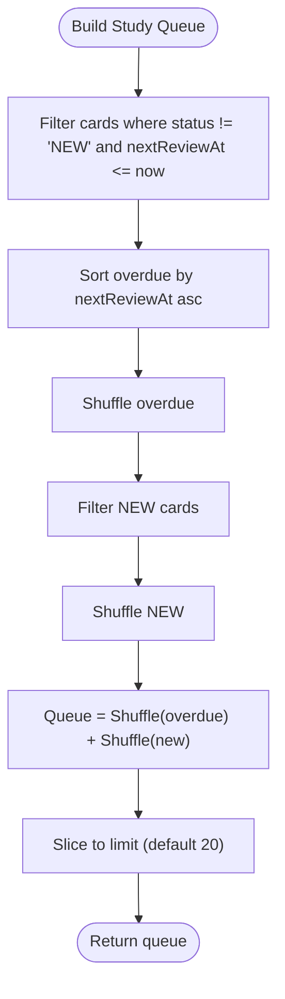
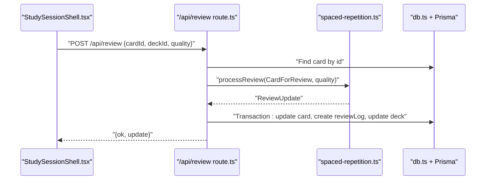
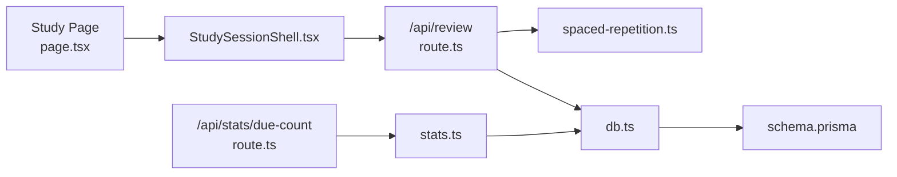
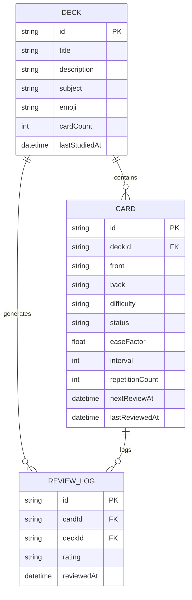

# Spaced Repetition System

<cite>
**Referenced Files in This Document**
- [spaced-repetition.ts](file://src/lib/spaced-repetition.ts)
- [route.ts](file://src/app/api/review/route.ts)
- [page.tsx](file://src/app/decks/[id]/study/page.tsx)
- [StudySessionShell.tsx](file://src/components/flashcard/StudySessionShell.tsx)
- [schema.prisma](file://prisma/schema.prisma)
- [db.ts](file://src/lib/db.ts)
- [stats.ts](file://src/lib/stats.ts)
- [route.ts](file://src/app/api/stats/due-count/route.ts)
- [constants.ts](file://src/lib/constants.ts)
- [DeckDetailCardList.tsx](file://src/components/deck/DeckDetailCardList.tsx)
- [ActivityHeatmap.tsx](file://src/components/stats/ActivityHeatmap.tsx)
- [MasteryRing.tsx](file://src/components/stats/MasteryRing.tsx)
</cite>

## Table of Contents
1. [Introduction](#introduction)
2. [Project Structure](#project-structure)
3. [Core Components](#core-components)
4. [Architecture Overview](#architecture-overview)
5. [Detailed Component Analysis](#detailed-component-analysis)
6. [Dependency Analysis](#dependency-analysis)
7. [Performance Considerations](#performance-considerations)
8. [Troubleshooting Guide](#troubleshooting-guide)
9. [Conclusion](#conclusion)
10. [Appendices](#appendices)

## Introduction
This document explains the spaced repetition system built on the SM-2 algorithm. It covers how reviews are scheduled, how difficulty and ease factors are adjusted, how cards are queued for study, and how the study interface integrates with the backend. It also documents statistics generation, progress monitoring, and customization options for learning parameters. The goal is to help both developers and learners understand how the system works and how to optimize study schedules and learning efficiency.

## Project Structure
The spaced repetition system spans several layers:
- Data model: Prisma schema defines Cards, Decks, and ReviewLogs.
- Backend API: Handles review submissions, due counts, and dashboard statistics.
- Frontend: Presents the study interface, collects ratings, and displays progress.
- Utilities: Implements the SM-2 algorithm, queue selection, and statistics helpers.

**Diagram sources**
- [page.tsx:30-91](file://src/app/decks/[id]/study/page.tsx#L30-L91)
- [StudySessionShell.tsx:42-430](file://src/components/flashcard/StudySessionShell.tsx#L42-L430)
- [route.ts:5-75](file://src/app/api/review/route.ts#L5-L75)
- [route.ts:1-15](file://src/app/api/stats/due-count/route.ts#L1-L15)
- [spaced-repetition.ts:29-76](file://src/lib/spaced-repetition.ts#L29-L76)
- [stats.ts:20-31](file://src/lib/stats.ts#L20-L31)
- [db.ts:1-68](file://src/lib/db.ts#L1-L68)
- [schema.prisma:10-51](file://prisma/schema.prisma#L10-L51)

**Section sources**
- [page.tsx:30-91](file://src/app/decks/[id]/study/page.tsx#L30-L91)
- [route.ts:5-75](file://src/app/api/review/route.ts#L5-L75)
- [spaced-repetition.ts:29-76](file://src/lib/spaced-repetition.ts#L29-L76)
- [stats.ts:20-31](file://src/lib/stats.ts#L20-L31)
- [schema.prisma:10-51](file://prisma/schema.prisma#L10-L51)

## Core Components
- SM-2 algorithm implementation: Calculates intervals, updates ease factors, and maps repetitions to statuses.
- Review submission pipeline: Validates input, computes updates, persists card state and review logs atomically.
- Study queue builder: Selects overdue and new cards, shuffles them, and limits the session size.
- Study interface: Presents cards, collects ratings, and tracks session statistics.
- Statistics and progress: Computes due counts, mastery rates, streaks, and activity heatmaps.

**Section sources**
- [spaced-repetition.ts:29-76](file://src/lib/spaced-repetition.ts#L29-L76)
- [route.ts:5-75](file://src/app/api/review/route.ts#L5-L75)
- [page.tsx:80-82](file://src/app/decks/[id]/study/page.tsx#L80-L82)
- [StudySessionShell.tsx:68-125](file://src/components/flashcard/StudySessionShell.tsx#L68-L125)
- [stats.ts:20-31](file://src/lib/stats.ts#L20-L31)

## Architecture Overview
The system follows a clean separation of concerns:
- The frontend triggers a review by sending a rating to the backend.
- The backend validates the request, loads the card, runs the SM-2 algorithm, and writes updates atomically to the database along with a review log.
- The study interface optimistically advances the UI and updates counters after the request completes.
- Statistics endpoints expose aggregated data for dashboards and progress views.

**Diagram sources**
- [StudySessionShell.tsx:68-125](file://src/components/flashcard/StudySessionShell.tsx#L68-L125)
- [route.ts:5-75](file://src/app/api/review/route.ts#L5-L75)
- [spaced-repetition.ts:29-76](file://src/lib/spaced-repetition.ts#L29-L76)
- [db.ts:1-68](file://src/lib/db.ts#L1-L68)
- [schema.prisma:24-50](file://prisma/schema.prisma#L24-L50)

## Detailed Component Analysis

### SM-2 Algorithm Mechanics
The algorithm determines the next interval and status based on the quality of recall:
- Correct recall (quality ≥ 3):
  - First recall: interval becomes 1 day.
  - Second recall: interval becomes 6 days.
  - Subsequent recalls: interval is rounded to the nearest integer of current interval multiplied by the ease factor.
  - Repetition count increments.
- Incorrect recall (quality < 3):
  - Resets repetition count to 0 and sets interval to 1 day.
- Ease factor adjustment:
  - The ease factor is updated using a formula that depends on the quality.
  - The ease factor is clamped to a minimum value and rounded to three decimal places.
- Status mapping:
  - NEW: repetitionCount == 0
  - LEARNING: repetitionCount < 3
  - REVIEW: interval < 21 days
  - MASTERED: otherwise

**Diagram sources**
- [spaced-repetition.ts:29-76](file://src/lib/spaced-repetition.ts#L29-L76)

**Section sources**
- [spaced-repetition.ts:29-76](file://src/lib/spaced-repetition.ts#L29-L76)

### Difficulty Scoring and Status Mapping
- Difficulty is stored per card and influences perceived challenge.
- Status is derived from repetition count and interval thresholds.
- Styles for difficulty and status are centralized for consistent UI rendering.

**Section sources**
- [schema.prisma:24-40](file://prisma/schema.prisma#L24-L40)
- [constants.ts:19-31](file://src/lib/constants.ts#L19-L31)
- [DeckDetailCardList.tsx:256-277](file://src/components/deck/DeckDetailCardList.tsx#L256-L277)

### Card Queue Management and Due Card Identification
- The queue prioritizes overdue cards first (newest overdue first), then shuffles them.
- New cards are shuffled separately and appended after overdue cards.
- The final queue is truncated to a configurable limit (default 20).
- An alternative “all” study mode shuffles all cards in the deck.

**Diagram sources**
- [spaced-repetition.ts:88-104](file://src/lib/spaced-repetition.ts#L88-L104)
- [page.tsx:76-82](file://src/app/decks/[id]/study/page.tsx#L76-L82)

**Section sources**
- [spaced-repetition.ts:88-104](file://src/lib/spaced-repetition.ts#L88-L104)
- [page.tsx:76-82](file://src/app/decks/[id]/study/page.tsx#L76-L82)

### Review Submission Pipeline
- Validates presence and range of inputs.
- Loads the card from the database.
- Converts the stored card to the internal CardForReview format.
- Runs the SM-2 computation to produce ReviewUpdate.
- Persists the card update, creates a review log, and updates deck timestamps atomically.

**Diagram sources**
- [StudySessionShell.tsx:79-96](file://src/components/flashcard/StudySessionShell.tsx#L79-L96)
- [route.ts:5-75](file://src/app/api/review/route.ts#L5-L75)
- [spaced-repetition.ts:29-76](file://src/lib/spaced-repetition.ts#L29-L76)
- [db.ts:1-68](file://src/lib/db.ts#L1-L68)
- [schema.prisma:24-50](file://prisma/schema.prisma#L24-L50)

**Section sources**
- [route.ts:5-75](file://src/app/api/review/route.ts#L5-L75)
- [spaced-repetition.ts:29-76](file://src/lib/spaced-repetition.ts#L29-L76)

### Study Interface and Rating System
- The interface supports keyboard shortcuts mapped to ratings.
- Ratings are validated and sent to the backend asynchronously.
- Optimistic UI updates improve responsiveness; completion screen summarizes session stats.

**Section sources**
- [StudySessionShell.tsx:68-125](file://src/components/flashcard/StudySessionShell.tsx#L68-L125)
- [StudySessionShell.tsx:128-158](file://src/components/flashcard/StudySessionShell.tsx#L128-L158)
- [spaced-repetition.ts:107-141](file://src/lib/spaced-repetition.ts#L107-L141)

### Statistics Generation and Progress Monitoring
- Due count: Counts cards that are due for review today (excluding NEW).
- Dashboard overview: Aggregates totals, mastery rate, study streak, heatmap, recent sessions, and deck segmentation.
- Heatmap: Visualizes review activity across a 12-week window.
- Mastery ring: Animates a percentage metric for mastery.

**Section sources**
- [route.ts:1-15](file://src/app/api/stats/due-count/route.ts#L1-L15)
- [stats.ts:20-31](file://src/lib/stats.ts#L20-L31)
- [stats.ts:51-221](file://src/lib/stats.ts#L51-L221)
- [ActivityHeatmap.tsx:14-74](file://src/components/stats/ActivityHeatmap.tsx#L14-L74)
- [MasteryRing.tsx:15-63](file://src/components/stats/MasteryRing.tsx#L15-L63)

## Dependency Analysis
The system exhibits clear layering:
- Frontend depends on the API for review submissions.
- API depends on the algorithm library and database utilities.
- Database schema defines the contract for card state and logs.
- Statistics module depends on the database to compute analytics.

**Diagram sources**
- [page.tsx:30-91](file://src/app/decks/[id]/study/page.tsx#L30-L91)
- [StudySessionShell.tsx:42-430](file://src/components/flashcard/StudySessionShell.tsx#L42-L430)
- [route.ts:5-75](file://src/app/api/review/route.ts#L5-L75)
- [spaced-repetition.ts:29-76](file://src/lib/spaced-repetition.ts#L29-L76)
- [db.ts:1-68](file://src/lib/db.ts#L1-L68)
- [schema.prisma:10-51](file://prisma/schema.prisma#L10-L51)
- [route.ts:1-15](file://src/app/api/stats/due-count/route.ts#L1-L15)
- [stats.ts:20-31](file://src/lib/stats.ts#L20-L31)

**Section sources**
- [page.tsx:30-91](file://src/app/decks/[id]/study/page.tsx#L30-L91)
- [StudySessionShell.tsx:42-430](file://src/components/flashcard/StudySessionShell.tsx#L42-L430)
- [route.ts:5-75](file://src/app/api/review/route.ts#L5-L75)
- [spaced-repetition.ts:29-76](file://src/lib/spaced-repetition.ts#L29-L76)
- [stats.ts:20-31](file://src/lib/stats.ts#L20-L31)

## Performance Considerations
- Queue building uses in-memory filtering and shuffling; ensure deck sizes remain reasonable to avoid large arrays.
- The default queue limit reduces latency and keeps sessions manageable.
- Atomic transactions in the review endpoint prevent inconsistent states and reduce retries.
- Database queries for due counts and dashboard data are optimized with targeted filters and projections.

[No sources needed since this section provides general guidance]

## Troubleshooting Guide
Common issues and resolutions:
- Missing fields or invalid quality in review submissions:
  - The API validates presence and range; ensure clients send cardId, deckId, and quality ∈ [0..5].
- Card not found:
  - Verify cardId exists and belongs to the requested deck.
- Transaction failures:
  - The API wraps card updates, review log creation, and deck updates in a transaction; check database connectivity and Prisma client configuration.
- Incorrect due counts:
  - Confirm nextReviewAt normalization to the start of the day and status exclusions for NEW cards.

**Section sources**
- [route.ts:15-26](file://src/app/api/review/route.ts#L15-L26)
- [spaced-repetition.ts:52-56](file://src/lib/spaced-repetition.ts#L52-L56)
- [db.ts:1-68](file://src/lib/db.ts#L1-L68)

## Conclusion
The system implements a robust SM-2-based spaced repetition engine with a clean frontend-backend split. The algorithm’s interval and ease adjustments, combined with a prioritized queue and optimistic UI updates, deliver an efficient and responsive study experience. Aggregated statistics and visualizations support progress tracking and help learners understand their learning efficiency.

[No sources needed since this section summarizes without analyzing specific files]

## Appendices

### Algorithm Inputs and Outputs
- Inputs:
  - CardForReview: id, front, back, difficulty, status, easeFactor, interval, repetitionCount, nextReviewAt, lastReviewedAt.
  - quality: integer in [0..5].
- Outputs:
  - ReviewUpdate: easeFactor, interval, repetitionCount, nextReviewAt, status.

**Section sources**
- [spaced-repetition.ts:7-26](file://src/lib/spaced-repetition.ts#L7-L26)
- [spaced-repetition.ts:29-76](file://src/lib/spaced-repetition.ts#L29-L76)

### Rating Options and Shortcuts
- Ratings are mapped to numeric values and presented with keyboard shortcuts in the study interface.

**Section sources**
- [spaced-repetition.ts:107-141](file://src/lib/spaced-repetition.ts#L107-L141)
- [StudySessionShell.tsx:149-154](file://src/components/flashcard/StudySessionShell.tsx#L149-L154)

### Data Model Overview

**Diagram sources**
- [schema.prisma:10-51](file://prisma/schema.prisma#L10-L51)