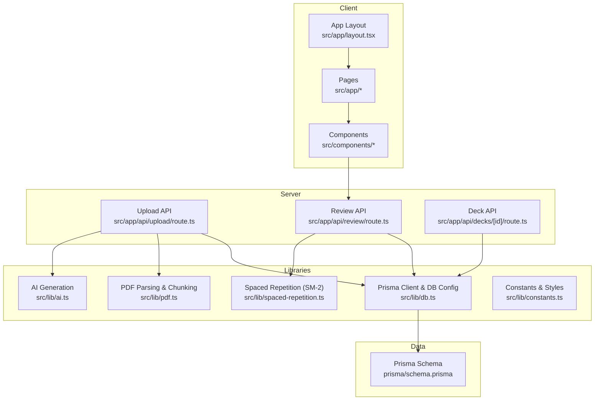
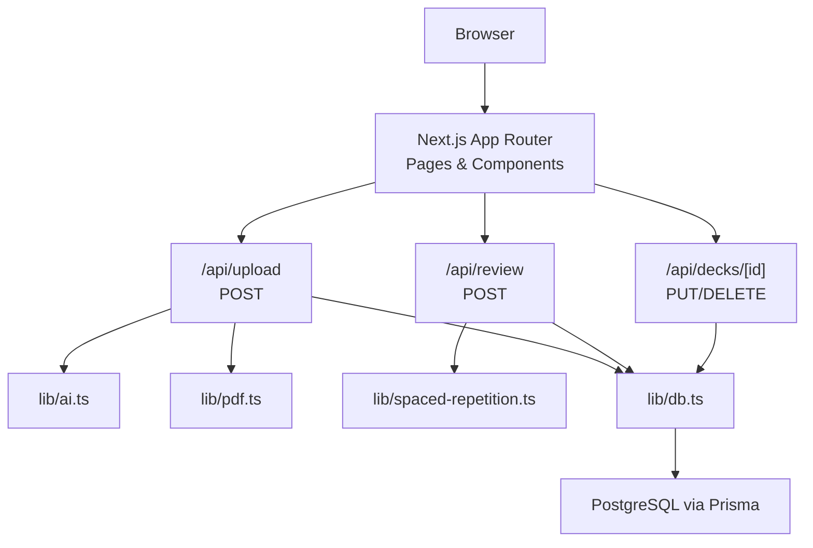
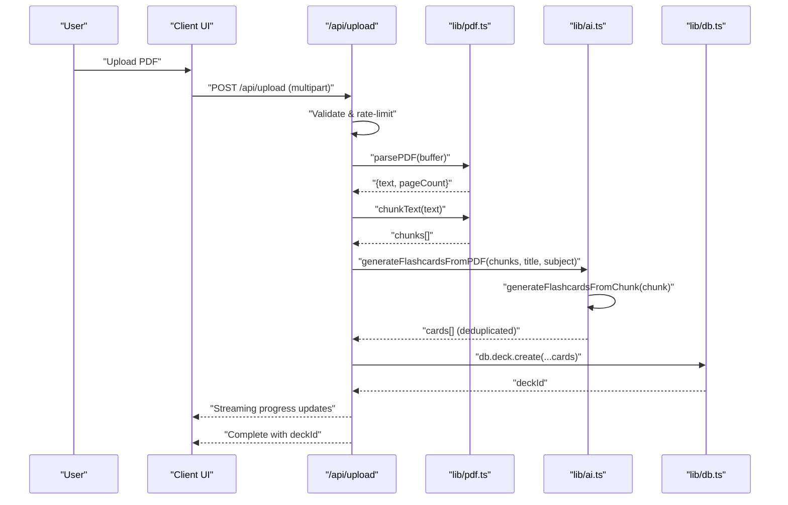
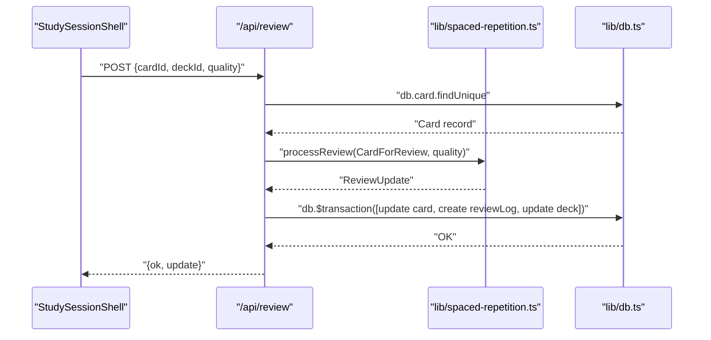
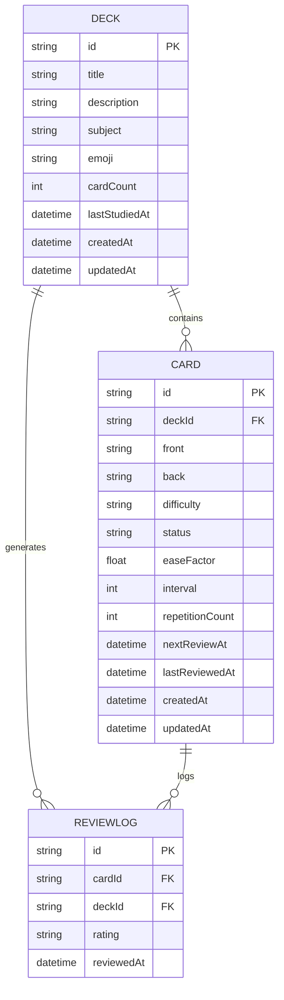
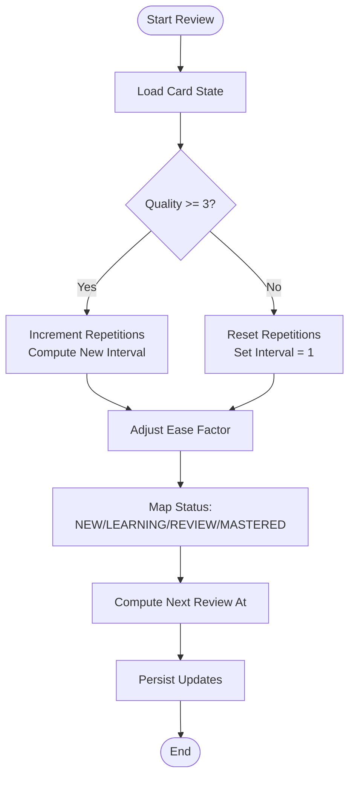
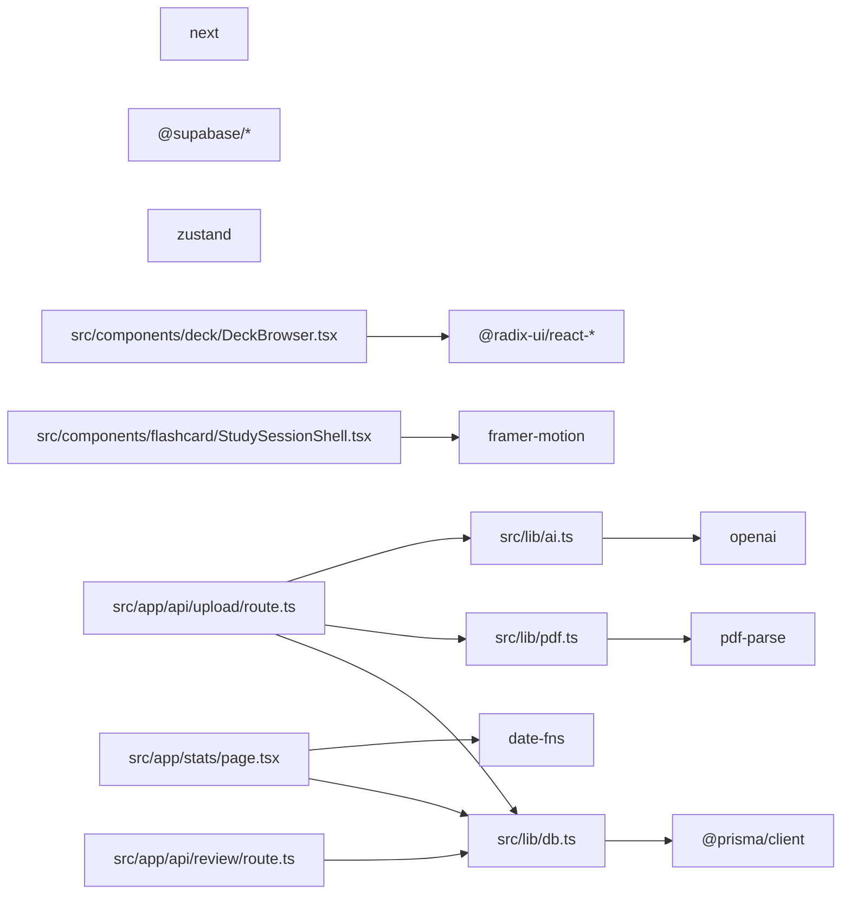

# Project Overview

<cite>
**Referenced Files in This Document**
- [README.md](file://README.md)
- [package.json](file://package.json)
- [src/app/layout.tsx](file://src/app/layout.tsx)
- [src/lib/constants.ts](file://src/lib/constants.ts)
- [src/lib/spaced-repetition.ts](file://src/lib/spaced-repetition.ts)
- [src/app/api/upload/route.ts](file://src/app/api/upload/route.ts)
- [src/app/api/review/route.ts](file://src/app/api/review/route.ts)
- [src/app/api/decks/[id]/route.ts](file://src/app/api/decks/[id]/route.ts)
- [src/components/flashcard/StudySessionShell.tsx](file://src/components/flashcard/StudySessionShell.tsx)
- [src/lib/ai.ts](file://src/lib/ai.ts)
- [prisma/schema.prisma](file://prisma/schema.prisma)
- [src/components/deck/DeckBrowser.tsx](file://src/components/deck/DeckBrowser.tsx)
- [src/app/stats/page.tsx](file://src/app/stats/page.tsx)
- [src/lib/pdf.ts](file://src/lib/pdf.ts)
- [src/lib/db.ts](file://src/lib/db.ts)
</cite>

## Table of Contents
1. [Introduction](#introduction)
2. [Project Structure](#project-structure)
3. [Core Components](#core-components)
4. [Architecture Overview](#architecture-overview)
5. [Detailed Component Analysis](#detailed-component-analysis)
6. [Dependency Analysis](#dependency-analysis)
7. [Performance Considerations](#performance-considerations)
8. [Troubleshooting Guide](#troubleshooting-guide)
9. [Conclusion](#conclusion)
10. [Appendices](#appendices)

## Introduction
Recall is a production-ready, mobile-first web application that transforms unformatted PDFs into intelligent flashcard decks powered by AI and optimizes retention with a native spaced repetition system. Its purpose is to accelerate learning by turning dense documents into adaptive, scientifically grounded review queues that schedule repetitions to maximize long-term retention.

Core value proposition:
- Instant conversion: Upload any PDF and receive curated flashcards in near real time.
- AI-powered generation: Structured, high-quality questions and answers designed for active recall.
- Native spaced repetition: Industry-standard SM-2 scheduling recalculated per review with dynamic ease factors.
- Analytics-driven insights: Track mastery, streaks, and upcoming reviews to stay on track.

Target audience:
- Learners preparing for exams, certifications, or professional development.
- Students seeking efficient, evidence-based study systems.
- Educators and trainers who want to quickly scaffold learning materials from PDFs.

Key features:
- PDF-to-flashcard conversion pipeline with streaming progress.
- AI content generation with robust fallbacks and deduplication.
- Spaced repetition engine implementing SM-2 with dynamic scheduling.
- Analytics dashboard for mastery, activity, and upcoming reviews.
- Mobile-first UI with immersive study sessions and keyboard controls.

## Project Structure
Recall follows a Next.js App Router project layout with a clear separation of server-side APIs, client components, libraries for domain logic, and persistent data modeling.

**Diagram sources**
- [src/app/layout.tsx:1-52](file://src/app/layout.tsx#L1-L52)
- [src/app/api/upload/route.ts:1-298](file://src/app/api/upload/route.ts#L1-L298)
- [src/app/api/review/route.ts:1-76](file://src/app/api/review/route.ts#L1-L76)
- [src/app/api/decks/[id]/route.ts:1-43](file://src/app/api/decks/[id]/route.ts#L1-L43)
- [src/lib/ai.ts:1-233](file://src/lib/ai.ts#L1-L233)
- [src/lib/pdf.ts:1-112](file://src/lib/pdf.ts#L1-L112)
- [src/lib/spaced-repetition.ts:1-141](file://src/lib/spaced-repetition.ts#L1-L141)
- [src/lib/db.ts:1-68](file://src/lib/db.ts#L1-L68)
- [prisma/schema.prisma:1-51](file://prisma/schema.prisma#L1-L51)

**Section sources**
- [README.md:1-102](file://README.md#L1-L102)
- [package.json:1-56](file://package.json#L1-L56)
- [src/app/layout.tsx:1-52](file://src/app/layout.tsx#L1-L52)

## Core Components
- Spaced Repetition Engine (SM-2): Implements the SM-2 algorithm to compute intervals, ease factors, and status transitions, and builds a study queue prioritizing overdue cards.
- AI-Powered Content Generation: Generates flashcards from PDF chunks with structured prompts, fallback models, and deduplication.
- PDF Processing Pipeline: Parses PDFs, cleans text, and splits into overlapping chunks optimized for AI consumption.
- Study Session Shell: Provides an immersive, keyboard-friendly study interface with animated card flips and immediate feedback.
- Analytics Dashboard: Computes mastery percentages, streaks, and upcoming reviews from database records.
- Decks Browser: Filters, sorts, and renders decks with due counts and mastery indicators.

**Section sources**
- [src/lib/spaced-repetition.ts:1-141](file://src/lib/spaced-repetition.ts#L1-L141)
- [src/lib/ai.ts:1-233](file://src/lib/ai.ts#L1-L233)
- [src/lib/pdf.ts:1-112](file://src/lib/pdf.ts#L1-L112)
- [src/components/flashcard/StudySessionShell.tsx:1-430](file://src/components/flashcard/StudySessionShell.tsx#L1-L430)
- [src/app/stats/page.tsx:1-187](file://src/app/stats/page.tsx#L1-L187)
- [src/components/deck/DeckBrowser.tsx:1-188](file://src/components/deck/DeckBrowser.tsx#L1-L188)

## Architecture Overview
Recall uses a layered architecture:
- Presentation: Next.js App Router pages and components with a glassmorphism UI.
- Application: Route handlers under src/app/api orchestrate workflows and call library functions.
- Domain: Libraries encapsulate AI generation, PDF parsing, spaced repetition, and database access.
- Data: Prisma ORM models Deck, Card, and ReviewLog mapped to a PostgreSQL database.

**Diagram sources**
- [src/app/api/upload/route.ts:1-298](file://src/app/api/upload/route.ts#L1-L298)
- [src/app/api/review/route.ts:1-76](file://src/app/api/review/route.ts#L1-L76)
- [src/app/api/decks/[id]/route.ts:1-43](file://src/app/api/decks/[id]/route.ts#L1-L43)
- [src/lib/ai.ts:1-233](file://src/lib/ai.ts#L1-L233)
- [src/lib/pdf.ts:1-112](file://src/lib/pdf.ts#L1-L112)
- [src/lib/spaced-repetition.ts:1-141](file://src/lib/spaced-repetition.ts#L1-L141)
- [src/lib/db.ts:1-68](file://src/lib/db.ts#L1-L68)
- [prisma/schema.prisma:1-51](file://prisma/schema.prisma#L1-L51)

## Detailed Component Analysis

### PDF-to-Flashcard Conversion Workflow
This workflow converts uploaded PDFs into spaced-repetition flashcards with streaming progress and deduplicated results.

**Diagram sources**
- [src/app/api/upload/route.ts:86-298](file://src/app/api/upload/route.ts#L86-L298)
- [src/lib/pdf.ts:13-112](file://src/lib/pdf.ts#L13-L112)
- [src/lib/ai.ts:168-233](file://src/lib/ai.ts#L168-L233)
- [src/lib/db.ts:51-68](file://src/lib/db.ts#L51-L68)

**Section sources**
- [src/app/api/upload/route.ts:86-298](file://src/app/api/upload/route.ts#L86-L298)
- [src/lib/pdf.ts:13-112](file://src/lib/pdf.ts#L13-L112)
- [src/lib/ai.ts:168-233](file://src/lib/ai.ts#L168-L233)

### Spaced Repetition Review Flow
The review flow updates card state and logs using the SM-2 algorithm within a transaction.

**Diagram sources**
- [src/components/flashcard/StudySessionShell.tsx:79-125](file://src/components/flashcard/StudySessionShell.tsx#L79-L125)
- [src/app/api/review/route.ts:5-76](file://src/app/api/review/route.ts#L5-L76)
- [src/lib/spaced-repetition.ts:29-76](file://src/lib/spaced-repetition.ts#L29-L76)
- [src/lib/db.ts:51-68](file://src/lib/db.ts#L51-L68)

**Section sources**
- [src/components/flashcard/StudySessionShell.tsx:79-125](file://src/components/flashcard/StudySessionShell.tsx#L79-L125)
- [src/app/api/review/route.ts:5-76](file://src/app/api/review/route.ts#L5-L76)
- [src/lib/spaced-repetition.ts:29-76](file://src/lib/spaced-repetition.ts#L29-L76)

### Data Model Overview
The Prisma schema defines three core entities: Deck, Card, and ReviewLog, capturing the lifecycle of knowledge units and review history.

**Diagram sources**
- [prisma/schema.prisma:10-51](file://prisma/schema.prisma#L10-L51)

**Section sources**
- [prisma/schema.prisma:10-51](file://prisma/schema.prisma#L10-L51)

### Spaced Repetition Algorithm Details
The SM-2 implementation computes intervals, adjusts ease factors, and transitions statuses based on quality ratings.

**Diagram sources**
- [src/lib/spaced-repetition.ts:29-76](file://src/lib/spaced-repetition.ts#L29-L76)

**Section sources**
- [src/lib/spaced-repetition.ts:29-76](file://src/lib/spaced-repetition.ts#L29-L76)

### Practical Workflow Examples

- Complete workflow from upload to study:
  1. User navigates to the upload page and selects a PDF.
  2. The upload route parses the PDF, chunks the text, generates flashcards via AI, deduplicates, and persists a deck with cards.
  3. The user browses decks, selects a deck, and starts a study session.
  4. The study shell presents cards, records ratings, and updates the database with SM-2 calculations.
  5. The analytics dashboard displays mastery, streaks, and upcoming reviews.

- Conceptual steps:
  - PDF upload validates file type and size, streams progress, and returns a deck identifier upon completion.
  - Review submissions update card intervals and statuses atomically with review logs.
  - Decks can be edited or deleted through dedicated API endpoints.
  - Analytics aggregates data from cards and logs to render charts and summaries.

**Section sources**
- [src/app/api/upload/route.ts:86-298](file://src/app/api/upload/route.ts#L86-L298)
- [src/app/api/review/route.ts:5-76](file://src/app/api/review/route.ts#L5-L76)
- [src/app/api/decks/[id]/route.ts:4-43](file://src/app/api/decks/[id]/route.ts#L4-L43)
- [src/app/stats/page.tsx:14-187](file://src/app/stats/page.tsx#L14-L187)

## Dependency Analysis
The application’s dependencies are organized around Next.js, UI libraries, AI clients, PDF parsing, and database access.

**Diagram sources**
- [package.json:18-41](file://package.json#L18-L41)
- [src/lib/ai.ts:1-233](file://src/lib/ai.ts#L1-L233)
- [src/lib/pdf.ts:1-112](file://src/lib/pdf.ts#L1-L112)
- [src/lib/db.ts:1-68](file://src/lib/db.ts#L1-L68)
- [src/app/api/upload/route.ts:1-298](file://src/app/api/upload/route.ts#L1-L298)
- [src/app/api/review/route.ts:1-76](file://src/app/api/review/route.ts#L1-L76)
- [src/components/flashcard/StudySessionShell.tsx:1-430](file://src/components/flashcard/StudySessionShell.tsx#L1-L430)
- [src/components/deck/DeckBrowser.tsx:1-188](file://src/components/deck/DeckBrowser.tsx#L1-L188)
- [src/app/stats/page.tsx:1-187](file://src/app/stats/page.tsx#L1-L187)

**Section sources**
- [package.json:18-41](file://package.json#L18-L41)

## Performance Considerations
- Streaming progress: The upload route uses a TransformStream to emit incremental updates, improving perceived performance and responsiveness.
- Chunked AI processing: PDF chunks are processed incrementally with pacing to respect free-tier rate limits and improve reliability.
- Rate limiting: IP-based rate limiting prevents abuse and stabilizes upstream API throughput.
- Database pooling: The Prisma client configuration selects appropriate URLs and enforces SSL for serverless environments.
- Client-side optimistic updates: Study session ratings update immediately and reconcile with server responses to reduce latency.

[No sources needed since this section provides general guidance]

## Troubleshooting Guide
Common issues and resolutions:
- Missing environment variables:
  - DATABASE_URL must be set in the deployment environment for database connectivity.
  - OPENROUTER_API_KEY must be configured to enable AI generation.
- Database connectivity:
  - Verify the database URL points to PostgreSQL; SQLite is not supported on Vercel due to ephemeral filesystem constraints.
- AI generation failures:
  - Free-tier quotas and rate limits can trigger 429 responses; retry after cooling off.
  - Model availability errors indicate temporary service issues; the system retries with fallback models.
- PDF parsing:
  - Very small extracted text length suggests the PDF is image-based or contains insufficient text; use a different source.
- Upload size limits:
  - Files larger than 20 MB are rejected; compress or split the source PDF.

**Section sources**
- [src/app/api/upload/route.ts:88-106](file://src/app/api/upload/route.ts#L88-L106)
- [src/app/api/upload/route.ts:133-151](file://src/app/api/upload/route.ts#L133-L151)
- [src/lib/ai.ts:100-125](file://src/lib/ai.ts#L100-L125)
- [README.md:18-22](file://README.md#L18-L22)

## Conclusion
Recall delivers a seamless learning pipeline from PDF ingestion to adaptive review scheduling. By combining a robust SM-2 engine, reliable AI generation, and a mobile-first UI, it enables users to build mastery-efficient study sets and track progress with actionable insights. The modular architecture and clear separation of concerns support maintainability and extensibility for future enhancements.

[No sources needed since this section summarizes without analyzing specific files]

## Appendices

### Technology Stack and Design Philosophy
- Framework: Next.js 14 with App Router for server-side rendering and routing.
- Styling: Tailwind CSS and Framer Motion for animations and responsive design.
- Database: Prisma with PostgreSQL (via Supabase).
- AI: OpenRouter with fallback models and structured prompts.
- Local state: Zustand for lightweight client-side stores.
- PDF extraction: pdf-parse with Node-compatible polyfills.
- Deployment: Vercel with environment-specific database URL selection.

Design philosophy highlights:
- SM-2 integration: Dynamic scheduling without external cron jobs.
- Micro-interaction UI: Dark-themed, glass-like components with subtle animations.
- Server-side rendered intelligence: Asynchronous PDF processing and rate-limited AI calls.
- Security: Keys remain server-side; sensitive operations are protected from client exposure.

**Section sources**
- [README.md:9-98](file://README.md#L9-L98)
- [package.json:18-41](file://package.json#L18-L41)